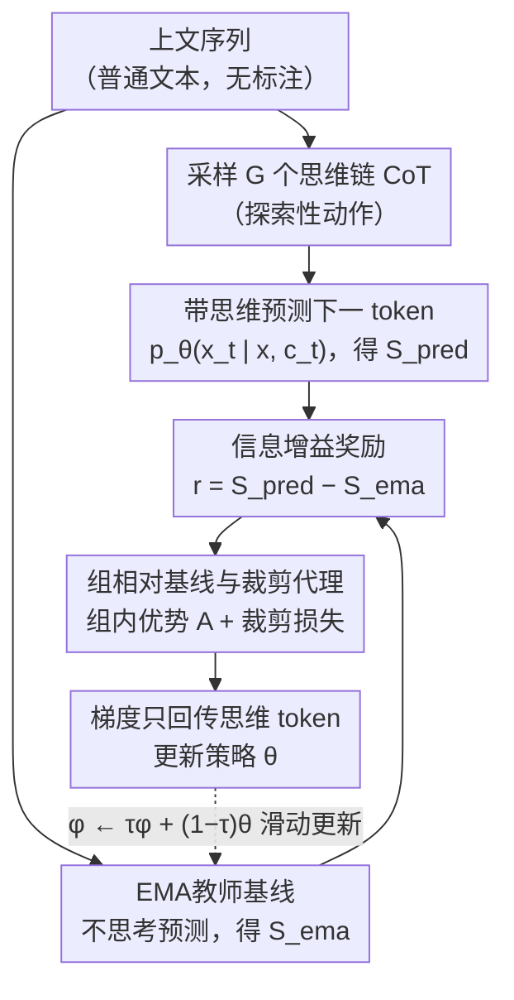

# RLP: Reinforcement as a Pretraining Objective

**会议**: ICLR 2026  
**arXiv**: [2510.01265](https://arxiv.org/abs/2510.01265)  
**代码**: 无  
**领域**: 强化学习  
**关键词**: 预训练, 信息增益, Chain-of-Thought, 强化学习, 下一token预测

## 一句话总结

提出RLP（Reinforcement Learning Pretraining），一种信息增益驱动的RL预训练目标，通过奖励能提升下一token预测概率的思维链（CoT），将RL从后训练阶段前移到预训练阶段，实现无验证器的密集奖励信号。

## 研究背景与动机

当前LLM的标准训练流程是"预训练（NTP）→ SFT → RLHF/RLVR"，其中强化学习仅出现在最后阶段，且依赖特定任务的验证器或人类反馈。然而，人类理解文本并非逐token线性处理，而是将输入与先验知识并行整合。标准NTP预训练缺乏这种机制，限制了模型在学习过程中进行推理和知识基础化的能力。

核心问题：**能否将RL的探索精神（探索性CoT生成）带入预训练阶段？**

本文的核心idea是将CoT视为一种"动作"：在预测每个下一token前，模型先采样一段内部思考，奖励信号是思考对预测准确性的提升程度（信息增益）。这一设计无需验证器，可在通用文本上训练。

## 方法详解

### 整体框架

RLP把强化学习的"先思考再行动"塞进了普通的下一token预测里。在标准NTP中，模型看到上下文 $x_{<t}$ 直接预测 $x_t$；RLP则在每个位置 $t$ 先让模型从 $x_{<t}$ 采样一段内部思维 $c_t$（相当于一个"动作"），再基于 $(x_{<t}, c_t)$ 去预测 $x_t$。这段思维好不好，不靠外部验证器打分，而是看它把 $x_t$ 的预测概率提升了多少——比起一个"不思考"的参照基线提升越多，奖励越高。这样整条通用文本的每个位置都能产生一个密集的标量奖励，RL 因此得以在预训练阶段、在无标注语料上运行。整个流程由三部分串起来：先用「信息增益奖励」把思考的价值量化成标量，奖励里的"不思考"参照由「EMA教师基线」提供，最后用「组相对基线与裁剪代理」把这个高方差信号变成稳定的策略更新。

### 关键设计

**1. 信息增益奖励：把"思考有没有用"量化成可优化的标量**

RL 要前移到预训练，第一道坎是没有验证器告诉模型答案对不对。RLP 绕开这一点，直接拿"思考前后预测概率的变化"当奖励：$r(c_t) = S_{\text{pred}}(c_t) - S_{\text{ema}}$，其中 $S_{\text{pred}}(c_t) = \log p_\theta(x_t \mid x_{<t}, c_t)$ 是带思维时对真实下一token的对数概率，$S_{\text{ema}} = \log \bar{p}_\phi(x_t \mid x_{<t})$ 是一个不思考的基线给出的对数概率。当且仅当思维真的让预测更准时，这个对数似然比为正。论文的 Proposition 1 进一步说明，这个奖励的期望等于交叉熵的下降量，因此优化它等价于让模型学会"想得对预测就更准"——而且每个位置都能算出来，既不用学 value 函数，也不用任何外部判分。

**2. EMA教师基线：给奖励一个既稳定又不退化的参照点**

奖励的高低完全取决于拿谁当"不思考"的参照 $\bar{p}_\phi$。如果用一个冻结的旧模型当基线，训练越久当前模型偏离它越远，奖励会被刷成虚高，诱发 reward hacking；反过来如果让基线和当前模型完全同步，两边概率一样，对数似然比直接归零，奖励信号消失。RLP 用指数滑动平均的教师来折中：$\phi \leftarrow \tau\phi + (1-\tau)\theta$，$\tau=0.999$，初始化为当前模型。这相当于让基线以一步延迟的方式平滑跟随策略，既保留了足够的信息量，又不会被策略的瞬时波动带偏，从而兼顾奖励的有效性和训练稳定性。

**3. 组相对基线与裁剪代理：压方差、稳更新**

单个思维样本的奖励噪声大，直接优化方差高。RLP 在每个位置采样 $G$ 个思维，用组内奖励的均值 $\bar{r}$ 当 baseline 算优势。但朴素的 inclusive mean 会带来 $(1-1/G)$ 的收缩偏差，于是改用修正形式 $A^{(i)} = \frac{G}{G-1}\big(r(c_t^{(i)}) - \bar{r}\big)$ 把这个偏差消掉。在此之上对思维token施加 PPO 式的裁剪代理损失 $\mathcal{L}_{\text{clip}}$，限制单步策略更新幅度，避免某次大梯度把策略推飞——本质上是把成熟的 GRPO/PPO 稳定化技巧搬到了 token 级的思维优化上。

### 损失函数 / 训练策略

RLP **不叠加标准 NTP 损失**，只优化信息增益目标本身：$\max_\theta J(\theta) = \mathbb{E}[r(c_t)]$。梯度只回传到思维token；奖励计算中的 $p_\theta$ 与 $\bar{p}_\phi$ 都做 stop-gradient，防止模型通过改变预测分布去"凑"奖励而非真正改进思维。工程上为控制成本，每个文档只随机挑一个token位置施加 RLP，其余位置仍走常规预测。

## 实验关键数据

### 主实验（qwen3-1.7b-base，8基准平均）

| 模型 | 数学平均 | 科学平均 | 总平均 |
|------|---------|---------|--------|
| $\mathcal{M}_{\text{base}}$ | 24.35 | 34.50 | 30.32 |
| $\mathcal{M}_{\text{CPT}}$（连续预训练） | 30.77 | 32.01 | 30.85 |
| $\mathcal{M}_{\text{RLP}}$ | **31.74** | **39.68** | **36.03** |
| $\mathcal{M}_{\text{base}}$+Post | 34.29 | 42.38 | 39.34 |
| $\mathcal{M}_{\text{CPT}}$+Post | 34.63 | 42.73 | 39.90 |
| $\mathcal{M}_{\text{RLP}}$+Post | **36.03** | **45.74** | **42.51** |

### 消融实验（Nemotron-Nano-12B-v2扩展）

| 配置 | 总平均 | 说明 |
|------|--------|------|
| 基座模型 | 42.81% | 强基线 |
| +RLP | **61.32%** | +18.5个百分点 |
| 科学推理提升 | +23% | 泛化到非数学领域 |

### 关键发现
- RLP相对基座模型提升19%，相对连续预训练提升17%，确认增益来自方法而非计算
- 后训练后增益不被洗掉反而复合：RLP+Post比CPT+Post高7-8%
- 在AIME25等推理密集基准上收益最大（5.02 vs 3.96 vs 2.25）
- 在通用网页语料上训练也有效——不局限于数学数据

## 亮点与洞察

- **范式性创新**：将RL从后训练前移到预训练，改变了"预训练→SFT→RL"的固定流程
- **无验证器、通用文本**：奖励完全从模型自身的预测能力计算，可应用于任意文本
- **信息增益的理论保证**：Proposition 1和2建立了奖励与交叉熵下降、边际化思维的关系
- **与后训练正交复合**：RLP建立的推理基础在SFT/RLVR后不仅保持且放大

## 局限与展望

- 每个文档仅选1个位置应用RLP，全位置应用的效果和成本值得探索
- CoT长度对效果的影响需要更系统的分析
- 当前EMA decay $\tau=0.999$ 为固定值，自适应调节可能更优
- 需要更多非英语、非STEM领域的验证

## 相关工作与启发

- RPT（Dong et al., 2025）也做RL预训练但使用稀疏二元奖励且依赖代理模型过滤，RLP在每个位置提供连续信号
- 与RLHF/RLVR的关键区别：RLP不需要任何外部验证器或人类标注
- 启示：预训练阶段注入"思考习惯"可能比后训练阶段才教模型推理更加根本

## 评分
- 新颖性: ⭐⭐⭐⭐⭐ RL预训练+信息增益奖励的设计具有范式意义
- 实验充分度: ⭐⭐⭐⭐⭐ 多模型规模、多数据域、后训练验证、对比消融
- 写作质量: ⭐⭐⭐⭐⭐ 理论-方法-实验三部分衔接紧密
- 价值: ⭐⭐⭐⭐⭐ 开辟了RL预训练这一新方向，具有广泛影响力

<!-- RELATED:START -->

## 相关论文

- [\[ICLR 2026\] A Reward-Free Viewpoint on Multi-Objective Reinforcement Learning](a_reward-free_viewpoint_on_multi-objective_reinforcement_learning.md)
- [\[ICLR 2026\] Webscale-RL: Automated Data Pipeline for Scaling RL Data to Pretraining Levels](webscale-rl_automated_data_pipeline_for_scaling_rl_data_to_pretraining_levels.md)
- [\[ICLR 2026\] Robust Multi-Objective Controlled Decoding of Large Language Models](robust_multi-objective_controlled_decoding_of_large_language_models.md)
- [\[ICLR 2026\] Dual-Objective Reinforcement Learning with Novel Hamilton-Jacobi-Bellman Formulations](dual-objective_reinforcement_learning_with_novel_hamilton-jacobi-bellman_formula.md)
- [\[ICLR 2026\] AMPED: Adaptive Multi-objective Projection for balancing Exploration and skill Diversification](amped_adaptive_multi-objective_projection_for_balancing_exploration_and_skill_di.md)

<!-- RELATED:END -->
