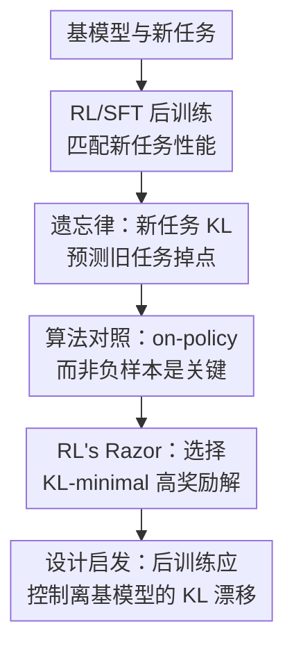

# RL's Razor: Why Online Reinforcement Learning Forgets Less

**会议**: ICLR2026  
**OpenReview**: [https://openreview.net/forum?id=7HNRYT4V44](https://openreview.net/forum?id=7HNRYT4V44)  
**代码**: 未公开  
**领域**: 强化学习 / 持续学习理论  
**关键词**: 在线强化学习, 灾难性遗忘, KL散度, 策略梯度, 持续学习  

## 一句话总结
本文发现新任务分布上的基模型与微调模型 KL 散度能预测灾难性遗忘，并解释了为什么 on-policy RL 相比 SFT 更倾向于找到离原策略更近的高奖励解，从而在学会新任务时忘得更少。

## 研究背景与动机
**领域现状**：基础模型正在成为语言、视觉和机器人系统的通用骨架，部署后的模型往往还需要通过后训练获得新能力。最常见的两类后训练路径是监督微调（SFT）和强化学习（RL）：前者模仿外部标注分布，后者基于奖励从模型自身采样的输出中更新策略。

**现有痛点**：模型学习新任务时经常出现灾难性遗忘，也就是新任务性能上去了，原本在推理、问答、指令遵循、代码或机器人操作上的能力却下降。传统持续学习方法常从参数变化、特征保持、旧任务输出蒸馏等角度约束遗忘，但基础模型的旧任务集合非常大，甚至没有明确边界，因此很难直接拿“旧任务分布”来做可操作的诊断。

**核心矛盾**：SFT 和 RL 有时能达到相近的新任务准确率，但它们对旧能力的破坏程度很不一样。若只看最终新任务分数，二者似乎都“学会了”；但从旧任务保持来看，SFT 往往通过把输出分布拉向某个外部标注分布来获得新能力，而 RL 的 on-policy 更新更像是在原模型已经愿意给一定概率的候选中重新分配概率质量。

**本文目标**：作者想回答两个问题：第一，什么变量真正决定遗忘程度，并且这个变量最好能在新任务上测量，不依赖旧任务数据；第二，为什么 RL 在匹配新任务性能时通常比 SFT 忘得少，这个优势来自奖励中的负样本、优化路径，还是 on-policy 数据本身。

**切入角度**：论文从“同一个新任务有很多等价解”这个观察入手。比如 parity MNIST 中，偶数图像预测任意偶数标签都算对；生成式任务中，同一个问题也可以有很多正确回答。若多种输出分布都能解决新任务，那么训练算法选中哪一种分布就很关键：离基模型越远，越可能扰动原本承载旧能力的分布结构。

**核心 idea**：RL's Razor 的核心观点是：在所有能解决新任务的策略中，on-policy RL 隐式偏好 KL 上最接近原始策略的解；而遗忘程度主要由新任务分布上的 KL 漂移决定。

## 方法详解
### 整体框架
这篇论文不是提出一个新的 RL 算法，而是建立一条解释链：先在 LLM 和机器人策略上观察 RL 比 SFT 忘得少，再用受控的 ParityMNIST 设置验证“遗忘由 KL 漂移预测”，最后通过算法对照和理论分析说明 on-policy 更新为什么会偏向低 KL 解。论文里的“方法”更像一套诊断框架：把新任务性能、旧任务保持、KL 漂移和训练目标放在同一个坐标系里比较。

### 关键设计
**1. 遗忘律：用新任务上的 KL 漂移解释旧能力下降**

论文最重要的变量不是参数空间里的 L1/L2 距离，也不是梯度稀疏性或表示层漂移，而是基模型 $\pi_0$ 与微调后策略 $\pi$ 在新任务输入 $x \sim \tau$ 上的输出分布差异。作者重点使用的形式是 $E_{x\sim\tau}[KL(\pi_0 \| \pi)]$，也报告 reverse KL、TV 和分布 L2 等候选距离。这里的关键不是说旧任务不重要，而是旧任务分布在基础模型场景下难以界定；若新任务 KL 与旧任务 KL 高度相关，那么只在新任务上测量 KL 就能给出可操作的遗忘预测。

这个发现让 RL 与 SFT 的差异变成一个统一问题：如果两种方法的遗忘都落在同一条“KL-遗忘”曲线上，那么算法名称本身不是遗忘的根因；真正决定旧能力是否保住的是微调后分布离基模型有多远。ParityMNIST 中二次拟合达到 $R^2=0.96$，LLM 实验中也有 $R^2=0.71$ 的相关性，说明这个规律在可控 toy setting 和真实中等规模基础模型上都成立。

**2. RL's Razor：on-policy 更新隐式选择离基策略最近的可行解**

SFT 的目标是模仿固定外部标注分布 $\pi_\beta$，典型形式为 $L_{SFT}(\pi)=-E_{x\sim D,y\sim\pi_\beta}[\log \pi(y|x)]$。如果标注分布本身离基模型很远，SFT 就会把模型拉向这个远处目标，即使还有别的、同样正确但更接近原模型的输出分布可选。RL 的策略梯度目标则可写作 $L_{RL}(\pi)=-E_{x\sim D,y\sim\pi}[A(x,y)\log \pi(y|x)]$，样本来自当前策略自己，更新是在当前分布的支撑附近重新加权。

这就是“剃刀”的含义：面对很多能拿高奖励的策略，RL 会优先走向与当前策略 KL 更近的那个，而不是像 SFT 一样被外部标签指定到某个任意解。论文在二元奖励的有限集合上给出形式化说明：从策略 $p$ 中拒绝采样只保留 $R(y)=1$ 的样本，得到的分布 $q_{RS}$ 等价于在所有完美奖励分布中最小化 $DKL(q\|p)$ 的 I-projection；随后策略梯度对该重加权分布做 M-projection。若策略族满足简化凸性条件，这个交替过程会收敛到 $\pi^\dagger=\arg\min_{\pi\in P^*\cap\Pi}DKL(\pi\|\pi_0)$。

**3. 因果拆分：负样本不是主因，on-policy 数据才是主因**

RL 和 SFT 的差异可能来自两个地方：RL 从自身策略采样，且常常会给低奖励样本负优势；SFT 则使用离线正例，没有显式负样本。为了拆开这两个因素，作者构造了四象限对照：GRPO 是 on-policy 且使用负样本，1-0 REINFORCE 是 on-policy 但只给正确样本正权重，SFT 是 offline 且只有正例，SimPO 是 offline 但引入正负样本偏好。

Science Q&A 实验显示，1-0 REINFORCE 的表现更接近 GRPO，而 SimPO 更接近 SFT。也就是说，是否包含负样本并不能解释“忘得少”；关键在于数据是不是从当前模型自己采样。这个设计很干净，因为它把“RL 有负例所以保守”这种解释排除掉，支持了本文主张的 on-policy KL-minimal bias。

**4. Oracle SFT：验证问题在目标分布而不在算法标签**

如果 KL 真是遗忘的决定变量，那么 SFT 只要被喂给 KL 最小的正确分布，也应该忘得少。作者在 ParityMNIST 中利用任务结构构造 oracle SFT distribution：在所有能达到 100% parity accuracy 的标签分布里，选择与预训练分布 $\pi_0$ KL 最近的分布。用这个 oracle 分布训练 SFT 后，模型甚至比普通 RL 保留更多 FashionMNIST 能力。

这一步很关键，因为它避免把结论说成“RL 天生更好”。更准确的说法是：RL 的 on-policy 机制天然比较容易找到低 KL 解；如果 SFT 的监督分布也被设计成低 KL，它同样可以保留旧能力。换言之，遗忘不是由优化器名字决定，而是由最终学到的输出分布决定。

### 一个完整示例
以 ParityMNIST 为例，模型输入是一张 MNIST 数字图像，任务不是预测具体数字，而是预测同奇偶性的任意标签。假设一张图真实数字是 8，那么输出 0、2、4、6、8 都算正确。普通 SFT 可能规定所有偶数都标成 0，或者随机在 0 和 4 之间选；这两种标注都能让新任务正确，但会强行压扁原本更丰富的数字分布。

RL 的行为不同。若基模型看到这张 8 的图像时本来给 8 较高概率、给 6 和 4 一些概率、给 0 很低概率，那么 on-policy RL 主要会从这些原本有概率的偶数候选里采样，并通过奖励把奇数概率压下去。它不需要把所有偶数图像都拉到标签 0，因此新任务准确率可以上升，但输出分布仍保留更多基模型结构。oracle SFT 则相当于提前知道这种“最接近基模型的正确分布”，直接用它作为监督标签，于是进一步验证了低 KL 分布才是遗忘少的关键。

### 损失函数 / 训练策略
论文比较的主要训练目标包括 SFT、GRPO、1-0 REINFORCE、SimPO，以及带 KL regularization 的变体。SFT 使用交叉熵拟合外部标注分布：$L_{SFT}(\pi)=-E_{x\sim D,y\sim\pi_\beta}[\log \pi(y|x)]$。RL 使用策略梯度形式：$L_{RL}(\pi)=-E_{x\sim D,y\sim\pi}[A(x,y)\log \pi(y|x)]$，主实验中的 GRPO 采用单步梯度更新，近似带 normalized rewards 的 REINFORCE，不使用 KL penalty，也不使用 clipping。

SimPO 用离线正负样本比较来测试“负样本是否关键”，损失形式为 $L_{SIMPO}(\pi)=-E[\log \sigma(\log \pi(y_w|x)-\log \pi(y_l|x)-1)]$。KL 正则实验则比较 RL+KL 与 SFT+KL：结果显示 KL 正则能明显增强 RL 本来就有的保守性，但对 SFT 只有边际改善，因为 SFT 仍然被固定外部监督分布牵引。

## 实验关键数据

### 主实验
论文的主实验覆盖三个 LLM 新任务和一个机器人新任务。LLM 使用 Qwen2.5-3B-Instruct，在数学推理、科学问答和工具使用任务上微调；机器人实验使用 OpenVLA-7B，在 SimplerEnv 中学习 pick-and-place，并用 drawer open/close 任务衡量旧能力保持。旧任务评估包括 Hellaswag、TruthfulQA、MMLU、IFEval、Winogrande、HumanEval，以及机器人环境中的其他操作任务。

| 设置 | 新任务 | 基模型 / 环境 | 旧能力评估 | 主要结论 |
|------|--------|---------------|------------|----------|
| LLM Math | Open-Reasoner-Zero 数学题 | Qwen2.5-3B-Instruct | Hellaswag / TruthfulQA / MMLU / IFEval / Winogrande / HumanEval | RL 达到新任务提升时旧任务分数几乎不降，SFT 在数学场景中掉点最明显 |
| LLM Science Q&A | SciKnowEval Chemistry L-3 | Qwen2.5-3B-Instruct | 同上 | SFT 在低准确率时还能保留部分旧能力，接近高准确率后遗忘迅速加重 |
| LLM Tool Use | ToolAlpaca API 调用 | Qwen2.5-3B-Instruct | 同上 | RL 的 Pareto frontier 位于 SFT 之上，说明同等新任务性能下保留更多旧能力 |
| Robotics Pick-and-Place | 抓取并移动罐子 | OpenVLA-7B / SimplerEnv | drawer open/close 等未微调任务 | 机器人策略中也观察到 RL 比 SFT 更少遗忘 |

更重要的是，作者不是只比较一个超参数点，而是对 SFT 和 RL 都做了多组学习率、batch size、scheduler、epoch 等 sweep，然后在“新任务性能-旧任务性能”平面上取 Pareto frontier。这样能避免把某个方法调参不足误判为遗忘严重。

| 变量 / 方法 | 实验设置 | 定量结果 | 说明 |
|-------------|----------|----------|------|
| 新任务 KL 预测遗忘 | ParityMNIST，RL 与多种 SFT 标签分布 | 二次拟合 $R^2=0.96\pm0.01$ | 两种算法和不同 SFT 标签分布落在同一 KL-遗忘曲线上 |
| 新任务 KL 预测遗忘 | LLM 实验 | 二次拟合 $R^2=0.71$ | 相关性弱于 toy setting，但残差均值接近 0，符合估计噪声解释 |
| reverse KL | ParityMNIST | $R^2=0.93\pm0.01$ | 也有较强预测力，但 forward KL 略强 |
| Total Variation | ParityMNIST | $R^2=0.80\pm0.01$ | 能解释一部分遗忘，但不如 KL |
| 分布 L2 | ParityMNIST | $R^2=0.56\pm0.02$ | 明显弱于 KL |
| 参数/表示指标 | ParityMNIST | 大多在 $R^2=0.34$ 到 $0.58$ | 参数变化、Fisher 加权 L2、spectral norm、activation drift 都不是稳定解释 |

### 消融实验
论文的消融重点是排除替代解释。第一组消融用算法四象限判断 RL 少遗忘是否来自负样本；第二组消融加入显式 KL regularization；第三组消融用 oracle SFT 和 RL teacher distillation 检验“最终分布”是否比“训练算法名称”更关键。

| 配置 | 关键指标 | 说明 |
|------|---------|------|
| GRPO | 同等新任务准确率下 KL 更小、旧任务保持更好 | on-policy 且使用负样本，是标准 RL 对照 |
| 1-0 REINFORCE | 行为接近 GRPO | on-policy 但不用负样本，说明负样本不是 RL 少遗忘的必要条件 |
| SFT | 行为接近 SimPO，KL 漂移更大 | offline 正例监督会模仿外部分布，容易走向远离基模型的解 |
| SimPO | 接近 SFT | offline 且含负样本，仍不能获得 RL 的低 KL 优势 |
| Oracle SFT | 在 ParityMNIST 中保留旧能力甚至优于 RL | 只要监督分布本身是 KL-minimal，SFT 也可以少遗忘 |
| RL teacher distillation | SFT student 可匹配 RL teacher 的新旧任务 trade-off | 说明关键是被蒸馏的输出分布，而不只是优化路径 |
| RL + KL reg. | Pareto frontier 明显改善 | 显式 KL 正则强化了 RL 的天然低 KL 偏置 |
| SFT + KL reg. | 改善很小 | 外部标注分布若远离基模型，KL penalty 很难从根上改变目标 |

### 关键发现
- 最核心的经验规律是：不管模型由 RL 还是 SFT 得到，只要把旧任务分数对新任务 KL 作图，遗忘大致落在同一条曲线上。这把“RL 为什么忘得少”转化为“RL 为什么以更小 KL 获得同等新任务性能”。
- 四象限算法对照显示，on-policy 是关键。1-0 REINFORCE 没有负优势惩罚也能接近 GRPO，而 SimPO 有正负样本比较却仍接近 SFT。
- 参数稀疏性不是解释。作者指出 bfloat16 的低 mantissa 会让 RL 的小更新看起来像“没有更新”，换成 float32 后性能相同但稀疏现象消失。
- 表示相似性结果与主结论一致：RL 微调后与基模型的 CKNNA 相似度约为 0.94，而匹配新任务性能的 SFT 模型约为 0.56，说明 SFT 更大幅度改变了表示几何。
- 模型变大不能自动解决 SFT 遗忘。Qwen2.5 的 3B、7B、14B 在 Science Q&A 上都存在“新任务提升需要牺牲旧任务”的基本 trade-off。

## 亮点与洞察
- 论文最巧妙的地方是把灾难性遗忘从“旧任务上发生了什么”转成“新任务上输出分布离基模型有多远”。这让遗忘的测量从不可枚举的历史任务集合，变成微调过程中可估计、可调控的 KL 漂移。
- RL's Razor 给了一个非常清楚的算法直觉：RL 不是魔法般更会持续学习，而是 on-policy 采样让它优先沿着基模型已有概率质量附近移动。这个解释比“RL 有负样本”“RL 更新稀疏”更具体，也更容易转化成新算法。
- Oracle SFT 是本文强有力的 sanity check。它说明 SFT 并非注定会忘，问题在于普通监督数据通常只指定一个正确答案，而不关心这个答案分布是否接近基模型。
- 对后训练实践的启发很直接：评价一个后训练方法时，不应只看新任务准确率，还要看达到该准确率所需的 KL 漂移。一个方法如果能在低 KL 下学会新任务，更可能适合长期在线学习。
- 这篇论文也给 RLHF / RFT 中常见的 KL penalty 一个新解释：它不只是防 reward hacking 或稳定训练，也可能是在保护基础模型原有能力。

## 局限与展望
- 作者承认还没有解释“为什么新任务上的 KL 漂移会破坏旧任务能力”的底层机制。KL 是强预测变量，但它背后的表示干扰、容量占用或共享特征改变仍需要进一步研究。
- 理论分析建立在有限输出、二元奖励、凸可行策略族或指数族等简化条件上。真实 LLM 的非凸神经网络训练、长序列生成和复杂奖励会偏离这些假设，因此理论更像解释性模型，而不是完整收敛保证。
- LLM 实验主要在 Qwen2.5-3B 以及部分 7B/14B SFT scaling 上进行，距离 frontier-scale 模型还有差距。更大模型、更复杂 agent 任务和长时间连续在线学习中的 KL-遗忘关系仍需验证。
- 论文没有深入研究 online but off-policy 算法。很多实际 RL 系统会使用 replay buffer、离线偏好数据或混合采样，这些方法在 KL 保守性上可能介于 SFT 和 on-policy RL 之间。
- 实验中的旧能力评估仍依赖有限 benchmark。虽然比只看一个任务更全面，但基础模型的真实能力面更广，benchmark 分数下降未必完全等同于所有旧知识遗忘。
- 一个自然延伸方向是设计“KL-aware SFT”：不只是给 SFT 加简单 KL penalty，而是在标注选择、response filtering、distillation target 构造时显式选择离基模型近的正确答案分布。

## 相关工作与启发
- **vs Learning without Forgetting / EWC 等持续学习方法**: 这些方法通常约束参数、特征或旧任务输出，本文则指出新任务上的 KL 漂移就能强预测遗忘。它不是替代所有持续学习技巧，而是提供了一个更可操作的统一诊断变量。
- **vs RLHF 中的 KL regularization**: 过去 KL penalty 多被当成训练稳定或防止 reward overoptimization 的工程手段；本文把它提升为防遗忘原则，即后训练应偏向 KL-minimal improvement。
- **vs SFT memorizes, RL generalizes 系列工作**: 这些工作强调 RL 在新任务泛化或迁移上更强，本文补上另一个维度：在获得新能力时，RL 对旧能力的破坏也更小，并用 KL 解释这种差异。
- **vs Lai et al. 关于 RL 通过负样本减少遗忘的解释**: 本文直接用 1-0 REINFORCE 和 SimPO 拆分 on-policy 与负样本因素，结论是 on-policy 性质比负样本更关键。
- **对机器人持续学习的启发**: 虽然论文被错误 stub 到 robotics 目录，但机器人只是验证域之一。真正可迁移到机器人的是：连续适应新环境或新操作时，策略更新应尽量选择低 KL 的成功行为，而不是盲目模仿单一专家轨迹。

## 评分
- 新颖性: ⭐⭐⭐⭐⭐ 从 KL-minimal solution 的角度解释 RL 少遗忘，问题切得很准，而且用 oracle SFT 排除了“RL 天然优越”的粗糙说法。
- 实验充分度: ⭐⭐⭐⭐ 覆盖 LLM、机器人和可控 toy setting，消融设计有说服力；但 frontier-scale 模型和更长程在线学习仍未覆盖。
- 写作质量: ⭐⭐⭐⭐⭐ 论文主线非常清楚，从现象到预测律再到机制拆分和理论解释，读者很容易抓住 RL's Razor 的含义。
- 价值: ⭐⭐⭐⭐⭐ 对持续学习、RFT/RLHF 和后训练评估都有直接启发，尤其适合指导低遗忘后训练目标和数据分布设计。

<!-- RELATED:START -->

## 相关论文

- [\[ICLR 2026\] Less is More: Clustered Cross-Covariance Control for Offline RL](less_is_more_clustered_cross-covariance_control_for_offline_rl.md)
- [\[ICLR 2026\] REA-RL: Reflection-Aware Online Reinforcement Learning for Efficient Reasoning](rea-rl_reflection-aware_online_reinforcement_learning_for_efficient_reasoning.md)
- [\[ICLR 2026\] Bridging Successor Measure and Online Policy Learning with Flow Matching-Based Representations](bridging_successor_measure_and_online_policy_learning_with_flow_matching-based_r.md)
- [\[ICLR 2026\] The Sample Complexity of Online Reinforcement Learning: A Multi-Model Perspective](the_sample_complexity_of_online_reinforcement_learning_a_multi-model_perspective.md)
- [\[ICLR 2026\] Learn More with Less: Uncertainty Consistency Guided Query Selection for RLVR](learn_more_with_less_uncertainty_consistency_guided_query_selection_for_rlvr.md)

<!-- RELATED:END -->
