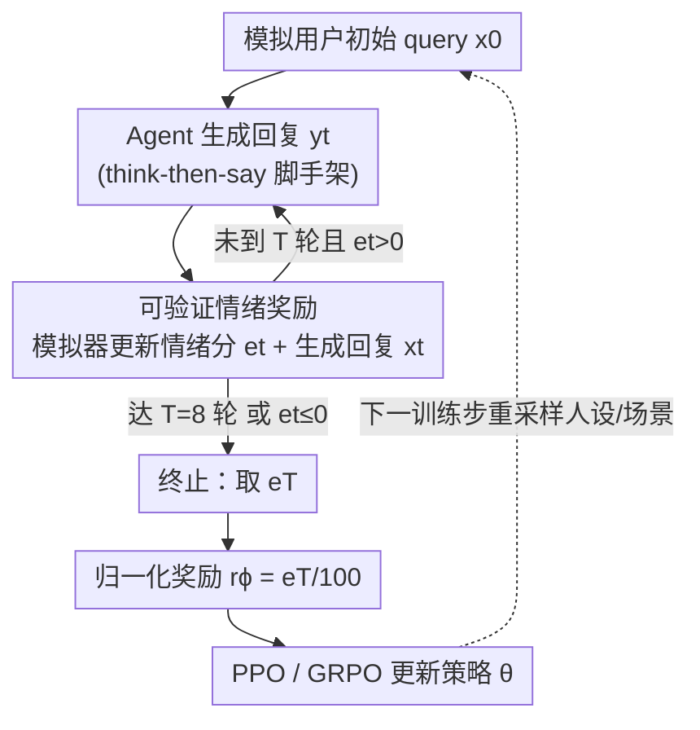

# RLVER: Reinforcement Learning with Verifiable Emotion Rewards for Empathetic Agents

**会议**: ICLR 2026  
**OpenReview**: [https://openreview.net/forum?id=P7wBg0vPTh](https://openreview.net/forum?id=P7wBg0vPTh)  
**代码**: https://github.com/Tencent/DigitalHuman/tree/main/RLVER  
**领域**: 对齐RLHF / 强化学习 / 共情对话  
**关键词**: 可验证奖励, 情绪奖励, 共情智能体, 用户模拟器, PPO/GRPO

## 一句话总结
RLVER 把一个会自洽更新情绪分的「情感用户模拟器」当成 RL 训练环境，用模拟用户在多轮对话结束时给出的情绪分作为可验证奖励，端到端地训练 LLM 学会共情——让 Qwen2.5-7B-Instruct 在 Sentient Benchmark 上从 13.3 飙到 79.2，逼近顶级闭源模型，同时几乎不损失数学和代码能力。

## 研究背景与动机
**领域现状**：LLM 的进步几乎全押在「理性那一半」——数学推理、代码生成、算法规划，这些任务都有可验证的标准答案，因此 RLVR（Reinforcement Learning from Verifiable Rewards）能直接用「答案对不对」当奖励，让模型从零学会新技能。而要提升模型的情商（EQ）/ 共情能力，主流做法仍停留在「在标注好的心理咨询语料上做监督微调」或「用规则模板生成回复」。

**现有痛点**：监督式路线有三个硬伤——标注数据稀缺、对话结构僵硬、泛化能力差。模型只是在模仿静态的「标准回复」，一旦遇到用户情绪随对话演变的真实场景（比如要安慰一个越说越崩溃的朋友），就会答得生硬、跑题。

**核心矛盾**：把 RLVR 搬到对话场景的最大障碍是——**共情没有「标准答案」可验证**。一句安慰好不好，取决于用户此刻的情绪、人设、对话目标，是一个动态、主观、跨多轮的长程目标。缺两样东西：(1) 一个稳定、真实、可规模化的多轮对话 rollout 环境；(2) 一套对「情商」这种通用能力一致且可验证的奖励设计。用神经奖励模型打分又会引入 reward hacking 和不可解释的黑箱。

**本文目标**：造一个能在训练全程持续 rollout 多轮对话、并稳定吐出可验证情绪奖励的环境，让 LLM 通过 RL 直接优化「长程用户满意度」而非模仿静态 ground truth。

**切入角度**：作者发现已有的评测框架 SAGE（Sentient Agent as a Judge）正好提供了一个「自洽的情感用户模拟器」——它会基于人设、对话历史、目标，确定性地推理出一个 $[0,100]$ 的情绪分。既然这个分能当评测指标，那它也能**反过来当训练奖励**。

**核心 idea**：把 SAGE 评测器「改造成实时训练环境」，用模拟用户每轮更新的、确定性可验证的情绪分作奖励，端到端跑 PPO/GRPO 训练共情能力——这就是 RLVER（RL with Verifiable Emotion Rewards）。

## 方法详解

### 整体框架
RLVER 是一个「智能体 ↔ 情感用户模拟器」的闭环 RL 系统。被训练的 agent（policy $\pi_\theta$）扮演倾听者，去支持一个正在求助的模拟用户；用户模拟器（基于 SAGE 的 Sentient Agent）扮演有血有肉的求助者。一轮对话从模拟器抛出的初始 query $x_0$ 开始，agent 生成回复 $y_t$，模拟器收到后做两件事：**确定性地更新自己的情绪分 $e_t$**（这就是奖励信号），并**生成一句符合新情绪状态的回复 $x_t$** 把对话续下去。对话一直进行，直到达到最大轮数 $T$（默认 8 轮）或情绪分跌破最低满意阈值（$e_t \le 0$，代表共情彻底失败）。对话终止后，取最终情绪分 $e_T$ 归一化为标量奖励 $r_\phi = e_T/100$，用 PPO 或 GRPO 更新 policy 参数 $\theta$。作者把这个「生成共情回复 → 收到情感反馈 → 更新策略」的循环叫做 **Heart-in-the-Loop**。

### 关键设计

**1. 可验证情绪奖励：把自洽情感模拟器当成确定性奖励源**

这一设计直击「共情没有可验证标准答案」的痛点。RLVER 不训练任何神经奖励模型，而是直接复用 SAGE 的 Sentient Agent 作为奖励引擎。每个模拟用户被四个要素实例化——详细人设（persona）、对话背景、显式对话目标、隐藏意图——保证用户群体足够多样真实。在每一轮，模拟器执行一次多跳推理，分两步走：用 $f_{\text{emo}}$ **模拟情绪变化**（评估这句回复让自己感觉如何，更新数值情绪分，并生成可解释的「内心独白」来佐证情绪为何变化），再用 $f_{\text{reply}}$ **生成连贯回复**。最终奖励就是终止时情绪分的归一化值：

$$r_\phi(h_T) = \frac{e_T}{100}, \quad e_T = S_{\text{emotion}}(h_T)$$

其中 $h_T = \{x_0, y_0, \dots, y_T, x_T\}$ 是完整对话历史。这样设计「可验证」的关键在于：情绪分的每一次变化都是基于人设、历史、上下文、目标，通过有原则的推理步骤**确定性推导**出来的，而非黑箱打分。这既绕开了学习型奖励模型的不透明陷阱，又因为模拟用户行为/意图的多样性（500 个场景、8 类用户目标），稀释了「同质化用户偏好」带来的 reward hacking。中间步的瞬时情绪分 $e_t$ 反映逐轮情感演变，但只有归一化的**终态**奖励 $r_\phi$ 进入优化，作为整段对话质量的整体代理。

**2. Heart-in-the-Loop：模拟器同时当环境和奖励的闭环 rollout**

普通 RLVR 任务里环境和奖励是分开的（环境给题、规则判分），但共情对话里**模拟用户身兼二职**——它既是 agent 要交互的环境，又是打分的裁判。每个训练步开始时，模拟器引擎 $S$ 实例化一批 Sentient Agent，各自采样独立人设、背景、情绪基调和场景意图。在对话 rollout 中，agent 在每个时间步观测历史 $h_{t-1}$，采样动作 $y_t \sim \pi_\theta(\cdot \mid h_{t-1})$；模拟器随即通过有原则的推理产出两个输出：可验证情绪分 $e_t$ 与新的连贯用户回复 $x_t$。这个闭环让 agent 能与模拟器的情绪动态**协同演化**，逐步学会把多样的处境、意图、情绪映射到「让对方情绪变好」的对话上。相比模仿静态 ground truth，它优化的是真正的长程满意度。值得注意的是终止条件 $e_t \le 0$ 会提前掐断「社交对齐失败」的对话，避免在无效轨迹上浪费探索。

**3. think-then-say 脚手架 + PPO/GRPO 双算法：决定共情能力如何成长**

为研究「先想再说」是否有助于涌现高阶共情，作者用两套模板训练：**think-then-say**（回复前先显式推理）与直接回复的对照模板。策略优化上用 PPO（裁剪式 surrogate loss，适合语言建模这类高方差环境，目标见下式）作主算法，并对比 GRPO（组内相对优势，更适合 outcome-level 的序列级策略学习）：

$$L_{\text{PPO}}(\theta) = \hat{\mathbb{E}}_t \left[ \min\left( r_t(\theta)\hat{A}_t,\ \text{clip}(r_t(\theta), 1-\epsilon, 1+\epsilon)\hat{A}_t \right) \right]$$

这套选择并非锦上添花：实验显示 thinking 脚手架让模型更擅长「共情深度」和「核心洞察」（先推理出用户未说出口的需求），non-thinking 则偏向「方案打磨」这种行动导向能力；PPO 能把特定能力推到更高天花板，GRPO 则提供更稳更均衡的提升。另外作者发现从一个「轻度对齐、但几乎不含情感/共情信号」的 checkpoint 初始化，比 zero-RL 从零开始能建立更强基线、加速收敛，且因为初始几乎无共情先验，可确保提升来自奖励驱动而非预存的情感知识。

### 损失函数 / 训练策略
- **奖励**：终态情绪分归一化到 $[0,1]$，整段对话共用一个 outcome-level 标量奖励 $r_\phi = e_T/100$。
- **优化器**：PPO（主）+ GRPO（对比），均为 on-policy。
- **环境**：SAGE 模拟器，DeepSeek-V3-1226 作默认 Sentient Agent；500 个支持性对话场景、8 类用户目标（情绪困扰、学业压力、人际冲突、未来规划等）；最多 8 轮。
- **基座**：Qwen2.5-7B-Instruct（未在情感/共情数据上微调过，确保提升可归因于 RLVER）。

## 实验关键数据

### 主实验
基座 Qwen2.5-7B-Instruct 在 Sentient Benchmark 上仅 13.3 分、76% 对话以失败告终；RLVER 训练后大幅跃升，最佳的「PPO + Thinking」达到 79.2，约 6 倍提升，成功率从 2% 提到 42%，与顶级闭源 Gemini2.5-Pro（82.4）同档，并超过 Gemini2.5-Flash-Think（66.1）、OpenAI-o3（62.7）。

| 模型 | Sentient Score | 成功率 | 失败率 | Chit Chat |
|------|------|------|------|------|
| Gemini2.5-Pro-0605（顶级闭源） | 82.4 | 55% | 4% | 83.3 |
| GPT-4o-0326 | 79.9 | 51% | 4% | 80.9 |
| OpenAI-o3-0416 | 62.7 | 32% | 14% | 83.0 |
| Qwen2.5-7B-Instruct（基座） | 13.3 | 2% | 76% | 37.8 |
| **RLVER PPO + Thinking** | **79.2** | 42% | 9% | 62.1 |
| RLVER PPO 非 Thinking | 61.7 | 24% | 23% | 53.4 |
| RLVER GRPO + Thinking | 72.0 | 34% | 10% | 53.0 |
| RLVER GRPO 非 Thinking | 68.3 | 26% | 10% | 49.2 |

通用能力几乎不退化（最佳 PPO 模型）：Math500 77.8→76.6、LiveCodeBench 26.7→28.0（不降反升）、IFEval 70.4→68.6，说明专精共情没有引发灾难性遗忘。

### 消融实验
作者把训练环境从「vanilla 模拟器」换成「更严苛/更保守的 challenging 模拟器」，考察环境难度的影响：

| 配置 | thinking | non-thinking | 说明 |
|------|------|------|------|
| Vanilla 模拟器 | 79.2 | 61.7 | 适中难度，效果最好 |
| Challenging 模拟器 | 66.4 | 19.8 | 难度过高反而崩盘 |
| Challenging（non-think） | — | 19.8 | 从 61.7 暴跌到 19.8 |

challenging 模拟器的策略接受率仅 33.1%（vanilla 52.4%）、情绪与需求表达水平仅 63.6%（vanilla 78.6%），反馈过于稀疏。

### 关键发现
- **更难的环境≠更好**：过于严苛/保守的模拟器在探索阶段给的反馈太少，对初始较弱的模型尤其有害；适中且校准良好的环境反而给出更丰富信号，支撑更广的策略探索。这是本文最反直觉的洞察。
- **thinking 比 non-thinking 更鲁棒**：在 challenging 环境下，thinking 模型只从 79.2 降到 66.4，仍在共情深度、核心洞察、风格适应上有提升；non-thinking 模型从 61.7 崩到 19.8，几乎学不到东西。
- **PPO vs GRPO 性格不同**：GRPO 提升更稳更均衡；PPO 会放大特定强项——thinking+PPO 在 Core Insight（3.673 vs GRPO 2.916）和 Empathic Depth（3.971 vs 3.249）上天花板更高，non-thinking+PPO 在 Solution Crafting（3.833）更突出。
- **能力分化**：thinking 模型擅长「共情深度 + 核心洞察」，non-thinking 模型擅长「方案打磨」——后者缺少显式推理，转而靠给出更具体的可执行建议来补偿。

## 亮点与洞察
- **把评测器改造成训练环境**：SAGE 本是给模型打共情分的「裁判」，作者发现它的确定性情绪分天然可验证，于是让裁判摇身变成 RL 环境兼奖励源——这种「评测即训练」的复用思路很巧，可迁移到任何已有可信自动评测器的主观任务。
- **用确定性推理替代神经奖励模型**：共情打分本是最容易黑箱化的地方，作者坚持让情绪分由「基于人设/历史/目标的可解释推理」推导，既抗 reward hacking 又可审计，给「软目标如何做可验证奖励」提供了范本。
- **环境难度的甜区**：「越难越好」在 RL 圈是常见直觉，本文用数据反驳——对弱初始模型，过严环境会饿死探索信号。这对设计 RL 课程/环境有普适警示。
- **think-then-say 不只是 CoT**：显式推理在这里被验证能催生「先推断用户未说出口的需求，再回应」的高阶共情，而非单纯堆 token。

## 局限与展望
- **依赖模拟用户的保真度**：整套奖励都来自 SAGE 模拟器，若模拟器本身对人类情感的刻画有偏，agent 会学到「让模拟器满意」而非「让真人满意」，存在 sim-to-real gap。
- **单一求助者、单轮目标**：当前是一对一情绪支持场景，作者也承认未来需要多方对话、自适应人设切换、多模态情感等更复杂设定。
- **终态稀疏奖励**：只用 $e_T$ 当奖励、丢弃了逐轮 $e_t$ 的密集信号，长对话中信用分配可能不充分；如何利用中间情绪轨迹做 shaping 值得探索。
- **非医疗替代**：作者在伦理声明中强调这是基础研究系统，不能替代专业心理/医疗咨询，落地需谨慎。

## 相关工作与启发
- **vs 监督式情绪支持对话（ESConv / SoulChat 等）**：它们靠在标注咨询语料上 SFT 或数据增广，模型只能模仿静态回复、泛化差；RLVER 用 RL 直接优化长程满意度，是首个把 RL 用于 LLM 共情推理的工作，也首次系统分析「逻辑连贯 vs 情感敏感」的 trade-off。
- **vs Zero-RL（DeepSeek-R1 路线）**：Zero-RL 在数学/代码/搜索等有客观答案的域上对基座直接做 RL；RLVER 把这套范式拓展到「对话」这一缺乏客观答案的域，关键是造出可验证的情绪奖励代理，填补了 Zero-RL 在对话系统上的空白。
- **vs LLM-as-a-Judge 奖励**：简单的 LLM 打分奖励是单点静态的，捕捉不到用户情绪的逐轮演变；RLVER 的 Sentient Agent 是有人设、有内心独白、会随对话更新情绪状态的动态裁判。

## 评分
- 新颖性: ⭐⭐⭐⭐⭐ 首个把可验证情绪奖励引入 RL 来训练共情 LLM，「评测器即训练环境」的复用很有想象力
- 实验充分度: ⭐⭐⭐⭐ 主结果+通用能力+消融+五维能力剖析+环境难度对照都齐，但仅 7B 单基座、未在真人上验证
- 写作质量: ⭐⭐⭐⭐⭐ 动机、框架、发现层层递进，反直觉结论（环境难度甜区）讲得清晰
- 价值: ⭐⭐⭐⭐⭐ 给「主观/软目标如何做可验证 RL」提供可复用范式，且开源代码与环境脚本

<!-- RELATED:START -->

## 相关论文

- [\[ICLR 2026\] RLVMR: Reinforcement Learning with Verifiable Meta-Reasoning Rewards for Robust Long-Horizon Agents](rlvmr_reinforcement_learning_with_verifiable_meta-reasoning_rewards_for_robust_l.md)
- [\[ICLR 2026\] LongRLVR: Long-Context Reinforcement Learning Requires Verifiable Context Rewards](longrlvr_long-context_reinforcement_learning_requires_verifiable_context_rewards.md)
- [\[ICLR 2026\] Rubrics as Rewards: Reinforcement Learning Beyond Verifiable Domains](rubrics_as_rewards_reinforcement_learning_beyond_verifiable_domains.md)
- [\[ICLR 2026\] From Verifiable Dot to Reward Chain: Harnessing Verifiable Reference-based Rewards for RL of Open-ended Generation](from_verifiable_dot_to_reward_chain_harnessing_verifiable_reference-based_reward.md)
- [\[ICLR 2026\] Reinforcement Learning with Verifiable Rewards Implicitly Incentivizes Correct Reasoning in Base LLMs](reinforcement_learning_with_verifiable_rewards_implicitly_incentivizes_correct_r.md)

<!-- RELATED:END -->
