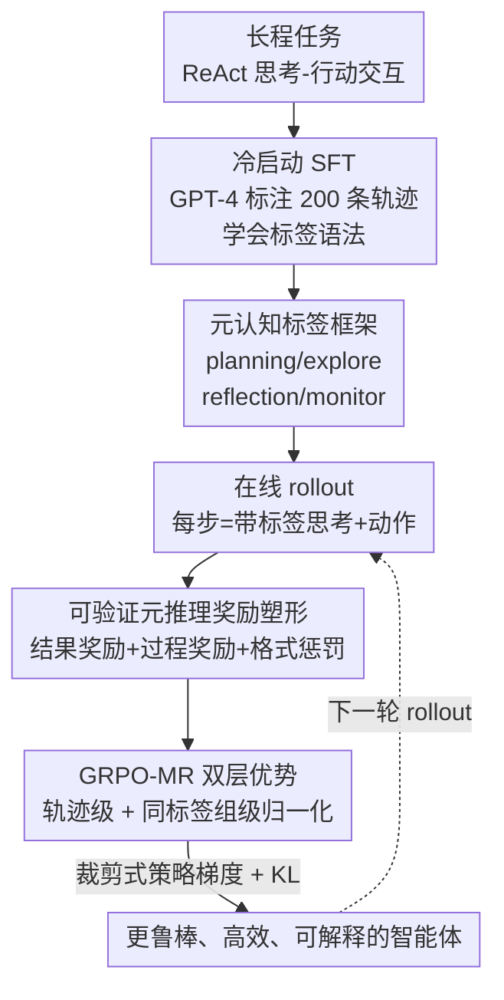

# RLVMR: Reinforcement Learning with Verifiable Meta-Reasoning Rewards for Robust Long-Horizon Agents

**会议**: ICLR 2026  
**OpenReview**: [https://openreview.net/forum?id=cTbAevdwBE](https://openreview.net/forum?id=cTbAevdwBE)  
**代码**: 无  
**领域**: Agent / 强化学习 / LLM 推理  
**关键词**: 长程智能体, 过程奖励, 元认知, GRPO, 可验证奖励

## 一句话总结
针对"只奖励最终成功"的端到端 RL 会强化冗余、跑偏推理路径的问题，RLVMR 让智能体用 `<planning>/<explore>/<reflection>/<monitor>` 四类标签显式标注自己的认知步骤，并用程序化规则给这些元推理行为发放可验证的稠密奖励，再配合双层优势的 GRPO-MR 一起优化；7B 模型在 ALFWorld 最难的未见任务分割（L2）上把成功率做到 83.6%，同时大幅减少无效与重复动作。

## 研究背景与动机
**领域现状**：用 LLM 训练长程（long-horizon）智能体目前有两条主流路线。一条是在专家轨迹上做 SFT，能学到高效行为；另一条是从环境反馈做端到端 RL（如 GRPO），靠探索获得更好的泛化。两者都在 ReAct（思考-行动交替）框架下运行。

**现有痛点**：作者把问题点到了一个被忽视的现象——**低效探索（inefficient exploration）**。SFT 在见过的任务上又高效又准（7B 模型 L0 成功率 63.3%、无效动作率仅 6.2%），但极其脆弱，一到没见过的任务类别（L2）成功率暴跌到 37.5%、重复动作率翻倍，本质是"模仿而没学会推理"。GRPO 泛化更好（L1 77.3%、L2 52.3%），但代价是把任何能成功的轨迹（哪怕中间充满冗余、死循环的步骤）都无差别地强化，7B 模型 L2 重复动作率高达 31.2%。

**核心矛盾**：只用稀疏的、结果导向的奖励，无法区分"靠扎实推理成功"和"靠脆弱捷径碰巧成功"。更关键的是，单纯把模型从 1.5B 放大到 7B 并不能解决——7B GRPO 在 L2 上成功率更高，但重复动作率反而更高（31.2% vs 27.1%），说明更大的容量被用去更有效地"钻空子"，问题出在训练目标本身而非模型规模。

**本文目标**：跳出"只奖励结果"，把监督信号下沉到**推理过程本身**，让智能体不仅能找到解，还能"讲道理地"找到解。

**切入角度**：作者借用元认知（metacognition）理论——"思考关于思考"。其核心观察是：规划、监控进度、探索备选、反思错误这些高级认知技能，可以被拆解成离散、**可验证**的步骤嵌进智能体的推理流。

**核心 idea**：用四类显式标签把元推理行为操作化，再用程序化规则给"有益的元推理"发稠密可验证奖励，和最终结果奖励一起喂进 critic-free 的策略梯度优化。

## 方法详解

### 整体框架
RLVMR 解决的是"端到端 RL 只奖励结果导致推理跑偏"的问题，整体分两阶段。**第一阶段冷启动**：先用一小批（200 条）成功轨迹，用更强的教师模型（如 GPT-4）回填元推理标签，再让目标 LLM 做 SFT，纯粹是为了学会标签语法、能输出结构化的元推理。**第二阶段 RL**：智能体在 ALFWorld / ScienceWorld 环境里在线 rollout，每一步既产生带标签的思考，也产生动作；此时一套**奖励塑形**机制按规则给每一步的元推理行为打分（探索到新状态给奖励、反思后纠错给奖励、格式不对扣分），再叠加轨迹末尾的稀疏结果奖励；最后用专门的 **GRPO-MR** 算法把"轨迹级整体表现"和"同类元推理步骤的相对质量"组合成步级优势，用裁剪式策略梯度 + KL 正则更新策略。三件事——标签框架、奖励塑形、双层优势优化——一起把智能体推向"推理连贯、动作高效"。

### 关键设计

**1. 元认知标签框架：把"会不会推理"拆成可验证的离散认知步**

直接针对"ReAct 把推理当成一团黑箱、无法细粒度监督"的痛点。RLVMR 把单体的 reasoning 解耦成四类 XML 风格标签，每类对应一种元认知功能：`<planning>` 把任务分解成高层步骤、形成整体策略（任务开始或需要重规划时用）；`<explore>` 在遇到不确定/瓶颈时生成假设或备选，鼓励创造性探索；`<reflection>` 复盘历史、分析错误并给出纠正动作（通常在失败后触发）；`<monitor>` 对照整体计划跟踪进度、保证动作与子目标对齐。所有动作则统一包在 `<action>` 标签里。这一步的意义在于：把抽象的"推理质量"变成**可被程序识别、可被规则打分**的结构化对象——没有这层标签，后面的稠密奖励就无从落地。MDP 形式化下，策略 $\pi_\theta$ 在状态 $s_t$ 下生成思考 $th_t$ 与动作 $a_t$：$(th_t, a_t) \sim \pi_\theta(\cdot \mid s_t)$，长程任务里通常只有末尾稀疏的结果奖励 $R(\tau)$，信用分配极难——标签框架正是为缓解这个稀疏性铺路。

**2. 可验证元推理奖励塑形：用程序化规则给"好的认知行为"发稠密奖励**

针对"结果奖励太稀疏、无法告诉智能体哪一步推理是对的"。RLVMR 给每一步设计了一个复合奖励：**结果奖励** $R(\tau)$ 是末尾的二值信号，成功给正常数 $r_s$、否则为 0；**元推理奖励** $r^{MR}_t$ 是稠密的、逐步发放的，且每一类都对应一条可程序化验证的规则——`<planning>` 步只有当整条轨迹最终成功才给奖励（$r_{planning}$），`<explore>` 步只有当当前动作指向**新的物体或位置**才给奖励（$r_{explore}$，直接抑制重复），`<reflection>` 步只有当它在一连串失败后**带来了纠正动作**才给奖励（$r_{reflection}$）；此外还有**格式奖励** $r^{format}_t$，输出不符合 `<tag>...</tag><action>...</action>` 结构就扣 $-\lambda_{format}$。步级总奖励为 $r_t = r^{MR}_t + r^{format}_t$。这套设计的精髓在"可验证"——奖励不是靠另一个学习出来的、可能被钻空子的奖励模型，而是靠**确定性的规则**（是否发现新状态、反思后是否真的纠错），因此不会被策略反向利用，天然抗 reward hacking。

**3. GRPO-MR：把"轨迹整体表现"与"同类推理步相对质量"组合成双层优势**

如果直接把稠密奖励塞进普通 GRPO，不同类型元推理步的奖励尺度不一、会互相干扰。GRPO-MR 用 critic-free 的方式算出一个**上下文感知**的步级优势。第一层是**轨迹级相对优势**：对同一环境采样的一批 $K$ 条轨迹，按结果奖励做组内归一化 $A^{traj}_k = \frac{R(\tau_k) - \mu_R}{\sigma_R}$，捕捉整体表现好坏。第二层是**元推理级相对优势**：把一个批次里**所有带同一标签**（比如全部 `<explore>` 步）的步骤分到一组，在组内对它们的元推理奖励做归一化 $A^{MR}_{t,tag} = \frac{r^{MR}_{t,tag} - \mu_{tag}}{\sigma_{tag}}$——这样每类元推理行为只和"同类行为"比较，尺度对齐、信号干净。最终步级优势是两者的加权和：

$$A_t = \alpha \cdot A^{traj}_k + (1-\alpha) \cdot A^{MR}_{t,tag}$$

其中 $\alpha \in [0,1]$ 平衡全局结果与局部推理质量（默认 0.5）。优化目标用裁剪式代理损失 + KL 正则：

$$L_{final} = \mathbb{E}_t\big[\min(r_t(\theta)A_t,\ \mathrm{clip}(r_t(\theta), 1-\epsilon, 1+\epsilon)A_t)\big] - \lambda_{KL} D_{KL}(\pi_\theta \| \pi_{ref})$$

其中 $r_t(\theta)$ 是重要性采样比率。这样既保留了 GRPO 去掉 critic、靠组内对比估计优势的高效，又让稠密的过程奖励以"分组归一"的方式干净地注入信用分配。

### 损失函数 / 训练策略
冷启动阶段在 200 条标注轨迹上 SFT 5 个 epoch（batch/GPU=16，学习率 $1\times10^{-5}$）。RL 阶段基于 veRL 框架，每步从 16 个不同环境采样、每个环境 rollout 8 条轨迹；轨迹优势与元推理优势权重各 0.5，格式惩罚 $-0.1$（输出至少含一个元推理标签和一个动作标签才算有效），KL 系数 0.01，每个 episode 最多 30 步。RLVMR 跑 100 epoch，而 RL 基线训练 150 epoch（即 RLVMR 用更少训练量取得更优结果）。

## 实验关键数据

### 主实验
在 ALFWorld（具身家务）与 ScienceWorld（文本科学实验）上评测，按泛化难度分 L0（见过的变体+类别）、L1（未见变体+见过类别）、L2（未见变体+未见类别）。RLVMR 在三个 base model 上全面 SOTA。

| Base / 方法 | ALFWorld L0 | ALFWorld L1 | ALFWorld L2 | ScienceWorld L2 (succ.) |
|------|------|------|------|------|
| Qwen2.5-7B + GRPO | 79.3 | 77.3 | 52.3 | 26.6 |
| Qwen2.5-7B + GiGPO（次优） | 89.5 | 90.2 | 67.2 | 25.8 |
| **Qwen2.5-7B + RLVMR** | **91.4** | **91.8** | **83.6** | **32.2** |
| Qwen2.5-1.5B + RLVMR | 89.1 | 87.9 | 56.3 | 26.5 |
| Llama3.1-8B + RLVMR | 92.2 | 91.0 | 83.2 | 38.7 |

最难的 ALFWorld L2 上，7B 模型 83.6% 相比最强基线 GiGPO（67.2%）提升 **16.4 个百分点**，且超过了 GPT-4o（68.8%）、DeepSeek-R1（67.3%）等大得多的模型。

### 分析实验：探索效率（无效/重复动作率，↓ 越低越好）
这是论文最能说明"过程奖励确实改善了推理质量"的证据（Qwen2.5-1.5B，ALFWorld）。

| 指标 / 方法 | L0 | L1 | L2 |
|------|------|------|------|
| 无效动作率 SFT | 24.9 | 11.8 | 8.0 |
| 无效动作率 GRPO | 21.6 | 17.3 | 18.8 |
| **无效动作率 RLVMR** | **12.5** | **14.0** | **11.1** |
| 重复动作率 GRPO | 21.4 | 20.2 | 10.7 |
| 重复动作率（最难 L2，GRPO 恶化到 27.1） | 27.1 | — | — |
| **重复动作率 RLVMR** | **5.7** | **4.4** | **6.1** |

GRPO 一到最难的未见任务，重复动作率从 21.4% 恶化到 27.1%；RLVMR 始终控制在 5~6% 区间，说明它学到的是可迁移的解题原则而非过拟合熟悉路径。

### 关键发现
- **L2（未见类别）增益最大**：RLVMR 的优势集中在最难、最考验泛化的分割，印证了"奖励过程而非记忆答案"带来更鲁棒的迁移能力。
- **训练更稳更快**：成功率曲线收敛更快更稳，episode 长度更短（解法更直接），而 GRPO 不稳定且解法更冗长——稠密过程奖励提供了更清晰的学习信号，避免陷入无效循环。
- **放大模型不解决根本问题**：1.5B→7B 成功率涨但重复动作率反而更高，问题在训练目标，正是 RLVMR 的切入点。

## 亮点与洞察
- **"可验证"是关键词**：过程奖励不靠学出来的奖励模型，而靠确定性规则（发现新状态、反思后纠错），从设计上规避 reward hacking——这点可迁移到任何想给中间步骤加稠密奖励、又怕被钻空子的 RL 训练。
- **按标签分组归一化优势**很巧妙：不同类型元推理步奖励尺度不同，逐组归一让每种行为只和同类比较，避免量纲混乱污染信用分配，是把"稠密过程奖励"干净注入 GRPO 的工程关键。
- **诊断先于方法**：论文先用大规模实验把"SFT 脆弱 vs GRPO 低效"的 trade-off 量化（成功率/无效率/重复率三件套），再对症下药，叙事完整、说服力强。
- **极轻冷启动**：仅 200 条轨迹学标签语法，主要能力靠在线交互习得，降低了对专家数据的依赖。

## 局限与展望
- **依赖人工设计的规则与标签体系**：四类标签和各自的发奖规则是手工定义的，迁移到新领域可能需要重新设计规则，规则的覆盖度/公平性也会影响最终行为。
- **教师标注的隐性成本**：冷启动需要 GPT-4 这类强模型回填元推理标签，标注质量直接影响后续 RL 的起点。
- **仅文本环境**：实验局限在 ALFWorld / ScienceWorld 两个文本环境，作者也把多模态环境、自适应奖励机制、机器人/软件工程等真实域列为未来方向。
- **横向比较需谨慎**：不同方法/不同 base 在不同难度分割上的数值不可直接跨任务比大小（L2 的任务类别本身被刻意 held-out）。

## 相关工作与启发
- **vs GRPO（仅结果奖励）**: GRPO 去 critic、靠组内对比估优势，泛化好但只奖励结果，会强化任何成功路径（含冗余/死循环）；RLVMR 在其框架上叠加可验证过程奖励与按标签分组的第二层优势，针对性压低无效/重复动作。
- **vs GiGPO（两级信用分配）**: GiGPO 引入两级结构做更细粒度信用分配但仍是结果导向；RLVMR 的"两级"是"轨迹级 + 元推理标签级"，信号来源是显式认知行为而非纯结果，L2 上反超 GiGPO 16.4 个百分点。
- **vs SFT / ETO / GLIDER（离线/模仿）**: 这些靠专家轨迹或离线优化，要么脆弱、要么受限于数据；RLVMR 仅用 200 条做冷启动、主体靠在线交互学习，泛化更强。
- **vs Reflexion 等基于语言反思的 agent**: Reflexion 靠 prompt 层的口头反思，不更新参数；RLVMR 把反思等元认知行为做成可被 RL 优化的、带可验证奖励的训练信号，直接塑形策略参数。

## 评分
- 新颖性: ⭐⭐⭐⭐ 把元认知理论操作化为可验证标签 + 双层优势 GRPO-MR，角度新且落地干净
- 实验充分度: ⭐⭐⭐⭐ 两个基准、三个 base、三难度分割 + 探索/训练效率分析齐全，但缺少对各奖励项（planning/explore/reflection/format）的逐项消融
- 写作质量: ⭐⭐⭐⭐⭐ "先诊断 trade-off 再对症"叙事清晰，图表支撑有力
- 价值: ⭐⭐⭐⭐ 为长程 agent 的过程级监督提供了可复用、抗 hacking 的范式

<!-- RELATED:START -->

## 相关论文

- [\[ICLR 2026\] LongRLVR: Long-Context Reinforcement Learning Requires Verifiable Context Rewards](longrlvr_long-context_reinforcement_learning_requires_verifiable_context_rewards.md)
- [\[ICLR 2026\] RLVER: Reinforcement Learning with Verifiable Emotion Rewards for Empathetic Agents](rlver_reinforcement_learning_with_verifiable_emotion_rewards_for_empathetic_agen.md)
- [\[ICLR 2026\] From Verifiable Dot to Reward Chain: Harnessing Verifiable Reference-based Rewards for RL of Open-ended Generation](from_verifiable_dot_to_reward_chain_harnessing_verifiable_reference-based_reward.md)
- [\[ICLR 2026\] Reinforcement Learning with Verifiable Rewards Implicitly Incentivizes Correct Reasoning in Base LLMs](reinforcement_learning_with_verifiable_rewards_implicitly_incentivizes_correct_r.md)
- [\[ICLR 2026\] Rubrics as Rewards: Reinforcement Learning Beyond Verifiable Domains](rubrics_as_rewards_reinforcement_learning_beyond_verifiable_domains.md)

<!-- RELATED:END -->
