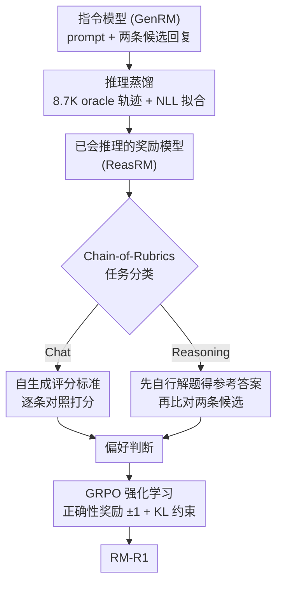

# RM-R1: Reward Modeling as Reasoning

**会议**: ICLR 2026  
**arXiv**: [2505.02387](https://arxiv.org/abs/2505.02387)  
**代码**: [GitHub](https://github.com/RM-R1-UIUC/RM-R1)  
**领域**: 强化学习  
**关键词**: 奖励模型, 推理, Chain-of-Rubrics, 生成式奖励模型, RLVR

## 一句话总结

将奖励建模重新定义为推理任务，提出RM-R1系列推理奖励模型（ReasRM），通过推理蒸馏+RL训练以及Chain-of-Rubrics（CoR）机制，在三大奖励模型基准上平均超越70B和GPT-4o模型达4.9%。

## 研究背景与动机

奖励模型是RLHF中对齐LLM的核心组件。现有方法分为两类：（1）**ScalarRM**——将RM训练为分类器输出标量分数，不透明、无推理过程；（2）**GenRM**——生成文本判断，有一定透明度但推理往往肤浅、不可靠，导致性能不如ScalarRM。

作者观察到，准确的奖励建模天然需要推理：推断评判者潜在标准、在多标准间权衡、模拟潜在后果等。Figure 1的例子清楚展示了这一点——普通指令模型过拟合数据表面模式，而推理模型能评估回复的深层影响。

核心问题：**能否将奖励建模作为推理任务来处理？**

本文提出**推理奖励模型（ReasRM）**这一新类别，强调在判断过程中使用长而连贯的推理链，并设计了两阶段训练流程（蒸馏+RL）和分类别的Chain-of-Rubrics推理策略。

## 方法详解

### 整体框架

RM-R1要把"打分"这件事从黑箱标量回归变成一段看得见的推理：模型读到一个prompt和两条候选回复后，先想清楚该按什么标准评判、回复在这些标准下各自表现如何，最后才给出偏好判断。整个pipeline分两阶段串起来——先用强oracle模型蒸馏出一批高质量推理轨迹，把"会推理地评判"这个能力灌进基模型；再用GRPO强化学习，以"判断对不对"为可验证奖励，把这个能力从模仿打磨成泛化。两阶段之间靠Chain-of-Rubrics（CoR）这套结构化推理协议衔接：RL训练（以及推理）时每走一步都按CoR做一次rollout——先把样本归类成Chat或Reasoning，再按对应路径推理出偏好判断，GRPO据此用正确性奖励更新模型。

### 关键设计

**1. 推理蒸馏：先让模型学会"评判时该怎么想"**

直接拿指令模型当生成式奖励模型（GenRM）用，输出的判断往往很表面、不可靠，性能甚至打不过标量RM。问题不在模型不够强，而在它没见过"带推理的评判"长什么样。这一阶段就用o3、Claude这类oracle模型对每条偏好样本合成一段推理轨迹 $r^{(i)}$，再拼上真实标签 $l^{(i)}$ 组成蒸馏目标 $y_{\text{trace}}^{(i)} = r^{(i)} \oplus l^{(i)}$，让基模型用标准NLL损失去拟合：

$$\mathcal{L}_{\text{distill}}(\theta) = -\sum_t \log r_\theta(y_t \mid x, y_{<t})$$

关键不在数据量而在示范质量——只用约8.7K条蒸馏样本，模型就学会了把判断拆成"定标准→逐条评估→下结论"的结构化套路，远少于DeepSeek-Distilled那种800K量级的需求。这一步给后续RL提供了一个已经会推理、会守格式的起点。

**2. Chain-of-Rubrics（CoR）：按任务类型切换评判逻辑**

人在打分时关注点其实是分情况的——闲聊类回复看的是礼貌、安全、有没有帮上忙这些文本层面的标准，而推理类回复看的是逻辑对不对、答案准不准。把所有偏好都用同一套笼统标准评，必然顾此失彼。CoR让模型先把当前问题归类成Chat或Reasoning两类，再走对应的推理路径：Chat类型先自行生成一份评分标准（rubric），再拿两条回复逐条对照打分；Reasoning类型则先自己把题目解一遍，得到参考答案后再去对比两条候选谁更接近正确。这样推理过程不是漫无目的地展开，而是被任务类型约束在最该关注的维度上，判断也因此更稳。

**3. GRPO强化学习：把模仿来的推理打磨成泛化能力**

蒸馏的隐患是容易过拟合oracle的特定表达模式，学到的是"长得像推理"而非"真的会评判"。第二阶段用GRPO做强化学习，奖励信号干脆只看判断的正确性——模型预测的偏好标签 $\hat{l}$ 和真实标签 $l$ 一致就给 $+1$，否则 $-1$：

$$\mathcal{R}(x, j \mid y_a, y_b) = \begin{cases} 1 & \text{if } \hat{l} = l \\ -1 & \text{otherwise} \end{cases}$$

因为蒸馏阶段已经把格式规范学到位了，这里刻意不加格式奖励，只让模型在"判断对错"这个唯一目标下自由探索不同的推理路径。通过探索而非死记，RL把评判能力从对特定模式的模仿，推向了对新样本的批判性泛化。

### 损失函数 / 训练策略

两阶段目标各司其职：阶段一是标准NLL，纯靠蒸馏把推理轨迹和标签灌进模型；阶段二用GRPO优化带KL约束的期望奖励

$$\max_\theta\ \mathbb{E}\big[\mathcal{R}(x, j)\big] - \beta\, D_{\text{KL}}\big(r_\theta \,\|\, r_{\text{ref}}\big)$$

其中参考模型 $r_{\text{ref}}$ 就是蒸馏阶段得到的模型，KL项把策略拉住不让它偏离太远。如前所述，奖励里只有二元正确性、没有格式项，因为格式在蒸馏后已经稳定。

## 实验关键数据

### 主实验（三大基准平均）

| 模型 | RewardBench | RM-Bench | RMB | 平均 |
|------|------------|---------|-----|------|
| INF-ORM-70B (ScalarRM) | 95.1 | 70.9 | 70.5 | 78.8 |
| GPT-4o (GenRM) | 86.7 | 72.5 | 73.8 | 77.7 |
| Self-taught-eval-70B | 90.2 | 71.4 | 67.0 | 76.2 |
| **RM-R1-14B (ours)** | **88.9** | **81.5** | **68.5** | **79.6** |
| **RM-R1-32B (ours)** | **90.9** | **83.9** | **69.8** | **81.5** |

### 消融实验（Qwen-2.5-Instruct-32B，RewardBench）

| 方法 | Chat | Chat Hard | Safety | Reasoning | 平均 |
|------|------|-----------|--------|-----------|------|
| Instruct原模型 | 95.8 | 74.3 | 86.8 | 86.3 | 85.8 |
| +Cold Start RL | 92.5 | 81.5 | 89.7 | 94.4 | 89.5 |
| +RL+Rubrics | 93.0 | 82.5 | 90.8 | 94.2 | 90.1 |
| +RL+Rubrics+QC | 92.3 | 82.6 | 91.6 | 96.3 | 90.8 |
| **RM-R1 (完整)** | **95.3** | **83.1** | **91.9** | **95.2** | **91.4** |

### 关键发现
- RM-R1在RM-Bench上超越之前最佳8.7%，在数学和代码上分别达91.8%和74.1%
- 推理能力对奖励建模至关重要——蒸馏提供基础，RL进一步增强泛化
- 模型规模scaling效果好——7B到32B呈现近似线性的相对提升
- 推理长度scaling也有效——更长的推理链带来更好的判断性能

## 亮点与洞察

- **将RM与推理深度结合**：首次系统性地将长链推理引入奖励建模，建立了ReasRM这一新类别
- **数据效率极高**：仅8.7K样本蒸馏即可达到竞争力，远少于DeepSeek-Distilled的800K
- **CoR设计巧妙**：区分chat和reasoning的不同评判策略，反映了人类打分的实际认知过程
- **SFT vs RL对比有洞察**：Table 3显示推理训练（RL）一致优于SFT，即使在同一蒸馏数据上

## 局限与展望

- CoR的分类（Chat vs Reasoning）可能过于简化，更细粒度的任务分类可能更优
- 依赖oracle模型（o3/Claude）生成蒸馏数据，增加了成本
- 当前奖励设计仅使用二元正确性（±1），更细粒度的奖励信号可能进一步提升

## 相关工作与启发

- DeepSeek-GRM系列是直接竞争者，但未开源且依赖更多数据
- JudgeLRM也是ReasRM但性能明显落后，凸显了训练方案的重要性
- 启示：在RM训练中，"如何推理"比"看多少数据"更重要

## 评分
- 新颖性: ⭐⭐⭐⭐ 将推理引入RM的方向很好，但蒸馏+RL框架较为标准
- 实验充分度: ⭐⭐⭐⭐⭐ 三大基准、详细消融、scaling分析、case study
- 写作质量: ⭐⭐⭐⭐ 结构清晰，Figure 1动机例子说明力强
- 价值: ⭐⭐⭐⭐⭐ 建立了ReasRM新范式，开源代码和模型推动社区发展

<!-- RELATED:START -->

## 相关论文

- [\[ICLR 2026\] R4: Nested Reasoning-Retrieval for Reward Modeling in Role-Playing Agents](r4_nested_reasoning-retrieval_for_reward_modeling_in_role-playing_agents.md)
- [\[ICLR 2026\] R1-Reward: Training Multimodal Reward Model Through Stable Reinforcement Learning](r1-reward_training_multimodal_reward_model_through_stable_reinforcement_learning.md)
- [\[ICML 2026\] CAMEL: Confidence-Gated Reflection for Reward Modeling](../../ICML2026/reinforcement_learning/camel_confidence-gated_reflection_for_reward_modeling.md)
- [\[ICLR 2026\] UME-R1: Exploring Reasoning-Driven Generative Multimodal Embeddings](ume-r1_exploring_reasoning-driven_generative_multimodal_embeddings.md)
- [\[ICLR 2026\] Parallel-R1: Towards Parallel Thinking via Reinforcement Learning](parallel-r1_towards_parallel_thinking_via_reinforcement_learning.md)

<!-- RELATED:END -->
