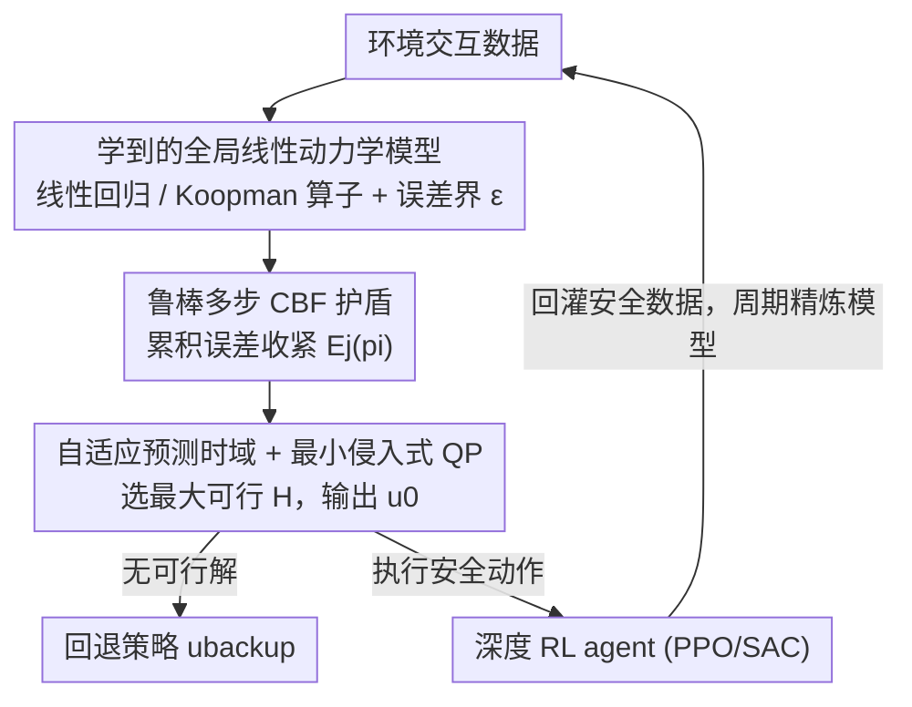

# RAMPS：鲁棒自适应多步预测护盾

**会议**: ICLR 2026  
**OpenReview**: [https://openreview.net/forum?id=2bbqHOWFTU](https://openreview.net/forum?id=2bbqHOWFTU)  
**论文**: [项目主页](https://ambadkar.com/ramps)  
**代码**: 无  
**领域**: 强化学习 / 安全RL / 控制屏障函数  
**关键词**: 安全探索, 模型预测护盾, 控制屏障函数, Koopman算子, 高维控制

## 一句话总结
RAMPS 用一个全局学习到的**线性**动力学模型（线性回归或深度 Koopman 算子）配合一个**鲁棒多步控制屏障函数（CBF）**护盾，把原本只能用在十几维系统上的形式化屏蔽技术扩展到 348 维的腿足运动任务，在训练全程把安全违规最多降低 90% 的同时保持竞争力级别的任务奖励。

## 研究背景与动机
**领域现状**：安全强化学习（safe RL）要求策略在**整个训练过程**中都安全，而不只是收敛后的最终策略安全。其中 model-predictive shielding（模型预测护盾）是一条有前景的路线——它在 agent 旁边挂一个"护盾"，只在 agent 提出的动作威胁安全时才介入纠正，因此能兼容任意 RL 策略。

**现有痛点**：现有护盾陷入两难。一类是**神经护盾**，从数据里学一个安全 critic，灵活但需要海量经验，且训练早期根本拦不住违规；另一类是**符号护盾**，靠分析环境模型给出从第一步起就成立的形式化保证，但它们都依赖**显式地把状态空间切成一片片局部线性模型**，这种"打补丁"方式遭遇维度灾难，一旦状态维度超过 10 就计算上不可行——而现代深度 RL 恰恰擅长高维系统。

**核心矛盾**：形式化/符号方法保证强但不可扩展；统计/代价方法可扩展但训练早期允许大量违规。两者之间一直没有桥梁。此外离散时间随机系统里还有一个被忽视的难题：当控制输入对安全约束的影响是**延迟的**（相对阶 $r>1$），标准的一步 CBF 会失效，因为它对受约束变量没有即时控制权，从而产生"陷阱状态"——短期看安全、却注定走向未来违规。

**本文目标**：(1) 让形式化护盾可扩展到高维非线性系统；(2) 在模型不完美、存在控制延迟时仍给出可靠的实时介入。

**切入角度**：作者发现关键不在于把非线性动力学切碎成局部线性块，而在于学**一个全局线性表示**——可以是原状态空间里的线性回归，也可以是把状态"抬升"到高维特征空间后的 Koopman 线性算子。只要动力学是线性的，就能高效地把多面体安全约束**向未来多步传播**。

**核心 idea**：用"单个全局线性模型 + 鲁棒多步 CBF"取代"局部线性模型补丁 + 一步 CBF"，并在 CBF 里显式累加预测误差形成一条"不确定性管道"，从而在不完美模型上也能给出模型相对的安全保证。

## 方法详解

### 整体框架
RAMPS 由三个部件构成：(1) 一个学到的**线性动力学模型**，给出环境动力学的单一全局表示；(2) 一个**鲁棒控制屏障函数护盾**，用这个模型在线认证并纠正不安全动作；(3) 一个标准的**深度 RL agent**，在护盾保护下学习高性能策略。三者在一个迭代闭环里协同：agent 先采集环境交互数据，用数据训练线性模型和一个**最坏情况误差界** $\varepsilon$，二者共同参数化 CBF 护盾；随后训练 RL agent，每一个动作都被护盾验证、必要时纠正；新采集到的安全数据回灌数据集，周期性地精炼模型与误差界。模型越准 → 护盾越不保守 → agent 探索越自由 → 策略越好，形成正向循环。

护盾在每个时间步的具体动作是：以 agent 提出的动作 $a_\pi$ 为目标，在一个**自适应选出的预测时域** $H$ 上求解一个小规模二次规划（QP），找到既满足多步鲁棒 CBF 约束、又最贴近 $a_\pi$ 的安全控制序列，只执行序列首个动作 $u_0$。

### 关键设计

**1. 学到的全局线性动力学模型：用一个线性算子取代局部线性补丁**

针对符号护盾"切碎状态空间→维度灾难"的痛点，RAMPS 不再为不同区域拟合一堆局部线性模型，而是学**单个全局线性表示**。对简单系统，直接在原状态空间做线性回归；对复杂非线性系统，把状态通过一个学到的非线性嵌入"抬升"到高维特征空间 $z$，在那里动力学退化为简单的线性转移 $z_{k+1}=Az_k+Bu_k+c+w_k$，其中 $c$ 是学到的常数漂移项、$w_k$ 是满足 $\lVert w_k\rVert_\infty\le\varepsilon$ 的加性模型误差（这里用了 Deep Koopman Operator）。线性结构正是后面多步传播能高效进行的根基——它让安全约束（多面体）可以被精确、廉价地沿时间向前推，而不需要反复局部线性化或昂贵的非线性传播，因此即便预测时域拉长也能保持可解。

**2. 鲁棒多步 CBF 与累积误差收紧：同时治"相对阶陷阱"和"模型不准"**

这是论文的核心理论贡献，针对两个痛点：离散随机系统里控制对约束的延迟影响（相对阶 $r>1$），以及学习模型必然不完美。安全集表示为多面体 $C=\bigcap_i\{z\mid p_i^\top z+b_i\le 0\}$。RAMPS 要求安全条件在时域 $H$ 内**每个中间步 $j\ge r_i$ 都成立**，把名义可达状态写成 $z_j(z,u)=A^j z+\sum_{k=0}^{j-1}A^{j-1-k}Bu_k+\sum_{k=0}^{j-1}A^k c$，并对每一步累加最坏情况误差形成**收紧项**：

$$E_j(p_i)=\sum_{k=0}^{j-1}\varepsilon\lVert p_i^\top A^k\rVert_1.$$

于是每个有效步 $j$ 和每个面 $i$ 得到一条鲁棒 CBF 约束 $p_i^\top z_j(z,u)+b_i\le \lambda^j\,(p_i^\top z+b_i)-E_j(p_i)$，其中 $\lambda\in(0,1]$ 是衰减率（越接近 1 越严格、不变性越强）。这些约束对整个控制序列 $u$ 都是线性的，汇总成 $Gu\le h$。多步条件解决了一步 CBF 处理不了的延迟控制问题——以单摆为例，约束角度 $\theta$ 时 $p^\top B=0$（一步无法影响 $\theta$），但 $p^\top AB=3\Delta t^2/(m\ell^2)\ne 0$，说明两步后控制就能作用，因此只要 $H\ge r=2$ 就能化解这个"陷阱"。而 $E_j(p_i)$ 这个收紧项相当于在预测轨迹周围套一条"不确定性管道"，只要整条管道留在安全集内，护盾对不完美模型依然有效——这正是 RAMPS 能用简单线性回归就工作的原因。

**3. 自适应预测时域选择与最小侵入式 QP：在前瞻力和保守度之间动态平衡**

预测时域 $H$ 太短解不了高相对阶陷阱、太长又会累积模型误差。RAMPS 不固定 $H$，而是在每个时间步通过**有界二分搜索**在 $[H_{\min},H_{\max}]$ 内选 $H$（$H_{\min}$ 取活跃约束的最大相对阶）：可行的时域继续向更大值搜索、不可行的则缩小范围，取最大可行时域 $H^\ast$。在该时域上求解 QP

$$\min_u \lVert u_0-a_\pi\rVert_2^2 \quad \text{s.t.}\quad Gu\le h,\ u_k\in U,$$

目标是让首个动作 $u_0$ 尽量贴近 agent 意图 $a_\pi$，体现"最小侵入"——护盾只在必要时介入、改动尽量小。按 receding-horizon 原则只执行 $u_0$，其余 $u_{1:H-1}$ 仅用于保证可行轨迹存在、随后丢弃以保留下一步的灵活性。若搜不到可行时域，则启用回退策略 $u_{\text{backup}}$。实验中 QP 在超过 98% 的时间步可行、回退策略在复杂运动任务里被调用不到 2%，说明 Theorem 1 的条件性保证几乎始终生效。

### 损失函数 / 训练策略
RAMPS 的底层策略用 PPO（on-policy）或 SAC（off-policy）训练，护盾独立于 RL 算法之外（policy-agnostic）。误差界 $\varepsilon$ 从一个留出验证集 $D_{\text{val}}$ 上估计为最大观测一步预测误差，取高置信分位数（99 百分位）。QP 用 OSQP 求解，最大时域 $H_{\max}=5$。理论上 Theorem 2 给出 $\varepsilon$ 的高概率成立界，Corollary 1 进一步把有限时域内的前向不变性以概率 $P\ge 1-K\delta$ 连接到真实物理系统。

## 实验关键数据

### 主实验
在 Pendulum 与 Safety-Gymnasium 的 SafeHopper / SafeCheetah / SafeAnt / SafeHumanoid（最高 348 维状态、17 维动作）上评估，指标为**训练期累积安全违规数**（越低越好）。L = 线性回归模型，K = Koopman 模型；Failed 表示训练崩溃或始终无法完成安全 episode。

| 算法 | Pendulum | SafeHopper | SafeCheetah | SafeAnt | SafeHumanoid |
|------|----------|------------|-------------|---------|--------------|
| SauteRL | 91±22 | 703±78 | 183±25 | 1221±203 | 319±106 |
| CUP | 184±225 | 673±63 | 122±22 | 1883±221 | 172±90 |
| P3O | 173±166 | 620±6 | 185±8 | 1481±446 | 183±45 |
| SPICE + L | 495±128 | Failed | Failed | Failed | Failed |
| SPICE + K | 87±8 | 459±105 | 169±70 | Failed | Failed |
| RAMPS + L + PPO | 69±6 | 193±44 | 7±7 | 162±42 | 137±134 |
| RAMPS + K + PPO | 53±6 | 172±15 | 26±17 | 111±23 | 154±25 |
| RAMPS + K + SAC | **25±26** | **49±10** | 21±4 | 242±38 | **11±7** |

RAMPS 各变体在高维任务上违规数显著低于所有基线；SPICE+L 完全无法扩展到高维，SPICE+K 在 SafeAnt/Humanoid 也失败。同用 Koopman 模型时 RAMPS+K 远好于 SPICE+K，说明优势来自鲁棒护盾框架本身（显式建模误差），而非单纯模型更准。护盾实时性也好：每步计算时间从 Pendulum 的 0.23 ms 到 Ant 的 0.40 ms。

### 消融实验
（消融详见原文附录 A.3，此处归纳关键结论）

| 配置 | 现象 | 说明 |
|------|------|------|
| 完整 RAMPS | 安全且高奖励 | 各部件协同标定的结果 |
| 去掉误差收紧项 $E_j$ | **持续违规、灾难性失败** | 鲁棒性是安全的本质组件 |
| 时域 $H$ 过短 | 解不开高相对阶陷阱 | $H$ 需 $\ge$ 相对阶 |
| 时域 $H$ 过长 | 累积模型误差变大 | 需折中 |
| 衰减率 $\lambda$ 过大（过保守） | QP 易不可行，安全与奖励都受损 | $\lambda$ 要够宽松保证可行性 |
| 低置信误差界（非 99 分位） | 学习不稳定 | 高置信界是安全+高奖励的前提 |

### 关键发现
- **最关键的部件是显式误差鲁棒性**：去掉 $E_j(p_i)$ 收紧项后无论怎么调超参都会持续违规——这印证了"不假设完美模型、而是形式化地为模型误差留余量"是整个框架的命门。
- **模型表达力影响安全-奖励平衡**：更表达力强的 Koopman 模型误差界更小→护盾更不保守→奖励更高；简单线性模型在 SafeCheetah 上违规极低但奖励偏低，因为更大的误差界导致介入幅度更大、干扰了策略学习。
- **护盾与 RL 算法解耦**：PPO 和 SAC 都能用，SAC 在高维（SafeHumanoid）更稳，PPO 在 SafeAnt 反超 SAC；PPO 在 Humanoid 的不稳定是 on-policy 方法在动作被修改时的已知通病，非护盾本身缺陷。
- **多维约束下仍可扩展**：在 SafeHumanoid 上同时约束 21 维安全集（3 坐标 + 18 关节角速度），RAMPS 仅 256 次违规、任务奖励达 5000，而 CMDP 基线违规超 3000、奖励仅约 500。

## 亮点与洞察
- **"全局线性 + 多步前瞻"的协同是点睛之笔**：线性模型让多步传播可行，多步传播又赋予护盾前瞻力——任何一方单独都不够，组合起来才同时拿到可扩展性和安全保证。这个 trade-off 的拆解很优雅。
- **用相对阶分析串起 HOCBF 与 RL**：把控制论里高阶 CBF 处理"延迟控制权"的思路引入离散随机 RL 系统，单摆的 $p^\top B=0$ 但 $p^\top AB\ne 0$ 的例子非常直观地解释了"为什么一步护盾会被陷阱状态骗到"。
- **误差收紧项 $E_j(p_i)$ 是可迁移的 trick**：把数据驱动的误差界沿时域累加成"不确定性管道"，这套做法可以搬到其他需要在学习模型上做安全/鲁棒规划的场景（如学习型 MPC）。
- **自适应时域用二分搜索"白嫖"前瞻力**：每步取最大可行 $H$，既不固定保守也不冒进，工程上简单且实测 98% 时间步可行。

## 局限与展望
- **保证是概率性、且依赖逐步可行**：Theorem 1 的前向不变性以"每个时间步 QP 都可行"为前提，但无限时域可行性无法解析保证，只能靠经验（实测 >98%）支撑——这是学习型护盾的共性局限。
- **依赖误差界 $\varepsilon$ 的有效性**：$\varepsilon$ 从有限验证集估计，Theorem 2 只给出高概率界；若部署分布与验证分布差异大，误差界可能失效。
- **线性模型的表达力天花板**：动力学高度非线性时，即便抬升到 Koopman 特征空间，单一全局线性算子也可能拟合不足，导致误差界变大、护盾过保守、奖励受损（SafeCheetah 上 RAMPS+L 已体现）。
- **PPO 在动作修改下不稳定**：on-policy 方法对"执行动作≠策略提议"敏感，限制了护盾与某些算法的组合，需要额外稳定化手段。
- 改进思路：引入自适应/分段 Koopman 嵌入以缓解单一线性模型的拟合瓶颈；探索在线收紧误差界以减少保守度。

## 相关工作与启发
- **vs SPICE（Anderson et al., 2023）**：SPICE 也学动力学模型做护盾，但用简单线性模型且依赖较准的模型；RAMPS 显式建模误差（误差收紧项）使其在不完美模型上仍安全，同款 Koopman 模型下 RAMPS+K 全面优于 SPICE+K，且 SPICE 无法扩展到 SafeAnt/Humanoid。
- **vs 符号/最坏情况护盾（Anderson et al., 2020 等）**：它们靠状态空间分割给确定性保证，但被维度灾难限制在十几维以下；RAMPS 用单一全局线性模型避开分割，扩展到 348 维。
- **vs CMDP/代价型方法（PPOSaute / P3O / CUP）**：这类方法把安全当软约束、训练早期允许大量违规；RAMPS 强制硬状态约束，违规数低一个量级。
- **vs Koopman + 一步 CBF（Folkestad et al., 2020 等）**：以往把 Koopman 与安全结合多停留在一步 CBF-QP 滤波、或假设已知备份控制器；RAMPS 是多步、自适应时域，并形式化处理累积误差。

## 评分
- 新颖性: ⭐⭐⭐⭐⭐ 把全局线性模型与鲁棒多步 CBF 统一，首次把形式化护盾扩展到 348 维
- 实验充分度: ⭐⭐⭐⭐ 五个环境 + 多基线 + 误差/时域/λ/置信度消融，但消融细节多放附录
- 写作质量: ⭐⭐⭐⭐ 理论与直觉（单摆例子）兼顾，叙述清晰
- 价值: ⭐⭐⭐⭐⭐ 为安全 RL 在高维真实系统的部署提供了可扩展、有理论支撑的护盾

<!-- RELATED:START -->

## 相关论文

- [\[ICLR 2026\] SHAPO: Sharpness-Aware Policy Optimization for Safe Exploration](shapo_sharpness-aware_policy_optimization_for_safe_exploration.md)
- [\[ICLR 2026\] Safe Exploration via Policy Priors](safe_exploration_via_policy_priors.md)
- [\[ICLR 2026\] Solving General-Utility Markov Decision Processes in the Single-Trial Regime with Online Planning](solving_general-utility_markov_decision_processes_in_the_single-trial_regime_wit.md)
- [\[ICLR 2026\] RLP: Reinforcement as a Pretraining Objective](rlp_reinforcement_as_a_pretraining_objective.md)
- [\[ICLR 2026\] PoLi-RL: A Point-to-List Reinforcement Learning Framework for Conditional Semantic Textual Similarity](poli-rl_a_point-to-list_reinforcement_learning_framework_for_conditional_semanti.md)

<!-- RELATED:END -->
