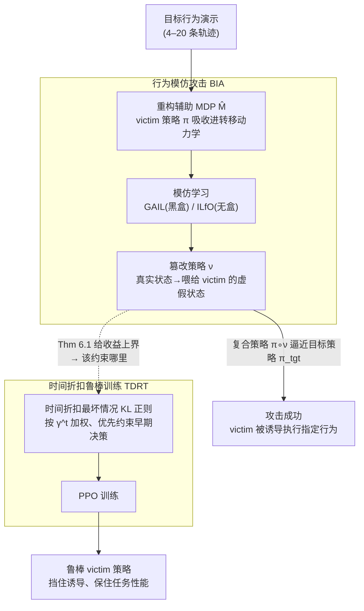

# Robust Deep Reinforcement Learning against Adversarial Behavior Manipulation

**会议**: ICLR 2026  
**arXiv**: [2406.03862](https://arxiv.org/abs/2406.03862)  
**代码**: 无  
**领域**: AI安全 / 强化学习  
**关键词**: 行为目标攻击, 对抗鲁棒性, 模仿学习攻击, 时间折扣防御, 策略平滑  

## 一句话总结
本文研究 RL 中一种新型威胁——行为目标攻击（adversary 通过篡改观测来引导 victim 执行特定目标策略），提出不需要白盒访问的 BIA 攻击方法和基于时间折扣的 TDRT 防御方法，TDRT 在保持对攻击鲁棒性的同时比现有防御（SA-PPO）的原始任务性能高 28.2%。

## 研究背景与动机

**领域现状**：现有 RL 对抗攻击研究主要关注"奖励最小化"攻击——让 victim 表现尽可能差。防御方法（如 ATLA、SA-PPO）也主要针对这类攻击设计。

**现有痛点**：存在一种更危险的攻击模式——行为目标攻击（behavior-targeted attack），adversary 不是让 victim 失败，而是引导它执行特定行为（如让自动驾驶车辆绕道到特定商店）。现有此类攻击（PA-AD、Targeted PGD）需要白盒访问 victim 策略，实际中难以实现。且没有专门针对此类攻击的防御方法。

**核心矛盾**：如何在不访问 victim 策略内部的情况下实施行为目标攻击？如何设计既能抵御行为攻击又不过度牺牲原始任务性能的防御？

**切入角度**：将行为目标攻击重新建模为一个 MDP 中的累积奖励最大化问题（Theorem 5.1），使得 victim 策略自然嵌入环境动力学中，无需白盒访问。

**核心 idea**：攻击端——用 MDP 重构将白盒需求变为黑盒；防御端——用时间折扣加权的鲁棒训练优先保护早期决策。

## 方法详解

### 整体框架
这篇论文要解决两个互为镜像的问题：在不访问 victim 策略内部的前提下，如何把它"诱导"成执行某个指定行为；以及反过来，如何训练一个既挡得住这种诱导、又不把原任务能力丢光的策略。攻击侧叫行为模仿攻击 BIA——adversary 构造一个辅助 MDP，把 victim 当成环境的一部分，再用标准模仿学习（GAIL/ILfO）学一个篡改观测的策略 $\nu$，让 victim 的实际行为去逼近目标行为。防御侧叫时间折扣鲁棒训练 TDRT——在 PPO 训练里加一项时间折扣加权的最坏情况 KL 正则，优先把早期决策"焊死"在不容易被扰动的地方。两侧由同一套理论串起来：攻击的可行性分析（Theorem 5.1）直接推导出防御该约束什么（Theorem 6.1）。

### 关键设计

**1. 行为模仿攻击 BIA：把"白盒求梯度"换成"在新 MDP 里做标准 RL"**

现有的行为目标攻击（PA-AD、Targeted PGD）都得对 victim 策略求梯度，等于要求白盒访问，现实中拿不到。BIA 的出发点是让 adversary 学一个篡改策略 $\nu: s \mapsto \hat{s}$，把真实状态映射成喂给 victim 的虚假状态，从而让复合策略 $\pi \circ \nu(a|s) = \sum_{\hat{s}} \nu(\hat{s}|s)\pi(a|\hat{s})$ 去匹配目标策略 $\pi_{\text{tgt}}$。关键一步是 Theorem 5.1：求 $\arg\min_\nu \mathcal{D}(\pi \circ \nu, \pi_{\text{tgt}})$ 这个分布匹配问题，可以等价转化为在一个新构造的 MDP $\hat{M}$ 上做累积奖励最大化，而 victim 策略 $\pi$ 此时已经被吸收进 $\hat{M}$ 的转移动力学里。

这一转化正是黑盒化的来源：adversary 不再需要对 $\pi$ 求梯度，只要在 $\hat{M}$ 里跑标准 RL / 模仿学习即可。落地时用两种模仿学习算法——GAIL 属黑盒，需要少量目标行为的演示；ILfO 属无盒，只需观察目标状态轨迹。实测只要 4–20 条目标行为演示就能达到接近白盒攻击的效果，攻击效果仅比 PA-AD 差约 7%。

**2. 时间折扣鲁棒训练 TDRT：不是均匀压平所有时间步，而是优先保护早期决策**

有了攻击的刻画，防御要回答的是"约束哪里、约束多强"。Theorem 6.1 给出 adversary 收益的上界：

$$\sum_{t=0}^{\infty} \frac{\gamma^t}{1-\gamma} \mathbb{E}_{s \sim d_\pi^t}\big[D_{\text{KL}}(\pi(\cdot|s) \,\|\, \pi \circ \nu(\cdot|s))\big]$$

这个界透露两件事：一是降低策略对状态扰动的敏感性（即压住被篡改后策略的 KL 偏移）能直接提升鲁棒性；二是 $\gamma^t$ 这个权重意味着早期时间步的偏移比晚期更致命——序贯决策里早错会一路传播放大。据此 TDRT 的训练目标写成

$$J_{\text{def}}(\pi) = -J_{\text{RL}}(\pi) + \lambda \max_\nu \sum_{s_t \in B} \gamma^t D_{\text{KL}}(\pi(\cdot|s_t) \,\|\, \pi \circ \nu(\cdot|s_t))$$

即在常规 RL 目标外，加一项按 $\gamma^t$ 折扣的最坏情况 KL 正则。它和 SA-PPO 的差别正在这个折扣：SA-PPO 对所有时间步均匀做策略平滑，能换来相近的鲁棒性，但代价是任务性能掉 28.2%；TDRT 把"平滑预算"集中在早期状态上，相同鲁棒性下保留了更多任务能力。它也和 ATLA/PA-ATLA 这类对抗训练区分开来——后者在训练中模拟的是奖励最小化攻击，威胁模型对不上，对行为目标攻击几乎无效。

### 损失函数 / 训练策略
- 攻击训练：在构造出的 MDP $\hat{M}$ 中跑标准 GAIL（需目标行为演示）或 ILfO（仅需目标状态轨迹）。
- 防御训练：PPO 目标叠加时间折扣的最坏情况 KL 散度正则项，超参 $\lambda$ 控制鲁棒性与任务性能的权衡。

## 实验关键数据

### 主实验
Meta-World 10 个任务对，攻击效果（攻击奖励↑ = 攻击更成功）：

| 攻击方法 | 需求 | 典型攻击奖励 | 说明 |
|---------|------|-------------|------|
| Random | 无 | 947 | 随机扰动很弱 |
| PA-AD | 白盒 | 4255 | 需要策略梯度 |
| BIA-ILfD | 黑盒(20条演示) | 3962 | 接近白盒性能 |
| BIA-ILfO | 无盒 | ~3900 | 在确定性环境中接近ILfD |

防御效果（最佳攻击奖励↓ = 更鲁棒）：

| 防御方法 | 典型攻击奖励↓ | 原始任务性能 |
|---------|-------------|------------|
| 无防御 | 1556 | 基线 |
| ATLA-PPO | 1158 | 一般 |
| SA-PPO | 403 | 差 (-28.2%) |
| **TDRT-PPO** | **378** | **好 (基线水平)** |

### 消融实验

| 配置 | 关键发现 |
|------|---------|
| 时间折扣 vs 均匀平滑 | TDRT 鲁棒性相当但任务性能高 28.2% |
| 演示数量 | 仅需 4 条演示即可有效攻击 |
| 对抗训练类方法（ATLA） | 对行为目标攻击无效（设计针对不同威胁模型） |
| 攻击难度 | victim 和 target 行为分布差异大时攻击困难（如 window-open、door-lock） |

### 关键发现
- BIA 用仅 20 条演示就能达到接近白盒方法的攻击效果，证明行为目标攻击是可行且危险的现实威胁
- 对抗训练（ATLA）对行为目标攻击几乎无效——因为训练时模拟的是奖励最小化攻击而非行为操纵
- TDRT 的时间折扣是关键差异化因素：SA-PPO 的均匀平滑以牺牲 28.2% 任务性能为代价达到类似鲁棒性，TDRT 通过聚焦早期步骤保留了任务能力
- 行为目标攻击在 victim 和 target 行为差异大时效果下降

## 亮点与洞察
- **MDP 重构（Theorem 5.1）**非常优雅：将白盒需求变为黑盒的关键是把 victim 策略嵌入环境动力学——adversary 不再需要对策略求梯度，只需在新构造的 MDP 里做标准 RL。这个思想可以迁移到其他需要白盒→黑盒转化的安全场景。
- **"早期决策比晚期更重要"**的洞察有广泛适用性：在序贯决策中，早期错误会传播和放大。这启发我们在任何 RL 鲁棒训练中都应该优先保护早期状态的决策质量。
- 将攻击和防御作为统一框架研究，攻击的理论分析（Theorem 5.1）直接指导了防御设计（Theorem 6.1），形成了完整的闭环。

## 局限与展望
- 攻击在高维观测空间（如图像输入）中效果有限
- TDRT 提供的是经验鲁棒性而非认证鲁棒性（无 certified guarantee）
- 当 victim 和 target 行为分布差异大时攻击困难——这同时也说明某些场景不需要防御
- 防御依赖于 adversary 的 KL 散度约束假设

## 相关工作与启发
- **vs PA-AD (Zhang et al.)**: PA-AD 需要白盒访问 victim 策略，BIA 通过 MDP 重构实现黑盒/无盒攻击，攻击效果仅差 ~7%
- **vs SA-PPO**: SA-PPO 均匀平滑所有时间步，TDRT 用时间折扣聚焦早期步骤——鲁棒性相当但任务性能高 28.2%
- **vs ATLA/对抗训练**: 对抗训练假设攻击者是奖励最小化的，对行为操纵攻击无效——暴露了"防御与威胁模型不匹配"的问题

## 评分
- 新颖性: ⭐⭐⭐⭐⭐ 行为目标攻击的 MDP 重构和时间折扣防御都是全新概念
- 实验充分度: ⭐⭐⭐⭐ Meta-World 10 任务对+多种攻击/防御对比，但缺少高维观测实验
- 写作质量: ⭐⭐⭐⭐⭐ 攻击→理论→防御的逻辑链非常清晰
- 价值: ⭐⭐⭐⭐⭐ 揭示了 RL 中一种被忽视但危险的攻击模式，并提供了高效防御

<!-- RELATED:START -->

## 相关论文

- [\[ICLR 2026\] Dual-Robust Cross-Domain Offline Reinforcement Learning Against Dynamics Shifts](dual-robust_cross-domain_offline_reinforcement_learning_against_dynamics_shifts.md)
- [\[ICLR 2026\] Minimax Optimal Adversarial Reinforcement Learning](minimax_optimal_adversarial_reinforcement_learning.md)
- [\[NeurIPS 2025\] Robust Adversarial Reinforcement Learning in Stochastic Games via Sequence Modeling](../../NeurIPS2025/reinforcement_learning/robust_adversarial_reinforcement_learning_in_stochastic_games_via_sequence_model.md)
- [\[ICLR 2026\] Learning to Generate Unit Test via Adversarial Reinforcement Learning](learning_to_generate_unit_test_via_adversarial_reinforcement_learning.md)
- [\[ICLR 2026\] Understanding and Improving Hyperbolic Deep Reinforcement Learning](understanding_and_improving_hyperbolic_deep_reinforcement_learning.md)

<!-- RELATED:END -->
