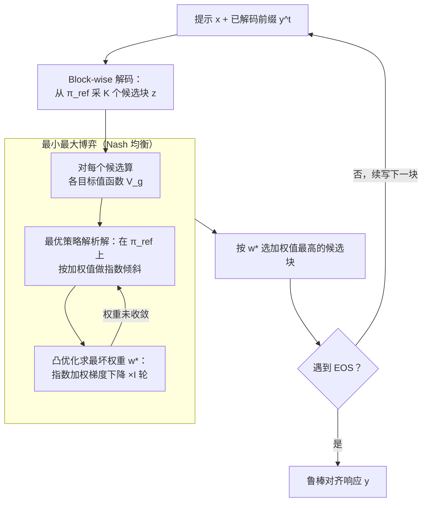

# Robust Multi-Objective Controlled Decoding of Large Language Models

**会议**: ICLR 2026  
**arXiv**: [2503.08796](https://arxiv.org/abs/2503.08796)  
**代码**: [GitHub](https://github.com/williambankes/robust-multi-objective-decoding)  
**领域**: 强化学习  
**关键词**: 多目标对齐, 推理时对齐, 控制解码, 鲁棒优化, 最小最大博弈

## 一句话总结

提出RMOD（Robust Multi-Objective Decoding），一种推理时算法，通过求解最小最大博弈的Nash均衡来动态计算最坏情况目标权重，在无需先验权重信息的情况下实现LLM的鲁棒多目标对齐。

## 研究背景与动机

LLM需要同时对齐多个目标（如有用性、无害性、安全性、指令遵循等），多目标对齐自然引出一个问题：**如何在推理时平衡多个可能冲突的目标？**

现有方法通常需要手动指定目标权重，但权重选择面临多种困难：
- Shi et al. (2024)通过验证集超参搜索选择权重，但易受分布偏移影响
- 基于用户画像或历史交互的方法需要额外信息，实际中往往不可用
- 当安全性是目标之一时，不能容忍其被忽视，但也不能过度保守

核心动机：**不依赖任何先验权重信息，通过最大化最坏情况目标来实现鲁棒对齐**——让最弱的目标得到最大关注。

## 方法详解

### 整体框架

RMOD 想解决的是：推理时对齐多个可能冲突的目标，但又不知道每个目标该给多大权重。它的做法是把"该信哪个目标"这件事本身也交给优化，而不是手动拍一组权重。具体到每个解码步骤，它先为每个目标 $g$ 准备一个值函数 $V_g$（衡量当前续写对该目标的好坏），然后求解一个最小最大博弈的 Nash 均衡：

$$\max_\pi \min_{w \in \Delta^{G-1}} \lambda \sum_g w_g V_g(x,y^t;\pi) - D_{KL}(\pi \| \pi_{\text{ref}})$$

内层的 $\min_w$ 在概率单纯形 $\Delta^{G-1}$ 上挑出"当前最难满足"的目标组合，外层的 $\max_\pi$ 再针对这组最坏权重选出最优续写策略。整条 pipeline 落地为块级（block-wise）解码：每步从参考策略采一批候选块、算各目标值函数、在最小最大博弈里迭代更新权重、选加权值最高的块输出，逐块续写直到 EOS。

下图是单个解码步内的循环：外圈是 Block-wise 解码实现（采样→打分→选块→续写），内圈虚框是该步要解的最小最大博弈，由"最优策略解析解"与"凸优化求最坏权重"两步交替逼近 Nash 均衡。

### 关键设计

**1. 最小最大博弈形式化：把"权重该给谁"交给对手去定**

现有方法的痛点是要先验地指定目标权重，而权重一旦给偏，某个目标（尤其安全性）就可能被忽视。RMOD 干脆把鲁棒多目标对齐建模成策略 $\pi$ 和权重 $w$ 的两人零和博弈：$\pi$ 想最大化加权目标，$w$ 作为对手专挑最弱的目标加大权重。由于目标对 $w$ 是线性的、对 $\pi$ 是凹的，Nash 均衡存在，且 minimax 定理允许交换 max-min 顺序，于是问题被拆成"先求最优策略、再优化最坏权重"两步求解。这种 max-min 结构的好处直接来自它的定义——优化的是最坏情况目标，因此任何单一目标都不会被严重牺牲。

**2. 最优策略的解析解：固定权重后不用搜索，直接写出来**

把博弈拆成两步后，内层问题变成"给定权重 $w$，最优采样策略长什么样"。Proposition 1 给出闭式解：

$$\pi(z|[x,y^t];w) = \frac{\pi_{\text{ref}}(z|[x,y^t]) \exp\!\big(\lambda \sum_g w_g V_g(x,y^t;z)\big)}{Z(x,y^t,w)}$$

即在参考策略 $\pi_{\text{ref}}$ 上按加权值函数做指数倾斜。有了解析解就不必为每组权重重新跑一遍昂贵的策略搜索，而且这个形式正好和标准 KL-正则化 RLHF 的 Boltzmann 解一致，等于把单目标的经典结论平滑推广到了加权多目标。

**3. 凸优化求解最坏情况权重：外层退化成 LogSumExp 的凸问题**

代回解析策略后，外层"找最坏权重"被简化成一个 LogSumExp 形式的凸优化：

$$w^* = \arg\min_{w \in \Delta^{G-1}} \log \mathbb{E}_{z\sim\pi_\text{ref}}\Big[\exp\big(\textstyle\sum_g \lambda w_g V_g\big)\Big]$$

求解用指数加权梯度下降迭代 $w_{g,i+1} = w_{g,i} \cdot \exp(-\eta \cdot \text{gradient})$，天然保持在单纯形上。凸性保证收敛到全局最优，而且这个优化的维度只有 $G$（目标数），与词表大小、序列长度都无关，所以即便每步都重解也很便宜。

**4. Block-wise 解码实现：用块级候选把值函数评估摊薄**

如果逐 token 地解这套博弈，值函数评估次数会爆炸。RMOD 改成把连续解码切成长度 $B$ 的块：每个块先用 $\pi_{\text{ref}}$ 采 $K$ 个候选，对每个候选算各目标值函数，再用上面的凸优化迭代更新权重 $I$ 次，最后选加权值最高的那个候选块输出。块越大评估越省、但越接近参考策略；块越小控制越细、胜率越高，$B$ 因此是粒度与开销之间的旋钮。

### 损失函数 / 训练策略

每个目标的值函数用 MSE 回归训练：$\mathbb{E}[\sum_t(V_g(x,y^t;\theta) - r_g(x,y))^2]$，标签是参考策略生成的响应及其对应奖励 $r_g$。RMOD 本身是纯推理时算法，博弈求解全在解码阶段完成，不需要训练任何策略网络。

## 实验关键数据

### 主实验（HH数据集，最坏情况奖励）

| 方法 | 最坏情况奖励 | 最坏情况胜率(WCWR) |
|------|------------|-------------------|
| CD-Helpful | 高helpful但低harmless | 较低 |
| CD-Harmless | 高harmless但低helpful | 较低 |
| CD-Uniform | 中等平衡 | 57.6% |
| MO-GRPO | 中等 | 54.6% |
| RS/MOD | 低于Uniform | - |
| Distill-RMOD | - | 57.9% |
| **RMOD** | **最高** | **59.1%** |

### 消融实验

| 参数 | 关键指标 | 说明 |
|------|---------|------|
| $\lambda=0.1$（低） | 接近Uniform | 权重分布均匀 |
| $\lambda=0.5$ | 中等鲁棒 | 平衡权衡 |
| $\lambda=10$（高） | 最集中于最差目标 | 权重高度稀疏 |
| B=16（小块） | 最高胜率 | 更细粒度控制 |
| B=256（大块） | 胜率下降 | 接近参考策略 |
| 目标数=2-10 | RMOD持续优于Uniform | 但随目标增多性能下降 |

### 关键发现
- RMOD比所有基线高出最多20%的最坏情况胜率
- 延迟仅比标准CD增加4.5%，计算效率高
- Distill-RMOD（用RMOD生成的数据做SFT）在不使用解码的情况下也表现出色
- LLM-as-Judge（GPT-4o）评估也确认RMOD的优越性

## 亮点与洞察

- **理论优雅**：将问题形式化为凸凹博弈，有解析解和凸优化，理论保证充分
- **实用性强**：推理时算法可随时切换对齐目标，延迟开销极小
- **权重行为分析深入**：通过KKT条件证明最优权重会均衡化各目标的期望奖励
- **Distill-RMOD**提供了一种将推理时方法蒸馏为普通策略的实用路径

## 局限与展望

- 随目标数增多（>10）性能下降，大规模多目标场景需要进一步研究
- 需要为每个目标训练独立的值函数，准备成本较高
- $\lambda$ 的选择影响鲁棒性偏好（稀疏度），目前需要手动设定
- 当前仅在gemma-2-2b-it上实验，更大模型的效果未验证

## 相关工作与启发

- Mudgal et al. (2023)的Controlled Decoding是直接基础，RMOD扩展为鲁棒版本
- Shi et al. (2024)的MOD方法需要预设权重，RMOD自动寻找
- Yoon et al. (2024)和Ramesh et al. (2024)考虑了鲁棒对齐但非推理时方法
- 启示：推理时算法+鲁棒优化的组合为多目标LLM对齐提供了灵活且有保障的解决方案

## 评分
- 新颖性: ⭐⭐⭐⭐ 最小最大推理时对齐是新组合，但各组件较成熟
- 实验充分度: ⭐⭐⭐⭐ 多数据集、消融、LLM-as-Judge、延迟分析全面
- 写作质量: ⭐⭐⭐⭐⭐ 理论推导清晰，问题动机直观
- 价值: ⭐⭐⭐⭐ 为多目标LLM对齐提供了原则性的推理时方案

<!-- RELATED:START -->

## 相关论文

- [\[ICLR 2026\] On Predictability of Reinforcement Learning Dynamics for Large Language Models](on_predictability_of_reinforcement_learning_dynamics_for_large_language_models.md)
- [\[ICLR 2026\] VerifyBench: Benchmarking Reference-based Reward Systems for Large Language Models](verifybench_benchmarking_reference-based_reward_systems_for_large_language_model.md)
- [\[ICLR 2026\] Revolutionizing Reinforcement Learning Framework for Diffusion Large Language Models](revolutionizing_reinforcement_learning_framework_for_diffusion_large_language_mo.md)
- [\[ICLR 2026\] AWM: Accurate Weight-Matrix Fingerprint for Large Language Models](awm_accurate_weight-matrix_fingerprint_for_large_language_models.md)
- [\[ICLR 2026\] Using Reinforcement Learning to Train Large Language Models to Explain Human Decisions](using_reinforcement_learning_to_train_large_language_models_to_explain_human_dec.md)

<!-- RELATED:END -->
