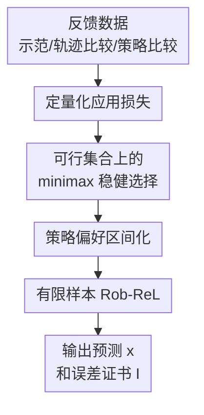

# Robustness in the Face of Partial Identifiability in Reward Learning

**会议**: ICLR 2026  
**OpenReview**: [https://openreview.net/forum?id=e4xANXjA9W](https://openreview.net/forum?id=e4xANXjA9W)  
**代码**: https://github.com/filippolazzati/Rob-ReL  
**领域**: 强化学习 / 奖励学习 / 稳健性  
**关键词**: 奖励学习、部分可识别性、逆强化学习、稳健优化、偏好反馈  

## 一句话总结

这篇论文把奖励学习中的“部分可识别性”从一个定性风险改写成可度量的最坏情况损失，并提出 Rob-ReL 在偏好评估任务中用 minimax 方式输出稳健预测及其误差证书。

## 研究背景与动机

**领域现状**：奖励学习（Reward Learning, ReL）希望从示范、轨迹比较、策略偏好等反馈中恢复人类或专家背后的目标奖励，再把这个奖励用于规划、模仿学习、偏好推断或跨环境迁移。IRL、PbRL 和 RLHF 都可以看成这个大框架下的不同反馈形式：数据本身不直接给出奖励值，而是通过“专家这么做”“轨迹 A 比轨迹 B 好”之类的约束间接泄露奖励信息。

**现有痛点**：很多反馈并不能唯一确定目标奖励 $r^\star$。同一组示范或比较可能对应一整个可行奖励集合 $R_F$，集合里的奖励都和观测反馈一致，但在下游应用里可能给出不同结论。传统做法往往从 $R_F$ 中恢复一个任意奖励，再像它就是真实奖励一样做规划或预测；一旦这个奖励和 $r^\star$ 在目标应用上不等价，系统就可能输出错误策略或错误偏好判断。

**核心矛盾**：问题不只是“奖励没学准”，而是反馈本身在某个应用上是否足够有信息量。若应用只是模仿专家，很多不同奖励也许都足够好；但若应用是把奖励迁移到新环境、比较两种策略、或估计某条轨迹的偏好强度，同一个可行集合可能导致完全不同的答案。现有关于 identifiability 的工作多半给出“可识别 / 不可识别”的定性判断，无法告诉我们最坏会错多少。

**本文目标**：作者想做三件事：第一，用统一语言描述反馈、可行奖励集合和下游应用；第二，定义一个可计算的量来衡量“这组反馈对这个应用到底有多不充分”；第三，在至少一类重要奖励学习问题上给出可执行算法，并证明有限样本下的误差和复杂度。

**切入角度**：论文观察到，实际使用奖励学习时，我们通常事先知道学到的奖励要拿去做什么。既然应用已知，就没有必要追求唯一恢复 $r^\star$；更合理的是，在所有与反馈一致的奖励中，选择一个对目标应用最稳健的输出，并同时报告这个输出在最坏情况下可能错多少。

**核心 idea**：用“应用损失 + 可行奖励集合上的 minimax”替代“任意恢复一个可行奖励”，把部分可识别性转化为可量化、可优化、可给证书的稳健奖励学习问题。

## 方法详解

### 整体框架

论文先提出一个通用 ReL 框架：反馈 $F$ 被解释为目标奖励必须满足的一组约束，交集形成可行集合 $R_F$；应用 $g$ 被解释为一个可部署对象集合 $X_g$ 和损失函数 $L_g(r,x)$。在这个框架下，部分可识别性不再只看 $R_F$ 是否只有一个奖励，而是看是否存在某个部署对象 $x$，能让所有 $r \in R_F$ 下的应用损失都足够小。

Rob-ReL 是这个框架在“评估两条策略偏好强度”任务上的实例化。给定示范、轨迹比较和策略比较反馈，它先估计策略占用分布与必要的转移模型，再在经验可行集合上求策略价值差 $\langle d^{\pi_1}-d^{\pi_2}, r\rangle$ 的最小值和最大值，最后输出区间中点作为预测、区间半径作为最坏情况误差证书。

### 关键设计

**1. 定量化应用损失：把“是否等价”改成“会错多少”**

过去讨论部分可识别性时，常见做法是问可行集合里的奖励是否在某个应用上完全等价。例如对规划任务，若两个奖励诱导的最优策略不同，就容易被判定为失败风险。本文把这个判断放宽为一个损失函数 $L_g(r,x)$：如果真实奖励是 $r$，部署对象 $x$ 在应用 $g$ 上会遭受多大损失。这样一来，应用可以是规划、模仿、策略偏好评估、轨迹偏好评估，甚至是直接学习奖励本身。

这个改写的关键是把反馈和应用解耦。反馈只负责定义可行集合 $R_F=\cap_i R_{f_i}$，应用只负责定义可部署对象 $X_g$ 和损失 $L_g$。当 $R_F$ 中有多个奖励时，系统不再被迫回答“到底哪个奖励才是真的”，而是回答“在这些都可能是真的情况下，什么输出在目标应用上最不容易出事”。这也是论文比定性 identifiability 框架更实用的地方：它允许近似正确，而不是只承认完全等价。

**2. 可行集合上的 minimax 稳健选择：不猜真实奖励，而是控制最坏损失**

在非贝叶斯设定中，算法没有奖励上的先验分布，只知道 $r^\star \in R_F$。因此作者采用自然的最坏情况准则：

$$
x_{F,g} \in \arg\min_{x\in X_g}\max_{r\in R_F} L_g(r,x).
$$

这个选择的含义很直接：不管可行集合里哪个奖励才是真实奖励，部署 $x_{F,g}$ 的损失都被控制在最小的最坏情况范围内。对应的最坏情况损失

$$
I_{F,g}=\min_{x\in X_g}\max_{r\in R_F}L_g(r,x)
$$

被论文称为反馈 $F$ 对应用 $g$ 的 uninformativeness。它不是一个抽象的可识别性标签，而是一个可以和应用容忍阈值比较的数：若 $I_{F,g}$ 已经很小，部分可识别性也许可以接受；若它很大，就说明现有反馈对这个应用不够，需要额外反馈或更弱的部署要求。

**3. 策略偏好区间化：把稳健预测化成求上下端点**

Rob-ReL 关注的具体应用是评估两条策略 $\pi_1,\pi_2$ 的偏好强度，也就是输出一个标量 $x$ 逼近 $J^{\pi_1}(r;p)-J^{\pi_2}(r;p)$。此时损失是绝对误差：

$$
L_g(r,x)=\left|x-\langle d^{\pi_1}-d^{\pi_2},r\rangle\right|.
$$

在可行集合 $R_F$ 上，所有可能的偏好强度构成一个区间。论文定义

$$
M=\max_{r\in R_F}\langle d^{\pi_1}-d^{\pi_2},r\rangle, \quad
m=\min_{r\in R_F}\langle d^{\pi_1}-d^{\pi_2},r\rangle.
$$

于是最优稳健输出就是区间中点 $x_{F,g}=(M+m)/2$，最坏误差就是半径 $I_{F,g}=(M-m)/2$。这一步非常关键，因为它把原本看似复杂的 minimax 绝对损失问题变成两个端点优化问题。直观上，若所有可行奖励都认为两条策略差不多，那么区间很窄，预测可靠；若有些奖励强烈偏向 $\pi_1$、另一些强烈偏向 $\pi_2$，区间很宽，算法会明确告诉你当前反馈无法支持高置信偏好判断。

**4. 有限样本 Rob-ReL：用经验占用分布和原始-对偶优化给出证书**

真实场景里，策略占用分布和某些转移模型并不知道，Rob-ReL 因此先从轨迹数据估计 $d^{\pi_1},d^{\pi_2}$ 以及反馈中出现的策略占用分布。对于示范反馈里需要判断专家是否近似最优的约束，算法还用 RF-Express 进行 reward-free exploration 来估计相关 MDP 的转移模型；轨迹比较和策略比较约束本身不需要估计额外转移模型。

有了经验可行集合 $\widehat R_F$ 后，算法分别求经验端点 $\widehat M$ 和 $\widehat m$。约束里包含类似 $\max_\pi J^\pi(r;p_{D,i})$ 的项，所以优化不是简单线性规划；作者构造拉格朗日函数，并用 primal-dual subgradient method（PDSM）交替更新奖励变量 $r$ 与拉格朗日乘子 $\lambda$。最终 Rob-ReL 返回 $\widehat x_K=(\widehat M_K+\widehat m_K)/2$ 和 $\widehat I_K=(\widehat M_K-\widehat m_K)/2$。理论结果表明，在 Slater 条件下，只要样本数和迭代数按多项式规模增长，就能以高概率保证 $L_g(r^\star,\widehat x_K)\le I_{F,g}+\epsilon$ 且 $|I_{F,g}-\widehat I_K|\le \epsilon$。

### 一个完整示例

论文的主例子是一个小型“道路选择”环境。Alice 对三类物品 B、S、T 有未知偏好，真实奖励设为 $r^\star=[0.7,0.1,0.2]$；学习者并不知道这个奖励，只拿到若干示范、轨迹比较和策略比较反馈。目标应用不是学出完整奖励，而是评估策略 $\pi_1$ 相对策略 $\pi_2$ 的偏好强度，即 $\Delta J(r^\star)=0.39$。

这些反馈形成一个三维奖励空间里的黄色可行集合。普通奖励学习若任意选择可行集合中的一个奖励，最坏情况下可能选到使 $\Delta J$ 最大的奖励，而真实奖励却接近使 $\Delta J$ 最小的奖励，误差可接近整个区间宽度。Rob-ReL 则先求端点 $\widehat m_K=-0.62$ 和 $\widehat M_K=1.02$，再输出中点 $\widehat x=0.20$，并报告半径 $\widehat I=0.82$。虽然 $0.20$ 与真实 $0.39$ 仍有差距，但算法同时给出了“当前反馈最多只能保证这么准”的证书；这正是本文想强调的稳健性。

### 损失函数 / 训练策略

本文不是训练神经网络奖励模型，而是在可行奖励集合上求稳健解。核心优化目标是

$$
\min_{x\in X_g}\max_{r\in R_F}L_g(r,x),
$$

在策略偏好评估任务中化为求 $m$ 和 $M$ 两个端点。经验版本的拉格朗日函数可概括为：目标项是 $\langle \widehat d^{\pi_1}-\widehat d^{\pi_2},r\rangle$，约束项分别来自示范反馈、轨迹比较反馈和策略比较反馈。示范反馈约束包含 $\max_\pi J^\pi(r;\widehat p_{D,i})-\langle \widehat d^{\pi_{D,i}},r\rangle-t_i$，反映专家策略至多 $t_i$ 次优；比较反馈则转化为奖励内积不等式。

优化上，PDSM-MIN 和 PDSM-MAX 分别处理最小端点和最大端点。每轮对 $r$ 做投影子梯度更新，对 $\lambda$ 做投影对偶更新，并用动态规划 / backward induction 计算示范约束中的最优策略值。理论分析把误差拆成估计误差和迭代误差：前者由占用分布估计与 RF-Express 的集中界控制，后者由 saddle-point subgradient method 的收敛性控制。

## 实验关键数据

### 主实验

| 实验设置 | 目标量 | 本文结果 | 参考 / 真值 | 含义 |
|--------|------|----------|-------------|------|
| 道路环境示例 | $\Delta J(r^\star)$ | $\widehat x=0.20$ | 真值 $0.39$ | 预测落在稳健区间中心，误差由半径控制 |
| 道路环境示例 | 最小端点 $m$ | $\widehat m_K=-0.62$ | 离散化近似端点相近 | 代表可行奖励中最不偏向 $\pi_1$ 的情况 |
| 道路环境示例 | 最大端点 $M$ | $\widehat M_K=1.02$ | 离散化近似端点相近 | 代表可行奖励中最偏向 $\pi_1$ 的情况 |
| 道路环境示例 | 最坏误差证书 $I$ | $\widehat I=0.82$ | 区间半径 | 当前反馈最多只能保证到这个尺度 |

### 消融实验

| 配置 | 关键指标 | 说明 |
|------|---------|------|
| 小状态空间，少反馈，少样本 | err $x=0.07\pm0.04$，err $I=0.09\pm0.05$ | $S,A,H=3,3,5$，$m_D,m_{PC},m_{TC}=1,2,2$，$n,N=50,100$ |
| 小状态空间，少反馈，多样本 | err $x=0.02\pm0.01$，err $I=0.02\pm0.02$ | 同样问题规模下，把样本增至 $n,N=500,1000$ 后误差明显下降 |
| 大状态空间，少反馈，少样本 | err $x=0.13\pm0.07$，err $I=0.33\pm0.19$ | $S,A,H=100,10,15$ 时，有限样本下误差显著变大 |
| 大状态空间，少反馈，多样本 | err $x=0.04\pm0.03$，err $I=0.06\pm0.05$ | 增加样本后，大规模设置中的估计误差也能下降 |
| 大状态空间，多反馈，多样本 | err $x=0.04\pm0.03$，err $I=0.06\pm0.07$ | $m_D,m_{PC},m_{TC}=5,15,15$ 时仍保持可控误差 |

### 关键发现

- Rob-ReL 的主要价值不是让点预测一定贴近真实偏好，而是同时给出一个最坏情况误差半径；这个半径直接反映当前反馈对目标应用是否足够。
- 在固定问题规模下，样本数从 $50/100$ 增加到 $500/1000$ 后，预测误差和证书误差都明显下降，符合理论中估计误差随样本收敛的判断。
- 问题规模扩大到 $S=100,A=10,H=15$ 时，少样本下尤其是 $I$ 的估计更难，说明 reward-free exploration 和占用分布估计是实际瓶颈。
- 补充模拟显示，在 20 或 50 个物体的更高维奖励空间里，Rob-ReL 仍能运行；但此时没有离散化最优解可作精确对照，只能比较与真实 $\Delta J(r^\star)$ 的距离。

## 亮点与洞察

- 把 partial identifiability 从“坏不坏”改成“坏多少”是本文最清晰的贡献。这个视角让奖励学习结果能带上应用相关的风险证书，而不是只输出一个看似合理的奖励。
- Uninformativeness $I_{F,g}$ 很像一个面向应用的信息量指标。它告诉我们不是所有反馈都同等有用：同一组示范对模仿可能足够，对跨环境规划或策略偏好评估却可能远远不够。
- Rob-ReL 的区间中点解释很有启发性。对一维偏好强度任务，稳健解不是某个“最可能奖励”的输出，而是所有可行输出区间的中心；这比任意挑一个可行奖励更符合非贝叶斯不确定性下的保守部署逻辑。
- 论文还指出一个反直觉现象：当应用本身要求输出奖励时，minimax 意义下的稳健奖励可以落在可行集合之外。也就是说，最适合部署的对象未必是任何一个“与反馈一致”的奖励，而可能是可行集合的 Chebyshev center。

## 局限与展望

- Rob-ReL 只覆盖一类特定 ReL 问题：应用是两条策略的偏好强度评估，反馈是示范、轨迹比较和策略比较的若干形式。通用框架很广，但真正有算法和复杂度保证的部分仍然偏窄。
- 理论和算法主要在 tabular finite-horizon MDP 中展开，复杂度对 $S,A,H$ 有多项式依赖。作者讨论了 Linear MDP / 特征期望的扩展方向，但还没有给出完整算法和实验验证。
- 最坏情况准则保守且依赖可行集合建模。如果反馈模型本身 misspecified，例如把有噪声的人类偏好当成硬偏好，得到的 $R_F$ 和证书可能过于乐观或过于悲观。
- 数值实验偏重解释性与理论 sanity check，缺少真实人类偏好数据、深度 RLHF 场景或大规模连续控制任务上的验证。未来若能把这个风险证书接到 reward model 训练和主动反馈采集里，会更能体现实际价值。

## 相关工作与启发

- **vs 传统 IRL / PbRL**: 经典方法通常先从反馈中恢复一个奖励，再把它用于规划、模仿或迁移。本文认为这个流程在部分可识别时缺少部署依据，应该直接围绕目标应用优化最坏情况损失。
- **vs Skalse et al. (2023)**: Skalse 等工作强调可行奖励在应用上的不变性，但更偏定性。本文允许非完全等价，只要应用损失可控即可，因此能回答“虽然不等价，但是否足够好”。
- **vs robust MDP**: robust MDP 通常假设奖励或转移的不确定集合已知，并专注规划。本文的不确定集合来自奖励学习反馈，需要从有限数据估计，而且应用不局限于规划。
- **vs Bayesian IRL**: Bayesian IRL 会在奖励空间上放先验并最小化期望损失。本文没有奖励先验，采用 minimax 证书，更适合只知道可行集合、不愿假设概率分布的部署场景。
- **启发**: 这个框架可以自然导向主动学习：下一条反馈应该优先选择能最大减少 $I_{F,g}$ 的问题，而不是泛泛地缩小奖励集合。

## 评分

- 新颖性: ⭐⭐⭐⭐☆ 将部分可识别性与应用损失、minimax 稳健优化系统连接起来，概念推进明显，但算法实例仍较专门。
- 实验充分度: ⭐⭐⭐☆☆ 实验很好地解释了机制和复杂度趋势，但规模与真实应用距离较远。
- 写作质量: ⭐⭐⭐⭐☆ 论文结构清楚，公式定义完整，理论与直觉衔接较好；附录承担了大量细节。
- 价值: ⭐⭐⭐⭐☆ 对奖励学习、RLHF 安全评估和偏好反馈采集都有启发，尤其适合作为“奖励不唯一时如何部署”的理论基线。

<!-- RELATED:START -->

## 相关论文

- [\[ICLR 2026\] On the Tension Between Optimality and Adversarial Robustness in Policy Optimization](on_the_tension_between_optimality_and_adversarial_robustness_in_policy_optimizat.md)
- [\[ICLR 2026\] Guided Policy Optimization under Partial Observability](guided_policy_optimization_under_partial_observability.md)
- [\[ICLR 2026\] R1-Reward: Training Multimodal Reward Model Through Stable Reinforcement Learning](r1-reward_training_multimodal_reward_model_through_stable_reinforcement_learning.md)
- [\[ICLR 2026\] R2PS: Worst-Case Robust Real-Time Pursuit Strategies under Partial Observability](r2ps_worst-case_robust_real-time_pursuit_strategies_under_partial_observability.md)
- [\[ICLR 2026\] A Reward-Free Viewpoint on Multi-Objective Reinforcement Learning](a_reward-free_viewpoint_on_multi-objective_reinforcement_learning.md)

<!-- RELATED:END -->
