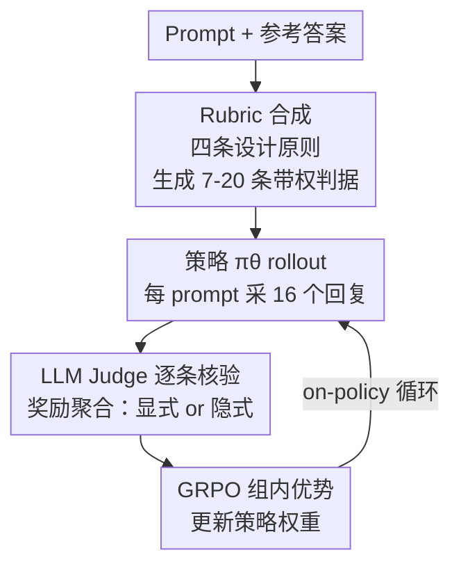

# Rubrics as Rewards: Reinforcement Learning Beyond Verifiable Domains

**会议**: ICLR 2026  
**OpenReview**: [https://openreview.net/forum?id=c1bTcrDmt4](https://openreview.net/forum?id=c1bTcrDmt4)  
**代码**: 数据集已开源 https://huggingface.co/collections/ScaleAI/rar  
**领域**: 对齐RLHF / LLM推理  
**关键词**: rubric 奖励, RLVR, GRPO, on-policy RL, LLM-as-judge

## 一句话总结
本文提出 **Rubrics as Rewards (RaR)**，把"逐条打勾的评分细则（rubric）"当作 on-policy 强化学习的奖励函数，从而把只能用于数学/代码这类"答案可验证"任务的 RLVR 扩展到医学、科学这类没有唯一标准答案的真实推理领域；在 HealthBench 上相对流行的 LLM-as-judge Likert 基线最高提升 31%，在 GPQA-Diamond 上提升 7%。

## 研究背景与动机

**领域现状**：带可验证奖励的强化学习（RLVR, Reinforcement Learning with Verifiable Rewards）在数学、代码等任务上非常成功——这些任务有明确的对错信号，可以用打分函数或测试用例自动判断 $\text{match}(y, \hat{y}) \in \{0,1\}$，无需训练奖励模型。

**现有痛点**：可一旦离开"答案可验证"的舒适区，进入医疗咨询、科学推理这类真实任务，评价就不再是非黑即白，而是依赖多维度、细粒度的判断。常见的两种替代奖励都有硬伤：偏好奖励模型（preference RM）容易过拟合表面特征（回复长度、格式、标注者偏好），还需要海量两两比较数据；直接让 LLM 打一个 1–10 的 Likert 分（Direct-Likert）则信号粗糙、不可解释，judge 容易给出不稳定的整体印象分。

**核心矛盾**：可验证奖励"简单但表达力差"，偏好排名"表达力强但带人为噪声、运维成本高"——真实任务卡在这两者中间，既要刻画"什么是好回答"的多维标准，又不想付出偏好标注的代价。

**本文目标**：找到一个介于二者之间的"中间地带"奖励：既能像 rubric 那样把"好回答"拆成可解释的多个子标准，又能像验证奖励那样自动、可复用地驱动 on-policy RL。

**切入角度**：作者注意到 instance-specific rubric（针对每条 prompt 定制的评分细则）此前只被用于**评测 benchmark**（如 HealthBench 用医生写的细则给模型打分），却几乎没人把它当作**训练时的奖励信号**。如果把 rubric 从"评测工具"变成"奖励函数"，就闭合了"用 rubric 评估 → 用 rubric 训练"的回路。

**核心 idea**：用"逐条打勾的 rubric 清单"代替"单一的偏好分/Likert 分"作为强化学习奖励——每条 prompt 配一组带权重的二值判据，LLM judge 逐条核验后聚合成标量奖励，再用 GRPO 做策略优化。

## 方法详解

### 整体框架

RaR 整个流程分两大块：先离线**为每条 prompt 合成一份 rubric**，再把这份 rubric 喂给 LLM judge 在 GRPO 训练回路里**逐条打分换算成奖励**。

形式化地说，输入是 prompt $x$，策略 $\pi_\theta$ 采样出回复 $\hat{y}$。每条 prompt 关联一组 $k$ 个 rubric 判据 $\{(w_j, c_j)\}_{j=1}^k$，其中 $w_j$ 是该判据的权重，$c_j:(x,\hat{y})\mapsto\{0,1\}$ 是一个二值函数，表示回复是否满足该条标准。最终奖励由这一组判据聚合而成，送入 GRPO 计算组内优势、更新策略。

值得注意的是，RaR 是 RLVR 的**严格超集**：当 $k=1, w_1=1$ 且 $c_1$ 退化为"是否与标准答案精确匹配"时，RaR 就还原成普通的可验证奖励 $r_{\text{RLVR}}(x,\hat{y})=\text{match}(y,\hat{y})$。换句话说，可验证奖励只是"只有一条必答判据"的特例，rubric 奖励把它推广到多维、带权、可同时容纳客观与主观标准的场景。

### 关键设计

**1. 用 instance-specific rubric 当奖励，并遵循四条生成原则**

RaR 的根基是"每条 prompt 配一份专属 rubric"，而非套用一份通用清单。为了让合成的 rubric 真正可用作奖励，作者定下四条 desiderata：**专家锚定**（rubric 要反映领域专家的事实、推理步骤与结论，理想情况下由人类专家或其高质量代理提供）、**覆盖全面**（横跨事实准确性、逻辑连贯、完整性、风格、安全等多维度，并包含负向判据 pitfall 来抓常见/高风险错误）、**判据有轻重**（不同维度重要性不同，事实正确要压过风格清晰，因此给每条判据赋权）、**自包含可独立评判**（每条判据都能脱离外部上下文被单独打勾）。

由于医学/科学领域缺少人工标注的 rubric 数据，作者用强 LLM（医学用 GPT-4o、科学用 o3-mini）**以数据集自带的标准答案作为专家监督的代理**，为每条 prompt 自动生成 7–20 条自包含判据，每条同时带数值权重和类别标签（Essential / Important / Optional / Pitfall）。由此得到两个公开训练集 RaR-Medicine 与 RaR-Science（各约 20k prompt）。这一步把"用参考答案监督"这件事从"直接对比答案"升级成"展开成一组可解释、可复用、可逐条核验的标准"，奖励信号因此更细粒度、也更透明。

**2. 两种奖励聚合：显式加权 vs. 隐式委托**

有了逐条判据，如何把它们合成一个标量奖励是关键。作者给出两条互补路线。**显式聚合（Explicit）**让 LLM judge 独立核验每一条 $c_j$，再做归一化加权和：

$$r(x, \hat{y}) = \frac{\sum_{j=1}^{k} w_j \cdot c_j(x, \hat{y})}{\sum_{j=1}^{k} w_j}$$

归一化让不同 prompt（rubric 条数/权重不同）之间的奖励可比；权重按类别标签映射为 $\{\text{Essential}:1.0,\ \text{Important}:0.7,\ \text{Optional}:0.3,\ \text{Pitfall}:0.9\}$（pitfall 以正向措辞表述，"避免了某类误诊"满足则加分）。这条路线可解释、可控，但权重要手工调，偏脆。

**隐式聚合（Implicit）**则把全部判据连同类别权重一起塞给 judge，让 judge 通盘权衡后直接吐一个整体标量分 $r_{\text{implicit}}(x,\hat{y}) = f_\phi(x, \hat{y}, \{d_j\}_{j=1}^k)$，再归一化到 $[0,1]$。它免去了手工调权，把聚合逻辑委托给 judge 自己。实验显示隐式聚合整体最强——它既保留了 rubric 的多维监督，又规避了显式加权"难调、易脆"的问题。

**3. 用 GRPO 把 rubric 奖励接进 on-policy 训练回路**

奖励算法用 GRPO（Group Relative Policy Optimization），基座策略是 Qwen2.5-7B。每条 prompt 采样 $k=16$ 个回复（上下文 3584、温度 1.0），用 gpt-4o-mini 作为 judge 按上面两种聚合方式给每个回复打奖励，再用组内相对优势更新策略权重。这一步的意义在于：它让 rubric 不只是"评测时打个分"，而是真正进入 on-policy 的反馈闭环——同一份 rubric 可以在每一轮新 rollout 上一致地复用，相当于一个"实例化、可复用的奖励函数"，比不透明的偏好奖励模型更可扩展、更可审计。

### 损失函数 / 训练策略
基座策略 Qwen2.5-7B（另有 3B 鲁棒性验证）；GRPO 算法，batch size 96，学习率 $5\times10^{-6}$，常数调度 + 10% 线性 warmup，单节点 8×H100。每 prompt rollout 16 个回复，judge 为 gpt-4o-mini。奖励即上文的显式/隐式 rubric 聚合分。

## 实验关键数据

### 主实验

两域评测：医学用 HealthBench（rubric 评分、自由生成），科学用 GPQA-Diamond（多选）。judge 统一为 gpt-4o-mini，GPQA 取 10 次运行均值并报 95% 置信区间。

| 方法 | HealthBench Overall | GPQA-Diamond Mean Acc |
|------|--------------------|----------------------|
| Qwen2.5-7B (base) | 7.7 | 31.7 |
| Qwen2.5-7B-Instruct | 22.7 | 35.0 |
| Direct-Likert | 25.5 | 34.8 |
| Reference-Likert | 28.9 | 36.5 |
| RaR-Predefined（通用 rubric） | 12.5 | 31.7 |
| RaR-Explicit | 29.7 | 36.9 |
| **RaR-Implicit** | **31.2** | **37.6** |

RaR-Implicit 相对 Direct-Likert 在 HealthBench 上相对提升约 31%、GPQA 上约 7%；且对 Reference-Likert 也有小而稳定的优势。值得注意的是 **RaR-Predefined（对所有 prompt 套用一份通用 rubric）反而垫底**，说明"实例化"才是关键——通用判据抓不住每条 prompt 的具体要求和典型失败模式，会产生错配的奖励信号。

### 消融实验

在 HealthBench-1k（用 HealthBench-3.5k 子集训练）上做 rubric 生成方式与设计要素的消融：

| 配置 | HealthBench-1k Overall | 说明 |
|------|----------------------|------|
| Expert-Answer-SFT | 20.4% | 直接 SFT 专家答案 |
| Simple-Likert | 23.9% | 单 Likert 分 |
| Reference-Likert | 31.7% | 带参考答案的 Likert |
| RaR-Implicit-Synthetic-NoRef | 32.0% | 合成 rubric，无参考答案 |
| **RaR-Implicit-Synthetic** | **35.9%** | 合成 rubric，有参考答案 |
| RaR-Implicit-Human | 34.8% | 人工 rubric |

| Rubric 设计要素 | Overall | 说明 |
|----------------|---------|------|
| Essential-Only | 34.9% | 只保留必答判据 → 掉点 |
| No Categorical Labels | 38.8% | 去掉类别权重影响很小 |
| No Pitfall Criteria | 37.2% | 去掉负向判据影响很小 |
| All Rubrics | 37.2% | 完整 rubric |

### 关键发现
- **实例化 rubric 是命门**：通用 rubric（RaR-Predefined）甚至不如 instruct 基座，而实例化 rubric 即便最弱变体也能超过 Reference-Likert——结构化、贴合 prompt 的多维监督在主观开放域里收益最大。
- **参考答案/专家锚定至关重要**：无参考答案的合成 rubric（32.0%）明显弱于有参考答案的（35.9%）；人工 rubric（34.8%）与"有参考答案的合成 rubric"相当，说明"参考答案作为专家代理"是行之有效的廉价替身。
- **rubric 让小 judge 更可靠**：rubric 引导显著提升各尺度 judge 与人类偏好的对齐，且对**小 judge 提升最大**，缩小了与大 judge 的差距，降低了跨尺度的性能方差。
- **权重/pitfall 的边际收益有限**：去掉类别权重或负向判据几乎不掉点——作者推测是合成 pitfall 本身难写好（需要预判模型的典型失败模式，依赖人类直觉），合成的负向判据特异性不足。
- **对基座尺寸鲁棒**：换成 Qwen2.5-3B 后趋势一致，RaR-Implicit（21.55%）仍稳超 Direct-Likert（13.74%）与 Reference-Likert（17.95%）。

## 亮点与洞察
- **把 RLVR 形式化为 rubric 奖励的特例**（$k=1$ 单条必答判据）是个漂亮的统一视角——它让"可验证奖励"和"多维主观奖励"落在同一个框架里，理论上很干净。
- **"参考答案 → 展开成 rubric"是核心 trick**：与其让 judge 直接拿参考答案对比打一个整体分（Reference-Likert），不如先把参考答案拆成一组可逐条核验的判据再打分，信号更细、更稳、更可解释。这个"把整体监督展开成 checklist"的思路可迁移到任何有参考答案/专家说明的领域。
- **隐式聚合赢过显式加权**反直觉但实用：与其辛苦手调权重，不如把判据全交给 judge 通盘权衡，既省事又更强；这暗示在多判据奖励里，让强 judge 做软聚合可能比人工硬加权更鲁棒。
- **rubric 对小 judge 尤其救命**：用便宜的小 judge 也能靠 checklist 把对齐拉到接近大 judge，这对降低训练时的奖励计算成本很有价值。

## 局限与展望
- **rubric 质量受参考答案质量制约**：rubric 是用强 LLM + 参考答案合成的，参考答案差则 rubric 差；纯合成（无参考）rubric 在高风险领域仍捕捉不到细微判据。
- **pitfall / 权重收益弱**：合成负向判据难以预判真实失败模式，目前价值有限；作者提出未来可探索学习式/动态权重，在保持可解释的同时提升适应性。
- **显式 vs 隐式是 application-dependent**：显式可控可解释但脆、难调；隐式强但牺牲了对单条判据的细粒度控制，作者把选择权留给实践者，没给出统一结论。
- **judge 仍是 LLM**：奖励质量依赖 judge 的判断力，judge 自身的偏置可能传导进策略；论文用 gpt-4o-mini 作 judge，更强/更弱 judge 的系统性影响只在附录部分展开。
- 评测集中在医学与科学两域，是否能推广到法律、金融等其他"难验证"领域仍待验证。

## 相关工作与启发
- **vs RLVR（GENERAL-REASONER / MED-RLVR 等扩域工作）**：这些工作仍依赖"可验证/单一正确答案"或跨域奖励模型，本文用 rubric 把监督从"单条对错"变成"多条带权判据"，覆盖了correctness 多面、无法严格验证的场景，是 RLVR 的真子集推广。
- **vs 偏好奖励模型（preference RM / RLHF）**：偏好 RM 需海量两两比较且易过拟合长度/格式等表面特征，本文用 instance-specific rubric 提供可解释、可复用、自动化的逐条监督，规避了偏好标注的运维成本与人为噪声。
- **vs 把 rubric 仅用于评测（HealthBench / Arora et al.）**：先前 rubric 只在 benchmark 里给模型打分，本文首次把 rubric 转成 on-policy RL 的奖励函数，闭合"评估—训练"回路，且在 rubric 评分与可验证多选两类任务上都涨点。
- **vs 并行的 checklist/rubric 偏好调优工作（Gallego 2025 等）**：它们多用于偏好微调或安全，本文聚焦把 rubric 变成 on-policy RL 奖励、瞄准专家级推理与真实应用域。

## 评分
- 新颖性: ⭐⭐⭐⭐ 把"评测用 rubric"转成"训练用奖励函数"并形式化为 RLVR 超集，视角新且实用，但 rubric 思想本身是当下热点。
- 实验充分度: ⭐⭐⭐⭐ 两域 + 多基线 + 丰富消融（生成方式/设计要素/judge 尺度/基座尺寸），较扎实；但只覆盖医学与科学两域。
- 写作质量: ⭐⭐⭐⭐ 动机—形式化—方法—实验链条清晰，RLVR 特例化的论证简洁有力。
- 价值: ⭐⭐⭐⭐ 给"难验证领域如何做 on-policy RL"提供了可解释、可复用、低标注成本的奖励范式，并开源了 RaR-Medicine/Science 数据集，实践价值高。

<!-- RELATED:START -->

## 相关论文

- [\[ICLR 2026\] Reinforcement Learning with Verifiable Rewards Implicitly Incentivizes Correct Reasoning in Base LLMs](reinforcement_learning_with_verifiable_rewards_implicitly_incentivizes_correct_r.md)
- [\[ICLR 2026\] LongRLVR: Long-Context Reinforcement Learning Requires Verifiable Context Rewards](longrlvr_long-context_reinforcement_learning_requires_verifiable_context_rewards.md)
- [\[ICLR 2026\] From Verifiable Dot to Reward Chain: Harnessing Verifiable Reference-based Rewards for RL of Open-ended Generation](from_verifiable_dot_to_reward_chain_harnessing_verifiable_reference-based_reward.md)
- [\[ICLR 2026\] References Improve LLM Alignment in Non-Verifiable Domains](references_improve_llm_alignment_in_non-verifiable_domains.md)
- [\[ICLR 2026\] Lookahead Tree-Based Rollouts for Enhanced Trajectory-Level Exploration in Reinforcement Learning with Verifiable Rewards](lookahead_tree-based_rollouts_for_enhanced_trajectory-level_exploration_in_reinf.md)

<!-- RELATED:END -->
