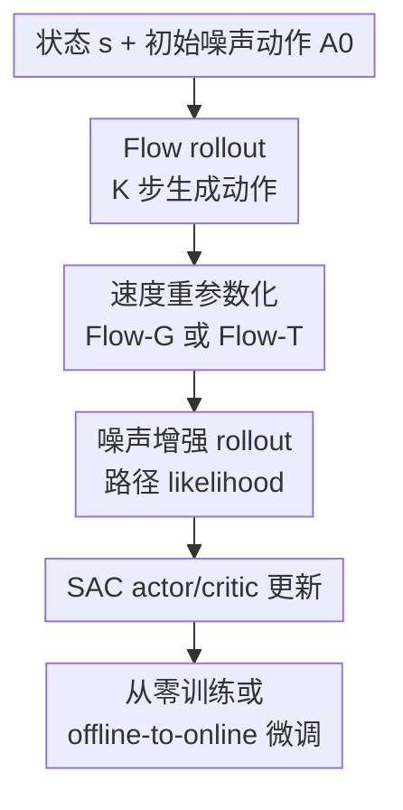

# SAC Flow: Sample-Efficient Reinforcement Learning of Flow-Based Policies via Velocity-Reparameterized Sequential Modeling

**会议**: ICLR2026  
**OpenReview**: [https://openreview.net/forum?id=zZvWj4JrYj](https://openreview.net/forum?id=zZvWj4JrYj)  
**代码**: https://anonymous.4open.science/r/SAC-FLOW  
**领域**: 强化学习  
**关键词**: 流策略、Soft Actor-Critic、离策略强化学习、序列建模、机器人操作  

## 一句话总结
SAC Flow 将 flow-based policy 的多步采样过程视作残差 RNN，并用 GRU/Transformer 式速度网络和噪声增强 rollout 让 SAC 可以端到端稳定训练高表达力的流策略，在连续控制与离线到在线操作任务上取得更高样本效率。

## 研究背景与动机
**领域现状**：连续控制里的标准策略通常是高斯 actor，训练简单、能直接接入 SAC/TD3/PPO 等算法，但表达力有限。机器人操作、动作 chunking 和多模态决策常常需要输出一整段动作序列，同一个状态下也可能存在多个合理动作模式，单峰高斯很难描述这种分布。扩散策略和 flow-based policy 因而被引入到控制问题中：前者表达力强但推理和训练都较重，后者基于 flow matching，采样步数更少，也更容易从演示数据中学习复杂动作分布。

**现有痛点**：flow-based policy 在模仿学习中已经有不错表现，但一旦想用离策略 RL 直接微调，就会撞上两个问题。第一，动作不是一次网络前向直接给出，而是从噪声动作 $A_{t_0}$ 出发，经过 $K$ 次 Euler 更新得到 $A_{t_K}$，actor 更新需要把 Q 函数梯度反传过整条采样链；第二，SAC 需要策略 likelihood 来做熵正则，而确定性的 flow rollout 没有一个容易计算的显式密度。已有方法通常绕开这两个问题：要么把 flow 蒸馏成一个更简单的一步 actor，要么用 surrogate objective 避免穿过完整 rollout 反传。这些做法能稳一点，但也把优化目标和原本高表达力的生成器拆开了。

**核心矛盾**：作者认为不稳定的根因并不是 SAC 本身，而是标准 flow rollout 的计算结构。Euler 更新

$$
A_{t_{i+1}} = A_{t_i} + \Delta t_i v_\theta(t_i, A_{t_i}, s)
$$

在形式上就是一个残差递归网络：中间动作 $A_{t_i}$ 是 hidden state，速度网络给出残差更新。离策略 actor loss 的梯度从最终动作一路反传到初始噪声时，会遇到和 vanilla RNN 类似的长 Jacobian 乘积，因而容易梯度爆炸或消失。flow policy 需要多步采样来保持表达力，但多步反传又正是训练不稳定的来源。

**本文目标**：论文要解决的是“如何不牺牲 flow policy 表达力，又能像普通 actor 一样用样本高效的 off-policy RL 训练”。这被拆成三个子问题：重新参数化速度网络以稳定 $K$ 步反传；为 SAC 构造可用的 likelihood/entropy 项；同时覆盖从零在线训练和有离线演示的 offline-to-online 微调。

**切入角度**：作者的切入点很直接：既然 flow rollout 像 RNN，那就用序列建模里已经被验证过的稳定结构来改造它。GRU 用门控控制 hidden state 更新强度，Transformer 用 pre-norm residual block 稳定深层信息传播；把这些机制放进 velocity parameterization，就能从结构上缓解 flow rollout 的梯度病态，而不是在算法层面绕开原始 flow。

**核心 idea**：把 flow-based policy 的速度场从普通 MLP 改成“速度重参数化的序列模型”，再配合噪声增强 rollout 计算路径 likelihood，让 SAC 可以直接端到端优化 flow policy。

## 方法详解

### 整体框架
SAC Flow 的整体流程可以理解成三层：最底层仍是 rectified flow policy，从高斯噪声动作逐步积分到最终动作；中间层把速度网络替换为 Flow-G 或 Flow-T，以稳定多步反传；最外层把这个 flow actor 放进 SAC，并通过噪声增强 rollout 得到可用于 entropy regularization 的路径 log-prob。对于稠密奖励 MuJoCo，算法从零与环境交互训练；对于稀疏奖励操作任务，则先在专家数据上做 flow-matching 预训练，再用带行为邻近正则的 SAC 进行 online fine-tuning。

从实现角度看，Flow-G 和 Flow-T 都是对速度场 $v_\theta$ 的 drop-in replacement：外部的 Euler 积分、tanh squash、replay buffer、critic target 和 SAC 更新流程都保留。因此本文的重点不是发明一个全新的 RL 目标，而是把 flow actor 这类复杂策略变成 SAC 可以稳定优化的策略类。

### 关键设计
**1. Flow rollout 作为序列模型：把不稳定问题定位到长链反传**

标准 flow policy 在推理时从 $A_{t_0}\sim \mathcal{N}(0,I)$ 出发，重复执行 $A_{t_{i+1}}=A_{t_i}+\Delta t_i v_\theta(t_i,A_{t_i},s)$，最终用 $a=\tanh(A_{t_K})$ 得到动作。作者指出，这个更新和残差 RNN 的 hidden-state transition 是同一个代数形式：$A_{t_i}$ 是隐状态，$(t_i,s)$ 是输入，$\Delta t_i v_\theta$ 是残差 cell。于是，直接用 SAC 的 actor loss 更新 flow policy 时，梯度会包含

$$
\nabla_{A_{t_0}} L = \nabla_{A_{t_K}} L \prod_{i=0}^{K-1}\left(I + \Delta t_i \frac{\partial v_\theta(t_i,A_{t_i},s)}{\partial A_{t_i}}\right).
$$

这个乘积解释了为什么 naive SAC Flow 容易炸：只要这些 Jacobian 的奇异值长期偏离 1，梯度就会随采样步数指数级放大或衰减。这个观察的价值在于，它把“flow policy 难以 off-policy 训练”从经验现象变成了结构性诊断，也自然导向了用 GRU/Transformer 稳定递归计算的方案。

**2. Flow-G：用 GRU 式门控控制每一步 velocity 更新强度**

Flow-G 用一个 gate network 和一个 candidate network 替代普通 MLP velocity。给定 $[s; A_{t_i}; t_i]$，门控 $g_i=\sigma(f_z([s;A_{t_i};t_i]))$ 决定这一维中间动作应该保留多少，候选网络给出新的动作方向，更新可以写成

$$
A_{t_{i+1}} = A_{t_i} + \Delta t_i g_i \odot (\hat v_i - A_{t_i}).
$$

这相当于把 GRU 的“保留旧状态 / 写入新状态”的机制放进 flow velocity。若某些维度需要稳定传递，gate 可以接近 0，让 Jacobian 更接近恒等映射；若需要快速改变动作，gate 可以放大候选更新。相比普通 MLP 在每一步都无条件输出残差，Flow-G 给 rollout 自己一个调节梯度和更新幅度的阀门，因此在 $K$ 步 BPTT 中更不容易出现爆炸。

论文实现里还对 gate 做了有利于早期稳定的初始化，例如 gate head 的权重置零、bias 设为正值，并在 from-scratch/offline-to-online 两种设定下使用不同 hidden width。这些细节不是核心创新，但和“让 flow rollout 一开始就不要太病态”这个目标是一致的。

**3. Flow-T：用状态条件 Transformer decoder 产生 decoded velocity**

Flow-T 走的是另一条序列建模路线：不是显式门控，而是把 velocity network 设计成 pre-norm residual Transformer decoder。它先把当前动作-时间 token $(A_{t_i},t_i)$ 投影成 action-time embedding，再把环境状态 $s$ 编码成一个全局状态 memory。每个 decoder block 对 action-time token 做位置独立的 self transformation，并通过 cross-attention 查询状态 embedding，最后由线性头投影出 velocity。

这里有一个容易误读的点：Flow-T 不是用 causal Transformer 建模一串历史动作 token。为了保持 flow policy 的 Markov 性，它不让不同采样步的 token 互相泄漏历史，而是让每次 velocity evaluation 都用当前 $A_{t_i}$ 和同一个状态上下文来解码。pre-LN、residual connection 和 FFN block 提供类似现代 Transformer 的稳定深层传播条件，decoded velocity 则比单纯 MLP 更能利用状态条件信息。换句话说，Flow-T 把“每一步速度预测”升级成状态条件的 residual decoding，而不是把控制问题变成自回归序列生成。

**4. 噪声增强 rollout：让 SAC 有可计算的路径 likelihood**

SAC 的 actor 和 critic target 都要用到 entropy 项，因此必须知道策略 log-prob。确定性 flow rollout 的最终动作密度需要积分掉所有中间状态，直接计算很困难。SAC Flow 的做法是在 rollout 中加入各向同性高斯噪声和补偿 drift，使最终动作边缘分布保持不变，同时每一步转移变成高斯条件分布：

$$
A_{t_{i+1}} \mid A_{t_i},s \sim \mathcal{N}(A_{t_i}+b_\theta(t_i,A_{t_i},s)\Delta t_i,\sigma_i^2 I).
$$

这样整条路径 $A=(A_{t_0},\ldots,A_{t_K})$ 的联合密度可以分解为 base density、逐步 Gaussian transition 和 tanh squash 的 Jacobian，记作 $p_c(A\mid s)$。主文把 $\log p_c(A\mid s)$ 作为 SAC entropy 的可用替代项：actor loss 近似为 $\alpha \log p_c(A\mid s)-Q(s,a)$，critic target 也用下一状态采样路径的 $\log p_c$。附录进一步说明，这个 surrogate 与真实边缘 entropy 的差异可以解释成路径熵正则；它会给 critic 带来一定偏置，但换来更稳定、更可实现的 off-policy flow training。

### 一个完整示例
假设在 OGBench 的 cube-triple 任务中，机械臂状态 $s$ 表示三个方块与目标位置，策略要输出一段 action chunk。SAC Flow 先从 $A_{t_0}\sim \mathcal{N}(0,I)$ 采样一个动作序列噪声；第 1 到第 $K$ 步不再用普通 MLP 直接给残差，而是用 Flow-T 把当前动作-时间 token 与状态 embedding 做 cross-attention，得到 decoded velocity，并执行 Euler 更新。若使用 noisy rollout，训练时每一步还会采样一个带方差的高斯转移，最终 $A_{t_K}$ 经过 tanh 压到动作范围内。

这条轨迹随后进入 SAC 更新。critic 看到 replay buffer 中的状态、动作、奖励和下一个状态，按照 soft Bellman target 更新；actor 则重新从当前策略采样一条 flow path，用 $Q(s,\tanh(A_{t_K}))$ 鼓励高价值动作，同时用 $\log p_c(A\mid s)$ 保持熵正则。offline-to-online 版本会先用专家数据把 flow policy 预训练到能完成基础操作，再在在线交互中逐渐让 Q 值驱动策略超越原始演示，同时用行为邻近项避免稀疏奖励阶段过早偏离 replay buffer。

### 损失函数 / 训练策略
从零训练时，SAC Flow 保持 SAC 的 actor-critic 结构。actor loss 可概括为

$$
L_{actor}(\theta)=\mathbb{E}_{s,A\sim \pi_\theta}\left[\alpha \log p_c(A\mid s)-Q_\phi(s,\tanh(A_{t_K}))\right],
$$

critic 使用 replay buffer 中的 $(s_h,a_h,r_h,s_{h+1})$，目标项包含下一状态 flow path 的 entropy surrogate：

$$
r_h + \gamma\left(Q_{\bar\phi}(s_{h+1},a_{h+1})-\alpha \log p_c(A_{h+1}\mid s_{h+1})\right).
$$

offline-to-online 训练额外加入行为邻近正则，形式上是在 actor loss 中加入 $\lambda\|a_h-a\|$ 或同类 replay proximity 项。训练先以专家数据为 buffer 做 flow-matching 预训练，再进行 $L_{off}+L_{on}$ 轮更新；进入 online 阶段后，算法开始与环境交互并把新数据加入 buffer。论文强调 $\lambda$ 对稀疏奖励任务影响很大，通常离线阶段用较强正则，在线阶段适当减弱，让策略既不脱离数据支持，又能利用新经验改进。

实验实现里，from-scratch 设定基于 CleanRL，所有方法跑 5 个随机种子并报告 95% 置信区间。flow policy 常用较小采样步数 $K$ 控制反传深度和延迟；offline-to-online 中 Flow-G/Flow-T 使用 $K=4$，扩散类基线通常用更多 denoising steps。Flow-T 使用 pre-norm residual decoder，Flow-G 使用 gate bias 等稳定化初始化，tanh squash 的 Jacobian 被纳入 log-prob 计算。

## 实验关键数据

### 主实验
论文在三类环境上评估：MuJoCo 用于稠密奖励从零训练，OGBench cube-double/triple/quadruple 用于复杂稀疏奖励 offline-to-online，Robomimic Lift/Can/Square 用于人类演示数据上的操作微调。主文结果多以曲线图呈现，PDF 文本抽取没有给出每个任务的完整数值表，因此下面只记录论文明确给出的相对结论和设置，避免把图中曲线读成伪精确数字。

| 设置 | 数据集 / 任务 | 对比方法 | 主要指标 | SAC Flow 结果 |
|------|---------------|----------|----------|---------------|
| 从零训练 | MuJoCo Hopper、Walker2D、HalfCheetah、Ant、Humanoid、HumanoidStandup | QSM、DIME、FlowRL、SAC、PPO | episodic return / 训练曲线 | Flow-G/Flow-T 在除 Humanoid 外的任务上达到可比或更好表现，主文称相对强基线最高约 130% 提升 |
| 稀疏奖励离线到在线 | OGBench cube-double/triple/quadruple | ReinFlow、FQL、QC-FQL | success rate | Flow-T 尤其在 cube-triple、cube-quadruple 上快速收敛，主文称成功率最高约 60% 提升 |
| 演示数据离线到在线 | Robomimic Lift、Can、Square | ReinFlow、FQL、QC-FQL | success rate | Flow-G/Flow-T 与 QC-FQL 大体相当，并在 1M online steps 下优于 ReinFlow |
| 困难稀疏任务从零训练 | Robomimic-Can、OGBench cube | 多种 RL/flow/diffusion baseline | success rate / return | 所有方法都难以直接从零解决，说明 offline-to-online 预训练并非可有可无 |

### 消融实验
| 消融项 | 对比配置 | 观察指标 | 结论 |
|--------|----------|----------|------|
| 速度网络参数化 | Naive SAC Flow with MLP velocity vs SAC Flow-G / Flow-T | 训练曲线与 rollout 梯度范数 | Naive 版本梯度范数在训练中显著放大，论文报告可达到稳定 Flow-G 的约十倍；Flow-G/Flow-T 收敛更稳 |
| 采样步数 $K$ | 不同 flow sampling steps | 性能与稳定性 | Flow-G/Flow-T 对采样步数更鲁棒，尤其 Flow-T 在更深 rollout 下仍能保持稳定训练 |
| Transformer 结构细节 | Flow-T 的 layer、head、model dimension | from-scratch / offline-to-online 表现 | 默认设置外的多种 Transformer 规格仍能稳定工作，说明收益不只来自某个偶然超参 |
| Gate 宽度 | Flow-G gate width 512、256、64 | 收敛和最终性能 | gate width 256 仍能稳定，过小如 64 会明显损害最终性能，说明门控容量不能太低 |
| 换 RL 算法 | Flow-G/Flow-T 接入 TD3 | TD3 训练曲线 | 结构稳定性不依赖 SAC；直接用 TD3 微调普通 flow 失败或次优，而 Flow-G/Flow-T 仍有效 |
| 架构与目标解耦 | DIME vs DIME Flow-T vs SAC Flow-T | MuJoCo 曲线 | DIME 换成 Flow-T 后也明显变强，但 SAC Flow-T 仍匹配或优于 DIME Flow-T，说明主要瓶颈是 rollout 架构稳定性 |

### 关键发现
- 最核心的实验证据不是某一个任务的最高分，而是“naive flow + off-policy RL 会爆，Flow-G/Flow-T 后能稳定训练”这一组消融。它直接支撑了论文关于 RNN 式梯度病态的诊断。
- Flow-T 往往是更强版本，尤其在 OGBench 复杂稀疏操作任务上更突出；Flow-G 更轻量，门控机制清晰，适合需要较低计算成本的场景。
- Robomimic 上 SAC Flow 只达到与 QC-FQL 接近的水平，说明 direct flow fine-tuning 不是在所有演示数据任务上都碾压辅助蒸馏方法；它的优势更明显地体现在需要在线样本效率和多模态动作表达同时成立的环境。
- 附录中 SAC baseline 在 Ant-v4 上需要任务特定超参才能恢复正常表现，这提示主实验的统一超参设定更强调横向公平和可复现，但也可能低估某些经典 baseline 的精调上限。

## 亮点与洞察
- 把 flow rollout 看成残差 RNN 是本文最干净的洞察。这个视角把一个“生成模型策略不好训”的问题翻译成大家熟悉的序列反传稳定性问题，使 Flow-G/Flow-T 的设计不是任意换 backbone，而是对准了长 Jacobian 乘积。
- 论文没有为了接 SAC 而蒸馏出一个普通 actor，这一点很重要。很多 flow/diffusion RL 方法在 online 阶段实际优化的是辅助策略，表达力和训练目标会脱节；SAC Flow 试图保留原始 flow policy 的多模态动作分布，并直接用 Q 值更新它。
- 噪声增强 rollout 的作用不只是“给 log-prob”。它把不可处理的最终动作密度换成可分解的路径密度，也隐含了路径熵正则，使 critic 更保守。这个偏置-稳定性的交换在深度 RL 里很现实。
- Flow-G 和 Flow-T 可以迁移到 SAC 之外的离策略算法。附录里的 TD3 实验说明，只要算法需要反传穿过 flow actor，稳定 velocity parameterization 都可能有用；未来可以把同样思想放进 offline RL、safe RL 或 model-based planning 的 flow actor 中。
- 对机器人学习而言，这篇论文的价值在于连接“高表达力动作生成器”和“样本高效在线改进”。它不只是在操作任务上刷成功率，而是在解决 flow policy 能不能真正进入 RL 训练闭环的问题。

## 局限与展望
- 实验主要仍在仿真环境中完成，结论覆盖 MuJoCo、OGBench、Robomimic，但真实机器人上的噪声、延迟、视觉观测和安全约束还没有被系统验证。论文也把真实机器人验证作为后续方向。
- Flow-T 增强了稳定性和表达力，但每次 velocity evaluation 都要跑 Transformer decoder；在实时控制中，$K$ 步 rollout 与 decoder 层数会直接影响延迟。论文用较小 $K$ 缓解这个问题，但没有给出足够细的实时推理开销分析。
- 噪声增强 rollout 使用路径密度 $p_c(A\mid s)$ 近似 SAC entropy，会带来路径正则偏置。附录解释了这个偏置为什么可接受，但不同任务中路径熵权重、噪声方差和 critic 保守性的关系仍需要更细的理论和实证分析。
- 离线到在线设定对行为邻近正则 $\lambda$ 很敏感。论文沿用/调整了 QC-FQL 风格的配置，但如果换成更杂、更低质量的离线数据，如何自动调节 $\lambda$ 仍是开放问题。
- Flow-G/Flow-T 解决的是多步反传稳定性，不直接解决探索。稀疏奖励任务中仍然依赖专家数据预训练；从零解决 hard exploration 的能力并没有被本文突破。

## 相关工作与启发
- **vs FlowRL**: FlowRL 也是 flow-based policy 的在线 RL 方法，但更多通过直接最大化 Q 值并加 Wasserstein-2 约束来规避稳定性问题；SAC Flow 则从 velocity network 的序列结构入手，让原始 flow actor 能在 SAC 目标下端到端训练。
- **vs FQL / QC-FQL**: FQL 和 QC-FQL 在 offline-to-online 阶段依赖辅助的一步噪声条件策略或蒸馏策略，使在线优化更像是在训练一个可控的 surrogate actor。SAC Flow 不引入这种辅助 actor，而是直接 fine-tune flow policy，因此表达力保留得更完整，但也需要更复杂的 likelihood 与稳定化设计。
- **vs ReinFlow**: ReinFlow 用 PPO 类 on-policy fine-tuning 训练 flow policy，样本效率通常不如 off-policy 方法。SAC Flow 的目标就是把 flow policy 接入 SAC 这样的离策略框架，在 1M online steps 内获得更强改进。
- **vs DIME / QSM 等 diffusion RL**: DIME 和 QSM关注扩散策略如何利用 Q 函数或最大熵目标，表达力强但采样步数和目标设计更复杂。SAC Flow 利用 rectified flow 的少步采样优势，并把复杂性集中在 velocity parameterization 上。
- **对后续工作的启发**: 只要策略采样过程是可微的多步生成链，就应该检查它是不是隐藏了一个“深 RNN”。如果是，那么直接套 actor-critic 之前，先把采样链的梯度传播结构修好，往往比在外层目标上打补丁更根本。

## 评分
- 新颖性: ⭐⭐⭐⭐⭐ 从“flow rollout = residual RNN”推出 GRU/Transformer velocity reparameterization，问题定位和方法设计都很有辨识度。
- 实验充分度: ⭐⭐⭐⭐ 覆盖从零训练、offline-to-online、主基线、梯度消融和跨算法 TD3，但真实机器人和更精细的效率分析仍不足。
- 写作质量: ⭐⭐⭐⭐ 主线清楚，附录推导充分；不足是部分主结果以曲线为主，文本表格数值不够集中，读者复现实验结论时需要反复看图。
- 价值: ⭐⭐⭐⭐⭐ 对 flow/diffusion policy 与样本高效 RL 的结合很有参考价值，尤其适合需要多模态动作表达又不能承受 on-policy 样本成本的控制任务。

<!-- RELATED:START -->

## 相关论文

- [\[ICLR 2026\] Mean Flow Policy with Instantaneous Velocity Constraint for One-step Action Generation](mean_flow_policy_with_instantaneous_velocity_constraint_for_one-step_action_gene.md)
- [\[ICML 2026\] Reverse Flow Matching: A Unified Framework for Online Reinforcement Learning with Diffusion and Flow Policies](../../ICML2026/reinforcement_learning/reverse_flow_matching_a_unified_framework_for_online_reinforcement_learning_with.md)
- [\[ICLR 2026\] GoldenStart: Q-Guided Priors and Entropy Control for Distilling Flow Policies](goldenstart_q-guided_priors_and_entropy_control_for_distilling_flow_policies.md)
- [\[ICLR 2026\] Reinforcement Learning via Value Gradient Flow](reinforcement_learning_via_value_gradient_flow.md)
- [\[ICLR 2026\] Bridging Successor Measure and Online Policy Learning with Flow Matching-Based Representations](bridging_successor_measure_and_online_policy_learning_with_flow_matching-based_r.md)

<!-- RELATED:END -->
