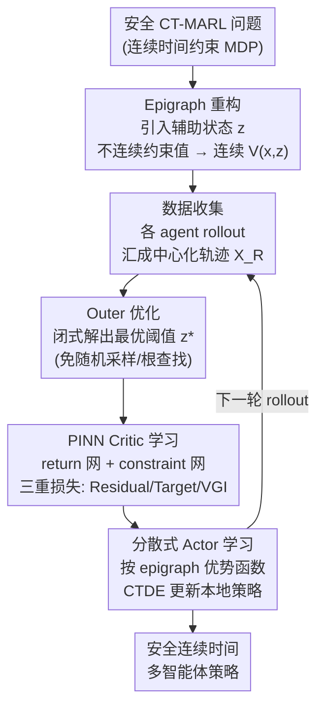

# Safe Continuous-time Multi-Agent Reinforcement Learning via Epigraph Form

**会议**: ICLR 2026  
**arXiv**: [2602.17078](https://arxiv.org/abs/2602.17078)  
**代码**: [GitHub链接](https://github.com/xuefeng-wang/EPI)  
**领域**: 强化学习  
**关键词**: 连续时间RL, 多智能体, 安全约束, HJB方程, Epigraph重构

## 一句话总结

提出首个显式处理状态约束的连续时间多智能体RL框架，通过Epigraph形式将不连续的约束值函数转化为连续表示，结合改进的PINN actor-critic方法实现安全、稳定的连续时间多智能体控制。

## 研究背景与动机

多智能体强化学习（MARL）的大多数算法基于离散时间MDP和Bellman方程，假设固定的决策时间间隔。然而，许多实际场景（自动驾驶、金融交易、机器人协作）本质上是连续时间控制问题，离散时间离散化在高频或不均匀时间间隔下会导致性能退化和训练不稳定。

现有的连续时间MARL方法基于Hamilton-Jacobi-Bellman（HJB）方程，使用物理信息神经网络（PINN）逼近值函数。但它们**几乎不考虑安全约束**（如碰撞惩罚），原因是状态约束引入值函数的不连续性，使得HJB-PINN难以准确逼近。

核心矛盾：安全MARL需要处理约束，但约束导致值函数不连续，而PINN只能逼近光滑函数。本文通过**Epigraph重构**巧妙地将不连续值化为连续表示来解决这一矛盾。

## 方法详解

### 整体框架

EPI 要解决的是「连续时间、多智能体、还要满足安全约束」这三件事撞在一起时 PINN 逼近会崩的问题。它先把安全 CT-MARL 形式化成连续时间约束 MDP（CT-CMDP），目标是最小化累积代价、同时让状态约束（如碰撞惩罚）始终满足。麻烦在于约束会让值函数变得不连续，而 HJB-PINN 只能逼近光滑函数。EPI 的破局点是用 Epigraph 重构引入一个辅助状态 $z$，把不连续的约束值函数抬升成一个连续的辅助值函数 $V(x,z)$，PINN 就能稳定逼近了。围绕这个表示，它搭了一套 inner-outer 优化的 actor-critic 训练回环：每轮先把各 agent 的 rollout 汇成中心化轨迹，outer 层在轨迹上闭式解出最优阈值 $z^*$，inner 层用 PINN 训练 critic（return 网络 + constraint 网络）逼近 $V(x,z^*)$，actor 再在 CTDE（集中训练、分散执行）框架下按本地观测学分散策略，更新后的策略又驱动下一轮 rollout。

### 关键设计

**1. Epigraph 重构：把不连续的约束值抬成连续的辅助值函数**

这是全文的理论支点，直接对准「约束→值函数不连续→PINN 失效」这条死结。做法是引入辅助状态 $z(t)$，定义一个统一了目标代价和约束的辅助值函数：

$$V(x,z) = \min_{u} \max\Big\{\max_\tau c(x(\tau)),\; \int_t^\infty \gamma^{\tau-t} l(x(\tau),u(\tau))\,d\tau - z\Big\}$$

外层 $\max$ 把「轨迹上最严重的约束违反 $\max_\tau c$」和「相对于阈值 $z$ 的累积代价」并到一起。Lemma 3.1 证明原始约束值可以从这个辅助函数恢复：$v(x) = \min\{z \in \mathbb{R} \mid V(x,z) \leq 0\}$，也就是说求约束值变成了在 $z$ 轴上找 $V$ 的零水平集。关键收益在 Theorem 3.3——$V(x,z)$ 是连续的（对应 epigraph HJB PDE 粘性解的存在唯一性），而原始约束值函数不连续。连续了，PINN 才有逼近的前提。

**2. 改进的 Outer 优化：训练时直接解出 $z^*$，告别随机采样**

有了 $V(x,z)$ 还得确定用哪个 $z$。先前方法（如 EPPO）在训练里随机采样 $z$，这会注入非平稳噪声、破坏策略更新的稳定性，执行时还得做一次昂贵的根查找。EPI 的改法是把 return 网络和 constraint 网络都设计成只依赖 $x$、不依赖 $z$，于是最优阈值可以直接闭式地解出来：

$$z^* = \min\{z \mid \max\{V_\phi^{\text{cons}}(x),\, V_\psi^{\text{ret}}(x) - z\} \leq 0\}$$

训练时直接喂这个 $z^*$，去掉了采样噪声这个不稳定来源；执行时因为网络不依赖 $z$，也就无需再做根查找，省掉了在线开销。

**3. PINN-based Critic：三重损失互补，残差不再单打独斗**

critic 要在无限时域、没有边界条件的情况下学准 $V(x,z)$，单靠 HJB 残差是不够的，所以 EPI 用三种损失互补。残差损失惩罚 HJB PDE 的违反，$\mathcal{L}_{\text{Residual}} = (\max\{c(x)-\tilde{V},\, \min_u \mathcal{H}\})^2$，提供 PDE 结构约束；目标损失 $\mathcal{L}_{\text{Target}} = (V_{\text{tgt}} - \tilde{V})^2$ 用基于轨迹的数值目标当锚点，专门补无限时域下缺边界条件导致的值函数漂移；值梯度迭代（VGI）则约束 $\nabla_x V$ 的一致性，把值梯度学准。这一点尤其关键——因为 actor 的优势函数直接用到 $\nabla_x V$，梯度不准策略更新就会被带歪，所以残差损失反而不是最重要的那个。

**4. 分散式 Actor 学习：按 epigraph 优势函数做 CTDE 更新**

actor 走集中训练、分散执行（CTDE）的路线，每个 agent 只用本地观测就能行动。它的更新信号是 epigraph 形式下的优势函数：

$$A(x_t,z_t^*,u_t) = \max\{c(x_t)-V,\; \nabla_x V \cdot f(x,u) - \partial_z V \cdot l(x,u) + \ln\gamma \cdot V\}$$

这里同样是用 $\max$ 把约束项和代价项耦合进同一个优势里。由于真实的动力学和代价函数未知，EPI 用学习到的动力学网络 $f_\xi$ 和代价网络 $l_\phi$ 来替代它们，从而在 model-based 的意义下把上式算出来驱动策略更新。

### 损失函数 / 训练策略

Critic 总损失把三项加权求和：$\mathcal{L}_{\text{Critic}} = \lambda_{\text{res}}\mathcal{L}_{\text{Residual}} + \lambda_{\text{tgt}}\mathcal{L}_{\text{Target}} + \lambda_{\text{vgi}}\mathcal{L}_{\text{VGI}}$；actor 损失为 $\mathcal{L}_{\text{actor}} = \mathbb{E}[A_\theta(x,z^*,u)]$。三个权重通过网格搜索确定。

## 实验关键数据

### 主实验（连续时间Safe MPE + MuJoCo）

| 方法 | 方向 | 约束与代价优势 |
|------|------|---------------|
| MACPO | 信赖域约束 | 过于保守 |
| MAPPO-Lag | 拉格朗日松弛 | 平衡不稳定 |
| SAC-Lag | 离策略+拉格朗日 | 约束满足差 |
| EPPO | 随机采样z | 卡在次优 |
| CBF | 控制屏障函数 | 保守但合理 |
| **EPI (ours)** | **$z^*$直接优化** | **代价和约束均接近最优** |

### 消融实验

| 配置 | 关键指标 | 说明 |
|------|---------|------|
| 完整EPI | 最优 | 三重损失+$z^*$优化 |
| 去除Target损失 | 显著退化 | 无界问题中值函数漂移 |
| 去除VGI损失 | 严重退化 | 值梯度不准确→策略更新有害 |
| 去除Residual损失 | 轻微影响 | PDE结构在有VGI时不太关键 |
| 过度加权任一损失(×20) | 退化 | 平衡权重最优 |

### 关键发现
- EPPO因随机采样 $z$ 导致收敛到次优解
- Target和VGI损失对无限时域问题至关重要，残差损失相对次要
- EPI在Formation、Line、Target等MPE场景中一致性达到最低代价和约束违反
- 在MuJoCo（HalfCheetah、Ant）中也优于基线

## 亮点与洞察

- **首次将安全约束引入CT-MARL**：填补了连续时间安全MARL的空白
- **Epigraph重构的巧妙性**：将不连续值→连续值的转换使得PINN方法可以工作
- **$z^*$ 直接优化**：消除了先前方法的噪声源和执行时开销
- **理论保证**（Theorem 3.3）：证明了epigraph HJB PDE的粘性解的存在唯一性

## 局限与展望

- 需要学习动力学和代价网络（$f_\xi, l_\phi$），增加了模型复杂度
- 值函数损失权重 $(\lambda_{\text{res}}, \lambda_{\text{tgt}}, \lambda_{\text{vgi}})$ 通过网格搜索确定，可考虑自适应方案
- 当前实验环境规模有限（2-6个agent），大规模agent的可扩展性待验证
- PINN方法在高维状态空间下可能面临训练困难

## 相关工作与启发

- Wang et al. (2025)首次系统研究CT-MARL但忽略安全约束，EPI直接补充了这一缺失
- Zhang et al. (2025b)的EPPO引入epigraph但随机采样 $z$，EPI的改进方案更稳定
- So and Fan (2023)的epigraph形式用于单agent安全控制，本文扩展到多agent RL
- 启示：PDE-based RL方法的关键不是残差损失，而是值梯度的准确性

## 评分
- 新颖性: ⭐⭐⭐⭐⭐ 首次将安全约束+连续时间+多智能体统一处理，方法新颖
- 实验充分度: ⭐⭐⭐⭐ MPE和MuJoCo双基准，详细消融，但agent规模有限
- 写作质量: ⭐⭐⭐⭐ 理论推导严谨，框架图清晰
- 价值: ⭐⭐⭐⭐ 开拓了安全CT-MARL新方向，理论和方法贡献并重

<!-- RELATED:START -->

## 相关论文

- [\[ICLR 2026\] Continuous-Time Value Iteration for Multi-Agent Reinforcement Learning](continuous-time_value_iteration_for_multi-agent_reinforcement_learning.md)
- [\[ICLR 2026\] Sample-efficient and Scalable Exploration in Continuous-Time RL](sample-efficient_and_scalable_exploration_in_continuous-time_rl.md)
- [\[ICLR 2026\] RLAC: Reinforcement Learning with Adversarial Critic for Free-Form Generation Tasks](rlac_reinforcement_learning_with_adversarial_critic_for_free-form_generation_tas.md)
- [\[ICLR 2026\] When Is Diversity Rewarded in Cooperative Multi-Agent Learning?](when_is_diversity_rewarded_in_cooperative_multi-agent_learning.md)
- [\[ICLR 2026\] Potentially Optimal Joint Actions Recognition for Cooperative Multi-Agent Reinforcement Learning](potentially_optimal_joint_actions_recognition_for_cooperative_multi-agent_reinfo.md)

<!-- RELATED:END -->
