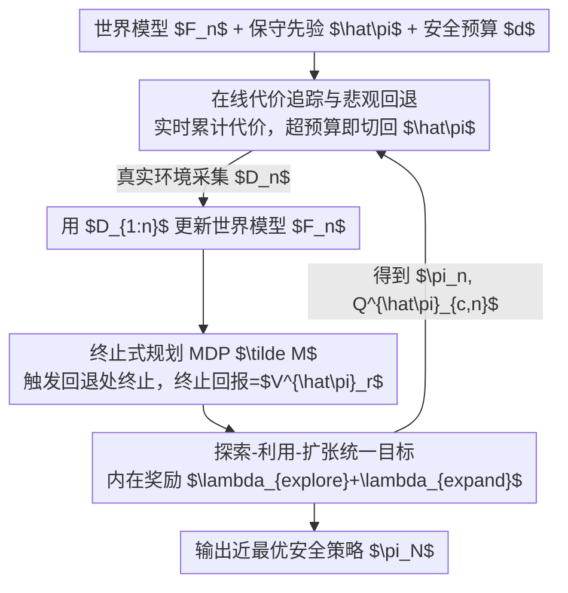

# Safe Exploration via Policy Priors

**会议**: ICLR 2026  
**OpenReview**: [https://openreview.net/forum?id=JC8xYAADHL](https://openreview.net/forum?id=JC8xYAADHL)  
**代码**: 无  
**领域**: 强化学习 / 安全探索 / 基于模型的RL  
**关键词**: 安全探索, 策略先验, 乐观-悲观, 累积遗憾, 约束马尔可夫决策过程

## 一句话总结
本文提出 SOOPER，一种基于模型的安全探索算法：把一个"次优但保守"的先验策略当作安全护栏，在线时悲观地随时回退到它以保证安全，仿真时则乐观地在世界模型里激进探索，并用"一旦要回退就终止"的规划 MDP 把约束问题转成无约束 MDP，从而在保证全程安全的同时拿到次线性累积遗憾，并在真实赛车硬件上跑通。

## 研究背景与动机
**领域现状**：安全强化学习（safe RL）希望智能体在线学习时不仅最终安全，而是**学习全程**都不能做出灾难性动作。现有工作大致两派：一派有严格的安全/最优性理论保证（如基于安全贝叶斯优化、Lyapunov 稳定性、MPC backup 策略），另一派靠深度 RL 的可扩展工具（trust region、primal-dual、interior-point 等）能处理高维任务。

**现有痛点**：有保证的方法往往只能处理低维/表格/少参数问题，扩展到复杂连续控制就算不动；可扩展的方法又通常**无法在学习全程保证安全**，或只能给出"训练结束时近最优"的弱保证（simple regret），探索阶段可以表现任意差。更细的，SAILR 这类用"backup 策略触发即终止"的方法，其最优性保证依赖"回退概率随时间消失"，但并没有给出能保证这一点的形式化条件。

**核心矛盾**：先验知识（prior knowledge）是安全探索的关键——没有它就只能靠有害的试错来预判危险。但以往工作主要把先验策略当成"安全兜底"，没有让它同时**引导探索朝有希望的区域走**。安全集（safe set）受悲观估计限制，最优策略 $\pi^*_c$ 一开始可能根本不在这个集合里，需要主动"扩张"安全集才能够到最优。

**本文目标**：用一个保守的先验策略 $\hat\pi$（来自离线数据或仿真器），既保证学习全程的约束满足，又能可证明地收敛到近最优策略，并把"探索-利用-扩张"三者统一进一个可解的目标。

**切入角度**：在**面对不确定性时**对安全用悲观、对回报用乐观。关键洞察是：如果把"被迫调用先验策略"设计成轨迹的**提前终止**，那么早终止就等于惩罚——智能体会被激励去寻找"能安全地拿到更高回报、从而不需要回退到先验"的策略。

**核心 idea**：用"悲观回退 + 乐观仿真探索 + 终止式规划 MDP"把约束 MDP（CMDP）重写成一个无约束 MDP，从而直接套用标准深度 RL，并首次给出该设定下的累积遗憾上界。

## 方法详解

### 整体框架
SOOPER（Safe Online Optimism for Pessimistic Expansion in RL）是一个基于模型的 actor-critic 算法，每个 episode 在两种模式间循环：**（i）真实环境上的安全数据采集**——在线执行学习到的策略 $\pi_n$，同时实时追踪累计代价，一旦预测某动作可能违反预算就**悲观回退**到保守先验 $\hat\pi$，由此保证安全；**（ii）仿真中的乐观探索**——用所有历史数据更新概率世界模型 $F_n$，并在一个"规划 MDP" $\tilde M$ 上做基于模型的 rollout，激进探索未知动力学。$\tilde M$ 的特殊之处在于：凡是在真实部署中"会触发回退 $\hat\pi$"的状态-动作，在仿真里都被设成**终止状态**，且终止回报取先验的悲观价值 $V^{\hat\pi}_r$，从而激励智能体学到"能超过先验、不需要回退"的轨迹。整个过程用一个含探索/扩张内在奖励的统一目标来训练 $\pi_n$，使遗憾次线性下降。

### 关键设计

**1. 在线代价追踪与悲观回退：用一个可计算的代价上界守住安全底线**

安全的根本难点是：约束 $J_c(\pi,f)\le d$ 必须对**未知**真实动力学 $f$ 成立，且全程不能违反。SOOPER 的做法是定义先验策略的**悲观代价价值** $\bar V^{\hat\pi}_c(s)=\max_{\tilde f\in F_n}\mathbb{E}_{\hat\pi}[\sum_t \gamma^t c(s_t,a_t)]$，即在所有"与数据一致的可信模型集" $F_n$ 里取最坏模型。它以 $1-\delta$ 概率上界真实代价。但对 $F_n$ 求 max 不可解，于是本文把它进一步松弛成**给代价函数加一个不确定性惩罚项**：$Q^{\hat\pi}_{c,n}(s,a)=\mathbb{E}_{\hat\pi}[\sum_t\gamma^t(c(s_t,a_t)+\lambda_{pessimism}\|\sigma_n(s_t,a_t)\|)]$，其中 $\sigma_n$ 是模型的认知不确定性，$\lambda_{pessimism}$ 有闭式给出。这样就避免了显式找最坏模型，还能直接套用 TD 学习。

在线时（Algorithm 1），智能体逐步累计已实现代价 $c_{<t}=\sum_{\tau<t}\gamma^\tau c(s_\tau,a_\tau)$，并用切换规则 $\bar\pi_n$：若 $\Phi(s_t,a_t,c_{<t},Q^{\hat\pi}_{c,n}):=c_{<t}+\gamma^t Q^{\hat\pi}_{c,n}(s_t,a_t)<d$ 就执行 $\pi_n$，否则立刻回退到 $\hat\pi$。Theorem 1 证明：在标准正则性假设下，这个规则以 $1-\delta$ 概率保证**每个 episode** 都满足约束。关键好处是——智能体可以放心执行探索性的 $\pi_n$，去访问那些"先验 $\hat\pi$ 本会回避、但其实安全"的状态，直到悲观估计真的告警才回退；随着模型变准，$\bar V^{\hat\pi}_c$ 收紧，回退越来越少。

**2. 终止式规划 MDP：把约束 MDP 改写成无约束 MDP，让"超过先验"变成内生激励**

CMDP 通常需要 min-max 形式的拉格朗日求解，复杂且难扩展。SOOPER 的巧思是构造一个规划 MDP $\tilde M$：它和真实 CMDP 唯一的区别是，凡是在线部署中会触发回退（$\Phi\ge d$）的状态-动作，在 $\tilde M$ 里都转移到一个**终止状态** $s^\dagger$。更关键的是终止回报的设计——$\tilde r(s_t,a_t)=V^{\hat\pi}_r(s_t)$（先验策略的**悲观回报价值**，$V^{\hat\pi}_r(s)=\min_{\tilde f\in F_n}\mathbb{E}_{\hat\pi}[\sum_t\gamma^t r]$）当触发回退时；到达 $s^\dagger$ 后回报为 0；否则用真实回报 $r$。

这样设计的妙处在于：终止 = 把后续回报锁定成"回退到先验所能拿到的（保守）回报"。如果智能体能找到一条**不触发回退、还能拿更高回报**的轨迹，就严格优于提前终止。于是"避免回退"成了一种内生激励，而不需要把终止回报当超参手调（这正是 SAILR 等前作的弱点）。更本质地，因为 $\tilde M$ 是**无约束**的，本文得以套用标准无约束 MDP 的遗憾分析（Kakade et al. 2020），这是后面累积遗憾界的基石。

**3. 探索-利用-扩张统一目标：一个内在奖励同时驱动三件事，换来次线性累积遗憾**

悲观会让初始安全集 $\Pi^n_{<d}$ 偏小，最优策略 $\pi^*_c$ 可能不在里面，必须**扩张**安全集才够得到最优。前作普遍走"先扩张、再探索-利用"的两阶段路线：先用无奖励轨迹采样把安全集撑大，再做探索利用。这有两个毛病：（i）要先学一个与任务无关的辅助策略，浪费算力和探索；（ii）只能给出 simple regret 保证，探索期表现可以任意差。

SOOPER 把三者揉进**一个**可解目标（Eq. 9）：在规划 MDP 上最大化 $\mathbb{E}_\pi[\sum_t\gamma^t\tilde r(s_t,a_t)+(\gamma^t\lambda_{explore}+\sqrt{\gamma^t\lambda_{expand}})\|\sigma_n(s_t,a_t)\|]$，即在终止式回报之外，加一项随认知不确定性 $\sigma_n$ 增长的内在奖励，其中 $\lambda_{explore}$ 鼓励探索、$\lambda_{expand}$ 鼓励扩张安全集（两者均有闭式推导）。由于只是在奖励上加 bonus，近似解可高效求得。因为扩张**隐式地**发生在学任务的同时（而非单独的无奖励阶段），分析得以从 simple regret 推进到**累积遗憾**：Theorem 2 证明 $R(N)\le \mathcal{O}(\Gamma_N^{7/2}\log(N)/\sqrt N)$ 次线性增长，且全程 $J_c(\bar\pi_n,f)\le d$——既保证全程安全，又保证学习过程中（而非仅最后一轮）的性能。

### 损失函数 / 训练策略
实用实现（"深度版" Algorithm 2）沿用 MBPO 风格的 model-based actor-critic：用神经网络概率集成（probabilistic ensemble）学动力学，集成预测的标准差作为认知不确定性 $\sigma_n$ 的估计；实现中还额外学习回报和代价函数。每个 episode 用世界模型生成 rollout，对 Eq.(5) 与 Eq.(9) 做固定步数的 actor-critic 更新。作者强调，把 MBPO 适配到本设定只需把模型预测包进 $\tilde M$ 定义的 MDP 里即可，因此 SOOPER 能直接搭便车未来的深度 RL 进展。

## 实验关键数据

### 主实验
评测覆盖 RWRL、SafetyGym、RaceCar 等基准，对比 SAILR（SOTA 安全探索）、CRPO 和 Primal-Dual（无学习期安全保证的 CMDP 求解器）。所有方法用同一个任务特定先验策略初始化。核心指标：训练结束相对先验的性能提升 $\hat J_r(\pi_N)/\hat J_r(\pi_0)$，以及学习全程记录到的最大约束违反 $d-\max_n \hat J_c(\pi_n)$。

| 任务 | SOOPER 全程安全？ | 相对先验性能 | 对比基线 |
|------|------|------|------|
| PointGoal2 | 是 | ~1.50–1.65× | 持平或优于满足约束的基线 |
| RaceCar | 是 | ~1.2–1.3× | 优于/持平 |
| CartpoleSwingup（含视觉版） | 是 | ~0.9–1.0× | 近最优 |
| HumanoidWalk | 是 | ~1.3–1.4× | 优于/持平 |
| WalkerWalk | 是 | 显著提升 | 优于/持平 |

结论：在**所有**任务里 SOOPER 都全程满足约束；在所有满足约束的算法中，SOOPER 的性能持平或更优。CRPO/Primal-Dual 等基线常在学习期违反约束。

### 消融 / 扩展实验

| 场景 | 关键结果 | 说明 |
|------|---------|------|
| 动力学失配迁移 | 全程安全 + 性能提升 | 先验在偏移动力学 $\mu_0$ 上训练，再到真实动力学上继续学 |
| 视觉控制（64×64 灰度图×3 帧） | 满足约束 + 近最优 | 直接在 DrQ 预训练视觉编码器的 embedding 上学动力学模型 |
| 离线到在线 | 优于全部基线且保持安全 | 用 2M 离线 transition + MOPO 训保守先验，再在线微调 |
| 真实硬件赛车（60Hz） | 全程安全，回报≈先验 2× | 高频控制 + 作动/动捕延迟带来强随机性，仍跑通 |

### 关键发现
- **悲观回退是安全的来源**：在线代价追踪让智能体能安全地越界探索 $\hat\pi$ 会回避的区域，是"既安全又能学到更好策略"的关键；附录消融显示每个组件都对"安全+性能"缺一不可。
- **统一目标 vs 两阶段**：把扩张隐式融进任务学习，避免了无奖励预探索的算力浪费，也把理论从 simple regret 提升到 cumulative regret。
- **真实硬件验证理论**：高随机、强延迟的赛车任务上仍保持全程安全且回报翻倍，说明理论保证能落到真实世界。

## 亮点与洞察
- **"终止=惩罚"的转化**：把"被迫回退到先验"建模成轨迹提前终止、且终止回报锁成先验的保守价值，一举把约束问题变成无约束 MDP——既能直接复用标准深度 RL，又让"超过先验"成为内生激励，避免手调终止回报。这是全文最"啊哈"的设计。
- **悲观/乐观的精准分工**：对**安全**（代价）用悲观（最坏模型/不确定性惩罚），对**回报**用乐观（内在探索奖励），两者各司其职，正好对应"安全不能赌、性能可以试"的本质差异。
- **可迁移的 trick**：用"不确定性惩罚项"替代对可信模型集求 max 来得到可计算的悲观代价上界，这套思路可迁移到其他需要 worst-case 估计但又要兼容 TD 学习的安全约束任务。
- **单目标内在奖励统一探索-利用-扩张**：把安全集扩张写成一项随 $\sigma_n$ 增长的奖励 bonus，避免独立的无奖励阶段，可借鉴到其他需要"主动扩张可行域"的约束优化问题。

## 局限与展望
- 理论依赖一系列正则性假设：高斯（可放松到 sub-Gaussian）噪声、Lipschitz 连续、动力学落在已知范数界的 RKHS、以及**可获得满足约束的悲观安全先验**（Assumption 4）。先验质量直接影响起点安全集大小与最终性能。
- 当前是**episodic** 设定，每个 episode 后会重置到新初始状态；作者明确指出非 episodic（单条轨迹、无重置）设定是更难也更关键的开放问题。
- 约束是对整条轨迹的预算型约束，尚不支持对**特定状态**的高概率约束（作者列为未来工作）。
- 世界模型用集成神经网络近似认知不确定性，理论保证依赖模型"well-calibrated"，实际中校准是否充分会影响安全性（实现上用了 post-hoc recalibration 缓解）。
- 实验任务仍属中等规模连续控制，更复杂任务 + 更强模型是后续方向。

## 相关工作与启发
- **vs SAILR（Wagener et al. 2021）**：同样用"backup 策略触发即终止"重写安全，但 SAILR 的 simple regret 保证依赖"重置概率随时间消失"，却未给出保证该条件的形式化条件，且终止回报当超参手调。SOOPER 放松这些假设、把终止回报锁成先验悲观价值、并给出更强的累积遗憾界，实验也更优。
- **vs ActSafe（As et al. 2025b）**：ActSafe 靠无奖励探索保证 simple regret 的安全+最优，因此探索期可能表现很差；SOOPER 用统一目标隐式扩张，给出探索全程的累积遗憾保证。
- **vs MASE（Wachi et al. 2023）**：MASE 依赖一个能"在任意状态停时"的受限 emergency-stop 动作；SOOPER 不需要这种强假设，靠悲观先验回退即可。
- **vs 可证明安全派（安全贝叶斯优化 / Lyapunov / MPC backup）**：这些方法保证强但难扩展（限于少参数、状态离散化或人工重置）；SOOPER 用基于模型的深度 RL 架构（MBPO 风格）扩展到高维连续控制乃至视觉与真实硬件。
- **vs 可扩展派（CRPO / Primal-Dual / trust region / interior-point）**：这些方法扩展性好但常忽略探索、缺最优性保证，且学习期可能违反约束；SOOPER 把主动探索与全程安全一起拿下。

## 评分
- 新颖性: ⭐⭐⭐⭐⭐ "终止式规划 MDP + 悲观回退"把 CMDP 转无约束 MDP，并首次给该设定累积遗憾界，思路新颖且自洽
- 实验充分度: ⭐⭐⭐⭐⭐ 覆盖 RWRL/SafetyGym、视觉控制、离线到在线，还在真实赛车硬件上验证，全程安全
- 写作质量: ⭐⭐⭐⭐ 理论与直觉交织清楚，但悲观/乐观价值、多个 $\lambda$ 与定理较密集，需要一定背景
- 价值: ⭐⭐⭐⭐⭐ 兼顾"全程安全 + 学习期性能保证 + 可扩展 + 真实硬件"，是迈向可部署 RL 的扎实一步

<!-- RELATED:START -->

## 相关论文

- [\[ICLR 2026\] SHAPO: Sharpness-Aware Policy Optimization for Safe Exploration](shapo_sharpness-aware_policy_optimization_for_safe_exploration.md)
- [\[ICLR 2026\] Off-Policy Safe Reinforcement Learning with Constrained Optimistic Exploration](off-policy_safe_reinforcement_learning_with_cost-constrained_optimistic_explorat.md)
- [\[ICLR 2026\] APC-RL: Exceeding Data-Driven Behavior Priors with Adaptive Policy Composition](apc-rl_exceeding_data-driven_behavior_priors_with_adaptive_policy_composition.md)
- [\[ICLR 2026\] Deep SPI: Safe Policy Improvement via World Models](deep_spi_safe_policy_improvement_via_world_models.md)
- [\[ICLR 2026\] Controllable Exploration in Hybrid-Policy RLVR for Multi-Modal Reasoning](controllable_exploration_in_hybrid-policy_rlvr_for_multi-modal_reasoning.md)

<!-- RELATED:END -->
