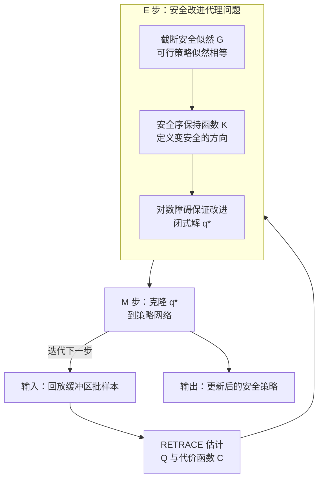

# SafeMPO: 基于概率增量改进的约束强化学习

**会议**: ICLR 2026  
**OpenReview**: [https://openreview.net/forum?id=1m0EU6QXj6](https://openreview.net/forum?id=1m0EU6QXj6)  
**领域**: 强化学习 / 安全强化学习  
**关键词**: 约束马尔可夫决策过程, 安全强化学习, MPO, 增量改进, 对数障碍

## 一句话总结
SafeMPO 把"安全"建模成一个可被推断求解的概率事件，将约束强化学习从"把策略硬投影到可行域"改成"每一步只保证比上一步更安全"，借助 MPO 的 EM 框架与内点法的对数障碍构造出一个有几何收敛保证的非参数代理问题，在只有一个不影响渐近行为的超参数下，性能可与高度调参的约束 RL 基线持平甚至更优。

## 研究背景与动机

**领域现状**：把安全显式写进训练目标的主流框架是约束马尔可夫决策过程（CMDP），即在最大化期望回报 $R(\pi)$ 的同时要求各项期望代价满足 $C_i(\pi) \le B_i$。主流求解器（CPO、CUP、PCPO、CRPO 等）的共同思路是：一旦发现策略越界，就用投影或代价下降的"恢复步"把策略拉回可行集。

**现有痛点**：这种"贪婪恢复/投影"在可行域难找、或最近的可行策略本身很差时会失灵。论文用一个扔球机器人的例子说明：初始策略只会把球扔到中间平台（R:0, C:0）或两侧深坑（C:1），从没到过左侧高回报平台（R:1, C:0）。贪婪投影会直接把策略锁死在"只砸中间柱子"这个安全但零回报的局部最优，因为它过早地掐掉了对潜在安全区域的探索。这种情况在随机环境+随机策略下非常普遍——高回报安全区域的采样概率一旦很低，就会从采样分布里"消失"，再也不会被优化。

**核心矛盾**：用 KL 球 $\mathrm{KL}(\pi_{k+1}\|\pi_k)<\varepsilon$ 约束更新幅度时，可行策略集与 $\varepsilon$ 球的交集可能为空。CVPO 试图直接解非参数代理问题，但无法保证 KL 球内存在安全策略，只好让代价上界 $B$ 从一个很大的 $B_{\max}$ 缓慢衰减——衰减太快问题无解，太慢又要海量迭代，而这个衰减速度极难调且强依赖环境与约束细节。

**切入角度**：与其每步都把策略"投影到安全集"（一个绝对、易因近似误差出错的操作），不如只要求 $\pi_{k+1}$ 比 $\pi_k$ **更安全**这一相对目标。作者把它形式化成一个约束贝叶斯优化问题，追求"轨迹安全的似然 $p(S=1)$ 单调上升"。贝叶斯视角天生对近似误差和局部最优更鲁棒。

**核心 idea**：在 MPO 的"推断即策略优化"框架里再引入一个"策略安全"事件 $S$，把约束满足变成对 $p(O=1, S=1)$ 联合分布的推断；再用内点法的对数障碍强制每一步严格增安全，从而获得朝可行集的几何收敛保证。

## 方法详解

### 整体框架

SafeMPO 建立在 MPO（Maximum a Posteriori Policy Optimization）之上。MPO 把策略更新看成推断问题：假设"轨迹最优"事件 $p(O=1|\tau)\propto\exp(\sum_t r_t/\alpha)$ 服从玻尔兹曼分布，于是优化 ELBO 可拆成 EM 两步——E 步从回放缓冲区采样、解一个非参数代理问题得到最优分布 $q$；M 步把 $q$ 克隆进策略神经网络（最小化 $\mathrm{KL}(q\|\pi)$）。这一结构的好处是：从神经网络优化的视角看，RL 退化成"匹配一个已知目标分布"的监督学习，目标分布已不依赖非平稳的回报信号。

SafeMPO 的做法是在 E 步的非参数代理问题里塞进"安全"。具体一次更新如下：先用 RETRACE 估计 $Q(a,s)$ 与代价函数 $C(a,s)$；E 步把"截断安全似然"和"安全序保持的改进约束"一起放进一个带对数障碍的凸代理问题，闭式解出非参数最优 $q^\star$；M 步再把 $q^\star$ 克隆进策略网络。整个过程"探索→优化"交替进行，每一步都被理论保证朝可行集收缩。

### 关键设计

**1. 截断安全似然：让所有可行策略"一样安全"**

约束和优化目标的本质区别在于：优化目标永远"越多越好"，而约束一旦满足就应该"无所谓更好"。作者据此把安全建模成一个**截断**的指数分布而非普通指数：当代价越界（$C(a,s)\ge B$）时按指数惩罚，否则似然恒为 1：

$$p(S=1|\tau) \propto \begin{cases}\exp\!\left(-\frac{C(a,s)-B}{\beta}\right) & C(a,s)\ge B\\ 1 & \text{otherwise}\end{cases}$$

对应的代价对数似然为 $G(a,s)=\log p(S=1|\tau)=-\max\!\big(\frac{C(a,s)-B}{\beta},\,0\big)$。这个截断是关键：它让所有落在可行集内的策略获得相等的安全似然，正好对应约束满足的语义——可行就够了，不必"更可行"。这区别于把代价当普通回报去无限压低（那会牺牲回报）。作者也强调（Remark 1），证明只依赖"更安全的策略似然更高"，因此任何在 $C_i(\pi)\le B_i$ 区间单调递减的函数都能用，选截断指数只是为了和 MPO 的回报似然形式呼应。

**2. 安全序保持函数：用相对改进而非绝对投影定义"变安全"**

要表达"$q$ 至少和 $\pi$ 一样安全"，作者引入**安全序保持函数** $K(q,\pi)$：当 $\mathbb{E}_q[G]>\mathbb{E}_\pi[G]$ 时 $K>0$，相等时 $K=0$，更差时 $K<0$。直观上 $K$ 给出一个"朝可行集的方向"，且允许个别状态代价上升、只要整体代价下降，从而给探索留出更大自由度。最朴素的选择是线性安全函数（LSF）$K(q,\pi)=\int qG-\int \pi G$。

但作者诚实地给出了一个**反结果**（Theorem 1 + Corollary 2）：只把朴素约束 $\mathbb{E}_q[G]\ge\mathbb{E}_\pi[G]$ 加进 E 步并不够——最优 $q$ 要么和 $\pi$ 安全度持平、要么干脆忽略该约束退化成无约束 MPO，因此它**不是**对安全似然 $G$ 的收缩映射。换言之，"不比上一步差"无法保证"严格变好"，会卡在原地。这个反结果正是下一个设计要解决的痛点。

**3. 对数障碍的保证改进 E 步：借内点法强制严格进入可行域内部**

朴素改进约束失效的根因，是它不强制 $q$ 落到可行集的**内部**。作者从内点法借来对数障碍函数：在目标里加一项 $\kappa\log(x/\kappa)$，并把改进约束写成 $K(q,\pi)\ge x$：

$$\max_q\ \mathbb{E}_{(a,s)\sim q}[Q(a,s)]+\kappa\log\frac{x}{\kappa}\quad \text{s.t. } \mathrm{KL}(q\|\pi)\le\varepsilon,\ K(q,\pi)\ge x,\ \textstyle\int q=1$$

由于 $x\le 0$ 时 $\log x=-\infty$，任何严格正改进 $x>0$ 都被无穷地偏好，于是**每次迭代都被构造性地保证安全裕度严格上升**，并对 LSF 给出几何收敛速度（Theorem 4）。妙处在于：最终最优点和每步改进量都**不依赖** $\kappa$ 的取值，$\kappa$ 只调节单步内"最大化回报 vs 改进约束"的局部权衡——$\kappa\to\infty$ 退化成硬投影，$\kappa\to 0$ 退化成原始 MPO。因此作者全程固定 $\kappa=10$ 且不调参，正对应真实场景里好超参未知的情形。求解上只需对 2 个对偶变量 $\lambda,\nu$ 做凸优化（变量数随约束数而非样本数增长），最优 $q^\star$ 有闭式解：

$$q^\star(a,s)=\tfrac{1}{Z}\,\pi(a,s)\exp\!\Big(\tfrac{Q(a,s)+\lambda G(a,s)}{\nu}\Big)$$

并且作者证明了强对偶成立的易验证条件（Theorem 2/3）：只要 $G$ 不几乎处处为常数、$\pi$ 全支撑、$K$ 凹。一个自然推论是：若当前批样本里 $G$ 恒定（例如样本已全部安全），算法自动退化成一次普通 MPO 步；否则执行一次安全改进步。

**4. M 步克隆：把非参数最优 $q^\star$ 监督式地灌进策略网络**

E 步得到的 $q^\star$ 只是一批样本上的非参数分布，需"克隆"进神经网络策略。沿用 MPO，把 $\pi(a,s)=\pi(a|s)\mu(s)$、$q(a,s)=q(a|s)\mu(s)$ 分解（$\mu(s)$ 是回放缓冲区估计的平稳分布），并用**分离 KL 约束**（对均值和协方差分别设信赖域 $\varepsilon_\mu,\varepsilon_\Sigma$）作为先验：

$$L(q,\alpha_1,\alpha_2)=\mathbb{E}_{\mu(s)}\big[\mathbb{E}_{q^\star}[\log\pi(a|s)]\big]+\alpha_1(\varepsilon_\mu-C_\mu)+\alpha_2(\varepsilon_\Sigma-C_\Sigma)$$

这一步不依赖任何非平稳目标，只是把 E 步找到的安全最优分布的信息拷进网络，因此训练稳定。该框架也兼容 V-MPO 式更新（单步效率更高但只能用 on-policy 数据），本文用传统 off-policy MPO 估计器。

### 损失函数 / 训练策略

$Q(a,s)$ 与代价 $C(a,s)$ 均用 RETRACE 估计（经验性能好、弱假设下收敛）。单次批更新流程（Algorithm 1）：采一批样本 → RETRACE 更新 $Q,C$ → 在 $\lambda\in[0,M_\lambda)$、$\nu\in[0,\infty)$ 上解对偶式 → 闭式算出 $q^\star(a|s)$ → 内层迭代 $N$ 次用分离 KL 目标对 $\pi$ 下降、对偶乘子 $\alpha_1,\alpha_2$ 上升。实验中每次采 20 个 batch、batch size 1024、$N=8$，全程 $\kappa=10$、代价预算 $B=25$，对偶变量约束在 $\lambda\in[-10^6,10^6]$。

## 实验关键数据

在 safety-gymnasium 的三个任务上与 Omnisafe 提供的（已高度调参的）SOTA 基线对比，所有方法跑 1000 万步、预算 $B=25$。任务难度递增：SafetyPointGoal（点智能体导航，最易）< SafetyCarGoal（差速车避静态障碍）< SafetyCarButton（车避静态+动态障碍并按对目标按钮，最难）。

### 主实验

| 任务 | 方法 | 回报 ↑ | 代价 ↓ |
|------|------|--------|--------|
| SafetyCarGoal | CPO | 25.52 ± 2.65 | 43.32 ± 14.35 |
| SafetyCarGoal | RCPO | 18.71 ± 2.72 | **23.10** ± 12.57 |
| SafetyCarGoal | **SafeMPO** | 21.43 ± 5.10 | 32.23 ± **7.43** |
| SafetyCarButton | FOCOPS | 0.21 ± 2.27 | 31.78 ± 47.03 |
| SafetyCarButton | CPPOPID | −1.36 ± 0.68 | **14.62** ± 9.40 |
| SafetyCarButton | **SafeMPO** | **0.67** ± 0.61 | 30.87 ± **4.47** |
| SafetyPointGoal | CPO | **20.46** ± 1.38 | 28.84 ± 7.76 |
| SafetyPointGoal | **SafeMPO** | 13.09 ± 2.79 | 32.92 ± **3.43** |

关键观察：在 CarGoal 和 CarButton 上 SafeMPO 都达到或接近 SOTA。CarButton 是最难环境，SafeMPO 在代价略低于 FOCOPS 的同时给出近 **3 倍** 回报；唯一完全满足约束的 CPPOPID 是靠"学会走出仿真区域"骗取了负回报。PointGoal 是 SafeMPO 表现相对最弱的环境，但仍贴近 SOTA。**最突出的一致性优势是方差**：SafeMPO 在所有方法里跨独立运行的代价方差几乎总是最低（CarButton 代价标准差 4.47 vs 基线动辄几十甚至上百），作者归因于它不像其他方法那样存在投影/恢复带来的"边缘情况"。

### 消融 / 分析实验（降低预算 B）

讨论中作者发现所有变体的代价都稳定在约 30、略高于预算 25，怀疑是截断似然只惩罚越界状态、对"几乎安全"的状态会"吃掉"代价导致边界因采样方差而有效漂移。于是把 SafetyCarGoal 的预算人为下调到 $B=20$ 复跑：

| 配置 | 任务 | 回报 | 代价 |
|------|------|------|------|
| SafeMPO @B=25 | SafetyCarGoal | 21.43 ± 5.10 | 32.23 ± 7.43 |
| SafeMPO @B=20 | SafetyCarGoal | 20.24 ± 2.24 | **25.68** ± 2.97 |
| SafeMPO @B=20 | SafetyPointGoal | 18.36 ± 3.41 | **23.00** ± 1.56 |
| SafeMPO @B=20 | SafetyCarButton | 0.94 ± 0.12 | 33.37 ± 2.46 |

### 关键发现
- 把预算下调到 $B=20$ 后，CarGoal 与 PointGoal 都返回了**可行**（代价 < 25）且回报达 SOTA 水平的策略，验证了"方法理论上能命中更好阈值，但受所选似然 $G$ 限制无法直接达到"的假设——边界更紧反而更好，恰说明限制来自 $G$ 的设计而非框架本身。
- CarButton 即便降到 $B=20$ 仍找不到可行策略，但这并不意外——除 CPPOPID（靠走出仿真区作弊）外没有任何方法在该环境可行。
- 跨任务最稳的特性是**低运行间方差**，这是 SafeMPO 相对所有基线最可复现的优势。

## 亮点与洞察
- **把"约束"翻译成"截断的概率事件"**：用截断指数让所有可行策略安全似然相等，精准抓住了"约束满足不是越多越好"这一与优化目标的本质区别——这是整篇方法能成立的支点，且可换成任意单调递减函数（如 CVaR），可迁移性强。
- **先证伪再修补的诚实叙事**：作者先证明朴素的"不比上一步差"约束不是收缩映射（会原地踏步），再用内点法的对数障碍把它修成严格改进。这个"反结果 → 补丁"的推进比直接抛结论更有说服力。
- **对数障碍权重 $\kappa$ 不影响渐近行为**：$\kappa$ 只调单步局部权衡，最终最优点和收敛性与它无关，于是可以固定 $\kappa=10$ 不调参。"唯一超参数不改变渐近行为"在 CRL 里是难得的工程优势，因为真实场景里好的对偶/预算值通常未知。
- **RL 退化成监督克隆**：沿用 MPO 的 EM 结构，把非平稳的 RL 目标隔离在 E 步，M 步只做"匹配已知目标分布"的稳定监督学习——这是它低方差的结构性来源。

## 局限与展望
- **稳态代价偏高（约 30 > 预算 25）**：截断似然只罚越界状态，会"吃掉"几乎安全状态的代价，叠加采样方差造成有效边界漂移；作者把更好的安全似然函数（如 CVaR）留作未来工作。
- **最难环境仍不可行**：CarButton 即使降预算也无法找到可行策略，方法在高难度、动态障碍场景下的安全保证仍有缺口。
- **实验规模偏小**：只在 safety-gymnasium 三个任务、单一约束上验证；多约束、更高维或真实机器人场景的表现未知（虽然对偶变量数随约束数线性增长在理论上利好多约束）。
- **理论 100% 安全不可得**：作者坦言任何 CRL 方法在未知环境都无法 100% 安全（没采样过的状态无从判断），好的方法应让动作概率在有限探索下非零、仅在无限数据极限才归零——这正是 Theorem 4 的行为。
- **改进方向**：换更优安全似然 $G$；用 V-MPO 式更新提升单步效率；把普通 MDP 也重写成"以改进约束为目标"的 CMDP，从构造上保证策略单调改进。

## 相关工作与启发
- **vs MPO（Abdolmaleki et al. 2018）**：MPO 是本文的母体，只处理无约束 RL 的 EM 推断。SafeMPO 在联合分布里加入"安全"事件 $S$、把截断安全似然和改进约束塞进 E 步，是 MPO 向 CMDP 的自然扩展，复用了其"E 步非参数代理 + M 步克隆"骨架。
- **vs CPO / CUP / PCPO（投影/恢复类）**：它们靠把策略硬投影或代价下降地拉回可行集，易因采样误差过早掐掉对潜在安全区域的探索（扔球例子里的局部最优）。SafeMPO 不对任何单一代价估计"过度承诺"，只求相对改进，从而保留探索。
- **vs CVPO（Liu et al. 2022）**：CVPO 也解非参数代理问题，但无法保证 KL 球内存在安全策略，只能让代价上界 $B$ 缓慢衰减，衰减速度成了难调的关键超参。SafeMPO 用对数障碍的增量改进绕开了"必须存在球内安全策略"的前提，且唯一超参 $\kappa$ 不影响渐近解。
- **vs RCPO / CPPOPID（拉格朗日/PID 类）**：它们把回报与代价合成单一价值函数或用 PID 调 $\lambda$，更新速度受探索噪声限制，且 CPPOPID 的 PID 值隐含了环境先验。SafeMPO 在固定单超参、无环境先验下取得更一致的低方差表现。

## 评分
- 新颖性: ⭐⭐⭐⭐⭐ 把约束 RL 从"投影到可行集"重构为"概率增量改进"，并用内点法对数障碍给出收敛证明，视角新且自洽。
- 实验充分度: ⭐⭐⭐ 理论扎实，但仅 3 个 safety-gymnasium 任务、单约束、规模偏小，最难环境仍不可行。
- 写作质量: ⭐⭐⭐⭐⭐ "先证伪朴素方案再补丁"的叙事清晰诚实，理论与动机衔接自然。
- 价值: ⭐⭐⭐⭐ 唯一超参不影响渐近行为 + 低运行方差，对真实安全 RL 部署有实用吸引力。

<!-- RELATED:START -->

## 相关论文

- [\[ICLR 2026\] Safe Exploration via Policy Priors](safe_exploration_via_policy_priors.md)
- [\[ICLR 2026\] Solving General-Utility Markov Decision Processes in the Single-Trial Regime with Online Planning](solving_general-utility_markov_decision_processes_in_the_single-trial_regime_wit.md)
- [\[ICLR 2026\] Accelerated Learning with Linear Temporal Logic using Differentiable Simulation](accelerated_learning_with_linear_temporal_logic_using_differentiable_simulation.md)
- [\[ICLR 2026\] RLP: Reinforcement as a Pretraining Objective](rlp_reinforcement_as_a_pretraining_objective.md)
- [\[ICLR 2026\] PoLi-RL: A Point-to-List Reinforcement Learning Framework for Conditional Semantic Textual Similarity](poli-rl_a_point-to-list_reinforcement_learning_framework_for_conditional_semanti.md)

<!-- RELATED:END -->
