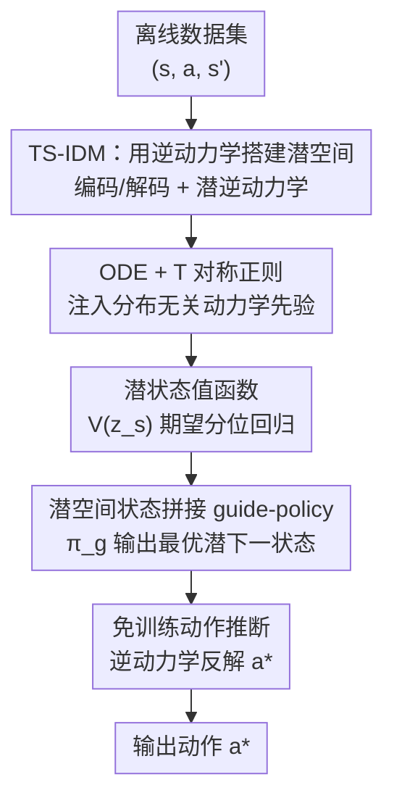

# Sample Efficient Offline RL via T-Symmetry Enforced Latent State-Stitching

**会议**: ICLR 2026  
**OpenReview**: [https://openreview.net/forum?id=FVLiw2g0n3](https://openreview.net/forum?id=FVLiw2g0n3)  
**领域**: 强化学习 / 离线 RL  
**关键词**: 离线强化学习、样本效率、时间反演对称、状态拼接、表示学习

## 一句话总结
TELS 把离线 RL 的策略优化整体搬进一个被「时间反演对称（T-symmetry）」约束的紧凑潜空间里做状态拼接，靠一个 T 对称强制的逆动力学模型（TS-IDM）学出对分布外（OOD）友好的潜状态表示，从而完全绕开传统离线 RL 的动作级保守约束，在 0.5%~10% 的小样本 D4RL 任务和真实工业控制环境上大幅超过 TSRL、POR、IQL 等方法。

## 研究背景与动机
**领域现状**：离线 RL 直接用预收集数据集学策略，适合那些没有高保真模拟器、或不允许在线交互的真实任务。但它天生容易在评估 OOD 样本时高估价值，再经 bootstrap 更新放大，于是主流做法都奉行「悲观主义」：加显式/隐式策略约束防止选 OOD 动作（TD3+BC、BCQ）、对未见样本惩罚价值（CQL）、或只用 in-sample 数据学习（IQL）。

**现有痛点**：这些**动作级约束**虽然能稳住价值和策略学习，却带来严重的过度保守，把 OOD 泛化能力废掉了。结果是绝大多数离线 RL 方法只有在数据量足够大（如简单 D4RL 任务约 100 万样本、状态-动作空间覆盖合理）时才表现得好。这和真实世界（工业控制、机器人、医疗）数据稀缺、扩大采集成本高昂的现实形成鲜明反差。

**核心矛盾**：样本越少，状态-动作空间里 OOD 区域占比越大，越需要强 OOD 泛化；但「靠动作级保守约束求稳」与「靠 OOD 泛化求小样本性能」本质冲突——越保守越学不动稀疏数据外的最优轨迹。

**切入角度**：作者注意到此前提升泛化的三条路各有短板——① DOGE 这类利用价值函数插值性允许在插值 OOD 动作上利用，但依赖数据集几何的光滑性假设且只适用连续动作；② POR 这类在**状态空间**做奖励最大化（即「状态拼接」），避开动作级约束，但仍需状态-动作空间有合理数据覆盖才能拼接；③ 学紧凑鲁棒的潜表示（对比学习等），但多停留在统计层面、对底层动力学利用不足。而 TSRL 已证明：抽取动力学的**基本对称性**（T 对称，即物理规律在时间反演变换下不变）能在不被数据分布束缚的前提下最大化 OOD 泛化。可惜 TSRL 仍把 T 对称表示嫁接在 TD3+BC/CQL 这类带动作级约束的 backbone 上，没逃出过度保守。

**核心 idea**：把「状态拼接」放进一个由 T 对称强制、连贯一致的潜空间里做——用 T 对称逆动力学模型学出 OOD 可泛化的潜状态表示，在潜空间里学一个奖励最大化的 guide-policy 输出最优潜下一状态，再用逆动力学反解动作，全程不碰动作级约束，彻底摆脱保守性。

## 方法详解

### 整体框架
TELS 接收离线数据集 $\mathcal{D}=\{(s,a,s')\}$，目标是在样本极少时学出强 OOD 泛化的策略。它把整条管线拆成两段：先离线训练一个 **T 对称强制逆动力学模型 TS-IDM**，把原始状态映射到被 ODE 与 T 对称双重约束的潜状态空间 $z_s=\phi_s(s)$；然后把整个策略优化过程都搬进这个潜空间——学潜状态值函数 $V(z_s)$、学一个 T 对称正则的 guide-policy $\pi_g$ 输出奖励最大化的潜下一状态，最后把 guide-policy 的输出当作目标状态喂回 TS-IDM 的潜逆动力学模块，**免训练**地反解出最终动作。整个 TS-IDM 由若干 2 层 MLP 搭成，体量很小（PyTorch 实现约 20 分钟、JAX 约 5 分钟训完）。

关键在于：策略优化全程**不涉及任何动作输入**，所以天然绕开了动作级保守约束；而 T 对称这一「不依赖数据分布的物理先验」保证了即便 guide-policy 输出落到 OOD 区域，潜表示依然给出可泛化信息。

### 关键设计

**1. TS-IDM：用逆动力学把状态映进潜空间**

针对「现有潜表示停留在统计层面、没把动力学吃进去」的痛点，TELS 不学一个普通自编码器，而是构造一个**逆动力学**风格的模型：从输入输出看，TS-IDM 像个逆动力学模型，吃当前与下一状态 $(s,s')$、吐预测动作 $a$；但其内部包含状态编码器 $\phi_s(s)=z_s$ 与解码器 $\psi_s(z_s)=\hat s$、潜逆动力学模块 $h_\text{inv}(z_s,z_{s'})=z_a$ 加动作解码器 $\psi_a(z_a)=\hat a$。重建损失同时约束状态与动作的可还原性：

$$\ell_\text{rec}(s,a,s')=\|\psi_s(\phi_s(s))-s\|_2^2+\|\psi_a(h_\text{inv}(z_s,z_{s'}))-a\|_2^2.$$

之所以用「从状态转移反推动作」的逆动力学来塑造潜空间，是因为这样学到的潜表示会**隐式编码环境的底层动力学**，而不是像对比学习那样只抓数据的统计相关性。这一步先把状态空间压成一个忠实、紧凑的潜空间，为后面的对称性约束和状态拼接打地基。

**2. ODE + T 对称正则：注入分布无关的动力学先验（核心创新）**

这是 TELS 相对 TSRL 真正的升级点。它在潜空间嵌入一对潜 ODE 正/反向动力学预测器 $h_\text{fwd}(z_s,z_a)=\dot z_s$ 与 $h_\text{rvs}(z_{s'},z_a)=-\dot z_s$，分别刻画潜状态的正向与时间反演演化。借助链式法则 $\dot z_s=\nabla_s\phi_s(s)\cdot\dot s$（其中 $\dot s\approx s'-s$），可对编码器施加 ODE 约束 $\ell_\text{dyn}$。**关键差异**在于：TSRL 的 TDM 只对编码器强制 ODE 性质，而 TELS 额外要求**解码器** $\psi_s$ 也满足同一 ODE 形式（$\ell_\text{ode}$），否则学到的动力学会与底层 ODE 结构不一致、得到不准确的 ODE 表示。最后用 T 对称一致性把正反向动力学耦合起来：

$$\ell_\text{T-sym}(z_s,z_a)=\|h_\text{fwd}(z_s,z_a)+h_\text{rvs}(z_s+h_\text{fwd}(z_s,z_a),z_a)\|_2^2.$$

整个 TS-IDM 的训练目标为 $\mathcal{L}_\text{TS-IDM}=\sum_{\mathcal D}[\ell_\text{rec}+\beta(\ell_\text{dyn}+\ell_\text{ode}+\ell_\text{T-sym})]$。注意三个动力学项**共享同一个** $\beta$：因为它们强耦合，必须在一致的尺度上施加约束才能稳定训练，作者实测拆成独立权重会导致性能大幅下降。T 对称之所以有效，是因为它捕捉的是动力学系统中「本质且不变」的东西——这种先验**不依赖数据分布**，因此哪怕样本落在 OOD 区域，潜表示依然合理。更妙的是 $\ell_\text{T-sym}$ 本身还能当评估指标：某个 $(z_s,z_a)$ 的 T 对称损失偏大，说明它可能不满足基本动力学规律、更可能是有问题/不可泛化的样本。

**3. 潜空间状态拼接的 guide-policy：绕开动作级保守约束**

有了 well-behaved 的潜空间后，TELS 把 POR 式的「guide-policy + execute-policy」分解整体移进潜空间。先用 IQL 风格的期望分位回归学**潜状态值函数** $V(z_s)$：$\min_V \mathbb E_{\mathcal D}[L_2^\tau(r+\gamma\bar V(\phi_s(s'))-V(\phi_s(s)))]$。再学一个奖励最大化的 guide-policy $\pi_g$ 在潜空间做状态拼接，输出能去（高奖励）且可去（逻辑可泛化）的潜下一状态。与众不同的是，作者把**第 2 点里的 $\ell_\text{T-sym}$ 直接当成额外正则项**塞进 guide-policy 目标，防止它输出违背动力学的、不可泛化的潜下一状态。文中给两种实例化：确定性策略

$$\max_{\pi_g}\mathbb E_{\mathcal D}\big[\lambda_\alpha V(\pi_g(z_s))-\eta\|\psi_s(\pi_g(z_s))-s'\|_2^2-\ell_\text{T-sym}(z_s,h_\text{inv}(z_s,\pi_g(z_s)))\big],$$

它把潜状态值最大化、解码后的下一状态不偏离数据集太远、以及 T 对称一致性三者结合；随机性版本则用 AWR 式目标 $\exp(\alpha A(z_s,z_{s'}))\log\pi_g(z_{s'}\mid z_s)$ 再加 T 对称正则。实验里确定性版适合 MuJoCo locomotion，随机性版在更随机的 Antmaze 上更好。这一设计的要害是：整个价值与策略学习**只在状态/潜状态层面进行、完全不引入动作**，于是从根上避免了动作级约束带来的过度保守。

**4. 免训练动作推断：用逆动力学反解最终动作**

guide-policy 只给出「该去哪个潜状态」，还需把它翻译成可执行动作。TELS 直接复用 TS-IDM 本身当 execute-policy：把 guide-policy 输出的最优潜下一状态 $z_{s'}^*$ 当作目标状态，塞进潜逆动力学模块替换 $z_{s'}$，再用动作解码器解码即得 $a^*=\psi_a(h_\text{inv}(z_s,\pi_g(z_s)))$。**这一阶段无需任何额外训练**，TS-IDM 一模多用（既是表示学习器、又是执行策略），既省参数又保持了与潜空间动力学的一致性。

### 损失函数 / 训练策略
两阶段训练：① 先用 $\mathcal{L}_\text{TS-IDM}=\sum_{\mathcal D}[\ell_\text{rec}+\beta(\ell_\text{dyn}+\ell_\text{ode}+\ell_\text{T-sym})]$ 把 TS-IDM 训到收敛（三个动力学项共享 $\beta$，体量小、训得快）；② 冻结编码器 $\phi_s$，在潜空间用期望分位回归学 $V(z_s)$、再优化 guide-policy（确定性 Eq.9 或随机性 Eq.10），动作推断阶段免训练。$\beta$ 平衡「抽取基本动力学性质」与「保持表示可解释性」。

## 实验关键数据

### 主实验
缩减版 D4RL（5k~100k 样本，约原始 0.5%~10%）归一化分数，5 个 seed：

| 任务（样本量） | POR | TSRL（小样本前 SOTA） | TELS |
|--------|------|------|------|
| Hopper-me 10k (0.5%) | 37.9 | 50.9 | **100.9** |
| Walker2d-me 10k (0.5%) | 20.1 | 46.4 | **87.4** |
| Walker2d-mr 10k (3.3%) | 14.8 | 26.0 | **54.8** |
| Antmaze-m-d 100k (10%) | 0.0 | 0.0 | **47.2** |
| Antmaze-m-p 100k (10%) | 0.0 | 0.0 | **62.9** |
| Antmaze-l-p 100k (10%) | 0.0 | 0.0 | **47.3** |
| Door-human 5k (100%) | 0.1 | 0.5 | **11.8** |

TELS 在全部任务上领先所有 baseline，常常大幅领先。最有说服力的是 POR vs TELS：两者策略优化流程相近，但 POR 不用 T 对称表示与正则，在最难的 Antmaze-medium/large 上**全军覆没（0.0）**，而 TELS 拿到 39.8~62.9。这直接证明了「T 对称强制表示 + 正则」对 OOD 泛化的贡献。即便只给 5k 样本，TELS 仍能稳住合理性能。

真实工业控制（数据中心冷却 testbed，43k 样本、105 维状态-动作、6 小时实验）：

| 指标 | CQL | IQL | TSRL | TELS |
|------|-----|-----|------|------|
| ACLF 能效（越低越好） | 10.3% | 40.89% | 27.16% | **20.17%** |
| 热安全违规率（越低越好） | 40.99% | 0.00% | 0.00% | **0.00%** |

CQL 虽 ACLF 更低，但伴随 40.99% 的严重热安全违规（学了个鲁莽策略）；TELS 在零违规前提下能效最优。

### 消融实验
TS-IDM 各子模块逐步叠加（10k 数据集，me 任务）：

| 配置 | Hopper-me | Halfcheetah-me | Walker2d-me | 说明 |
|------|------|------|------|------|
| $\phi/\psi+h_\text{inv}$ | 17.2 | 29.7 | 24.5 | 朴素自编码逆动力学，表示不行 |
| ↑ + $h_\text{fwd},h_\text{rvs}$ | 35.5 | 31.3 | 33.6 | 加潜 ODE 动力学，提升温和 |
| ↑ + $\ell_\text{ode}$ | 61.4 | 31.2 | 58.5 | 解码器 ODE 约束，大幅增强 |
| ↑ + $\ell_\text{T-sym}$（Full） | **100.9** | **40.7** | **87.4** | T 对称一致性，贡献最大 |

### 关键发现
- **T 对称一致性 $\ell_\text{T-sym}$ 是最强单因子**：从 61.4→100.9（Hopper-me）、58.5→87.4（Walker2d-me），加它带来的跳跃远超其他模块；其次是解码器 ODE 约束 $\ell_\text{ode}$（35.5→61.4），印证了「只约束编码器不够、TSRL 漏掉解码器 ODE」这一判断。
- **表示通用性强**：把 TS-IDM 的编码器 $\phi_s$ 接到 IQL/TD3+BC 上当表示模块，两者性能显著提升且方差下降；把 TELS 里的 TS-IDM 换成 AE/VAE/SimCLR 对比表示，性能均明显变差——说明优势确实来自 T 对称动力学表示而非单纯降维。
- **极端 OOD 也能拼**：在 100k Antmaze-m-d 上沿最优路径删 5 个关键区域样本，IQL 仅在删除率 0% 时偶尔成功、POR 全失败，而 TELS 在 70% 甚至 100% 删除率下仍学出最优策略，能利用删除区边界的稀疏残留信息完成拼接。
- **guide-policy 里的 $\ell_\text{T-sym}$ 正则**也被单独验证：加它能提性能并降方差。

## 亮点与洞察
- **一模多用的 TS-IDM**：同一个小模型既是表示学习器、又内嵌 ODE 动力学、还直接当 execute-policy 反解动作，动作推断阶段零额外训练——结构高度耦合反而让它训得又快又稳（5~20 分钟）。
- **把物理对称性当「分布无关先验」**：T 对称不依赖数据分布，这正是小样本/OOD 场景最缺的东西；它既进损失约束表示、又进 guide-policy 目标当正则、还能当样本质量评估指标，一物三用。
- **「在哪个空间做约束」决定保守性**：把状态拼接从原始状态空间挪进 T 对称潜空间、并全程剔除动作输入，是绕开动作级保守约束的关键——这个「换空间」思路可迁移到其他被保守约束拖累的离线 RL 方法。
- **解码器也要满足 ODE**：一个容易被忽视的细节（TSRL 就漏了），但消融显示它贡献第二大，提醒「物理约束要施加得对称完整」。

## 局限与展望
- 方法建立在「系统近似满足 T 对称（时间反演不变）」的假设上，对强不可逆、强随机或带显著耗散的动力学系统，T 对称先验可能不成立，泛化收益会打折。
- guide-policy 在确定性/随机性两版间需按任务手选（locomotion 用确定性、Antmaze 用随机性），缺一个自适应选择机制。
- $\dot s\approx s'-s$ 的一阶差分近似在高频/大步长或观测噪声大的环境下可能引入偏差，影响 ODE 约束质量。
- 共享 $\beta$ 虽减少调参且更稳，但也意味着三个动力学项的相对强度无法独立调节，极端任务上可能不是最优。

## 相关工作与启发
- **vs TSRL**：同样用 T 对称，但 TSRL 只用 TDM 编码器取表示、且把表示嫁接到 TD3+BC/CQL 这类带动作级约束的 backbone 上，仍受过度保守之苦；TELS 改用逆动力学 TS-IDM、对解码器也强制 ODE、并把策略优化整体搬进潜空间做无动作的状态拼接，从而在最难的 Antmaze-m/l 上从 0 分跃到 40+。
- **vs POR**：共享 guide-policy/execute-policy 的状态拼接框架，但 POR 在原始状态空间操作、需要合理数据覆盖才能拼接，小样本下 Antmaze 全 0；TELS 在 T 对称潜空间拼接，借分布无关先验实现强 OOD 泛化。
- **vs DOGE**：DOGE 靠价值函数插值性允许在插值 OOD 动作上利用，但依赖数据集几何光滑假设、只适用连续动作；TELS 不依赖此类几何假设。
- **vs 扩散类（IDQL）**：扩散模型拟合复杂分布能力强、大数据下表现好，但模型重、需大量数据，小样本下学不动；TELS 用极小 MLP 反而在小样本上占优。

## 评分
- 新颖性: ⭐⭐⭐⭐⭐ 把 T 对称从「表示先验」升级为贯穿表示-策略-评估的统一约束，并整体搬进潜空间做无动作状态拼接，思路完整且有物理依据。
- 实验充分度: ⭐⭐⭐⭐⭐ 覆盖缩减版 D4RL 多任务 + 真实工业控制 + 极端删样 OOD 测试 + 逐模块消融与表示对比，证据链扎实。
- 写作质量: ⭐⭐⭐⭐ 方法推导清晰、动机层层递进，但 ODE/T 对称推导密集，初学者需对照公式细读。
- 价值: ⭐⭐⭐⭐⭐ 直指离线 RL 小样本/真实部署痛点，模型小、训练快、零额外动作推断训练，工业落地友好。

<!-- RELATED:START -->

## 相关论文

- [\[ICLR 2026\] Sample-efficient and Scalable Exploration in Continuous-Time RL](sample-efficient_and_scalable_exploration_in_continuous-time_rl.md)
- [\[ICLR 2026\] WIMLE: Uncertainty-Aware World Models with IMLE for Sample-Efficient Continuous Control](wimle_uncertainty-aware_world_models_with_imle_for_sample-efficient_continuous_c.md)
- [\[ICLR 2026\] ReFORM: Reflected Flows for On-support Offline RL via Noise Manipulation](reform_reflected_flows_for_on-support_offline_rl_via_noise_manipulation.md)
- [\[ICLR 2026\] Less is More: Clustered Cross-Covariance Control for Offline RL](less_is_more_clustered_cross-covariance_control_for_offline_rl.md)
- [\[ICLR 2026\] MOBODY: Model-Based Off-Dynamics Offline Reinforcement Learning](mobody_model-based_off-dynamics_offline_reinforcement_learning.md)

<!-- RELATED:END -->
