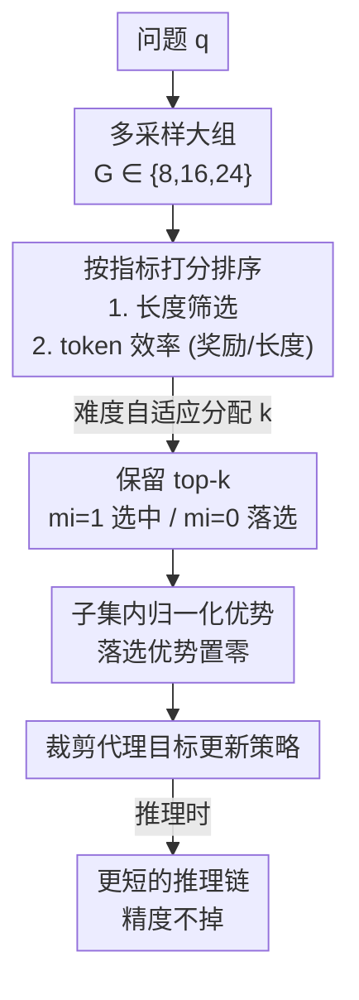

# Sample More to Think Less: Group Filtered Policy Optimization for Concise Reasoning

**会议**: ICLR 2026  
**OpenReview**: [https://openreview.net/forum?id=UKOqoULbZS](https://openreview.net/forum?id=UKOqoULbZS)  
**代码**: 无  
**领域**: 强化学习 / LLM推理  
**关键词**: RLVR, GRPO, 简洁推理, 拒绝采样, 推理长度

## 一句话总结
针对 RLVR（GRPO）训练后推理链越拉越长的"长度膨胀"问题，本文提出 GFPO：训练时多采样一组候选、只用按长度或 token 效率筛选出的 top-k 来算策略梯度，用"训练时多采样"换取"推理时少思考"，在 Phi-4-reasoning 上把 GRPO 的长度膨胀削减最高 85% 而精度不掉。

## 研究背景与动机

**领域现状**：以 GRPO、PPO 为代表的 RLVR（基于可验证奖励的强化学习）是当前提升 LLM 推理能力的主流手段，它让模型"想得更长"，在 AIME、IMO 等难题上刷出 SOTA。test-time scaling 的直觉是：链越长、思考越充分、答得越对。

**现有痛点**：但"长 ≠ 好"。已有研究发现长回复和正确率不相关，甚至更短的回复更准——DeepSeek-R1 在 AIME 25 上比 Claude 3.7 Sonnet 长近 5×，精度却没涨。更糟的是，GRPO 训练本身会制造长度膨胀：Phi-4-reasoning-plus 的回复在 100 步 GRPO 内从 4k token 暴涨到 14k，大量多出来的 token 只是没推进任何实质进展的"填充水词"。

**核心矛盾**：作者通过对照同一批 AIME 25 题目里"正确 vs 错误"的回复发现，72% 的情况下**更长的回复反而更容易错**——这说明冗长不只是难题的副产物，而是一种独立的失败模式。而 Dr. GRPO、DAPO 这类 token 级归一化方法虽然惩罚了"长错误"输出，却同时**放大了"长正确"输出的奖励**，对已经被 SFT 成逐步推理风格的模型来说，等于在鼓励它继续啰嗦，治标不治本。

**本文目标**：训练出"高效推理"模型——保住 GRPO 的精度，但推理链大幅缩短。这要求把"简洁"这个属性塞进训练，同时不破坏"正确"。

**切入角度**：与其费力把简洁性编码进标量奖励（多属性奖励工程很难调，尤其还要兼顾正确性），不如换个口子——**用数据筛选当作隐式奖励塑形**。类比 STaR 这类自我提升方法用选择性采样来放大特定行为，作者在算优势之前先把"不想要的回复"过滤掉。

**核心 idea**：训练时把采样组扩大（G↑），按目标指标（长度 / token 效率）排序，**只对 top-k 个回复算策略梯度、其余优势直接置零**。多采样让模型见到更多"短而好"的候选，只学这些候选，就把模型推向简洁。

## 方法详解

### 整体框架

GFPO（Group Filtered Policy Optimization）是 GRPO 的一个轻量改造，核心干预点只在**优势估计**这一层，因此能直接套在 DAPO、Dr. GRPO 等任意 GRPO 变体之上。

回顾 GRPO：对一个问题 $q$ 采样一组回复 $\{o_1,\dots,o_G\}$，用组内平均奖励当基线，把每个回复的奖励标准化成优势 $\hat{A}_{i,t}$，再用裁剪的代理目标更新策略。所有回复**一视同仁**地参与训练。

GFPO 在两处改动：（1）**采样更大的组** $G\in\{8,16,24\}$，扩大候选池，让"短而正确"这类稀有但理想的回复更可能出现；（2）在算优势前插入一个**筛选步**——按用户指定的指标给每个回复打分排序，只选 top-k 形成保留子集 $S\subseteq G$，定义二值 mask $m_i=\mathbb{I}\{i\in S\}$。被选中的回复才参与梯度，落选的优势被乘上 $m_i=0$、对策略更新零贡献。优势的归一化也只在子集 $S$ 内部用 $S$ 的奖励均值和标准差完成，确保是在"已经满足简洁属性"的回复里挑奖励最高的。

整条流程如下：

GFPO 的目标函数把这个 mask 直接写进优势项：

$$\hat{A}^{(m)}_{i,t} = \frac{R(q,o_i) - \frac{1}{k}\sum_{j\in S} R(q,o_j)}{\sqrt{\frac{1}{k}\sum_{j\in S}\left(R(q,o_j) - \frac{1}{k}\sum_{p\in S} R(q,o_p)\right)^2}} \, m_i$$

再代入标准的 GRPO 裁剪损失（含 KL 惩罚 $\beta D_{KL}$ 与熵正则 $\gamma$）。注意采样的总组数 $G$ 变大但保留数 $k\le 8$ 不变，保证和 GRPO baseline 的梯度规模可比、是公平对照。

### 关键设计

**1. 多采样 + 拒绝采样筛选：用数据过滤当隐式奖励塑形**

这是 GFPO 的地基，直接对应"长度膨胀"这个痛点。作者先做了一个关键对照：如果只在小组里筛（Shortest 6/8，从 8 个里留最短的 6 个）、不扩大采样，长度几乎不降（1.8–11.5%，Omni-MATH 甚至 +5.5% 变长）——说明**小组里的筛选没意义，candidate 不够多就没有"更短"的可挑**。一旦把组扩大（Shortest 8/16，从 16 个里留最短 8 个），超额长度立刻降 24–37% 且精度无显著损失。

机制上，筛选用 $S, m = \text{REJECTIONSAMPLE}(G, k, \text{metric}, \text{order})$ 实现：算每个回复的指标分、排序、取 top-k。落选回复优势置零，相当于策略梯度只朝"被选中的理想回复"方向走。为什么这比直接改奖励好？因为同时优化"简洁 + 正确"用标量奖励很难配权重，而数据过滤是一种**灵活、可叠加**的隐式塑形——先用过滤隔离出想要的回复，再用原始奖励在子集内算相对优势，两个属性解耦处理，不需要复杂的奖励工程。

**2. 保留比 $k/G$ 是控制长度的真正旋钮**

作者发现决定缩短程度的不是 $k$ 或 $G$ 的绝对值，而是**保留比** $k/G$。降低这个比例（要么减 $k$、要么增 $G$）就持续缩短推理链：4/16 和 6/24 同为 25% 保留比，长度缩减几乎一模一样，证明 $k/G$ 才是关键变量；从更大组采样（6/24 vs 4/16）只带来轻微额外收益。最强的缩减出现在保留比约 25–33% 区间。这个发现的价值在于给了实践者一个清晰可调的单一旋钮，而不用在 $k$、$G$ 两个维度上盲调。不过收益会饱和：从 8/24 再降到 4/24 只有边际提升，说明一味压低保留比最终会停滞。

**3. Token 效率指标：让长链"值回票价"才被保留**

纯按长度筛（shortest-k）压到一定程度就停滞，因为它只靠 KL 惩罚隐式压低后段 token 概率，控制力有限。为打破天花板，作者改用 **token 效率 = 奖励/长度**（$R_i/|o_i|$）来排序：偏好高"性价比"回复——典型是短的正确链，外加少量"长但奖励足够高"的正确链。在这个子集里，短正确链拿到最强正梯度、长正确链被适度惩罚、长错误链被狠狠削掉，提供了比 shortest-k 更直接的长度控制。在 $k=8, G=16$ 下，token 效率版拿到全场最大缩减（AIME 24 上 84.6%），代价仅是微小且不显著的精度下降。它的妙处是"按需放行"：当一条长链确实换来了成比例更高的奖励时允许它存在，不像 shortest-k 一刀切只看长度。

**4. 难度自适应 GFPO：把探索预算往难题上倾斜**

固定保留比对所有题目一视同仁，但易题不需要那么多探索、难题反而需要更多长链探索空间。难度自适应 GFPO 据此动态调整每题保留的 $k$：用一个轻量 t-digest 流式维护历史奖励的分位数，每步按组内平均奖励（越低越难）把题目分到四个难度桶——very hard / hard / medium / easy，从 16 个样本里分别保留 8、8、6、4 个最短回复（平均 $k=6.5$，对应基线 Shortest 6/16）；warmup 期全用 $k=8$ 避免估计不稳。这样在易题上加大筛选力度、在难题上放宽探索，是据作者所知**第一个按题目难度自适应调整组大小的 RLVR 方法**。它在 AIME 25/24、GPQA、LiveCodeBench 上都比固定的 Shortest 6/16 缩得更多，且在最难的 AIME 25 分位上精度（27%）追平 GRPO。

### 损失函数 / 训练策略

完整目标即 GFPO 目标 $J_{GFPO}(\theta)$：DAPO 的 token 级 loss 聚合 + 带 mask 的优势 $\hat{A}^{(m)}_{i,t}$ + 裁剪代理项 + KL 惩罚（$\beta=0.001$）+ 熵正则（$\gamma=0.001$）。奖励沿用 GRPO baseline：长度感知的二值精度奖励 $R_{acc}$（用 cosine 缩放惩罚长正确回复）加 5-gram 重复惩罚 $R_{rep}$，$R=w_{acc}\text{LENGTHSCALE}(R_{acc})+w_{rep}R_{rep}\in[-1,1]$，精度抽取失败时用 GPT-4o 兜底。14B 模型在 32 块 H100 上用 verl 训练，global batch 64、100 步、32k 上下文、Adam lr $1\times10^{-7}$。评测指标除 pass@1 与原始长度 $L$ 外，定义**超额长度缩减** ELR $= \frac{L_{GRPO}-L_{GFPO}}{L_{GRPO}-L_{SFT}}$，衡量 GFPO 把 GRPO 相对 SFT 多膨胀出来的那部分削掉了多少。

## 实验关键数据

### 主实验

Phi-4-reasoning（14B）上各变体的 pass@1、平均长度与平均长度膨胀缩减（% Len Inf↓）：

| 方法 | 平均 Acc | 平均长度 | 平均长度膨胀缩减 |
|------|---------|---------|-----------------|
| SFT | 69.2 | 9.5k | N/A |
| GRPO（baseline） | 72.1 | 13k | 0.0 |
| Dr. GRPO | 70.1 | 11.5k | 47.2 |
| Shortest 8/16 | 73.4 | 12k | 29.7 |
| Shortest 4/24 | 72.3 | 11k | 58.2 |
| Shortest 8/24 | 71.7 | 11.1k | 54.1 |
| **Token Efficiency (8/16)** | 71.7 | **10.2k** | **79.5** |
| Adaptive Difficulty | 72.9 | 11.4k | 46.0 |

Token 效率版以 79.5% 的平均长度膨胀缩减拿到最强简洁性，精度与 GRPO 无显著差异（Wilcoxon 符号秩检验）。单数据集上 token 效率版缩减达 AIME 24 84.6%、AIME 25 70.9%、GPQA 79.7%、Omni-MATH 82.6%、LiveCodeBench 79.7%。在 OOD 的 LiveCodeBench（代码、训练时未见）上，GRPO 只拉长不涨精度，而 GFPO 缩短链长有时还提精度（如 8/16、4/24）。GFPO 全面优于 Dr. GRPO：精度高 1–3%、超额长度缩减多 10–70%。

### 消融 / 分析实验

| 配置 | 现象 | 说明 |
|------|------|------|
| Shortest 6/8（不扩组） | 长度只降 1.8–11.5%，Omni-MATH 反增 5.5% | 小组内筛选无效，必须先扩大采样 |
| Shortest 8/16 → 8/24（扩组） | 额外缩减 20–30% | 扩大 G 显著放大收益 |
| 4/16 vs 6/24（同为 25% 保留比） | 缩减几乎相同 | 证明 $k/G$ 是真正旋钮 |
| 8/24 → 4/24（继续压保留比） | 仅边际提升 | 收益饱和，过低保留比停滞 |
| 跨模型（R1-Distill Qwen/Llama 7B/8B/14B） | 一致缩减膨胀、精度持平 | Qwen-14B 缩 61.9%/44.9%/22.8% |

### 关键发现

- **多采样是前提，保留比是旋钮**：不扩组的纯筛选几乎无效；扩组后越低的 $k/G$ 越短，最佳区间 25–33%，但过低会饱和停滞。
- **token 效率 vs 难度自适应是互补两端**：token 效率在易题上缩减最猛（易题超 120% ELR，比 SFT 还短），但在难题上自动放宽；难度自适应相反，易题缩 38%、很难题缩 60%，专门压住"长尾过度思考"。
- **固定难度下"越长越不准"真实存在**：控制难度后精度仍随长度稳降，hard 题在 12k–16k 有"甜区"，GFPO 在最长分位上既更短又更准（Hard 67% vs GRPO 52%）。
- **训练换推理的账算得过**：token 效率版仅增 7% 训练步时（约 3.2 小时），换来端到端延迟降约 29%（315.1s→225.0s），难题响应快约 90 秒，消掉 GRPO 相对 SFT 引入的四分之三延迟开销。

## 亮点与洞察
- **"训练时多采样换推理时少思考"这个 train-test trade-off 抓得很准**：只在训练侧多花 7% 算力，就在每次推理上永久省下约 30% 延迟——训练是一次性成本、推理是反复发生的，这笔账对部署极友好。
- **数据过滤 = 隐式奖励塑形**，是个可迁移的范式：与其把"简洁/多样/事实性"等多属性硬塞进标量奖励、反复调权重，不如先按属性筛回复、再在子集内用原奖励算相对优势，把"选什么"和"奖励多少"解耦，可以套到任意 GRPO 变体上。
- **$k/G$ 保留比作为单一可解释旋钮**很巧妙：把"该缩多短"从二维盲调（$k$、$G$）降到一维，4/16 与 6/24 缩减几乎相同的实验是干净的因果证据。
- **难度自适应组大小**是首个按题难度动态调 $k$ 的 RLVR 思路，把有限的探索预算花在最需要长链的难题上，思路可迁移到任何"组采样 + 选择性学习"的 RL 框架。

## 局限与展望
- 实验聚焦数学/STEM 推理（72k 数学题训练）+ 代码 OOD，是否推广到开放域对话、长文写作等"简洁性定义模糊"的任务未验证。
- 难度自适应 GFPO 在"hard"桶上偶尔会把有用的长回复筛掉导致精度略降，需靠加大组（如 8/24）补救，说明筛选与"保留必要长链"之间仍有张力。
- token 效率指标 $R_i/|o_i|$ 依赖奖励本身可靠；若奖励噪声大（如验证器误判），按性价比排序可能放大错误偏好。
- 扩组带来更多采样开销，虽然论文论证训练成本可接受，但在更大模型 / 更长上下文下采样成本可能放大，$G$ 的可扩展性有上限。

## 相关工作与启发
- **vs GRPO**：GRPO 对组内所有回复一视同仁算优势，GFPO 只在 top-k 子集内算优势、其余置零，干预点同在优势层因此完全兼容；GFPO 用"多采样 + 筛选"显式注入简洁偏好，治住了 GRPO 的长度膨胀。
- **vs Dr. GRPO / DAPO**：它们用 token 级归一化压制长错误输出，但同时放大长正确输出的奖励，对已 SFT 成长链风格的模型等于变相鼓励啰嗦；GFPO 显式偏好"简洁高质量"样本，精度更高（+1–3%）、缩减更多（多 10–70%）、训练更稳（Dr. GRPO 有 KL/梯度范数/熵的尖峰）。
- **vs STaR 类自我提升**：同样用选择性采样放大特定行为，但 GFPO 把这一思想嵌进 RLVR 的优势估计、并扩展到按 token 效率和题目难度做自适应筛选。

## 评分
- 新颖性: ⭐⭐⭐⭐ 在 GRPO 上加"多采样+筛选"看似简单，但用数据过滤当隐式奖励塑形、并提出首个难度自适应组大小，思路清晰且有效。
- 实验充分度: ⭐⭐⭐⭐⭐ 跨 5 个基准、3 个模型族、7B–14B 多尺度，含 OOD、难度分层、长度-精度解耦、训练-推理延迟权衡，证据链完整。
- 写作质量: ⭐⭐⭐⭐ 动机对照实验（72% 长回复更易错）有说服力，$k/G$ 旋钮和指标设计讲得透。
- 价值: ⭐⭐⭐⭐⭐ 直击 RLVR 推理模型部署的真实痛点，7% 训练成本换 30% 推理提速，落地价值高。

<!-- RELATED:START -->

## 相关论文

- [\[ICLR 2026\] Group Verification-based Policy Optimization for Interactive Coding Agents](group_verification-based_policy_optimization_for_interactive_coding_agents.md)
- [\[ICLR 2026\] Revisiting Group Relative Policy Optimization: Insights into On-Policy and Off-Policy Training](revisiting_group_relative_policy_optimization_insights_into_on-policy_and_off-po.md)
- [\[ICLR 2026\] Single-stream Policy Optimization](single-stream_policy_optimization.md)
- [\[ICLR 2026\] Less is More: Clustered Cross-Covariance Control for Offline RL](less_is_more_clustered_cross-covariance_control_for_offline_rl.md)
- [\[ACL 2026\] LENS: Less Noise, More Voice — Reinforcement Learning for Reasoning via Instruction Purification](../../ACL2026/reinforcement_learning/less_noise_more_voice_reinforcement_learning_for_reasoning_via_instruction_purif.md)

<!-- RELATED:END -->
