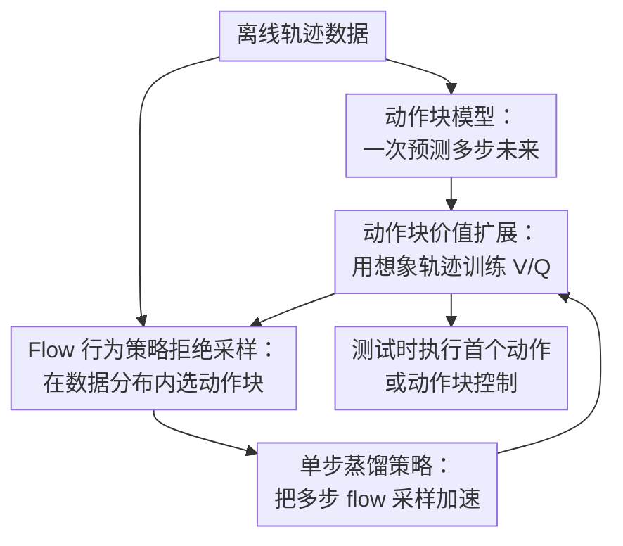

# Scalable Offline Model-Based RL with Action Chunks

**会议**: ICLR 2026  
**OpenReview**: [https://openreview.net/forum?id=WXGb9unEHo](https://openreview.net/forum?id=WXGb9unEHo)  
**论文**: [项目页](https://kwanyoungpark.github.io/MAC/)  
**代码**: https://github.com/kwanyoungpark/MAC  
**领域**: 强化学习 / 离线模型强化学习  
**关键词**: 离线强化学习、模型强化学习、动作块、价值扩展、flow matching  

## 一句话总结
MAC 用动作块模型把长时域离线模型强化学习中的多次单步模型调用压缩成少量多步预测，再用 flow 行为策略的拒绝采样选择保守且高价值的动作块，在 100M 级 OGBench 长时域操控任务上显著强过已有离线模型强化学习方法。

## 研究背景与动机

**领域现状**：离线强化学习希望只依赖已有数据训练出可执行策略，不再和环境交互。过去的主流路线大致分成两类：一类是 model-free offline RL，直接在数据集上做价值学习或行为正则；另一类是 model-based offline RL，先学动力学模型，再用模型生成想象轨迹来做规划、数据扩增或价值估计。本文关注后者中的 model-based value expansion，因为它把生成模型和 on-policy 价值学习结合起来，理论上更接近那些已经在长时域任务中展现出可扩展性的训练范式。

**现有痛点**：标准离线 model-free 方法在长时域任务上经常被 off-policy TD 学习拖住：每次 Bellman 更新只看很短的局部，偏差会沿着很长的决策链累积。模型强化学习看似可以用多步模型 rollout 缓解这个问题，但又会撞上另一个老问题：学到的单步动力学模型必须递归调用很多次，一步的小误差在几十步、上百步之后会变成完全错误的未来状态。

**核心矛盾**：model-based value expansion 里 rollout 长度 $n$ 同时扮演两种相反角色。$n$ 大时，目标 $\sum_{i=0}^{n-1}\gamma^i r_{t+i}+\gamma^n \bar V(s_{t+n})$ 对 bootstrap 的依赖更少，价值目标偏差更低；但如果用单步模型 $p(s_{t+1}\mid s_t,a_t)$，就必须递归预测 $n$ 次，模型误差更容易爆炸。也就是说，价值学习希望 rollout 足够长，动力学预测却希望 rollout 足够短。

**本文目标**：作者想回答一个很具体的问题：离线模型强化学习能不能在复杂、长时域、百万到亿级数据集上成为可扩展方案？为了做到这一点，方法需要同时满足三件事：第一，允许价值学习使用长 rollout，减少短视 bootstrap；第二，减少模型递归调用造成的 compounding error；第三，在离线设置中避免策略为了高预测价值跑到数据分布外，从而利用模型错误。

**切入角度**：论文的观察是，很多长时域控制任务并不一定要一步一步地建模未来。若把连续 $n$ 个动作看成一个动作块 $a_{t:t+n-1}$，模型可以直接预测 $n$ 步之后的状态 $s_{t+n}$。这样，环境意义上的 100 步 rollout 可以只需要 10 次模型调用。与此同时，动作块的分布维度更高、模态更复杂，单个 Gaussian 策略很难拟合，因此作者引入 flow matching 训练行为动作块策略，再从行为分布内采样并用价值函数挑选动作块。

**核心 idea**：用“动作块模型 + flow 行为策略拒绝采样”替代“单步模型 + 直接优化策略”，把长时域离线模型强化学习的误差累积和 OOD 动作 exploitation 一起压下来。

## 方法详解

### 整体框架

MAC（Model-Based RL with Action Chunks）把一个普通离线 RL 数据集先重组为动作块样本：每条训练样本包含当前状态 $s_t$、长度为 $n$ 的动作块 $a_{t:t+n-1}$、折扣累计奖励 $r_t=\sum_{i=0}^{n-1}\gamma^i r_{t+i}$，以及 $n$ 步后的状态 $s_{t+n}$。在这些动作块样本上，算法同时训练动作块动力学模型、动作块奖励模型、flow 行为动作块策略和价值函数，然后用模型生成 on-policy 想象轨迹来更新价值。

执行策略不是直接学习一个 unconstrained actor，而是从行为 flow 策略里采样多个候选动作块，再用动作块 $Q$ 函数选出价值最高的一个。这个选择过程让策略仍然贴近离线数据分布，同时又能在行为分布内部做 return 最大化。

### 关键设计

**1. 动作块模型：一次预测多步未来来减少模型误差累积**

标准 model-based RL 通常学习 $p(s_{t+1}\mid s_t,a_t)$，要想得到 100 步后的状态，就要把模型输出重新喂回模型 100 次。MAC 改成学习动作块动力学 $p_\psi(s_{t+n}\mid s_t,a_{t:t+n-1})$，输入不是单个动作，而是一整段动作序列，输出也不是下一步状态，而是 $n$ 步后的未来状态。论文实验中默认 $n=10$，所以一个 100 环境步的想象轨迹只需 $H=10$ 次模型调用。

这个设计不是简单把 horizon 缩短，而是把“价值目标需要长视野”和“模型预测不能递归太久”这两个目标拆开：价值学习仍然可以看到 $nH$ 步的 return，但模型递归深度只有 $H$。作者在 puzzle-4x5 上直接测了模型误差，动作块长度从 1 增加到 5、10、25 时，长 rollout 中的 MSE 明显降低；单步模型的误差会随 rollout 长度发散，而动作块模型能显著压住这种发散。

**2. Flow 行为策略拒绝采样：只在离线数据支持的动作块里做价值最大化**

动作块让动力学预测更稳，但也让策略建模变难。长度为 $n$ 的动作块位于 $A^n$，数据里的动作序列往往高度多模态，例如同一个状态下可以先推左边物体，也可以先转向右边目标。若用 Gaussian actor 直接拟合，很容易把多个模态平均成数据里从未出现过的动作块；若再直接最大化模型预测价值，策略会主动钻模型误差的空子。

MAC 的做法是先用 flow matching 训练行为克隆策略 $\pi_\theta(a_{t:t+n-1}\mid s_t)$。flow 策略从噪声 $z\sim\mathcal N(0,I)$ 出发，通过状态条件速度场 $v_\theta(u,s_t,a)$ 逐步流向数据中的动作块分布。策略提取时，不对动作块做梯度上升，而是采样 $M$ 个候选动作块，再选 $Q$ 值最高者：$\pi(s_t)\overset d=\arg\max_{a^{(i)}\sim\pi_\beta(\cdot\mid s_t)}Q(s_t,a^{(i)})$。这相当于把优化空间限制在行为分布能生成的候选集合里，因此不需要像 MOPO / MOBILE 那样额外调一个不确定性惩罚系数来压 OOD 动作。

**3. 单步蒸馏策略：让 flow 拒绝采样能用于训练时模型 rollout**

纯 flow 采样很贵。若每个动作块要采样 $N$ 个候选，每个候选又要用 Euler 方法走 $F$ 个 flow step，那么一次拒绝采样需要 $NF$ 次速度场网络查询。论文举例说 $N=8,F=10$ 时，生成一个动作块就要 80 次查询；而 MAC 在训练时要批量生成很多想象轨迹，这个成本会成为瓶颈。

因此作者额外训练一个 one-step MLP 策略 $\pi_\omega(s_t,z)$ 来蒸馏完整 flow 策略的输出：$L_{distill}=\mathbb E\|\pi_\omega(s_t,z)-[\pi_\theta(s_t,z)]_\times\|_2^2$。这里 $[\cdot]_\times$ 表示 stop-gradient。蒸馏后，拒绝采样从 $NF$ 次查询降到 $N$ 次查询，训练和推理都明显更快。附录里的消融显示，直接去掉 $\pi_\theta$、只用 one-step 模型做 flow matching 会在 OGBench 多模态任务上几乎崩掉，说明这个蒸馏不是可有可无的工程加速，而是在保留多步 flow 表达力的前提下压低计算开销。

**4. 动作块价值扩展：用 on-policy 想象轨迹训练 V/Q 而不是做长时域规划**

MAC 没有把动作块模型只当作 MPC 规划器，也没有生成完整轨迹后做 sequence modeling。它保持 actor-critic 结构：从数据状态出发，用当前拒绝采样策略、动作块动力学模型和奖励模型生成长度为 $H$ 的动作块想象轨迹，再用这条轨迹训练 on-policy value。价值目标覆盖的是 $nH$ 个环境步，形式上类似 $V_\phi(\hat s_{t+kn})$ 回归到从第 $k$ 个动作块开始的累计预测奖励加终端 bootstrap。

随后，算法再训练动作块 $Q_\phi(s_t,a_t)$，目标是预测执行一个候选动作块后的 reward model 输出加 $\gamma^n V_\phi(\hat s_{t+n})$。这个 $Q$ 函数不是普通 critic 的替代品，而是专门服务于拒绝采样：每次从行为策略采样多个动作块后，用它快速排序候选。这样，价值学习提供长期回报信号，行为 flow 提供分布约束，动作块模型提供长时域 rollout，三者形成闭环。

### 一个完整示例

假设离线数据里有一个 cube-octuple 操控任务，机器人需要连续完成多次物体移动。若用单步模型做 100 步想象轨迹，模型需要从 $s_t$ 递归到 $s_{t+1}$、$s_{t+2}$，一直到 $s_{t+100}$，每一步姿态和接触误差都会被下一步放大。

MAC 会先把数据切成长度 $n=10$ 的动作块。给定当前状态 $s_t$，flow 行为策略从噪声中生成多个候选动作块，例如 32 段不同的 10 步手臂控制序列；$Q$ 函数评估这些候选后，选择预测长期价值最高的一段。动作块动力学模型直接预测这 10 步之后的状态 $s_{t+10}$ 和折扣奖励。重复这个过程 $H=10$ 次，就得到覆盖 100 个环境步的想象轨迹，但模型递归深度只有 10。

训练时，价值函数看到的是这条 100 步尺度的 imagined return，因此不用只依赖一步或几步 bootstrap；策略选择时，候选动作仍来自行为 flow，因此不会凭空提出数据集中完全没见过的动作序列。这个例子也解释了为什么 MAC 在 cube-octuple 和 puzzle-4x5 这类需要许多原子动作拼接的任务上收益特别大。

### 损失函数 / 训练策略

MAC 的动作块动力学和奖励模型分别用监督学习训练：$L_{dyn}=\mathbb E\|p_\psi(s_t,a_t)-s_{t+n}\|_2^2$，$L_{rew}=\mathbb E\|r_\psi(s_t,a_t)-r_t\|_2^2$，其中 $a_t$ 表示动作块，$r_t=\sum_{i=0}^{n-1}\gamma^i r_{t+i}$。在大规模 goal-conditioned 任务中，作者用一个 success prediction network 同时参数化 reward 和 terminal；在 reward-based 任务中则直接学习 reward model。

flow 行为策略用 flow matching 损失训练。给定噪声 $z$、真实动作块 $a_t$ 和插值时间 $u$，模型学习把插值点上的速度预测成从噪声到真实动作块的方向。蒸馏策略则拟合完整 ODE flow 的输出，用来替代训练时昂贵的多步采样。

价值训练使用每个 epoch 重新生成的模型 rollout，不复用旧的 imagined data。默认关键超参在所有任务上基本固定：动作块大小 $n=10$、动作块 rollout 长度 $H=10$、折扣 $\gamma=0.999$、flow steps 为 10、测试时拒绝采样 $N_{test}=32$。训练时通常用 $N_{train}=8$，只有 puzzle-4x5 因为行为策略有 20 个可能分支而用 $N_{train}=32$。这一点很重要，因为很多模型强化学习 baseline 需要针对每个任务调 rollout horizon 和 uncertainty penalty，而 MAC 的 horizon 相关超参基本跨任务复用。

## 实验关键数据

### 主实验

论文的主实验首先看 100M transition 级别的 OGBench 长时域 goal-conditioned 任务。这里的任务包括 humanoidmaze、cube 和 puzzle 三类，其中 hardest variant 需要 700 到 3000 个环境步、8 到 20 个原子动作才能完成。表中列的是 overall success rate。

| 环境 | 最强 model-free 参考 | 最强旧 model-based | MAC | 主要结论 |
|------|----------------------|--------------------|-----|----------|
| humanoidmaze-medium-navigate | n-SAC+BC 98 ±2 | MOPO 27 ±5 | 36 ±2 | MAC 是模型方法里最好，但仍落后于 model-free |
| humanoidmaze-giant-navigate | n-SAC+BC 82 ±5 | 所有 model-based 0 ±0 | 0 ±0 | 接触丰富 locomotion 仍是模型方法短板 |
| cube-double-play | SHARSA 95 ±3 / GCIQL 74 ±3 | FMPC 37 ±13 | 100 ±1 | MAC 明显强过旧模型方法，也超过 model-free |
| cube-octuple-play | SHARSA 19 ±3 | 所有旧 model-based 0 ±0 | 30 ±6 | 长时域多物体操控中动作块优势最清楚 |
| puzzle-3x3-play | SHARSA 100 ±0 | MOPO 19 ±2 | 100 ±0 | MAC 达到满分，与最强 model-free 持平 |
| puzzle-4x5-play | SHARSA 91 ±4 | LEQ 1 ±3 | 99 ±3 | 最难 puzzle 上 MAC 超过已有所有方法 |

在标准 reward-based OGBench 任务上，MAC 也不只是长时域特化方法，而是一个相当强的通用离线 RL 算法。它在 5 个环境中的 4 个拿到最高平均成功率，尤其在 scene 和 puzzle-4x4 上远高于 model-free 和旧 model-based 方法。

| 环境 | 最强 model-free | 最强旧 model-based | MAC | 提升解读 |
|------|----------------|--------------------|-----|----------|
| cube-single-play-v0 | FQL 96 ±3 | MOBILE 81 ±8 | 99 ±2 | 短任务上 MAC 稳定接近满分 |
| cube-double-play-v0 | FQL 29 ±21 | FMPC 3 ±2 | 53 ±4 | 双物体任务中动作块价值明显 |
| scene-play-v0 | FQL 56 ±45 | MOPO 6 ±8 | 97 ±4 | 多物体场景中旧模型方法几乎失效 |
| puzzle-3x3-play-v0 | FQL 30 ±31 | MOPO 20 ±0 | 20 ±0 | 该环境整体收益有限，MAC 未领先 |
| puzzle-4x4-play-v0 | IDQL 29 ±13 | 旧 model-based 0 ±0 | 78 ±13 | 更长 puzzle 上 MAC 大幅领先 |

### 消融实验

| 配置 / 分析 | 任务或指标 | 结果 | 说明 |
|-------------|------------|------|------|
| 动作块长度 $n=1$ | cube-octuple | 约 0 成功率 | 不做动作块时长时域任务基本解不开 |
| 动作块长度 $n=10$ | cube-double / cube-octuple | 两个任务均显著提升 | 合适 chunk size 同时压低误差并保持可学习性 |
| 动作块长度 $n=25$ | cube-double / cube-octuple | 性能下降 | 过长动作块让策略学习和 $Q$ 估计变难 |
| MAC (Gau) | cube-single / double / scene / puzzle-4x4 | 2 ±3 / 0 ±0 / 0 ±0 / 0 ±0 | Gaussian 动作块策略无法表达多模态行为分布 |
| MAC (FQL) | cube-single / double / scene / puzzle-4x4 | 77 ±21 / 2 ±3 / 40 ±47 / 23 ±13 | 用梯度式策略提取替代拒绝采样会明显变差 |
| MAC 完整版 | cube-single / double / scene / puzzle-4x4 | 100 ±0 / 50 ±12 / 100 ±0 / 85 ±14 | flow 表达力和拒绝采样两者都关键 |
| 去掉 $\pi_\theta$ 蒸馏源 | cube-single / double / scene / puzzle-4x4 | 2 ±3 / 0 ±0 / 5 ±9 / 15 ±6 | 直接训练 one-step flow 不足以处理高度多模态动作块 |

### 关键发现

- 动作块确实减少模型误差累积。作者在 puzzle-4x5 上测长度 100 的轨迹预测 MSE，单步模型误差随 rollout 长度发散，而更长的动作块显著降低长 rollout 误差。
- 动作块不是越长越好。$n=10$ 是论文默认且跨任务稳定的选择；$n=25$ 虽然模型递归误差更低，但动作块空间变得太大，行为策略采样和 $Q$ 排序都更难。
- flow rejection sampling 是 MAC 的核心，而不是锦上添花。Gaussian policy 和 FQL-style policy extraction 在多模态操控任务上都明显退化，说明离线模型 RL 的策略提取必须同时考虑表达力和分布约束。
- MAC 在接触丰富的 locomotion 上仍然困难。humanoidmaze-giant 中所有 model-based 方法包括 MAC 都是 0，作者认为原因是接触动力学不连续、误差极难建模。
- 训练成本可接受但不免费。附录报告 MAC 单任务约 3.1 小时，多任务约 55.5 小时，比 MOPO / MOBILE / FMPC / LEQ 慢约 1.2 到 2.2 倍；推理延迟也略高，但仍在毫秒级。
- D4RL MuJoCo 上 MAC 并非全面 SOTA。它在 hopper-medium-expert 达到 110 ±1，但总分 771 低于 MOBILE 的 960 和 LEQ 的 923，说明 MAC 的优势更集中在长时域操控拼接，而不是所有标准连续控制数据集。

## 亮点与洞察

- **把 horizon 问题拆成“环境步长”和“模型递归深度”**。很多长时域 RL 方法只说减少 horizon，但 MAC 更精确：价值目标仍覆盖长环境步，模型调用次数却用动作块压缩，这让它不像单纯短 rollout 那样牺牲长期 credit assignment。
- **策略保守性来自生成分布，而不是手调惩罚项**。MOPO / MOBILE 一类方法高度依赖不确定性惩罚系数，任务一变就要重调；MAC 通过从 flow 行为策略采样候选，把“不要出分布”内置进策略提取过程。
- **flow matching 在这里不是炫技，而是服务于动作块多模态性**。动作块维度高、模态多，Gaussian actor 的均值化问题会更严重；flow 策略刚好适合拟合这种复杂行为分布。
- **拒绝采样和 actor-critic 结合得很自然**。$Q$ 函数不是直接指导 actor 梯度，而是给行为候选排序，这让价值函数的使用方式更接近“数据分布内选择器”。这个思路可以迁移到离线 imitation、机器人 skill selection 或长序列 action proposal。
- **工程上很务实**。作者没有让训练时每次都跑完整 flow ODE，而是用 one-step 蒸馏把候选采样成本压下来；同时保持 $n,H,N_{test}$ 等关键超参跨任务固定，减少了 model-based RL 常见的调参负担。

## 局限与展望

- **对接触丰富 locomotion 的建模仍不足**。humanoidmaze-giant 上 MAC 完全失败，说明动作块虽然减少递归次数，但并不能解决高度不连续动力学本身难预测的问题。未来可能需要 latent dynamics、stochastic dynamics 或更强的 generative world model。
- **动作块太长会反噬策略学习**。$n=25$ 的模型误差可能更低，但动作空间维度随 $n$ 增大而急剧上升，$Q(s,a_{t:t+n-1})$ 估计和候选采样都会变难。这给实际应用留下一个问题：不同机器人、不同控制频率下如何自适应选择 chunk size。
- **依赖行为数据质量**。拒绝采样只能在行为策略能生成的候选里选最优动作块。如果数据集主要是 random trajectories 或缺少通向目标的可拼接片段，MAC 的策略提取会缺少好的候选，论文也承认低质量数据集可能限制性能。
- **确定性动作块模型假设偏强**。本文在 benchmark 中用 MLP 预测 $s_{t+n}$ 已足够，但在随机环境、部分可观测任务或真实机器人传感噪声下，确定性多步模型可能会平均掉多个未来。后续可以考虑 flow / diffusion dynamics 或 latent stochastic model。
- **训练成本高于轻量 model-free 方法**。尽管作者通过蒸馏降了很多成本，MAC 仍要训练动力学、奖励、flow policy、distilled policy、$V/Q$ 多个模块。若部署场景算力有限，可能需要进一步压缩模型或减少训练时 rollout 数量。

## 相关工作与启发

- **vs MOPO / MOBILE**: 它们也是离线 model-based RL，但主要靠单步模型生成 Dyna-style 数据，并用不确定性或 Bellman inconsistency 惩罚处理 OOD。MAC 不再把惩罚系数当核心安全阀，而是用动作块减少模型递归误差，用行为 flow 候选限制策略分布。
- **vs LEQ**: LEQ 同样属于 model-based actor-critic，并关注 conservative value estimation。区别是 MAC 的核心是动作块动力学和 on-policy value expansion，能在长时域操控中生成更长的有效想象轨迹；LEQ 在论文的长时域表格中几乎全为 0 或接近 0。
- **vs F-MPC / D-MPC**: F-MPC 也使用动作块动力学模型，但主要是基于行为 Monte Carlo value 的 planning。MAC 则把动作块模型放进完整 actor-critic loop，用想象轨迹训练价值函数，因此更像可迭代改进的 offline model-based RL，而不是一次性规划器。
- **vs Diffuser / HD-DA**: 这些 sequence modeling 方法把轨迹当成生成对象，通过条件生成或层级规划做决策。MAC 不生成完整轨迹分布，而是只建模动作块转移并用价值函数做长期评估，计算结构更接近 RL，也更容易利用 on-policy value learning。
- **vs SHARSA / n-SAC+BC**: 这些强 model-free baseline 也通过 horizon reduction、层级策略或 flow rejection sampling 处理长时域任务。MAC 的区别在于引入模型 rollout 和动作块 value expansion，在 cube-octuple、puzzle-4x5 等操控任务上能超过它们；但在 humanoidmaze locomotion 上仍落后。

## 评分

- 新颖性: ⭐⭐⭐⭐☆ 动作块、多步模型和 rejection sampling 都有前史，但把它们组成可扩展的离线 model-based actor-critic recipe 很有辨识度。
- 实验充分度: ⭐⭐⭐⭐⭐ 覆盖长时域 100M 数据、标准 OGBench、D4RL、训练时间、超参和多组消融，正负结果都报告得比较完整。
- 写作质量: ⭐⭐⭐⭐⭐ 问题动机非常清楚，围绕 rollout length 的 bias-error 矛盾展开，算法和实验问题对应紧密。
- 价值: ⭐⭐⭐⭐☆ 对长时域机器人操控的离线模型强化学习很有参考价值，但在 contact-rich locomotion 和通用 D4RL 上仍有明显边界。

<!-- RELATED:START -->

## 相关论文

- [\[ICLR 2026\] DEAS: DEtached value learning with Action Sequence for Scalable Offline RL](deas_detached_value_learning_with_action_sequence_for_scalable_offline_rl.md)
- [\[ICLR 2026\] Learning to Reason as Action Abstractions with Scalable Mid-Training RL](learning_to_reason_as_action_abstractions_with_scalable_mid-training_rl.md)
- [\[ICLR 2026\] ReFORM: Reflected Flows for On-support Offline RL via Noise Manipulation](reform_reflected_flows_for_on-support_offline_rl_via_noise_manipulation.md)
- [\[ICLR 2026\] MOBODY: Model-Based Off-Dynamics Offline Reinforcement Learning](mobody_model-based_off-dynamics_offline_reinforcement_learning.md)
- [\[ICLR 2026\] ROMI: Model-based Offline RL via Robust Value-Aware Model Learning with Implicitly Differentiable Adaptive Weighting](model-based_offline_rl_via_robust_value-aware_model_learning_with_implicitly_dif.md)

<!-- RELATED:END -->
