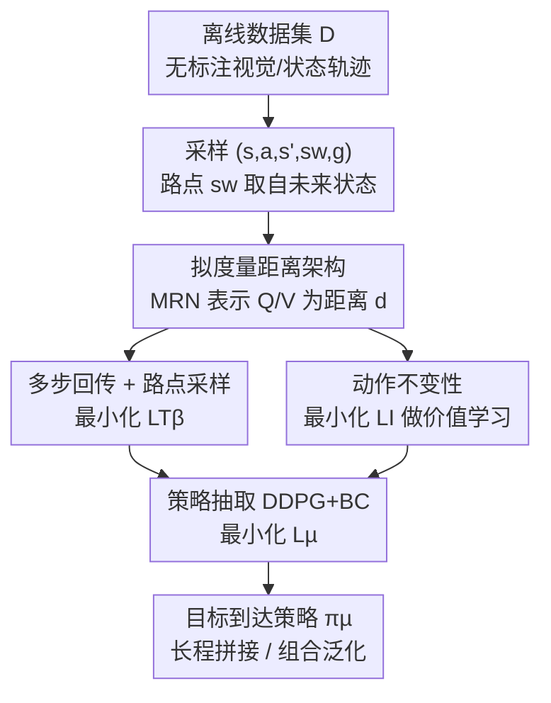

# Multistep Quasimetric Learning for Scalable Goal-Conditioned Reinforcement Learning

**会议**: ICLR 2026  
**OpenReview**: [https://openreview.net/forum?id=UElh7vzgKX](https://openreview.net/forum?id=UElh7vzgKX)  
**论文**: [项目页](https://mqe-paper.github.io)  
**代码**: https://mqe-paper.github.io (项目页含代码)  
**领域**: 强化学习 / 目标条件 RL / 离线 RL / 机器人操作  
**关键词**: 目标条件强化学习, 拟度量学习, 多步回传, 时序距离, 长程泛化

## 一句话总结
本文提出 MQE（Multistep Quasimetric Estimation），把多步蒙特卡洛回传嫁接到拟度量距离架构上，端到端学一个满足三角不等式的目标条件 Q 函数，在最长 4000 步的离线 GCRL 任务和真实机械臂多阶段操作上首次实现了无层级、无规划器的"拼接"（stitching）与组合泛化。

## 研究背景与动机

**领域现状**：目标条件强化学习（GCRL）的核心是估计两个观测之间的"时序距离"——从当前状态走到目标要多少步。离线场景下主流分两派：一派用时序差分（TD）做**局部更新**（GCIQL、QRL、nSAC+BC），理论上能逼近最优 $Q^*$；另一派用蒙特卡洛（MC）/对比学习做**全局更新**（CRL、CMD、TMD），把未来状态当目标、用多步回报传播价值。

**现有痛点**：两派各有硬伤。TD 方法在长程任务上会因为 bootstrap 的复合误差不断累积，horizon 一拉长就崩；MC/对比学习方法虽然在实践里更稳，但只能恢复行为策略下的 $Q^\beta$，拿不到最优值，且对比学习参数化的距离不带全局几何约束，难以做组合拼接。结果是：离线 RL 在短程任务上很好扩展，一到需要复杂推理的长程任务就失灵。

**核心矛盾**：局部更新（TD，有最优性保证但长程发散）与全局更新（MC，长程稳但只到行为策略）之间存在 trade-off，没有方法能同时吃到两边的好处——既快速地全局传播价值，又保持局部一致性与全局几何结构。

**本文目标**：设计一个离线 GCRL 方法，能在**同一套价值函数**里同时做局部和全局价值传播，从而（i）显著增强 horizon 泛化、做出拼接行为；（ii）在带噪数据上稳定抽取强目标到达策略；（iii）稳定到能直接搬上真实机器人、不需额外设计。

**切入角度**：作者注意到拟度量（quasimetric）架构天然带三角不等式 $d(s_0,g)\le d(s_0,s_w)+d(s_w,g)$，这正是"把难问题分解成易问题"的最优子结构；而多步回报能把价值一次传得更远。如果把多步回传写进拟度量距离的回归目标里，就能让"局部一致性 + 全局几何约束"同时生效。

**核心 idea**：用拟度量距离参数化 Q/V，并把单步 TD 回归扩展成"对任意中间路点（waypoint）的多步回归"，从而首次把多步 MC 回报和拟度量结构结合起来——MQE。

## 方法详解

### 整体框架

MQE 是一个离线 GCRL 算法，整条管线只学**一个**评论家（拟度量网络 $d$）和**一个**目标到达策略 $\pi_\mu$，没有任何层级结构或高层规划器。它把目标条件 Q/V 表示成"状态/状态-动作对到目标"的距离：

$$Q_g(s,a)=V_g(g)\,e^{-d((s,a),g)},\qquad V_g(s)=V_g(g)\,e^{-d(s,g)}.$$

距离越小、Q 越大。距离 $d$ 用 MRN（Metric Residual Network）参数化，保证满足拟度量三条性质（非负、自反 $d(x,x)=0$、三角不等式）。训练时每个 batch 采样 $\{s_i,a_i,s'_i,s^w_i,g_i\}$，其中 $s^w$ 是从轨迹未来采的"路点"。三个损失协同更新网络：多步回传 $\mathcal{L}_{T_\beta}$ 负责把价值传远，动作不变性 $\mathcal{L}_I$ 把 Q 压成 V（做价值学习），策略损失 $\mathcal{L}_\mu$（DDPG+BC）把学到的距离蒸馏成可执行策略。

### 关键设计

**1. 拟度量距离架构：给价值函数装上三角不等式这道全局约束**

GCRL 要做拼接（把短任务串成长任务），本质上依赖一条全局结构——从起点到目标的距离不应超过经过任意中转点的距离之和。普通 MLP 评论家或对比学习的点积/范数参数化都不保证这一点，于是长程组合无从谈起。本文改用 MRN 把距离 $d$ 参数化：把表示切成 $N$ 等份，每份取一个非对称分量（ReLU 后取 max）加一个对称分量（$\ell_2$ 范数）之和，

$$d_{\text{MRN}}(x,y)\triangleq\frac{1}{N}\sum_{k=1}^{N}\max_{m}\max(0,x_{kM+m}-y_{kM+m})+\lVert x_{kM+m}-y_{kM+m}\rVert_2,$$

当 $M$ 足够大时这一参数化对任意拟度量是万能逼近的。关键差别在于：三角不等式被**硬编码进网络结构**，而不是靠数据拟合出来，所以学到的距离天生支持"分解难问题为易问题"，这是后面拼接和 horizon 泛化的几何地基。

**2. 多步回传 + 路点采样：把单步 TD 回归扩展成对任意中间路点的多步回归**

单步 TD 在长程上误差复合发散，纯 MC 又只能恢复行为策略价值。本文的洞察是：拟合距离的回归目标 $e^{-d((s,a),g)}\leftarrow \gamma\,e^{-d(s',g)}$（记为 $\mathcal{T}$）里的"下一状态" $s'$ 没必要只取一步——可以把这条不变性推广到当前状态与目标之间的**任意路点** $s^w$。路点这样采：

$$s^w_t \leftarrow s_{t+k'},\quad k'\sim\min(\text{Geom}(1-\lambda),K)\ \text{以概率}\ 1-p,\quad k'=1\ \text{以概率}\ p,$$

于是单步回归变成多步回归目标 $\mathcal{T}_\beta$：$e^{-d((s,a),g)}\leftarrow \gamma^{k'} e^{-d(s^w_t,g)}$。其中混合伯努利+几何分布是为了既能采到"远路点"快速传播价值（几何项），又保留一定概率取 $k'=1$ 守住局部一致性（伯努利项，对应 $p$）。损失采用 LINEX 形式的 Bregman 散度 $D_T(d,d')\triangleq\exp(d-d')-d'$，好处是当两个距离值已经接近时梯度不会消失，训练后期仍能继续打磨。当 $p=1$ 时 $\mathcal{T}_\beta$ 退化回单步 $\mathcal{T}$，消融显示只用 $\mathcal{T}$ 学不出好距离，说明多步回传是性能来源的核心。

**3. 动作不变性：用一个无超参的平滑损失把 Q 压成 V，实现价值学习**

最优评论家应满足 $V^*_g(s)=\max_a Q^*_g(s,a)$，在本文的距离构造下等价于 $d(s,(s,a))=0$（动作不变性）。但网络初始并不满足，需要用梯度下降显式逼 $d(\psi(s),\varphi(s,a))\to 0$。直接拿 L1/L2 回归会出事——网络很快坍缩到平凡解 $\varphi(s,a)=\psi(s)=0$，学不到任何有意义的距离（TMD 为此额外引入超参 $\zeta$ 调梯度幅度）。本文换成

$$\mathcal{L}_I=\sum_{i,j}\big(e^{-d(\psi(s_i),\varphi(s_i,a_j))}-1\big)^2,$$

损失幅度随违反程度自适应缩放：违反小时梯度温和、违反大时梯度强，既稳定了训练动态，又**省掉了调乘子超参**。其作用类似 IQL/TMD 里的价值损失（相当于 $\tau\approx1$ 的期望分位回归），但更稳。

**4. 策略抽取：用 DDPG+BC 把"最小化距离"等价为"最大化 Q"**

距离学好后要落地成可执行策略。由于 $Q_g(s,a)=V_g(g)e^{-d((s,a),g)}$，距离越小 Q 越大，所以最大化 Q 等价于让策略输出的动作把距离压到最小。本文用行为正则化的确定性策略梯度：

$$\mathcal{L}_\mu=\mathbb{E}\Big[\sum_{i,j}d\big((s_i,\pi(s_i,g_j)),g_j\big)-\alpha\log\pi(a_i\mid s_i,g_i)\Big],$$

前项最小化拟度量距离（=最大化 Q），后项是行为克隆正则防止策略偏离数据分布，BC 系数 $\alpha$ 按环境调。整个流程只有一个评论家、一个策略，比层级 RL（HIQL 等）实现简单得多，也因此无需额外设计就能搬上真实机器人。

### 损失函数 / 训练策略

总目标见 Algorithm 1：每步采 batch $\{s_i,a_i,s'_i,s^w_i,g_i\}$，依次（4）用 $\mathcal{L}_{T_\beta}$ 做多步回传更新拟度量网络、（5）用 $\mathcal{L}_I$ 加动作不变性约束、（6）用 DDPG+BC 的 $\mathcal{L}_\mu$ 更新策略，迭代 $T$ 次返回 $\pi_\mu$。理论上（Theorem 1）在表格设定、行为策略 $\pi_\beta$ 对状态-动作对全支撑的假设下，先最小化 $\mathcal{L}_{T_\beta}+\mathcal{L}_I$、再经路径松弛算子 $P(d)(x,z)=\min_y[d(x,y)+d(y,z)]$ 投影到拟度量空间、最后抽策略，可保证 $V^\pi_g(s)\ge V^{\pi_\beta}_g(s)$，即对行为策略做了策略提升。

## 实验关键数据

### 主实验

仿真用 OGBench：13 个状态环境 + 5 个像素环境（$64\times64\times3$），每个 5 个任务，共 95 个任务；并自造一个比 giant 大 50% 的 colossal 迷宫，单趟需约 4000 步。真实环境用 BridgeData（WidowX250，6DoF，5Hz）。

| 评测 | 设定 | MQE 表现 | 对比基线 |
|------|------|---------|---------|
| OGBench 90+ 挑战任务聚合成功率 | 状态+像素 | 大幅领先所有基线 | TMD/CMD/CRL/QRL/GCIQL/HIQL/nSAC+BC |
| humanoidmaze-giant-stitch | 长程拼接 | 较此前最佳约 10× 提升 | HIQL、nSAC+BC（显式 horizon 缩减） |
| antmaze horizon 泛化 | 仅 4m 轨迹训练，colossal 评测 horizon 长 1000% | 唯一在 colossal 迷宫仍非零成功率 | TMD/CRL/HIQL 归零 |
| 视觉操作 | 像素 manipulation | 唯一落后场景 | HIQL 更优 |
| BridgeData 组合 PnP | 连续 1→4 个物体 | 任务数增多仍保持高 task progress | GCBC/GCIQL/TRA 随任务数退化 |
| 最难任务（四连 PnP、开抽屉+放置） | 带依赖的多阶段 | 与 TRA 是仅有的非零成功率 | GCBC/GCIQL 归零 |

### 消融实验

均在 humanoidmaze-giant-stitch 上进行（成功率 %）：

| 配置 | 成功率 | 说明 |
|------|--------|------|
| 完整 MQE（含 $\mathcal{L}_I$，$k'\sim$Eq.(8)） | 26.5 (±1.3) | 完整模型 |
| 去掉 $\mathcal{L}_I$ | 7.9 (±0.7) | 动作不变性贡献最大，掉约 18.6 |
| 用 expectile $\kappa=0.7$ 代替 $\mathcal{L}_I$ | 11.3 (±1.1) | 期望分位价值学习明显更差 |
| 用 expectile $\kappa=0.9$ | 8.8 (±0.7) | 同上 |
| 路点 $k'\sim\text{Geom}(1-\lambda)$ | 22.1 (±1.1) | 去掉伯努利混合略降 |
| 路点 $k'\sim\text{Unif}[1,K]$ | 18.9 (±0.9) | 均匀采样更差 |
| 路点 $k'\sim\text{Unif}[1,50]$ | 17.8 (±1.3) | 固定区间均匀更差 |
| 固定 $k'=50$ | 1.7 (±0.5) | 只远不近，崩 |
| 固定 $k'=1$（纯单步 $\mathcal{T}$） | 0 (±0.0) | 纯单步完全学不出 |

### 关键发现

- **动作不变性 $\mathcal{L}_I$ 是单点贡献最大的组件**：去掉后成功率从 26.5 跌到 7.9，且用 IQL 式 expectile 损失替代也只有 8.8~11.3，验证了平滑自适应损失优于固定分位回归。
- **路点要"既远又近"**：纯远（$k'=50$）几乎学不动、纯单步（$k'=1$）直接归零；几何分布优于均匀分布，作者归因于目标本身按几何分布采样，路点与目标分布匹配才利于泛化。
- **超参 $\lambda$ 与 $p$ 都需偏高**：$\lambda$ 高保证路点足够远让价值快速传播、$p$ 高保证局部一致性被尊重；但 $p$ 过高会退化成纯单步 $\mathcal{T}$ 而学不出好距离——印证多步回传不可或缺。

## 亮点与洞察
- 把"多步 MC 回传"与"拟度量三角不等式"统一进一个距离回归目标，是首个在拟度量架构上跑通多步返回并在真实机器人上成功的工作；两类历来对立的范式（TD 局部 vs MC 全局）被一个 waypoint 采样优雅地缝合。
- 无层级、无高层规划器、单评论家单策略却能在 BridgeData 上做端到端四连 PnP 与"开抽屉再放入"这类带依赖的组合任务——此前只有显式层级或规划方法能做到，工程上极具吸引力。
- $\mathcal{L}_I$ 的平滑自适应设计（损失随违反幅度缩放）是个可迁移的小 trick：凡是需要"软约束两个表示相等、又怕坍缩到平凡解"的场景都能借用，省去调乘子超参。
- LINEX/Bregman 损失避免了距离接近时梯度消失，是长程价值精修能继续推进的隐性功臣。

## 局限与展望
- 路点采样基于启发式（几何+伯努利混合），超出本文评测范围的环境可能需要重新搜索最优采样方式，带来额外计算开销；作者承认未给出"如何采路点"的理论最优解。
- 唯一落后的是视觉操作任务（HIQL 更优），说明像素输入下的拟度量表示学习仍有短板。
- 理论保证（Theorem 1 的策略提升）只在表格设定、行为策略全支撑假设下成立，高维随机连续控制下的保证仍是开放问题。
- 展望：研究路点采样与后继距离的理论联系、考察对 action-chunking 等不同策略类的影响、把方法推广到 offline-to-online 或纯 online RL。

## 相关工作与启发
- **vs QRL（Wang et al., 2023）**: QRL 用拟度量架构但只做单步 TD 更新；MQE 在同一架构上引入多步回传，长程拼接显著更强。
- **vs CMD / TMD（Myers et al., 2024/2025c）**: 它们用对比学习的 MC 更新恢复行为策略距离 $Q^\beta$；MQE 学的是行为动力学偏置下的 Bellman 最优 $Q$，在长程目标到达上换来可观增益，TMD 还需额外超参 $\zeta$ 稳梯度而 MQE 用自适应 $\mathcal{L}_I$ 免调参。
- **vs HIQL（Park et al., 2024b）**: HIQL 靠显式策略 horizon 缩减（层级）做长程；MQE 无层级、单策略却在 humanoidmaze-giant-stitch 上约 10× 反超，仅视觉操作落后。
- **vs nSAC+BC**: 二者都用多步思想，但 nSAC+BC 固定步数且无全局几何约束；MQE 不固定步数、并用拟度量三角不等式提供全局结构。

## 评分
- 新颖性: ⭐⭐⭐⭐⭐ 首个把多步返回与拟度量架构结合并在真实机器人跑通的工作，缝合了 TD/MC 两派
- 实验充分度: ⭐⭐⭐⭐⭐ 95 个仿真任务 + 真实机械臂多阶段操作 + 细致消融，覆盖到 4000 步长程
- 写作质量: ⭐⭐⭐⭐ 思路清晰、动机扎实，但公式密集、路点采样的直觉解释偏简略
- 价值: ⭐⭐⭐⭐⭐ 无层级即可做组合拼接，对离线 GCRL 与真实机器人学习有直接落地意义

<!-- RELATED:START -->

## 相关论文

- [\[ICLR 2026\] Goal Reaching with Eikonal-Constrained Hierarchical Quasimetric Reinforcement Learning](goal_reaching_with_eikonal-constrained_hierarchical_quasimetric_reinforcement_le.md)
- [\[ICML 2026\] Direction-Conditioned Policies via Compositional Subgoal Scoring for Online Goal-Conditioned Reinforcement Learning](../../ICML2026/reinforcement_learning/direction-conditioned_policies_via_compositional_subgoal_scoring_for_online_goal.md)
- [\[ICLR 2026\] Occupancy Reward Shaping: Improving Credit Assignment for Offline Goal-Conditioned Reinforcement Learning](occupancy_reward_shaping_improving_credit_assignment_for_offline_goal-conditione.md)
- [\[ICLR 2026\] Scalable In-Context Q-Learning](scalable_in-context_q-learning.md)
- [\[ICML 2026\] Latent Representation Alignment for Offline Goal-Conditioned Reinforcement Learning](../../ICML2026/reinforcement_learning/latent_representation_alignment_for_offline_goal-conditioned_reinforcement_learn.md)

<!-- RELATED:END -->
