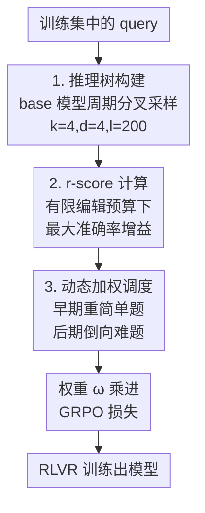

# Scheduling Your LLM Reinforcement Learning with Reasoning Trees

**会议**: ICLR 2026  
**OpenReview**: [https://openreview.net/forum?id=V4zln7XiJj](https://openreview.net/forum?id=V4zln7XiJj)  
**代码**: https://github.com/zz-haooo/Re-Schedule  
**领域**: LLM推理 / 强化学习 / 课程学习  
**关键词**: RLVR, 推理树, 数据调度, 课程学习, GRPO

## 一句话总结
本文提出用「推理树结构」而非「答题准确率」来衡量一道题对 LLM 的真实学习难度，定义了一个新指标 Reasoning Score（r-score），并据此设计课程式数据调度算法 Re-Schedule，在六个数学推理 benchmark 上把平均准确率最高提升 3.2%。

## 研究背景与动机
**领域现状**：RLVR（带可验证奖励的强化学习，典型如 GRPO）已成为提升 LLM 数学推理能力的主流范式。在这个范式下，一道题的所有可能解题路径可以建模成一棵「推理树」（Reasoning Tree）——根是题目，每个节点是一步中间推理，每条根到叶的路径是一条完整解答轨迹。RLVR 的本质就是对这棵树做「节点编辑」：奖励正确路径、惩罚错误路径，从而调整每个节点上的 token 概率，逐步剪掉劣质分支。

**现有痛点**：在 RLVR 里给训练数据排课程（data scheduling）能进一步提升数据效率，但现有调度方法（ACC 课程、LPPO、Seed-GRPO、DELT 等）几乎都用「基于路径」的指标——主要是最终答题准确率 ACC——来给题目排难度，再按由易到难训练。问题是，准确率根本测不准「学习难度」。

**核心矛盾**：低准确率不代表题难学，高准确率也不代表题好优化。作者用两类样本说明这个错位（论文 Figure 2）：一类「潜力样本」初始准确率很低（仅约 1.4%），但推理树结构简单、错误集中，只要改对几个关键决策节点准确率就能猛涨（一步训练后冲到 70%+，学习曲线陡峭）；另一类「停滞样本」初始准确率高（70%+），但正确路径零散分布在不同子树里，结构「弥散」，要改的节点很多，再怎么训也涨不动。基于准确率的调度会把「潜力样本」误判为难题而降权、反而优先训练真正难学的「停滞样本」，导致训练低效。

**本文目标**：抛开路径指标，直接从推理树**结构**去量化一道题的真实学习难度，并据此排课程。

**切入角度**：把强化学习训练看成「在有限节点编辑预算下最大化准确率提升」的优化问题——如果一道题只需编辑少数几个节点就能大幅提分，说明它结构简单、好学。

**核心 idea**：用「固定编辑预算下能拿到的最大准确率增益」定义 r-score 替代准确率，作为更本质的难度度量，并把它做成由易（高 r-score）到难（低 r-score）的动态权重课程。

## 方法详解

### 整体框架
Re-Schedule 是一个套在标准 GRPO 之上的数据调度模块，整条管线分三步：**先离线给每道题近似地建一棵推理树 → 在树上模拟「节点编辑」算出 r-score → 把 r-score 转成随训练步动态变化的样本权重，乘进 GRPO 的损失里**。前两步是离线一次性预处理（只用 base 模型采样，不参与梯度），第三步在 RLVR 训练过程中持续起作用：早期重点学高 r-score 的简单题以稳住训练，后期权重逐渐倒向低 r-score 的难题以提升泛化。

### 关键设计

**1. 推理树构建：用固定结构的 k 叉树近似无法穷举的解空间**

完整推理树因组合爆炸不可计算，所以本文给每道题离线建一棵「定结构」近似树，由三个参数刻画：分叉因子 $k$、最大深度 $d$、token 间隔 $l$（默认 $k=4, d=4, l=200$）。构建方式是「周期分叉采样」：从根（题目）开始生成回答，在回答开头以及之后每隔 $l$ 个 token 触发一次分叉，当前路径裂成 $k$ 条独立子路径并行续写，递归到深度 $d$ 为止。由于同一父节点下的兄弟分支共享前缀，用 KV-Cache 复用前缀计算来压低多路采样的开销。建好树后，每个叶节点（一条完整解答）按答案正确与否打 0/1，任意中间节点 $n_i$ 的质量定义为它所有叶后代 $L(n_i)$ 的平均准确率 $\text{ACC}(S)=\frac{\sum_{n_j\in S}\mathbb{I}(n_j\text{ correct})}{|S|}$。这棵带质量标注的近似树，是后续算 r-score 的底座——它把「一道题的解空间结构」显式地表示了出来，这正是路径指标丢掉的信息。

**2. r-score 计算：用「有限编辑预算下的最大增益」量化结构可学性**

r-score 的核心思想是：好学的题，应该只改少数关键节点就能大幅提分。对任一非叶节点 $n_i$，定义它的单点 r-score 为「选出它的最优子分支、剪掉其余子分支后能拿到的准确率增益」：

$$R(n_i)=\max_{n_{child}\in C(n_i)}\text{ACC}\big(N_{leaf}\setminus L(n_i)\cup L(n_{child})\big)-\text{ACC}(N_{leaf}).$$

直观说，这一步是在评估从 $n_i$ 出发的子树结构——结构越简单（正确路径越集中），把劣质分支剪掉带来的增益越大，$R(n_i)$ 越高。整道题的 r-score $R(q)$ 则是在「最多编辑 $M$ 个节点」的预算下，从所有互不冲突的节点里挑出 $M$ 个使单点增益之和最大：

$$R(q)=\max_{N^*\subseteq N,\,|N^*|=M}\sum_{n_i\in N^*}R(n_i).$$

两个节点「冲突」指其中一个落在另一个最优分支隐式剪掉的子树里，不能重复计入。$R(q)$ 高，意味着「只纠正几个关键推理步就能大幅提分」，即结构简单、学习效率高。这就解释了引言里的错位：错误集中的题（小预算两次编辑 +75%）r-score 高，弥散的题（同样预算只 +25%）r-score 低——而它们的初始准确率可能恰好相反。

**3. 动态加权调度：把 r-score 做成由易到难的时间课程**

光有难度分还不够，直接只训简单题会牺牲数据多样性。本文把 r-score 转成同时依赖训练轮次 $t$ 和分数 $R(q)$ 的自适应权重。先算一个随时间翻转的中间量

$$\alpha(R(q),t)=(1-\gamma(t))\,R(q)+\gamma(t)\,(1-R(q)),$$

再按它在全数据集里的排序映射到权重区间：$\omega=\text{rank}(\alpha)\%\cdot\omega_{max}+(1-\text{rank}(\alpha)\%)\cdot\omega_{min}$。其中 $\gamma(t)$ 是随训练推进的调度函数，可取线性 $\gamma(t)=t/T$ 或 sigmoid $\gamma(t)=\sigma(t/T-0.5)$。$\gamma$ 早期小、$\alpha$ 主要由 $R(q)$ 主导，于是高 r-score（简单题）拿大权重稳住前期 RL；$\gamma$ 后期增大、$\alpha$ 翻向 $1-R(q)$，权重逐渐倒向低 r-score（难题），逼模型啃硬骨头、缓解对欠采样分布的灾难性遗忘。这个 $\omega$ 最终乘进 GRPO 的逐 query 目标项里（$J_{schedule}=\mathbb{E}[\omega(q,t)\cdot J_{GRPO}(q)]$），不改 GRPO 本身，只改每道题的贡献权重。注意它和准确率课程（ACC）形式同构，区别只在把 $\text{ACC}(q)$ 换成了结构性的 $R(q)$——这正是本文涨点的来源。

### 损失函数 / 训练策略
基座算法是标准 GRPO，目标对每个 query 引入权重 $\omega(q,t)$ 调制其贡献。训练数据为 DAPO-Math-17k（仅整数答案数学题），去掉 KL 散度项和熵正则项，生成 batch size 512，top-p=1.0、温度 1.0，总轮数 $T=10$。权重区间默认 $\omega_{min}=0.5,\ \omega_{max}=2.0$。提供 linear / sigmoid 两种 $\gamma(t)$ 调度方案。

## 实验关键数据

### 主实验
在 Qwen2.5-Math-7B 上，Re-Schedule(sigmoid) 平均准确率达 48.5%，刷新 SOTA，比最强调度基线 ACC(sigmoid) 高 1.9%、比 GRPO 高 4.2%；在 Qwen2.5-7B 上达 44.5%，同样领先所有基线。

| 模型 (Qwen2.5-Math-7B) | AIME24 | AIME25 | AMC23 | MATH500 | Minerva | Olympiad | Avg. |
|------|------|------|------|------|------|------|------|
| 基座（未 RL） | 13.8 | 5.3 | 44.6 | 39.6 | 9.9 | 13.8 | 21.2 |
| GRPO | 28.0 | 14.3 | 66.2 | 78.6 | 37.5 | 40.9 | 44.3 |
| OPO | 32.2 | 13.4 | 71.5 | 82.2 | 38.6 | 41.0 | 46.5 |
| ACC(sigmoid) | 31.5 | 15.6 | 70.9 | 80.8 | 38.6 | 42.2 | 46.6 |
| LPPO | 32.8 | 14.9 | 63.3 | 79.2 | 39.0 | 40.6 | 45.0 |
| Seed-GRPO | 30.7 | 14.0 | 71.0 | 80.0 | 38.2 | 38.5 | 45.4 |
| **Re-Schedule(linear)** | 34.2 | 15.6 | 72.4 | 81.2 | 36.4 | 42.5 | 47.1 |
| **Re-Schedule(sigmoid)** | **35.2** | **16.0** | 72.3 | 82.2 | **42.3** | **44.4** | **48.5** |

### 消融实验

| 配置 | 关键设置 | Avg. | 说明 |
|------|---------|------|------|
| 树结构 | $k=4, d=4$（默认） | 48.3 | 最优 |
| 树结构 | $k=3, d=5$ | 46.9 | 偏深掉 1.4 |
| 树结构 | $k=5, d=3$ | 47.0 | 偏宽掉 1.3 |
| 权重区间 | $\omega_{min}=0.5,\omega_{max}=2.0$（默认） | 48.5 | 最优 |
| 权重区间 | $\omega_{max}=1.5$（动态范围变窄） | 46.9 | 区分度不足，掉 1.6 |
| 权重区间 | $\omega_{min}=0.2$（范围过极端） | 46.4 | 难题被长期压权，掉 2.1 |

计算开销-收益权衡：树越大近似越准但越贵，默认 $k=d=4$ 额外耗时 +48.54%、增益 +4.0；而 $k=4,d=3$ 仅 +14.35% 开销就能拿 +3.2，性价比更高。

### 关键发现
- **r-score 比准确率更能识别「值得早学」的题**：用各指标各选 top-1/3 数据单独训一轮，r-score 选出的子集在训练集上很快反超 ACC 子集，在测试集上更是稳定优于 ACC 选择和随机选择（GRPO），证明它抓住了真实学习信号而非初始准确率。
- **训练确实在「优化推理树」**：作者定义 Minimum Corrective Nodes（MCN，达到目标准确率所需的最少节点修改数），随训练推进 MCN 持续下降，佐证了「RL 训练 = 推理树节点编辑」这一核心假设。
- **权重动态范围要够大但别走极端**：范围太窄区分不开难易、范围太极端会把难题长期压死，两端都掉点。
- **sigmoid 调度普遍优于 linear**：在两个模型上 sigmoid 方案平均分都更高。

## 亮点与洞察
- **把「难度」从结果指标改成结构指标**：用准确率当难度是隐式假设「推理是扁平序列」，本文显式利用解空间的树状拓扑，这个视角转换本身就很有启发——同样的思路可迁移到代码生成、Agent 多步决策等任何「解空间天然成树」的 RLVR 任务。
- **r-score 的「有限预算最大增益」定义很巧**：它直接对应「RL 在有限步内能把这道题学多好」，比准确率/不确定性这类代理指标更贴近优化动力学本身。
- **MCN 这个辅助指标提供了机制证据**：不只在终点比分数，而是用「纠错所需节点数随训练下降」证明训练过程真在做树优化，把「RL=节点编辑」的叙事坐实。
- **方法即插即用**：不改 GRPO 算法，只在前面挂一个离线打分 + 一个权重函数，工程上易接入现有 RLVR 流程。

## 局限与展望
- **树构建有不小的离线开销**：默认 $k=d=4$ 额外耗时 +48.54%，虽然可用 KV-Cache 缓解、也可退到更便宜的配置，但对大规模数据集仍是负担；r-score 基于 base 模型一次性采样，若训练中策略漂移较大，离线树的近似可能失真。
- **定结构 k 叉树是粗近似**：固定 $k,d,l$ 的周期分叉只能近似真实推理树，分叉点按 token 间隔机械触发，未必落在语义上的关键决策步，近似误差对 r-score 的影响缺乏更细的理论界。
- **场景偏窄**：实验全在整数答案的数学推理（DAPO-Math-17k + 六个数学 benchmark）、两个 Qwen 模型上，在非数学、答案不可机器验证的任务上是否成立未验证。
- **改进方向**：可探索随训练在线更新推理树、用语义而非固定 token 间隔触发分叉、把 r-score 与梯度/不确定性类指标融合。

## 相关工作与启发
- **vs ACC 课程学习**：两者权重函数形式同构，但 ACC 用准确率 $\text{ACC}(q)$ 排难度，本文用结构性的 r-score $R(q)$；本文在六个 benchmark 上稳定领先（48.5 vs 46.6），说明结构信息比终点准确率更能反映学习难度。
- **vs LPPO / Seed-GRPO**：LPPO 用准确率梯度、Seed-GRPO 用语义不确定性作难度代理，本质都是「基于结果的扁平代理」；本文直接量化解空间的树状可学性，更原则化。
- **vs LIMR（静态选择）**：LIMR 一次性从大集合里筛固定子集，本文是随训练动态调权的课程，能在不同阶段侧重不同难度的题。
- **vs 标准 GRPO**：GRPO 是本文基座，Re-Schedule 只在其上加调度权重，不动策略优化本体，因此可与其他 GRPO 改进正交叠加。

## 评分
- 新颖性: ⭐⭐⭐⭐⭐ 把数据难度从「路径准确率」重新定义为「推理树结构可学性」，视角清新且有机制证据
- 实验充分度: ⭐⭐⭐⭐ 两模型六 benchmark + 多组消融 + 开销分析扎实，但局限在可验证的数学推理任务
- 写作质量: ⭐⭐⭐⭐ 用 q1/q2 例子和 MCN 实验把动机讲得很清楚，公式记号略密
- 价值: ⭐⭐⭐⭐ 即插即用、稳定涨点，且为 RLVR 数据调度提供了一个可迁移的结构化新框架

<!-- RELATED:START -->

## 相关论文

- [\[ICLR 2026\] Getting Your LLMs Ready for Reinforcement Learning with Lightweight SFT](getting_your_llms_ready_for_reinforcement_learning_with_lightweight_sft.md)
- [\[ICLR 2026\] Prompt Curriculum Learning for Efficient LLM Post-Training](prompt_curriculum_learning_for_efficient_llm_post-training.md)
- [\[ICLR 2026\] R-Zero: Self-Evolving Reasoning LLM from Zero Data](r-zero_self-evolving_reasoning_llm_from_zero_data.md)
- [\[ICLR 2026\] J1: Incentivizing Thinking in LLM-as-a-Judge via Reinforcement Learning](j1_incentivizing_thinking_in_llm-as-a-judge_via_reinforcement_learning.md)
- [\[ICLR 2026\] Reinforcement Learning with Verifiable Rewards Implicitly Incentivizes Correct Reasoning in Base LLMs](reinforcement_learning_with_verifiable_rewards_implicitly_incentivizes_correct_r.md)

<!-- RELATED:END -->
