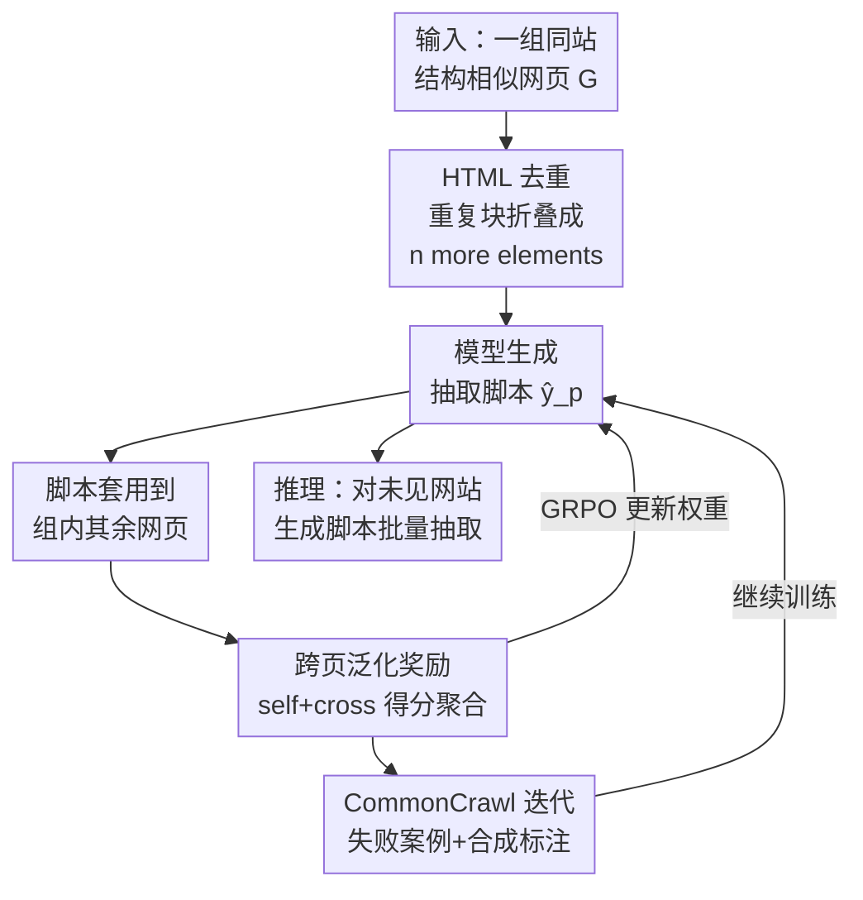

# SCRIBES：用强化学习做 Web 规模的脚本式半结构化数据抽取

**会议**: ICLR 2026  
**OpenReview**: [https://openreview.net/forum?id=gQSnEIA3Z3](https://openreview.net/forum?id=gQSnEIA3Z3)  
**代码**: https://github.com/facebookresearch/SCRIBES (待发布)  
**领域**: 强化学习 / 信息抽取 / LLM 效率  
**关键词**: 脚本式抽取、半结构化数据、RLVR、布局相似度奖励、CommonCrawl

## 一句话总结
SCRIBES 不再让 LLM 逐页解析网页，而是用强化学习训练一个模型，看一个网页就生成一段**可复用的抽取脚本**（BeautifulSoup 代码），靠"同站网页布局相似"这一性质设计跨页奖励，使脚本能泛化到整组结构相似的网页；脚本质量比强 agentic 基线高 13%+，下游 QA 在 GPT-4o 上涨 4%+，且抽取成本随相似页数线性下降。

## 研究背景与动机
**领域现状**：网页上大量事实数据藏在 HTML 表格、列表、信息框这类半结构化内容里。把它们转成结构化三元组（主语-谓语-宾语）的知识抽取，传统上有两条路：一是 wrapper induction、图挖掘、布局规则、DNN 等传统信息抽取（IE）方法；二是近期用 LLM 逐页解析或构建知识图谱的方法。

**现有痛点**：传统 IE 方法很脆，遇到没见过的网站或 schema 就泛化失败，还得人工设计模板；LLM 逐页方法虽然输出质量高，但**每个网页都要调一次 LLM**，在 Web 规模下算力开销爆炸——而网页数量是以十亿计的。

**核心矛盾**：效果与效率之间的根本对立。要效果就得用 LLM 逐页吃 HTML，但逐页推理在 Web 规模上不可承受；要效率就得用脚本/规则，但脚本难以泛化、且**人工标注这种抽取脚本极其困难**——连专家标注员都很难直接写出能跨页泛化的脚本，这让监督微调这条路走不通。

**切入角度**：作者观察到一个被现有方法忽略的结构性规律——**同一个网站（domain）下的网页往往共享高度相似的布局**（比如某药品数据库下每个药品页的表格结构都一样，只是数值不同）。如果模型能为一个网页写出脚本，这段脚本天然就该能套用到同组其它网页上。这恰好提供了一个**无需人工标注脚本**的可验证信号：脚本在别的同组页上跑得通、抽得准，就给奖励。

**核心 idea**：用 RLVR（带可验证奖励的强化学习）训练模型生成抽取脚本，**奖励来自"脚本跨页泛化的好坏"而非"是否匹配某个标注脚本"**；再用 CommonCrawl 野生网页 + LLM 合成标注做迭代自训练，把覆盖范围撑到 Web 规模。

## 方法详解

### 整体框架
SCRIBES 要解决的是：给一个网页，输出一段能套用到整组结构相似网页的抽取脚本，让"调一次模型、抽一整组页"取代"每页调一次 LLM"。整条流水线分三块串起来：先把超长 HTML 去重压缩进上下文，再用 GRPO 强化学习训练模型生成脚本（奖励由脚本在同组多个网页上的抽取得分聚合而成），最后用 CommonCrawl 野生数据 + LLM 合成标注做迭代自训练扩大覆盖。

把网页按"同站同组"组织（一组 $G=\{p_1,\dots,p_n\}$ 是结构相似的网页集合）。训练时模型只看组里**一个代表网页**作为输入，生成单一脚本 $\hat{y}_p=\text{LM}(p)$；这段脚本被执行到组内**其余网页**上，抽出的三元组和标注比对算奖励，再用 GRPO 更新权重。推理时模型对新的、没见过的网站同样生成脚本并套用到整组，实现泛化。

### 关键设计

**1. HTML 去重（Dedup）：把超长网页压进上下文窗口**

半结构化网页的原始 HTML 极长，动辄超过长上下文 LLM 的窗口上限，模型根本看不全。作者用一个简单但有效的办法：把**重复出现的 HTML 块折叠**成一个紧凑表示，形如"`n more ... elements`"（比如一个表格里 50 行结构一样的 `<tr>`，只保留几行 + 标注"还有 47 个同类元素"）。这一步大幅削减上下文长度，让模型能在有限窗口里看清整个页面的结构骨架。消融实验确认去重显著提升性能，所以它被默认用在所有 SCRIBES 模型和基线上——既是省 token 的手段，也是让脚本"看得到完整结构"的前提。

**2. 跨页泛化奖励：用同组网页之间的布局相似度当监督信号**

这是全文最核心的设计，直接针对"标注脚本难、但泛化才是目标"这个痛点。作者定义脚本 $\hat{y}_p$ 在网页 $q$ 上执行的得分 $r(p\to q)=S(\hat{y}_p(q), y^\star_q)\in[0,1]$，其中 $S$ 用二分图匹配把预测三元组和金标三元组对齐、再算模糊 F1（训练时 $S=F_1^{fuzzy}$）。关键在于奖励怎么聚合：对训练样本 $p$，奖励是脚本在**整组所有网页**上得分的平均

$$r_{\text{SCRIBES}}(p)=\frac{1}{|G(p)|}\sum_{q\in G(p)}r(p\to q)=\frac{1}{|G(p)|}r_{self}(p)+\frac{|G(p)|-1}{|G(p)|}\sum_{q\neq p}r_{cross}(p,q)$$

其中 $r_{self}(p)=r(p\to p)$ 是脚本在自己生成所依据的那页上的得分，$r_{cross}(p,q)$ 是套用到别页的得分。注意 self-score 只占 $\frac{1}{|G(p)|}$ 的权重，**绝大部分奖励来自 cross-score**。这等于明确告诉模型：写一段只对眼前这页过拟合的脚本拿不到分，必须写出能扛住组内其它网页变化（表格大小不同、数值不同）的脚本。模型用 GRPO 优化这个奖励。消融里把奖励换成只看 self-score（$r_0(p)=r_{self}(p)$）后，holdout 网页上掉了 7.2%，证明这个"以泛化为目标"的奖励设计才是泛化能力的来源。

**3. CommonCrawl 失败案例迭代自训练：在没有人工标注的野生数据上继续扩覆盖**

只有标注数据（192 页、34 组）太少，覆盖不了多样的网站布局。作者从 CommonCrawl 采样野生网页，经过一条过滤流水线（黑名单去成人内容 → 语言筛英文 → 按域名分组 → 保留 ≥ $n=30$ 页的组 → LLM 分类器挑出 ≥ $m=90\%$ 页是半结构化的组 → 采 1 页训练 + 配 $k=13$ 页算奖励）。没有金标怎么算奖励？用**LLM 直接抽取**当合成标注（实验证明这是最强的 baseline）。但这种合成标注很脏（最强 baseline 也只有约 40% F1），直接拿去训练会被噪声带偏。两个关键招数防噪：一是**从已用标注数据训好的 checkpoint 出发**，先建立任务的强先验，再用噪声奖励暴露多样输入；二是**只在失败案例子集上训练**——挑出当前模型生成的脚本"一个三元组都抽不出"的那批网页集中训练，这样合成数据更可能带来净增益。消融显示失败案例子集（Failure-Case CC）给 Q-32B 带来比"全部 CC"高 3.5% 的提升。

### 损失函数 / 训练策略
训练用 GRPO（Group Relative Policy Optimization），优化目标即上面的 $r_{\text{SCRIBES}}(p)$ 跨页平均奖励。底座是 Qwen2.5-Instruct 系列（14B / 32B），做最小化的超参调优以保证训练稳定。奖励中 $S$ 训练时取三元组级模糊 F1（$F_1^{fuzzy}$）；评估时额外用 Llama-3.3-70B-Instruct 当 LLM-as-judge 算 $P^{LM}/R^{LM}/F_1^{LM}$（固定 checkpoint 以保证可复现）。CC 迭代阶段按 1:k 的 Train:Reward 比例组织数据，先标注后野生、且只聚焦失败案例。

## 实验关键数据

### 主实验
评测在 SemiBench（Sun et al., 2025）上做，选 56 个含 >1 网页的组，按组 60%-40% 划分训练/测试（整组分配、组内不切）。指标分三栏：All（脚本套到整组的平均）、Example（脚本所依据的那页）、Holdout（套用到的其它同组页）。

| 模型 / 方法 | All $F_1^{LM}$ | Example $F_1^{LM}$ | Holdout $F_1^{LM}$ |
|------|------|------|------|
| Q-14B agentic-3-iter 2-shot（基线） | 8.0 | 12.6 | 5.7 |
| GPT-4o agentic-3-iter 2-shot（基线） | 24.4 | 31.2 | 21.1 |
| GO-120B agentic-3-iter 2-shot（最强基线） | 34.3 | 36.6 | 33.3 |
| **SCRIBES Q-14B** | 19.9 | 26.7 | 16.7 |
| **SCRIBES Q-14B (+CC)** | 21.8 | 30.0 | 17.7 |
| **SCRIBES Q-32B** | 28.1 | 30.3 | 26.8 |
| **SCRIBES Q-32B (+CC)** | **33.2** | 34.6 | **32.4** |

最优 Q-14B / Q-32B 比同模型的 few-shot agentic 基线在 $F_1^{LM}$ 上高 **13.8%**；最优 Q-32B 已和 few-shot agentic 的 GO-120B（一个 120B 巨模型）打平。

### 消融实验

| 配置 | All $F_1^{LM}$ | Holdout $F_1^{LM}$ | 说明 |
|------|------|------|------|
| Q-14B (SCRIBES 完整奖励) | 19.9 | 16.7 | 完整跨页奖励 |
| Q-14B (只用 self-score, Eq.3) | 15.7 | 9.5 | Holdout 掉 7.2%，证明跨页奖励是泛化来源 |
| Q-32B (仅标注数据) | 28.1 | 26.8 | 不加 CC |
| Q-32B (+ 全部 CC) | 29.7 | 28.1 | 加全部野生数据 |
| Q-32B (+ 失败案例 CC) | **33.2** | **32.4** | 失败案例子集比全部 CC 高 3.5% |

### 关键发现
- **跨页奖励是泛化的真正来源**：只看 self-score 的模型在 Example 上反而高 1.2%，但在 Holdout 上掉 7.2%、All 上掉 4.2%——说明不强制跨页泛化，模型就会写出过拟合单页的脆弱脚本。
- **先金标后噪声、且聚焦失败案例**：直接在 CC 上训、或 CC 与标注 1:1 混训都不涨；必须先用金标建立强先验，再用合成噪声奖励扩多样性才有效。
- **效率随相似页数线性放大**：去重 HTML 每页约 8879 token、flatten 约 2399 token，比值 $\rho\approx3.7$；只要目标网站有 ≥4 个结构相似页，脚本法就开始更省，加速比 $\text{speedup}=k/\rho$ 随相似页数 $k$ 线性增长。在 11.3 万网页的子集上抽出 278 万三元组，只有 4661 页需要直接模型预测，其余全靠脚本自动生成。
- **高抽取精度 ≠ 高下游收益**：QA 实验里用 SCRIBES 三元组让 GPT-4o 涨 4%+、Q-14B 也涨，但对 Q-3B/Q-7B 反而掉——IE 精度提升不必然转成 QA 提升，但 SCRIBES 能用低得多的成本拿到相近的下游收益。
- **跨域可迁移**：训练集排除 product/encyclopedia 域、测试集只含这两域时，SCRIBES 仍比同模型最强 agentic 基线高 10%+。
- **结构越复杂越难**：性能随网页结构量上升而下降；横表 (HT) > 属性-值对 (A-VP) > 自由格式 (F-F)；嵌套列表、多列表头是难点。

## 亮点与洞察
- **把"标注难"转化为"验证易"**：脚本标注对人类都很难，但"脚本在同组别页上跑得准不准"是天然可验证的——这是 RLVR 在信息抽取上一个很漂亮的落点，绕开了监督微调的标注瓶颈。
- **奖励权重的巧妙设计**：让 self-score 只占 $1/|G|$、cross-score 占大头，用一个简单的加权平均就把"必须泛化"这个目标硬编码进奖励，无需额外正则项或对抗机制。
- **脚本 = 把 LLM 算力摊薄到整组**：核心效率红利在于"一次推理生成脚本、脚本零成本套用到 N 页"，这个思路可迁移到任何"同模板大批量"场景（如批量解析同站商品页、批量处理同格式 PDF、爬虫规则自动生成）。
- **失败案例自训练**：用"模型自己抽不出东西的页"做继续训练的数据筛选信号，是一种低成本的难例挖掘，和近期"从自身失败迭代"的 RL 无标注研究呼应。

## 局限与展望
- **复杂结构上性能仍低**：嵌套列表、多列表头、自由格式页上 $F_1$ 明显偏低（最优 Q-32B 在 All 上也只有 33.2），离实用还有距离；绝对分数受 LLM-judge 口径影响，跨设置不可直接比大小。
- **合成标注噪声大**：CC 上用 LLM 直接抽取当金标，本身只有约 40% F1，靠"先金标 + 失败案例"两道闸压噪声，但噪声天花板限制了野生数据能带来的增益。
- **覆盖仍是冰山一角**：Web 规模实验只用了 CC-MAIN-2025-30 不到 1% 的数据，且组大小被截到 30 页、要求 ≥13 页；作者只是论证可行性，真正扩到全量 CommonCrawl 的稳定性未验证。
- **依赖"同站布局相似"假设**：方法红利建立在"同组网页结构高度相似"上，对布局飘移严重、或每页都独一无二的网站，跨页奖励和脚本复用都会失效。
- **改进思路**：把去重做得更结构感知以更好处理嵌套/多列；引入更可靠的合成标注（如多模型投票）压噪声；为脚本加自检/回退机制应对布局漂移。

## 相关工作与启发
- **vs 传统 IE（wrapper induction / 布局规则）**：它们从少量标注学固定 wrapper，对结构变化和模板漂移很脆、跨域泛化差；SCRIBES 学的是**可执行的完整抽取程序**，直接跑在原始 HTML 上，靠 RL 自动适应而非人工设计模板。
- **vs LLM 逐页抽取 / KG 构建（HippoRAG、AutoSchemaKG）**：它们每页调一次 LLM、且把每页当独立个体处理，错过了跨页布局规律，Web 规模下算力不可承受；SCRIBES 用一次推理产出可复用脚本，把同组页的抽取成本摊到近乎零。
- **vs 无标注 RL（self-consistency / self-certainty 等）**：同样减少对标注的依赖、从自身失败迭代，但它们靠内部一致性/置信度信号；SCRIBES 用"脚本跨页执行结果"这种**外部可验证**信号 + LLM 直接抽取当合成标注，监督更扎实。

## 评分
- 新颖性: ⭐⭐⭐⭐⭐ 把"同站布局相似"转成 RLVR 的跨页泛化奖励，绕开脚本标注难题，角度新颖且自洽。
- 实验充分度: ⭐⭐⭐⭐ 多模型规模、奖励/CC/跨域/误差多组消融齐全，但绝对分数偏低、Web 规模仅验证可行性。
- 写作质量: ⭐⭐⭐⭐ 问题动机和奖励设计讲得清楚，RQ 式组织易读；部分指标口径需对照附录。
- 价值: ⭐⭐⭐⭐⭐ 效率红利随相似页数线性放大，对 Web 规模知识抽取有实打实的工程价值。

<!-- RELATED:START -->

## 相关论文

- [\[NeurIPS 2025\] DeepDiver: Adaptive Search Intensity Scaling via Open-Web Reinforcement Learning](../../NeurIPS2025/reinforcement_learning/deepdiver_adaptive_search_intensity_scaling_via_open-web_reinforcement_learning.md)
- [\[ICLR 2026\] Sparse but Critical: A Token-Level Analysis of Distributional Shifts in RLVR Fine-Tuning of LLMs](sparse_but_critical_a_token-level_analysis_of_distributional_shifts_in_rlvr_fine.md)
- [\[ICLR 2026\] SSVPO：面向语言模型 RL 训练的有效步级信用分配](ssvpo_effective_step-level_credit_assignment_for_rl_training_of_language_models.md)
- [\[ICLR 2026\] Scheduling Your LLM Reinforcement Learning with Reasoning Trees](scheduling_your_llm_reinforcement_learning_with_reasoning_trees.md)
- [\[ICLR 2026\] Rubrics as Rewards: Reinforcement Learning Beyond Verifiable Domains](rubrics_as_rewards_reinforcement_learning_beyond_verifiable_domains.md)

<!-- RELATED:END -->
