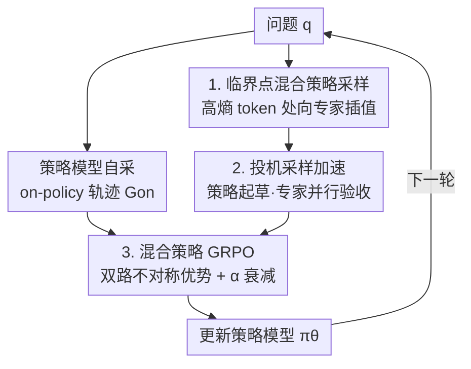

# Selective Expert Guidance for Effective and Diverse Exploration in Reinforcement Learning of LLMs

**会议**: ICLR 2026  
**OpenReview**: [https://openreview.net/forum?id=axlFycAkoL](https://openreview.net/forum?id=axlFycAkoL)  
**代码**: https://github.com/Jiangzs1028/MENTOR (有)  
**领域**: 强化学习 / LLM推理 / RLVR  
**关键词**: RLVR, 探索多样性, 专家引导, 熵坍塌, 混合策略

## 一句话总结
针对 RLVR 训练里弱模型既探不到正确解又容易熵坍塌的问题，本文提出 MENTOR——只在「关键决策点」（高熵 token）注入专家分布做混合策略采样，再配一个不对称优势的 Mixed-policy GRPO，让模型吸收专家推理的精髓而非表面照抄，在六个数学基准上把弱基座模型的平均分稳定拉高 3–4 个点、pass@32 平均提升 9.2%。

## 研究背景与动机

**领域现状**：RLVR（可验证奖励的强化学习）已成为提升 LLM 推理能力的主流手段——用数学判题、程序执行这类可自动检验的信号代替人类反馈，让模型在给出答案前生成长链思维（CoT），o1、DeepSeek-R1、Kimi-1.5 都靠它取得了显著进步。主流实现是 GRPO：对同一道题采样一组解，用组内奖励标准化估计优势，省掉额外的价值模型。

**现有痛点**：RLVR 的收益强烈依赖基座模型能力。当基座参数有限、题目过难时会出两类问题：一是**探索无效**——模型采不出任何正确轨迹，GRPO 组内奖励全为 0，标准化优势 $\hat A_{i,t}$ 趋近于零，更新项失效，训练无法推进；二是**探索不多样**——即使偶尔采到正确解，轨迹种类太少会让模型迅速收敛到狭窄的解集，表现为策略熵快速坍塌（entropy collapse），最终困在次优解里。

**核心矛盾**：现有补救方法是让模型**模仿专家轨迹**（如 LUFFY 把整条专家 rollout 混进采样组、QuestA 给一半专家前缀当提示）。这确实减少了无效探索、提升了有效性，但代价是把模型**绑死在固定的专家轨迹上**：探索空间被钉死，熵坍塌反而被加速；加上梯度不平衡，模型会迅速过拟合专家、尤其当专家推理风格与策略模型差异大时。有人用 token 重加权缓解，但只是治标——只要还在模仿整条固定轨迹，探索空间就被根本性限制了。一句话：有效性与多样性之间存在 trade-off，整条模仿赢了前者却输了后者。

**本文目标**：在引入专家知识的同时既保证有效性、又不牺牲多样性，让弱基座也能做「高质量探索」。作者先从理论上把高质量探索拆成两个必要条件——能采到**至少一条**最优轨迹（有效性）、并且能采到**多条不同的**最优轨迹（多样性，由 Theorem 2.1 证明：熵上界随期望奖励上升而下降，下降速度与最优轨迹集大小 $K$ 成反比，$K$ 越大熵坍塌越慢）。

**切入角度**：作者观察到 token 对推理轨迹的贡献并不均等——少数高熵 token 决定「关键决策岔路口」，其余多数只是确定性的跟随，这些跟随 token 在不同模型间往往只是文风差异、对推理结果几乎没影响。整条专家轨迹里塞满了这类低影响 token，反而干扰模型学习真正的关键决策。

**核心 idea**：专家只需在**关键决策点**给方向，而非铺满整条路径。在高熵 token 处把采样分布向专家分布插值，其余位置仍按自己的策略走——既增加采到正确解的概率，又让探索空间保持指数级大、避免坍塌到单一专家解。

## 方法详解

### 整体框架

MENTOR（Mixed-policy Expert Navigation for Token-level Optimization of Reasoning）要解决的是「如何只在该用专家的地方用专家」。整体上它把一道题的训练拆成两路 rollout 再合并优化：策略模型自己采一组 on-policy 轨迹 $G_{on}$ 负责自我提升；同时用「混合策略」采一组 $G_{mix}$，只在高熵 token 处借专家分布纠偏、负责突破能力边界。两组轨迹喂进一个改造过的 GRPO——on-policy 部分用标准组内标准化优势，mixed-policy 部分用「只奖励高于均值、忽略失败」的不对称优势，并让专家权重 $\alpha$ 随训练衰减，使模型从「专家引导探索」逐步过渡到「自驱探索」。为避免混合采样每步都要跑专家前向、拖慢训练，作者再用一套改造的投机采样把 rollout 加速。

### 关键设计

**1. 临界点混合策略采样：只在高熵 token 借专家的方向**

针对「整条模仿绑死探索空间」这个痛点，MENTOR 不再让模型逐 token 照抄专家，而是在每个解码步定义一个 token 级混合分布，把自己的策略 $\pi_\theta$ 和专家分布 $\pi^*$（来自更强或领域适配的同词表模型）按权重插值：

$$\pi_{mix}(\cdot \mid q, y_{<t}) = (1 - w_t)\,\pi_\theta(\cdot \mid q, y_{<t}) + w_t\,\pi^*(\cdot \mid q, y_{<t})$$

权重 $w_t = \min(1, H_t/\gamma_p)$ 由当前 token 的策略熵 $H_t = -\sum_y \pi_\theta(y\mid q,y_{<t})\log \pi_\theta(y\mid q,y_{<t})$ 决定，$\gamma_p$ 是这一 batch 内 token 熵的 $p$ 分位数。这样熵越高（越拿不准的决策岔路）专家引导越强，熵低（确定性跟随）的位置基本保持自己的分布。有效性来自专家在不确定处提高了采到正确轨迹的概率；多样性得以保留，是因为专家只干预少数位置，剩下指数级大的探索空间不会坍塌到某一条固定专家解，模型因而能聚焦学习专家的**核心推理策略**而非表面文风。

**2. 投机采样加速：让大专家不必每步都前向**

混合采样有个工程瓶颈：标准自回归要在每一步同时跑策略模型和专家前向，才能判断要不要引导，专家越大开销越高。作者注意到 $\pi_{mix}$ 只在少数 token 上偏离 $\pi_\theta$、其余位置二者很接近，这种「位置稀疏性」天然契合投机采样。于是先让策略模型 $\pi_\theta$ 自回归地起草 $K$ 个候选 token 并记录各步分布，专家模型再**并行**算出这 $K$ 步的 $\pi^*$，据此构造 $\pi_{mix}$，每个候选以接受概率

$$\min\!\left(1, \frac{\pi_{mix}(\tilde y_t \mid q, \tilde y_{<t})}{\pi_\theta(\tilde y_t \mid q, \tilde y_{<t})}\right)$$

验收；一旦被拒就从残差分布 $(\pi_{mix} - \pi_\theta)^+$ 重采并重启。因为大多数 token 与策略分布一致、接受率高，加速效果明显，且作者证明该过程对 Eq.(8) 的混合分布是无偏的——既快又不改变采样目标。

**3. 混合策略 GRPO：让两路轨迹用不同的优势规则**

把 $G_{mix}$ 直接塞进标准 GRPO 会有麻烦：混合轨迹可能因为专家风格而拿到偏低奖励，若按组内标准化就会被当成「该惩罚的失败」，反而压制探索。MENTOR 因此给两路轨迹设计了不对称优势。on-policy 轨迹保留 GRPO 的组内标准化以促进自我提升：

$$\hat A_{i,t}(\tau) = \frac{R_i - \mathrm{mean}(\{R_j\}_{\tau_j \in G_{on}})}{\mathrm{std}(\{R_j\}_{\tau_j \in G_{on}})},\quad \tau \in G_{on}$$

mixed-policy 轨迹则只奖励「超过 on-policy 均值的正向超额」、忽略失败：

$$\hat A_{i,t}(\tau) = \alpha \cdot \frac{\left[\,R_i - \mathrm{mean}(\{R_j\}_{\tau_j \in G_{on}})\,\right]^+}{R_{range}},\quad \tau \in G_{mix}$$

其中 $[x]^+ = \max(x,0)$ 保证只鼓励高于均值的探索、不因失败而惩罚，$R_{range}$ 把奖励归一到 $[0,1]$ 做数值稳定，$\alpha$ 是平衡混合样本贡献的系数。关键在 $\alpha$ 会随训练**逐步衰减**，使策略从早期的「专家引导探索」平滑过渡到后期的「自驱探索」——这正对应了实验里观察到的响应长度先涨后落、模型从「学专家」转向「真懂了」的动态。

### 损失函数 / 训练策略

总目标在标准 GRPO 截断目标上扩展到两路轨迹的并集 $G_{on}\cup G_{mix}$（共 $N_1+N_2$ 条），用各自的 $\hat A_{i,t}$ 加权：

$$J_{mixed}(\theta) = \frac{1}{\sum_{i}|\tau_i|}\sum_{i=1}^{N_1+N_2}\sum_{t=1}^{|\tau_i|}\min\!\Big(r_{i,t}(\theta)\hat A_{i,t},\ \mathrm{clip}(r_{i,t}(\theta),1-\varepsilon,1+\varepsilon)\hat A_{i,t}\Big)$$

训练用 MATH 数据集（难度 3–5、去掉与测试集重叠后共 8,889 条）训 Qwen2.5；LLaMA3.1 因 MATH 太难、vanilla GRPO 跑不起来，改用从 OpenR1-MATH-220K 构造的简化集。专家权重 $\alpha$ 按调度衰减是核心训练 trick。

## 实验关键数据

### 主实验

在 Qwen2.5-7B/3B-Base 和 LLaMA3.1-8B-Base 三个弱基座上，对比 Base、On-policy RL（GRPO + token-level loss + DAPO 的 Clip-Higher）、LUFFY（整条专家轨迹混入）、QuestA（专家前缀当提示）。相对 On-policy RL，MENTOR 在三个模型上平均分别提升 3.2%、4.3%、3.9%。

| 模型 | 指标 | On-policy RL | LUFFY | QuestA | MENTOR |
|------|------|------|------|------|------|
| Qwen2.5-7B | MATH | 76.8 | 77.0 | 78.8 | **81.4** |
| Qwen2.5-7B | AIME24 | 14.2 | 12.9 | 14.6 | **18.3** |
| Qwen2.5-7B | AIME25 | 9.1 | 10.4 | 13.3 | **16.5** |
| Qwen2.5-7B | AMC | 46.0 | 46.4 | 47.4 | **53.1** |
| Qwen2.5-7B | 总平均 | 42.8 | 42.8 | 44.1 | **46.7** |
| Qwen2.5-3B | 总平均 | 31.0 | 31.1 | 31.8 | **35.3** |
| LLaMA3.1-8B | 总平均 | 20.6 | 21.5 | 19.0 | **23.8** |

值得注意的是收益不局限于数学：MENTOR 在 GPQA、ARC、MMLU-Pro 等域外基准上同样有清晰提升，说明专家引导下学到的推理能力能泛化到域外。

### 多样性 / 对比分析

| 配置 | 关键指标 | 说明 |
|------|---------|------|
| On-policy RL | Pass@32 停滞甚至下降 | 只能在原能力内重塑行为，多样性反降 |
| LUFFY / QuestA | Pass@32 略升 | 引入外部专家扩了能力边界，但过度模仿限制了进一步多样性 |
| MENTOR | Pass@32 平均 +9.2% | 平衡专家引导与自驱探索，多样性显著增强 |
| QuestA on LLaMA3.1-8B | -1.6 | 弱模型缺后续引导、提示反而扰乱探索，出现负效果 |

### 关键发现
- **熵动态印证理论**：On-policy RL 熵快速坍塌（探索空间过早收缩），MENTOR 靠选择性专家引导减缓坍塌，且最终熵收敛到略高于 On-policy RL 的水平，对应 Section 2 所说的最优轨迹支撑集被扩大，直接转化为更强的最终性能。
- **响应长度先涨后落**：早期因吸收专家的 verify、wait 等推理岔路 token 而变长；随 $\alpha$ 衰减，模型学会区分有用 token（verify）和冗余 token（wait），长度回落，反映从「学专家」到「自驱」的转变。
- **选择性吸收而非照抄**：在 MATH500 上统计高频推理 token 出现率，LUFFY 不加区分地大量采用 okay、wait 这类冗余 token；MENTOR 则选择性地保留 verify、check 等有价值 token、丢弃冗余，证明它吸收的是专家精髓而非表面模仿。
- **整条模仿不如选点引导**：LUFFY 引入整条专家轨迹却收益有限，说明直接模仿没能充分利用专家知识，反而过拟合表面模式落入次优。

## 亮点与洞察
- **「token 贡献不均等」落到采样层面**：把「高熵 token = 关键决策岔路」这一观察直接做成熵门控的插值权重 $w_t=\min(1,H_t/\gamma_p)$，比 token 重加权更彻底——它改的是采样分布本身，而非事后给固定轨迹的 token 加权，因此真正松开了探索空间。
- **投机采样被「反向」复用**：通常投机采样是「小模型起草、大模型验收」来加速推理；这里巧在让策略模型当起草者、专家当验收者，恰好利用了「混合分布只在少数 token 偏离策略」的稀疏性，把昂贵的大专家前向并行化，且保持无偏。
- **不对称优势 + $\alpha$ 衰减是可迁移的范式**：对「外部引导样本只奖正向超额、不罚失败」并让引导强度随训练退火，这套思路可迁移到任何「冷启动靠示范、后期要自驱」的 RL 微调场景（如 agent、工具调用）。

## 局限与展望
- 方法依赖一个**与策略同词表、且更强的专家模型**，专家可得性与对齐成本在很多场景并不 trivial；专家本身的偏差也可能被注入。
- 仅在数学推理（及少量域外评测）上验证，作者也将多模态推理、更有效的引导方式列为未来方向。
- $w_t$ 的熵分位阈值 $\gamma_p$、$\alpha$ 衰减调度都是关键超参，论文正文未充分展开其敏感性，实际迁移到新任务可能需要重新调。
- 投机采样加速效果依赖接受率，当专家与策略差异极大（接受率低）时，加速收益和「关键点引导」的前提都会打折扣。

## 相关工作与启发
- **vs LUFFY（整条专家轨迹混入）**: 二者都借专家突破基座能力边界，但 LUFFY 逐 token 平等模仿整条轨迹，绑死探索空间、加速熵坍塌、还会照抄 okay/wait 等冗余；MENTOR 只在关键点引导，保住多样性并选择性吸收精髓，pass@k 与最终分都更高。
- **vs QuestA（专家前缀当提示）**: QuestA 给前一半专家轨迹当 hint，缓解了部分过度模仿，但强烈依赖模型容量——7B 上 +1.3、3B 仅 +0.8、LLaMA3.1-8B 甚至 -1.6（弱模型缺后续引导、提示反扰乱探索）；MENTOR 因为引导贯穿整条且只在该引导处引导，在三个模型上都稳定增益。
- **vs 自搜索类推理引导（ToT / process-reward 等）**: 这类方法靠模型自身置信或过程奖励在自己分布内搜索更优 CoT，探索上限被模型自身能力卡死；MENTOR 引入更强专家，使探索能越出策略模型的原生推理空间。

## 评分
- 新颖性: ⭐⭐⭐⭐⭐ 首次提出「只在关键决策点注入专家」并配套理论必要条件、token 级混合采样与不对称优势，角度清晰且自洽。
- 实验充分度: ⭐⭐⭐⭐ 三个模型族、六个数学基准 + 域外评测 + 熵/长度/token 占比/pass@k 多维分析，较充分；但缺关键超参敏感性与专家选择的系统消融。
- 写作质量: ⭐⭐⭐⭐ 理论—动机—方法逻辑链顺畅，公式与图示清楚；个别符号（$N_1,N_2$ 与 clip 目标）需结合附录对照。
- 价值: ⭐⭐⭐⭐⭐ 直击「弱基座 RLVR 训不动」的痛点，方法即插即用、对熵坍塌有实证缓解，对工业界弱模型推理训练有直接价值。

<!-- RELATED:START -->

## 相关论文

- [\[ACL 2026\] EvoCoT: Overcoming the Exploration Bottleneck in Reinforcement Learning for LLMs](../../ACL2026/reinforcement_learning/evocot_overcoming_the_exploration_bottleneck_in_reinforcement_learning.md)
- [\[ICLR 2026\] Trajectory Generation with Conservative Value Guidance for Offline Reinforcement Learning](trajectory_generation_with_conservative_value_guidance_for_offline_reinforcement.md)
- [\[ICLR 2026\] MIRA: Memory-Integrated Reinforcement Learning Agent with Limited LLM Guidance](mira_memory-integrated_reinforcement_learning_agent_with_limited_llm_guidance.md)
- [\[ACL 2026\] DPEPO: Diverse Parallel Exploration Policy Optimization for LLM-based Agents](../../ACL2026/reinforcement_learning/dpepo_diverse_parallel_exploration_policy_optimization_for_llm-based_agents.md)
- [\[ICLR 2026\] Getting Your LLMs Ready for Reinforcement Learning with Lightweight SFT](getting_your_llms_ready_for_reinforcement_learning_with_lightweight_sft.md)

<!-- RELATED:END -->
