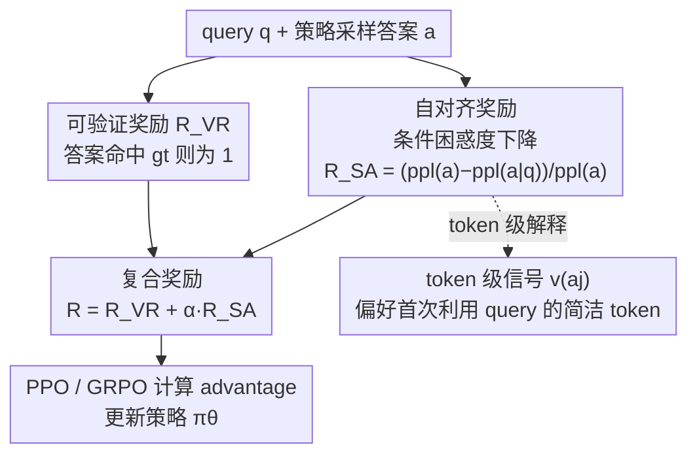

# Self-Aligned Reward: Towards Effective and Efficient Reasoners

**会议**: ICLR 2026  
**OpenReview**: [https://openreview.net/forum?id=89Pje8STvm](https://openreview.net/forum?id=89Pje8STvm)  
**代码**: https://github.com/amazon-science/Self-Aligned-Reward-Towards_Effective_and_Efficient_Reasoners  
**领域**: 对齐RLHF / LLM推理  
**关键词**: 强化学习、可验证奖励、困惑度、推理效率、自评判

## 一句话总结
针对可验证奖励"只看答案对错、纵容过度啰嗦"的粗粒度缺陷，本文提出**自对齐奖励 SAR**——用"答案在有 query 与无 query 两种条件下的相对困惑度差"作为模型自评判信号，叠加到 PPO/GRPO 的可验证奖励上，在 4 个模型、7 个基准上同时把准确率提升约 4%、把答案长度压缩约 30%。

## 研究背景与动机

**领域现状**：可验证奖励（RLVR）是当前训练数学/逻辑推理大模型的主流——把"最终答案是否命中 ground truth"映射成 0/1 奖励，用 PPO、GRPO 这类算法优化策略，已在 DeepSeek-R1、o1 等工作上证明有效。

**现有痛点**：可验证奖励本质上是**离散且粗粒度**的——它只判断最终答案对不对，无法分辨答案之间的细微优劣。一个为了对而堆了一大段冗余推理的解答，只要答案命中就拿满分；一个差一点点的"几乎正确"答案，和一个彻底错误的答案拿一样的零分。这直接诱发"过度思考（overthinking）"：模型生成大量没必要的铺陈，推高延迟与成本。

**核心矛盾**：已有的效率方案（长度惩罚、O1-pruner、Efficient Reasoner 等）都在"效率 vs 准确率"之间被迫二选一——它们只盯着输出长度做惩罚，结果**连必要的中间推理步骤也一起砍掉**，省了 token 却掉了精度。而换用外部奖励模型（RM）又容易被 reward hacking 钻空子。问题的根子在于：缺一个**内部生成、细粒度、且能区分"必要推理"与"冗余铺陈"**的奖励。

**本文目标**：设计一个无需外部监督、能无缝插进现有 RL 管线的内部奖励，让模型**同时**变得更准和更简洁，而不是在二者之间妥协。

**切入角度**：作者注意到困惑度（perplexity）是一个刻画"模型对某段文本有多确信"的细粒度信号。一个真正紧扣 query 的答案，在给定 query 时应该非常"顺理成章"（条件困惑度低）；但如果脱离 query 单独看，它又不太可能凭空冒出来（独立困惑度高）。这个"落差"恰好度量了答案对 query 的依赖度与对齐度。

**核心 idea**：用"答案的相对困惑度下降量"作为自对齐奖励 $R_{SA}$，奖励那些**高度依赖 query、简洁且信息密集**的回答，并把它和可验证奖励相加，弥补后者的粗粒度缺陷。

## 方法详解

### 整体框架

SAR 不改动 RL 算法本身，只是在每个 rollout 上**多算一项奖励**。整体流转是：给定 query $q$，策略 $\pi_\theta$ 采样出答案 $a$；对这条答案分别计算两个困惑度——脱离 query 的独立困惑度 $\mathrm{ppl}(a)$ 和给定 query 的条件困惑度 $\mathrm{ppl}(a|q)$；二者的**相对下降量**就是自对齐奖励 $R_{SA}$；再把它按权重 $\alpha$ 叠加到原本的 0/1 可验证奖励 $R_{VR}$ 上，得到复合奖励 $R = R_{VR} + \alpha R_{SA}$；这个复合奖励照常进入 PPO/GRPO 计算 advantage 并更新策略。整个过程不需要任何外部模型或人工标注，奖励完全由策略自身"自评判"得到。

### 关键设计

**1. 自对齐奖励：用条件困惑度下降量度量答案对 query 的依赖**

可验证奖励只会说"对/错"，分不出"简洁正确"和"啰嗦正确"。SAR 用一个连续信号补上这个细粒度：定义

$$R_{SA} = \mathrm{clip}\!\left(\frac{\mathrm{ppl}(a) - \mathrm{ppl}(a|q)}{\mathrm{ppl}(a)},\, -1,\, 1\right),$$

其中两个困惑度按 token 平均负对数似然取指数：$\mathrm{ppl}(a) = e^{-\frac{1}{|a|}\sum_j \log P(a_j|a_{1\ldots j-1})}$ 是答案脱离 query 单独看的困惑度，$\mathrm{ppl}(a|q) = e^{-\frac{1}{|a|}\sum_j \log P(a_j|q,a_{1\ldots j-1})}$ 是给定 query 后的条件困惑度。直观读法是："如果把 query 拿掉，这个答案会变得多不可能？"当答案紧扣 query 时，$\mathrm{ppl}(a|q)$ 会显著低于 $\mathrm{ppl}(a)$，落差大、$R_{SA}$ 高；当答案里塞了与 query 无关的噪声或冗长铺陈时，两个困惑度趋同、落差小、$R_{SA}$ 低。因此 $R_{SA}$ 越大，代表答案对 query 的依赖越强、对齐越好。关键是这个信号**只用策略自身的前向计算**得到，不依赖任何外部奖励模型，天然免疫 reward hacking。

**2. 复合奖励：可验证信号提供正确性骨架，自对齐信号提供精细度**

SAR 不是要替换可验证奖励，而是互补。最终奖励为 $R = R_{VR} + \alpha R_{SA}$，其中 $R_{VR}\in\{0,1\}$ 仍负责"答案对不对"这个硬约束，$\alpha$ 控制自对齐信号的权重（实验中 SA-GRPO 取 $\alpha=0.2$）。为什么两者缺一不可？消融实验给出了直接证据：只用 $R_{SA}$（去掉可验证奖励）时模型会"投机取巧"——收敛到 token 极少（平均仅 84 字）、准确率崩到 20.96% 的浅层推理，因为光追求困惑度落差会鼓励模型生成短而"自洽"但不去真正解题的答案；而光用可验证奖励又回到啰嗦老路。两者相加后，可验证奖励守住"必须答对"的底线、稳定训练，自对齐奖励在答对的前提下进一步筛掉冗余、奖励简洁。这也解释了 Table 1 里 SAR 是**唯一同时具备 correctness 与 conciseness 两栏的细粒度奖励**。

**3. token 级信号：揭示 SAR 为何偏好"简洁且利用 query"的回答**

为说明 SAR 不是简单的长度惩罚，作者把奖励拆到 token 级：注意到 $R_{SA} = 1 - \frac{\mathrm{ppl}(a|q)}{\mathrm{ppl}(a)} = 1 - e^{-\frac{1}{|a|}\sum_j \log\frac{P(a_j|q,a_{1\ldots j-1})}{P(a_j|a_{1\ldots j-1})}}$，于是每个 token 的贡献可由 $v(a_j) = \log\frac{P(a_j|q,a_{1\ldots j-1})}{P(a_j|a_{1\ldots j-1})}$ 衡量。$v(a_j)$ 高的 token 是"首次从 query 引入新信息"的 token（如题目里的人名"Janet"、数字"16"）——它们在 query 里有、在前文答案里没有，于是 $P(a_j|q,\cdot)$ 高而 $P(a_j|\cdot)$ 低；反之，重复已生成过的信息（第二次提"Janet"）两个概率都高、$v$ 接近零甚至为负。由于答案越往后越难再从 query 挖出新信息，靠后的 token 普遍 $v$ 偏低。这从机制上解释了 SAR 为何天然偏好**短、密、紧扣 query** 的回答：它奖励的是"有效利用查询信息"而非单纯压缩长度，因此能在砍冗余的同时**保留必要的推理行为**（这也是它和长度惩罚的本质区别）。

### 损失函数 / 训练策略

底层算法用 PPO 与 Dr.GRPO（GRPO 的无偏变体），目标函数沿用标准 clip + KL 形式，唯一改动是把奖励从 $R_{VR}$ 换成 $R_{VR}+\alpha R_{SA}$。计算开销几乎为零：$\mathrm{ppl}(a|q)$ 在 GRPO 里本就要算（用于 KL 惩罚和重要性采样），SAR 只多需要一次 $\mathrm{ppl}(a)$ 的前向传播；Update 阶段开销与原版 GRPO 持平，Rollout 阶段甚至因答案变短而更快（见训练成本表）。评测引入综合指标 **AES**：定义 $\Delta_{len}=\frac{\mathrm{len}(\pi_{ref})-\mathrm{len}(\pi_\theta)}{\mathrm{len}(\pi_{ref})}$、$\Delta_{acc}=\frac{\mathrm{acc}(\pi_\theta)-\mathrm{acc}(\pi_{ref})}{\mathrm{acc}(\pi_{ref})}$，则 $\mathrm{AES}=\Delta_{len}+\gamma\Delta_{acc}$，实验取 $\gamma=5$（准确率优先）。

## 实验关键数据

训练集合并 GSM8k、MATH、NuminaMath 1.5 的训练划分，GSM-symbolic 与 AIME 留作泛化测试；4 个底座模型 Qwen3-1.7B、Qwen3-4B、Phi-3.5-mini、Gemma3-1B。

### 主实验（数学推理，4 模型平均，节选自 Table 3）

| 模型 | 方法 | 平均 acc | 平均 len | AES |
|------|------|---------|---------|------|
| Qwen3-1.7B | GRPO | 53.37 | 762.8 | 1.509 |
| Qwen3-1.7B | GRPO-O1 | 52.64 | 572.2 | 1.652 |
| Qwen3-1.7B | **SA-GRPO** | **54.13** | 602.0 | **1.795** |
| Qwen3-4B | GRPO | 69.07 | 1030.6 | 1.165 |
| Qwen3-4B | **SA-GRPO** | **71.41** | 894.0 | 1.564 |
| Phi-3.5-mini | GRPO | 45.91 | 448.2 | 2.003 |
| Phi-3.5-mini | **SA-GRPO** | **46.19** | 368.4 | **2.137** |
| Gemma3-1B | GRPO | 31.78 | 1866.0 | 1.343 |
| Gemma3-1B | **SA-GRPO** | **32.24** | 1017.4 | **2.218** |

跨 4 个模型，SA-GRPO 一致拿到最高准确率，同时长度比 GRPO 至少压缩 30%、准确率至少提升 4%；更关键的是它产出的答案长度**已经与专为效率设计的 GRPO-O1/ER 相当甚至更短，却没有像它们那样掉精度**。SA-PPO 相对 PPO 同样成立，说明 SAR 不挑 RL 算法。

### 消融实验（Qwen3-4B，Table 5）

| 奖励配置 | 平均 acc | 平均 len | 说明 |
|---------|---------|---------|------|
| $R_{VR}$（纯可验证） | 69.07 | 1030.6 | 准但啰嗦 |
| $R_{EM}=-\log\mathrm{ppl}(a|q)$（熵最小化） | 55.46 | 1228.8 | 既不准也不短 |
| $R_{SA}$（纯自对齐） | 20.96 | 84.4 | 坍缩到浅层推理 |
| $R_{VR}+\alpha R_{EM}$ | 69.85 | 936.4 | 优于纯熵但不及 SAR |
| $R_{VR}+\alpha R_{SA}$（**SA-GRPO**） | **71.41** | **894.0** | 最优 |

### 关键发现
- **两个组件缺一不可**：去掉可验证奖励（纯 $R_{SA}$）会坍缩成 84 字、20.96% 的投机答案，说明 ground-truth 信号对发展真实推理能力和训练稳定性仍不可替代；去掉自对齐信号则回到啰嗦。
- **"条件困惑度下降" > "熵最小化"**：$R_{VR}+\alpha R_{EM}$ 在准确率和效率上都不及 SAR，因为熵最小化只盯 $\mathrm{ppl}(a|q)$ 单项，容易过度自信、熵坍缩、抑制探索；而 SAR 的相对落差是更准的答案质量度量。
- **泛化到域外**：在逻辑推理 LogicBench、ProntoQA 上，SA-GRPO 在所有对比中都优于长度惩罚方法，且对 GRPO 多数列也有提升，验证奖励设计的通用性。
- **保留推理行为**：用 GPT-4o 标注回溯/验证/子目标/枚举四类行为，长度惩罚方法（O1/ER）会明显减少这些行为，而 SA-GRPO 在 token 少 30% 的情况下行为频率几乎与 GRPO 持平——证明它砍的是冗余而非必要推理。
- **几乎零开销**：训练 Qwen3-4B 前 200 步，SA-GRPO 总 GPU 时 46.64h，与 GRPO 的 48.08h 相当甚至更低（Rollout 因答案变短而更快）。

## 亮点与洞察
- **用困惑度的"相对落差"而非"绝对值"做奖励**是最巧的一笔：绝对困惑度/熵最小化会鼓励过度自信坍缩，而相对落差度量的是"答案对 query 的增量依赖"，天然把"利用查询信息"和"凭空啰嗦"分开。
- **零额外训练成本**：$\mathrm{ppl}(a|q)$ 在 GRPO 里本就为 KL 和重要性采样算过，SAR 只多一次 $\mathrm{ppl}(a)$ 前向，这种"复用已有计算"的设计让它几乎可以白嫖接入任何 RLVR 管线。
- **content-aware 是它打败长度惩罚的根因**：长度惩罚是"一刀切"地按 token 数扣分，SAR 通过 token 级 $v(a_j)$ 区分"有效利用 query 的 token"和"重复冗余的 token"，所以能在缩短的同时不伤推理行为——这个"奖励信号要看内容而非看长度"的思路可迁移到代码、Agent 等其他需要控制冗长输出的 RL 任务。

## 局限与展望
- **依赖困惑度的可靠性**：SAR 把"答案质量"约化为"条件困惑度落差"，在数学/逻辑这类答案紧扣 query 的任务上成立，但对开放式生成、长程多跳任务，query 与答案的依赖关系更松散，相对落差是否还能准确反映质量值得验证。
- **$\alpha$ 需要调**：权重 $\alpha$ 控制准确率/效率偏好，不同模型最优值不同（论文按模型在 0.05~0.3 间扫），缺少自适应设定机制。
- **纯 $R_{SA}$ 的坍缩**暴露该信号单独使用会被钻空子，必须搭配可验证奖励，因此暂时局限于**有 ground truth 可验证**的领域，难直接用于无标准答案的对齐任务。
- 实验集中在 ≤4B 的小模型，更大模型上的增益幅度尚待观察。

## 相关工作与启发
- **vs 长度惩罚（O1-pruner / Efficient Reasoner）**：它们直接按答案长度扣分，效率上去了但牺牲准确率、还会压制必要推理行为；SAR 看的是"内容与 query 的对齐度"，因此能同时改善两个轴，在准确率-效率平面上达到 Pareto 最优。
- **vs 熵最小化 / 自信度方法（Agarwal et al. 2025 等）**：它们只优化 $\mathrm{ppl}(a|q)$ 单项，易过度自信、熵坍缩；SAR 用相对落差，避免这些问题且更准。
- **vs 外部奖励模型（RLHF 的 RM）**：RM 是连续且内容感知的，但需额外训练且易被 reward hacking；SAR 完全由策略内部自评判得到，无外部模型、无额外标注。

## 评分
- 新颖性: ⭐⭐⭐⭐⭐ 把"条件困惑度相对落差"作为内部奖励，是简洁却新的视角，且首次实现细粒度奖励下准确率与效率双升。
- 实验充分度: ⭐⭐⭐⭐⭐ 4 模型 × 7 基准 + 域外泛化 + 6 类答案信号分析 + token 级解释 + 行为统计 + 成本对比，证据链完整。
- 写作质量: ⭐⭐⭐⭐ 公式与机制解释清晰，case analysis 把"为什么有效"讲透；图表略密集。
- 价值: ⭐⭐⭐⭐⭐ 零开销即插即用、不挑算法、缓解 overthinking，对 RLVR 推理训练有很强的实用价值。

<!-- RELATED:START -->

## 相关论文

- [\[ICLR 2026\] Graph-Theoretic Intrinsic Reward: Guiding RL with Effective Resistance](graph-theoretic_intrinsic_reward_guiding_rl_with_effective_resistance.md)
- [\[AAAI 2026\] STELAR-Vision: Self-Topology-Aware Efficient Learning for Aligned Reasoning in Vision](../../AAAI2026/reinforcement_learning/stelar-vision_self-topology-aware_efficient_learning_for_aligned_reasoning_in_vi.md)
- [\[ICLR 2026\] MARS-Sep: Multimodal-Aligned Reinforced Sound Separation](mars-sep_multimodal-aligned_reinforced_sound_separation.md)
- [\[ICLR 2026\] Unsupervised Learning of Efficient Exploration: Pre-training Adaptive Policies via Self-Imposed Goals](unsupervised_learning_of_efficient_exploration_pre-training_adaptive_policies_vi.md)
- [\[ICLR 2026\] Self-Harmony: Learning to Harmonize Self-Supervision and Self-Play in Test-Time Reinforcement Learning](self-harmony_learning_to_harmonize_self-supervision_and_self-play_in_test-time_r.md)

<!-- RELATED:END -->
