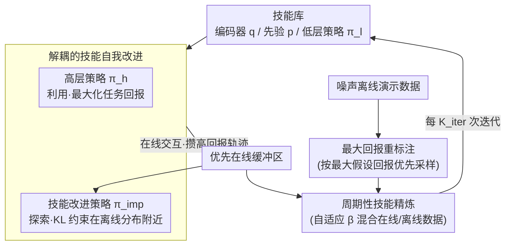

# Self-Improving Skill Learning for Robust Skill-based Meta-Reinforcement Learning

**会议**: ICLR 2026  
**arXiv**: [2502.03752](https://arxiv.org/abs/2502.03752)  
**代码**: [github.com/epsilog/SISL](https://github.com/epsilog/SISL)  
**领域**: 强化学习 / 元学习 / 技能学习  
**关键词**: meta-RL, skill learning, noisy demonstrations, self-improvement, maximum return relabeling

## 一句话总结

提出 SISL（Self-Improving Skill Learning），通过解耦高层策略和技能改进策略，结合最大回报重标注的技能优先级机制，在噪声离线演示数据下实现鲁棒的技能学习，显著提升基于技能的元强化学习在长时域任务中的性能。

## 研究背景与动机

**现状**: 基于技能的元RL方法（如SiMPL）将长状态-动作序列分解为可复用技能，通过分层决策在长时域任务中取得了成功。这些方法依赖离线演示数据学习低层技能库，再用高层策略在线选择技能。

**痛点**: 现有方法高度依赖高质量离线演示，但现实世界中的数据往往受硬件老化、环境扰动、传感器漂移等因素影响而带有噪声。当离线数据质量下降时，学到的技能库被污染，这种退化会传播到高层策略，最终损害适应性能。

**矛盾**: 现有方法对所有轨迹一视同仁（均匀采样），导致低质量样本主导技能学习。例如在 Kitchen 微波开门任务中，用噪声数据学到的技能甚至无法完成抓握。

**切入角度**: 设计一个自我改进机制——解耦高层利用策略和独立的技能改进策略，让改进策略在离线数据分布附近探索更优行为，同时通过回报重标注优先选择高价值轨迹。

## 方法详解

### 整体框架

SISL 把"用技能"和"改技能"拆成两条并行的线、交替推进。在线阶段，高层策略 $\pi_h$ 拿当前技能库去最大化任务回报，专门负责利用；独立的技能改进策略 $\pi_{\text{imp}}$ 则在离线数据分布附近做探索，把试出来的更优行为攒进优先在线缓冲区。离线一侧并不是一锅端地喂数据，而是先用"最大回报重标注"给每条噪声轨迹排个优先级、抑制低质量样本的话语权。每隔 $K_{\text{iter}}$ 次迭代，再把重标注后的离线数据和在线探索来的高回报数据按自适应权重混合，重新训练技能编码器 $q$、技能先验 $p$ 和低层策略 $\pi_l$，让技能库逐轮自我精炼，而不是被原始噪声数据一次性定死。

### 关键设计

**1. 解耦的技能自我改进：让"利用"和"探索"各司其职**

整体框架里在线那条线如果只交给一个高层策略既要刷高分又要去试新行为，两个目标会互相拖累——保守利用学不到更好的技能，激进探索又会牺牲当前回报。SISL 因此把它拆成两个策略：$\pi_h$ 只管用当前技能库最大化回报，单独引入的改进策略 $\pi_{\text{imp}}$ 才去探索更优行为。$\pi_{\text{imp}}$ 的训练目标把 RL 损失和一条 KL 约束拼在一起：$\sum_i \mathbb{E}_{\tau^i \sim \mathcal{B}_{\text{imp}}^i \cup \mathcal{B}_{\text{on}}^i} [\mathcal{L}_{\text{imp}}^{\text{RL}}(\pi_{\text{imp}})] + \lambda_{\text{imp}}^{\text{kld}} \mathbb{E}_{\tau^i \sim \mathcal{B}_{\text{on}}^i} \mathcal{D}_{\text{KL}}(\hat{\pi}_d^i \| \pi_{\text{imp}})$。前一项驱动它去发现更高回报的行为，后一项用 KL 把它拽在离线演示分布附近，避免脱离已有技能空间乱探索。探出来的高回报轨迹进入优先在线缓冲区 $\mathcal{B}_{\text{on}}^i$，一份信号自监督地反馈给 $\pi_{\text{imp}}$ 自己，另一份则作为干净样本喂给后续的技能精炼，形成"探索—精炼"的闭环。

**2. 最大回报重标注的技能优先级：抑制噪声样本的话语权**

技能精炼若直接对离线数据均匀采样，带噪轨迹会主导技能学习，根子在于训练阶段没有区分轨迹好坏的尺度。SISL 训练一个奖励模型 $\hat{R}(s_t, a_t, i)$，对每条离线轨迹算它在所有任务下的最大假设回报 $\hat{G}(\tilde{\tau}) = \max_i \{ \sum_t \gamma^t \hat{R}(s_t, a_t, i) \}$——即"这条轨迹放到最适合它的任务里能值多少分"。再按 $P_{\mathcal{B}_{\text{off}}}(\tilde{\tau}) = \text{Softmax}(\hat{G}(\tilde{\tau}) / T)$ 的分布采样，高价值轨迹被更频繁抽到、噪声轨迹被压低权重，温度 $T$ 控制这种偏好的锐利程度（实验里 Kitchen 用 1.0、Maze2D 用 0.5）。这样喂进技能精炼的离线样本本身已被清洗过一轮。

### 损失函数 / 训练策略

技能精炼的最终目标动态混合"被筛过的离线数据"和"自我探索来的在线数据"：$\mathcal{L}_{\text{skill}} = (1 - \beta) \mathbb{E}_{\tilde{\tau} \sim P_{\mathcal{B}_{\text{off}}}} [\mathcal{L}(\pi_l, q, p, z)] + \frac{\beta}{N_{\mathcal{T}}} \sum_i \mathbb{E}_{\tau^i \sim \mathcal{B}_{\text{on}}^i} [\mathcal{L}(\pi_l, q, p, z)]$。混合系数 $\beta$ 不是手调的固定值，而是按在线、离线两侧的平均回报自适应算出来 $\beta = \frac{\exp(\bar{G}_{\text{on}} / T)}{\exp(\bar{G}_{\text{on}} / T) + \exp(\bar{G}_{\text{off}} / T)}$：当自我探索的数据比原始离线数据更优时 $\beta$ 自动增大、更倚重在线样本，反之则保留离线数据的比重，相当于一条随训练进展自动调节的课程。

## 实验关键数据

### 主实验: 四个长时域环境的最终测试平均回报

| 环境 (噪声) | SAC | PEARL | SPiRL | SiMPL | **SISL** |
|------------|-----|-------|-------|-------|----------|
| Kitchen (Expert) | 0.01 | 0.23 | 3.11 | 3.40 | **3.97** |
| Kitchen (σ=0.2) | - | - | 2.06 | 2.18 | **3.73** |
| Kitchen (σ=0.3) | - | - | 0.83 | 0.81 | **3.48** |
| Office (Expert) | 0.00 | 0.01 | 0.65 | 2.50 | **2.86** |
| Office (σ=0.3) | - | - | 0.42 | 0.11 | **1.68** |
| Maze2D (Expert) | 0.20 | 0.10 | 0.77 | 0.80 | **0.87** |
| Maze2D (σ=1.5) | - | - | 0.81 | 0.68 | **0.99** |
| AntMaze (Expert) | 0.00 | 0.00 | 0.64 | 0.67 | **0.81** |

### 消融实验: 各组件贡献（Kitchen σ=0.3）

| 变体 | 最终回报 |
|------|---------|
| **SISL (完整)** | **3.48** |
| 无 $\mathcal{B}_{\text{off}}$ | 显著下降 |
| 无 $P_{\mathcal{B}_{\text{off}}}$（均匀采样） | 明显下降 |
| 无 $\mathcal{B}_{\text{on}}$ | 显著下降 |
| 无 $\pi_{\text{imp}}$ | 明显下降 |

### 关键发现

- SPiRL 和 SiMPL 在噪声增大时性能急剧下降，而 SISL 在所有噪声水平上保持鲁棒
- 在 Kitchen σ=0.3 时，SiMPL 回报仅 0.81，SISL 达到 3.48（提升4.3倍）
- 在 Maze2D σ=1.5 时，SISL 达到近乎完美的 0.99 成功率
- SISL 仅增加约16%的训练计算开销，元测试成本不变

## 亮点与洞察

1. **独到的问题发现**: 首次系统识别了技能库被噪声污染→高层策略退化的传播链条
2. **解耦设计**: 高层策略负责利用，改进策略负责探索，避免了两者冲突
3. **自适应混合系数**: $\beta$ 根据在线/离线数据质量动态调节，形成自动课程学习
4. **轻量级增强**: 仅增加16%额外计算，不改变元测试流程，易于集成到现有框架

## 局限与展望

- 元测试阶段仍需微调（0.5K迭代），零样本技能迁移是重要的改进方向
- 奖励模型依赖简单的子任务完成奖励，在复杂奖励函数场景中可能需要逐任务标准化
- 温度参数 $T$ 需要按环境调节（Kitchen用1.0，Maze2D用0.5），理想情况下应自适应
- 仅测试了四个模拟环境，真实机器人上的验证尚缺

## 相关工作与启发

- SPiRL/SiMPL 构成直接基线：SISL 在其框架上增加自改进机制是自然的扩展
- 与离线到在线RL的区别：后者假设奖励标注的离线数据用于预训练，而 SISL 只需无奖励离线数据进行技能学习
- 最大回报重标注的思路可推广到其他需要从低质量数据中学习的场景（如从人类演示学习）

## 评分

- **新颖性**: ⭐⭐⭐⭐ — 解耦改进策略和回报重标注的组合有效且新颖
- **实验充分度**: ⭐⭐⭐⭐ — 四个环境×多个噪声水平，消融充分
- **写作质量**: ⭐⭐⭐⭐ — 动机清晰，图示直观
- **价值**: ⭐⭐⭐⭐ — 解决了实际场景中数据质量不可控的关键问题

<!-- RELATED:START -->

## 相关论文

- [\[ICLR 2026\] Reference Grounded Skill Discovery](reference_grounded_skill_discovery.md)
- [\[ICLR 2026\] Skill Learning via Policy Diversity Yields Identifiable Representations for Reinforcement Learning](skill_learning_via_policy_diversity_yields_identifiable_representations_for_rein.md)
- [\[ICLR 2026\] Master Skill Learning with Policy-Grounded Synergy of LLM-based Reward Shaping and Exploring](master_skill_learning_with_policy-grounded_synergy_of_llm-based_reward_shaping_a.md)
- [\[ICLR 2026\] SUSD: Structured Unsupervised Skill Discovery through State Factorization](susd_structured_unsupervised_skill_discovery_through_state_factorization.md)
- [\[ICLR 2026\] Masked Skill Token Training for Hierarchical Off-Dynamics Transfer](masked_skill_token_training_for_hierarchical_off-dynamics_transfer.md)

<!-- RELATED:END -->
