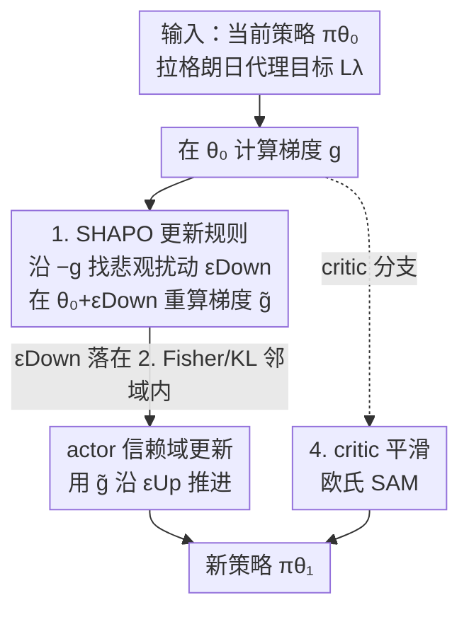

# SHAPO: Sharpness-Aware Policy Optimization for Safe Exploration

**会议**: ICLR 2026  
**OpenReview**: [https://openreview.net/forum?id=7cUxi8LbKD](https://openreview.net/forum?id=7cUxi8LbKD)  
**代码**: https://anonymous.4open.science/r/Safe-Policy-Optimization-813E (有)  
**领域**: 强化学习 / 安全强化学习  
**关键词**: 安全探索, 锐度感知优化, 认识不确定性, 策略优化, Fisher 信息

## 一句话总结
SHAPO 把锐度感知优化（SAM）搬到策略更新上：不在当前参数 $\theta_0$ 处取梯度，而是先在 Fisher/KL 几何下找到一个让目标"变差"的邻近参数 $\theta_0+\epsilon_{\text{Down}}$，再用那里的梯度去更新策略，从而对 actor 的认识不确定性保持悲观，在多个连续控制任务上同时改善安全性与回报、显著拓宽安全-效率 Pareto 前沿。

## 研究背景与动机
**领域现状**：把强化学习部署到安全攸关场景的前提是"安全探索"——智能体既要采集有信息量的经验，又要避免灾难性失败。这通常被建模成带约束的马尔可夫决策过程（CMDP），用拉格朗日目标 $J_\lambda(\pi_\theta)=J_r(\pi_\theta)-\lambda\big(J_c(\pi_\theta)-\beta\big)$ 在回报和代价之间做权衡，配合 TRPO/CPO/PIDLag 等 on-policy 算法做信赖域更新。

**现有痛点**：训练早期，智能体不可避免地走到自己"了解很少"的状态——也就是**认识不确定性（epistemic uncertainty）**很高的区域。这些地方策略和价值函数的估计都不可靠，一次探索就可能造成不可逆的危险。然而现有处理不确定性的工作几乎都集中在 **critic 一侧**（集成、dropout、分布式 critic + 风险度量），它们刻画的是回报的波动，却**没有给出一个可直接用于优化的、关于 actor 参数不确定性的概念**。给策略参数维护一个显式后验在深度 on-policy RL 里基本不可行，于是 actor 侧的风险规避一直缺位。

**核心矛盾**：安全探索取决于学习过程中"路过"的每一个策略，所以**更新规则本身**就该对不可靠的估计保持悲观；可是标准策略梯度在 $\theta_0$ 处取梯度，是一种"过度自信"的更新，完全没考虑 $\pi_0$ 周围的参数不确定性。

**本文目标**：设计一条 actor 侧的更新规则，让每一步梯度都对参数不确定性"打个折扣"，既压低累计训练代价，又抑制偶发的高代价尾部事件。

**切入角度**：作者注意到锐度感知优化（SAM/Fisher-SAM）的一个性质——**对参数扰动的敏感度（sharpness）正好可以当作认识不确定性的实用代理**：如果一点小扰动就能翻转策略行为，说明该处数据支撑不足、不确定性高。

**核心 idea**：用"最坏邻居处的梯度"代替"当前点的梯度"——先找一个分布上靠近 $\pi_0$、但让目标变差的扰动参数，再在那里取梯度来更新策略，实现"面对认识不确定性时的悲观"。

## 方法详解

### 整体框架
SHAPO 不是一个新算法，而是一个能嵌进几乎所有 on-policy 安全 RL 算法（TRPO-Lagrangian、CPO、PIDLag、CRPO、SauteRL）的**更新规则替换件**。标准做法是在当前参数 $\theta_0$ 处算拉格朗日代理目标 $L^\lambda_{\pi_0}$ 的梯度 $g=\nabla_\theta L^\lambda_{\pi_0}(\theta)|_{\theta_0}$，然后在信赖域约束下沿 $g$ 更新。SHAPO 在中间插一步：先在 **Fisher 信赖域** $\frac12\epsilon^\top F_{\theta_0}\epsilon\le\delta_{\text{Down}}$ 内，沿 $-g$ 方向找一个让目标**最恶化**的扰动 $\epsilon_{\text{Down}}=U_{F_{\theta_0}}(-g,\delta_{\text{Down}})$；再到这个"悲观邻居" $\theta_0+\epsilon_{\text{Down}}$ 处重新计算梯度 $\tilde g=\nabla_\theta L^\lambda_{\pi_0}(\theta)|_{\theta_0+\epsilon_{\text{Down}}}$；最后用 $\tilde g$（而非 $g$）做信赖域更新 $\epsilon_{\text{Up}}=U_{F_{\theta_0}}(\tilde g,\delta_{\text{Up}})$ 得到新策略。除此之外，critic 侧也加一层欧氏空间的 SAM 做平滑。整条流程如下：

### 关键设计

**1. SHAPO 更新规则：在"最坏邻居"处取梯度，而不是在当前点**

标准信赖域更新只看 $\theta_0$ 处的梯度 $g$，这相当于默认"我现在的估计是对的"，对训练早期数据稀疏区的过度自信毫无防备。SHAPO 把 SAM 的"最大化邻域内最坏目标" $\max_\pi \min_{\tilde\pi\in N(\pi)} J_\lambda(\tilde\pi)$ 引入策略优化：先解内层最小化 $\min_{\tilde\pi\in N(\pi_0)} L^\lambda_{\pi_0}(\tilde\pi)$ 找到一个比 $\pi_0$ 更差、但仍在邻域里的策略 $\tilde\pi=\pi_{\theta_0+\epsilon_{\text{Down}}}$，再用它那里的梯度来更新 $\theta_0$。整个过程就是 Algorithm 1 的三行：算 $g$ → 算扰动 $\epsilon_{\text{Down}}=U_F(-g,\delta_{\text{Down}})$ → 在 $\theta_0+\epsilon_{\text{Down}}$ 处重算 $\tilde g$。注意扰动方向是 $-g$（朝目标变差走），这与 actor 想最大化目标的方向相反，正是"悲观"二字的来源。因为它只替换梯度方向、不动 baseline 的其它超参，所以能即插即用地套在任意 on-policy 安全 RL 算法上，提供一个与基线正交的改进。

**2. 在 Fisher/KL 几何而非欧氏空间定义扰动邻域**

扰动邻域 $N(\pi_0)$ 怎么选很关键。如果用欧氏邻域 $\|\theta-\theta_0\|_2$ 小，并不能保证策略在 $D^{\max}_{\text{KL}}$ 意义下接近 $\pi_0$——参数空间里走一小步，分布上可能已经面目全非，于是 $L^\lambda_{\pi_0}(\theta)<0$ 并不能保证 $J_\lambda(\pi_\theta)<J_\lambda(\pi_0)$，代理目标的有效性（Theorem 1）也就失效了。SHAPO 改用**分布几何**：把内层最小化写成带 KL 信赖域的约束问题 $\min_{\tilde\pi} L^\lambda_{\pi_0}(\tilde\pi)\ \text{s.t.}\ D^{\max}_{\text{KL}}(\pi_0,\tilde\pi)\le\delta_{\text{Down}}$，二阶近似后 KL 约束变成 Fisher 度量 $\frac12\epsilon^\top F_{\theta_0}\epsilon\le\delta_{\text{Down}}$，扰动 $\epsilon_{\text{Down}}=U_{F_{\theta_0}}(-g,\delta_{\text{Down}})$ 就沿着统计流形的局部几何走。这样扰动既反映了 on-policy 数据的真实曲率，又借 Theorem 1 保证了"目标变差"确实对应"策略变差"。消融显示 Fisher 扰动（SHAPO）一致优于欧氏扰动（E-SAM）。

**3. 把扰动诠释为认识不确定性下的悲观估计**

为什么"向目标变差的方向扰动"是合理的？作者给了一个贝叶斯解释。借 Bernstein–von Mises 定理，把对当前参数的不确定性建模为 $Q(\theta)=\mathcal N(\theta_0,\tfrac1n F^{-1})$（$n$ 是有效独立样本数）。参数不确定性随之传导到回报上：在一阶近似下，回报偏差 $Y=L^\lambda_{\pi_0}(\theta)$ 服从 $\mathcal N(0,\sigma^2)$，$\sigma^2=\tfrac1n g^\top F^{-1}g$。均值 $L^\lambda_{\pi_0}(\theta_0)=0$ 只是"乐观估计"，而落在低分位（如 5%）的参数才反映"可信但糟糕的情形"。Proposition 2 证明：在约束 $\delta_{\text{Down}}=\tfrac{z_\alpha^2}{2n}$ 下，SHAPO 的 $\epsilon_{\text{Down}}$ 恰好等于"在 $Q(\theta)$ 下最可能、且落在 $\alpha$ 分位尾部"的那个参数。于是更新 $\theta_0$ 时优先改善的是一个**对参数不确定性悲观的回报估计**，$\delta_{\text{Down}}$ 也就成了"对当前回报的置信度/悲观程度"旋钮。1D 高斯策略的解析分析（Proposition 3）进一步给出直观图景：相比标准梯度 $g=aA$，SHAPO 梯度 $\tilde g=A\Delta\exp(\tfrac{a^2-\Delta^2}{2})$ 对**罕见的不安全动作**（$Aa<0$）放大、对**罕见的安全动作**缩小——也就是把灾难性少见事件"看得很重"，正合安全探索的胃口。

**4. actor 用 Fisher-SAM 做悲观、critic 用欧氏 SAM 做平滑的分工**

SHAPO 对 actor 和 critic 用了不同口味的 SAM。actor 侧用上面的 Fisher 几何悲观扰动，因为只有它能把"风险规避"真正注入策略更新。critic 侧则沿用 Foret 等人的欧氏 SAM，目标是让价值函数落在更平坦、更稳定的区域。作者强调这两者作用不对称：消融里只给 critic 加 SAM（SAM Critic）并不能促进安全探索，甚至可能增加代价——因为平方误差扰动对低估和高估是对称处理的，不带方向性的风险规避；而只给 actor 加 SHAPO（SHAPO Actor）就能明显改善安全。两者合用（SHAPO Actor + SAM Critic）在安全和效率上都拿到最强收益。

### 损失函数 / 训练策略
核心目标仍是带拉格朗日乘子的 CMDP 代理目标 $L^\lambda_{\pi_0}$，SHAPO 只替换其梯度的求值点。关键超参是悲观强度 $\delta_{\text{Down}}$（及 critic 的 $\rho_{\text{critic}}$）：加 SHAPO 时基线超参全部冻结，只调这两个，使得安全-效率权衡由基线决定、SHAPO 提供正交改进。$\delta_{\text{Down}}$ 的调度有两种等价视角——固定 $\delta_{\text{Down}}$（随样本累积 $n_t$ 增大，等价于悲观程度 $\alpha_t=\Phi(-\sqrt{2n_t\delta_{\text{Down}}})$ 随训练递增），或固定悲观程度 $\alpha$ 再令 $\delta^t_{\text{Down}}=\tfrac{z_\alpha^2}{2n_t}$ 随训练递减；实验表明两种调度都稳定优于原始算法。由于 RL 中样本时间相关、有效样本数 $n$ 难估，实践上直接把固定 $\delta_{\text{Down}}$ 当可调超参最简单有效。

## 实验关键数据

### 主实验
环境为 Safety Gym（PointGoal1-v0、PointButton1-v0，代价阈值 $\beta=10$）与 MuJoCo（Ant-v4、Walker2d-v4，每次摔倒计一次约束违反）；基线涵盖 CPO、PIDLag、CRPO、SauteRL 四类 on-policy 安全 RL 算法，全部跑 5 个随机种子。主结果以**安全-效率 Pareto 散点**呈现（Safety Gym 看 Cost Rate vs Return，MuJoCo 看累计失败/Total Cost），论文正文未给数值大表，以下为定性归纳（⚠️ 具体数值以原文 Fig. 3/4/5 为准）。

| 任务 | 安全指标 | SHAPO 相对基线的效果 |
|------|----------|----------------------|
| PointGoal1-v0 | Cost Rate vs Return | 在四个基线上一致拓宽 Pareto 前沿；即使是最低 cost-rate 的 SauteRL，SHAPO 也能进一步降代价而不掉回报 |
| PointButton1-v0 | Cost Rate vs Return | 同时改善安全与效率 |
| Ant-v4 | 累计失败 / Total Cost | 减少累计失败，并压低 95th 分位的代价尾部 |
| Walker2d-v4 | 累计失败 / Total Cost | 减少累计失败，并压低 80th 分位的代价尾部（该任务更难，95th 分位仍接近 1） |

对 PIDLag 在不同初始乘子 $\lambda_{\text{init}}$ 下扫参（Fig. 4），SHAPO 在**每一个配置**都把回报-代价的 Pareto 前沿往外推，说明改进不依赖特定超参点。Fig. 5 显示 SHAPO 还系统性地压低 episodic cost 分布的重尾，这正是安全探索阶段最关心的"罕见但灾难"事件。

### 消融实验

| 配置 | 结论 | 说明 |
|------|------|------|
| Fisher 扰动（SHAPO）vs 欧氏（E-SAM） | SHAPO 一致更优 | Fisher 扰动贴合 on-policy 数据的局部几何，能真正保证内层目标"变差" |
| 只给 critic 加 SAM（SAM Critic） | 不促进安全、甚至增代价 | 平方误差扰动对低估/高估对称，无方向性风险规避 |
| 只给 actor 加 SHAPO（SHAPO Actor） | 明显改善安全 | actor 侧悲观才是安全探索的主因 |
| SHAPO Actor + SAM Critic（完整） | 安全与效率最强 | 两者互补 |
| 悲观调度：固定 $\delta_{\text{Down}}$ vs 固定 $\alpha$ | 两种都稳定胜过 vanilla | 对 $\delta^t_{\text{Down}}$ 的选择鲁棒 |

### 关键发现
- **actor 比 critic 更关键**：把锐度感知优化用在 actor 上对安全探索的影响远大于用在 critic 上——这是全文最重要的经验结论，也回应了"现有方法都堆在 critic 侧"的痛点。
- **Fisher 几何不可替代**：欧氏扰动（E-SAM）一致弱于 Fisher 扰动，印证了"必须在分布/KL 几何里做悲观才有效"。
- **尾部抑制是真本事**：SHAPO 不只降平均代价，更专门压住高分位的代价尾部，这正是安全探索区别于"只满足期望约束"的地方。

## 亮点与洞察
- **把 sharpness 当认识不确定性的代理**：用"对参数微扰的敏感度"近似"数据是否充分支撑"，绕开了在深度 on-policy RL 里维护参数后验这件几乎不可能的事，思路非常实用。
- **一个超参旋钮统一了优化与贝叶斯两套语言**：Proposition 2 把信赖域约束 $\delta_{\text{Down}}$ 直接对应到分位 $\alpha$，让"悲观程度"既是优化约束又是置信水平，解释力很强。
- **即插即用**：冻结基线超参、只调 $\delta_{\text{Down}}$ 就能套在 CPO/PIDLag/CRPO/SauteRL 上，这种"正交改进件"的定位很容易被社区采用。
- **可迁移**："在最坏邻居处取梯度"这一招不限于安全 RL，任何需要对认识不确定性悲观的策略优化（如离线 RL、鲁棒控制）都值得借鉴 Fisher-SAM 的悲观扰动方向。

## 局限与展望
- **有效样本数 $n$ 难估**：理论里 $\delta_{\text{Down}}=\tfrac{z_\alpha^2}{2n}$ 依赖独立样本数，但 RL 数据时间相关，$n$ 实际不可算，作者只能退而把 $\delta_{\text{Down}}$ 当固定超参，理论与实践之间留了一道缝。
- **悲观程度需要调参**：actor/critic 的扰动半径 $\delta_{\text{Down}}$、$\rho_{\text{critic}}$ 仍是任务相关的超参，文中也未给出自动选择的成熟方案。
- **解析分析是简化模型**：罕见动作加权的直觉来自 1D 高斯策略，是否在高维、深网络策略上严格成立仍是经验性的。
- **评测规模有限**：主实验是 4 个连续控制任务、5 个种子、以散点图呈现，缺少大规模数值表格，横向比较的统计显著性偏弱。

## 相关工作与启发
- **vs critic 侧不确定性方法（集成 / dropout / 分布式 critic）**：它们刻画回报波动、做风险敏感控制，但不暴露可优化的 actor 参数不确定性；SHAPO 把风险规避直接做进 actor 的更新规则，填补了这一空白。
- **vs SAM / Fisher-SAM（监督学习）**：原版 SAM 追求平坦极小以提升泛化；SHAPO 把它重新诠释为"面对认识不确定性的悲观"，并落到 Fisher/KL 几何下的策略更新。
- **vs Lee & Yoon (2025)（SAM+PPO）**：他们用 SAM 提升对环境随机性（aleatoric）的鲁棒性；SHAPO 关注的是 actor 的认识不确定性与安全探索，目标不同。
- **vs SauteRL / 状态增广类安全探索**：那类方法靠把剩余预算拼进状态来控约束（在 $\beta=0$ 的 MuJoCo 上不适用）；SHAPO 不改环境与状态，是纯更新规则层面的改进，可与它们叠加。

## 评分
- 新颖性: ⭐⭐⭐⭐⭐ 把锐度/Fisher-SAM 重诠释为 actor 侧认识不确定性的悲观，并给出严格的贝叶斯-优化对应，角度新。
- 实验充分度: ⭐⭐⭐⭐ 覆盖 4 任务 × 5 基线 × 5 种子且消融到位，但以散点图为主、缺数值大表，统计力偏弱。
- 写作质量: ⭐⭐⭐⭐ 理论推导清晰、动机层层递进，但主结果靠看图，定量信息不够直接。
- 价值: ⭐⭐⭐⭐⭐ 即插即用、与多种安全 RL 基线正交，且专门抑制代价尾部，对安全攸关部署很实用。

<!-- RELATED:START -->

## 相关论文

- [\[ICLR 2026\] Safe Exploration via Policy Priors](safe_exploration_via_policy_priors.md)
- [\[ICLR 2026\] Off-Policy Safe Reinforcement Learning with Constrained Optimistic Exploration](off-policy_safe_reinforcement_learning_with_cost-constrained_optimistic_explorat.md)
- [\[ICLR 2026\] Primal-Dual Policy Optimization for Linear CMDPs with Adversarial Losses](primal-dual_policy_optimization_for_linear_cmdps_with_adversarial_losses.md)
- [\[ICLR 2026\] Deep SPI: Safe Policy Improvement via World Models](deep_spi_safe_policy_improvement_via_world_models.md)
- [\[ICLR 2026\] GRACE: Generative Representation Learning via Contrastive Policy Optimization](grace_generative_representation_learning_via_contrastive_policy_optimization.md)

<!-- RELATED:END -->
