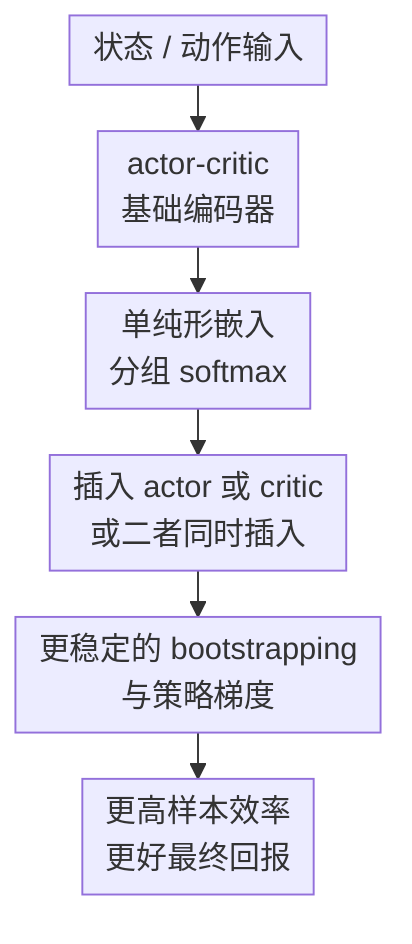

# Simplicial Embeddings Improve Sample Efficiency in Actor-Critic Agents

**会议**: ICLR2026  
**OpenReview**: [https://openreview.net/forum?id=mCpq1GCKxA](https://openreview.net/forum?id=mCpq1GCKxA)  
**代码**: 待确认  
**领域**: 强化学习 / actor-critic / 样本效率  
**关键词**: 单纯形嵌入, actor-critic, 样本效率, 表征坍塌, FastTD3

## 一句话总结
这篇论文把 Simplicial Embeddings (SEM) 作为一个轻量的表征几何约束插入 actor-critic 网络，让 actor 和 critic 的隐藏特征落在多个 simplex 的乘积空间中，从而缓解非平稳 bootstrapping 带来的表征坍塌，并在 FastTD3、FastSAC、PPO 以及多类机器人和 Atari 环境上提升样本效率。

## 研究背景与动机
**领域现状**：近年的深度强化学习一边追求更快的 wall-clock 训练，一边仍然受限于环境交互数量。FastTD3、FastSAC、并行 PPO 这类方法通过大量并行环境、大 batch 和更工程化的 critic 设计，让机器人控制任务可以在真实时间上跑得更快。

**现有痛点**：这种“跑得快”并不等于“用样本少”。在机器人、离线到在线微调、真实系统调参等场景里，环境交互仍然昂贵；即使模拟器能快速生成数据，低样本效率也会带来更高能耗、更差复现性和更长的实验迭代周期。论文特别指出，FastTD3 这类高吞吐 actor-critic 仍可能需要大量交互才能达到同等性能。

**核心矛盾**：actor-critic 的训练目标天然非平稳。critic 的目标值来自 $y_t(s,a)=r(s,a)+\gamma Q_{\phi^-}(s',\pi_\theta(s'))$，而 replay buffer 中的数据分布和 actor 产生的下一个动作都会随着训练变化。critic 在追逐移动目标，actor 又依赖 critic 给出的梯度更新策略，二者耦合后容易放大表示漂移、神经元休眠和有效秩下降。

**本文目标**：作者想回答一个很具体的问题：能不能不改 RL 损失、不引入复杂辅助任务，只在网络表示层加入一个简单归纳偏置，就让 actor-critic 在同样交互预算下学得更快、更稳？

**切入角度**：论文把问题从“调哪个 RL trick”转到“隐藏表征的几何形状是否稳定”。已有 SEM 工作表明，把特征限制在 simplex 乘积空间中可以提升泛化和稳定性；本文把这个几何约束搬到深度 RL 的 actor 和 critic 网络里，观察它能否抵抗 bootstrapped target 的非平稳性。

**核心 idea**：用组内 softmax 把隐藏特征投到多个 simplex 上，让特征有界、稀疏且分组竞争，从而在 actor-critic 的移动目标训练中保持表征多样性和有效秩。

## 方法详解

### 整体框架
本文的方法不是一个新的 RL 算法，而是一个可以插入现有 actor-critic 网络的表征层。给定 FastTD3、FastSAC 或 PPO 的 actor/critic MLP，作者在靠近输出的隐藏层加入 SEM module：先把隐藏向量切成 $L$ 个大小为 $V$ 的组，再对每组做 softmax，使每组成为一个概率 simplex 上的点。这样 actor 的策略输出和 critic 的价值估计都建立在有界、稀疏、分组化的特征上。

在 FastTD3 的主实验里，SEM 有三种插入方式：只加 actor、只加 critic、actor 和 critic 都加。critic 侧把原本接近输出的线性 head 替换成带结构的投影，用于正则化 distributional C51 critic 的 value 表示；actor 侧把 SEM 放在 penultimate layer 和最终 linear+tanh 之间，让策略动作由有界稀疏特征决定。论文多数后续实验采用 actor 侧 SEM，因为它带来的早期学习加速和跨算法泛化最稳定。

### 关键设计
**1. 单纯形嵌入：用分组 softmax 把隐藏特征变成有界稀疏表示**

普通 MLP 隐藏层在非平稳 RL 中容易出现两个问题：某些方向的激活不断放大，另一些神经元长期接近零，最后协方差矩阵变得病态，TD 更新和 policy gradient 都会被噪声放大。SEM 的做法很直接：假设编码器输出可看作 $z\in\mathbb{R}^{L\times V}$，把它按组切开，并在每组内计算

$$
	ilde z_{\ell,v}=\frac{\exp(z_{\ell,v}/\tau)}{\sum_{v'=1}^{V}\exp(z_{\ell,v'}/\tau)}.
$$

每个组输出都是一个 $V$ 维概率分布，因此整体表示位于 $\Delta^{V-1}\times\cdots\times\Delta^{V-1}$。这带来三个直接效果：每组质量和为 1，特征范数不会无限漂移；组内 softmax 形成竞争，低温度时更接近稀疏 one-hot；多个组并行提供容量，避免单个离散瓶颈过窄。它像 activation function 一样工作，不需要 reconstruction loss、contrastive loss 或额外训练阶段。

**2. actor/critic 插入位置：把几何约束放在最影响策略梯度的瓶颈处**

论文没有把 SEM 随便塞到网络任意位置，而是围绕 penultimate representation 做文章。这个位置一边承接状态/动作编码，一边直接决定 critic 的 Q 分布或 actor 的最终动作，因此它的几何质量会被 bootstrapped target 和 policy update 同时放大。critic 侧 SEM 让 value estimate 的输入表示更有界，减少两个 critic 分支之间的 disagreement；actor 侧 SEM 让策略在生成动作前先经过稀疏、分组化的特征选择，降低策略映射中的噪声。

实验也反映了这种位置选择的重要性。只加 critic 有收益但更温和；只加 actor 或 actor+critic 在 HumanoidBench 上更明显地加速早期学习。一个直观解释是：critic 的非平稳目标会影响价值估计，而 actor 端的 SEM 直接过滤要传给动作 head 的表示，因而对策略梯度路径更敏感。

**3. 用非平稳性解释样本效率：不是多一个正则项，而是防止表征坍塌**

论文先用 CIFAR-10 的 toy experiment 做铺垫：固定标签时训练稳定；周期性打乱标签来模拟 RL 中移动目标时，loss 波动、dormant neuron 增加、effective rank 下降；加入 SEM 后这些指标缓和。这个实验的作用不是证明 CIFAR-10 本身重要，而是把 RL 中的难题拆成一个更可控的机制：目标分布非平稳会破坏表示结构。

在 actor-critic 中，这个机制更严重。critic 训练的目标 $y_t$ 随 actor 变化，replay buffer 的数据分布 $D_t$ 也随策略变化，因此当前最优参数 $\theta_t^*$ 一直在移动。SEM 通过每组 simplex 的“质量守恒”让特征不容易整体消失，通过组间多样性保持更高 effective rank。论文后续用 actor/critic effective rank、hidden feature norm、TD error、Q-gap 等诊断指标把性能提升和表征稳定性联系起来，而不是只报告 return 曲线。

**4. 容量由 $L\times V$ 控制：稀疏性和表达力需要轻量调节**

SEM 的两个核心超参是 simplex 组数 $L$ 和每组维度 $V$。$L$ 决定有多少个独立的 simplex 组，$V$ 决定每个组内部可竞争的类别数，整体表示容量近似随 $L\times V$ 增加。论文在 5 个 HumanoidBench 任务上观察到：低容量时，增大 $L$ 或 $V$ 会明显提高回报；容量足够大后收益趋于饱和，有时较小的 $V$ 反而略好。

这个结论让 SEM 更像一个可控的架构偏置，而不是越大越好的模块。主实验中 $V=64$ 在多个插入方式下较稳定；但附录和参数分析说明，真实使用时应把 $L,V,\tau$ 看成控制“稀疏程度-容量-稳定性”的旋钮，尤其在任务稀疏奖励或分布转移更极端时，需要轻量搜索。

### 一个完整示例
以 FastTD3 训练 humanoid walk 任务为例，baseline 的流程是：并行环境产生 transition，replay buffer 采样大 batch，critic 用 bootstrapped target 更新，actor 根据 critic 梯度更新动作策略。问题在于，随着 actor 改变，critic 的 target 和数据分布也改变，隐藏层可能逐步丢失有效方向，表现为 effective rank 下降、部分 neuron 休眠、两个 critic 的 Q-gap 变大。

加入 SEM 后，actor 的 penultimate feature 先被切成例如 $L$ 个组，每组 $V=64$ 维。每组 softmax 输出一个概率向量，再送入最终 linear+tanh 产生动作。训练早期，当策略还在探索、critic target 变化剧烈时，SEM 迫使每个组至少保留单位质量，并通过组内竞争让特征更尖锐。结果是 actor 更快地产生稳定动作模式，critic 接收到的策略分布变化也更平滑，论文在 h1hand-walk 和 h1hand-stand 等任务上观察到更早达到高回报，同时 actor/critic effective rank 更高。

### 损失函数 / 训练策略
本文不改 actor-critic 的基本损失。FastTD3 仍按其原始设置使用并行 simulation、大 batch、distributional critic、delayed actor update 等设计；SEM 只改变 actor 或 critic 的中间表征。PPO 实验也沿用 CleanRL 实现，只在网络表示层加入 SEM。

训练诊断上，论文重点跟踪两类指标。第一类是性能指标，如 average normalized return、episode return、human-normalized score；第二类是表征和优化指标，如 effective rank、特征范数、actor loss、critic loss、mean TD error、两个 critic 的 $|Q_1-Q_2|$。作者用这些指标证明 SEM 的收益来自更稳定的表示几何，而不只是某个 benchmark 上的偶然提分。

## 实验关键数据

### 主实验
论文的主结果以学习曲线为主，很多数值没有用单表精确列出。下面按论文图表报告的设置和结论归纳，避免把曲线读数伪装成精确分数。

| 实验设置 | 指标 | baseline | SEM 配置 | 主要结论 |
|--------|------|----------|----------|----------|
| 5 个 HumanoidBench 任务，6 seeds | average normalized return | FastTD3 | actor / critic / actor+critic，多个 $V$ | actor 或 actor+critic 的 SEM 明显加速早期学习并提高最终表现，critic-only 收益较温和；$V=64$ 最稳定 |
| h1hand-walk、h1hand-stand | episode return + effective rank + feature norm | FastTD3 | + SEM actor | SEM 更早达到高回报，同时提高 actor/critic effective rank，并保持 actor feature 更紧凑 |
| HumanoidBench 三个 fast actor-critic baseline | average normalized return | FastTD3、FastTD3-SimBaV2、FastSAC | + SEM actor | 三个算法上都提升样本效率和最终回报，说明收益不局限于 TD3-style critic |
| PPO on ALE 28 games / Isaac Gym | human-normalized score / normalized score | PPO | + SEM actor | 在像素 Atari 和连续控制 PPO 中都加速收敛并提高最终表现，说明 SEM 可迁移到 on-policy 设置 |
| Booster T1 humanoid robot | episode return | FastTD3 | + SEM actor / actor+critic | SEM 加快真实机器人相关 benchmark 的学习，actor+critic 也有收益 |

### 消融实验
| 配置 | 关键指标 | 说明 |
|------|---------|------|
| SEM vs CReLU / Gumbel+ST / Vector Quantization | 5 个 HumanoidBench 的 aggregated average return | SEM 优于这些替代表征结构；作者认为一个原因是 SEM 不需要 straight-through estimator，优化更平滑 |
| 固定 $V$ 改变 $L$ | average return | 当 $L\times V$ 低时，增大 $L$ 明显提升性能；容量足够后收益饱和 |
| 固定 $L$ 改变 $V$ | average return | 小 $L$ 下增大 $V$ 有帮助；大 $L$ 下不同 $V$ 差异变小，有时 $V=4$ 也能接近或略好 |
| actor-only / critic-only / actor+critic | sample efficiency + asymptotic return | actor-only 和 actor+critic 提升更强，critic-only 仍有帮助但幅度较小 |
| 减少环境数、replay buffer、batch size，或移除 CDQ / C51 | average return | SEM 在更少数据和简化 FastTD3 设计下仍提升表现，说明它补的是表示几何而不是某个特定 trick |
| MoE / pruning 等附录替代设计 | learning curve / final return | 一些结构能改变容量或稀疏性，但没有稳定接近 SEM 的样本效率和最终表现 |

### 关键发现
- SEM 的收益最稳定地出现在 actor 端，说明策略输出前的表示瓶颈对样本效率非常关键；critic 端有帮助，但单独加 critic 不如 actor 端明显。
- 表征诊断和 return 曲线方向一致：SEM 提高 effective rank、降低 dormant neuron 风险，并让 actor 特征更紧凑，支持“几何稳定性带来样本效率”的解释。
- SEM 对 FastTD3 的工程设计具有互补性。即便减少并行环境、缩小 replay buffer 或取消 CDQ/C51，SEM 仍有增益，说明它不是依赖 FastTD3 某个细节才有效。
- 跨算法结果很重要：FastTD3、FastSAC、PPO、Atari、Isaac Gym、MTBench、offline-to-online OGBench 都出现正向信号；但 value-based PQN 的结果不稳定，说明 SEM 还不是所有 RL 范式的通用答案。

## 亮点与洞察
- 把样本效率问题解释为表征几何问题，是本文最有启发的地方。很多 RL 论文会继续堆 replay ratio、target network、regularizer 或并行环境；本文反而把一个很小的 activation-like module 放到关键瓶颈上，直接约束隐藏空间。
- SEM 的工程成本低。它不改奖励、不改 Bellman target、不加辅助 loss，也不需要额外数据；对已有 actor-critic 代码来说，主要是把某层输出 reshape 成 $L\times V$ 后做 group-wise softmax。
- 非平稳 CIFAR-10 实验虽然简单，但解释力不错。它把 RL 里难观察的 moving target 抽象成周期性标签扰动，再用 dormant neuron 和 effective rank 展示 SEM 如何缓解坍塌，给后面的 RL 结果提供了机制铺垫。
- 这篇论文的可迁移点在于“先稳定表示，再追求更高 replay 或更大并行”。对于离线到在线 RL、机器人多任务、甚至 model-based RL 的 latent policy，都可以尝试在策略或价值网络的输出前加入类似 simplex / sparse probability bottleneck。

## 局限与展望
- SEM 不是万能稳定器。作者明确提到，在极端分布转移或非常稀疏奖励任务中，feature collapse 和 critic drift 仍可能发生，单纯约束表示几何未必足够。
- $L,V,\tau$ 需要调节。论文为了公平和计算效率多数沿用 baseline 超参，但 RL 对架构和优化超参很敏感；不同任务上最好有专门搜索或自适应 schedule。
- 评估虽然覆盖面很广，但重点仍在连续控制、humanoid、Atari 和若干机器人 benchmark。对语言条件 RL、大规模视觉导航、长时序 agent、模型学习中的 latent dynamics，SEM 是否同样有效还没有验证。
- value-based RL 的结果较弱。PQN 上只在少数游戏改善，整体不稳定，说明 SEM 和 DQN-style 表征、target 更新、探索机制之间的交互还需要重新设计。
- 论文主要报告曲线和聚合趋势，缺少更易复核的统一数值表。对于想复现的人，仍需要依赖附录曲线、代码和超参表来判断提升幅度。

## 相关工作与启发
- **vs FastTD3**: FastTD3 主要靠并行环境、大 batch、distributional critic 等设计提高 wall-clock 效率；本文不替代这些设计，而是在其 actor/critic 表征层加入 SEM，补上“高吞吐但样本仍多”的短板。
- **vs TD7 / 表征型 RL 方法**: TD7 等方法也强调 representation learning 对样本效率的重要性，但往往改动算法结构更深；SEM 更像一个轻量模块，可挂到不同 actor-critic baseline 上。
- **vs CReLU / Gumbel+ST / Vector Quantization**: 这些方法也能给表征施加结构或离散性，但 Gumbel/VQ 常涉及 straight-through 或量化优化问题；SEM 用连续 group-wise softmax 实现稀疏竞争，优化路径更平滑。
- **vs MoE / sparse architecture**: SEM 和 MoE 都有“分组竞争/选择性激活”的味道，但 SEM 不引入路由器和专家网络，只约束隐藏向量本身，因此开销和实现复杂度更低。
- **启发**: 对强化学习来说，样本效率不只来自更激进的数据复用，也来自让网络在非平稳目标下不丢失有效表示方向。后续可以把 simplex bottleneck 和 adaptive temperature、uncertainty-aware critic、offline-to-online representation reset 结合起来。

## 评分
- 新颖性: ⭐⭐⭐⭐☆ 把已有 simplicial embedding 迁移到 actor-critic RL 不算从零发明，但问题切入准确，和非平稳表征坍塌的连接很有价值。
- 实验充分度: ⭐⭐⭐⭐☆ 覆盖 FastTD3、FastSAC、PPO、HumanoidBench、Atari、Isaac Gym、MTBench、OGBench 等多场景，消融也扎实；不足是曲线多、统一数值表少。
- 写作质量: ⭐⭐⭐⭐☆ 论文从机制、toy experiment、主实验到跨算法验证的叙事顺畅，附录信息丰富；部分实验结果需要读曲线，快速复核不够方便。
- 价值: ⭐⭐⭐⭐⭐ 对做 actor-critic、机器人控制和样本效率的人很实用，因为它提供了一个低侵入、低成本、可直接试的表示层改造。

<!-- RELATED:START -->

## 相关论文

- [\[ICML 2025\] Actor-Critics Can Achieve Optimal Sample Efficiency](../../ICML2025/reinforcement_learning/actor-critics_can_achieve_optimal_sample_efficiency.md)
- [\[ICLR 2026\] Convergence of an actor-critic gradient flow for entropy regularised MDPs in general spaces](convergence_of_an_actor-critic_gradient_flow_for_entropy_regularised_mdps_in_gen.md)
- [\[ICLR 2026\] Flow Actor-Critic for Offline Reinforcement Learning (FAC)](flow_actor-critic_for_offline_reinforcement_learning.md)
- [\[ICLR 2026\] Neural+Symbolic Approaches for Interpretable Actor-Critic Reinforcement Learning](neuralsymbolic_approaches_for_interpretable_actor-critic_reinforcement_learning.md)
- [\[ICLR 2026\] Chunking the Critic: A Transformer-based Soft Actor-Critic with N-Step Returns](chunking_the_critic_a_transformer-based_soft_actor-critic_with_n-step_returns.md)

<!-- RELATED:END -->
