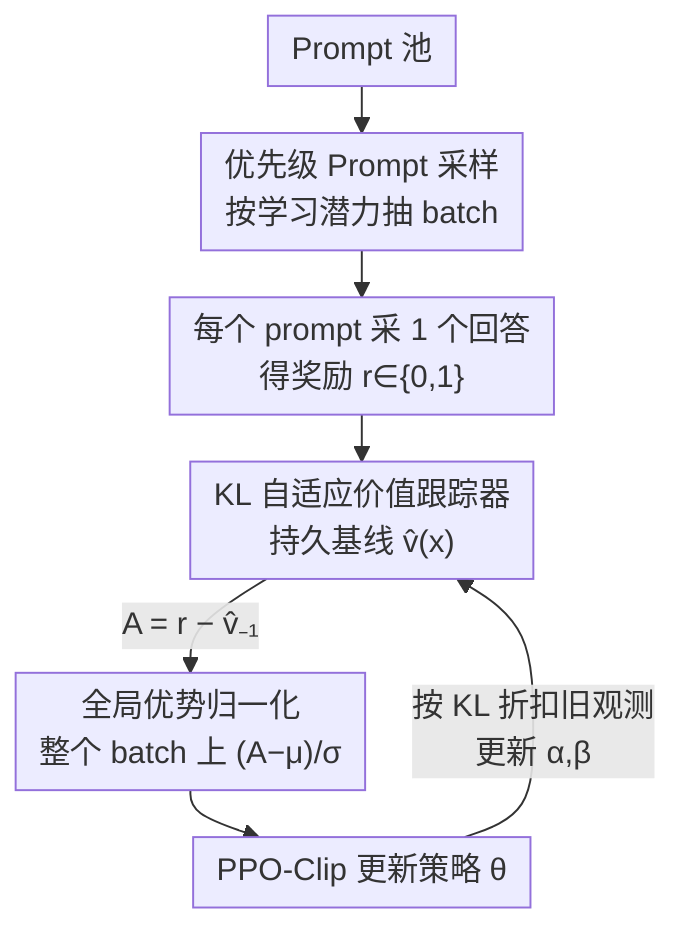

# Single-stream Policy Optimization

**会议**: ICLR 2026  
**OpenReview**: [https://openreview.net/forum?id=b61UW62K7W](https://openreview.net/forum?id=b61UW62K7W)  
**代码**: https://github.com/verl-project/verl-recipe/tree/main/spo  
**领域**: 强化学习 / LLM 推理 / 策略优化  
**关键词**: 策略梯度, GRPO, 基线估计, 贝叶斯价值跟踪, RLVR

## 一句话总结
SPO（Single-stream Policy Optimization）把 GRPO 那套"每个 prompt 采一组、组内算相对优势"的做法彻底丢掉，回归经典单流策略梯度：用一个轻量的 KL 自适应贝叶斯价值跟踪器给每个 prompt 维护一个持久化的成功率基线、在整个 batch 上做全局优势归一化，并顺手用这个基线做优先级采样的自适应课程；在 Qwen3-8B 上五个数学竞赛 benchmark 的 maj@32 平均比 GRPO 高 +3.4 pp，同时因为"无组"设计在变长的 agentic 场景里拿到 4.35× 吞吐加速。

## 研究背景与动机

**领域现状**：RLVR（可验证奖励强化学习）是当前提升 LLM 推理能力的主流范式，而 GRPO 又是 RLVR 里最流行的算法。GRPO 的核心招数是"组相对"：对每个 prompt 一次性采 $G$ 个回答，用这一组奖励的均值当 on-the-fly 基线、组内归一化得到相对优势，从而省掉 PPO 那个又大又难训的 critic 网络。

**现有痛点**：组相对范式有两个结构性缺陷。其一是**退化组（degenerate group）**——当一组里的回答全对或全错时，组内奖励方差为零，相对优势整组塌缩成 0，这一批 rollout 算出来没有任何梯度信号，纯属浪费算力和数据。为了补救，DAPO 之类只能加"动态采样"（一直采到出现非零优势为止）这种工程 heuristic，越加越复杂。其二是**同步壁垒**——分布式训练里一个 prompt 的组必须等组里最慢那个回答生成完才能算优势，在多轮工具调用、长程 agent 这类生成时间高度不均的场景里，一条慢轨迹就能拖死整个组。

**核心矛盾**：这两个问题的根都在"组"这个架构选择上：基线来自**并发生成的同批回答**而非历史持久估计，所以既要花 $G$ 倍生成、又被组内最慢成员绑定。后续一系列改进（RLOO、OPO、GRESO、Lite PPO）都没跳出这个框架。

**本文目标**：回到"单流"——每个训练样本就是一个独立的 (prompt, response) 对，但要解决单流策略梯度天然的**高方差**难题（没有了组内基线，REINFORCE 的原始奖励方差很大）。

**切入角度**：作者的观察是，最优基线本就是真值函数 $V_\pi(x)=\mathbb{E}_{y\sim\pi}[R(x,y)]$，它只依赖 prompt 不依赖当前动作。与其用一组并发样本去近似它，不如用一个**跨迭代持久、随策略变化自适应衰减**的跟踪器在线估计它——这样每个样本都能拿到低方差基线，且彻底摆脱组。

**核心 idea**：用一个 KL 自适应的贝叶斯价值跟踪器替代组内基线 + batch 级全局优势归一化 + 基于该跟踪器的优先级采样，三件套合成无组、低方差、可扩展的单流策略优化。

## 方法详解

### 整体框架

SPO 处理的是二元可验证奖励（成功 +1 / 失败 0）下的策略优化，要解决的核心是"如何为一个不断进化的策略，低方差地估计每个 prompt 的非平稳成功率"。整条流水线是：每轮先用价值跟踪器给所有 prompt 算一个采样权重（偏向学习潜力大的）→ 按权重抽一个 batch 的 prompt，每个 prompt 只采**一个**回答 → 用上一轮的基线 $\hat v_{-1}(x)$ 算原始优势 $A=r-\hat v_{-1}$ → 在整个 batch 上做全局归一化得 $\tilde A$ → 用 PPO-Clip 更新策略 → 同时用新观测到的奖励更新跟踪器。跟 GRPO 对照看最直观：GRPO 是 $x\to\{y_1..y_G\}\to$ 组归一化 $\to A_i$；SPO 是 $x\to y\to A$（基线来自跟踪器 $\hat v$）。

### 关键设计

**1. KL 自适应贝叶斯价值跟踪器：用持久化的成功率估计替代脆弱的组内基线**

针对"组基线只用 $G$ 个并发样本、是真值函数的高方差估计"这个痛点，SPO 给每个 prompt 维护一个**表格式**的贝叶斯跟踪器。因为 RLVR 奖励是二元的，伯努利过程的共轭先验正好是 Beta 分布，于是把成功率建模为 $\hat v(x)\sim\mathrm{Beta}(\alpha(x),\beta(x))$，价值估计取后验均值 $\hat v(x)=\alpha(x)/(\alpha(x)+\beta(x))$。关键在于它要追踪一个**非平稳**目标——策略在变，旧观测会过时。所以每来一个新奖励 $r(x,y)$，先把旧的 Beta 参数按折扣因子 $\rho(x)$ 衰减再吸收新证据：

$$\alpha(x)=\rho(x)\alpha_{-1}(x)+r(x,y),\quad \beta(x)=\rho(x)\beta_{-1}(x)+(1-r(x,y))$$

折扣因子 $\rho(x)=2^{-D(x)/D_{\text{half}}}$ 由当前策略与上次作用于该 prompt 的策略之间的 **KL 散度** $D(x)$ 决定——策略变得越多，跟踪器忘得越快，$D_{\text{half}}$ 是控制遗忘速率的半衰期超参。作者还证明这个贝叶斯更新等价于一个自适应 EMA：$\hat v=\hat v_{-1}+\eta(x)(r-\hat v_{-1})$，其中学习率 $\eta(x)=(\rho(x)N_{\text{eff},-1}(x)+1)^{-1}$ 同时根据策略漂移（$\rho$）和统计置信度（有效样本量 $N_{\text{eff}}=\alpha+\beta$）自适应。这样每个样本都能拿到一个融合了历史信息的低方差基线，而不必像组方法那样现采一组。

**2. 全局优势归一化：跳出每组小样本统计的不稳定**

GRPO 在每个 prompt 的组**内部**做归一化（除以组内标准差 $\sigma_G$），组很小所以这个统计量本身就抖。SPO 改成在**整个 batch** $B$ 上做归一化。先用上一步基线算原始优势 $A(x,y)=r(x,y)-\hat v_{-1}(x)$，用前一步的基线保证它与本步动作独立、策略梯度无偏；再做 $\tilde A(x,y)=(A(x,y)-\mu_B)/\sigma_B$，其中 $\mu_B,\sigma_B$ 是 batch 内所有优势的均值和标准差。归一化后的优势广播到回答序列的每个 token，用标准 PPO-Clip 损失更新。这套估计器与 Clip-Higher、CISPO、GSPO 等正交技巧都兼容。它的好处是统计量来自一个大得多的样本池，方差更可控，也不再需要"组"这个单位。

**3. 优先级 Prompt 采样：复用跟踪器顺手做自适应课程**

既然跟踪器已经维护了每个 prompt 的 $\hat v$ 和有效样本量 $N_{\text{eff}}$，就可以零成本地把它变成课程学习——把算力集中到"学习潜力最大"的 prompt 上。采样权重定义为：

$$w_i(x)\propto \frac{\sqrt{\hat v_{-1}(x)\,(1-\hat v_{-1}(x))}}{N_{\text{eff},-1}^{\gamma}(x)}+\epsilon$$

分子 $\sqrt{\hat v(1-\hat v)}$ 正是伯努利结果的标准差，它天然给"既非几乎总能解出（$\hat v\approx 1$）、也非几乎总解不出（$\hat v\approx 0$）"的中间难度 prompt 更高权重；分母 $N_{\text{eff}}^{\gamma}$（$\gamma\in[0,1]$）下调那些已经估准的 prompt，让采样器在"价值不确定性优先"和"广覆盖探索"之间平衡；探索奖励 $\epsilon=0.05$ 保证每个 prompt 都有非零概率被采到，防止课程塌缩。对比之下 GRPO 默认均匀采样，会在已掌握或当前太难的 prompt 上白费算力；而 SPO 是在**生成之前**就解决了调度问题，比 DAPO 那种"先生成再丢弃"高效。

### 损失函数 / 训练策略

策略更新用标准 PPO-Clip 目标，优势用上面归一化后的 $\tilde A$：

$$L^{\text{CLIP}}(\theta)=\mathbb{E}_{s,t}\Big[\min\big(\tfrac{\pi_\theta(a_t|s_t)}{\pi_{\theta_{\text{old}}}(a_t|s_t)}\tilde A,\ \mathrm{clip}(\tfrac{\pi_\theta(a_t|s_t)}{\pi_{\theta_{\text{old}}}(a_t|s_t)},1-\varepsilon,1+\varepsilon)\tilde A\big)\Big]$$

初始化时先采 $n_0$ 个样本算初始估计 $\hat v_0(x)$，并把初始有效样本量设为均衡值 $N_0=1/(1-\rho_{\min})$ 以避免早期跟踪器抖动，再据此初始化 $\alpha_0=N_0\hat v_0$、$\beta_0=N_0(1-\hat v_0)$。整套流程见原文 Algorithm 1：算权重 → 抽 batch → 单样本 rollout → 算原始优势 → 更新跟踪器 → 全局归一化 → PPO-Clip 更新。对非二元奖励，可直接用 EMA 形式追踪 $\hat v$ 而不走 $\alpha,\beta$。

## 实验关键数据

设置：Qwen3-8B，训练数据用 DAPO 数据集英文子集，只用结果奖励（无格式奖励），评测带工具集成推理（TIR，可调外部 Python 解释器）。Benchmark 为五个数学竞赛集，其中 BRUMO 25 / HMMT 25 / AIME 25 数据污染极小，能真实考察泛化。

### 主实验

| Benchmark | 指标 | GRPO | SPO | 提升 |
|-----------|------|------|-----|------|
| AIME 24 | maj@32 | 83.3 | **84.0** | +0.7 |
| AIME 25 | maj@32 | 72.1 | **76.5** | +4.4 |
| BeyondAIME | maj@32 | 45.6 | **46.9** | +1.3 |
| BRUMO 25 | maj@32 | 56.7 | **64.0** | +7.3 |
| HMMT 25 | maj@32 | 44.2 | **47.5** | +3.3 |
| **平均** | maj@32 | 60.4 | **63.8** | **+3.4** |

SPO 在五个 benchmark 的 maj@32 上**全部**超过 GRPO，平均 +3.4 pp，提升集中在污染最少的难集（BRUMO +7.3、AIME 25 +4.4），说明改善的是泛化而非过拟合 DAPO 训练集。avg@32 上 GRPO 在个别集仍有竞争力（平均 SPO 56.0 vs GRPO 55.7 微胜），但 maj@32 的一致优势说明 SPO 学到的解更稳健可复现。Pass@k 曲线在所有 $k$ 上 SPO 都压过 GRPO，平均提升约 2.4 pp。

### 信号效率与稳定性分析

| 观测维度 | GRPO | SPO | 说明 |
|----------|------|-----|------|
| 无效梯度比例 | 退化组从 ~60% 升到 >80% | $\|A\|\le 10^{-4}$ 始终很低 | GRPO 大量样本零梯度纯浪费；SPO 近零优势随训练增多但反映"估准了"而非信号丢失 |
| 优势方差 | "有效优势"波动最大（超过无基线） | 比原始奖励降约 50% | SPO 基线稳定降方差；GRPO 表面方差低只是被大量零方差退化样本拉低 |
| Agentic 吞吐 | 组式被最慢组卡住，采 24 样本耗 486s | 无组式取最快 24/48，耗 112s | **4.35× 加速** |

### 关键发现
- **退化组是真浪费、SPO 近零优势不是**：GRPO 训练到后期 80%+ 样本落在全对/全错的退化组里、零梯度；SPO 的近零优势随价值跟踪器变准而增多，但这些样本仍产生良定义的梯度、不被丢弃，反映的是预测准确而非算力损失。
- **基线质量决定方差**：消融（附录 F）确认 SPO 增益来自"有原则的基线估计 + 全局归一化"——去掉基线（$\hat v=0$）会退化成高方差的朴素策略梯度；GRPO 的"有效优势"反而是所有条件里方差最大、最不稳的。
- **无组优势在 agentic 场景被放大**：模拟显示当交互时间高方差（多轮工具调用、长程 rollout，单任务可达 40+ 次工具调用、15 万 token），组同步壁垒让一条慢轨迹拖死整组；SPO 从更大池子里捡最快的样本组 batch，拿到 4.35× 吞吐。

## 亮点与洞察
- **把"基线"从空间维度搬到时间维度**：组方法用同一时刻的并发样本估基线，SPO 用跨迭代的持久跟踪器估基线——这是最核心的视角转换，既省了 $G$ 倍生成又解耦了同步。
- **Beta 共轭 + KL 自适应遗忘的组合很巧**：二元奖励用 Beta 后验均值天然给出成功率估计，而把折扣因子绑到策略 KL 上，让"策略变多少就忘多少"有了原则性依据，而非拍一个固定 EMA 系数；并且证明了它等价于自适应学习率的 EMA，理论干净。
- **一个跟踪器三用**：同一个 $\hat v$ 既当基线、又当采样权重的难度信号、又当 $N_{\text{eff}}$ 置信度来源，做课程几乎零额外成本，这种"复用已有状态"的设计很值得迁移。
- **逆潮流的主张**：作者明确反对给 RL 算法堆"附带复杂度"（动态采样、过滤、多阶段 pipeline），认为回归基础原理才是 LLM 推理下一波进展的路径——这个立场本身有讨论价值。

## 局限与展望
- **方法面向二元可验证奖励设计**：虽然作者说非二元奖励可用 EMA 直接追踪 $\hat v$，但贝叶斯 Beta 那套优雅性只在二元下成立，连续/稠密奖励下的表现没有正面实验验证。
- **agentic 的 4.35× 加速来自模拟而非真实训练**：吞吐优势是在"模拟可变交互时间"的设置下得到的，真实多轮工具调用训练里的端到端收益还需补充。
- **只在 Qwen3-8B 单一规模验证**：跨模型规模、跨任务类型（非数学推理）的普适性未知；表格式跟踪器需要给每个 prompt 存 $\alpha,\beta$，prompt 池极大时的内存/管理成本值得关注。
- **超参敏感性披露有限**：$D_{\text{half}}$、$\gamma$、$\epsilon$、$\rho_{\min}$ 等关键超参的敏感性分析主要在附录，正文未给充分扫描。

## 相关工作与启发
- **vs GRPO**：GRPO 用组内并发样本均值做基线、组内归一化；SPO 用持久跟踪器做基线、batch 全局归一化。区别在 SPO 无组、单样本、无退化组浪费、无同步壁垒，代价是要额外维护一个表格跟踪器。
- **vs DAPO（动态采样）**：DAPO 在 GRPO 上加"一直采到非零优势"来补救退化组，是生成后丢弃的事后补救；SPO 在生成前就用优先级采样调度，从根上避免无效样本。
- **vs RLOO / OPO**：都还是组内基线（留一法 / 长度加权均值），共享 GRPO 的同步与生成开销；SPO 用历史持久估计而非并发估计。
- **vs A*-PO**：A*-PO 也走单样本路线，但它离线估计的是与策略无关的最优值 $V^*$、估完就固定不随策略更新，且被 KL 正则约束在参考策略附近；SPO 的跟踪器是在线、随策略 KL 自适应演化的 $V_\pi$。

## 评分
- 新颖性: ⭐⭐⭐⭐⭐ 把策略梯度基线从"组内并发"重构成"KL 自适应持久跟踪器"，视角转换干净有力
- 实验充分度: ⭐⭐⭐⭐ 五个 benchmark + 信号效率/方差分析扎实，但仅单模型规模、agentic 加速靠模拟
- 写作质量: ⭐⭐⭐⭐⭐ 动机—方法—分析逻辑链清晰，GRPO 对照图与公式推导到位
- 价值: ⭐⭐⭐⭐⭐ 给 RLVR 提供了更可扩展、低方差的算法基座，"反附带复杂度"主张有方法论意义

<!-- RELATED:START -->

## 相关论文

- [\[ICLR 2026\] Group Verification-based Policy Optimization for Interactive Coding Agents](group_verification-based_policy_optimization_for_interactive_coding_agents.md)
- [\[ICLR 2026\] On the Tension Between Optimality and Adversarial Robustness in Policy Optimization](on_the_tension_between_optimality_and_adversarial_robustness_in_policy_optimizat.md)
- [\[ICLR 2026\] SRFT: A Single-Stage Method with Supervised and Reinforcement Fine-Tuning for Reasoning](srft_a_single-stage_method_with_supervised_and_reinforcement_fine-tuning_for_rea.md)
- [\[ICLR 2026\] GRACE: Generative Representation Learning via Contrastive Policy Optimization](grace_generative_representation_learning_via_contrastive_policy_optimization.md)
- [\[ICLR 2026\] Dichotomous Diffusion Policy Optimization](dichotomous_diffusion_policy_optimization.md)

<!-- RELATED:END -->
