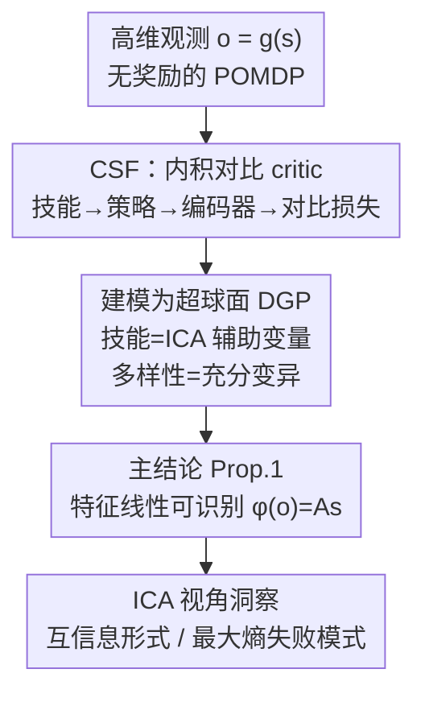

# Skill Learning via Policy Diversity Yields Identifiable Representations for Reinforcement Learning

**会议**: ICLR 2026  
**OpenReview**: [https://openreview.net/forum?id=xsPWWSod4M](https://openreview.net/forum?id=xsPWWSod4M)  
**代码**: https://github.com/bmucsanyi/identifiable-misl  
**领域**: 强化学习 / 表示学习 / 可识别性理论  
**关键词**: 互信息技能学习, 可识别性, 非线性ICA, 对比后继特征, 自监督RL

## 一句话总结
本文用非线性 ICA 的可识别性理论解释了「互信息技能学习（MISL）」为什么有效：以 Contrastive Successor Features（CSF）为代表，证明只要技能足够多样、critic 用内积参数化，学到的特征就能把环境的真实状态恢复到「一个线性变换之内」——这是 RL 表示学习的第一个可识别性保证，并据此解释了内积参数化、互信息形式选择、最大熵正则等设计的优劣。

## 研究背景与动机
**领域现状**：在稀疏奖励、难探索、奖励难设计的 RL 场景里，大量工作转向自监督的「无监督技能发现（USD）」，其中一类用互信息目标驱动的方法被称为 MISL（mutual information skill learning）。它们让一个「技能条件策略」$\pi(a\mid o,z)$ 去最大化技能间的可区分度，从而既学到通用表示、又激励探索，希望学到的表示能迁移到各种下游任务。

**现有痛点**：尽管 MISL 方法共享「用互信息目标」这个设计因子，它们的实际性能却天差地别。经验上人们总结出一些指导原则（比如怎么参数化 Q 值函数、用内积更好），但**没有理论解释**为什么相似的原则会导致如此巨大的性能差异——表示在其中扮演什么角色、互信息怎么参数化才对，这些问题在理论上都还是黑箱。

**核心矛盾**：RL 真正面对的是 POMDP——只能看到高维观测 $o=g(s)$，看不到真实状态 $s$。一个表示到底有没有「抓住」状态信息，缺乏可验证的判据；而自监督学习里的可识别性理论恰恰就是回答「能否从高维观测反推出潜在因子」的，但还没人把它接到 RL 的技能学习上。

**本文目标**：把可识别性理论引入 RL，回答两个子问题——(1) MISL 学到的特征到底能在多大程度上恢复真实状态？(2) 哪些设计选择（内积、多样性、互信息形式、熵正则）是成功的关键、哪些是坑？

**切入角度**：作者注意到「学习多样的技能」本质上等价于「在不同分布偏移/干预下区分数据」，而后者正是非线性 ICA 中「充分变异（sufficient variability）」假设所要求的条件。USD 追求探索多样性，ICA 追求样本覆盖所有潜在因子——两者目标天然对齐。

**核心 idea**：把 MISL 里的「技能」当作 ICA 里的「辅助变量」，把 POMDP 翻译成一个超球面上的数据生成过程（DGP），再套用 ICA 的可识别性证明技术，证明 CSF 学到的特征能把真实状态恢复到一个线性变换之内。

## 方法详解

### 整体框架
本文不是提出新算法，而是为已有的代表性 MISL 方法 CSF 提供「为什么有效」的理论解释。整条分析链路是：先把 CSF 这个被研究对象（技能→策略→编码器→内积 critic→对比损失）讲清楚，再把它背后的概率结构形式化成一个超球面上的 DGP（把技能解释成 ICA 的辅助变量），然后逐条核对它是否满足非线性 ICA 的可识别性假设，最后得到主结论——特征被识别到一个线性变换之内（Prop. 1），并从这套理论里反推出一系列实践洞察（互信息形式怎么选、最大熵为什么坏）。

### 关键设计

**1. CSF 的内积参数化对比目标：把技能学习写成对状态差的实例判别**

被研究对象 CSF 同时学一个编码器 $\phi$ 和一个技能条件策略。技能 $z$ 从单位超球面 $\mathcal{S}^{d-1}$ 上均匀采样，critic 用**内积参数化**去从相邻观测的特征差里判别技能：

$$q(z_i\mid \phi(o),\phi(o'))=\frac{p(z_i)\exp\big[(\phi(o')-\phi(o))^\top z_i\big]}{\mathbb{E}_{p(z)}\exp\big[(\phi(o')-\phi(o))^\top z\big]}.$$

这个对比下界等价于一个交叉熵损失，也可以看成在特征差 $\phi(o')-\phi(o)$ 上做的参数化实例判别。策略则去最大化奖励 $r_z(\phi(o),\phi(o'))=(\phi(o')-\phi(o))^\top z$，即让相邻状态的特征差与技能向量 $z$ 对齐。这里有两个被反复强调却没被解释的设计——**用特征差**（反映状态转移动态）和**用内积**（而非任意非线性 critic），本文要解释的正是它们为什么是成功的关键。直觉上，只有当每个技能只代表一小撮状态时，才可能从相邻状态反推出技能，这就把「技能多样性」和「能判别」绑在了一起。

**2. 把技能当 ICA 辅助变量、把 POMDP 建成超球面 DGP：多样性即充分变异**

要套用可识别性理论，必须先把 MISL 的设计选择翻译成形式化的 DGP 假设。作者把每个技能表示成一个高维单位向量 $z_i\in\mathcal{S}^{d-1}$，这样技能就能当作 ICA 文献里的**辅助变量**——给定辅助变量，潜在因子条件独立。相应地，状态差 $s'-s$ 也定义在超球面上，并假设一个条件分布 $p(s'-s\mid z)$。在这套语言下，「多样的技能」被精确定义为：一个理想判别模型能从相邻状态 $(s,s')$ 唯一推断出技能 $z_i$（Defn. 1），等价地，不同技能诱导的状态转移积分几乎处处不相等。这正对应 ICA 里的**充分变异**条件与因果表示学习里的**干预差异**。作者进一步把 CSF 的实践设定整理成 Assumption 1 的五条：技能在超球面上构成 $\mathbb{R}^d$ 的仿射生成系、给定技能时相邻状态相近、状态差边际等概、观测由连续单射生成器产生（$\dim o\ge\dim s$）、编码器用内积参数化且维度 $\dim\phi\ge\dim s$ 并能全局优化对比目标。这一步是整篇证明的「桥」：把工程设计逐条对译成可识别性需要的数学条件。

**3. 主结论 Prop. 1：特征差被识别到一个线性变换之内**

在 Assumption 1 下，当连续编码器和线性分类器全局最小化交叉熵目标 (1) 时，状态差被识别到一个线性映射 $A\in\mathbb{R}^{d\times d}$ 之内：

$$\phi(o')-\phi(o)=A\,[s'-s].$$

证明直接套用 Reizinger 等人（2024a, Thm. 1）的技术。由于这个线性映射对所有（单位归一化的）状态差都是同一个 $A$，且模型是内积参数化的，线性可识别性可以从「状态差」进一步推广到「状态」本身（Prop. 3）。这意味着 CSF 学到的特征就对应真实 POMDP 的状态、只差一个线性变换——这是 RL 表示学习领域**第一个可识别性保证**。它的意义是：在状态可观测的环境里，编码器本可以走捷径丢掉部分状态信息也照样压低损失，但理论保证了它不会，会把状态信息保留下来（差一个线性解码）。

**4. ICA 视角的失败模式洞察：互信息形式与最大熵的几何后果**

同一套理论还能反过来诊断设计选择的优劣。其一，**互信息形式选择**：$I(s,s';z)$ 与 $I(s;z)$ 看似都能给出可识别性，但几何约束不同。最大化 $[\phi(o')-\phi(o)]^\top z$ 要求特征差与 $z$ 平行，这就**逼着 $\phi(o)$ 与 $\phi(o')$ 必须不同**（否则差为零无法平行）；而 $I(s;z)$ 会要求 $\phi(o)$ 和 $\phi(o')$ 都各自与 $z$ 平行，结果两者互相平行、表示**坍缩**到同一点，违背「相邻状态应相近但不相同」的假设。所以用特征差去参数化 $I(s,s';z)$ 才是对的。其二，**最大熵正则的副作用**：过强的熵正则会让策略退化成与技能无关的最大熵策略，一旦动作（进而状态转移）不再依赖技能，判别模型 $q(z\mid s,s')$ 就无法从状态对推断技能，奖励也无法达到最优——这从理论上解释了为什么很多用熵正则的 MISL 方法会变差。其三，**多样性是个二值但又有条件数的问题**：理论上多样性只需让某个矩阵可逆，但矩阵即使满秩也可能病态，从而导致性能退化。

### 损失函数 / 训练策略
核心训练目标即式 (1) 的对比下界（等价交叉熵），策略侧最大化折扣回报 $\mathbb{E}_{p(z)}\mathbb{E}_{\pi}\big[\sum_t\gamma^t r_z(\phi(o),\phi(o'))\big]$，技能先验 $p(z)=\mathrm{Uniform}(\mathcal{S}^{d-1})$。为评估可识别性，特征维度被设成与真实状态维数相同，并通过最小化 $\lVert s-A\phi(o)\rVert_2^2$ 拟合线性映射 $A$、报告 $R^2$。

## 实验关键数据

实验目的不是刷 SOTA，而是**验证理论预测**：CSF 是否真能在探索状态空间的同时把状态识别到线性变换之内，以及多样性、维度等假设是否必要。环境为 MuJoCo 与 DeepMind Control，基于状态或像素观测。

### 主实验

| 环境（观测类型） | 评估指标 | 现象 |
|--------|------|------|
| Half Cheetah / Quadruped State（状态） | CDR2、Oracle Return | 同时探索状态空间并线性识别真实状态，CDR2 与 oracle return 强相关 |
| Quadruped Pixel / Kitchen / Robobin（像素） | CDR2、Oracle Return | 仍能探索并抽取真实状态，但 oracle return 更嘈杂、相关性较弱 |

其中 **CDR2（coverage-dependent $R^2$）** 是作者新提出的指标：取「归一化覆盖度」与「$R^2$」的调和平均。动机是普通 $R^2$ 只在「访问过的状态」上衡量，无法区分「坍缩/没探索」和「探索充分」两种情况；调和平均使得任一项低则整体接近零，从而同时考察探索与可识别性。

### 消融实验

| 配置 | 关键现象 | 说明 |
|------|---------|------|
| 技能数量 3→5→10→29→100→500→采样 | 少量固定技能时覆盖度与 $R^2$ 都低 | 验证 Assum. 1(i)：技能必须够多样才能张成 $\mathbb{R}^d$、给出可识别表示 |
| 隐空间维度 2→5→15→29→40（$\dim s=29$） | 维度低于状态维时 $R^2$ 掉、但 oracle return 反而更好 | 验证 Assum. 1(v)：线性可识别需要 $\dim\phi\ge\dim s$；但低维瓶颈利于任务迁移 |

### 关键发现
- **探索与可识别性是一体的**：CSF 在状态环境里不仅压低了对比损失，还把状态信息完整保留下来（线性可解码），并不存在「丢信息走捷径」的解，印证 Prop. 1。
- **可识别性与下游回报正相关、但不完全等价**：状态环境里 CDR2 与 oracle return 强相关，像素环境里关系更松；且降低隐空间维度会损害线性可识别性（$R^2$ 下降），却能提升零样本任务迁移——说明「恢复更多潜在因子」与「某个具体任务上的表现」之间可能存在张力（ICA 文献中常见现象）。
- **多样性是充分不必要条件**：理论只要求技能张成 $\mathbb{R}^d$，实验证实一小组离散技能也能拿到高可识别性分数，无需无限采样；但技能太少则覆盖和识别都崩。

## 亮点与洞察
- **把「学多样技能」翻译成「在不同干预下区分数据」**：这个对应一旦建立，USD 的探索目标就与 ICA 的充分变异条件无缝接上，整套可识别性机器立刻可用——这是全文最漂亮的一步类比。
- **第一个 RL 表示学习的可识别性保证**：以往可识别性多用在视觉/SSL 上，本文把它带进 POMDP，给「特征到底有没有抓住状态」这个长期模糊的问题一个可验证的数学答案。
- **理论直接落成工程指南**：内积参数化、用特征差而非单状态、慎用强熵正则——这些原本靠试错总结的经验，现在都有了几何/可识别性层面的解释，可迁移到其他 MISL 方法。
- **CDR2 指标值得复用**：用调和平均把「覆盖度」和「拟合度」绑在一起，避免被坍缩解骗过，这个评估思路对任何「探索 + 表示」类自监督 RL 都适用。

## 局限与展望
- 结论建立在对 Zheng 等人（2025）CSF 的观测之上，且依赖 Assumption 1 的若干技术条件（超球面、相邻状态相近、连续单射生成器等），能否放宽到更广的环境仍需进一步研究。
- 可识别性只保证到「线性变换之内」，当隐空间维度小于状态维时状态信息可能存在却非线性可解码——本文坦言缺乏对非线性几何下识别的理论与指标。
- 像素环境里可识别性与 oracle return 的相关性明显变弱，说明从高维像素到真实状态的识别仍更脆弱；离线 RL 下「奖励何时是好表示的好预测器」也被列为未来工作。
- 分析对象单一（CSF），虽然作者论证关键组件在 MISL 中通用，但对其他互信息形式的方法尚属推断而非证明。

## 相关工作与启发
- **vs 经验性 MISL 调参工作（Zheng et al. 2025 等）**：他们经验性地发现内积参数化、Q 函数参数化等有效；本文给出这些经验背后的可识别性理由，从「知其然」推进到「知其所以然」。
- **vs 非线性 ICA / 因果表示学习**：本文复用 ICA 的辅助变量框架与 Reizinger 等人（2024a）的交叉熵可识别性证明技术，但把设定从静态数据搬到「还要同时学探索策略」的 RL，问题更难——ICA 假设已有覆盖样本，本文需要策略自己去采集。
- **vs 最大熵 / 熵正则 USD（DIAYN、DADS 等）**：本文从理论上指出过强熵正则会切断策略对技能的依赖、破坏可判别性，解释了它们的部分失败模式。

## 评分
- 新颖性: ⭐⭐⭐⭐⭐ RL 表示学习领域首个可识别性保证，桥接 ICA 与 MISL 的视角新颖且有解释力。
- 实验充分度: ⭐⭐⭐⭐ 在状态/像素多环境验证主张，并消融技能数量与隐空间维度；但仅围绕 CSF 单一方法。
- 写作质量: ⭐⭐⭐⭐ 理论与直觉穿插（含 maze 例子、几何坍缩图示），脉络清晰；公式密度较高对读者有门槛。
- 价值: ⭐⭐⭐⭐⭐ 把一堆 MISL 工程经验落到可识别性理论上，既解释成功也诊断失败，对算法设计有直接指导。

<!-- RELATED:START -->

## 相关论文

- [\[ICLR 2026\] Self-Improving Skill Learning for Robust Skill-based Meta-Reinforcement Learning](self-improving_skill_learning_for_robust_skill-based_meta-reinforcement_learning.md)
- [\[ICLR 2026\] Master Skill Learning with Policy-Grounded Synergy of LLM-based Reward Shaping and Exploring](master_skill_learning_with_policy-grounded_synergy_of_llm-based_reward_shaping_a.md)
- [\[ICLR 2026\] Wavelet Predictive Representations for Non-Stationary Reinforcement Learning](wavelet_predictive_representations_for_non-stationary_reinforcement_learning.md)
- [\[ICLR 2026\] When Is Diversity Rewarded in Cooperative Multi-Agent Learning?](when_is_diversity_rewarded_in_cooperative_multi-agent_learning.md)
- [\[ICLR 2026\] Bridging Successor Measure and Online Policy Learning with Flow Matching-Based Representations](bridging_successor_measure_and_online_policy_learning_with_flow_matching-based_r.md)

<!-- RELATED:END -->
