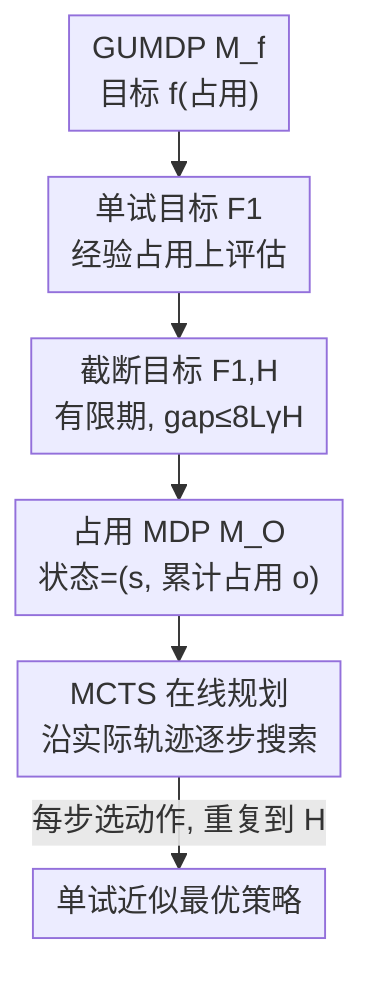

# Solving General-Utility Markov Decision Processes in the Single-Trial Regime with Online Planning

**会议**: ICLR 2026  
**OpenReview**: [https://openreview.net/forum?id=2XSP20jV0T](https://openreview.net/forum?id=2XSP20jV0T)  
**领域**: 强化学习 / 序贯决策理论  
**关键词**: 通用效用 MDP / 单试评估 / 占用 MDP / 在线规划 / 蒙特卡洛树搜索  

## 一句话总结
本文首次给出在「单条轨迹评估」（single-trial）下求解无限期折扣**通用效用 MDP（GUMDP）**的方法：先证明此时必须用历史相关策略、并把问题等价改写成一个跟踪「累计占用」的标准 MDP（occupancy MDP），再用蒙特卡洛树搜索（MCTS）在线规划逐步求解，在熵探索、模仿学习、对抗 MDP 三类任务上都显著优于无限试最优策略与随机策略。

## 研究背景与动机
**领域现状**：标准 MDP 用一个线性的累计代价 $J_\gamma(\pi)=c^\top d^\pi$ 来刻画目标，其中 $d^\pi$ 是策略诱导的状态-动作折扣占用（visitation frequency）。但很多真实目标——最大熵探索、模仿学习、风险规避、技能发现、约束/对抗 MDP——都没法写成线性代价。**通用效用 MDP（GUMDP）**把目标推广成占用的任意（通常凸）非线性函数 $f(d^\pi)$，统一了上述场景。

**现有痛点**：经典 GUMDP 求解（凸目标的 LP/凸优化）隐含假设策略性能是在**无穷条轨迹**上评估的，即用期望占用 $\mathbb{E}[d^\pi]$。然而非线性 $f$ 下，单条轨迹诱导的**经验占用** $d^\pi_\omega$ 与期望占用并不等价，导致 $\mathbb{E}[f(d^\pi)]\neq f(\mathbb{E}[d^\pi])$。Mutti 等人已指出：无限试下算出来的"最优"策略，在只跑一条轨迹评估时可能表现很差。

**核心矛盾**：实际部署里 agent 往往只活一次、只产生一条轨迹（机器人作业、单次任务），但理论工具默认的是无穷次重复的统计平均——单试与无限试两种目标的最优策略可能根本不同。此前 Mutti 等人只在**有限期、无折扣**设定下用一个"扩展 MDP"（显式记录完整历史）处理有限试问题，状态空间随期长组合爆炸，只能解极小实例，且没覆盖无限期折扣这一主流设定。

**本文目标**：在无限期折扣设定下，针对单试目标 $F_1(\pi)=\mathbb{E}[f(d^\pi)]$，回答（i）哪类策略才够最优、（ii）能否退化成可计算的有限期问题、（iii）能否改写成标准 MDP、（iv）计算复杂度多高，并给出一个能实跑的算法。

**切入角度**：既然单试目标关心的是「这一条轨迹累积出的经验占用」，那只要让 agent 在每一步都记住「到目前为止累计的占用向量」，未来决策就能基于这个充分统计量做——历史可以被无损压缩进一个 running occupancy。

**核心 idea**：把单试 GUMDP 截断成有限期目标 $F_{1,H}$，再等价改写成一个以「(原状态, 累计占用)」为状态的标准 occupancy MDP，最后用 MCTS 在线规划只沿实际经历的轨迹求解，绕开组合爆炸。

## 方法详解

### 整体框架
整条管线把一个看似棘手的非线性、历史相关、无限期问题，逐级化简成「可被通用规划器求解」的标准 MDP：**单试 GUMDP 目标 $F_1$ → 截断成有限期目标 $F_{1,H}$（截断误差可控）→ 等价改写成 occupancy MDP $M_O$（用累计占用当状态）→ MCTS 在线规划逐步出动作**。其中前三步是理论化简（保证最优性不丢失），最后一步是实际求解器。输入是一个 GUMDP $M_f=(S,A,\{P^a\},p_0,f)$ 与折扣 $\gamma$、截断期 $H$；输出是每一时刻该执行的动作，整条轨迹跑完后让经验占用上的 $f$ 值尽量小。

### 关键设计

**1. 单试目标 $F_1$ 与无限试 $F_\infty$ 的失配：为什么必须重新定义问题**

痛点在于：非线性 $f$ 让「一条轨迹的真实表现」和「无穷次平均的表现」分道扬镳。本文定义单条轨迹的**经验折扣占用**为 $d^\pi_\omega(s,a)=(1-\gamma)\sum_{t=0}^\infty \gamma^t \mathbf{1}(s_t=s,a_t=a)$，它是个随机向量，满足 $\mathbb{E}[d^\pi_\omega]=d^\pi$。单试目标 $F_1(\pi)=\mathbb{E}[f(d^\pi_\omega)]$ 先算 $f$ 再取期望，而无限试目标 $F_\infty(\pi)=f(\mathbb{E}[d^\pi_\omega])=f(d^\pi)$ 先取期望再算 $f$。由 Jensen 类的不等式，当 $f$ 非线性时二者一般不等，最优策略也不同；只有 $f$ 线性（标准 MDP）时才靠期望的线性性重合。

这个失配直接推翻了"平稳策略够用"的经典结论。本文 Theorem 1 构造出 GUMDP 使得 $F_1(\pi_S)>F_1(\pi_M)>F_1(\pi_{NM})$，即平稳策略严格劣于非平稳策略、后者又严格劣于**非马尔可夫（历史相关）策略**。直觉上，因为单条轨迹里 $f$ 关心的是「整条轨迹累计成什么样」，agent 必须根据「已经走过哪些 state-action」来调整后续动作，这是无限试设定里不需要的。所以求解必须在历史相关策略类 $\Pi_{NM}$ 上进行，这也奠定了后面"要记住累计占用"的必要性。

**2. 截断目标 $F_{1,H}$：把无限期问题变成误差可控的有限期问题**

无限期上的经验占用涉及无穷求和，无法直接计算。本文改用**截断经验占用** $d^{\pi,H}_\omega(s,a)=\frac{1-\gamma}{1-\gamma^H}\sum_{t=0}^{H-1}\gamma^t\mathbf{1}(s_t=s,a_t=a)$，对应截断单试目标 $F_{1,H}(\pi)=\mathbb{E}[f(d^{\pi,H}_\omega)]$，且 $H\to\infty$ 时 $F_{1,H}\to F_1$。

关键是它给出了可控的逼近保证。在 $f$ 为 $L$-Lipschitz 的假设下，Proposition 1 把任意策略的最优性间隙拆成

$$\mathrm{OptGap}(\pi)\;\le\;\underbrace{F_{1,H}(\pi)-\min_{\pi_H\in\Pi_{NM}}F_{1,H}(\pi_H)}_{\mathrm{OptGap}_H(\pi)}\;+\;8L\gamma^H.$$

也就是说，只要在截断目标 $F_{1,H}$ 上找到（近似）最优策略，再让 $H$ 取大，原始无限期目标 $F_1$ 上的次优性就被 $8L\gamma^H$ 这个指数衰减项压到任意小。这一步把"无限期、不可枚举"的麻烦换成"有限期、误差 $O(\gamma^H)$"的可解问题，是后面能套用标准 MDP 规划器的前提。

**3. 占用 MDP $M_O$：把历史无损压缩成「累计占用」状态**

既然必须用历史相关策略，朴素做法是像 Mutti 等人的"扩展 MDP"那样把完整历史 $h_t=(s_0,a_0,\dots,s_t)$ 塞进状态——但历史会组合爆炸。本文的洞察是：截断单试目标只通过经验占用依赖历史，所以**只需记住到当前时刻的累计占用向量 $o$，而非完整历史**。据此构造 occupancy MDP $M_O=(S_O,A_O,\{P^a_O\},p_{0,O},c_O,H)$，状态 $\{s,o\}$ 由原状态 $s$ 与一个 $|S||A|$ 维 running occupancy $o$ 组成。$o$ 按 $o_{t+1}(s,a)=\gamma^t+o_t(s,a)$（命中当前 $(s_t,a_t)$）确定性更新，时间步可由 $o$ 各分量之和反推、无需另存。代价极稀疏：只在终点有 $c_O(\{s,o\})=f\!\left(\frac{1-\gamma}{1-\gamma^H}o\right)$，其余为 $0$，于是累计代价 $J_O(\pi_O)=\mathbb{E}[c_O(\{s_H,o_H\})]$ 恰好就是截断单试目标。

这套改写带来两条硬保证：Proposition 2 给出 $M_f$ 的历史与 $M_O$ 的状态之间是**一一对应**，于是 $M_f$ 的非马尔可夫策略 ↔ $M_O$ 的平稳策略一一对应；Theorem 2 进一步证明"求解 $M_O$ 等价于求解截断单试 GUMDP"，且 $\mathrm{OptGap}_H(\pi)=J_O(\pi_O)-J_O^*$，连最优性间隙都精确相等。与扩展 MDP 相比，状态空间大小一样，但压缩成累计占用后可随交互增量更新、更适合实现；而且这里专攻折扣设定（折扣在 Prop 2 中起关键作用），是 Mutti 等无折扣有限期工作没覆盖的。

不过即便改写成标准 MDP，求最优解在最坏情况下仍然难：Theorem 3 用**子集和（subset sum）问题**一步归约证明——令 $f(d)=(n^\top d-k)^2$，判断是否存在 $\pi\in\Pi^D_{NM}$ 使 $F_{1,H}(\pi)\le 0$ 是 **NP-Hard**，且 $f$ 此时还是光滑严格凸的。这说明即使目标光滑凸，单试最优化的硬度也无法回避，因此需要在线规划这种"只在走过的轨迹上花算力"的近似求解，而非全局精确求解。

**4. MCTS 在线规划：只沿实际轨迹增量求解 occupancy MDP**

occupancy MDP 虽是标准 MDP，但状态随 $H$ 组合爆炸、代价只在终点非零、每个状态一条轨迹至多访问一次——为每个状态都算最优策略不现实。本文改用**在线规划**：在交互的每个时刻 $t$，以当前状态 $\{s_t,o_t\}$ 为根节点展开一棵前瞻搜索树，跑若干次 MCTS 迭代（决策节点对应动作、机会节点对应 occupancy MDP 的随机后继状态，经选择/扩展/模拟/回传四阶段），然后只为当前这一步挑一个动作执行，环境推进后再以新状态重新规划，直到 $H$。这样算力集中在 agent 真正经历的那条轨迹上，避开为全状态空间求最优的天价开销。

理论上它仍有收敛与后悔保证：在目标有界假设（$f_{\min}\le f\le f_{\max}$）下，每步迭代数趋于无穷时 MCTS 可证 $\mathrm{OptGap}_H(\pi_{\mathrm{MCTS}})=0$（源自 Kocsis & Szepesvári 的根节点最优性），结合 Prop 1 得 $\mathrm{OptGap}(\pi_{\mathrm{MCTS}})\le 8\frac{L}{f_{\max}-f_{\min}}\gamma^H$；后悔界为 $R_H(\pi_1,\dots,\pi_n)\le O(1/\sqrt{n})$，进而 $R(\cdot)\le O(1/\sqrt{n}+\gamma^H)$，把"迭代次数"与"截断误差"两项分别控制住。

## 实验关键数据

### 主实验
三类任务对应三种凸目标：最大状态熵探索 $f(d)=d^\top\log d$、模仿学习 $f(d)=\|d-d_\beta\|_2^2$、对抗 MDP $f(d)=\max_k d^\top c_k$。环境含示意性 GUMDP（$M_{f,1},M_{f,2},M_{f,3}$，$H=100$）与 OpenAI Gym 的 FrozenLake(FL)、Taxi、MountainCar(MC，离散化成 $10\times10$ 网格，$H=200$）。$\gamma=0.9$，每设定 10 次运行，MCTS 每步 4000 次迭代。基线为随机策略 $\pi_{\mathrm{Random}}$ 与无限试最优策略 $\pi^*_{\mathrm{Solver}}$（用优化求解器解 $f$）。指标为单试目标 $F_{1,H}$，越低越好。

| 任务 | 环境 | $\pi_{\mathrm{Random}}$ | $\pi^*_{\mathrm{Solver}}$（无限试） | $\pi_{\mathrm{MCTS}}$（本文） |
|------|------|------|------|------|
| 熵探索 | $M_{f,1}$ | 0.12 | 0.05 | **0.01** |
| 熵探索 | FL | 0.51 | 0.48 | **0.40** |
| 熵探索 | Taxi | 0.65 | 0.63 | **0.59** |
| 熵探索 | MC | 0.72 | 0.70 | **0.61** |
| 模仿学习 | $M_{f,2}$ | 0.05 | 0.02 | **0.002** |
| 模仿学习 | FL | 0.07 | 0.05 | **0.02** |
| 模仿学习 | Taxi | 0.08 | 0.05 | **0.05** |
| 模仿学习 | MC | 0.18 | 0.07 | **0.04** |
| 对抗 MDP | $M_{f,3}$ | 1.23 | 1.17 | **1.07** |

### 关键发现
- **几乎全胜**：除 Taxi 模仿学习上 $\pi_{\mathrm{MCTS}}$ 与 $\pi^*_{\mathrm{Solver}}$ 持平（0.05 vs 0.05）外，其余所有设定 MCTS 都最低，验证了"为单试目标专门优化"确实有收益。
- **单试 vs 无限试的差距是真实的**：$\pi^*_{\mathrm{Solver}}$ 是按无限试目标算出的最优策略，但在单条轨迹评估下被 $\pi_{\mathrm{MCTS}}$ 系统性超过（如熵探索 $M_{f,1}$ 上 0.05→0.01、模仿学习 MC 上 0.07→0.04），印证了动机里 $F_1\neq F_\infty$ 的失配确实会让无限试最优策略"水土不服"。
- **迭代数是旋钮**：理论上每步迭代趋于无穷时间隙归零，论文用 4000 次迭代/步即拿到上述优势，附录给出不同迭代数的结果。

## 亮点与洞察
- **"压缩历史成累计占用"是点睛之笔**：把组合爆炸的完整历史换成一个固定维度的 occupancy 向量，且证明这是充分统计量（一一对应 + 最优性间隙精确相等），既保住理论保证又让算法能增量实现——这是从"理论可解"跨到"实际可跑"的关键。
- **NP-Hard 证明既更简单又更强**：相比 Mutti 等人借助 POMDP 复杂度的繁复论证，本文用 subset sum 一步归约，并额外说明硬度在 $f$ 光滑严格凸时依然成立，把"难"这件事说得更彻底。
- **化归思路可迁移**：「非线性占用目标 → 在状态里塞充分统计量 → 套通用 MDP 规划器」这条路径，对其它"目标依赖整条轨迹统计量"的问题（如轨迹级约束、风险度量）都有借鉴价值。

## 局限与展望
- 作者承认：MCTS 需要环境**模拟器**来采样转移，纯离线/无模型场景不适用。
- running occupancy 是 $|S||A|$ 维向量，状态-动作空间一大就占用矩阵巨大、不可行；作者建议未来研究压缩 running occupancy 的方法。
- 仅限**离散**状态-动作空间（MountainCar 也是离散化后才用），连续控制需另想表示。
- 自己发现：实验环境偏小（示意性 GUMDP + 小型 Gym），$H$、迭代数、状态规模都不大，离大规模真实任务还有距离；且三类目标都凸，非凸 $f$ 的行为未验证。

## 相关工作与启发
- **vs Mutti et al. (2023)（扩展 MDP）**：他们在有限期无折扣下显式记录完整历史，状态组合爆炸只能解极小实例；本文在无限期折扣下把历史压缩成累计占用、状态空间同等但可增量更新，并用在线规划绕开全状态求解，理论上也把 NP-hardness 从无折扣推广到折扣设定且证明更简。
- **vs 无限试 GUMDP 求解（Zahavy et al., 2021 等凸 MDP 方法）**：它们解 $f(\mathbb{E}[d^\pi])$、用 LP/凸优化，最优策略平稳；本文指出单试下平稳策略严格次优、必须用历史相关策略，且实验中其最优解被本文超过。
- **vs 标准 MCTS（Kocsis & Szepesvári, 2006）**：本文把 MCTS 的收敛与后悔结论搬到 occupancy MDP 上，复用其根节点最优性与多项式后悔界（Shah et al. 2020；Cömer et al. 2025），属于"把成熟规划器套到新化归问题"的工程化贡献。

## 评分
- 新颖性: ⭐⭐⭐⭐⭐ 首个无限期折扣 GUMDP 单试求解方法，化归 + 复杂度 + 算法成体系
- 实验充分度: ⭐⭐⭐ 三任务全覆盖且全胜，但环境偏小、缺大规模与连续控制验证
- 写作质量: ⭐⭐⭐⭐ 理论链条清晰，定理与算法衔接自然
- 价值: ⭐⭐⭐⭐ 把"只活一次"的真实评估场景纳入 GUMDP 框架，理论与实践都开了头

<!-- RELATED:START -->

## 相关论文

- [\[ICLR 2026\] PAMDP: Interact to Persona Alignment via a Partially Observable Markov Decision Process](pamdp_interact_to_persona_alignment_via_a_partially_observable_markov_decision_p.md)
- [\[ICML 2025\] Learning Utilities from Demonstrations in Markov Decision Processes](../../ICML2025/reinforcement_learning/learning_utilities_from_demonstrations_in_markov_decision_processes.md)
- [\[ICLR 2026\] Single-stream Policy Optimization](single-stream_policy_optimization.md)
- [\[ICLR 2026\] Analysis of Approximate Linear Programming Solution to Markov Decision Problem with Log Barrier Function](analysis_of_approximate_linear_programming_solution_to_markov_decision_problem_w.md)
- [\[ICLR 2026\] Solving Parameter-Robust Avoid Problems with Unknown Feasibility using Reinforcement Learning](solving_parameter-robust_avoid_problems_with_unknown_feasibility_using_reinforce.md)

<!-- RELATED:END -->
