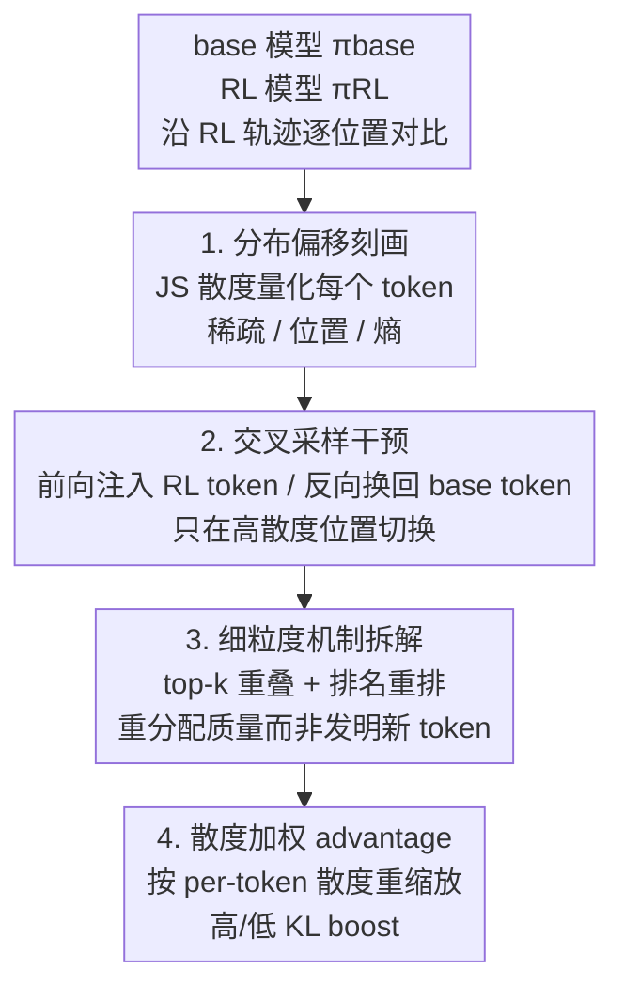

# Sparse but Critical: A Token-Level Analysis of Distributional Shifts in RLVR Fine-Tuning of LLMs

**会议**: ICLR 2026  
**OpenReview**: [https://openreview.net/forum?id=8vWIXno8LW](https://openreview.net/forum?id=8vWIXno8LW)  
**代码**: 待确认  
**领域**: 强化学习 / LLM推理 / RLVR  
**关键词**: RLVR、token级分布偏移、JS散度、交叉采样、稀疏性

## 一句话总结
这篇论文用 token 级的分布偏移视角系统解剖了 RLVR（可验证奖励强化学习）到底改了模型什么：发现 RL 微调只在极少数（DAPO 下约 17%、SimpleRL 下不到 2%）token 位置上显著改变了下一个 token 的预测分布，且通过"交叉采样"干预证明正是这一小撮 token 决定了几乎全部推理性能增益——RLVR 更像是在已有候选集里**重新分配概率质量**的精准手术，而非全局重写模型。

## 研究背景与动机

**领域现状**：RLVR（如 GRPO、DAPO、SimpleRL）在数学推理等基准上大幅提升了 LLM 的表现，已成为后训练的主流范式。但对它的评估几乎都停留在准确率、奖励、回答长度这类**聚合指标**上。

**现有痛点**：聚合指标只能说明"模型变好了"，却说不清模型**内部行为到底怎么变的**。一个核心问题悬而未决：RLVR 究竟如何重塑了基座模型的 token 级预测分布？这些改变里哪些才真正驱动了下游推理增益？已有工作开始从 token 熵、不确定性的角度切入（如高熵 token 驱动 RL），但缺一个更细粒度的分布视角——改变在序列位置/上下文中如何分布、概率质量如何在候选 token 间重新分配、训练过程中如何演化、以及它们对性能增益的实际贡献有多大，都没说清。

**核心矛盾**：人们默认 RL 微调会"广泛地"改写模型行为，但如果改变其实高度集中在少数关键决策点上，那么基于聚合指标的理解就是误导性的，也无法指导更高效的 RL 目标设计。

**本文目标**：① 刻画 RLVR 引入的 token 级分布偏移的结构（有多稀疏、集中在哪、和熵什么关系、改的是哪类 token）；② 用因果干预验证这些偏移对性能增益的功能重要性；③ 拆解在高偏移位置上 RL 到底是"发明新 token"还是"重排已有候选"；④ 据此尝试一种以散度为权重的 advantage 修改作为诊断性干预。

**切入角度**：把 RL 生成的轨迹当作参考路径，逐位置比较基座模型 $\pi_{base}$ 与 RL 模型 $\pi_{RL}$ 的下一个 token 条件分布，用对称、有界、即使分布不互相绝对连续也良定义的 **Jensen–Shannon（JS）散度**去量化每个位置的"改变量"。

**核心 idea**：用"token 级分布散度"作为统一透镜，把 RLVR 理解为一个**稀疏、有结构的概率再分配过程**——只在一小撮高散度的关键 token 位置上做手术，而这些位置驱动了几乎全部增益。

## 方法详解

### 整体框架

这篇论文不是提出新模型，而是提出一套**四级递进的 token 级分析框架**，从"改变有多稀疏"一路追问到"这些改变是否因果地造成了增益、机制是什么、能否反过来指导训练"。整体逻辑是：先**刻画**分布偏移的结构（稀疏性、位置、熵关系、token 身份、对比 SFT），再用**因果干预**（交叉采样）证明这些稀疏偏移的功能重要性，接着**显微镜式拆解**高散度位置的偏移机制（是重排还是发明），最后把观察**反哺**到一个以散度加权的 advantage 改造上。四步串成一条从"现象→因果→机制→应用"的链。

### 关键设计

**1. JS 散度刻画稀疏且有结构的分布偏移：先确认"改的地方到底有多少、在哪、改的是谁"**

为了回答"RLVR 把基座模型改到了什么程度"，作者在每个 token 位置 $t$、给定前缀 $x_{<t}$，计算基座与 RL 模型条件分布的 JS 散度 $D_{JS}(\pi_{base}(\cdot|x_{<t})\,\|\,\pi_{RL}(\cdot|x_{<t}))$。选 JS 而非 KL 的理由很实在：JS 对称（不必区分方向）、有界于 $[0,\log 2]$（极端值不会主导聚合统计）、且即使两个分布不互相绝对连续也良定义——这在显存受限只能取 top-p 截断分布时尤其重要，因为截断分布上 KL 可能无定义。

测出来的结论是 RLVR 的改造**高度稀疏**：DAPO 下超过 83% 的 token 位置散度近乎为零，SimpleRL 下这一比例超过 98%。DAPO 因为有 clip-higher 机制且去掉了 KL 正则，散度分布更宽、探索更广；SimpleRL 约束更紧，改变更集中。作者进一步刻画偏移的**结构**：位置上呈"两头高中间低"——回答开头散度最高（对应高层分支决策的改写），中间下降，结尾又小幅回升（对应答案格式与终止行为的调整）；熵关系上，低散度 token 大多本就是低熵（被保留的是模型已确信的预测），而高散度 token 横跨高低熵两端，说明 DAPO 连基座模型原本很确信的低熵预测都能改写。token 身份上，高散度 token 多是功能词、推理相关词、公式片段，低散度多是数字、运算符、数学结构件，但作者强调 token 身份本身不决定散度（如 "the" 虽频繁出现在高散度 token 里，其完整散度分布却压倒性集中在低区间），**上下文**才是关键。对照实验里 SFT 的高散度集合显著更大、分布更宽——证明这种稀疏性是 RLVR 的独特属性，而非微调的通病。

**2. 前向/反向交叉采样：用因果干预证明"这一小撮 token 是不是真的负责增益"**

光看稀疏性还不够，得回答这些高散度 token 是否**因果地**造成了性能增益。作者设计了一对互补的交叉采样干预：定义一条切换规则 $S(x_{<t}) = \mathbb{1}\{D_{JS}(\pi_{prim}\|\pi_{int}) > \varepsilon\}$，即只在散度超过阈值 $\varepsilon$ 的高散度位置上，把当前 token 改由"干预策略"$\pi_{int}$ 采样，其余位置仍由"主策略"$\pi_{prim}$ 生成，混合策略为 $\pi_{mix} = (1-S_t)\pi_{prim} + S_t\pi_{int}$。**前向交叉采样**令 $\pi_{prim}=\pi_{base}$、$\pi_{int}=\pi_{RL}$，即往基座生成里少量注入 RL 的 token 选择，看能否恢复 RL 级性能（测**充分性**）；**反向交叉采样**反过来，$\pi_{prim}=\pi_{RL}$、$\pi_{int}=\pi_{base}$，把 RL 生成中高散度位置的 token 换回基座选择，看 RL 增益垮得多快（测**必要性**）。

结果非常干净：前向上，在 AIME 2024 平均只需注入不到 4% 的 RL token（每条回答不到 40 个有效替换），就能把基座的约 8% 准确率拉到 RL 的约 25%；AIME 2025 上甚至只用 1.53% 有效 token（每条约 13 个替换）就把 5% 提到 14% 以上——有时混合策略还略超纯 RL 策略本身（因为 $\varepsilon>0$ 时混合策略与 RL 接近但不完全相同，偶尔避开了 RL 自身的失败）。反向上同样剧烈：AIME 2024 上只回退约 5% 的高散度分布（每条不到 30 个有效 base token）就能把 RL 的约 25% 砸回基座的约 8%。值得注意的是，换上去的 base token 在局部大多是合理、语义说得通的（人类读起来甚至可互换），却仍逐步让推理轨迹脱轨——暴露了模型对**轨迹的敏感性**：局部等价的两个选择会诱导出截然不同的下游条件分布。

**3. top-k 重叠与排名重排：拆开看 RL 在高散度位置是"发明新 token"还是"重排旧候选"**

既然增益挂在这一小撮位置上，那这些位置上 RL 究竟做了什么？作者用多个显微镜镜头拆解。**top-k 重叠**：只看高散度位置（$JS>0.1$），base 与 RL 的 top-k 候选集重叠在 $k\geq 2$ 后依然很高（SimpleRL 平均超 80%、常超 85%，DAPO 略低但仍可观），且从 $k=1$ 到 $k=2$ 重叠陡增——说明 top-1 token 经常变，但替补通常本就在 base 的 top-3 里。**排名重排**：约 30% 的 RL top-1 token 在 base 下已排第一，超过 80%（DAPO）/90%（SimpleRL）落在 base 的 top-3 内。**低概率行为**：取每个高散度位置 RL 的 top-1 token、查它在 base 下的概率，DAPO 下只有约 5% 的散度 top-1 token 在 base 下概率低于 0.01，SimpleRL 下几乎为零——即便是鼓励探索的 DAPO，也极少把基座里本不可能的 token 抬上来。

结论是：当前 RLVR 在高散度位置上**主要是在已有候选集里重新分配概率质量、做重排和选择性放大**，而非真正引入新 token；clip-higher 会增加少量低概率 token 的提升，但整体仍罕见。**训练演化**上，用 DAPO 在 Qwen2.5-Math-7B 的中间检查点追踪：JS 散度随训练单调增大，且高百分位（95th、99th）比低百分位涨得更快——分布改变越来越集中到一小撮 token，多数 token 保持稳定；散度 token 集合与最终集合的 Jaccard 重叠先缓后陡地逼近 1。

**4. 散度加权 advantage：把"稀疏关键"的观察反哺成一个可训练的诊断性改造**

既然只有一小撮 token 驱动增益，能否在训练时按散度调制每个 token 的学习信号？作者定义散度加权 advantage $\tilde{A}_t = w_t \cdot \hat{A}_t$，其中 $\hat{A}_t$ 是标准的组归一化 advantage，$w_t$ 是基于散度的 per-token 权重（散度从计算图分离，只影响权重不参与回传）。为兼容现有框架，散度量用相对旧策略的 KL $\mathrm{KL}^{old}_t = D_{KL}(\pi_{\theta_{old}}\|\pi_\theta)$，并用 Schulman 的 k3 估计器只在采样 token 上估计。权重用有界的 sigmoid 方案 $w_t = 1 + s\left(\sigma(\alpha\cdot\mathrm{KL}_t) - \tfrac12\right)$：$\alpha>0$ 放大高散度 token（high-KL boost），$\alpha<0$ 强调低散度 token（low-KL boost）。

在 Qwen2.5-Math-7B 上用 DAPO 配方训练，AIME24/25 与 AMC 上 high-KL boost（45.05）与 low-KL boost（44.92）都优于 baseline DAPO（42.48），为"目标 token 不成比例地驱动增益"提供了训练侧的经验支撑。但作者诚实地把它定位为**诊断工具**而非定论方法：两种方向都有效说明散度加权能影响学习动态，但最优方向、乃至是否真有收益，可能依赖具体模型与训练方法，稳定跨配置可能需要模型特定范式或自适应调度。

### 损失函数 / 训练策略
散度加权 advantage 基于 DAPO 目标 $J_{DAPO}(\theta)$（带 clip-higher 的非对称裁剪、动态采样、token 级平均、去 KL 惩罚），只把 token 级 advantage 由 $\hat{A}_{i,t}$ 替换为 $\tilde{A}_{i,t}=w_t\hat{A}_{i,t}$。重要采样比 $r_{i,t}(\theta)=\pi_\theta(o_{i,t}|q,o_{i,<t})/\pi_{\theta_{old}}(o_{i,t}|q,o_{i,<t})$ 与组归一化 advantage $\hat{A}_{i,t}=(R_i-\mathrm{mean}\{R_j\})/\mathrm{std}\{R_j\}$ 不变。结果取 32 样本的 Mean@32（或 pass@1），每配置 3 次运行取平均。

## 实验关键数据

### 主实验：交叉采样的充分性与必要性（Qwen2.5-32B，token 预算 8000）

| 数据集 | 方法 | 有效 % token | 有效 # token | 初始 Acc(%) | 最终 Acc(%) |
|--------|------|------|------|------|------|
| AIME24 | SimpleRL 前向 | 3.86% | 38 | 8.23 | > 25 |
| AIME24 | SimpleRL 反向 | 5% | 29 | 25.52 | < 8.3 |
| AIME24 | DAPO 前向 | 7.8% | 280 | 8.23 | > 44 |
| AIME24 | DAPO 反向 | 10.1% | 173 | 44.8 | < 8.5 |
| AIME25 | SimpleRL 前向 | 1.53% | 13 | 5.3 | > 14 |
| AIME25 | SimpleRL 反向 | 4.73% | 31 | 12.71 | < 4 |
| AIME25 | DAPO 前向 | 6.47% | 230 | 5 | > 33 |
| AIME25 | DAPO 反向 | 9.89% | 181 | 32 | < 4.5 |

读法：前向只需个位数百分比的 RL token 就能把基座拉到 RL 水平；反向只需个位数百分比的 base token 就能把 RL 砸回基座水平。DAPO 因为基线增益本就大得多（如 AIME24 涨到 >44%），需要的干预数也更多，但相对序列长度仍是一小撮。

### 分析表：散度加权 advantage（Qwen2.5-Math-7B，Mean@32，3 次平均）

| 配置 | AIME24 | AIME25 | AMC | 总平均 |
|------|--------|--------|-----|--------|
| Baseline DAPO | 33.61 | 18.75 | 75.08 | 42.48 ± 1.35 |
| Low-KL boost | 35.90 | 19.90 | 78.97 | 44.92 ± 0.05 |
| High-KL boost | 36.74 | 20.00 | 78.40 | 45.05 ± 0.79 |

### 关键发现
- **稀疏性极端**：DAPO 下 >83%、SimpleRL 下 >98% 的 token 位置散度近乎为零；RLVR 的稀疏性是其独特性质，SFT 的高散度集合显著更大更宽。
- **稀疏即关键**：前向/反向交叉采样证明 <4%~10% 的 token 决策就足以恢复或抹平几乎全部 RL 增益——增益高度集中在少数高散度决策点上。
- **重排而非发明**：高散度位置 $k\geq2$ 时 top-k 重叠 >80%，DAPO 下仅约 5%、SimpleRL 下近乎 0 的散度 top-1 token 在 base 下概率 <0.01；RLVR 主要重排已有候选而非引入新 token。
- **轨迹敏感性**：换上去的 base token 局部看合理，却逐步让推理脱轨——局部等价的选择能诱导截然不同的下游分布。
- **训练演化**：JS 散度随训练单调增大，高百分位涨得更快，改变越来越集中到一小撮 token。

## 亮点与洞察
- **交叉采样是这篇文章最漂亮的设计**：用一个"只在高散度位置切换策略"的开关，把相关性证据升级为因果证据——前向测充分性、反向测必要性，两条曲线一起把"稀疏 token 驱动增益"钉死，比单看散度分布有说服力得多。
- **"混合策略偶尔超过纯 RL"是个意外彩蛋**：因为 $\varepsilon>0$ 时混合策略与 RL 接近但不完全相同，有时反而避开了 RL 自身的失败模式——暗示 RL 策略并非处处最优，留有可挖的空间。
- **"重排而非发明"对方法设计有直接启发**：既然 RL 几乎不抬升 base 里本不可能的 token，那"基座模型其实已经知道答案、RL 只是在帮它选对"这一论断有了 token 级证据，也为推测解码、base 模型采样增强等方向提供依据。
- **散度加权 advantage 是"观察→方法"的范式示范**：把分析得到的"稀疏关键"直接做成一个可即插的训练权重，验证了用分布结构指导 RL 目标的可行性，这个思路可迁移到裁剪机制、稀有动作提升等改造上。

## 局限与展望
- 作者承认散度加权 advantage 只是**诊断性探索**：low-KL 与 high-KL boost 都涨点，反而说明机制尚不清晰，最优方向乃至是否真有收益都可能依赖具体模型/训练方法，稳定跨配置需要模型特定范式或自适应调度。
- 实验主要集中在 Qwen2.5 系列（32B 与 Math-7B）和数学推理基准（AIME、AMC），结论能否推广到其他模型族、其他任务（代码、通用推理）仍需验证；附录虽有部分鲁棒性检查，但主结论的模型/任务多样性有限。
- 散度估计在训练侧用 k3 估计器只在采样 token 上算、推理侧用 top-p 截断分布算，可能没捕捉完整分布结构；表中如 ">25"、"<8.3" 这类近似阈值不是精确恢复点，横向比较 SimpleRL 与 DAPO 的"有效 token 数"需注意两者基线增益量级不同，不能直接比大小。
- 改进方向：把 token 级散度信息聚合后更有效地提升 Section 4 讨论的稀有动作、直接改造裁剪机制、或设计自适应散度调度，把"稀疏关键"从诊断升级为稳定可用的训练目标。

## 相关工作与启发
- **vs 高熵 token 视角（Wang et al. 2025；Cheng et al. 2025）**：他们从 token 熵/探索动态指出高熵少数 token 驱动 RL；本文用 JS 散度给出更完整的分布视角，并发现高散度 token 横跨高低熵两端（DAPO 连低熵确信预测也能改），熵不是唯一刻画维度。
- **vs "scalpel 而非 hammer"系列（Rajani et al. 2025；Mukherjee et al. 2025；Shenfeld et al. 2025）**：他们多从参数、遗忘、整体 KL 的角度论证 RL 是局部放大已有能力；本文从 **token 级输出分布 + 因果交叉采样**给出互补且更直接的证据，并量化了"局部"到底有多局部。
- **vs critical token / 低概率 token 重加权（Lin et al. 2025；Yang et al. 2025）**：他们直接提方法改训练信号；本文先用分析确立"哪些 token 关键、机制是重排而非发明"，再据此提出散度加权 advantage，方法是分析的自然产物而非反过来。

## 评分
- 新颖性: ⭐⭐⭐⭐⭐ 把 RLVR 当作"稀疏概率再分配"来解剖，交叉采样的因果干预设计干净有力，视角新。
- 实验充分度: ⭐⭐⭐⭐ 多方法（DAPO/SimpleRL）、多数据集、前向/反向双向干预 + 训练演化追踪扎实，但模型族与任务类型偏窄、散度加权部分偏初步。
- 写作质量: ⭐⭐⭐⭐⭐ 四级递进、问题驱动，每节都以一个明确问句开头再用图表回答，逻辑链清晰。
- 价值: ⭐⭐⭐⭐⭐ 为"理解 RLVR 改了什么"提供了 token 级证据与可复用的分析工具，对设计更高效、更可解释的 RL 后训练目标有直接启发。

<!-- RELATED:START -->

## 相关论文

- [\[ICLR 2026\] Proximal Supervised Fine-Tuning](proximal_supervised_fine-tuning.md)
- [\[ICLR 2026\] SRFT: A Single-Stage Method with Supervised and Reinforcement Fine-Tuning for Reasoning](srft_a_single-stage_method_with_supervised_and_reinforcement_fine-tuning_for_rea.md)
- [\[ICLR 2026\] ResT: Reshaping Token-Level Policy Gradients for Tool-Use Large Language Models](rest_reshaping_token-level_policy_gradients_for_tool-use_large_language_models.md)
- [\[ICLR 2026\] Spotlight on Token Perception for Multimodal Reinforcement Learning](spotlight_on_token_perception_for_multimodal_reinforcement_learning.md)
- [\[ICLR 2026\] RewardMap: Tackling Sparse Rewards in Fine-grained Visual Reasoning via Multi-Stage Reinforcement Learning](rewardmap_tackling_sparse_rewards_in_fine-grained_visual_reasoning_via_multi-sta.md)

<!-- RELATED:END -->
