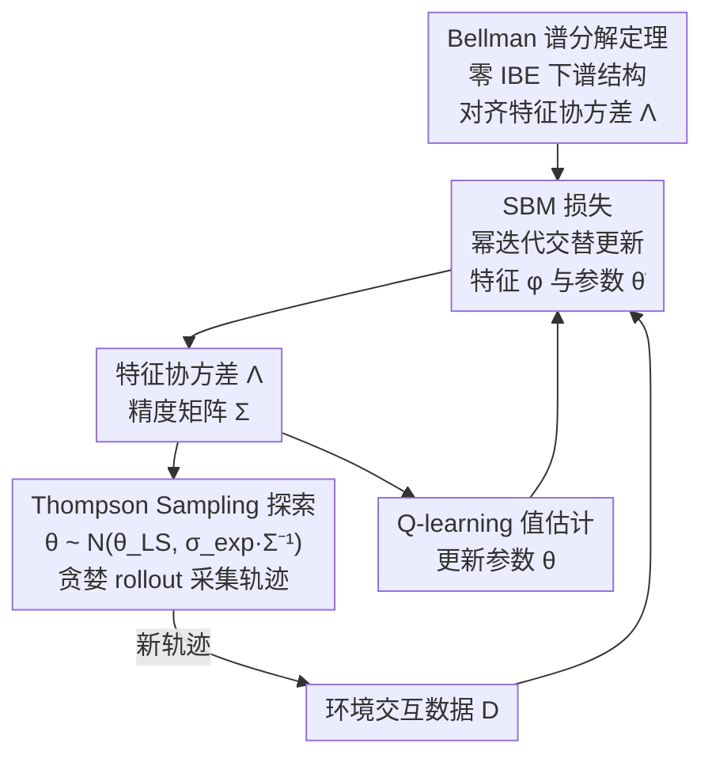

# Spectral Bellman Method: Unifying Representation and Exploration in RL

**会议**: ICLR 2026  
**arXiv**: [2507.13181](https://arxiv.org/abs/2507.13181)  
**代码**: 无  
**领域**: Reinforcement Learning  
**关键词**: 表示学习, 探索, Bellman 误差, 谱分解, Thompson 采样

## 一句话总结

提出 Spectral Bellman Method (SBM)，从零内在 Bellman 误差 (IBE) 条件出发发现 Bellman 算子与特征协方差的谱结构联系，推导出新的表示学习目标，并自然地统一了表示学习和 Thompson Sampling 探索。

## 研究背景与动机

高效的强化学习在复杂环境中面临两大核心挑战：**学习有效的表示**和**进行高效的探索**。现有方法通常将这两个问题视为独立的问题分别解决，但实际上两者存在深层联系——好的表示应该同时支持准确的值估计和策略性的数据收集。

现有的表示学习方法（自编码器、对比学习、预测模型、successor features 等）大多从模型学习角度出发，缺乏与 RL 核心结构（Bellman 更新）的对齐。一个关键的理论框架是**内在 Bellman 误差 (IBE)**：

- IBE 量化了特征空间对基于值的 RL 的适合程度
- 零 IBE 意味着函数空间在 Bellman 算子下封闭，这是 Linear MDP 的推广
- 满足零 IBE 的特征可支持高效探索

然而，直接学习低 IBE 表示面临严重困难：
1. 直接最小化 IBE 导致复杂的 min-max-min 优化问题
2. Bellman 算子关于 $Q_\theta$ 高度非线性
3. 简单的 MSE 目标既不利用谱性质，也不促进结构化特征

**核心洞察**：在零 IBE 条件下，Bellman 算子对一组 Q 函数的变换与特征协方差结构之间存在本质的**谱关系**。这个谱关系可以被利用来设计实用的学习目标。

## 方法详解

### 整体框架

SBM 要同时解决强化学习里两个常被分开处理的问题：**学一个适合值估计的表示**和**高效探索**，并让这两件事由同一个量驱动。它的出发点是一个看似纯理论的观察：当特征空间满足零内在 Bellman 误差 (IBE) 时，函数空间在 Bellman 算子下封闭，此时 Bellman 算子作用于一组 Q 函数所得到的变换矩阵，其奇异值分解 (SVD) 恰好与特征协方差矩阵对齐。SBM 把这个谱关系翻译成一个可微的代理目标——用类似幂迭代的交替优化逼近这组谱结构——训练出的特征协方差再顺势充当 Thompson Sampling 的探索后验。整个算法是一个三阶段交替的回环：从协方差驱动的 Thompson Sampling 采集数据，用标准 Q-learning 更新值参数，再用 SBM 损失更新特征，循环往复让表示与探索协同进化。

### 关键设计

**1. Bellman 谱分解定理：把零 IBE 的隐藏结构显式化**

零 IBE 是判断"特征对值估计是否合适"的理论判据，但直接最小化 IBE 会陷入 min-max-min 优化，根源在于 Bellman 算子关于 $Q_\theta$ 高度非线性，提供不了清晰的学习信号。SBM 的突破在于证明：在零 IBE 条件下，定义加权特征矩阵 $\Phi_P$ 与加权后 Bellman 参数矩阵 $\tilde{\Theta}_P$，则 Bellman 变换矩阵可分解为 $\mathcal{T}\bar{Q} = \Phi_P \tilde{\Theta}_P$，而它的 SVD 与特征协方差矩阵 $\Lambda = \mathbb{E}[\phi(s,a)\phi(s,a)^\top]$ 直接挂钩——非零奇异值恰好是 $\Lambda$ 的特征值，左奇异向量对应加权特征、右奇异向量对应加权参数。一个关键推论是 $\Lambda_1 = \Lambda_2 = \Lambda$，即特征协方差与后 Bellman 参数协方差对齐。这条定理的意义在于把那个难解的抽象判据，等价转换成了一个有现成数值算法（SVD / 幂迭代）可逼近的谱问题，为后续设计可训练目标铺了路。

**2. SBM 损失：用幂迭代把谱目标变成可训练的交替优化**

知道目标是逼近这组奇异向量后，SBM 借鉴求 SVD 的幂迭代思想，把问题拆成交替更新特征 $\phi$ 与参数 $\tilde{\theta}$ 的目标

$$\mathcal{L}(\phi, \tilde{\theta}) = \mathcal{L}_1(\phi) + \mathcal{L}_2(\tilde{\theta}) + \mathcal{L}_{orth}(\phi, \tilde{\theta})$$

其中表示损失 $\mathcal{L}_1(\phi)$ 更新 $\phi$ 使其与 Bellman 变换后的 Q 值对齐，并用当前参数协方差 $\Lambda_{2,t}$ 做正则化；参数损失 $\mathcal{L}_2(\tilde{\theta})$ 反向更新 $\tilde{\theta}$ 使其最佳表示 Bellman 变换结果，并用当前特征协方差 $\Lambda_{1,t}$ 正则化；正交正则化 $\mathcal{L}_{orth}$ 约束不同维度的特征彼此正交，对应 SVD 中奇异向量的正交性。Proposition 2 保证：最小化这个目标等价于执行一步幂迭代更新，因此随训练推进，特征会沿谱结构的主方向收敛。

它之所以比直接最小化 Bellman 残差更稳，关键差异藏在二次项里：朴素 Bellman MSE 中的 $\|\phi(s,a)\|_{\hat{\Lambda}}^2$ 用的是单样本噪声估计 $\hat{\Lambda}$，方差大、信号噪；而 SBM 的二次项用移动平均协方差 $\Lambda_{2,t}$，相当于对整批统计量做了稳健正则化。再加上 $\mathcal{L}_1 + \mathcal{L}_2$ 的分离结构天然契合幂迭代的交替更新、且显式带正交正则化，SBM 从同一理论目标出发却更不易发散。

**3. Thompson Sampling 探索：让特征协方差顺势驱动采样**

既然学到的特征协方差既刻画了表示结构、又编码了值估计的不确定性，SBM 直接复用它来探索，无需额外的探索模块。具体做法是构建精度矩阵 $\Sigma = \lambda I + \sum_{(s,a) \in \mathcal{D}} \phi(s,a)\phi(s,a)^\top$，每次 rollout 前从后验 $\hat{\theta}_{TS} \sim \mathcal{N}(\hat{\theta}_{LS}, \sigma_{exp} \Sigma^{-1})$ 采样一组参数再贪婪执行。由于低 IBE 特征的协方差结构同时编码了不确定性方向，采样自然偏向信息量大的状态-动作；同一个 $\Sigma$ 也可无缝替换成 UCB 方法。至此表示与探索共享同一个量，"学好表示"与"探索得好"成了一回事，这也是 SBM 标题里"统一表示与探索"的落点。

### 损失函数 / 训练策略

完整算法 (Algorithm 2) 每轮迭代交替执行三阶段。数据收集阶段按 Thompson Sampling 采样 $\hat{\theta}_{TS} \sim \mathcal{N}(\hat{\theta}_t, \sigma_{exp} \Sigma_t^{-1})$ 并用贪婪策略 $\pi_{\hat{\theta}_{TS}}$ 收集轨迹；策略优化阶段用标准 Q-learning 损失 $\mathcal{L}_{QL}(\theta; \phi) = \mathbb{E}[(\mathcal{T}Q_{\theta^-}(s,a) - \phi(s,a)^\top\theta)^2]$ 更新 $\theta$；表示学习阶段则用 SBM Loss 更新特征 $\phi$，其参数分布以当前 Q 参数为中心 $\nu(\theta) = \mathcal{N}(\hat{\theta}_{t+1}, \sigma_{rep}^2 I)$。其中 $\tilde{\theta}(\theta)$ 实现为残差网络 $\tilde{\theta}(\theta) = \theta + \Delta(\theta)$（$\Delta$ 为可训练 MLP），而所有协方差矩阵都用指数移动平均更新以保证稳定性。

## 实验关键数据

### 主实验

| 方法 | Atari 57 Mean | Atari 57 Median | Atari Explore Mean | Atari Explore Median |
|------|--------------|-----------------|-------------------|---------------------|
| DQN | 1.61 | 0.63 | 0.22 | 0.03 |
| SBM + DQN (ε-greedy) | 1.83 | 0.81 | 0.36 | 0.08 |
| **SBM + DQN (TS)** | **1.91** | **0.98** | **0.42** | **0.21** |
| R2D2 | 3.2 | 1.02 | 0.42 | 0.25 |
| SBM + R2D2 (ε-greedy) | 3.3 | 1.14 | 0.45 | 0.26 |
| **SBM + R2D2 (TS)** | **3.51** | **1.32** | **0.67** | **0.31** |

（分数为 Human Normalized Score，100M 步）

### 消融实验

| 配置 | 说明 |
|------|------|
| SBM + ε-greedy | 仅表示学习的提升 |
| SBM + TS | 表示 + 探索的协同提升 |
| 纯 DQN → +SBM | +19% Mean HNS (Atari 57)，+91% Mean HNS (Explore) |
| 纯 R2D2 → +SBM+TS | +10% Mean HNS (Atari 57)，+60% Mean HNS (Explore) |

### 关键发现

1. **表示学习与探索的协同效应**：SBM + TS 的增益显著大于单独使用任一方法，验证了统一框架的优越性
2. **在困难探索游戏上优势更明显**：Atari Explore 子集（Montezuma's Revenge, Pitfall! 等）上的提升比例远大于全量 57 游戏
3. **与多步算子兼容**：SBM 自然扩展到 Retrace(λ) 目标，与 R2D2 的分布式训练无缝结合
4. **表示学习与策略优化的协同进化**：改进的特征 → 更好的值估计 → 更好的策略 → 更好的数据 → 进一步改进的特征

## 亮点与洞察

1. **理论深度与实用性的平衡**：从 IBE 理论出发推导出谱目标，但最终算法只需对现有 Q-learning 进行简单修改——添加一个辅助的 SBM loss
2. **统一视角的优美**：一个谱目标同时驱动三个方面——低 Bellman 误差的特征、结构化的协方差、基于协方差的探索噪声
3. **避免了硬优化问题**：直接最小化 IBE 需要 min-max-min 优化；SBM 将其转化为类幂迭代的交替优化，简单且收敛快
4. **SBM Loss vs MSE 的对比分析**精辟：通过展开 MSE 并与 SBM 逐项对比，清楚地展示了移动平均协方差相比单样本估计的优势

## 局限与展望

1. **参数分布 $\nu(\theta)$ 的敏感性**：需要仔细调参 $\sigma_{rep}$，不同环境可能需要不同的配置
2. **仅验证 Atari**：未在连续控制任务（MuJoCo 等）上验证，适用范围有待确认
3. **理论分析局限**：收敛性证明、非零 IBE 下的行为分析尚未完成
4. **$\tilde{\theta}$ 的近似**：当前用残差 MLP 近似 $\tilde{\theta}(\theta)$，更好的参数化方式可能进一步提升性能
5. **未与其他表示学习方法 (CURL, SPR 等) 直接比较**：无法判断谱目标相对于对比学习/预测目标的绝对优势

## 相关工作与启发

- **内在 Bellman 误差 (IBE)**：Zanette et al. (2020a) 提出 IBE 概念并给出基于规划的算法的遗憾界；本文真正使 IBE 导向的表示学习变得实用
- **Linear MDP**：Jin et al. (2020) 假设线性转移和奖励，实际中难以满足；IBE 放松了这一条件
- **谱分解表示**：Ren et al. (2022/2023) 的谱分解工作是直接前驱，但本文更进一步建立了与幂迭代和 TS 探索的联系
- **启发**：该框架展示了如何从 RL 的核心数学结构（Bellman 算子的谱性质）出发设计实用算法，而非依赖通用的自监督启发式目标

## 评分

- 新颖性: ⭐⭐⭐⭐⭐ — 发现 IBE 与谱结构的联系并推导出实用的 SBM Loss 是原创性贡献
- 实验充分度: ⭐⭐⭐⭐ — Atari 57 全集 + 困难探索子集，与 DQN 和 R2D2 两个基线结合，但缺少连续控制和更多对比
- 写作质量: ⭐⭐⭐⭐ — 理论推导清晰，从定理到算法的链路完整
- 价值: ⭐⭐⭐⭐⭐ — 为 RL 表示学习提供了理论基础扎实的新范式，对后续工作有重要启发

<!-- RELATED:START -->

## 相关论文

- [\[ICLR 2026\] Representation-Based Exploration for Language Models: From Test-Time to Post-Training](representation-based_exploration_for_language_models_from_test-time_to_post-trai.md)
- [\[ICLR 2026\] Mirage or Method? How Model–Task Alignment Induces Divergent RL Conclusions](mirage_or_method_how_modeltask_alignment_induces_divergent_rl_conclusions.md)
- [\[ICLR 2026\] Sample-efficient and Scalable Exploration in Continuous-Time RL](sample-efficient_and_scalable_exploration_in_continuous-time_rl.md)
- [\[ICLR 2026\] A Unifying View of Coverage in Linear Off-Policy Evaluation](a_unifying_view_of_coverage_in_linear_off-policy_evaluation.md)
- [\[ICLR 2026\] SRFT: A Single-Stage Method with Supervised and Reinforcement Fine-Tuning for Reasoning](srft_a_single-stage_method_with_supervised_and_reinforcement_fine-tuning_for_rea.md)

<!-- RELATED:END -->
