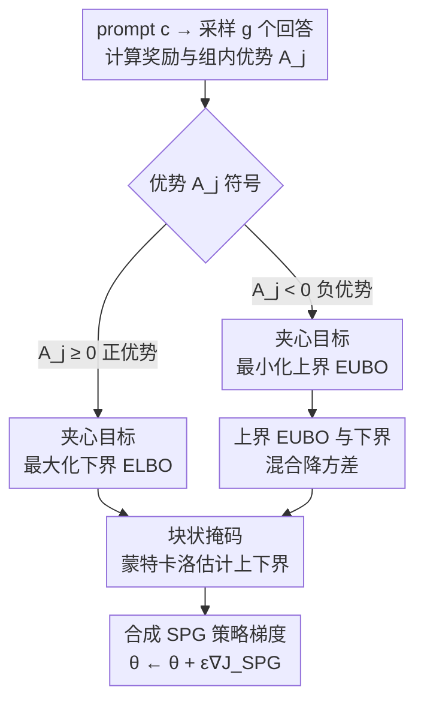

# SPG: Sandwiched Policy Gradient for Masked Diffusion Language Models

**会议**: ICLR 2026  
**OpenReview**: [https://openreview.net/forum?id=18j5Q49GwN](https://openreview.net/forum?id=18j5Q49GwN)  
**代码**: https://github.com/facebookresearch/SPG  
**领域**: 强化学习 / 扩散语言模型 / 策略梯度  
**关键词**: 掩码扩散语言模型, 策略梯度, 证据上界, GRPO, 块状掩码

## 一句话总结
针对掩码扩散语言模型（dLLM）对数似然不可计算、导致 RL 策略梯度有偏的问题，本文提出 Sandwiched Policy Gradient（SPG）：对正优势样本最大化对数似然的下界（ELBO）、对负优势样本最小化一个新推导的可计算上界（EUBO），把真实目标"夹"在上下界之间，并配合块状掩码估计，在 GSM8K/MATH500/Countdown/Sudoku 上分别比此前 SOTA 提升 3.6%/2.6%/18.4%/27.0%。

## 研究背景与动机

**领域现状**：扩散语言模型（dLLM，如 LLaDA、DREAM）以"并行解码多个 token"为卖点，正在成为自回归模型的高效替代品。它们用一个固定的加噪过程（不断把 token 替换成 `[mask]`）破坏文本，再训练一个去噪网络反向预测原始 token，训练目标通常是对数似然的证据下界（ELBO）。

**现有痛点**：要让 dLLM 对齐人类偏好或任务奖励（例如诱导出推理能力），需要一个 RL 后训练阶段。但标准策略梯度依赖 $\nabla_\theta \log \pi_\theta(x \mid c)$，而 dLLM 的对数似然 $\log \pi_\theta(x\mid c)$ 是**计算上不可行的**（要对所有加噪轨迹边缘化）。已有工作（D1、UniGRPO、WD1 等）直接用 ELBO 或单步估计去替代真实似然。

**核心矛盾**：ELBO 只是真实对数似然的**单侧下界**（$\text{ELBO}\le\log\pi_\theta$）。最大化 ELBO 确实能抬高真实似然，这对**正奖励**样本没问题；但对**负奖励**样本，RL 想要的是"压低它的似然"，而最小化一个下界**并不能**保证压低真实似然——这就引入了系统性的策略梯度偏差。更糟的是，这让基于 ELBO 的 RL 目标只在所有奖励非负时才是合法下界，与使用相对/负奖励的现代算法（如 GRPO）天然不兼容。

**本文目标**：构造一个**双侧、可计算**的代理目标，使得无论样本优势是正是负，优化它都等价于在朝真实期望奖励的合法界前进。

**切入角度**：既然 ELBO 是下界、适合"往上抬"，那只要再找到一个**可计算的上界 EUBO**（$\log\pi_\theta\le\text{EUBO}$）来"往下压"，就能根据奖励正负分别选用合适的一侧界。

**核心 idea**：用上下界把不可计算的对数似然"夹（sandwich）"住——正优势最大化 ELBO，负优势最小化 EUBO——从而得到真实 GRPO 目标的一个合法下界，让策略梯度偏差大幅降低。

## 方法详解

### 整体框架

SPG 建立在 group relative policy optimization（GRPO 家族）之上。对每个 prompt $c$，先从当前策略采样一组 $g$ 个回答 $\{x_j\}_{j=1}^g$，计算各自奖励 $R(c,x_j)$ 与组内相对优势 $A_j = R(c,x_j) - \frac{1}{g}\sum_{\jmath} R(c,x_\jmath)$。GRPO 把目标写成优势加权的对数似然 $J_{\text{group}}(\theta)=\mathbb{E}\big[\frac{1}{g}\sum_j A_j \log\pi_\theta(x_j\mid c)\big]$，鼓励高优势、抑制低优势回答。

SPG 的全部创新都在于：当 $\log\pi_\theta$ 不可算时，**用什么去替代它**。它不再对所有样本统一用 ELBO，而是按优势符号分流——正优势用对数似然下界 ELBO，负优势用一个新推导的上界 EUBO（实践中再与 ELBO 做混合以降方差）；上下界都通过块状掩码的蒙特卡洛采样来估计。整条 pipeline 如下：

### 关键设计

**1. 夹心策略梯度目标：按优势符号在上下界间分流**

这是全文的根。痛点在于：负优势样本希望"降低真实似然"，但 ELBO 是下界，最小化下界并不保证真实似然下降。SPG 的做法是把目标拆成两支：

$$J_{\text{SPG}}(\theta) = \mathbb{E}\Big[\tfrac{1}{g}\textstyle\sum_{j=1}^{g}\big(\mathbb{1}_{A_j\ge 0}\cdot A_j\,\mathcal{L}_{\text{ELBO}}(x_j\mid c;\theta) + \mathbb{1}_{A_j<0}\cdot A_j\,\mathcal{L}_{\text{EUBO}}(x_j\mid c;\theta)\big)\Big]$$

直觉很直接：正优势项 $A_j\ge0$，乘上下界 $\mathcal{L}_{\text{ELBO}}$ 再最大化，等于把真实似然往上抬；负优势项 $A_j<0$，乘上界 $\mathcal{L}_{\text{EUBO}}$ 后由于系数为负、实际是在**压低上界**，而压低上界必然压低被它夹住的真实似然。由于 $\mathcal{L}_{\text{ELBO}}\le\log\pi_\theta\le\mathcal{L}_{\text{EUBO}}$，可以证明 $J_{\text{SPG}}(\theta)\le J_{\text{group}}(\theta)$，即 SPG 是真实 GRPO 目标的**合法下界**，最大化它就是在为真实目标做有效代理。这正是 ELBO-only 方法做不到的：它在负优势一侧方向是错的。

**2. 可计算的证据上界 EUBO：用 Rényi 变分界把"上界"也算出来**

夹心目标要落地，前提是上界 $\mathcal{L}_{\text{EUBO}}$ 必须**可计算**。本文基于 Rényi 变分界推导出定理：对任意 $\beta\ge1$ 和序列 $x_{1:n}$，存在一个上界，在 $T\to\infty$ 的连续时间极限下其梯度可由如下形式（去掉与 $\theta$ 无关的常数 $C(T)$）估计：

$$\tilde{\mathcal{L}}_{\text{EUBO}}(x_{1:n};\theta) = \frac{1}{\beta}\sum_{i=1}^{n}\log\,\mathbb{E}_{t,z_t}\big[\,w(t)\cdot\mathbb{1}(z_{t,i}=m)\cdot\pi_\theta^{\beta}(x_i\mid z_t)\,\big]$$

它与 ELBO 的关键结构差异在于：ELBO 是"对位置求和、log 在期望里面"，而 EUBO 把 **log 提到了对时间/加噪的期望外面**，并对模型输出做 $\beta$ 次幂调整 $\pi_\theta^\beta$。超参 $\beta\ge1$ 控制界的松紧——$\beta$ 越接近 1 上界越紧、性能越好（实验从 $\{1.0,1.5,2.0\}$ 里选）。$\pi_\theta^\beta$ 起到"锐化"作用：把模型对每个被掩 token 的预测信心放大，作为对负优势样本的强校正信号。有了这个可计算的上界，夹心目标才真正能跑起来。

**3. 块状掩码估计：让训练时的掩码分布对齐推理时的解码分布**

$\mathcal{L}_{\text{ELBO}}$ 和 $\tilde{\mathcal{L}}_{\text{EUBO}}$ 都靠蒙特卡洛估计——对每个 $x_j$ 随机采 $m$ 个时间步、生成相应的部分掩码样本。最朴素的做法是对干净序列做**完全随机掩码**。但这里有个分布失配：LLaDA 等现代 dLLM 在生成时用的是**块状半自回归解码**（一块一块从左到右地揭开），所以 rollout 实际遇到的部分掩码序列结构性很强、远比随机掩码窄。

本文改用块状掩码：把序列切成若干块，随机选一块，**前面的块保持干净、后面的块全部掩掉**，只在选中块内随机掩 token；同时沿用 D1 的做法，对 prompt 和干净块以小概率 $p_{\text{mask}}=0.15$ 轻微扰动以增强稳定性与泛化。这样训练目标的估计分布就和策略 rollout 的分布对齐了，估计更稳、优化更高效。消融显示这一步在 Countdown 上把准确率从随机掩码的 45.4 抬到 69.3（+23.9），是非常关键的工程设计。

**4. 上下界混合：用凸组合给负优势项降梯度方差**

直接用 $\tilde{\mathcal{L}}_{\text{EUBO}}$ 的蒙特卡洛估计是**有偏的**，要可靠近似往往需要大量样本，带来高计算成本和训练不稳定。本文对负优势样本改用 EUBO 与 ELBO 的凸混合：

$$\tilde{\mathcal{L}}_{\text{Mix}}(x\mid c;\theta) := \omega\cdot\tilde{\mathcal{L}}_{\text{EUBO}}(x\mid c;\theta) + (1-\omega)\cdot\mathcal{L}_{\text{ELBO}}(x\mid c;\theta)$$

两者各有所长：上界 $\tilde{\mathcal{L}}_{\text{EUBO}}$ 通过 $\beta$ 次幂锐化决策、是负优势的强校正信号，但估计噪声大；下界 $\mathcal{L}_{\text{ELBO}}$ 少量样本就能稳定估计，但对负优势的惩罚力度不够。混合后既能惩罚得动、又估得稳。论文进一步证明（Proposition 1）：混合梯度 $g_{\omega,k}=\big((1-\omega)w(t,z_t)+\omega\rho_\beta\big)\partial_{\theta_k}\log\pi_\theta$ 存在唯一最优 $\omega^\star_k$，使其坐标方差**严格小于**单用上界（$\omega{=}1$）或单用下界（$\omega{=}0$）的方差。这个混合还实现了"置信度感知加权"：恢复概率小（$\pi_\theta^\beta$ 小）的不确定 token 权重更小、自信 token 上权重更大，且凸插值天然把极小梯度裁剪到一个下限、防止梯度消失。实验中为简单起见固定 $\beta$、并取 $\omega=0.5$。

### 损失函数 / 训练策略

完整训练流程（Algorithm 1）：循环采样 prompt $c$ 与 $g$ 个补全，计算奖励与优势 $A_j$；在 $\mu$ 步内层更新中，对每个 $x_j$ 用块状掩码生成 $m$ 个扰动样本，按 Equation 5 组装 $J_{\text{SPG}}(\theta)$（正优势用 ELBO、负优势用 EUBO 或 Mixture），再做梯度上升 $\theta\leftarrow\theta+\epsilon\nabla J_{\text{SPG}}(\theta)$。实现上用 LoRA（秩 $r=128$、$\alpha=64$）微调 LLaDA-8B-Instruct，内层更新数 $\mu=4$（与 GRPO 一致），rollout 用半自回归置信度解码、生成长度 256、温度 0.9（Sudoku 用 0.3），评测温度设 0.0。

## 实验关键数据

### 主实验

基座为 LLaDA-8B-Instruct，对比 D1 / WD1 / UniGRPO / LLaDA-1.5 等 dLLM RL 方法。下表为生成长度 256 下的准确率（%）。

| 基准 | 之前 SOTA | SPG w/ Mixture | 提升 |
|------|-----------|----------------|------|
| GSM8K (0-shot) | 82.5 (UniGRPO) | 86.1 | +3.6 |
| MATH500 (0-shot) | 37.4 (WD1/UniGRPO) | 40.0 | +2.6 |
| Countdown (0-shot) | 52.3 (WD1) | 70.7 | +18.4 |
| Sudoku (3-shot) | 67.0 (UniGRPO) | 94.0 | +27.0 |

逻辑推理（Countdown、Sudoku）上的增益远大于数学推理，说明 SPG 对"需要从负反馈中学会避开错误解"的任务尤其有效。代码任务上 SPG 也稳定占优：HumanEval（256）从 39.6→41.5（EUBO，+1.9）、MBPP（256）从 45.9→50.6（Mixture，+4.7）。奖励曲线（Figure 3）显示 SPG 收敛更快、奖励水平更高。

### 消融实验

负优势似然估计方法消融（四基准平均准确率，绿色为相对 SPG w/ ELBO 的增益）：

| 配置 | GSM8K | MATH500 | Countdown | Sudoku | 说明 |
|------|-------|---------|-----------|--------|------|
| SPG wo/ neg | 77.4 | 32.7 | 45.5 | 68.8 | 去掉负优势项，大幅掉点 |
| SPG w/ ELBO | 80.9 | 37.4 | 67.1 | 82.4 | 负优势也用下界 |
| SPG w/ EUBO | 81.6 | 36.7 | 69.3 | 86.1 | 负优势用上界 |
| SPG w/ Mixture | 83.1 | 38.4 | 69.9 | 90.0 | 上下界混合，最佳 |

掩码策略消融（平均准确率）：

| 配置 | 掩码 | MATH500 | Countdown |
|------|------|---------|-----------|
| SPG w/ EUBO | 随机 | 36.7 | 45.4 |
| SPG w/ EUBO | 块状 | 36.7 | 69.3 (+23.9) |
| SPG w/ Mixture | 随机 | 36.9 | 62.8 |
| SPG w/ Mixture | 块状 | 38.4 | 69.9 (+7.1) |

### 关键发现
- **负优势惩罚不可或缺**：去掉负优势项（SPG wo/ neg）在所有基准上大幅掉点，证明"从坏样本学习"对 dLLM 的 RL 至关重要——而这恰恰是 ELBO-only 方法做不好的环节。
- **混合优于单侧界**：Figure 4（Sudoku 奖励曲线）揭示三者性格——ELBO 收敛快但很早触顶（最小化下界不等于压低真实似然），EUBO 最终奖励高但收敛慢且不稳，Mixture 兼得"快、稳、高"。
- **块状掩码在结构化任务上增益巨大**：Countdown 上 +23.9（EUBO）／+7.1（Mixture），说明对齐 rollout 与优化的输入分布是关键，对解码结构性强的任务尤甚。
- **$\beta$ 越接近 1 越好**：上界越紧性能越高；$\omega$ 取中间值（0.5）即可取得稳定收益，与方差最优混合的理论一致。

## 亮点与洞察
- **"夹心"是一个干净的理论修复**：把不可计算的对数似然用上下界双侧夹住，使 $J_{\text{SPG}}\le J_{\text{group}}$ 始终成立——它不是又一个工程 trick，而是直接修好了 ELBO-only 在负奖励方向上"符号错误"的根本缺陷。
- **EUBO 的推导填了一个真空**：dLLM 社区长期只有 ELBO 下界可用，本文用 Rényi 变分界给出可计算的证据**上界**，让"最小化似然"这件事第一次有了正确的优化对象，这个工具本身可被其它 dLLM 对齐方法复用。
- **块状掩码点破了一个易被忽视的分布失配**：训练时随机掩码 vs 推理时块状半自回归解码之间的 gap，在 Countdown 上价值高达 +24 个点，提醒做 dLLM RL 时务必让估计分布对齐 rollout 分布。
- **方差分析支撑混合系数**：Proposition 1 证明存在严格降方差的最优 $\omega^\star$，把"为什么要混合"从经验观察提升为可证明的结论。

## 局限与展望
- $\beta$ 和 $\omega$ 实验中固定为超参（$\omega=0.5$），作者也指出它们其实可以随训练动态自适应调整以更好匹配演化中的数据分布，但本文未实现。
- EUBO 的蒙特卡洛估计本身有偏、且需较多样本才可靠，这正是不得不引入 Mixture 的原因；纯 EUBO 路线的计算成本与稳定性仍是瓶颈。
- 评测集中在数学/逻辑/代码这类有明确可验证奖励的任务，对开放式人类偏好对齐（奖励更嘈杂）上的效果未充分检验。
- 全部实验基于 LLaDA-8B-Instruct + LoRA，是否在更大规模 dLLM 或全参微调下同样成立，证据有限（附录有部分全微调消融）。

## 相关工作与启发
- **vs ELBO-only 方法（D1 / UniGRPO）**：它们对所有样本统一用 ELBO 替代似然，负优势方向有系统性偏差且与负奖励不兼容；SPG 用 EUBO 修正负优势一侧，得到合法双侧界。
- **vs WD1**：WD1 在 dLLM 上做加权的偏好/策略优化，但仍受限于单侧似然近似；SPG 在 Countdown（52.3→70.7）等任务上大幅超出，差距主要来自负反馈学习能力。
- **vs 轨迹级策略更新（Huang et al. 2025）**：后者在整条扩散轨迹上累积梯度并联合预测解码顺序，计算成本高昂；SPG 不需要遍历整条轨迹，用块状掩码的少量蒙特卡洛采样即可估计上下界，更经济。

## 评分
- 新颖性: ⭐⭐⭐⭐⭐ 首次为 dLLM 推导可计算证据上界，并用"夹心"思想修好负优势策略梯度的方向性缺陷。
- 实验充分度: ⭐⭐⭐⭐ 覆盖六个基准 + 多生成长度 + 充分消融，但规模/任务类型仍偏窄。
- 写作质量: ⭐⭐⭐⭐ 动机、理论与消融对应清晰，符号略密但逻辑自洽。
- 价值: ⭐⭐⭐⭐⭐ 给扩散语言模型的 RL 后训练提供了一个理论扎实、可直接复用的策略梯度框架。

<!-- RELATED:START -->

## 相关论文

- [\[ACL 2026\] d-TreeRPO: Towards More Reliable Policy Optimization for Diffusion Language Models](../../ACL2026/reinforcement_learning/d-treerpo_towards_more_reliable_policy_optimization_for_diffusion_language_model.md)
- [\[ICLR 2026\] Revolutionizing Reinforcement Learning Framework for Diffusion Large Language Models](revolutionizing_reinforcement_learning_framework_for_diffusion_large_language_mo.md)
- [\[ICLR 2026\] Reevaluating Policy Gradient Methods for Imperfect-Information Games](reevaluating_policy_gradient_methods_for_imperfect-information_games.md)
- [\[ICML 2026\] d2: Improving Reasoning in Diffusion Language Models via Trajectory Likelihood Estimation](../../ICML2026/reinforcement_learning/d2_improving_reasoning_in_diffusion_language_models_via_trajectory_likelihood_es.md)
- [\[ICML 2026\] Learning Unmasking Policies for Diffusion Language Models](../../ICML2026/reinforcement_learning/learning_unmasking_policies_for_diffusion_language_models.md)

<!-- RELATED:END -->
