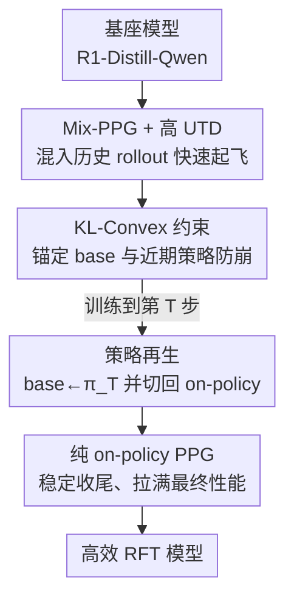

# Squeeze the Soaked Sponge: Efficient Off-Policy RFT for Large Language Model

**会议**: ICLR 2026  
**OpenReview**: [https://openreview.net/forum?id=quBjNSJMrC](https://openreview.net/forum?id=quBjNSJMrC)  
**代码**: https://anitaleungxx.github.io/ReMix/  
**领域**: 强化学习 / LLM 后训练  
**关键词**: 离线策略 RL, 强化微调 RFT, 数学推理, 样本效率, 策略再生

## 一句话总结
本文提出 ReMix，把 PPO/GRPO 这类天生 on-policy 的强化微调（RFT）方法改造成能复用历史 rollout 的混合策略算法，用 Mix-PPG + KL-Convex 约束 + 策略再生三件套，在五个数学推理基准上以 30×–450× 更少的 rollout 数据量打到 SOTA 级别准确率。

## 研究背景与动机
**领域现状**：大模型的推理能力（慢思考、长链条 reasoning）很大程度上靠强化微调 RFT 撑起来——把 LLM 当成策略 $\pi_\theta$，用可验证奖励（答对得 1、答错得 0）做 RL。目前主流的 PPO、GRPO、RLOO 都因为训练稳定、工程友好而被广泛采用。

**现有痛点**：这些算法全是 **on-policy** 的——每一轮迭代用当前策略采样的数据，更新完一次就丢掉。RL 本来就以样本低效著称，on-policy 又雪上加霜：要想提分就得不断重新 rollout，而 rollout（自回归生成长响应）正是 RFT 里最贵的一块算力开销。这个低效直接卡住了模型规模和响应长度的进一步 scaling。

**核心矛盾**：off-policy RL 天生更省样本（能从历史经验里学），但直接把 off-policy 数据塞进 RFT 会出问题——分布漂移太大会让训练退化甚至崩溃（collapse）。也就是说，**数据复用效率**和**训练稳定性 / 最终性能**之间存在一个尖锐的 trade-off。此外，已有的 off-policy RFT 工作既没在多个主流数学基准上跟 SOTA 正面比过，也没人讲清 off-policy 学习到底如何影响推理能力的形成过程。

**本文目标**：设计一个通用框架，让现成的 on-policy proximal policy gradient 方法（PPO/GRPO）能**高效利用 off-policy 数据**，同时拿到 SOTA 级推理准确率，并顺带把 off-policy 学习对推理行为的影响讲清楚。

**切入角度**：作者回到经典 off-policy RL 文献里的 generalized proximal gradient 理论，发现 proximal 梯度方法本就允许利用历史轨迹；关键是要在「混入多少旧数据」「约束策略别跑偏」「什么时候切回纯 on-policy」这三处做精细控制。

**核心 idea**：把海绵（吸饱历史数据的策略）"挤一挤"——用混合策略梯度榨干旧数据加速早期训练，再用动态 KL 约束防崩，最后通过"策略再生"无缝切回 on-policy 收尾，兼得早期效率与最终性能。

## 方法详解

### 整体框架
ReMix（Reincarnating Mix-policy Proximal Policy Optimization）的目标是：在不牺牲最终准确率的前提下，把 RFT 的 rollout 开销压到极低。整体训练分成两个串行阶段——前段用**混合策略**吃历史数据快速起飞，到第 $T$ 步触发**策略再生**后切回**纯 on-policy** 稳定收尾。三大组件协同：Mix-PPG（混策略梯度 + 提高 UTD）负责榨数据、KL-Convex 约束负责防漂移、策略再生负责阶段切换。

### 关键设计

**1. Mix-PPG + 提高 UTD：用历史数据榨出早期效率，又不让分布漂移压垮训练**

针对 on-policy"采完即弃"的浪费，作者引入 On-/Off-policy 混合的 proximal policy gradient（Mix-PPG）。第 $k$ 步训练时，mini-batch 不再只来自当前策略 $\pi_k$，而是从一个混合分布里采：以比例 $p$ 抽历史策略 $\pi_{k-i}$（$i\sim\nu$，窗口 $N$ 内）产生的轨迹，以 $1-p$ 抽当前策略的新轨迹。目标函数把 PPO 的 clip 项推广为跨策略的重要性采样形式：

$$L^{\text{Mix-PPG}}_k(\theta) = -\mathbb{E}_{i\sim\nu}\,\mathbb{E}_{(s,a)\sim d^{\pi_{k-i}}_{s,a}}\Big[\min\big(r^{k-i}_\theta A^{\pi_k},\ \text{clip}(r^{k-i}_\theta,\ \tfrac{\pi_k}{\pi_{k-i}}-\epsilon,\ \tfrac{\pi_k}{\pi_{k-i}}+\epsilon) A^{\pi_k}\big)\Big]$$

其中 $r^{k-i}_\theta(s,a)=\frac{\pi_\theta(a|s)}{\pi_{k-i}(a|s)}$ 是相对历史策略的重要性比率，clip 边界也随 $\pi_k/\pi_{k-i}$ 平移。这样既靠复用旧轨迹砍掉大量 rollout/推理开销（Data Reuse），又靠保留足量 on-policy 样本守住分布对齐（Distribution Alignment）。作者强调 on-policy 占比必须够高，否则 off-policyness 太重会退化甚至崩溃。在此基础上再把 **UTD 比率**（每批数据反复做几次梯度更新）调到 $m$，进一步压低对新鲜采样的需求——这是"把吸饱水的海绵多挤几下"。

**2. KL-Convex 策略约束：把死板的静态锚点换成 base 与近期策略的动态凸组合**

常规 RFT 对偏离基座 $\pi_{\text{base}}$ 施加一个**静态** KL 惩罚，但固定锚点跟不上不断演化的策略分布，容易导致次优更新。作者把锚目标改成 $\pi_{\text{base}}$ 与上一步策略 $\pi_{k-1}$ 的凸组合：

$$L_{\text{KLC}}(\theta;\pi_{\text{base}},k) = \mathbb{E}_s\big[\lambda D_{\text{KL}}(\pi_\theta\|\pi_{\text{base}}) + (1-\lambda)D_{\text{KL}}(\pi_\theta\|\pi_{k-1})\big]$$

约束 $\pi_{\text{base}}$ 那一项保住基础能力、防灾难性遗忘；约束 $\pi_{k-1}$ 那一项作为对"当前知识前沿"的动态适配，让策略能持续平稳精炼。$\lambda$ 用**衰减**调度（线性衰减即可，作者实测 $\lambda(t)=\max(1-0.1\cdot\lceil\max(t-50,0)/10\rceil,\,0.5)$）——前期偏向锚 base 保稳，后期放松、给策略更大优化空间。比固定 $\lambda$ 一致更好。

**3. 策略再生（Policy Reincarnation）：训到一半把基座换成自己，无缝从"高效"切到"稳收敛"**

Mix-PPG 能加速早期，但 off-policy 偏置会限制渐近（最终）性能。受 Reincarnating RL 启发，作者让训练分两段：先按 Mix-PPG 跑预定的 $T$ 步快速拉分；到点后触发"再生"，做两个改动——**(1) 把 KL 约束里的参考模型从初始 $\pi_{\text{base}}$ 重置为当前策略 $\pi_T$**，**(2) 把 Mix-PPG 切换回纯 on-policy PPG（PPO/GRPO）**。完整目标按阶段写成分段式：

$$L^{\text{ReMix}}(\theta)=\begin{cases}\mathbb{E}\big[L^{\text{Mix-PPG}}+cH[\pi_\theta]\big]+\beta L_{\text{KLC}}(\theta;\pi_{\text{base}},t) & t\le T\\[4pt] \mathbb{E}\big[L^{\text{PPO}}+cH[\pi_\theta]\big]+\beta L_{\text{KLC}}(\theta;\pi_T,t) & t>T\end{cases}$$

再生的妙处在于：把 $\pi_{\text{base}}\to\pi_T$ 让 KL 约束变得更松更动态（不再死死拽着早已落后的初始模型），从而打开更大的策略优化空间；同时切回 on-policy 消掉 off-policy 偏置，让后段稳稳收敛。早期效率与最终性能就此"无缝衔接"。

### 损失函数 / 训练策略
基座用 DeepSeek-R1-Distill-Qwen-1.5B/-7B，数据集 DeepScaleR（约 4 万道题）。默认超参：off-policy 比例 $p=0.4$、UTD $m=2$、历史窗口 $N=2$，再生步点 $T\in\{50,100\}$（ReMix-PPO）/ $T=50$（ReMix-GRPO）；prompt 截断 766 token，最大生成 8192 token；奖励为可验证规则奖励（答对且格式对得 1）。基于 verl 框架 + tinyzero 代码实现。

## 实验关键数据

### 主实验
五个数学推理基准（AIME'24 / AMC'23 / MATH500 / Minerva / OlympiadBench），指标 Pass@1，效率用 rollout 数据量衡量。

| 模型 | 规模 | Avg Pass@1 | Rollout 成本 | 备注 |
|------|------|------------|--------------|------|
| R1-Distill-Qwen (Base) | 1.5B | 37.58 | N/A | 基座 |
| DeepScaleR（最强 baseline） | 1.5B | 52.14 | 2.519M | |
| PPO (900 Steps) | 1.5B | 50.61 | 0.230M | on-policy |
| **ReMix-PPO (350 Steps)** | 1.5B | **52.10** | **0.079M** | ≈DeepScaleR，30× 更省 |
| ReMix-PPO (100 Steps) | 1.5B | 50.61 | 0.020M | 追平 PPO 用 10× 更少 |
| R1-Distill-Qwen (Base) | 7B | 52.08 | N/A | 基座 |
| AceReason-Nemotron | 7B | 63.24 | >3.584M | 强 baseline |
| **ReMix-PPO (75 Steps)** | 7B | **64.39** | **0.011M** | 超越，450× 更省 |
| ReMix-GRPO (200 Steps) | 7B | 66.09 | 0.163M | |

ReMix-PPO 对 1.5B/7B 基座分别带来 +14.52 / +12.31 的平均提分；在超越 PPO 时省 6×–10× rollout，在打平/超越最强 baseline 时省 30×–450×。

### 消融实验
基于 ReMix-PPO（1.5B，500 步内）逐个去组件：

| 配置 | Avg Pass@1 | 说明 |
|------|-----------|------|
| ReMix-PPO (350 Steps) | 52.10 | 完整模型 |
| w/o 提高 UTD | 50.63 | 掉 1.47 |
| w/o KL-Convex | 49.36 | 掉 2.74 |
| w/o 策略再生 | 47.26 | 掉 4.84（伤害最大） |
| w/o 三者（≈纯 Mix-PPG） | 48.70 | Mix-PPG 单飞反而更低 |
| PPO (500 Steps) | 49.56 | on-policy 参照 |

### 关键发现
- **策略再生贡献最大**：去掉它平均分从 52.10 掉到 47.26（−4.84），印证 Mix-PPG 单靠 off-policy 虽快但渐近性能受损，必须靠再生切回 on-policy 收尾。
- **三组件协同**：Mix-PPG+高 UTD 在前 100 步给出惊人的早期提分，KL-Convex 和策略再生则保障后期稳步爬升；任一缺席都掉到接近 PPO 水平。
- **off-policy 程度是把双刃剑**：off-policy 越重，早期提分越快、策略偏移越大，但会让响应变短、过早"忘掉"自我反思（self-reflection rate 下降），最终损害推理；高 UTD 的纯 Mix-PPG 在 200 步后甚至发生破坏性退化。ReMix 的训练动态呈现"先缩短响应快速提分、再拉长响应增加反思精炼"的融合曲线。
- **效率全面领先**：在 Olympiad 上达到 40+ 分，rollout 数据量和墙钟时间分别比 PPO 省 6× 和 4×。

## 亮点与洞察
- **"挤海绵"式的样本复用**：把 off-policy 数据当成吸饱水的海绵反复挤（Mix-PPG + 高 UTD），是 RFT 里少见的、把经典 off-policy RL 思想干净落地到 LLM 后训练的做法，30×–450× 的成本压缩很有说服力。
- **Whipping Effect（鞭打效应）—— off-policy 偏好短响应的形式化解释**：作者推导 Mix-PPG 平均损失 $L^{\text{Mix-PPG}}_{\text{Avg}}\propto-\frac{1}{H}\sum_h r^{k-i}_\theta A^{\pi_k}_h$，发现优势估计常为负、重要性比率经验上大于 1，于是模型倾向降低比率来减损；而响应越长、靠后状态的分布漂移越大，损失被放大得越狠——就像甩鞭子末端摆幅最大。结果模型为了减损主动偏好**更短的响应**。这个分析把"为什么 off-policy 让 reasoning 变短"讲得很透，可迁移到任何带重要性采样的离线 RFT 分析。
- **策略再生的"重置参考模型"trick 可复用**：把 KL 锚点从早已落后的 $\pi_{\text{base}}$ 换成当前 $\pi_T$，等于动态放松约束、打开优化空间，这一招对任何需要长期 KL 正则的 LLM RL 训练都值得借鉴。

## 局限与展望
- **任务范围**：实验只覆盖数学推理（可验证规则奖励），对代码生成虽有补充实验，但开放式生成、用学习型奖励模型的场景未充分验证。
- **超参敏感**：$p$、UTD $m$、再生步点 $T$、$\lambda$ 衰减表都需要调；off-policy 占比一旦过高就退化甚至崩溃，说明工作区间偏窄，迁移到新基座/新任务时大概率要重调。
- **横向比较的 caveat**：不同 baseline 的训练预算、数据来源、起跑基座不完全一致（部分 baseline rollout 成本仅有下界 ">"），rollout 数据量的绝对倍数对比应谨慎解读。
- **改进方向**：把再生从"单次硬切"推广成多次/自适应触发，或让 off-policy 比例随训练动态自调，可能进一步稳住高 UTD 下的退化。

## 相关工作与启发
- **vs 标准 on-policy RFT（PPO/GRPO）**：它们采完即弃、样本低效；ReMix 在其基础上插入混合策略采样并复用历史 rollout，相同准确率下成本压缩 6×–450×，但代价是引入了 off-policy 偏置需要靠再生消除。
- **vs 其他 off-policy RFT（非均匀回放 / 正负信号非对称学习 / 生成一致性目标 / 学习优越模型示范）**：这些工作大多没在多个主流数学基准上跟 SOTA 正面对比，也没讲清 off-policy 对推理行为的影响；ReMix 既给出系统的效率-性能对比，又通过 Whipping Effect 等分析补上了机制理解。
- **vs Reincarnating RL（Agarwal et al., 2022）**：ReMix 把"再生"概念从一般 RL 迁移到 LLM RFT 语境，并具体化为"重置 KL 参考模型 + 切回 on-policy"两步操作。

## 评分
- 新颖性: ⭐⭐⭐⭐⭐ 把经典 off-policy RL 思想（混策略梯度、UTD、Reincarnation）系统落地到 LLM RFT，并给出 Whipping Effect 机制分析
- 实验充分度: ⭐⭐⭐⭐⭐ 五基准 + 1.5B/7B 双规模 + 对 15 个先进模型 + 完整消融与训练动态分析
- 写作质量: ⭐⭐⭐⭐ 三组件叙述清晰、动机层层递进；超参与分段目标稍密集
- 价值: ⭐⭐⭐⭐⭐ 30×–450× 的 rollout 成本压缩对推理模型训练有直接的工程意义

<!-- RELATED:START -->

## 相关论文

- [\[ICLR 2026\] Toward Efficient Exploration by Large Language Model Agents](toward_efficient_exploration_by_large_language_model_agents.md)
- [\[ICLR 2026\] Buffer Matters: Unleashing the Power of Off-Policy Reinforcement Learning in Large Language Model Reasoning](buffer_matters_unleashing_the_power_of_off-policy_reinforcement_learning_in_larg.md)
- [\[ICLR 2026\] Structured In-context Environment Scaling for Large Language Model Reasoning](structured_in-context_environment_scaling_for_large_language_model_reasoning.md)
- [\[ICLR 2026\] MOBODY: Model-Based Off-Dynamics Offline Reinforcement Learning](mobody_model-based_off-dynamics_offline_reinforcement_learning.md)
- [\[ICLR 2026\] ResT: Reshaping Token-Level Policy Gradients for Tool-Use Large Language Models](rest_reshaping_token-level_policy_gradients_for_tool-use_large_language_models.md)

<!-- RELATED:END -->
