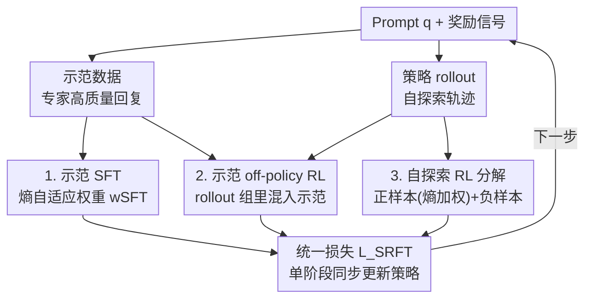

# SRFT: A Single-Stage Method with Supervised and Reinforcement Fine-Tuning for Reasoning

**会议**: ICLR 2026  
**OpenReview**: [https://openreview.net/forum?id=n6E0r6kQWQ](https://openreview.net/forum?id=n6E0r6kQWQ)  
**代码**: 有（论文正文给出链接，"The source code is available at here"）  
**领域**: 强化学习 / LLM推理  
**关键词**: SFT+RL融合, 单阶段微调, 熵自适应加权, GRPO, 数学推理

## 一句话总结
SRFT 用熵作为动态指标，把 SFT 和 RL 的损失在**同一个阶段**同时施加到示范数据和自探索 rollout 上，避免了 SFT→RL 两阶段"先学后改"的内耗，在五个数学推理基准上比 zero-RL 基线平均高 9.0 个点。

## 研究背景与动机

**领域现状**：要提升 LLM 的推理能力，主流是两条腿走路——先用专家示范做 Supervised Fine-Tuning（SFT）打底，再用强化学习（RL，通常是 GRPO/PPO 这类）做策略优化。绝大多数工作把这两步当成**先后串行的两个独立阶段**（SFT→RL）。

**现有痛点**：两阶段范式有结构性毛病。SFT 容易让模型死记示范的模式、过拟合训练集而没真正学会推理；纯 RL 又样本效率低、在巨大的解空间里探索困难，还可能 mode collapse 反复生成次优答案。作者进一步做了一组分析实验发现：在 SFT→RL 流水线里，**第二阶段 RL 的优化方向竟然和 SFT 相反**——RL 在花力气纠正 SFT 过拟合带来的偏移，等于交了一笔"学习税"（learning tax）。反过来的 RL→SFT 更糟，Table 1 里 RL→SFT 平均只有 37.4，远低于单独 SFT（47.3）或 RL（49.4）。

**核心矛盾**：SFT 的"知识蒸馏"和 RL 的"策略探索"之间存在难以拿捏的 trade-off。融合不足会让 SFT 的错误传播、限制 RL 提升；过度依赖示范又会过拟合、压死 base policy 之外的探索空间。两阶段的串行结构天然没法在训练全程动态平衡这两者。

**切入角度**：作者从**熵（entropy）**这个角度切入，做了三组关键分析：(1) Token 分布——SFT 是"大锤"，对整条回复序列做粗粒度全局重塑；RL 是"手术刀"，只精修一小撮 token，大部分数值和证明语句几乎不动。(2) 学习动力学——用对三个参考模型的交叉熵构造三维坐标可视化训练轨迹，证实 SFT 漂移大、RL 贴着初始策略。(3) 熵动力学——RL 后策略熵迅速坍缩趋于确定性输出，**还会削弱模型继续学习的"可塑性"**；而熵恰好能当作平衡两种范式的指标。

**核心 idea**：既然两阶段的内耗源于"先后顺序"，那就**取消阶段、单阶段同时上**——把 SFT 损失和 RL 损失在同一步里一起优化，并用当前策略的熵动态调节两者的权重，让模型既能吃示范的便宜，又能保持稳定的探索。

## 方法详解

### 整体框架

SRFT（Supervised and Reinforcement Fine-Tuning）建立在 GRPO 这套 RL 框架之上，核心是把"从示范学"和"从自探索学"两路数据，各自拆出 SFT 式和 RL 式的优化信号，**在单阶段里用一个统一损失同时更新策略**。具体地，对每个 prompt $q$，模型既采样自己的 rollout（自探索），又从示范数据集 $\mathcal{D}_{\text{demo}}$（DeepSeek-R1 生成的高质量推理回复）取专家轨迹。最终损失由三块构成：示范上的 SFT 损失、示范上的 off-policy RL 损失、自探索 rollout 上的 RL 损失。三块都用熵作为动态权重指标来调节强弱。

$$\mathcal{L}_{\text{SRFT}}(\theta) = \mathcal{L}_{\text{SFT}}^{\text{demo.}}(\theta) + \mathcal{L}_{\text{RL}}^{\text{demo.}}(\theta) + \mathcal{L}_{\text{RL}}^{\text{self-rollout}}(\theta)$$

### 关键设计

**1. 示范上的熵自适应 SFT 加权：让"粗粒度蒸馏"在该弱的时候自动收手**

示范数据承载了专家策略 $\pi_\beta$ 的生成模式，最直接的利用方式就是 SFT——最小化负对数似然 $\mathcal{L}_{\text{SFT}}^{\text{demo.}} = \mathbb{E}_{(x,y)\sim\mathcal{D}_{\text{demo.}}}[-\log\pi_\theta(y|x)]$ 去粗粒度逼近 $\pi_\beta$。但 SFT 是把整条序列概率"大锤"式重塑的，如果不加约束，示范策略和当前训练策略之间的分布失配会拖垮性能。作者用熵把这件事变成自适应的：权重设为 $w_{\text{SFT}} = 0.5\times\text{stop\_grad}(\exp(-H(\pi_\theta)))$，于是

$$\mathcal{L}_{\text{SFT}}^{\text{demo.}}(\theta) = w_{\text{SFT}}\cdot\mathbb{E}_{(x,y)\sim\mathcal{D}_{\text{demo.}}}[-\log\pi_\theta(y|x)].$$

含义是：当策略熵高（模型还很不确定、正在大幅探索）时 $\exp(-H)$ 小，SFT 的影响被自动压低，避免在分布失配大的时候硬塞示范造成性能退化；当策略逐渐收敛、熵降低时，SFT 的拉拽才变强。这把"什么时候该听专家"交给熵来实时判断，而不是固定一个常数。消融里把它换成固定 $w_{\text{SFT}}=0.1$，平均分从 59.5 掉到 55.1。

**2. 把示范混进 rollout 组做 off-policy RL：用专家轨迹抬高整组优势、促成乐观探索**

光做 SFT 还不够细。SRFT 借鉴 LUFFY 的 off-policy 思路，直接把示范轨迹和模型自己的 on-policy rollout **拼成一个异构训练组** $\mathcal{G}_{\text{aug.}} = \mathcal{G}_{\text{roll.}}\cup\mathcal{G}_{\text{demo.}}$，再在整组上统一算 GRPO 的组相对优势 $\hat{A}_k$。由于专家回复通常拿到更高奖励，把它们塞进来会**整体抬高这一组的优势估计基线**，等价于给策略一个"还有更好答案存在"的乐观信号，推动模型朝示范方向做更积极的探索。为处理 $\pi_\beta$ 和 $\pi_\theta$ 的分布失配，这一路用了重要性采样比 $r_{k,t}(\theta)=\pi_\theta(y_{k,t}|\cdot)/\pi_\beta(y_{k,t}|\cdot)$ 的裁剪目标（形式同 GRPO/PPO）；并沿用近期实践把 $\pi_\beta=1$ 以规避 token 对齐的复杂度，从而能直接吃现成数据集、不用重算行为策略概率。消融里去掉这一路（w/o demoRL）平均分掉到 55.2。

**3. 自探索 RL 的正负分解 + 正样本熵加权：把 on-policy 学习里"隐藏的 SFT"单独驯服**

作者发现一个有意思的结构：在二值奖励 $\{1,-1\}$ 下，标准 on-policy RL 目标可以**自然拆成两半**——

$$\mathcal{L}_{\text{RL}}^{\text{self-rollout}} = \underbrace{\mathbb{E}_{y^+}[-\log\pi_\theta(y^+|x)]}_{\text{正样本：等价于 SFT}} + \underbrace{\mathbb{E}_{y^-}[\log\pi_\theta(y^-|x)]}_{\text{负样本：似然最小化}}.$$

正样本那一项在数学上就是 SFT（最大化正确回复的似然），只不过这些正样本是当前策略**自己在线生成**的、而非来自外部 SFT 数据集；负样本项则系统性地压低错误回复的概率质量。关键洞察是：正样本这种"粗粒度"项如果不加节制，会让自探索快速降熵、把模型推向确定性输出、损害探索能力。于是作者只给正样本项加一个熵自适应权重 $w_{\text{RL}}=0.1\times\text{stop\_grad}(\exp(H(\pi_\theta)))$——和设计 1 方向相反：熵高时 $\exp(H)$ 大、鼓励继续从正样本学；熵低时自动收力以保住探索。负样本项保持原样：

$$\mathcal{L}_{\text{RL}}^{\text{self-rollout}}(\theta) = w_{\text{RL}}\cdot\mathbb{E}_{y^+}[-\log\pi_\theta(y^+|x)] + \mathbb{E}_{y^-}[\log\pi_\theta(y^-|x)].$$

这一设计让自探索这一路也吃上了"熵指标"的红利，是 SRFT 全程能维持稳定熵、避免 RL 那种熵坍缩的直接原因。

### 损失函数 / 训练策略
三块损失（示范 SFT + 示范 off-policy RL + 自探索 RL）相加得 $\mathcal{L}_{\text{SRFT}}$，单阶段同步优化。训练集为 OpenR1-Math-46k-8192（DeepSeek-R1 生成、经 Math-Verify 过滤、长度 ≤8192 token），同一份数据既当 rollout 的 prompt、又提供 reward 的 ground-truth、还充当示范。base model 为 Qwen2.5-Math-7B，每个 prompt 采 8 条 rollout，最大长度 8192，共训 500 步。两个熵权重里的 $\text{stop\_grad}$ 保证权重本身不回传梯度，只当调度系数。

## 实验关键数据

### 主实验
在五个竞赛级数学推理基准（in-distribution）和三个分布外基准（OOD）上，base 均为 Qwen2.5-Math-7B：

| 方法 | 数学推理 Avg.（ID） | OOD Avg. |
|------|------|------|
| Qwen2.5-Math-7B（base） | 23.5 | 15.4 |
| SFT | 54.3 | 49.2 |
| RL$_{\text{GRPO}}$ | 49.3 | 49.7 |
| SFT→RL | 54.5 | 54.6 |
| SFT+RL（朴素同步） | 52.3 | 50.9 |
| LUFFY | 55.5 | 57.8 |
| TAPO | 55.7 | 56.4 |
| ReLIFT | 54.0 | 55.9 |
| **SRFT（本文）** | **59.5** | **62.5** |

SRFT 在 ID 上比最强 zero-RL 基线高 +9.0 点（摘要口径），比 SFT 高 +4.8、比 SFT→RL 高 +3.4、比朴素 SFT+RL 高 +7.2；OOD 比最强基线高 +4.7 点。逐项最高分如 AIME24 35.3、AMC 74.3、MATH500 89.8、Minerva 39.7、Olympiad 58.3 多数为全表最佳或次佳。

### 消融实验

| 配置 | 数学推理 Avg. | 说明 |
|------|---------|------|
| SRFT（完整） | 59.5 | 三损失 + 双熵权重 |
| w/ 固定 $w_{\text{SFT}}=0.1$ | 55.1 | 换掉熵自适应 SFT 权重，掉 4.4 |
| w/ 固定 $w_{\text{RL}}=1.0$ | 56.2 | 换掉熵自适应正样本权重，掉 3.3 |
| w/o demoSFT | 53.9 | 去掉示范 SFT 损失，**掉最多（5.6）** |
| w/o demoRL | 55.2 | 去掉示范 off-policy RL 损失，掉 4.3 |

### 关键发现
- **示范 SFT 损失贡献最大**：去掉它（w/o demoSFT）平均分从 59.5 跌到 53.9，是所有消融里掉得最狠的，印证了"粗粒度监督引导"在单阶段融合里的核心地位。
- **熵自适应权重显著优于固定权重**：两个权重换成常数分别掉到 55.1 / 56.2，证明"用熵动态平衡探索与利用"不是锦上添花，而是 SRFT 跑赢两阶段的关键。
- **训练动力学上 SRFT 熵稳定、回复变长**：RL 训练时熵迅速坍缩、回复趋短；SRFT 全程维持相对稳定的熵，回复逐渐变长，说明它在持续保留探索、发展出更完整的推理过程。

## 亮点与洞察
- **把"先 SFT 后 RL 的内耗"量化成了 learning tax**：通过三维交叉熵坐标可视化看出 RL 的优化方向和 SFT 相反，这个观察很有说服力地解释了为什么两阶段不如单阶段——不是调参问题，是范式结构问题。
- **on-policy RL 目标在二值奖励下能拆出一个"隐藏的 SFT"项**：这个分解（正样本项 = 自己生成数据上的 SFT）很巧，让作者意识到 SFT 和 RL 的边界本就模糊，从而能用同一套"熵加权"思路统一处理示范监督和自探索正样本。
- **"大锤 vs 手术刀"的比喻 + 熵指标**可迁移：任何需要融合"模仿专家"和"自我提升"的训练（如 agent、对齐、代码生成），都可以借鉴用熵动态调度两类信号强弱的做法——熵高时多探索、熵低时多利用。

## 局限与展望
- **奖励是二值 $\{1,-1\}$**：自探索 RL 的正负分解依赖二值奖励的简洁结构，换成稠密/连续奖励时该分解和熵加权是否还成立，论文未充分讨论。
- **行为策略近似 $\pi_\beta=1$**：为规避 tokenization 复杂度直接令示范的行为策略概率为 1，这是个工程近似，理论上会让示范那一路的重要性采样比有偏，对失配很大的示范可能不够稳。
- **验证集中在数学推理 + Qwen2.5-Math-7B**：虽然有三个 OOD 基准，但 base model 单一、领域偏数学，更大规模模型或代码/通用推理上的表现待验证。
- **两个熵权重的系数（0.5 与 0.1）是手工设定**：这两个缩放常数本身没有自适应，可能需要按任务重新调。

## 相关工作与启发
- **vs LUFFY**：LUFFY 用 off-policy 把更强模型的轨迹混进 on-policy 学习；SRFT 继承了"示范混入 rollout 组"的做法，但额外把示范 SFT 和自探索正样本都纳入熵自适应统一框架，ID/OOD 都更高（59.5/62.5 vs 55.5/57.8）。
- **vs SFT→RL 两阶段**：两阶段第二步 RL 要回头纠正 SFT 的过拟合（learning tax）；SRFT 单阶段同步优化，训练轨迹更直、效率更高，+3.4 点。
- **vs 朴素 SFT+RL（$\mathcal{L}_{\text{SFT}}+\mathcal{L}_{\text{RL}}$ 直接相加）**：朴素同步不带熵调度，平均分 52.3 甚至低于 SFT→RL；SRFT 的关键增量正是"用熵动态加权"这层，+7.2 点说明融合方式比"是否融合"更重要。
- **vs ReLIFT / TAPO / SASR / CHORD**：这些同样在融合 SFT 与 RL（交错训练、注入外部思维模式、自适应混合权重），SRFT 的差异化在于先从熵的视角系统分析两者机制，再据此设计单阶段、熵自适应的统一损失。

## 评分
- 新颖性: ⭐⭐⭐⭐ 单阶段熵自适应融合 + on-policy RL 正负分解的洞察都很扎实，但"融合 SFT/RL"赛道已相当拥挤。
- 实验充分度: ⭐⭐⭐⭐ 8 个基准 + 11 个基线 + 权重/损失双消融 + 训练动力学分析，覆盖到位；base model 偏单一。
- 写作质量: ⭐⭐⭐⭐⭐ 从分析（大锤vs手术刀、learning tax、熵指标）一路推导到方法，动机链条非常清晰。
- 价值: ⭐⭐⭐⭐ 给"如何融合 SFT 与 RL"提供了可操作的熵自适应配方，对推理训练实践有直接参考价值。

<!-- RELATED:START -->

## 相关论文

- [\[ICLR 2026\] Proximal Supervised Fine-Tuning](proximal_supervised_fine-tuning.md)
- [\[ICLR 2026\] On-Policy RL Meets Off-Policy Experts: Harmonizing Supervised Fine-Tuning and Reinforcement Learning via Dynamic Weighting](on-policy_rl_meets_off-policy_experts_harmonizing_supervised_fine-tuning_and_rei.md)
- [\[ICLR 2026\] R1-Code-Interpreter: LLMs Reason with Code via Supervised and Multi-stage Reinforcement Learning](r1-code-interpreter_llms_reason_with_code_via_supervised_and_multi-stage_reinfor.md)
- [\[ICLR 2026\] RewardMap: Tackling Sparse Rewards in Fine-grained Visual Reasoning via Multi-Stage Reinforcement Learning](rewardmap_tackling_sparse_rewards_in_fine-grained_visual_reasoning_via_multi-sta.md)
- [\[ICLR 2026\] Single-stream Policy Optimization](single-stream_policy_optimization.md)

<!-- RELATED:END -->
