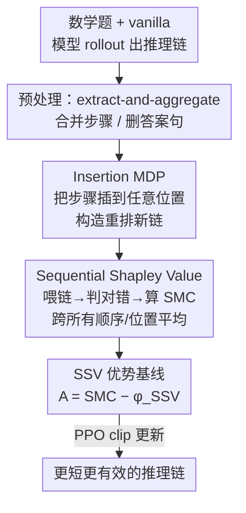

# SSVPO：面向语言模型 RL 训练的有效步级信用分配

**会议**: ICLR 2026  
**OpenReview**: [https://openreview.net/forum?id=g33DGvnHYd](https://openreview.net/forum?id=g33DGvnHYd)  
**代码**: 匿名仓库（论文录用后开源，见 Appendix F）  
**领域**: 强化学习 / LLM 推理 / 信用分配  
**关键词**: 步级信用分配, Sequential Shapley Value, Insertion MDP, RLVR, 推理效率

## 一句话总结
SSVPO 借鉴多智能体 RL 的 Shapley 值，把推理链里的每一步当成一个"智能体"，通过 Insertion MDP 把步骤重排成各种新链来度量每一步的边际贡献（Sequential Shapley Value），再把它当成 PPO 的优势基线做策略优化——既给部分正确的推理链做出公平的步级信用分配，又能识别零贡献步骤来缩短推理链，在 7 个数学推理基准上比 RLOO/GRPO/DAPO/VinePPO/SPO 都强，准确率最高 +11.6%、token 用量 -18.1%、推理效率 1.6 倍。

## 研究背景与动机

**领域现状**：用结果奖励（outcome-based RL）做 LLM 后训练是当前提升数学推理的主流，代表方法有 RLOO、GRPO、DAPO。它们只在整条推理链生成完、最终答案正确时才给一个奖励，回避了人类偏好反馈带来的偏置，在代数、几何、数论等结构化问题上确实有效。

**现有痛点**：结果奖励的致命问题是训练效率低——中间步骤拿不到任何显式信号，模型无法分辨哪一步真正贡献了答案。于是后训练后的模型倾向于把所有步骤都当成同等重要、平均地给同样的奖励，进而**故意拉长推理链**来累积奖励，生成大量冗余步骤；链越长，模型越可能放弃连贯推理、转而直接背答案，在没见过的新题上泛化能力崩塌。

**核心矛盾**：最近的信用分配方法（VinePPO 用蒙特卡洛回报、SPO 用相邻步价值差、GTPO 用动态熵加权）试图把结果奖励拆解到中间步骤，但它们**缺乏对步级奖励的公平估计**——尤其在"部分正确"的推理链里（前几步对、后几步错，或反之），没法公允地评出每一步到底值多少分。

**本文目标**：设计一个**有理论保证**的信用分配方法，能忠实刻画每个推理步的边际贡献，并据此识别关键步、提升后续 RL 训练效率。

**切入角度**：作者从多智能体 RL（MARL）里用 Shapley 值做公平信用分配得到启发，把推理过程建模成一串智能体——CoT 里的每一步就是一个 agent。但经典 Shapley 值假设参与者可独立交换，而推理步有强烈的**顺序依赖和位置敏感性**，所以需要把 Shapley 值从 MARL 的"空间域"扩展到推理的"时间域"。

**核心 idea**：提出 Sequential Shapley Value（SSV）——通过把推理步重排进所有可能的新链、度量每一步在不同顺序/位置下的平均边际贡献，得到对每一步公平的信用，再把 SSV 当成优势函数的价值基线驱动 PPO，从而既公平又高效。

## 方法详解

### 整体框架

SSVPO 解决的是"如何把最终的 0/1 答案奖励，公平地拆到推理链每一步上，并用这个步级信号驱动 RL"。整条管线分一个预处理阶段 + 三个正式阶段：

先用原始（vanilla）模型对一道数学题做 rollout，得到一条长推理链；**预处理**用 extract-and-aggregate 把链压缩——识别并合并中间步骤、删掉含最终答案的句子（防止重排后直接泄露 ground-truth），减少后面重排涉及的步数、降低算力开销。随后进入三阶段：**Stage 1** 把这些抽出的步骤按 Insertion MDP 构造成各种重排后的新链；**Stage 2** 把每条重排链当 prompt 喂给 LLM，要求它直接从给定链给出答案并判对错拿到奖励，据此算出每一步的 Sequential Marginal Contribution（SMC）和 Sequential Shapley Value（SSV）；**Stage 3** 把 SSV 当步级价值基线、配合 SMC 组成公平的优势估计，做 PPO 式策略更新，最终得到更短、更有效的推理链。

注意：Stage 1 的"重排"不靠语言模型的自回归生成产生新轨迹，而是纯粹用排列来构造不同的"备选 prompt"——Insertion MDP 本身不涉及生成，它只是一个专门用来估边际贡献的信用分配模型。

### 关键设计

**1. Insertion MDP：把"末端追加"改成"任意位置插入"，才能度量单步边际贡献**

标准的推理 MDP 把每一步顺序拼到链末尾，状态转移是确定性串接，最终奖励只在整条链结束后给一次——这种视角只关心"末端生成了什么 step"，根本无法区分某个中间步在不同链里的具体贡献。作者提出 Insertion MDP 来破这个局：它只在已经生成好的候选步集合上操作，状态 $s=(Q, n_{1:t})$ 是当前推理链（prompt + 前 $t$ 步），动作 $a=(n,x)$ 是把候选步 $n$ 插到链中的任意位置 $x$，得到新链 $s'=\text{Ins}(s,n,x):=(Q, n_{1:x-1}, n, n_{x:t})$。奖励函数 $R(s)\in\{0,1\}$，链能给出正确答案就是 1、否则 0。

有了"插入前/插入后"两条链，就能定义单步的**Sequential Marginal Contribution（SMC）**：

$$\text{SMC}_n(s,x) = R(s') - R(s).$$

也就是"在当前上下文和插入位置下，加上这一步让答案对不对发生了什么变化"。关键之处在于这些插入**与语义无关**——作者不要求重排链是连贯、可读的人类推理，只要模型仍能从某条重排链里答对，就把这种排列当成揭示了一条额外的、模型自身的推理路径。这样就把"评估单步贡献"从不可分解的末端奖励，变成了可枚举、可比较的插入操作。

**2. Sequential Shapley Value：跨所有顺序与位置取平均，给出有公理保证的公平信用**

单看一次插入的 SMC 是不公平的——它既依赖前驱步的排列顺序，又依赖具体插入位置。SSV 的做法是把一步的 SMC 在**所有可能的重排链**上做平均。设 $\mathcal{S}(N)$ 是全部步骤排列的集合，对排列 $\sigma$ 用 $\text{pred}_\sigma(n)$ 表示 $n$ 在 $\sigma$ 里的前驱步、$s_\sigma:=(Q,\text{pred}_\sigma(n))$，则步骤 $n$ 的 Sequential Shapley Value 为：

$$\phi_{\text{SSV}}(n) = \mathbb{E}_{\sigma\in\mathcal{S}(N)}\,\mathbb{E}_{x\in\{1,\dots,|s_\sigma|+1\}}\big[\text{SMC}_n(s_\sigma, x)\big].$$

这正是把经典 Shapley 值从 MARL 的空间域搬到推理的时间域：经典版假设参与者可交换，SSV 则显式枚举所有顺序组合、捕捉顺序依赖和位置敏感性（例如 5 步就有 120 种排列）。作者证明 SSV 满足四条 Shapley 公平公理（Theorem 1）：**Sequential Efficiency**（最终奖励被完整、不多不少地分摊到所有步，$\sum_n \phi_{\text{SSV}}(n)=\mathbb{E}_{\sigma,x}[R(s^{\text{full}})-R(s^{\varnothing})]$）、**Sequential Symmetry**（贡献相同的两步拿相同信用）、**Sequential Additivity**（两条独立链合并后信用等于各自之和）、**Sequential Null Step**（对最终奖励毫无影响的步信用为 0）。最后这条尤其有用——它能精确识别"零贡献步"，直接删掉就能缩短推理链、提升训练与推理效率；而且因为是对部分正确链也成立的逐步评估，前几步对、最后答错的链里那些正确步依然能拿到正信用。

**3. SSV 优势基线：无偏且方差最小，让 PPO 训练既稳又对齐公平原则**

要把 SSV 的公平性灌进 RL，得让它充当一个"不引入偏置、还能降方差"的价值基线。作者把步级优势定义为单次插入的 SMC 减去该步的 SSV：

$$A^{\text{SSV}}_t = \text{SMC}_{n_t}(s_t, x_t) - \phi_{\text{SSV}}(n_t).$$

由于 $\phi_{\text{SSV}}(n_t)$ 只依赖步骤本身、与具体插入位置无关，它是个合法的"控制变量"。代进 PPO 的截断目标即得 SSVPO 的训练目标：

$$J_{\text{SSVPO}}(\theta) = \mathbb{E}\Big[\min\big\{r_t(\theta)A^{\text{SSV}}_t,\ \text{clip}(r_t(\theta),1-\epsilon,1+\epsilon)A^{\text{SSV}}_t\big\} - \beta\, D_{\text{KL}}(\pi_\theta\,\|\,\pi_{\text{ref}})\Big],$$

其中动作 $a_t=(n_t,x_t)$ 是插入动作、$r_t(\theta)$ 是重要性比、$\epsilon$ 是截断系数、$\beta$ 控制 KL 强度。作者用 Theorem 2 证明这套优势构造的两个好性质：**无偏性**——因 SSV 基线与采样到的插入动作无关，把优势换成 $A^{\text{SSV}}_t$ 不改变期望策略梯度；**方差最小性**——在所有"只依赖步骤、不依赖插入位置且保持梯度无偏"的基线里，SSV 唯一地最小化更新方差。实践上这降低了 PPO 触发截断的频率与由此带来的截断偏置，让收敛更稳、样本效率更高（Theorem 2.3 在有界奖励、平方可积分得分、Robbins–Monro 步长等标准条件下给出收敛到驻点的保证）。

### 一个例子：Mr-GSM8K 第 248 题

一条 15 步的推理链里，第 1-2、6-9 步是对的，第 3-5、10-15 步是错的，且 SSVPO 和 GRPO 最终都答错了。GRPO 因为只看最终答案，把全部 15 步一视同仁判为"无用"、每步给 0。SSVPO 则通过 SSV 区分出来：第 1-2、6-9 这些逻辑正确、推进了推理的步骤即便没解出这道题，仍拿到正信用（这些步在别的题上可能是关键的）；错误步则被压低。把人工标注的 ground-truth 过程奖励曲线叠上去，SSVPO 的步级信用几乎贴着真值走——这就是"部分正确链也能公平评分"在实证上的体现。

## 实验关键数据

### 主实验

Qwen3-4B 为基座，对比结果奖励类方法（7 个数学推理基准，token 预算固定 16144/样本）：

| 方法 | GSM8K Acc | MATH-500 Acc | AMC23 Acc | AIME24 Acc | AIME25 Acc | 平均 Acc | 平均 Token |
|------|-----------|--------------|-----------|------------|------------|----------|------------|
| Vanilla | 93.6 | 91.2 | 87.5 | 60.0 | 46.6 | 82.1 | 6327 (−0%) |
| RLOO | 94.6 | 92.2 | 94.1 | 63.3 | 55.5 | 84.9 (+2.8) | 5650 (−10.7%) |
| GRPO | 94.6 | 92.4 | 91.6 | 61.1 | 50.0 | 83.4 (+1.3) | 5894 (−6.8%) |
| DAPO | 94.8 | 91.8 | 91.6 | 62.2 | 47.7 | 83.0 (+0.9) | 6828 (+7.9%) |
| **SSVPO** | **95.2** | **95.0** | **95.0** | **66.6** | **61.1** | **86.7 (+4.6)** | **5178 (−18.1%)** |

SSVPO 在 7 个基准的 6 个上拿到 SOTA（仅 SVAMP 略输 RLOO），在 MATH-500、AIME24、AIME25 这类难题上比前 SOTA 高 3%–5% 绝对准确率；平均比 vanilla +4.6%、比前 SOTA RLOO +1.8%，同时 token 用量比 vanilla 降 18.1%（GSM8K 上 1320 vs vanilla 2215、RLOO 1665，降幅最大）。

换 DeepSeek-R1-Distill-Qwen-1.5B 基座，对比信用分配类方法：

| 方法 | GSM8K Acc | MATH-500 Acc | AMC23 Acc | AIME24 Acc | AIME25 Acc | 平均 Acc |
|------|-----------|--------------|-----------|------------|------------|----------|
| Vanilla | 76.1 | 69.0 | 52.2 | 23.3 | 13.3 | 57.1 (+0.0) |
| VinePPO | 85.4 | 81.8 | 67.5 | 23.3 | 20.0 | 63.7 (+6.6) |
| SPO | 88.9 | 82.4 | 77.5 | 26.6 | 20.0 | 66.3 (+9.2) |
| **SSVPO** | **90.2** | **86.4** | **79.6** | **28.8** | **24.4** | **68.7 (+11.6)** |

SSVPO 平均准确率比 vanilla +11.6%，全面超过 VinePPO 和 SPO。值得注意的是准确率-效率权衡：SPO/VinePPO 有时 token 更少，但是靠跳过关键步换来的，准确率反而掉（如 AMC23 上 SPO 省 token 但准确率从 79.6 掉到 77.5）；SSVPO 在简单题上准确率更高且 token 更省，在难题上只多用极少 token 就换来大幅准确率提升（AIME24：SPO 19.3/12679 tok vs SSVPO 28.8/13377 tok）。

### 消融实验

重排步数（reorder num）超参的影响（Qwen3-1.7B，Acc / 生成长度 Len）：

| 配置 | GSM8K Acc | MATH-500 Acc | AMC23 Acc | AIME24 Acc | AIME25 Acc | 说明 |
|------|-----------|--------------|-----------|------------|------------|------|
| 2 Steps | 90.5 | 79.4 | 77.5 | 43.3 | 40.0 | 重排深度最浅，生成最短 |
| 3 Steps | 91.3 | 80.0 | 80.0 | 43.3 | 43.3 | 居中 |
| 4 Steps | 91.8 | 82.0 | 82.5 | 46.6 | 43.3 | 重排最深，准确率最高、生成最长 |

### 关键发现
- **重排深度是核心权衡旋钮**：重排步数从 2 增到 4，准确率单调上升但生成成本也上升——日常题（GSM8K）只涨 1.3 分，竞赛题（AMC23 涨 5.0、AIME24/25 涨 ~3.3，相对 7-8%）受益明显，说明难题更需要细粒度的步级信用。
- **信用分配的公平性 = 效率来源**：Sequential Null Step 公理让模型识别并删掉零贡献步，是"准确率不降反升、token 还省"的根本机制；而结果奖励类方法没有这个信号，只能靠拉长链刷奖励。
- **公平评分在"答错链"上最见功力**：案例研究里 SSVPO 的步级信用几乎贴合人工 ground-truth 过程奖励，而 GRPO 对答错链一律给 0、丢掉了部分正确步的价值。
- **受限 token 预算下优势更大**：即便只给典型所需 token 的 40%–60%，SSVPO 仍比 vanilla 高 10%–30%，因为它把训练集中在关键步上。

## 亮点与洞察
- **把 MARL 的 Shapley 公平信用搬到推理的时间域**：经典 Shapley 假设参与者可交换，作者敏锐地意识到推理步有顺序依赖，于是用"枚举所有排列 + 任意位置插入"扩展出 SSV，既保住了四条公平公理又适配了序列结构——这是最漂亮的概念迁移。
- **Insertion MDP 把不可分解的末端奖励变成可枚举的差分**：不靠生成、纯用重排构造备选 prompt 来问"加上这步答案变不变"，巧妙地把"单步贡献"做成了可计算量，且语义无关的设计反而能挖出模型自己的隐藏推理路径。
- **信用分配天然带来效率**：零贡献步 → 删 → 链变短，把"公平评分"和"缩短推理链/省 token"统一在一个机制里，而不是加一个独立的长度惩罚项，这个思路可迁移到任何 outcome-based RLVR 训练。
- **理论与实证双闭环**：不仅证了公平性（Theorem 1）和无偏+方差最小（Theorem 2），还用过程奖励曲线在实证上验证 SSV 贴合真值，说服力强。

## 局限与展望
- **组合爆炸的算力开销**：SSV 要在所有排列上平均（5 步 120 种），步数一多枚举不可行——这正是为什么需要 extract-and-aggregate 预压缩步数、以及把 reorder num 限制在 2-4 步；论文没充分讨论步数很多时的近似采样精度与误差。
- **奖励信号仅 0/1**：Insertion MDP 的奖励是二值正确性，对"几乎对、差一点"的细粒度推理质量不敏感，SMC 在很多插入下可能恒为 0，估计噪声未知。
- **只在数学推理上验证**：方法宣称可推广到"and beyond"，但实验全是数学基准，对开放式、无可验证答案的任务（无 RLVR 二值奖励）是否适用未知。
- **语义无关重排的双刃剑**：允许不可读的重排链虽然能挖隐藏路径，但也可能让模型从"乱序但碰巧能答对"的链里学到伪信用，论文未深入分析这种噪声对训练的长期影响。

## 相关工作与启发
- **vs RLOO / GRPO / DAPO（结果奖励类）**：它们只给末端一个奖励、把所有步等同看待，逼模型拉长链刷奖励；SSVPO 给每步公平信用、能删零贡献步，准确率更高且 token 更省。
- **vs VinePPO（蒙特卡洛回报做信用分配）**：VinePPO 用从某步往后采样的回报估价值，SSVPO 则用跨所有排列的边际贡献，公平性有 Shapley 公理保证、对部分正确链更准。
- **vs SPO（相邻步价值差分段信用）**：SPO 靠相邻步价值差给分段信用，倾向跳过步省 token 但常掉准确率；SSVPO 用全排列平均的 SSV，在难题上以极小 token 增量换大准确率提升，权衡更稳。
- **vs MARL 里的 Shapley 信用分配**：MARL 在空间域对可交换智能体用 Shapley，SSVPO 把它扩到时间域、显式建模顺序与位置敏感性，是同一公平思想在序列决策上的新实例。

## 评分
- 新颖性: ⭐⭐⭐⭐⭐ 把 MARL 的 Shapley 公平信用扩展成顺序敏感的 SSV，配 Insertion MDP，概念迁移干净且有公理支撑。
- 实验充分度: ⭐⭐⭐⭐ 7 基准 + 两种基座 + 与结果奖励/信用分配两类方法都比，案例研究贴合过程奖励真值；但缺数学外任务与大规模步数下的近似分析。
- 写作质量: ⭐⭐⭐⭐ 动机—方法—理论—实验逻辑清晰，定义与定理完整；个别表格存在笔误（如 SVPPO/数字小不一致）。
- 价值: ⭐⭐⭐⭐⭐ 给 RLVR 训练提供了有理论保证、又自带"缩短推理链"红利的步级信用分配范式，实用且可迁移。

<!-- RELATED:START -->

## 相关论文

- [\[ICLR 2026\] RL Grokking Recipe: How Does RL Unlock and Transfer New Algorithms in LLMs?](rl_grokking_recipe_how_does_rl_unlock_and_transfer_new_algorithms_in_llms.md)
- [\[ICLR 2026\] Webscale-RL: Automated Data Pipeline for Scaling RL Data to Pretraining Levels](webscale-rl_automated_data_pipeline_for_scaling_rl_data_to_pretraining_levels.md)
- [\[ICLR 2026\] RL Squeezes, SFT Expands: A Comparative Study of Reasoning LLMs](rl_squeezes_sft_expands_a_comparative_study_of_reasoning_llms.md)
- [\[ICLR 2026\] RL for Reasoning by Adaptively Revealing Rationales](rl_for_reasoning_by_adaptively_revealing_rationales.md)
- [\[ICLR 2026\] From f(x) and g(x) to f(g(x)): LLMs Learn New Skills in RL by Composing Old Ones](from_fx_and_gx_to_fgx_llms_learn_new_skills_in_rl_by_composing_old_ones.md)

<!-- RELATED:END -->
