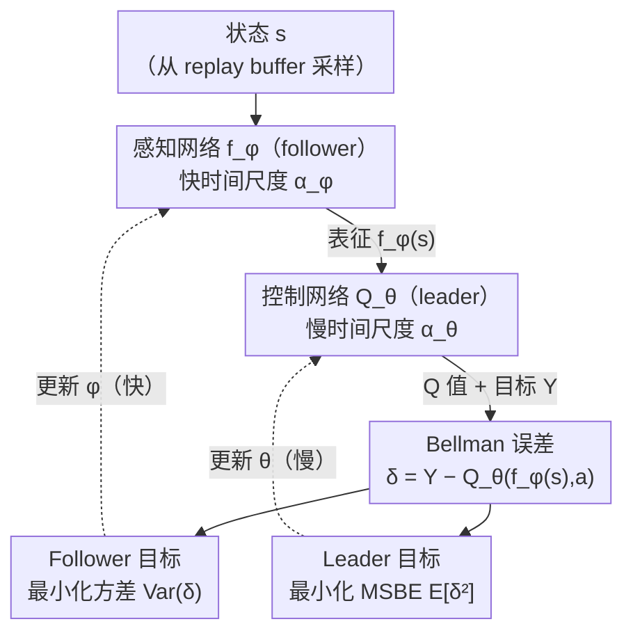

# Stackelberg Coupling of Online Representation Learning and Reinforcement Learning

**会议**: ICLR 2026  
**arXiv**: [2508.07452](https://arxiv.org/abs/2508.07452)  
**代码**: [https://github.com/fernando-ml/SCORER](https://github.com/fernando-ml/SCORER)  
**领域**: 强化学习 / 表征学习  
**关键词**: Stackelberg 博弈, 表征学习, Deep Q-Learning, 双时间尺度, 方差最小化

## 一句话总结

提出 SCORER 框架，将 Deep Q-Learning 中的表征学习和值函数学习建模为 Stackelberg 博弈，通过双时间尺度更新（Q 网络为 leader 慢更新、编码器为 follower 快更新）实现稳定协同适应，无需改变网络结构即可提升性能。

## 研究背景与动机

- **致命三要素（Deadly Triad）问题**：深度 Q-Learning 中，函数近似、自举（bootstrapping）和离策略学习的组合导致不稳定性，可能引发表征崩溃和灾难性学习失败。
- **单体网络的局限**：传统方法在单一网络中同时学习表征和值函数，导致表征必须不断适应非平稳的值目标，而值估计又依赖于变化的表征，形成恶性循环。
- **辅助损失的冲突**：引入额外辅助损失（如自监督目标）来稳定表征可能与主值学习目标产生梯度冲突。
- **核心思路**：不是简单增加辅助损失，而是从根本上重构优化问题——将其建模为层次化的 Stackelberg 博弈。

## 方法详解

### 整体框架

SCORER 想解决的是 Deep Q-Learning 里表征和值函数互相拖累的恶性循环：表征要追着非平稳的值目标跑，值估计又依赖不断变化的表征。它的做法是把智能体内部从"一个网络同时学表征和值"拆成两个有主从关系的玩家——控制网络 $Q_\theta$ 作为 leader（领导者）负责值估计、走慢时间尺度以提供稳定目标；感知网络 $f_\phi$ 作为 follower（跟随者）负责表征学习、走快时间尺度去学一个对当前 leader 的最优响应。每一步从 replay buffer 取样本，感知网络先编码出表征、控制网络在表征之上算 Q 值并得到 Bellman 误差；两个玩家各自盯着这个误差的不同统计量优化，再用学习率快慢之比把它们的更新组织成 Stackelberg 博弈（主从博弈）的近似均衡求解。整个改动不碰网络结构，只重排了优化方式。

### 关键设计

**1. Leader 目标：在最优表征之上最小化 MSBE**

针对"值估计依赖变化表征"这一半的循环，leader 只关心值估计准不准。它假定 follower 已经针对自己给出了最优表征 $f_{\phi^*(\theta)}$，并在此之上最小化均方 Bellman 误差（MSBE）：

$$\min_\theta \mathcal{L}_{\text{leader}}(Q_\theta, f_{\phi^*(\theta)}) \triangleq \mathbb{E}_{(s,a,r,s') \sim \mathcal{B}} \left[(Y - Q_\theta(f_{\phi^*(\theta)}(s), a))^2\right]$$

这与标准 Q-Learning 的目标形式一致，区别在于表征不再随值目标被动漂移，而是来自一个专门对 leader 做出最优响应的独立玩家，从而把"表征追着非平稳值目标跑"的那一头给摘了出去。

**2. Follower 目标：最小化 Bellman 误差方差而非 MSBE**

针对"表征追着非平稳值目标跑"这一半的循环，follower 学表征时不去直接压低 Bellman 误差的均值，而是压低它在一个 batch 内的方差：

$$\phi^*(\theta) \in \arg\min_\phi \mathcal{L}_{\text{follower}}(f_\phi, Q_\theta) \triangleq \text{Var}_{j \in B}[\delta_j(\phi, \theta)]$$

其中 $\delta_j(\phi, \theta) = Y_j - Q_\theta(f_\phi(s_j), a_j)$ 是第 $j$ 个样本的 Bellman 误差。这是全文最反直觉也最核心的一步：最小化方差等于逼着表征在不同样本上产生更一致的 Bellman 误差，让表征对 TD 学习里那些自举（bootstrapping）出来的噪声目标更鲁棒，直接对抗致命三要素的根源——而不像最小化 MSBE 那样和 leader 抢同一个目标、引发梯度冲突。消融也证实了方差目标稳定优于直接最小化 MSBE。

**3. 双时间尺度近似 Stackelberg 均衡：用学习率快慢之比实现主从顺序**

上述两个目标合起来是一个双层优化，leader 在外、follower 的最优响应作为约束在内：

$$\min_\theta \mathcal{L}_{\text{leader}}(Q_\theta, f_{\phi^*(\theta)}) \quad \text{s.t.} \quad \phi^*(\theta) \in \arg\min_\phi \mathcal{L}_{\text{follower}}(f_\phi, Q_\theta)$$

精确求内层最优响应代价过高，SCORER 改用双时间尺度梯度下降近似：follower 用较大学习率 $\alpha_{\phi,k}$ 走快时间尺度，leader 用较小学习率 $\alpha_{\theta,k}$ 走慢时间尺度，并要求 $\lim_{k \to \infty} \alpha_{\theta,k} / \alpha_{\phi,k} = 0$。在 leader 几乎不动的时间窗内，快速的 follower 看到的是一个近似静止的 $Q_\theta$，于是能稳定收敛到对它的最优响应，这正是 Stackelberg 博弈"leader 先动、follower 后应"的算法化身。更新时用 stop-gradient（记为 $\bar{\theta_k}$、$\bar{\phi_{k+1}}$）切断跨玩家的梯度流，两条更新规则为

$$\phi_{k+1} \leftarrow \phi_k - \alpha_{\phi,k} \nabla_\phi \mathcal{L}_{\text{follower}}(\phi_k; B_{\text{follower}}, Y, \bar{\theta_k})$$

$$\theta_{k+1} \leftarrow \theta_k - \alpha_{\theta,k} \nabla_\theta \mathcal{L}_{\text{leader}}(\theta_k; B_{\text{leader}}, Y, \bar{\phi_{k+1}})$$

注意 leader 和 follower 可以从 replay buffer 各采各的 batch（$B_{\text{leader}}$、$B_{\text{follower}}$），消融显示独立采样效果更好。

**4. 即插即用：只动学习率，不动架构**

上面这套博弈论重构落到代码里出人意料地轻——不新增任何网络模块、不改原有架构，唯一要做的就是把现成网络切成感知/控制两段、给它们配两条不同的衰减学习率。正因如此 SCORER 能直接挂到 DQN、DDQN、Dueling DQN、R2D2、PQN 等一票现成方法上，且几乎不带来额外计算开销（实测速度 0.99–1.01x）。

## 实验结果

### 主实验：MinAtar 环境（最终 IQM 回报，30 seeds）

| 算法 | 方法 | Asterix | Breakout | Freeway | SpaceInvaders | 速度 |
|------|------|---------|----------|---------|---------------|------|
| DQN | Baseline | 54.95 | 19.16 | 62.70 | 127.78 | 1.00x |
| DQN | **SCORER** | **54.78** | **65.69** | **63.03** | **148.71** | 0.99x |
| DDQN | Baseline | 50.77 | 36.47 | 62.22 | 116.72 | 1.00x |
| DDQN | **SCORER** | **52.59** | **64.44** | **62.68** | **146.67** | 1.00x |
| DuelingDQN | Baseline | 39.22 | 27.81 | 61.89 | 121.21 | 1.00x |
| DuelingDQN | **SCORER** | **52.28** | **60.04** | **62.27** | **139.08** | 1.01x |

### 关键发现

- Breakout 上 DQN+SCORER 将最终得分提高了 **3 倍以上**（19.16 → 65.69）
- SCORER 使基于 replay buffer 的旧方法能与 PQN 等先进方法竞争
- 速度几乎无开销（0.99-1.01x）

### 消融实验

| Follower 目标 | 性能表现 |
|-------------|----------|
| Bellman 误差方差 | **最优** |
| MSBE | 次优 |
| 无 follower | Baseline |

- 方差最小化目标始终优于直接最小化 MSBE
- follower 使用独立 batch 采样效果更好

## 亮点与洞察

1. **博弈论视角的新颖性**：首次将值函数 RL 中的表征-控制交互建模为 Stackelberg 博弈
2. **极简实现**：仅需修改学习率调度，无需改变架构
3. **广泛适用性**：在 DQN、DDQN、Dueling DQN、R2D2、PQN 上均有效
4. **理论支撑**：双时间尺度收敛理论保证了一阶驻点收敛

## 局限性

- 需要调节两个学习率的衰减参数
- 理论分析基于一阶近似，省略了隐式梯度项的影响
- 主要在离散动作空间环境中验证，连续动作空间的效果未探索

## 相关工作

- **表征学习 in RL**：辅助任务（SPR、CURL）、对比学习、自监督方法
- **双时间尺度优化**：TTSA 理论（Borkar 1997、Hong et al. 2023）
- **值分解方法**：Dueling DQN 等架构分离，但缺乏博弈论耦合

## 评分

- **创新性**: ⭐⭐⭐⭐ — 将 Stackelberg 博弈引入表征-值函数协同学习
- **技术深度**: ⭐⭐⭐⭐ — 形式化的双层优化框架与收敛分析
- **实验充分性**: ⭐⭐⭐⭐ — 多算法多环境覆盖，消融完整
- **实用价值**: ⭐⭐⭐⭐⭐ — 实现简单，即插即用，无额外计算开销

<!-- RELATED:START -->

## 相关论文

- [\[ICLR 2026\] 3D-aware Disentangled Representation for Compositional Reinforcement Learning](3d-aware_disentangled_representation_for_compositional_reinforcement_learning.md)
- [\[ICLR 2026\] Learning to Play Multi-Follower Bayesian Stackelberg Games](learning_to_play_multi-follower_bayesian_stackelberg_games.md)
- [\[ICLR 2026\] What Matters for Batch Online Reinforcement Learning in Robotics?](what_matters_for_batch_online_reinforcement_learning_in_robotics.md)
- [\[ICLR 2026\] Nearly-Optimal Bandit Learning in Stackelberg Games with Side Information](nearly-optimal_bandit_learning_in_stackelberg_games_with_side_information.md)
- [\[ICLR 2026\] GRACE: Generative Representation Learning via Contrastive Policy Optimization](grace_generative_representation_learning_via_contrastive_policy_optimization.md)

<!-- RELATED:END -->
