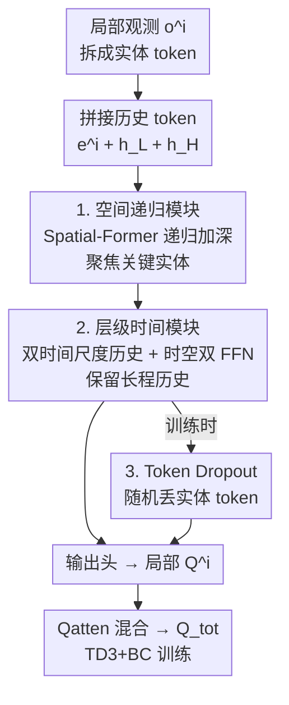

# STAIRS-Former: Spatio-Temporal Attention with Interleaved Recursive Structure Transformer for Offline Multi-Task Multi-Agent Reinforcement Learning

**会议**: ICLR 2026  
**OpenReview**: [https://openreview.net/forum?id=Biz1vpQeLI](https://openreview.net/forum?id=Biz1vpQeLI)  
**代码**: [https://github.com/Jiwonjeon9603/Stairs-Former](https://github.com/Jiwonjeon9603/Stairs-Former)  
**领域**: 强化学习  
**关键词**: 离线多智能体RL, 多任务泛化, Transformer, 时空注意力, 部分可观测

## 一句话总结
针对离线多任务多智能体强化学习（MT-MARL）中现有 Transformer 没把注意力用好、历史信息几乎被浪费的问题，STAIRS-Former 用「递归空间 Transformer + 双时间尺度历史模块 + token dropout」重构架构，让注意力真正聚焦关键实体和历史 token，在 SMAC / SMAC-v2 等基准上把平均胜率从 HiSSD 的 57.2% 抬到 67.4%，刷新 SOTA。

## 研究背景与动机
**领域现状**：离线 MARL 想从固定数据集里学到能在多任务、变化智能体数量下都好用的协同策略。为应对「不同任务智能体数量不同」这一独特难点，主流做法（ODIS、HiSSD）沿用 UPDeT：把每个智能体观测 $o^i$ 按语义拆成「自身信息 / 其他智能体 / 环境实体」三类实体，各自线性 tokenize 成 token，再附加一个历史 token，喂进一个 Transformer 输出局部 Q 值。Transformer 参数与 token 数量无关，因此智能体增减时旧参数可复用，天然支持变长输入。

**现有痛点**：作者在 SMAC Marine-Easy 上分析了 SOTA 方法 HiSSD 的注意力图，发现两个硬伤。其一，ODIS/HiSSD 都只用**单层（depth 1）** UPDeT，一层 Transformer 表达力不足，注意力在所有 token 上近乎**均匀分布**（见原文 Fig.2），无论是已见任务（3m）还是未见任务（4m）都抓不住关键实体。其二，UPDeT 对历史 token 的处理本质上只是一个简单 RNN：$e^i_{hs,t+1} = W_{down}\sigma(W_{up}(A_t e^i_{hs,t} + B_t o^i_t))$，这种线性组合无法保留部分可观测环境里至关重要的长时历史，结果这个「信息贫乏」的历史 token 在其他位置也几乎不被关注。

**核心矛盾**：前人把 Transformer 仅仅当成「处理观测维度随任务变化」的工具，却没有发挥它建模序列历史和复杂 token 关系的本职能力——空间上抓不住关键实体相关性，时间上留不住长程历史，二者都被浪费。

**本文目标**：在保持 UPDeT 变长可扩展性的前提下，让架构同时具备 (a) 在实体间做更丰富的关系推理、(b) 有效利用长程历史、(c) 对未见智能体配置鲁棒泛化。

**核心 idea**：给 Transformer 同时加上**空间层级**（递归加深的 Spatial-Former 聚焦关键实体）与**时间层级**（双更新频率的历史状态 + 时空分离 FFN 保留长程历史），并用 **token dropout** 在训练时模拟变长实体集合提升泛化。

## 方法详解

### 整体框架
STAIRS-Former 的输入是每个智能体 $i$ 的实体级局部观测序列，输出是局部 Q 值，再经 Qatten 混合网络聚合成全局 $Q_{tot}$ 做 TD 学习。整条 pipeline 包含两个可训练网络：空间 Transformer $f(\cdot;\theta_S)$（Spatial-Former）和一个 GRU $g(\cdot;\psi)$。流程是：先把观测拆成实体 token，与两个不同更新频率的历史 token 拼接，送进 Spatial-Former 递归地做深层关系推理；Spatial-Former 内部每个注意力块后挂两条独立 FFN，分别精炼实体 token 与历史 token；输出的历史位置被读出来更新低频/高频历史状态；最终空间表征经输出头得到每个动作的 Q 值，再由 Qatten 混合。训练阶段额外施加 token dropout 随机丢弃实体 token，并用 TD3+BC 风格目标优化。

### 关键设计

**1. 空间递归模块：用递归加深的 Spatial-Former 把均匀注意力扭成聚焦关键实体**

这一设计直接针对「单层 UPDeT 注意力均匀、抓不住关键实体」的痛点。STAIRS-Former 把浅层 Transformer 换成一个**递归深层 Transformer**：让 Spatial-Former 拥有 $M$ 个不同的层，每层 $l$ 的权重 $\theta_l$ 被**共享地重复施加** $\nu_l$ 次（标称 $\nu_l=1$），以在不膨胀参数量的前提下加深关系推理。初始输入是实体嵌入与历史 token 拼接的序列 $z^0 = [e^i, h_L, h_H]$；在第 $l$ 层，递归状态初始化为 $z^l_0 = 0$，然后结合上一层的最终状态 $z^{l-1}$ 递归更新：

$$z^l_{j+1} = f\!\left(z^l_j + z^{l-1};\, \theta_l\right),\quad j=0,\dots,\nu_l-1.$$

每层最终态 $z^l := z^l_{\nu_l}$ 传给下一层，所有 $M$ 层跑完后得到空间表征 $z_{sp}=z^M$，再过输出头 $Q(o^i,\cdot)=f_O(z_{sp};\theta_O)$。这种「权重共享 + 残差式递归」让模型在控制参数成本的同时获得更深的关系推理能力，使注意力能在己方/敌方/环境实体之间挑出真正重要的那些——原文 Fig.4 显示替换后注意力明显从均匀变为聚焦关键实体与历史 token。

**2. 层级时间模块：双时间尺度历史 + 时空分离 FFN 把长程历史真正留住并用上**

部分可观测下每个智能体只看到局部 $o^i_t$ 而非全局状态 $s_t$，UPDeT 那种单历史 token + 简单 RNN 留不住长程信息。本设计让每个智能体同时维护**两个不同更新频率**的历史状态：低层历史 $h^{i,L}_t$ **每步**更新，高层历史 $h^{i,H}_t$ **每 $T_H$ 步**才由 GRU 更新一次：

$$h^{i,L}_t = z_{sp}[-2,:],\qquad h^{i,H}_t = \begin{cases} g(h^{i,H}_{t-1}, h^{i,L}_t;\psi), & t \equiv 0 \bmod T_H,\\ h^{i,H}_{t-1}, & \text{否则.}\end{cases}$$

二者皆零初始化。低层历史保证对即时变化的快速响应，高层历史则做长程摘要，于是 $t$ 时刻 Transformer 输入是长度 $K_a+K_e+3$ 的 token 集合 $\{e^i_t, h^{i,L}_{t-1}, h^{i,H}_{t-1}\}$。除了双频率，本设计还引入**时空分离的双 FFN**（Temporal Focus Layer, TFL）：注意力块后若用单条共享 FFN，会把「实体 token 的关系内容」和「历史 token 的时间演化」混在一起。作者据「两层 FFN 实际在做 key 匹配 + value 重构」的视角，给每个注意力块挂两条参数不共享的 position-wise FFN，$\tilde{x}^l_{j,obs}=\text{FFN}_{obs}(x^l_{j,obs})$、$\tilde{x}^l_{j,his}=\text{FFN}_{his}(x^l_{j,his})$，再拼回 $z^l_j$。这样空间关系推理与时间抽象沿各自路径精炼，彼此专精又互不干扰；后文的 dormant neuron 分析也证实 TFL 显著降低了观测 token 的「休眠神经元」比例。

**3. Token Dropout：训练时随机丢实体 token，逼模型适应变长配置**

未见任务的实体数 $K$ 会随智能体/敌方数量变化，虽然 Transformer 能吃变长输入，但训练只见过 $C_{train}$ 里的实体数，遇到新配置容易掉点。Token dropout 在训练时以概率 $p_{drop}$ 随机丢弃 $e^i=(e^i_{own}, e^i_{oa,1:K_a}, e^i_{en,1:K_e})$ 中的实体嵌入，但**三类 token 受保护不丢**：(1) 自身实体 $e^i_{own}$（稳定学习的核心）；(2) 两个历史 token $h^{i,L}, h^{i,H}$；(3) 当策略头像 UPDeT 那样把动作绑定到 per-entity 输出时，与数据集动作关联的那个实体 token（尊重离线正则）。通过在训练中持续暴露于变长 token 集合，模型对未见实体配置的鲁棒性提升、对 $C_{train}$ 的过拟合被抑制，消融显示它对未见任务泛化贡献明显。

### 损失函数 / 训练策略
训练采用适配离散动作空间的 **TD3+BC 风格**目标，把 TD 学习与行为克隆（BC）正则结合。每个智能体输出 $Q^i_t=Q(o^i_{0:t},a^i_{0:t};\theta)$，经 Qatten 混合网络得到全局 $Q_{tot}(\tau_t,s_t,a_t;\theta,\phi)$。TD 目标为 $y_t = r_t + \gamma \max_{a'} Q_{tot}(\tau_{t+1},s_{t+1},a';\bar\theta,\bar\phi)$，总损失为

$$L_{STAIRS}(\theta,\phi) = \mathbb{E}\Big[\underbrace{(Q_{tot}(\tau_t,s_t,a_t;\theta)-y_t)^2}_{\text{TD loss}} - \frac{\lambda}{N}\sum_{i=1}^{N}\underbrace{Q(o^i_{0:t},a^i_{0:t};\theta)}_{\text{BC loss}}\Big],$$

第一项拟合 TD 目标，第二项鼓励数据集动作有更高 Q 值，$\lambda$ 控制正则强度。训练期间施加 token dropout，目标网络按固定间隔更新。

## 实验关键数据

### 主实验
在 SMAC（Marine-Easy / Marine-Hard / Stalker-Zealot）及 SMAC-v2 上评测离线 MT-MARL，每个任务集划分为已见（训练）与未见（测试）任务，并各配 Expert / Medium / Medium-Expert / Medium-Replay 四种数据质量，5 个随机种子取均值。下表为按数据质量平均后的胜率（%）：

| 场景 | UPDeT-m | ODIS | HiSSD | STAIRS (本文) |
|------|---------|------|-------|---------------|
| 已见·Marine-Hard | 21.2 | 47.9 | 64.6 | **79.0** |
| 已见·Marine-Easy | 44.3 | 59.3 | 83.9 | **91.2** |
| 已见·Stalker-Zealot | 20.3 | 34.8 | 45.9 | **63.4** |
| 已见·均值 | 28.6 | 47.3 | 64.8 | **77.9** |
| 未见·均值 | 21.6 | 32.3 | 54.7 | **64.0** |
| **总均值** | 23.5 | 37.0 | 57.2 | **67.4** |

相比前 SOTA HiSSD，STAIRS-Former 在 Marine-Hard / Stalker-Zealot 的次优数据集（Medium / Medium-Expert / Medium-Replay）上平均分别提升 39.5% / 36.6% / 40.5%；在需要异构单位复杂交互的 Stalker-Zealot 上平均高出 HiSSD 达 48.6%。SMAC-v2（更强随机性）上同样全面领先：

| SMAC-v2 | UPDeT-m | ODIS | HiSSD | STAIRS (本文) |
|---------|---------|------|-------|---------------|
| 已见·均值 | 9.1 | 12.7 | 25.1 | **31.0** |
| 未见·均值 | 6.7 | 10.9 | 24.1 | **30.0** |
| 总均值 | 7.4 | 11.5 | 24.4 | **30.3** |

### 消融实验
三大组件逐一移除（"ST"=空间+时间，"STD"=ST+dropout），按数据质量平均的胜率（%）：

| 配置 | 已见·均值 | 未见·均值 | 总均值 | 说明 |
|------|-----------|-----------|--------|------|
| STAIRS (Full) | **77.9** | **64.0** | **67.4** | 完整模型 |
| w/o Temporal | 76.2 | 60.6 | 64.6 | 去时间模块 |
| w/o Spatial | 72.4 | 60.2 | 63.1 | 去空间模块，已见掉点最多 |
| w/o Dropout | 76.0 | 61.8 | 65.4 | 去 token dropout |
| w/o ST | 69.0 | 58.7 | 61.4 | 同时去空间+时间 |
| w/o STD | 69.6 | 53.2 | 57.3 | 三者全去 |

### 关键发现
- **空间模块主导已见任务**：去掉空间递归模块时已见均值从 77.9% 掉到 72.4%（掉点最多），说明丰富的实体相关性是抓住已知环境结构化交互的关键；而在已见任务上 dropout 和时间抽象单独贡献较小。
- **未见任务需要三者协同**：在未见任务上空间/时间/dropout 缺一不可，三者齐备才达到 64.0% 的最佳泛化——dropout 缓解过拟合、时间层级保留长程历史、空间层级帮助识别关键 token 适应新配置。
- **休眠神经元分析佐证机制**：空间与时间模块都降低了「休眠神经元」比例，其中时间模块效果更强；进一步拆解发现 Temporal Focus Layer（双 FFN）显著降低了驱动 Q 值估计的观测 token 的休眠比例，是性能提升的核心。
- **注意力可解释性**：在 3m 场景随时间观察注意力，STAIRS-Former 能在「己方稳定 → 遭遇敌人转向敌方 token → 保护残血队友 → 用历史 token 决策撤退/反击」之间自适应切换，并学到 focus fire、kiting 等高层战术；而基础 Transformer 注意力始终近乎均匀。

## 亮点与洞察
- **「递归加深 + 权重共享」是性价比很高的加深方式**：用 $\nu_l$ 次重复施加同一层参数换取更深的关系推理，既治好了单层 Transformer 注意力均匀的病，又不让参数量爆炸，这个 trick 可迁移到任何受参数预算约束又想加深的 Transformer 策略网络。
- **双时间尺度历史是对部分可观测的直接回应**：低频/高频两条历史分别管「即时响应」和「长程摘要」，比 UPDeT 单历史 token 的简单 RNN 更贴合 POMDP 需求；这种「快慢双时钟」思路在序列决策里很通用。
- **用 dormant neuron 反推组件作用很巧**：作者没止步于消融掉点，而是用休眠神经元比例去解释「为什么 TFL 有用」，把性能差异落到「模型容量利用率」上，是把可解释性和消融绑在一起的好范例。

## 局限与展望
- 评测集中在 SMAC 系（StarCraft 微操）及 MPE/MaMuJoCo，单位类型相同、只是数量不同，对真正异质任务（不同动力学/奖励语义）的迁移仍待验证。
- 在最难、智能体数最多的未见任务（如 13m15m、10m12m）上所有方法胜率都接近 0，STAIRS 也未能突破，说明对「远超训练规模的智能体数量」外推仍是开放难题。
- 引入了递归次数 $\nu_l$、高层更新周期 $T_H$、dropout 概率 $p_{drop}$ 等新超参，缓存正文未充分给出其敏感性分析，实际部署需要调参成本。
- 方法仍是值分解 + Qatten 混合的离线范式，未探索与在线微调（如 HyGen 思路）结合，可作为后续提升泛化的方向。

## 相关工作与启发
- **vs UPDeT / ODIS / HiSSD**：三者都用 UPDeT 风格单层 Transformer，把 Transformer 仅当作处理变长观测的工具，注意力均匀、历史 token 退化为简单 RNN。STAIRS-Former 区别在于真正发挥 Transformer 建模 token 关系与序列历史的能力——递归加深空间推理、双时间尺度保留长程历史，因此在已见和未见任务上都全面超越，尤其在异构 Stalker-Zealot 上领先 HiSSD 48.6%。
- **vs 单任务离线 MARL（CFCQL / OMAR / OMIGA / B3C / MA-ICQ）**：这些方法主攻离线训练稳定性（保守估计、正则、行为克隆 + critic clipping），但局限于单任务，不解决多任务泛化与变化智能体数量；本文聚焦的是「跨任务、变智能体数的泛化」这条正交线。
- **vs 表示/技能迁移类（M3 / DT2GS / Multi-Task Shared Layers）**：它们强调解耦智能体不变/特定表示或分解子任务来促迁移，但未处理「如何关注历史上下文与变化的智能体交互」这类对部分可观测鲁棒策略至关重要的因素——而这正是 STAIRS-Former 的着力点。

## 评分
- 新颖性: ⭐⭐⭐⭐ 把空间递归 + 双时间尺度历史 + token dropout 系统地嵌进 MT-MARL Transformer，针对前人「注意力没用好」的诊断给出对症方案，组合创新扎实。
- 实验充分度: ⭐⭐⭐⭐⭐ 覆盖 SMAC/SMAC-v2 多任务集 × 四种数据质量 × 5 种子，主结果 + 消融 + 注意力可视化 + 休眠神经元分析齐全。
- 写作质量: ⭐⭐⭐⭐ 动机由注意力图诊断驱动，逻辑清晰；公式与组件对应明确，个别符号（如 $z_{sp}[-2,:]$ 读历史位置）需对照图理解。
- 价值: ⭐⭐⭐⭐ 在离线 MT-MARL 上刷新 SOTA 且开源，递归加深与双时钟历史的思路对受预算约束的 Transformer 策略网络有借鉴意义。

<!-- RELATED:START -->

## 相关论文

- [\[CVPR 2026\] TaskForce: Cooperative Multi-agent Reinforcement Learning for Multi-task Optimization](../../CVPR2026/reinforcement_learning/taskforce_cooperative_multi-agent_reinforcement_learning_for_multi-task_optimiza.md)
- [\[ICLR 2026\] LadderSym: A Multimodal Interleaved Transformer for Music Practice Error Detection](laddersym_a_multimodal_interleaved_transformer_for_music_practice_error_detectio.md)
- [\[CVPR 2026\] MangoBench: A Benchmark for Multi-Agent Goal-Conditioned Offline Reinforcement Learning](../../CVPR2026/reinforcement_learning/mangobench_a_benchmark_for_multi-agent_goal-conditioned_offline_reinforcement_le.md)
- [\[ICLR 2026\] MAGE: Multi-scale Autoregressive Generation for Offline Reinforcement Learning](mage_multi-scale_autoregressive_generation_for_offline_reinforcement_learning.md)
- [\[ICML 2025\] Mastering Massive Multi-Task Reinforcement Learning via Mixture-of-Expert Decision Transformer](../../ICML2025/reinforcement_learning/mastering_massive_multi-task_reinforcement_learning_via_mixture-of-expert_decisi.md)

<!-- RELATED:END -->
