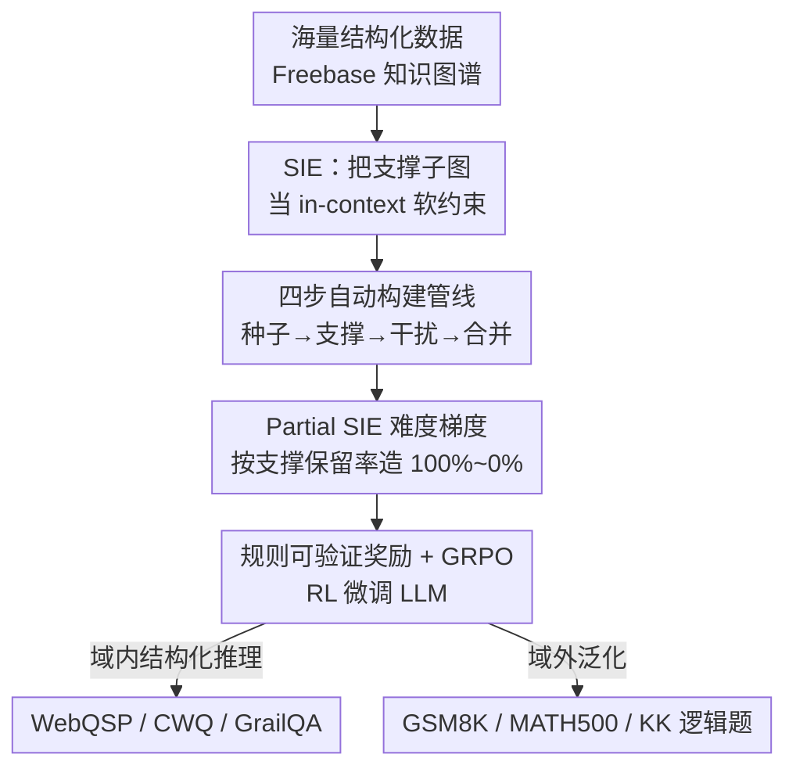

# Structured In-context Environment Scaling for Large Language Model Reasoning

**会议**: ICLR 2026  
**OpenReview**: [https://openreview.net/forum?id=CicK2lJMUy](https://openreview.net/forum?id=CicK2lJMUy)  
**代码**: https://github.com/PursuitYP/SIE_ICLR  
**领域**: 强化学习 / LLM推理  
**关键词**: RL 微调环境, 结构化数据, 知识图谱, 组合推理, 泛化

## 一句话总结
本文提出 **结构化 in-context 环境（SIE）** 框架，从大规模知识图谱自动构造可扩展、可泛化、可验证的 LLM 推理环境，把支撑子图当作 prompt 里的软约束，用 GRPO 做 RL 微调；不仅在结构化推理任务上大幅提升，学到的组合推理能力还能迁移到数学与逻辑推理等域外任务。

## 研究背景与动机

**领域现状**：用强化学习（RL）做后训练，已成为激发 LLM 复杂推理能力的主流范式——模型从环境反馈中学到自我反思、回溯、思维链等策略，在数学和代码上进步显著。但绝大多数研究都把精力放在 RL **算法优化**（如 GRPO、PPO 改进）上，对"环境本身"这个同样关键的因素关注不足。

**现有痛点**：环境的内在性质直接决定了模型能学到什么能力，而一个理想的 LLM 推理环境应同时具备三个特性——**可扩展性**（能低成本自动从海量数据造大规模环境）、**可泛化推理**（学到的策略能迁移到通用推理域）、**可验证性**（有明确规则判定答案对错）。现有环境都不全占：数学这类"内化规则"环境依赖昂贵的专家标注，难以规模化；游戏引擎这类"外化规则"环境虽然规则明确，但学到的技能太专用、泛化不出去。

**核心矛盾**：可扩展性与可泛化性之间存在张力——能自动造大规模的环境往往技能太窄，能学到通用推理的环境又造不大。要打破这个 trade-off，需要一种既能自动批量构造、学到的又是通用组合推理能力的数据源。

**切入角度**：作者把目光投向**结构化数据**（按预定义 schema 组织、字段/类型/约束都明确的数据，如知识图谱、表格）。它有三重天然优势：现实世界结构化资源海量，可通过多跳检索与组合自动造环境（解决可扩展）；结构化数据是人类经验与领域知识的高度浓缩，从中学的推理模式有望泛化到通用任务（解决可泛化）；显式的 schema 和约束允许严格的基于规则的验证（解决可验证）。

**核心 idea**：把知识图谱中"从问题到答案"的支撑子图抽出来，当作 LLM prompt 里的 **in-context 软约束环境**，让 LLM 在这个上下文里做多跳组合推理（隐式 MDP 探索），再用基于规则的可验证奖励驱动 GRPO 微调——用结构化环境替代专家标注，同时把组合推理能力训出来。

## 方法详解

### 整体框架

SIE 框架做两件事：**先从大规模 KG 自动构造结构化 in-context 环境，再把环境当软约束用 RL 微调 LLM**。形式化上，KGQA 任务被建模成一个隐式 MDP——对第 $i$ 个样本在时刻 $t$，状态 $s_{i,t}$ 是当前已探索的子图，动作 $a_{i,t}$ 是选择下一个待探索的实体，状态转移反映动作后更新的子图，最终奖励 $r_i$ 由外部验证器根据 LLM 的回答 $y_i$ 给出。每个样本表示为（问题 $Q$、结构化上下文 $SI$、答案 $A$），$SI$ 被放进推理 prompt 充当软约束，LLM 的输出直接用来算奖励信号。

构造侧是一条四步自动管线：① 种子子图检索 → ② 支撑子图提取 → ③ 干扰子图过滤 → ④ 构造 partial SIE；训练侧用 GRPO 在构造好的 SIE 内做 RL 微调。

### 关键设计

**1. SIE：把结构化子图编码为 in-context 软约束环境**

针对"现有环境要么造不大、要么不泛化"的痛点，本文不去显式实现一个带硬转移函数的环境引擎，而是把环境的动态性**编码进结构化上下文、塞进 LLM 的 prompt 当软约束**。LLM 在这段上下文里的探索被建模为隐式动作，输出直接导出奖励。这种"松弛"设计的好处是实现和扩展都简单——不需要为每个任务写一套环境规则，只要换一份结构化数据就能换一个 MDP，而且能无缝接入主流 RL 算法。具体实例化时选知识图谱：KG 三元组是人类知识的高度结构化表示、含领域认知原语，多个三元组连成的多跳路径天然对应复杂推理过程，正好当组合推理能力的"脚手架"。

**2. 四步自动构建管线：从 KG 精准抽出支撑子图**

这是"可扩展"落地的核心。给定一条 KGQA 实例（问题 $Q$、答案 $A$、问题实体集 $E_Q$、答案实体集 $E_A$），管线分四步把局部环境抽出来：

- **种子子图检索**：以问题实体为种子做多跳检索得到 $G_{seed}$。朴素 BFS 会指数爆炸（Freebase 含 256 万实体、830 万三元组，单点三跳能产出几十万三元组），所以用**双向检索**——从问题侧和答案侧同时多跳，并强制两侧跳数之和等于任务最大跳数（$q_{hop}+a_{hop}=n_{hop}$），大幅压缩子图规模：$$G_{seed} = \text{MultiHopSearch}(G, E_Q, q_{hop}) \cup \text{MultiHopSearch}(G, E_A, a_{hop})$$
- **支撑子图提取**：在 $G_{seed}$ 上用 Dijkstra 算法找 $E_Q$ 到 $E_A$ 在 $n_{hop}$ 限内的所有最短路，得到含完整推理路径的支撑子图 $G_{support}=\text{ShortestPathSearch}(G_{seed}, E_Q, E_A, n_{hop})$（保留所有问题实体和 top-10 答案）。因 $Q$ 与 $G$ 语义错配，部分问题的支撑子图可能为空，作者**故意保留**这些样本以研究环境不完整对推理的影响。
- **干扰子图过滤**：从种子里减去支撑得到干扰集 $G_{seed}\setminus G_{support}$（平均近万条三元组，超 LLM 上下文长度）。用预训练 cross-encoder `ms-marco-MiniLM-L12-v2` 做两阶段重排——先**关系过滤**（按关系与 $Q$ 的语义相似度留 top 关系 $rel_{retain}$），再**三元组过滤**（只在 $rel_{retain}$ 的关系里按与 $Q$ 的相似度留 top 三元组），既保留有挑战性的干扰、又压进上下文长度。

这条管线让"造环境"完全自动化，是 SIE 可扩展性的来源。

**3. Partial SIE：按支撑信息保留率造难度梯度**

针对"如何系统研究信息受限下推理如何演化"的问题，第四步把支撑子图和干扰子图合并并随机打乱：$$\text{SIE-ratio} = \text{Shuffle}(\text{Retain}(G_{support}, ratio) \cup G_{distract})$$ 通过控制支撑子图的保留比例 $ratio\in\{100\%,75\%,50\%,25\%,0\%\}$，并相应调整 $G_{distract}$ 大小以保持上下文总长不变，构造出 SIE-100% 到 SIE-0% 五档逐渐变难的环境。SIE-0% 意味着支撑信息全被移除、只剩干扰。这套梯度模拟了从"信息完整"到"逐渐不完整"的连续过程，关键发现是：在 SIE-25%/SIE-0% 这类极端缺信息场景下 RL 仍能稳定提升——因为模型的推理范式从**浅层上下文检索**被逼向**深层组合推理**（学会探索环境、组合自身参数化知识），这正是泛化能力的来源。

**4. 规则可验证奖励 + GRPO 微调**

把 SIE 当软约束后，微调就很方便：输入 $x=(Q, SI)$，GRPO 从旧策略采一组回答 $\{y_1,...,y_G\}$，用组内相对打分当 baseline 算优势 $A_i=\frac{r_i-\text{mean}(\{r\})}{\text{std}(\{r\})}$，无需单独的 critic 模型，简化训练。奖励是**基于规则可验证**的两部分：答案奖励（从 `<answer>` 标签抽最终答案与真值精确匹配，对得 1.0、错得 0.0）+ 格式奖励（鼓励模型遵守 `<think>`/`<answer>` 范式）。这种规则奖励有效防止 reward hacking，确保模型朝正确推理目标优化，引导 LLM 学到结构化环境里内蕴的组合推理范式。

## 实验关键数据

实验围绕四个 RQ：SIE 能否提升结构化推理（RQ1）、SIE 比结构化推理数据 SFT 是否更高效（RQ2）、能否泛化到域外（RQ3）、partial SIE 如何影响表现（RQ4）。训练基于 Freebase + WebQSP/CWQ，在 Qwen2.5-7B(-Instruct)、Llama3.1-8B-Instruct、Qwen3-8B 上用 GRPO 微调（VeRL 框架，prompt 长 8192、response 长 2048），全程严格零样本、报 pass@1。

### 主实验

RL w/ SIE vs RL w/o Context（去掉结构化上下文），结构化推理任务平均提升（四个模型）：

| 数据集 | w/o Context（均） | w/ SIE（均） | 平均提升 |
|--------|------|------|----------|
| WebQSP | ~58 | ~92.5 | +34.4% |
| CWQ | ~36 | ~86 | +50.2% |
| GrailQA（held-out 域内泛化） | ~22 | ~84 | +62.6% |

与 SFT w/ SRD（用 DeepSeek-R1 蒸馏出的结构化推理数据做 SFT）对比（Qwen2.5-7B-Instruct / Llama3.1-8B-Instruct）：

| 方法 | WebQSP | CWQ | GrailQA | 相对 CoT 均提升 |
|------|--------|-----|---------|-----------------|
| CoT | 26.3 / 36.5 | 34.4 / 37.2 | 40.5 / 43.6 | — |
| SFT w/ SRD | 40.5 / 43.4 | 43.3 / 49.5 | 55.7 / 60.0 | +11.4% |
| RL w/ SIE | 93.4 / 93.2 | 87.7 / 89.7 | 85.8 / 85.0 | +53.7% |

RL w/ SIE 比 SFT w/ SRD 在三个结构化任务上额外多出 >40% 增益，说明环境探索式 RL 比模仿式 SFT 更高效。

域外泛化（RL w/ SIE vs CoT，四模型平均提升）：GSM8K +20.4%、MATH500 +18.1%、KK-easy +12.3%、KK-hard +11.1%，证明结构化推理能力能迁移到数学/逻辑域。

### 消融与分析

| 配置 | 关键发现 | 说明 |
|------|---------|------|
| Partial SIE 100%→0%（WebQSP，四模型均提升） | +64.2 → +52.5% | 难度升高表现略降，但 SIE-0% 仍稳定大幅提升 |
| Partial SIE 的域外泛化（Qwen2.5-7B-Inst） | +40.3% → +38.6% | 五档泛化增益几乎持平，缺信息不损泛化 |
| RL 算法（GRPO/REINFORCE++/PPO） | GRPO≈REINFORCE++ > PPO | SIE 对主流 RL 算法普适 |
| RL w/ SIE f/ SFT（SFT 冷启动后再 RL） | 结构化↓、泛化↑ | WebQSP 88.5 vs 93.4；KK-hard 33.5 vs 29.0，存在 trade-off |

### 关键发现

- **信息受限是特性不是缺陷**：SIE-0% 把支撑信息全删，模型反而被逼着从"浅层 KG 检索"转向"调用自身参数化知识做深层多跳组合推理"。案例研究显示，微调前模型在缺信息时幻觉编造答案，微调后会识别信息不足、结合内在知识正确作答。
- **泛化对环境完整度不敏感**：partial SIE 五档的域外泛化增益（~40%→38.6%）几乎不掉，说明学到的是可迁移的组合推理范式，而非对特定子图的记忆。
- **SFT 冷启动的双刃剑**：先 SFT 再 RL 能提升数学/逻辑泛化，但限制了模型对环境的探索，反而压低结构化推理表现——长链 SFT 数据利于泛化但约束探索。

## 亮点与洞察
- **把"造环境"问题转化为"抽子图"问题**：用 KG 多跳路径当组合推理脚手架，一举解决可扩展（自动检索）+ 可泛化（知识浓缩）+ 可验证（schema 规则）三难，是很漂亮的问题重构。
- **软约束 in-context 环境**：不写硬环境引擎，把环境塞进 prompt 当软约束，换数据即换 MDP，无缝接主流 RL 算法——这个"松弛"设计可迁移到任何有结构化数据源的领域（表格、本体、代码 AST 等）。
- **用信息受限主动塑造推理范式**：通过保留率梯度把模型从"检索"逼向"组合"，这个"故意制造信息缺口来训深推理"的思路，对设计推理训练数据很有启发。

## 局限与展望
- 仅在知识图谱（Freebase）这一种结构化数据上验证，表格、关系数据库等其他结构化源的效果未知。
- 域外泛化只测了数学（GSM8K/MATH500）和逻辑（KK 谜题），是否能迁移到代码、规划等更广推理域待验证。
- Qwen3-8B 在 MATH500 上初始准确率偏低，源于其常生成超长或不合格式的回答导致与可验证答案错配——说明可验证奖励对"输出格式不配合"的模型存在适配问题。
- SFT 冷启动后再 RL 的 trade-off（泛化↑结构化↓）尚无统一解法，如何兼得两者是开放问题。

## 相关工作与启发
- **vs 数学/代码环境**：它们靠预训练内化规则、构造依赖专家标注难扩展；SIE 从 KG 自动抽子图造环境，可扩展性强，且显式可验证。
- **vs 游戏引擎环境**：规则外化明确但技能太专用、不泛化；SIE 的组合推理能迁移到数学/逻辑域外任务。
- **vs SFT on SRD（结构化推理数据蒸馏 + 监督微调）**：SFT 是模仿学习、增益有限（~11%）；SIE 的 RL 鼓励环境探索，增益高得多（~54%），且学到可泛化的探索-组合策略而非死记长链。

## 评分
- 新颖性: ⭐⭐⭐⭐⭐ 把环境构造从"算法视角"拉回"数据/环境视角"，用结构化数据软约束统一可扩展/可泛化/可验证三性
- 实验充分度: ⭐⭐⭐⭐⭐ 四模型 × 多任务 × partial 梯度 × 三种 RL 算法 × SFT 冷启动对比，RQ 设计完整
- 写作质量: ⭐⭐⭐⭐ 三特性主线清晰、管线公式齐全；部分构造细节（cross-encoder 阈值、top-k 取值）略简
- 价值: ⭐⭐⭐⭐⭐ 提供了一条低成本自动造可泛化 RL 推理环境的可行路径，对 RL 后训练数据工程有直接借鉴

<!-- RELATED:START -->

## 相关论文

- [\[ICLR 2026\] Toward Efficient Exploration by Large Language Model Agents](toward_efficient_exploration_by_large_language_model_agents.md)
- [\[ICLR 2026\] Squeeze the Soaked Sponge: Efficient Off-Policy RFT for Large Language Model](squeeze_the_soaked_sponge_efficient_off-policy_rft_for_large_language_model.md)
- [\[ICLR 2026\] Buffer Matters: Unleashing the Power of Off-Policy Reinforcement Learning in Large Language Model Reasoning](buffer_matters_unleashing_the_power_of_off-policy_reinforcement_learning_in_larg.md)
- [\[ICLR 2026\] The Markovian Thinker: Architecture-Agnostic Linear Scaling of Reasoning](the_markovian_thinker_architecture-agnostic_linear_scaling_of_reasoning.md)
- [\[ICLR 2026\] Improving and Accelerating Offline RL in Large Discrete Action Spaces with Structured Policy Initialization](improving_and_accelerating_offline_rl_in_large_discrete_action_spaces_with_struc.md)

<!-- RELATED:END -->
