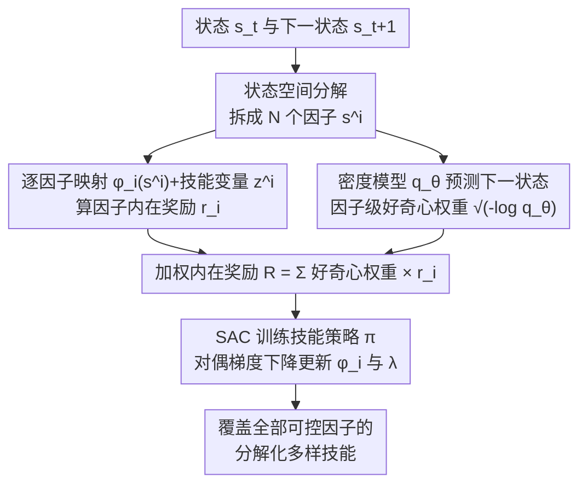

# SUSD: Structured Unsupervised Skill Discovery through State Factorization

**会议**: ICLR 2026  
**arXiv**: [2602.01619](https://arxiv.org/abs/2602.01619)  
**代码**: [https://github.com/hadi-hosseini/SUSD](https://github.com/hadi-hosseini/SUSD)  
**领域**: 无监督技能发现 / 强化学习  
**关键词**: 无监督技能发现, 状态分解, 距离最大化, 好奇心驱动, 层次强化学习

## 一句话总结

提出 SUSD（Structured Unsupervised Skill Discovery），通过将状态空间分解为独立因子并为每个因子分配专属技能变量，结合好奇心驱动的因子加权机制，实现在多物体/多智能体复杂环境中发现覆盖全部可控因子的多样化技能。

## 研究背景与动机

- **无监督技能发现（USD）的目标**：在无外部奖励下自主学习多样化技能，用于下游任务
- **两大技术路线**：
    - **互信息（MI）方法**（DIAYN 等）：最大化技能变量与状态的互信息，但因变换不变性倾向学习简单静态行为
    - **距离最大化（DSD）方法**（CSD、METRA 等）：通过最大化状态空间距离鼓励动态行为，但在复杂多物体环境中只关注最易控制的因子
- **DSD 的关键局限**：缺乏确保技能多样性覆盖所有可控因子的机制。在 Ant、HalfCheetah 等简单环境中表现好，但在多物体环境（多智能体、厨房）中退化。
- **核心解决思路**：利用环境的组合结构作为归纳偏置，将状态空间分解，为每个因子学习专属技能。

## 方法详解

### 整体框架

SUSD 站在距离最大化技能发现（distance-maximizing skill discovery, DSD）的肩膀上，要解决的痛点是：DSD 在多物体环境里只会学最易控制的那个因子的技能，其余物体被忽略。它的做法是把单一的"状态→技能"映射拆成与环境组合结构对齐的多个独立通道——状态先分解成 $N$ 个因子，每个因子配一套专属的嵌入网络 $\phi_i$ 和技能变量 $z^i$、各自算一份因子内在奖励；同时一个密度模型预测下一状态，给每个因子算一个"好奇心"权重，衡量它现在有多难推动；最后把因子级奖励按好奇心权重加权求和，作为内在奖励喂给 SAC 训练底层技能策略，映射函数与约束乘子则用对偶梯度下降交替更新。整套流程无外部奖励、端到端。

### 关键设计

**1. 状态空间分解：让每个因子各自学技能，避免被最易控因子垄断**

DSD 的退化根源在于它用一个全局映射 $\phi$ 去最大化整个状态的位移距离，结果策略只会死磕最容易推动的那个因子（比如智能体自身位置），其余物体永远学不到技能。SUSD 借助环境天然的组合结构作为归纳偏置，把状态空间写成笛卡尔积 $\mathcal{S} := \mathcal{S}^1 \times \cdots \times \mathcal{S}^N$，技能空间同步分解为 $\mathcal{Z} := \mathcal{Z}^1 \times \cdots \times \mathcal{Z}^N$，并把映射函数拆成 $N$ 个互不干涉的子网络 $\phi_i(s^i)$，每个只处理对应因子。于是单一的距离最大化目标变成逐因子求和：

$$\sup_{\pi, \{\phi_i\}_{i=1}^N} \mathbb{E}_{p(\tau, z)} \sum_{i=1}^N \sum_{t=0}^{T-1} (\phi_i(s_{t+1}^i) - \phi_i(s_t^i))^\top z^i, \quad \text{s.t.}\ \sum_{i=1}^N \|\phi_i(s'^i) - \phi_i(s^i)\|_2 \leq 1,\ \forall (s, s') \in \mathcal{S}_{\text{adj}}$$

因为每个因子有独立的技能变量 $z^i$，策略必须为每个因子都产生可区分的行为才能拿到对应的奖励项，从而强制把多样性铺满所有可控因子，而不是收敛到单一维度。

**2. 好奇心驱动的因子加权：把探索预算动态导向欠探索的因子**

即便分解了状态，各因子的探索难度也千差万别——有些因子早早学透、有些迟迟推不动，若一视同仁会浪费梯度在已饱和的因子上。SUSD 额外训练一个高斯密度模型 $q_\theta(s'|s) = \mathcal{N}(\mu_\theta(s), \Sigma_\theta(s))$ 预测下一状态；由于高斯分布的边际仍是高斯，按状态分解切分 $\mu_\theta$ 和对角 $\Sigma_\theta$ 就能拿到每个因子的边际，用其负对数似然来量化"好奇心"：

$$-\log q_\theta(s_{t+1}^i | s_t) \propto (s_{t+1}^i - \mu_\theta^i(s_t))^\top \Sigma_\theta^i(s_t)^{-1} (s_{t+1}^i - \mu_\theta^i(s_t))$$

值越大说明该转移越出乎密度模型意料、越是欠探索，越该加大关注。与 CSD 给整个状态转移共用一个粗粒度权重不同，SUSD 在每个因子上独立算权重，粒度细到能分辨"哪个物体还没玩明白"。这里的关键是 $\sqrt{-\log q_\theta(s_{t+1}^i|s_t)}$ 恰好是一个合法的距离度量，可以直接当作距离项的系数嵌进目标（Lemma 4.1 证明了这一点），所以加权不会破坏 DSD 的距离最大化语义。

**3. 加权内在奖励与对偶训练：把因子级信号合成一个可优化目标**

有了逐因子的距离项和好奇心权重，单个因子的技能奖励写作 $r_i^{\text{SUSD}} := (\phi_i(s_{t+1}^i) - \phi_i(s_t^i))^\top z^i$，再用好奇心权重加权求和得到策略实际收到的总内在奖励：

$$R := \sum_{i=1}^N \sqrt{-\log q_\theta(s_{t+1}^i | s_t)} \cdot r_i^{\text{SUSD}}$$

这样既保留了每个因子的方向性技能信号，又让欠探索因子在总奖励里占更大比重。优化时映射函数 $\{\phi_i\}$ 和约束的 Lagrange 乘子 $\lambda$ 通过对偶梯度下降交替更新，技能策略 $\pi(a|s,z)$ 用 SAC 在这个内在奖励上训练，密度模型等其余组件用随机梯度下降更新，整体仍是一个无外部奖励的端到端流程。

## 实验结果

### 下游任务表现（Multi-Particle 和 Kitchen 环境）

| 方法 | MP 平均回报 | Kitchen 平均回报 |
|------|------------|-----------------|
| DIAYN | 低 | 低 |
| LSD | 低 | 低 |
| CSD | 中 | 低 |
| METRA | 中 | 低-中 |
| DUSDi | 中 | 低 |
| **SUSD** | **高** | **高** |

SUSD 在复杂分解环境中显著优于所有基线，尤其 Kitchen 环境差距更大。

### 技能学习阶段的偶然任务完成

| 任务 | SUSD | CSD | METRA | LSD | DUSDi |
|------|------|-----|-------|-----|-------|
| BiP (黄油入锅) | **39.9±18.5** | 0.0 | 0.0 | 0.0 | 0.0 |
| MiP (肉丸入锅) | **58.9±25.8** | 0.0 | 0.0 | 0.0 | 2.5 |
| PoS (锅上灶) | **20.5±18.0** | 0.0 | 0.0 | 0.0 | 1.3 |

SUSD 在技能学习阶段就能偶然完成下游任务，其他方法完全做不到。

### 因子解码误差

| 方法 | Multi-Particle | Kitchen | 2D-Gunner |
|------|---------------|---------|-----------|
| **SUSD** | **0.060** | **0.014** | **0.080** |
| METRA | 0.147 | 0.028 | 0.186 |
| CSD | 0.313 | 0.049 | 0.404 |
| LSD | 0.308 | 0.038 | 0.224 |

SUSD 的潜在技能嵌入包含最丰富的因子信息。

### 关键发现

- SUSD 实现了显著更好的状态覆盖——尤其是最差智能体的覆盖率
- 在非分解环境（Ant、HalfCheetah）中仍保持竞争力
- 好奇心加权机制有效引导注意力到欠探索因子

## 亮点与洞察

1. **分解化 DSD 的首创**：将状态分解这一归纳偏置首次引入 DSD 框架
2. **细粒度好奇心加权**：不同于 CSD 的粗粒度（整个状态转移一个权重），SUSD 为每个因子独立计算权重
3. **可组合技能**：分解化技能表征天然支持技能组合和链接
4. **引理支撑**：通过 Lemma 4.1 严格证明距离项可作为内在奖励的系数

## 局限性

- 需要预先知道状态的分解结构（哪些维度属于哪个因子）
- 在像素输入场景中需要额外的解耦表征学习
- 技能空间维度随因子数量线性增长
- 在非分解环境中优势不明显

## 相关工作

- **MI-based USD**：DIAYN、DADS、DUSDi（分解化 MI）
- **DSD-based USD**：LSD、CSD、METRA
- **状态分解 in RL**：FMDP、因果分解、DUSDi

## 评分

- **创新性**: ⭐⭐⭐⭐ — 分解化 DSD + 好奇心因子加权的组合新颖有效
- **技术深度**: ⭐⭐⭐⭐ — 理论推导扎实（Lemma 4.1），优化框架完整
- **实验充分性**: ⭐⭐⭐⭐ — 多环境评估，消融和定性分析丰富
- **实用价值**: ⭐⭐⭐ — 依赖状态分解假设，适用场景有限但效果突出

<!-- RELATED:START -->

## 相关论文

- [\[ICLR 2026\] Reference Grounded Skill Discovery](reference_grounded_skill_discovery.md)
- [\[ICML 2026\] COLLIE: Guiding Skill Discovery in Semantically Coherent Latent Space](../../ICML2026/reinforcement_learning/collie_guiding_skill_discovery_in_semantically_coherent_latent_space.md)
- [\[ICLR 2026\] Self-Improving Skill Learning for Robust Skill-based Meta-Reinforcement Learning](self-improving_skill_learning_for_robust_skill-based_meta-reinforcement_learning.md)
- [\[ICLR 2026\] Exploratory Diffusion Model for Unsupervised Reinforcement Learning](exploratory_diffusion_model_for_unsupervised_reinforcement_learning.md)
- [\[ICLR 2026\] The State of Reinforcement Finetuning for Transformer-based Agents](the_state_of_reinforcement_finetuning_for_transformer-based_agents.md)

<!-- RELATED:END -->
