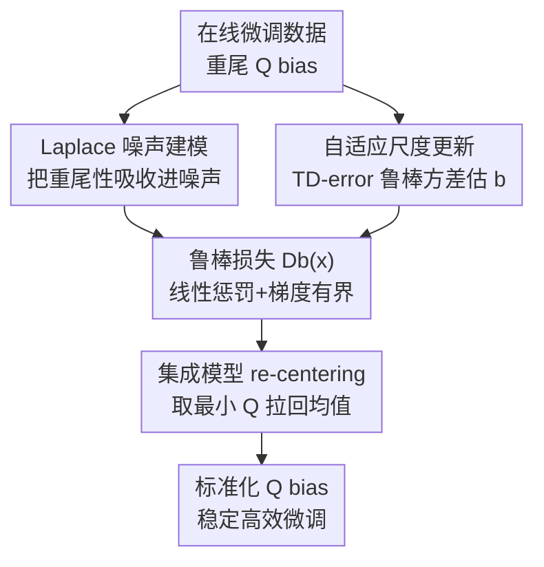

# Tackling Heavy-Tailed Q-Value Bias in Offline-to-Online Reinforcement Learning with Laplace-Robust Modeling

**会议**: ICLR 2026  
**OpenReview**: [https://openreview.net/forum?id=I7UK5qHNBL](https://openreview.net/forum?id=I7UK5qHNBL)  
**代码**: https://github.com/USTC-AI4EEE/LAROO  
**领域**: 强化学习 / 离线到在线RL  
**关键词**: Offline-to-Online RL, Q值偏差, 重尾分布, Laplace鲁棒建模, 集成模型

## 一句话总结
本文首次揭示离线到在线强化学习（O2O RL）在线微调阶段的 Q 值偏差服从**重尾分布**，并提出 LAROO：用一个可自适应的 Laplace 噪声把偏差的重尾性"吸收"进噪声、配合鲁棒损失 $D_b(x)$ 降低估计方差，再用保守集成估计把偏差均值拉回零，从而在 D4RL 上以平均 +54.8% 的提升超过此前最优 O2O 方法。

## 研究背景与动机

**领域现状**：O2O RL 先在离线数据集上预训练一个 agent，再用少量在线交互微调它，以突破离线数据集状态-动作覆盖不足的天花板。由于离线与在线数据存在分布漂移（distribution shift），预训练 Q 网络会在在线数据上估错 Q 值、误导更新方向，因此主流做法都围绕"如何把 Q 值估准"展开——要么往 Q 值里加保守惩罚（Cal-QL），要么用集成模型做保守稳定估计（ENOTO），要么提高更新频率（SO2）。

**现有痛点**：这些方法的共同假设是 Q 值偏差（Q bias，即估计 Q 值与真实累积回报之差）具有**有限方差**或服从**高斯分布**。本文通过蒙特卡洛估真值、Q 网络估估计值、逐样本作差，统计了 Cal-QL / PEX / ENOTO / SO2 在线微调时的 Q bias 分布，发现它们的**峰度（Kurtosis）普遍在 8.5~9.0**（高斯仅为 3），方差上万、右尾极长——明显是重尾、正偏的分布，而非高斯。

**核心矛盾**：重尾 Q bias 的根源是**非均匀的分布漂移**——离离线分布越远的在线样本，Q bias 越大（论文用 DDR/DKNN 距离验证了与 Q bias 的 Spearman 正相关，约 0.44~0.54），这些远点构成了分布的长尾，而 max 算子又会放大这些过估计。重尾偏差会带来巨大的估计方差：在 $l_2$ 损失下，尾部的极端偏差会主导梯度、让 Q 值剧烈震荡甚至崩塌，导致微调既不稳又慢。已有方法只盯着降低 bias 的**均值/方差**，从未触及其**分布形态**，因此压不住峰度。

**本文目标**：把"重尾"这一分布层面的病根显式建模并消除，让 Q bias 从一个难处理的重尾分布"标准化"成均值近零、尾巴受控的形态。

**切入角度**：作者借鉴鲁棒回归里"用 Laplace 分布建模带离群点的误差"的思想——Laplace 分布天然擅长描述重尾、带离群值的数据，且其负对数似然正比于绝对值误差 $|x|$（线性增长）而非 $l_2$ 的平方增长，能天然压制尾部离群点。

**核心 idea**：引入一个可参数化、可自适应的 Laplace 噪声项去"承接"Q bias 的重尾性，把重尾从偏差转移到噪声里；再用集成模型把残留的过估计均值拉回零——两步合起来把重尾 Q bias 整形成标准化形态。

## 方法详解

### 整体框架

LAROO 在标准 off-policy Q 学习（以 TD3/TD3BC 为骨干）之上做两件事：① **建模并转移重尾**——假设真实 Q 值与估计 Q 值之差是一个 Laplace 噪声 $\varepsilon_\theta$，通过最小化"真值给定 TD 目标"与"真值给定估计 Q 值"两个 Laplace 似然之间的 KL 散度来更新 Q 网络，推导出一个鲁棒损失函数 $D_b(x)$ 替换原来的 $l_2$ 损失；② **自适应 + re-center**——用批内 TD-error 的鲁棒方差估计实时更新 Laplace 的尺度参数 $b$（让噪声始终贴合当前重尾程度），同时用集成模型取最小值算 TD 目标，把偏差均值推向零。两个组件协同，把重尾、正偏的 Q bias 转成均值近零、尾部受控的标准化分布。

### 关键设计

**1. Laplace 噪声建模：把重尾从偏差"转移"进噪声**

针对"Q bias 是重尾、但旧方法假设高斯/有限方差"这一根本错配，LAROO 假设目标 Q 值与估计 Q 值各自带一个独立的 Laplace 噪声 $\varepsilon_{\hat\theta}\sim\mathrm{Laplace}(\mu,b_1)$、$\varepsilon_\theta\sim\mathrm{Laplace}(\mu,b_2)$，并由偏差定义 $\mathrm{Bias}(Q_\theta)=-\mathbb{E}[\varepsilon_\theta]$ 把噪声与偏差绑定。由此写出真值 $Q(s,a)$ 在两种条件下的 Laplace 似然，并通过最小化二者的 KL 散度（公式 5）来更新 Q 网络。这样做的妙处在于：Laplace 似然的负对数正比于 $|Q(s,a)-Q_\theta(s,a)|$，是**线性**而非平方增长，因此优化由 Q bias 的"中心质量"主导，而不是被尾部那些罕见的极端偏差牵着走——重尾性被显式地承接到噪声项里，而 Q 值本身仍是期望估计（不像分布式 RL 要建模整个回报分布，避免与离线预训练的期望式 Q 网络冲突）。

**2. 鲁棒损失 $D_b(x)$：用有界梯度替换 $l_2$ 的平方惩罚**

把上面的 KL 散度在实现上取 $b=b_1=b_2$ 简化后，得到替换 $l_2$ 的鲁棒函数

$$D_b(x)=\exp\!\left(-\frac{|x|}{b}\right)+\frac{|x|}{b}-1$$

它有两条关键性质：其一，指数项 $\exp(-|x|/b)$ 会**下调**尾部大偏差对应的损失，削弱离群点影响；其二，其梯度被**约束在 $[-1/b,\,1/b]$** 且不随 $x$ 增大——这与 $l_2$ 损失梯度随偏差线性发散、让尾部偏差主导更新形成鲜明对比。更巧的是 $D_b(x)$ 与 Laplace 分布内在耦合：当重尾偏差变频繁、尺度 $b$ 增大时梯度界收紧，自动加大对极端偏差的抑制。作者还从理论上证明（Theorem 4.4/4.5）当 $b>1$ 时，用 $D_b(x)$ 更新的单步估计偏差与方差都**严格小于** $l_2$，从而长期累积更少偏差。

**3. 自适应尺度更新：用 TD-error 鲁棒方差实时追踪重尾程度**

Laplace 噪声要持续贴合在线微调中不断变化的偏差分布，关键是实时更新尺度参数 $b$（它直接对应尾部厚度与方差）。难点是真实 Q bias 训练时拿不到，且普通的无偏样本方差对峰度极敏感、在离群点下不可靠。LAROO 用两个技巧解决：一是用**可直接拿到的 TD-error 作为代理**——在独立性假设下 $T Q_{\hat\theta}-Q_\theta=\varepsilon_\theta-\varepsilon_{\hat\theta}$，TD-error 方差恰为 Q bias 方差的两倍，故 $b=s_{\omega^*}/\sqrt{2}$；二是用**对峰度鲁棒的 MBBE 方差估计**（MSE-best biased estimator）$s_{\omega^*}^2=\big(\tfrac{\kappa}{n}+\tfrac{n+1}{n-1}\big)^{-1}s^2$ 代替普通样本方差，把峰度 $\kappa$ 显式纳入。实验证实由 TD-error 估出的 $b$ 与由真实 Q bias 估出的 $b$ 高度吻合，使噪声模型能逐批自适应当前重尾度。

**4. 集成 re-centering：把残留过估计的均值拉回零**

噪声建模 + $D_b(x)$ 主要压住了"重尾"，但尾部的大幅正偏差在标准训练下仍会让均值偏正（过估计）。LAROO 引入集成 Q 函数，TD 目标取**随机子集上的最小 Q 值** $y_{\min}=r+\gamma\max_{a'}\min_{1\le k\le M}Q^{(k)}_{\hat\theta}(s',a')$，最终损失对 $K$ 个头平均 $D_b\big(Q^{(k)}_{\theta}-y_{\min}\big)$（公式 8）。取最小有效 re-center 的原因有二：不同 Q 头近似独立，正负误差在头间独立采样；取最小降低了选中"最乐观那个头"的概率，从而压低高正偏差、把均值推向零。消融显示：单用集成能把均值拉回零但仍重尾，单用噪声模型能去重尾但仍过估计——两者合并才把 Q bias 整形成均值近零、尾部受控的标准化分布。

### 损失函数 / 训练策略
离线阶段用 TD3BC 预训练 100 万梯度步（AntMaze 稀疏奖励任务改用 LAPO），在线阶段用带集成 Q 函数的 TD3 微调 10 万步。在线损失即公式 8 的集成 $D_b(x)$ 损失，每个 batch 用 MBBE 重估尺度 $b$。骨干算法选择对齐 ENOTO 基线以保证公平。

## 实验关键数据

### 主实验
在 D4RL（MuJoCo + 稀疏奖励 AntMaze）上，对比 PEX / SO2 / Cal-QL / ENOTO / BOORL 等 SOTA，5 个种子平均。下表摘取代表性任务的"微调后归一化回报"：

| 任务 | SO2 | Cal-QL | ENOTO | BOORL | LAROO |
|------|-----|--------|-------|-------|-------|
| Hopper-medium | 94.4 | 90.8 | 96.6 | 102.1 | **106.7** |
| Walker2d-random | 20.8 | 1.6 | 38.3 | 6.4 | **71.6** |
| Walker2d-medium | 100.6 | 83.7 | 110.2 | 98.6 | **120.4** |
| Walker2d-medium-expert | 110.8 | 110.2 | 118.0 | 109.1 | **126.7** |
| Halfcheetah-medium | 84.4 | 52.2 | 84.8 | 89.7 | **92.5** |

10 万步内全任务性能提升之和 $\delta_{\text{sum}}(0.1M)$：LAROO 达 **550.4**，远超次优 BOORL 的 355.4；最终性能平均比 BOORL **+54.8%**。在 Walker2d-random 这类难任务上优势尤其大（71.6 vs 次优 38.3）。

### 消融实验

| 配置 | 现象 | 说明 |
|------|------|------|
| LAROO（完整） | 均值近零、尾部受控 | 噪声 + 集成协同把 Q bias 标准化 |
| w/o 噪声模型 | 均值近零但仍重尾 | 集成只 re-center 均值，压不住峰度 |
| w/o 集成模型 | 去重尾但仍过估计 | 噪声去尾但均值偏正 |
| $D_b(x)$ vs Huber/Cauchy | $D_b(x)$ 更优 | 更贴合重尾 Q bias |
| Laplace vs Gaussian 拟合 | Laplace 拟合更好 | 经验 Q bias 更接近 Laplace |

### 关键发现
- **噪声模型贡献大于集成**：训练曲线与指标（Fig 16/Table 12）显示 Laplace 噪声模型是 LAROO 的更关键组件，但两者缺一不可——一个管重尾、一个管均值。
- **强插件性**：把现有方法（TD3 / Cal-QL / ENOTO）的 $l_2$ 损失直接换成 $D_b(x)$，性能即进一步提升，说明 $D_b(x)$ 可作为即插即用模块。
- **去掉高 UTD / 集成仍能赢**：把 UTD=1、集成 size=1 后与同条件的 Cal-QL/PEX 比，LAROO 仍在 13 个实验中赢 10 个，说明增益主要来自鲁棒建模而非高更新频率或集成本身。

## 亮点与洞察
- **把"诊断"做成"显式建模目标"**：先用蒙特卡洛真值统计出 Q bias 的峰度高达 8.5+、证明它重尾，再针对性地用 Laplace 噪声承接重尾——从问题发现到方法设计逻辑闭环，比盲目加正则更有说服力。
- **用噪声"转移"而非"消除"重尾**：把难处理的重尾性从偏差搬到一个可参数化的 Laplace 噪声里，等价于把 $l_2$ 换成线性惩罚的 $D_b(x)$，思路优雅且有理论保证（单步偏差/方差均更小）。
- **TD-error 当 Q bias 方差代理**：真实 Q bias 训练时不可得，作者用 $\mathrm{Var}(\text{TD-error})=2\,\mathrm{Var}(\text{Q bias})$ 把不可观测量变成可观测量，再配 MBBE 抗峰度——这个"代理 + 鲁棒估计"组合可迁移到任何需要在线估方差的场景。

## 局限与展望
- 方法整体建立在 Assumption 4.1/4.2（噪声独立、且服从同参 Laplace）之上，作者用 Mann-Whitney U 检验做了验证，但若实际偏差分布偏离 Laplace（如更接近 Cauchy 的极重尾），拟合优势可能减弱（作者在附录 B.1 讨论了 Laplace 的优势与局限）。
- 理论结论（偏差/方差更小）依赖 $b>1$ 的条件，$b\le1$ 时的保证未给出。
- 实验集中在 D4RL 连续控制（MuJoCo + AntMaze），未涉及图像观测、离散动作或真实机器人，跨域泛化性待验证。
- 作者展望未来探索更鲁棒的重尾抑制技术，推动 O2O RL 在真实部署中的应用。

## 相关工作与启发
- **vs Cal-QL / ENOTO**：它们用保守惩罚或集成只降低 Q bias 的**均值/方差**，压不住峰度；LAROO 把分析推进到**完整分布**层面，显式针对重尾，并证明 $D_b(x)$ 比 $l_2$ 单步偏差更小。
- **vs 分布式 RL（DSAC）**：DSAC 直接建模整个 Q 值（回报）分布、且常假设高斯，与离线预训练的期望式 Q 网络不兼容；LAROO 只建模 **Q bias** 的重尾、Q 值仍保持期望估计，兼容性更好。
- **vs Extreme Q-learning**：后者用 Gumbel 分布估最大 Q 值，但其训练目标与常见离线算法不同，在线微调时可能破坏已预训练好的 Q 网络；LAROO 不改 Q 值的估计目标，只换损失与 re-center 方式。

## 评分
- 新颖性: ⭐⭐⭐⭐⭐ 首次揭示 O2O RL 中 Q bias 的重尾性，并用 Laplace 噪声 + 鲁棒损失显式建模，角度新且有理论支撑。
- 实验充分度: ⭐⭐⭐⭐ D4RL 多任务 5 种子、插件性/稳定性/消融齐全，但任务域限于连续控制。
- 写作质量: ⭐⭐⭐⭐ 问题发现到方法推导逻辑清晰，公式与理论完整。
- 价值: ⭐⭐⭐⭐⭐ $D_b(x)$ 即插即用、平均 +54.8% 提升，对 O2O RL 稳定微调有实用价值。

<!-- RELATED:START -->

## 相关论文

- [\[ICLR 2026\] ROMI: Model-based Offline RL via Robust Value-Aware Model Learning with Implicitly Differentiable Adaptive Weighting](model-based_offline_rl_via_robust_value-aware_model_learning_with_implicitly_dif.md)
- [\[ICLR 2026\] Offline Preference-based Value Optimization](offline_preference-based_value_optimization.md)
- [\[ICLR 2026\] Trajectory Generation with Conservative Value Guidance for Offline Reinforcement Learning](trajectory_generation_with_conservative_value_guidance_for_offline_reinforcement.md)
- [\[ICLR 2026\] Peng's Q($\lambda$) for Conservative Value Estimation in Offline Reinforcement Learning](pengs_qlambda_for_conservative_value_estimation_in_offline_reinforcement_learnin.md)
- [\[ICLR 2026\] Guided Flow Policy: Learning from High-Value Actions in Offline Reinforcement Learning](guided_flow_policy_learning_from_high-value_actions_in_offline_reinforcement_lea.md)

<!-- RELATED:END -->
