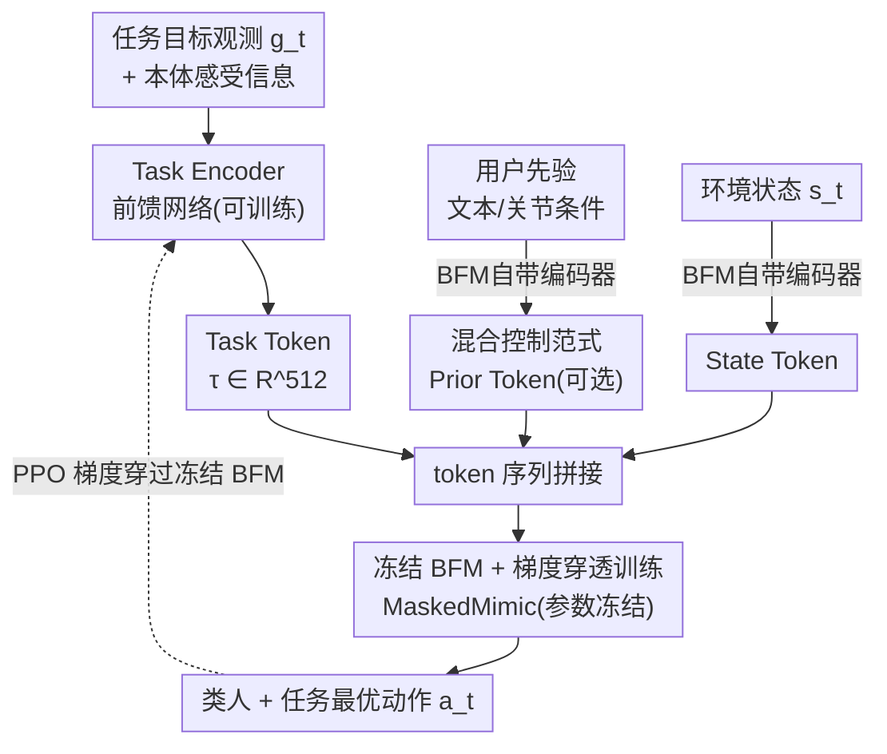

# Task Tokens: A Flexible Approach to Adapting Behavior Foundation Models

**会议**: ICLR 2026  
**OpenReview**: [https://openreview.net/forum?id=6T3wJQhvc3](https://openreview.net/forum?id=6T3wJQhvc3)  
**代码**: 见补充材料（项目页 sites.google.com/view/task-tokens）  
**领域**: 强化学习  
**关键词**: 行为基础模型、参数高效适配、人形控制、Task Token、PPO

## 一句话总结
针对"目标条件型行为基础模型"（GC-BFM，如 MaskedMimic）调下游任务时要么靠繁琐的 prompt 工程、要么全量微调会损坏先验的困境，本文提出 **Task Tokens**：冻结整个 BFM，只用强化学习训练一个轻量"任务编码器"，让它产出一个塞进 transformer token 序列的可学习 token，从而把 BFM 适配到新任务上——每个任务只需约 200K 可训练参数（比基线少 ×125）、收敛快 ×6，且在改变重力/摩擦的 OOD 场景下比全量微调更鲁棒、动作更像人。

## 研究背景与动机
**领域现状**：模仿学习近年催生了一批基于 transformer 的**行为基础模型（Behavior Foundation Models, BFMs）**，能为人形智能体生成多样、类人的动作。本文聚焦其中一类——**目标条件型 BFM（GC-BFM）**，代表作是 MaskedMimic：它把"沿路径走""用右手够向物体"这类高层目标 token 化，喂进 transformer 作为条件，再生成动作。它最大的卖点是**零样本泛化**——给个新目标就能直接生成鲁棒动作，不用再训练。

**现有痛点**：可一旦要解决**具体的复杂任务**，GC-BFM 就尴尬了。两条现成路子都不好走：(1) **prompt 工程**——人工设计高层目标 token，动作虽稳但对很多任务很不直观，难以精确指定；(2) **奖励设计 / 全量微调**——用环境奖励直接优化，但在长程复杂任务里奖励容易写错，且**全量微调会破坏 BFM 预训练学到的丰富动作先验**，导致动作不自然、还会灾难性遗忘。

**核心矛盾**：论文用一个很形象的例子点破——让角色"走到物体旁并击打它"。用奖励设计，角色常常**倒着走**到目标（奖励高但难看）；用高层目标 prompt，又很难精确指定"击打"这种动作。**模型生成鲁棒自然动作的能力**和**特定任务所需的精确控制**之间，存在一道根本的鸿沟。

**本文目标**：找到一个统一、灵活、可扩展的范式，把 BFM 适配到大量复杂下游任务上，**同时保住原始动作的鲁棒性与多模态能力**。

**切入角度**：BFM 本身就是 transformer、本就以**处理 token 序列**为工作方式——那为什么不顺着它的输入接口，**再加一个可学习的 token** 进去？这样既不动模型参数，又能注入任务信息。再借鉴 NLP 里 LoRA / Adapter / Prefix-Tuning 这类参数高效适配思想：用一个轻量可训练模块、借冻结大模型回传的梯度来引导其行为。

**核心 idea**：**冻结 BFM，只训练一个产出"任务 token"的小编码器**，用 RL 把任务奖励的优化压进这一个 token 里，从而在不碰基础模型的前提下完成任务适配。

## 方法详解

### 整体框架
方法要解决的是"如何在不动 BFM 的前提下把它适配到新任务"。Task Tokens 的做法是搭一个**混合控制范式**：BFM 的输入 token 序列里同时含三类来源——① **先验 token（Prior Token）**：可选，由用户通过文本/关节条件给出的高层行为先验，用 BFM 自带的预训练编码器生成；② **任务 token（Task Token）**：由本文新训的 **Task Encoder** 处理当前任务目标观测 $g_t^i$ 后产出；③ **状态 token（State Token）**：当前环境状态 $s_t^i$，同样走 BFM 自带编码器。这三类 token 拼成一句"token 句子"喂进**冻结的 GC-BFM**，由它整合后输出类人且任务最优的动作 $a_t^i$。

训练时关键的一步是：用 PPO 计算策略梯度目标，但梯度是**穿过冻结的 BFM 回流到 Task Encoder**——只更新这个小编码器，BFM 参数一动不动。这样既拿到了 BFM 提供的有意义梯度信号，又保证生成动作始终落在 BFM 定义的"动作流形"上，鲁棒性和多模态能力得以保留。

### 关键设计

**1. Task Token：把任务信息压进 transformer 序列里的一个可学习 token**

痛点是 GC-BFM 适配新任务时，要么人工拼 prompt、要么改模型本体。本文注意到 MaskedMimic 的 transformer 架构天然以 token 序列为输入、可以注意任意 token 组合，于是直接顺着这个接口插入一个**专门为该任务学的 token**：它把目标行为的独特需求和约束编码成一个简洁但信息量足的信号，引导基础模型产出任务相关的输出，同时不破坏其通用动作先验。这个设计的通用性在于——**只要 BFM 能往输入里塞额外 token，Task Tokens 就能用**，不依赖 MaskedMimic 的具体结构。一个任务对应一个 token，多任务就是多训几个小编码器，扩展开销极小。

**2. Task Encoder：把任务目标观测映射成 token，并用本体感受信息对齐预训练表示**

Task Token 不是凭空学一个静态向量，而是由 **Task Encoder** 在线产出：它接收当前任务目标观测 $g_t^i$（以智能体自身为参考系的 egocentric 表示），输出一个 $\tau_t^i \in \mathbb{R}^{512}$ 的 token。观测随任务而变——比如 Steering 任务里 $g_t^i$ 含目标移动方向 $\in\mathbb{R}^2$、朝向 $\in\mathbb{R}^2$、期望速度 $\in\mathbb{R}$，合起来 $\in\mathbb{R}^5$。一个容易被忽略但关键的细节：因为 MaskedMimic 是被训练去"到达未来姿态目标"的，所以 Task Encoder 也额外喂入**本体感受信息（proprioception）**，让编码器的输出和 BFM 的预训练表示对齐，才能给出有意义的目标信号（消融见原文 Section E）。编码器实现为一个简单的前馈网络，其输出 token 与其它编码器的 token 拼接，相当于在这句"token 句子"里加了引导任务的"专用词"。

**3. 冻结 BFM + 梯度穿透训练：用 PPO 只更新编码器，保住先验不被破坏**

这是全文最核心的设计取舍。训练用 PPO：BFM 基于含 task token 的组合输入预测动作概率，PPO 目标针对**任务奖励**和 BFM 的动作概率来算，梯度**穿过冻结的 BFM** 回流、只更新 Task Encoder 参数。作者明确指出这是有意为之——虽然全量微调可能在任务回报上更高，但会损害 BFM 的先验知识、让动作变得不自然不鲁棒。靠这一冻结策略，生成动作始终贴着 BFM 的动作流形，鲁棒性和多模态能力都保住了。直接收益是**极致的参数效率**：每个任务只需约 200K 可训练参数，而常规方法要约 20M（PULSE 9.3M、MaskedMimic 全量微调 25M），分别是 ×46.5 和 ×125 的差距。

**4. 混合控制范式：用户高层先验 + 学习的奖励驱动优化协同**

由于 BFM 输入天然能容纳多个 token，Task Token 可以和**人工构造的先验 token** 并肩使用，从而把"用目标好描述的部分"交给先验、"用奖励好描述的部分"交给 task token，二者互补。论文给了两个例子：Direction 任务只奖励朝正确方向移动、不管朝向，策略常学成**倒着走**——这时加一个"头部目标高度+朝向"的先验 token，就能收敛到直立向前走；Strike 任务里先用朝向先验让角色面向目标行进，临近时再用文本目标"a person performs a kick"引导它用脚踢击。关键在于：因为 BFM 是冻结的，这些预训练的多模态 prompt 能力被完整保留，学到的 token 与人工指定的行为能连贯整合；而全量微调会触发**灾难性遗忘**、丧失这种多模态 prompt 能力，PULSE 则压根不支持多模态 prompt。

### 损失函数 / 训练策略
训练目标即标准 PPO 的策略梯度目标 $\pi^* = \arg\max_{\pi}\mathbb{E}_\pi[\sum_t \gamma^t r_t]$，奖励 $r_t$ 为任务专属的稠密奖励。梯度只回传到 Task Encoder（约 200K 参数），BFM 全程冻结。每个下游任务训练一个独立的 Task Encoder。

## 实验关键数据

### 主实验
在 Isaac Gym 中用 69 自由度的 SMPL 人形做了五个任务：Reach（右手够目标）、Direction（朝随机方向走）、Steering（边走边朝向随机方向）、Strike（够到并击倒目标）、Long Jump（从目标点尽远跳，基于 SMPL-Olympics）。指标为成功率（5 个随机种子均值±标准差；J.C. only 是零样本无方差）。

| 方法 | Reach | Direction | Steering | Long Jump | Strike |
|------|-------|-----------|----------|-----------|--------|
| **Task Tokens (ours)** | **94.88 ± 1.99** | **99.26 ± 0.79** | **88.69 ± 4.04** | **99.75 ± 0.57** | 76.61 ± 3.49 |
| MaskedMimic (J.C. only, 零样本) | 24.77 | 2.19 | 3.83 | - | - |
| MaskedMimic Fine-Tune | 93.70 ± 4.59 | 99.10 ± 1.29 | 87.44 ± 6.79 | 47.36 ± 54.78 | **83.07 ± 5.71** |
| PULSE | 83.96 ± 2.20 | 97.60 ± 0.62 | 40.72 ± 7.64 | 99.37 ± 1.40 | 83.18 ± 2.67 |
| AMP | 57.14 ± 4.80 | 5.14 ± 0.68 | 4.28 ± 1.42 | 76.59 ± 43.42 | 52.21 ± 47.58 |
| PPO (Pure RL) | 89.90 ± 3.25 | 97.74 ± 1.40 | 32.64 ± 40.21 | 61.91 ± 52.26 | 81.36 ± 1.41 |

Task Tokens 在多数任务上拿到最高成功率（Strike 上略低于 PULSE/Fine-Tune/PureRL）。在效率上：Strike 任务 Task Tokens 约 **50M 步**收敛，PULSE 要约 **300M 步**（×6 慢）；可训练参数 ~200K，PULSE 9.3M、Fine-Tune 25M（分别 ×46.5、×125）。值得注意的是 Long Jump / Strike 这类任务上 Fine-Tune 与 PPO 的标准差极大（如 Fine-Tune Long Jump 47.36 ± 54.78），说明它们训练很不稳定。

### 分析实验：动作自然度人类研究
约 100 名匿名参与者对视频三元组投票选"更像人"的动作，下表为 Task Tokens 相对各方法的胜率（越高表示越被认为像人）。

| 对比方法 | Direction | Steering | Reach | Strike | Long Jump |
|----------|-----------|----------|-------|--------|-----------|
| MaskedMimic (J.C. only) | 95% ± 2% | 75% ± 6% | 53% ± 5% | - | - |
| MaskedMimic Fine-Tune | 99% ± 1% | 90% ± 4% | 85% ± 6% | 85% ± 5% | 94% ± 2% |
| MaskedMimic F.T. + J.C. | 96% ± 3% | 89% ± 5% | 82% ± 6% | - | - |
| PULSE | 15% ± 5% | 46% ± 6% | 36% ± 9% | 24% ± 5% | 39% ± 5% |
| AMP | 92% ± 3% | 84% ± 4% | 70% ± 6% | 68% ± 6% | 94% ± 3% |
| PPO | 99% ± 2% | 93% ± 4% | 89% ± 5% | 82% ± 4% | 94% ± 3% |

Task Tokens 在动作自然度上**全面碾压全量微调和纯 RL**（胜率多在 80%~99%），印证了"冻结 BFM 保住动作流形"的价值；但**输给 PULSE**（胜率多 < 50%）——作者归因于 PULSE 把高层表示约束得更贴近先验，而 MaskedMimic 没有这种约束，未来可考虑给 Task Tokens 加类似约束。

### 关键发现
- **OOD 鲁棒性是最大亮点**：改变地面摩擦（如 ×0.4）和重力（如 ×1.5）这类训练时没见过的扰动，Task Tokens（带/不带 J.C.）都比所有基线明显更鲁棒；尤其在极低摩擦、极大重力下优势显著。反观**全量微调反而损害了 BFM 自带的鲁棒性**——高重力下表现比"最小干预"的 Task Tokens 更差。
- **冻结 vs 微调的取舍贯穿全文**：微调虽然个别任务（Strike）回报略高，但代价是动作不自然、OOD 变脆、且会灾难性遗忘多模态 prompt 能力。
- **本体感受信息对齐很关键**：给 Task Encoder 喂本体感受信息让其输出与 BFM 预训练表示对齐，是 token 能产生有意义目标的前提（原文 Section E 消融）。

## 亮点与洞察
- **"把适配做成加一个 token"是非常优雅的迁移**：把 NLP 的 Prefix-Tuning/Adapter 思路精准映射到 token 化的行为基础模型上——transformer 既然吃 token 序列，那就只往序列里加一个学出来的 token，零改动模型结构。这个抽象可迁移到任何"以 token 序列为条件"的基础模型适配。
- **冻结基础模型反而带来更强的 OOD 鲁棒性**，这是反直觉但很有说服力的点：少干预 = 留住预训练流形 = 泛化更好，给"基础模型该不该微调"提供了一个干净的反例。
- **混合控制范式把 prompt 工程和奖励设计统一了**：好描述的用先验 token、好奖励的用 task token，还顺手治好了"倒着走"这类奖励错配的经典毛病。
- **参数效率的量级差距（×125）**让"一个 BFM + 一堆小编码器"覆盖大量任务在工程上变得现实。

## 局限与展望
- **强依赖底层 BFM 的表达力与覆盖范围**：BFM 没覆盖到的能力，Task Tokens 也补不出来；如何识别/弥补 BFM 的知识盲区是开放问题。
- **目前只在仿真环境验证**，且主要是动画级别的人形控制；真正迁到实体机器人要面对 sim-to-real，作者列为关键的下一步。
- **每个任务单独训一个编码器**，没探索共享/组合/持续学习的多任务 Task Encoder，扩到终身学习场景仍是挑战。
- **奖励函数和观测空间的设计仍需领域专家**，未来可探索（半）自动化以降低门槛。
- **动作自然度仍输给 PULSE**：作者承认缺一个把表示约束在先验附近的机制，可考虑引入判别式（如 AMP 风格）人类似然先验。

## 相关工作与启发
- **vs MaskedMimic（J.C. only，零样本）**：本文的 BFM 底座就是它。零样本在复杂任务上成功率极低（Steering 仅 3.83%），Task Tokens 在不动它一个参数的前提下把成功率拉满，等于给零样本 BFM 装了个"任务适配插件"。
- **vs MaskedMimic Fine-Tune（全量微调）**：同样用任务奖励，但微调全模型——任务回报偶尔更高，却破坏动作自然度、OOD 鲁棒性和多模态能力，还灾难性遗忘。Task Tokens 用 ×125 更少参数拿到相当的任务表现且保住了这些性质。
- **vs PULSE（分层 RL + 动作潜空间）**：PULSE 把动捕技能压成潜空间、再用分层控制器选潜变量。它动作最像人（人类研究胜过 Task Tokens），但收敛慢 ×6、参数多 ×46.5、且不支持多模态 prompt。本文借鉴其"约束贴近先验"的思想作为未来改进方向。
- **vs AMP（判别器约束动作质量）**：用判别器保证动作真实感同时优化任务，但在 Direction/Steering 这类任务上成功率很低（5% 量级），稳定性也差。
- **启发**：把"参数高效适配 + 冻结大模型 + 梯度穿透"这套组合迁到任何 token 条件型基础模型上（视觉、机器人 VLA、决策 transformer），都可能用"加一个学出来的 token"来低成本、保先验地做下游适配。

## 评分
- 新颖性: ⭐⭐⭐⭐ 把 NLP 参数高效适配优雅迁到行为基础模型，"加一个 task token"的切入干净有效，但底层是已有思路的跨域移植。
- 实验充分度: ⭐⭐⭐⭐ 五任务 + 多基线 + OOD 扰动 + 人类研究 + 多模态 prompt 案例，较全面；消融数字主要在附录，正文略少。
- 写作质量: ⭐⭐⭐⭐ "倒着走""whirlwind"等例子把动机讲得很具象，逻辑清晰好读。
- 价值: ⭐⭐⭐⭐ 为"复用并适配行为基础模型"给出参数高效、保鲁棒的实用范式，对人形动画/具身控制有直接价值；目前限于仿真。

<!-- RELATED:START -->

## 相关论文

- [\[ICLR 2026\] Optimistic Task Inference for Behavior Foundation Models](optimistic_task_inference_behavior_models.md)
- [\[ICLR 2026\] ARM-FM: Automated Reward Machines via Foundation Models for Compositional Reinforcement Learning](arm-fm_automated_reward_machines_via_foundation_models_for_compositional_reinfor.md)
- [\[ICLR 2026\] Efficient Estimation of Kernel Surrogate Models for Task Attribution](efficient_estimation_of_kernel_surrogate_models_for_task_attribution.md)
- [\[ICLR 2026\] Deep SPI: Safe Policy Improvement via World Models](deep_spi_safe_policy_improvement_via_world_models.md)
- [\[ICLR 2026\] Mixture-of-World Models: Scaling Multi-Task Reinforcement Learning with Modular Latent Dynamics](mixture-of-world_models_scaling_multi-task_reinforcement_learning_with_modular_l.md)

<!-- RELATED:END -->
