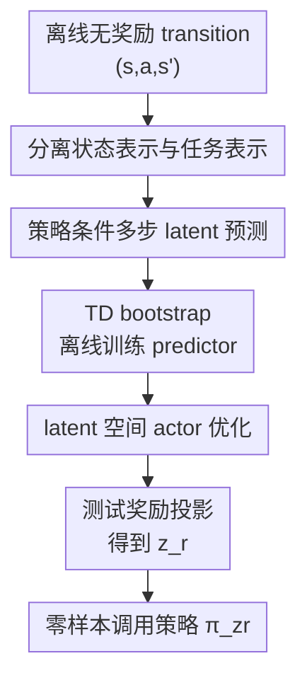

# TD-JEPA: Latent-predictive Representations for Zero-Shot Reinforcement Learning

**会议**: ICLR 2026  
**OpenReview**: [https://openreview.net/forum?id=SzXDuBN8M1](https://openreview.net/forum?id=SzXDuBN8M1)  
**代码**: https://github.com/facebookresearch/td_jepa  
**领域**: 强化学习 / 零样本强化学习 / 表示学习  
**关键词**: 零样本强化学习, latent prediction, successor features, temporal difference, reward-free offline RL  

## 一句话总结
TD-JEPA 把 JEPA 式 latent prediction 从“一步预测辅助损失”改造成“多策略、多步、TD 训练的核心目标”，在无奖励离线数据上同时学习状态编码器、任务编码器、successor-feature 预测器和潜在策略，从而在测试时只用少量奖励样本就能零样本选择对应策略。

## 研究背景与动机
**领域现状**：零样本无监督强化学习希望先在没有奖励的离线交互数据上预训练一个通用 agent，测试时再给一个新的奖励函数或目标，就能直接取出适配该任务的策略。近年来比较主流的路线是 successor features / successor measure：先学一个任务编码器 $\psi(s)$ 定义线性奖励空间，再学一族由 latent $z$ 条件化的策略 $\pi_z$ 和 successor features $F(s,a;z)$，使得任意奖励 $r(s)=\psi(s)^\top z_r$ 都可以通过 $F(s,a;z_r)^\top z_r$ 来近似 Q 值。

**现有痛点**：这条路线的关键瓶颈是表示学习。很多方法直接围绕 task encoder 或 successor features 做对比学习、距离保持或 bilinear factorization，但没有显式学习一个面向控制的 state encoder；另一类 latent-predictive 方法，如 BYOL、BYOL-$\gamma$、RLDP，则能从无奖励数据中学状态表示，却常常只预测行为策略的一步或多步动态，和“测试时要优化的那一族策略 $\pi_z$”并不完全对齐。

**核心矛盾**：零样本 RL 真正需要的不是“能预测数据集中平均会发生什么”的表示，而是“能预测某个任务条件策略长期会访问哪些状态”的表示。一步 latent dynamics 太短视，行为策略 dynamics 又和下游最优策略不一致；如果表示没有捕捉 policy-conditioned long-term dynamics，那么后面的 successor-feature 策略优化就容易建立在错的状态几何上。

**本文目标**：作者想解决三个具体问题：第一，如何从 offline、reward-free 的 transition 数据中学习对多步未来有预测力的 latent 表示；第二，如何让这个预测目标依赖策略 latent $z$，而不是只依赖数据里的行为策略；第三，如何把 latent prediction 直接变成 zero-shot RL 的训练目标，而不是只当作一个辅助正则项。

**切入角度**：论文观察到 successor features 本身就是“某个策略长期访问状态特征的折扣平均”。如果 predictor 不是预测下一帧 latent，而是预测策略 $\pi_z$ 的长期 latent occupancy，那么这个 predictor 就自然可以被解释为 successor features。进一步地，successor features 满足 Bellman 方程，因此可以用 TD bootstrap 在离线 transition 上训练，不需要真的采样每个策略的 on-policy 长轨迹。

**核心 idea**：用 TD 形式的 policy-conditioned latent prediction 近似 successor features，把 JEPA 的“预测未来 latent”转化成“预测某个潜在策略的长期任务特征”，从而端到端训练可零样本调用的策略族。

## 方法详解
TD-JEPA 的方法可以理解为把两个世界接起来：一个是 JEPA / BYOL 风格的 latent-predictive representation learning，另一个是 successor-feature zero-shot RL。它不再先学表示、再额外学 RL head，而是用一个 TD latent-prediction loss 同时塑造表示、预测器和策略。

### 整体框架
输入是一批离线无奖励 transition $(s,a,s')$，以及从任务 latent 空间采样的 $z$。TD-JEPA 用状态编码器 $\phi$ 把观测转成控制用状态表示，用任务编码器 $\psi$ 定义可表达的奖励空间，用 predictor $T_\phi(\phi(s),a,z)$ 预测策略 $\pi_z$ 从 $(s,a)$ 出发后长期会积累的任务表示，并用 actor $\pi(\phi(s),z)$ 在 latent 空间中选择能最大化 $T_\phi^\top z$ 的动作。

整个训练是一个闭环：当前策略给出下一步动作 $a'\sim\pi_z(\phi(s'))$，TD 目标把 predictor 拉向 $\psi(s')+\gamma T_\phi(\phi(s'),a',z)$；与此同时，actor 被训练成选择让 predictor 对当前任务 latent 得分更高的动作。测试时，只需用少量带奖励样本把奖励函数线性投影到 $\psi$ 空间，得到 $z_r$，然后直接调用 $\pi_{z_r}$。

### 关键设计
**1. 策略条件多步 latent 预测：把 JEPA 预测目标对齐到 zero-shot RL 真需求**

传统 latent-predictive RL 方法常写成 $P(\phi(s))\approx\phi(s')$，最多是在行为策略轨迹上预测更远的未来。TD-JEPA 认为这对 zero-shot RL 仍然不够，因为下游真正要评估的是“如果执行策略 $\pi_z$，从当前状态动作出发未来会访问什么”。因此它把 predictor 写成 $T_\phi(\phi(s),a,z)$，显式条件化于动作和策略 latent $z$，目标不是一个未来状态 latent，而是策略 $\pi_z$ 的长期 successor features。

这个改动的意义在于，预测器的输出可以直接进入 value evaluation：如果奖励在任务表示空间中写成 $r(s)=\psi(s)^\top z_r$，那么 $T_\phi(\phi(s),a,z)^\top z_r$ 就近似策略 $\pi_z$ 对该奖励的 Q 值。换句话说，latent prediction 不再只是“让 encoder 更好看”的辅助任务，而是零样本策略评估本身。

**2. TD 版 JEPA loss：用一跳离线 transition 学长期 successor features**

如果直接用 Monte Carlo 目标，predictor 需要匹配 $s^+\sim M^{\pi_z}(\cdot|s,a)$ 下采样到的长期未来状态表示：

$$
\mathcal{L}_{MC}=\mathbb{E}\left[\left\|T_\phi(\phi(s),a,z)-\phi(s^+)\right\|^2\right].
$$

这在离线场景几乎不可用，因为我们没有每个潜在策略 $\pi_z$ 的 on-policy 长轨迹。TD-JEPA 用 Bellman 方程把这个目标改写为可离线估计的一步 TD 目标：

$$
\mathcal{L}_{TD}=\mathbb{E}\left[\left\|T_\phi(\phi(s),a,z)-\psi(s')-\gamma T_\phi(\phi(s'),a',z)\right\|^2\right],
$$

其中 $a'\sim\pi_z(\cdot|s')$。这一步是论文最关键的桥：它让“预测长期 latent dynamics”可以只依赖数据集里的 $(s,a,s')$，同时通过当前策略在 $s'$ 上采样 $a'$ 来保持 policy-conditioned。相比一味预测行为策略的未来，TD 目标把表示学习、successor-feature 估计和 actor 改进绑定在同一个 Bellman 结构里。

**3. 分离状态编码器与任务编码器：让控制表示和奖励表示各司其职**

论文没有强行让同一个 encoder 同时承担状态输入和任务定义。状态编码器 $\phi:S\to\mathbb{R}^{d_\phi}$ 负责把高维观测压成 predictor 和 actor 好用的控制状态；任务编码器 $\psi:S\to\mathbb{R}^{d_\psi}$ 负责定义线性奖励空间 $\mathcal{R}_\psi=\{r(s)=\psi(s)^\top z\}$。这在机器人和视觉控制里很自然：低层控制可能需要速度、姿态、接触等动态信息，而任务描述可能只关心位置、目标物、拓扑关系或语义状态。

为了让两种表示相互约束，TD-JEPA 训练两个对称方向的 predictor：$T_\phi$ 从 $\phi$ 预测 $\psi$ 空间的长期特征，$T_\psi$ 从 $\psi$ 预测 $\phi$ 空间的长期特征。最终 actor 主要依赖 $T_\phi$，因为策略输入是状态表示 $\phi(s)$，而任务 latent $z$ 位于 $\psi$ 空间。实验中的 symmetric 变体说明单一 encoder 也能工作，但分离表示通常更稳，尤其在视觉和低覆盖任务上更有优势。

**4. 非对比式稳定训练：用正交正则和 target network 防 collapse**

非对比 latent prediction 的老问题是 collapse：encoder 可能把所有状态都映射到常数，预测损失反而很小。TD-JEPA 采用 target network / EMA bootstrap，并对 $\phi$ 和 $\psi$ 加 covariance / orthonormality regularization。正则项鼓励 batch 内不同状态的表示互相正交，同时维持非零范数，形式上类似让表示矩阵保持单位协方差。

理论部分进一步解释了为什么这不是经验 trick。在线性、理想化设定下，如果 predictor 相对 encoder 更快达到最优，TD-JEPA 的连续时间动力学会保持表示协方差不变；配合适当初始化，就不会坍缩到零表示。这个结论虽然依赖简化假设，但它说明 TD-JEPA 的稳定性来自 successor-measure factorization 的结构，而不是简单靠 stop-gradient 硬撑。

### 一个完整示例
假设离线数据来自一个无奖励的视觉 antmaze 数据集，里面只有 agent 在迷宫里随机或半专家地移动，没有任何“到达右上角目标”的奖励标签。训练时，TD-JEPA 先采样一条 transition：当前图像状态 $s$、动作 $a$、下一张图像 $s'$，再采样一个任务 latent $z$，这个 $z$ 可以看成“某类潜在目标或奖励方向”。

状态编码器把 $s$ 和 $s'$ 映射到控制表示 $\phi(s),\phi(s')$，任务编码器把 $s'$ 映射到 $\psi(s')$。当前策略 $\pi_z$ 在 $s'$ 上产生下一步动作 $a'$，于是 predictor 的训练目标变成：当前输出 $T_\phi(\phi(s),a,z)$ 应该接近“眼前到达的任务特征 $\psi(s')$ + 折扣后的未来预测 $\gamma T_\phi(\phi(s'),a',z)$”。如果某个 $z$ 对应“向迷宫右上方走”，那么训练会让 predictor 学到从不同位置出发、按该策略走时最终会积累哪些状态特征。

测试时，用户给出少量带奖励样本，比如越靠近右上角奖励越高。TD-JEPA 用线性回归在 $\psi(s)$ 上拟合这个奖励，得到 $z_r$。此后不再重新训练策略，只调用 $\pi(\phi(s),z_r)$ 选动作；actor 在预训练时已经学过“对每个 $z$，选择让 $T_\phi(\phi(s),a,z)^\top z$ 最大的动作”，所以它可以直接把这个新奖励转成行为。

### 损失函数 / 训练策略
TD-JEPA 的训练包含三类目标。第一类是双向 TD-JEPA latent-predictive loss：

$$
\widehat{\mathcal{L}}_{TD}(\phi,T_\phi,\psi)=\frac{1}{2B}\sum_i\left\|T_\phi(\phi(s_i),a_i,z_i)-\psi^-(s'_i)-\gamma T^-_\phi(\phi^-(s'_i),a'_i,z_i)\right\|^2.
$$

另一个方向把 $\phi$ 和 $\psi$ 对调，用 $T_\psi$ 预测 $\phi$ 空间中的长期表示。这里带负号的网络是 EMA target network，用来稳定 bootstrap 目标，避免同一个网络同时追逐自己刚更新出的表示。

第二类是 orthonormality regularization。论文用 batch 内 pairwise dot product 惩罚表示之间的相关性，同时奖励每个表示保持非零范数。直观上，它把 collapse 解从优化空间里推开，让 $\phi$ 和 $\psi$ 保留足够多的可区分方向。

第三类是 actor loss。给定采样的 $z_i$，actor 产生动作 $\hat a_i\sim\pi(\phi(s_i),z_i)$，并最大化 predictor 对该任务方向的打分：

$$
\mathcal{L}_{actor}(\pi)=-\frac{1}{B}\sum_i T_\phi(\phi(s_i),\hat a_i,z_i)^\top z_i.
$$

训练实现上，DMC 使用折扣因子 $\gamma=0.98$、OGBench 使用 $\gamma=0.99$；视觉输入是 $64\times64$ RGB 帧堆叠，并用 DrQ-v2 风格卷积编码器；DMC 通常训练 2M gradient steps，OGBench 训练 1M steps。算法还会以一定概率从数据状态的 $\psi(s)$ 中采样 goal-like latent，否则从 hypersphere 采样随机 latent，以覆盖更广的任务方向。

## 实验关键数据

### 主实验
论文在 13 个数据集、65 个任务上评估 zero-shot 性能，覆盖 ExoRL / DMC 的 locomotion 与 navigation，以及 OGBench 的 antmaze、cube、scene、puzzle 等 navigation / manipulation。每个 domain 都测试 proprioceptive 输入和 RGB pixel 输入，指标分别是 DMC return 或 OGBench success rate。对比方法包括 Laplacian、ICVF、HILP、FB、RLDP、BYOL、BYOL-$\gamma$ 等，其中 BYOL / BYOL-$\gamma$ / ICVF 被作者重新接入 successor-feature zero-shot 框架以做公平比较。

| 评测套件 | 指标 | TD-JEPA | 最强或接近最强基线 | 主要结论 |
|--------|------|---------|------------------|----------|
| DMCRGB avg | return | 628.8 ± 5.5 | BYOL-$\gamma$ 582.4 ± 9.8 | 像素控制上明显领先，说明 policy-conditioned 多步预测比行为策略预测更适配控制 |
| DMC avg | return | 661.2 ± 6.3 | FB 648.2 ± 4.1 / BYOL-$\gamma$ 645.4 ± 10.5 | proprioception 下和最佳基线同档或略优 |
| OGBenchRGB avg | success rate | 41.34 ± 0.45 | BYOL-$\gamma$ 41.58 ± 0.64 | 像素 goal-reaching 上与最佳方法置信区间重叠 |
| OGBench avg | success rate | 37.98 ± 0.77 | FB 39.04 ± 0.66 / HILP 37.98 ± 1.11 | 低覆盖专家数据上保持竞争力，但不是所有 domain 都压倒性领先 |

更细地看，TD-JEPA 在 DMCRGB 的 walker、cheetah、quadruped、pointmass 上分别达到 738.9、706.0、626.7、443.7，四个 domain 都优于表中大多数基线；在 OGBenchRGB 的 scene 上达到 14.20，明显高于 BYOL-$\gamma$ 的 11.20 和 FB 的 4.20，显示出视觉 manipulation / scene 任务中长期控制相关表示的价值。

作者还用 probability of improvement 统计“随机抽一个 domain，方法 X 超过方法 Y 的概率”。在 RGB 设置下，TD-JEPA 对多数基线的胜率显著高于 50%；在 proprioception 设置下，它相对 FB、HILP 的优势更小，说明当状态已经低维且信息充分时，表示学习目标的差别没有像素输入时那么关键。

### 消融实验
| 配置 | 关键指标 | 说明 |
|------|---------|------|
| TD-JEPA | DMCRGB 628.8 ± 5.5 / OGBenchRGB 41.34 ± 0.45 | 完整方法：分离 $\phi,\psi$，policy-conditioned 多步 TD latent prediction |
| TD-JEPA symmetric | DMCRGB 598.1 ± 5.9 / OGBenchRGB 39.74 ± 0.64 | 共享 state/task encoder；性能接近但通常略低，说明分离表示有价值 |
| Contrastive symmetric TD-JEPA | DMCRGB 437.2 ± 9.8 / OGBenchRGB 33.93 ± 0.67 | 用对比式目标替代 latent-predictive 目标；像素任务差距明显扩大 |
| BYOL | DMCRGB 513.8 ± 11.6 / DMC 618.6 ± 10.5 | 预测一步行为动态；能学表示，但不直接面向策略条件长期动态 |
| BYOL-$\gamma$ | DMCRGB 582.4 ± 9.8 / DMC 645.4 ± 10.5 | 预测行为策略多步动态；比 BYOL 更强，但仍不如 TD-JEPA 稳定 |

### 关键发现
- TD-JEPA 最稳定的优势出现在 pixel-based control。论文的解释很合理：像素观测中有大量与控制无关的视觉变化，只有和长期策略行为绑定的预测目标，才会迫使 encoder 聚焦 end-effector、物体、迷宫位置等对 value estimation 真有用的因素。
- “预测什么 dynamics”比“是否用了 latent prediction”更关键。BYOL 和 BYOL-$\gamma$ 已经证明 latent prediction 有用，但它们主要建模行为策略；TD-JEPA 建模的是要被优化的策略族 $\pi_z$，因此更贴近 zero-shot actor 的实际使用方式。
- 分离 state encoder 和 task encoder 不是必须，但通常有帮助。symmetric variant 在不少任务上很强，说明核心 TD latent prediction 已经足够有力；完整 TD-JEPA 进一步给控制输入和奖励空间分工，平均表现更好。
- 预训练表示能加速后续 offline / online fine-tuning。DMC pixel 任务中，用 TD-JEPA 或 FB 初始化的 TD3 比从零开始快得多；很多场景下冻结卷积或冻结表示也能保持较高样本效率，说明学到的 $\phi$ 确实可复用。
- 低质量、低覆盖数据仍是难点。附录里作者把 ExoRL 数据量降到 100、500、1000、5000 episodes 后发现，所有方法都会退化；BC 或 FQL 风格 regularization 能缓解，但长时间训练小数据还可能过拟合。

## 亮点与洞察
- TD-JEPA 最漂亮的地方是把 JEPA 的“predict future latent”重新解释成 successor-feature estimation。这个连接让一个看似自监督的目标直接有了 value-function 语义，也让 zero-shot RL 的策略提取不再是额外拼接上去的 head。
- TD loss 的引入很关键。Monte Carlo latent prediction 在概念上更直观，但需要每个策略的长期 on-policy rollout；TD-JEPA 用一跳 transition 和 bootstrap 把它变成 off-policy offline 可训练目标，正好匹配 reward-free dataset 的现实条件。
- 论文对 state representation 和 task representation 的区分值得借鉴。很多表示学习论文默认“一个好 embedding 到处都好用”，但在控制里，输入给 actor/critic 的动态状态表示和用于定义奖励函数的任务表示并不一定同构，TD-JEPA 给了一个清晰的算法化处理。
- 理论分析不是只服务于形式感。non-collapse、successor-measure factorization、policy evaluation error upper bound 这几件事把算法的三个核心担忧串起来：表示会不会塌、predictor 到底在学什么、为什么测试时线性奖励投影能工作。
- 对视觉控制的启发很直接：通用视觉模型未必学到控制相关因素，而 policy-conditioned long-term prediction 会自然关注能改变未来 occupancy 的对象和状态，例如机械臂末端、cube、maze topology。

## 局限与展望
- 理论保证依赖理想化条件。论文的主理论在 tabular / linear predictor / 对称转移核 / 单位协方差等假设下展开，作者也承认实际环境中的 asymmetric successor measures 仍需要更贴近实践的学习目标和分析。
- 方法复杂度高于许多基线。完整 TD-JEPA 同时训练两个 encoder、两个 predictor、actor 和 target networks；虽然附录显示速度和 BYOL 类方法同量级，但工程实现和超参调试明显比简单表示学习方法更重。
- 对低覆盖数据仍需保守正则。OGBench 和低质量低覆盖实验表明，只靠 zero-shot successor features 不一定能处理所有 distribution shift；BC、FQL、CQL 或 advantage-weighted regularization 仍可能是实际部署时的必要配套。
- 奖励投影假设限制了可表达任务。测试时要把奖励函数线性拟合到 $\psi(s)$ 空间，如果 $\psi$ 没有覆盖某些稀疏语义或组合任务，zero-shot 策略仍会受限；这也是所有 successor-feature zero-shot 方法的共同边界。
- 大规模真实机器人数据还没有验证。论文动机多次提到 humanoid、robot manipulation、in-the-wild videos，但实验仍集中在 DMC 和 OGBench；真实机器人数据上的噪声、动作缺失、多 embodiment 差异会给 TD-JEPA 带来额外挑战。

## 相关工作与启发
- **vs Forward-Backward (FB)**: FB 通过 contrastive / bilinear decomposition 学 task encoder 和 successor features，核心参数化可理解为 $M^{\pi_z}\approx F_zB^\top$；TD-JEPA 则写成 $M^{\pi_z}\approx\phi T_z\psi^\top$，显式学习跨任务共享的 state representation，并且本质上是非对比式 latent prediction。TD-JEPA 在 pixel control 上优势更明显，但 FB 在部分 proprioceptive OGBench / DMC 任务上仍很强。
- **vs HILP / Laplacian**: HILP 用距离保持的 goal-reaching 表示定义任务空间，Laplacian 依赖图拉普拉斯 / proto-value function 思路；它们更关注状态空间几何，而 TD-JEPA 关注策略条件的长期 dynamics。对于需要动态可达性而非静态距离的任务，TD-JEPA 的 successor-feature 视角更贴近控制。
- **vs BYOL / BYOL-$\gamma$**: BYOL 类方法也是 self-predictive，但目标通常是行为策略下一步或多步 latent。TD-JEPA 的区别在于预测目标带 $z$，预测的是要被优化的策略族，而不是数据里混合行为的平均未来；这解释了为什么 BYOL-$\gamma$ 在专家型 OGBenchRGB 上很强，但在 DMCRGB 和 OGBench proprioception 上不如 TD-JEPA 稳定。
- **vs RLDP**: RLDP 也用 regularized latent dynamics prediction，并在 behavioral foundation model 场景下很有竞争力。TD-JEPA 更进一步把 latent dynamics prediction 写成 TD successor-feature 目标，使 predictor 可以直接承担策略评估角色。
- **对后续工作的启发**: 如果要在机器人离线数据上做通用预训练，可以考虑把“视觉/状态表示预训练”和“下游 reward optimization”合并成一个 successor-feature-aware objective；尤其是在奖励缺失但 transition 丰富的数据中，TD-style latent prediction 是比纯重建、纯对比学习更贴近控制目标的选择。

## 评分
- 新颖性: ⭐⭐⭐⭐⭐ 把 TD learning、JEPA latent prediction 和 zero-shot successor features 接成一个统一目标，概念连接很有辨识度。
- 实验充分度: ⭐⭐⭐⭐⭐ 覆盖 13 个数据集、65 个任务、像素和本体输入，并包含 dynamics target、表示分离、fine-tuning、低覆盖数据等多组分析。
- 写作质量: ⭐⭐⭐⭐ 理论和算法线索完整，但符号密度较高，读者需要熟悉 successor features 和 latent-predictive RL 才能顺畅跟上。
- 价值: ⭐⭐⭐⭐⭐ 对无奖励离线 RL、视觉控制表示学习和 behavioral foundation model 都有直接参考价值，尤其适合后续扩展到真实机器人数据。

<!-- RELATED:START -->

## 相关论文

- [\[ICLR 2026\] Wavelet Predictive Representations for Non-Stationary Reinforcement Learning](wavelet_predictive_representations_for_non-stationary_reinforcement_learning.md)
- [\[ICLR 2026\] Zero-Shot Adaptation of Behavioral Foundation Models to Unseen Dynamics](zero-shot_adaptation_of_behavioral_foundation_models_to_unseen_dynamics.md)
- [\[ICLR 2026\] Predictive CVaR Q-Learning](predictive_cvar_q-learning.md)
- [\[NeurIPS 2025\] Dynamics-Aligned Latent Imagination in Contextual World Models for Zero-Shot Generalization](../../NeurIPS2025/reinforcement_learning/dynamics-aligned_latent_imagination_in_contextual_world_models_for_zero-shot_gen.md)
- [\[ICLR 2026\] Model Predictive Adversarial Imitation Learning for Planning from Observation](model_predictive_adversarial_imitation_learning_for_planning_from_observation.md)

<!-- RELATED:END -->
