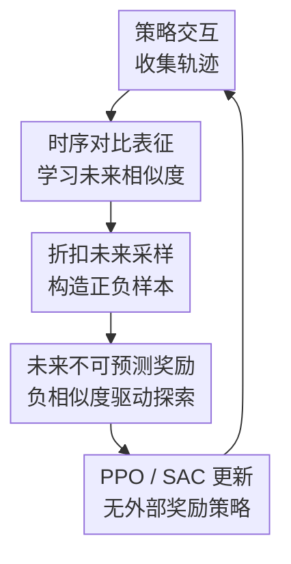

# Temporal Representations for Exploration: Learning Complex Exploratory Behavior without Extrinsic Rewards

**会议**: ICLR2026  
**OpenReview**: [https://openreview.net/forum?id=KjYpHySlb0](https://openreview.net/forum?id=KjYpHySlb0)  
**论文**: [Project Website](https://temp-contrastive-explr.github.io/)  
**代码**: https://github.com/FaisalAhmed0/c-tec.git  
**领域**: 强化学习 / 探索 / 表征学习  
**关键词**: 时序对比学习、内在奖励、无监督强化学习、状态覆盖、探索表征  

## 一句话总结
这篇论文提出 C-TeC，用时序对比表征估计当前状态动作对与未来状态的相似性，再把“未来结果在表征空间里难以预测”的程度转成内在奖励，从而在没有外部奖励的情况下学到迷宫覆盖、机械臂拾放和 Craftax 生存游戏中的复杂探索行为。

## 研究背景与动机
**领域现状**：无监督强化学习和 curiosity-driven exploration 通常用内在奖励驱动 agent 自己找事情做。常见路线包括计数/伪计数奖励、RND/ICM 这类预测误差奖励、基于表征熵或 KNN 距离的状态覆盖奖励，以及更近的基于时序距离或 episodic memory 的探索方法。

**现有痛点**：这些方法各有一个不太舒服的盲区。计数方法在连续高维状态里很难定义“同一个状态”；普通预测误差方法容易被无意义随机噪声吸引，也就是 Noisy TV 问题；只看状态表征熵的方法不一定知道哪些状态对未来行为真的重要；而 ETD 这类时序距离方法虽然抓住了“时间结构”，但需要 quasimetric 参数化和 episodic memory，算法复杂度较高，也不太自然地接入 off-policy RL。

**核心矛盾**：探索奖励既要鼓励 agent 去到还没有充分理解的地方，又不能把随机噪声当成“新奇”。换句话说，奖励应该关心环境动力学和策略未来会造成什么，而不是关心观测里每一个可重构的像素或随机位。

**本文目标**：作者希望构造一种更直接的探索信号：不依赖外部任务奖励，不显式学习完整世界模型，不维护 episodic memory，却能根据轨迹里的时间结构判断哪些状态动作对会通向“有信息量、但尚不容易预测”的未来。

**切入角度**：RL 本质上是关于时间的决策问题。一个好的探索表征不一定要重建整个输入，而应该保留能区分“从这里往后会到哪里”的信息。时序对比学习正好提供了这种能力：把当前状态动作对和它在同一条轨迹中的折扣未来状态拉近，把其他未来状态当作负样本拉远。

**核心 idea**：用时序对比表征学习一个当前状态动作对到未来状态的相似度模型，再把低相似度未来状态对应的表征距离作为内在奖励，让 agent 主动寻找未来结果仍不可预测但又由真实轨迹支持的状态。

## 方法详解

### 整体框架
C-TeC 的流程可以理解成一个闭环：agent 先用当前策略收集轨迹，把轨迹放入 buffer；随后从 buffer 中采样状态动作对 $(s_t,a_t)$，再按几何分布抽一个未来偏移 $\Delta$ 得到 $s_f=s_{t+\Delta}$；对比模型学习判断这个 $s_f$ 是否真的是 $(s_t,a_t)$ 的未来；最后把表征空间中“当前状态动作对与未来状态不相似”的程度作为奖励喂给 PPO 或 SAC。它不是奖励“没见过的随机观测”，而是奖励“在已收集轨迹的未来分布里，目前表征还解释不好的未来结果”。

这个图里的核心贡献是中间三步：时序对比表征负责把“时间上可达”变成表征相似度，折扣未来采样定义了正样本来自多远的未来，未来不可预测奖励则把表征距离转成 RL 可以优化的标量奖励。轨迹收集和 PPO/SAC 更新是标准脚手架，但它们让这个奖励可以同时用于 on-policy 和 off-policy 设置。

### 关键设计
**1. 时序对比表征：只保留对未来可达性有用的信息**

传统 curiosity 方法经常把“预测观测”当作目标，但完整观测里有很多和控制无关的信息。C-TeC 选择学习两个编码器：$\phi_\theta(s_t,a_t)$ 编码当前状态动作对，$\psi_\theta(s_f)$ 编码未来状态。模型并不重建 $s_f$，而是学习一个相似度 $C_\theta((s_t,a_t),s_f)$，让真实未来状态比分布中其他负样本更相似。这样得到的表征更接近“从这里出发会通向哪些未来”的摘要，而不是观测压缩器。

论文把未来状态分布写成轨迹 buffer 上的折扣占用分布：$p_T(s_f \mid s_t,a_t)=(1-\gamma)\sum_{\Delta=0}^{\infty}\gamma^\Delta p_T(s_{t+\Delta}=s_f\mid s_t,a_t)$。训练时先采样 $\Delta\sim\mathrm{Geom}(1-\gamma)$，再从同一条轨迹里取 $s_{t+\Delta}$ 作为正样本。这个定义很关键：正样本不是任意相邻帧，而是折扣未来，因此表征会感知短期和长期可达性。

**2. 未来不可预测奖励：把低时序相似度变成内在探索信号**

对比模型学好后，C-TeC 不直接奖励模型分类准确，而是奖励当前状态动作对与采样未来状态之间的负相似度。若相似度用负距离表示，例如 $C_\theta((s_t,a_t),s_f)=-\|\phi_\theta(s_t,a_t)-\psi_\theta(s_f)\|$，则内在奖励就是 $r_{\mathrm{intr}}(s_t,a_t)=-C_\theta((s_t,a_t),s_f)$。直觉上，agent 会被鼓励去到那些未来结果在时序表征里还不容易预测的位置。

这和普通 surprise maximization 的区别在于：C-TeC 的“惊讶”经过时序对比表征过滤。随机噪声如果不能帮助区分轨迹未来，就不会稳定提高对比分类能力，也不会成为强奖励来源。论文在 Noisy TV 设置中也强调了这一点：表征只捕捉对时间分类有用的特征，因此对分类无关的随机扰动更不敏感。

**3. 反向 KL 视角：奖励的是熟悉支撑上的多未来可能性**

作者给出一个很有启发性的解释：如果对比 critic 完美估计点互信息，那么期望内在奖励可写成 $-D_{\mathrm{KL}}[p_T(s_f\mid s_t,a_t)\|p_T(s_f)]$。这不是简单地最大化状态熵，也不是把条件未来分布拟合成一个到处都有质量的均值型分布，而是偏向 mode-seeking 的行为。

展开后可以看成两项：一项是 $H[S_f\mid s_t,a_t]$，鼓励当前状态动作后面的未来更分散；另一项是 $\mathbb{E}_{p_T(s_f\mid s_t,a_t)}[\log p_T(s_f)]$，要求这些未来状态仍落在 buffer 已经有支撑的区域。这个解释说明了为什么 C-TeC 会偏好“能通向很多真实未来”的位置，而不是被完全陌生但无意义的噪声吸走。

**4. 简化 ETD 的时序探索：不用 quasimetric 和 episodic memory**

ETD 同样利用时序对比思想，但它显式学习 quasimetric 距离，并通过 episodic memory 计算当前状态到历史状态的最小时序距离。C-TeC 把这个设计大幅简化：它直接在两个表征之间计算 $L_1$ 或 $L_2$ 距离，不要求 metric residual network，也不需要维护“过去到过哪里”的 episodic memory。

这个简化不是单纯工程优化。论文认为 ETD 的信号更偏 backward-looking，即当前状态离过去状态有多远；C-TeC 更偏 forward-looking，即当前状态动作能通向怎样的未来状态分布。对于 Craftax 这类长链条开放世界任务，forward-looking 的奖励可能更容易鼓励 agent 发现能开启后续技能和资源的状态。

### 一个完整示例
假设一个 humanoid agent 从 U 形迷宫入口出发。早期轨迹只在入口附近晃动，buffer 里的未来状态也主要集中在近处。对比模型会很快学会：从入口处某些动作出发，短期未来大概率还是入口附近，所以这些未来状态和当前状态动作对在表征空间里会比较接近，奖励逐渐降低。

当策略偶然跑到墙边、跳跃或攀越姿态附近时，后续轨迹可能突然进入迷宫另一侧。对于当前表征来说，这些远端未来状态不再像普通局部移动那样容易预测，于是 $\|\phi(s_t,a_t)-\psi(s_f)\|$ 变大，内在奖励升高。RL 更新随后会提高这类动作序列的概率，agent 就更常进入能产生新未来分布的位置。论文中的 humanoid-u-maze 结果正体现了这种现象：C-TeC 学会了跳过墙逃出 U 形迷宫，而其他探索方法没有发现这种意外但有效的行为。

再看 Craftax。一个随机策略可能只会四处移动，而 C-TeC 如果发现某些状态会通向“采集资源、合成工具、打开新区域”这样的未来分支，就会给这些状态动作更高奖励。它并不知道外部成就奖励，但未来分布的结构变化本身会成为探索信号，因此最终能解锁更多 achievements。

### 损失函数 / 训练策略
对比模型使用 InfoNCE 训练。对一个 batch $B=\{(s_t^{(i)},a_t^{(i)},s_f^{(i)})\}_{i=1}^{K}$，每个样本自己的未来状态是正样本，其他样本的未来状态作为负样本。损失大致是让 $C_\theta((s_t^{(i)},a_t^{(i)}),s_f^{(i)})$ 高于 $C_\theta((s_t^{(i)},a_t^{(i)}),s_f^{(j)})$。论文还沿用 contrastive RL 中常见的 LogSumExp regularizer，并学习温度参数 $\tau$。

策略训练方面，机器人连续控制实验使用 SAC，Craftax 使用 PPO，并在 Craftax 中使用带 GRU memory 的 PPO-RNN。机器人环境里 critic 相似度用负 $L_1$ 距离效果最好，Craftax 中负 $L_2$ 距离更好。作者还强调表征需要单位范数归一化；附录消融显示，不归一化会明显损害探索。

实现上，C-TeC 每轮交互后把轨迹加入 buffer，从 buffer 采样 $(s_t,a_t)$ 和折扣未来状态 $s_f$，先计算内在奖励，再更新对比表征和 RL 策略。大多数环境用单个未来状态近似期望即可；Craftax 中为了降低方差，作者用多个未来状态的 Monte Carlo 估计，并可用类似 return 累积的技巧把计算从 $O(H^2)$ 降到 $O(H)$。

## 实验关键数据

### 主实验
论文主要验证三个问题：C-TeC 是否能替代更复杂的 ETD，奖励是否真的反映未来状态分布，以及它能否在 locomotion、manipulation 和 open-world survival 中学到有意义的探索行为。评测环境包括 ant_large_maze / ant_hardest_maze、humanoid_u_maze、arm_binpick_hard，以及 Craftax-Classic / Crafter。

| 场景 | 指标 | 本文 C-TeC | 主要对比方法 | 结论 |
|------|------|-----------|--------------|------|
| ant_hardest_maze vs ETD | 访问状态数 | 与 ETD 接近 | ETD | 两者相近，说明无需 quasimetric 也能得到可竞争的时序探索 |
| humanoid_u_maze vs ETD | 访问状态数 | 高于 ETD，但方差更大 | ETD | C-TeC 更容易发现跨墙/跳跃等复杂行为 |
| arm_binpick_hard vs ETD | cube position 覆盖 | 低于 ETD | ETD | 机械臂拾放中 ETD 更强，C-TeC 不是所有机器人场景都占优 |
| Crafter / Craftax | 成就或分数 | 明显高于 ETD、RND、ICM、E3B | ETD / RND / ICM / E3B | forward-looking 的未来分布奖励在开放世界任务中特别有效 |

论文还报告了 C-TeC 在少量环境步数下的状态覆盖，说明它不是只能靠极长训练才生效。

| 环境 | 500M steps | 50M steps | 30M steps | 说明 |
|------|------------|-----------|-----------|------|
| Ant-hardest-maze | $2500 \pm 300$ | $1916 \pm 430$ | $1119 \pm 304$ | 交互步数减少 10-16 倍后仍能覆盖大量迷宫状态 |
| Humanoid-u-maze | $230 \pm 40$ | $143 \pm 34$ | $102 \pm 11$ | 高维 humanoid 中仍有可观探索能力 |
| Arm-binpick-hard | $135000 \pm 10000$ | $40000 \pm 14000$ | $31150 \pm 3156$ | manipulation 场景随步数扩展明显，500M 时覆盖最高 |

### 消融实验
| 配置 | 关键指标 | 说明 |
|------|---------|------|
| Full C-TeC | 多环境状态覆盖最高或接近最高 | 完整方法结合归一化表征、InfoNCE、距离 critic 和折扣未来采样 |
| 不做表征归一化 | 覆盖显著下降 | 单位范数约束对稳定相似度尺度很重要 |
| monolithic critic $f(s,a,s_f)$ | 明显弱于双编码器 | 可分解的 $\phi(s,a)$ 与 $\psi(s_f)$ 参数化是关键，不只是任意分类器 |
| forward KL reward | 明显弱于 reverse KL / mode-seeking reward | 说明 C-TeC 的探索来自特定的分布偏好，而不是简单拟合宽泛未来分布 |
| critic 距离选择 | 机器人中 $L_1$ 更好，Craftax 中 $L_2$ 更好 | 相似度函数需要按环境调节 |
| future state sampling 变化 | 多数变体仍强于 baseline | 几何采样、均匀采样和 $\gamma$ schedule 都能工作，方法对采样策略较稳健 |

### 关键发现
- C-TeC 最稳定的优势不在于每个机器人任务都压过 ETD，而在于用更简单的表征距离和无 episodic memory 的设计，就能在连续控制中达到可竞争表现，并在 Craftax/Crafter 这类长程开放世界任务中明显更强。
- 奖励热力图显示，C-TeC 的奖励会随着训练覆盖区域变化而迁移：已经被策略熟悉的近处状态奖励下降，远处或未来分布尚未被表征解释好的区域奖励升高。
- Noisy TV 实验说明它不容易被纯随机噪声诱骗；这是时序对比表征相对裸预测误差奖励的重要优势。
- 消融最关键的两个点是表征参数化和 reward 方向：双编码器距离 critic 与 reverse-KL-like 的 mode-seeking 信号缺一不可。

## 亮点与洞察
- 这篇论文的最大亮点是把“探索”从状态新奇性转成“未来可预测性”。它奖励的不是某个观测本身新不新，而是当前动作后续会不会打开表征模型还没掌握的未来分布。
- 方法比 ETD 更干净：不需要 quasimetric，不需要 episodic memory，也不需要显式回看过去所有状态。这让它更容易放进 SAC 这类 off-policy 算法，也降低了工程复杂度。
- 反向 KL 的解释很漂亮，因为它同时解释了“为什么不是 Noisy TV”和“为什么会持续探索”。奖励要求未来状态在已有 marginal 支撑上，但条件分布又要足够分散，所以 agent 会不断扩张真实可达的状态集合。
- 表征学习在这里不是辅助任务，而是奖励定义的一部分。附录里 monolithic critic 的失败说明：如果没有两个表征空间之间的距离结构，单纯做三元组分类并不能自然形成好的探索几何。
- 对其他任务的迁移启发是：只要能定义“当前决策单元”和“未来结果”，C-TeC 思路就可能用于技能发现、离线预训练、goal-conditioned RL，甚至某些 agent 工具使用场景中的长期结果探索。

## 局限与展望
- C-TeC 仍然需要大量环境交互。虽然附录展示 30M/50M steps 也有效，但主实验中机器人任务使用 500M steps，Craftax 使用 1B steps，这对真实机器人或昂贵模拟仍偏重。
- 相似度函数和折扣因子存在环境依赖。机器人实验中 $L_1$ 好，Craftax 中 $L_2$ 好；不同 $\gamma_{cl}$ 在不同任务上的最佳点也不同，说明方法还没有完全免调参。
- arm_binpick_hard 中 ETD 优于 C-TeC，提示 forward-looking 未来分布奖励并不总是比 backward-looking novelty 更适合 manipulation。某些任务可能需要更明确的对象接触、因果控制或局部技能信号。
- 当前实验主要是无外部奖励探索。论文展望里也提到未来需要研究如何与任务奖励结合，以及如何适配像素输入和部分可观测设置。
- 对真实机器人来说，C-TeC 可能还要处理安全探索、动作约束和样本效率问题。仅靠“未来不可预测”可能会鼓励危险或不可逆状态，需要和安全约束或风险估计结合。

## 相关工作与启发
- **vs RND / ICM**: RND 和 ICM 都用预测误差制造 curiosity，容易在噪声或高维无关细节上浪费奖励。C-TeC 的预测目标是时序对比分类，表征只保留对未来可达性有帮助的信息，因此更不容易被随机扰动吸引。
- **vs APT**: APT 学 observation representation 后用 KNN 距离估计状态熵，更像“覆盖状态空间”。C-TeC 学的是当前状态动作对与未来状态之间的时间结构，因此更直接服务于控制和长期探索。
- **vs ETD**: ETD 学 quasimetric 时序距离，并用 episodic memory 奖励离过去状态远的地方；C-TeC 直接用时序对比表征距离，奖励能通向低可预测未来的状态动作对。前者偏回看过去的新颖性，后者偏展望未来的可达分布。
- **vs world-model exploration**: 世界模型方法试图预测或重建未来观测，信息更完整但计算更贵，也可能被无关细节拖累。C-TeC 不重建完整状态，只学习足以区分折扣未来的表征，是一种更轻量的时间结构建模。
- **启发**: 如果一个任务的核心难点是“找到能打开后续可能性的状态”，而不是立即完成给定目标，那么 C-TeC 这类 future-distribution reward 很值得尝试。它尤其适合开放世界、生存游戏、长程导航和预训练阶段的行为发现。

## 评分
- 新颖性: ⭐⭐⭐⭐☆ 用时序对比表征做内在奖励并不完全脱离已有对比 RL，但把负时序相似度、reverse-KL 解释和无 episodic memory 的探索算法结合得很清楚。
- 实验充分度: ⭐⭐⭐⭐☆ 覆盖连续控制、机械臂和 Craftax，并有大量消融；不足是部分主图缺少表格化精确数值，真实机器人验证也还没有。
- 写作质量: ⭐⭐⭐⭐☆ 方法主线和信息论解释较清楚，附录实现细节充分；但论文中少量公式排版和问题编号有小瑕疵。
- 价值: ⭐⭐⭐⭐⭐ 对无监督 RL 探索很有参考价值，尤其提供了一个比 ETD 更简单、比普通预测误差更抗噪的时序表征奖励框架。

<!-- RELATED:START -->

## 相关论文

- [\[ICLR 2026\] Exploratory Diffusion Model for Unsupervised Reinforcement Learning](exploratory_diffusion_model_for_unsupervised_reinforcement_learning.md)
- [\[ICLR 2026\] Lookahead Tree-Based Rollouts for Enhanced Trajectory-Level Exploration in Reinforcement Learning with Verifiable Rewards](lookahead_tree-based_rollouts_for_enhanced_trajectory-level_exploration_in_reinf.md)
- [\[ICLR 2026\] Diversity-Incentivized Exploration for Versatile Reasoning](diversity-incentivized_exploration_for_versatile_reasoning.md)
- [\[ICLR 2026\] Beyond Noisy-TVs: Noise-Robust Exploration Via Learning Progress Monitoring](beyond_noisy-tvs_noise-robust_exploration_via_learning_progress_monitoring.md)
- [\[ICLR 2026\] Dual Goal Representations](dual_goal_representations.md)

<!-- RELATED:END -->
