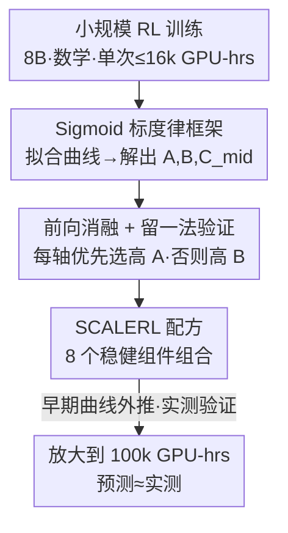

# The Art of Scaling Reinforcement Learning Compute for LLMs

**会议**: ICLR 2026  
**OpenReview**: [https://openreview.net/forum?id=FMjeC9Msws](https://openreview.net/forum?id=FMjeC9Msws)  
**代码**: [www.devvrit.com/scalerl_curve_fitting](https://www.devvrit.com)（曲线拟合的最小复现脚本）  
**领域**: 强化学习 / LLM 后训练 / Scaling Law  
**关键词**: RL 标度律、可预测放大、计算效率、PipelineRL、SCALERL

## 一句话总结
本文用一条 sigmoid 形状的「算力—性能」标度律把 LLM 的 RL 训练拆成「性能天花板 $A$」和「计算效率 $B$」两个可拟合参数，在 40 万 GPU-hours 的系统消融基础上挑出一套稳健配方 SCALERL，并用小算力曲线外推、在单次 10 万 GPU-hours 的训练里准确预测了最终验证性能，把 RL 训练带向了预训练那样的可预测性。

## 研究背景与动机
**领域现状**：RL 已经成为 LLM 后训练的核心环节——test-time thinking、agentic 能力大多靠 RL 解锁。算力投入也在指数级飙升：DeepSeek-R1-Zero 的 RL 阶段就烧了 10 万 H800 GPU-hours，o1→o3、Grok-3→Grok-4 的 RL 算力都有 10× 以上的跃升。

**现有痛点**：可是「怎么把 RL 放大」这件事仍然是「艺术多于科学」。近年的突破大多来自孤立的算法研究（DAPO、GSPO、CISPO）和模型专属的训练报告（Magistral、MiniMax-M1），它们给的都是特定场景下的 ad-hoc 方案，没人回答「一个 RL 方法到底能不能随算力可预测地变好」。预训练早就有 Kaplan / Chinchilla 这样的标度律，能用小模型外推大模型，RL 却完全没有对应工具。

**核心矛盾**：没有可靠的「先验筛选」手段，判断一个 RL recipe 好不好只能把它一路烧到算力极限，这把绝大多数学术界排除在外，也让「设计选择」沦为玄学。更糟的是，很多在小算力下看起来更好的方法，放大后反而更差（bitter lesson），小规模对比会系统性误导。

**本文目标**：(1) 给 RL 建立一个像预训练标度律那样的「算力—性能」预测框架；(2) 用这个框架系统消融常见设计选择，搞清它们到底是抬高天花板还是只改效率；(3) 把最优选择拼成一套能可预测放大的配方。

**切入角度**：作者注意到 RL 的验证集 pass rate 随 $\log(\text{compute})$ 呈饱和增长——低算力慢、中段快、高算力饱和，正好是 sigmoid 形状。于是不用预训练的幂律，而用一条 sigmoid 曲线去拟合，实测比幂律稳得多。

**核心 idea**：用 sigmoid 标度律把 RL 性能解耦成「渐近天花板 $A$」与「计算效率 $B,C_{mid}$」，从早期训练动态就估出这两个参数，从而在小算力下预判一个方法的可扩展性，再据此挑组件、拼出 SCALERL。

## 方法详解

### 整体框架
本文的「方法」不是发明一个新 RL 算法，而是先立一把**度量可扩展性的尺子**（sigmoid 标度律），再用这把尺子系统地**做消融、挑组件**，最后把胜出的组件**拼成 SCALERL 配方**并验证它能可预测地放大到极端算力。

整条流水线是：在 8B 稠密模型、可验证数学任务上跑一批小算力 RL（单次 ≤16k GPU-hours）→ 对每条 run 拟合 sigmoid 曲线，解出 $(A,B,C_{mid})$ → 做「前向消融」，在每个设计轴上优先选高 $A$、否则选高 $B$ 的选项 → 把最优选择合并成 SCALERL，再用「留一法」逐个回退验证每个组件都有正贡献 → 最后把 SCALERL 放大到单次 10 万 GPU-hours，用前 5 万小时拟合的曲线外推后 5 万小时，确认预测与实测吻合。

### 关键设计

**1. Sigmoid 标度律框架：把 RL 性能解耦成「天花板 $A$」和「效率 $B$」**

痛点是 RL 没有可预测的度量：你不知道一个 recipe 是「天花板更高」还是「只是收敛更快」，也无法从小算力外推大算力。本文在「期望奖励 $R_C$（iid 验证集 pass rate）」与「训练算力 $C$」之间拟合一条饱和的 sigmoid 曲线：

$$R_C - R_0 = (A - R_0)\cdot\frac{1}{1+(C_{mid}/C)^B}$$

其中 $0\le A\le 1$ 是大算力极限下的**渐近 pass rate（性能天花板）**，$R_0$ 是 0 算力时的初始奖励，$B>0$ 是决定**计算效率**的标度指数（越大爬升越陡），$C_{mid}$ 是达到一半总增益所需的算力（越小爬得越快）。直觉上，$A$ 刻画「这个方法最终能多强」，$B,C_{mid}$ 刻画「它多快能到那」。作者特意选 sigmoid 而非预训练常用的幂律，因为 pass rate 是有界量（饱和到 1），sigmoid 拟合在实测中明显更稳健；且拟合时丢掉最初 ~1.5k GPU-hours 的低算力噪声段，剩下部分就走可预测轨迹。这把尺子的价值在于：**只用早期训练动态就能估出 $(A,B)$，从而在烧光算力之前预判方法的可扩展性**——这正是 bitter lesson 的解药（小算力领先的方法可能大算力落败，但 $A$ 已能提前看出）。

**2. 前向消融 + 留一法：用「先挑天花板、再挑效率」的准则系统筛组件**

有了尺子，怎么用它挑设计就成了关键。作者把消融分成两步走。**前向消融**：从一个去掉 KL 正则、带 DAPO 非对称裁剪的 GRPO「基线」出发，在六个设计轴（损失聚合、优势归一化、精度修复、数据课程、batch 定义、损失类型）外加异步 RL setup 上逐个换选项，每个选项在 3.5k–4k GPU-hours 拟合曲线；**选择准则是：能抬高 $A$ 就优先选高 $A$ 的，$A$ 打平时再选高 $B$（效率）的**。一个关键经验性发现是：除了异步算法、损失函数、模型精度这三项会显著动 $A$，其余干预（loss aggregation、课程、长度惩罚、优势归一化）大多只调效率 $B$、几乎不动天花板——这直接推翻了「这些 trick 能提峰值性能」的常识。

把胜出选项合并成 SCALERL 后，再做**留一法（LOO）**反向验证：从完整 SCALERL 出发，一次只把一个轴回退成基线版本、重训到 16k GPU-hours，确认每个组件在「其它都在」的情况下仍有正贡献。由于多数 LOO 变体的 $A$ 已经接近，作者把 sigmoid 重写成 $F(R_C)=C^B$ 的幂律形式（$F(R_C)=C_{mid}^{B}/(\frac{A-R_0}{R_C-R_0}-1)$），在 $\log F$–$\log C$ 图上让斜率 $B$ 直接可见，从而比出 SCALERL 效率最高。所有 run 都用前 8k GPU-hours 拟合、外推到 16k 验证，预测曲线与实测点紧贴，证明配方稳定可预测。

**3. SCALERL 配方：把 8 个稳健组件拼成可预测放大的 recipe**

本文不发明新算法，而是把消融选出的 8 个组件组合起来：① **异步 PipelineRL-8**——生成器流式产 rollout，训练器一更新就把新参数推给生成器（用旧策略的 stale KV cache 继续生成），最多领先 $k=8$ 步；相比传统 PPO-off-policy，它 $A$ 相当但大幅减少 idle 时间、把效率 $B$ 拉高，因此能在更低算力下做大规模 sweep。② **强制长度中断**——超长推理时插入「时间到，停止思考」式的 `</think>` 短语逼模型收尾，比长度惩罚更稳。③ **CISPO 损失**——截断重要性采样 + 原始 policy gradient，对 IS 比率做 stop-gradient 截断 $\text{sg}(\min(\rho_{i,t},\epsilon))$，相比 DAPO 显著抬高 $A$（且呈持续近线性增长）。④ **prompt 级损失聚合**（每个 prompt 等权）。⑤ **batch 级优势归一化**（按整个 batch 的奖励标准差归一）。⑥ **FP32 logits**——生成器与训练器的推理/训练 kernel 在 LM head 处有数值失配，直接污染 IS 比率；只把 head 算成 FP32 就把 $A$ 从 0.52 提到 0.61，是单项收益最大的修复。⑦ **零方差过滤**——丢掉一个 batch 内所有 rollout 奖励相同（优势为 0、无梯度）的 prompt，只保留有效 batch。⑧ **No-Positive-Resampling**——pass rate ≥ 0.9 的 prompt 一旦学会就永久移出后续 epoch，省下算力给真正有信号的样本。最终损失把这些融在一起：

$$J_{\text{SCALERL}}(\theta)=\mathbb{E}\Big[\tfrac{1}{\sum_g |y_g|}\sum_{i}\sum_{t}\text{sg}(\min(\rho_{i,t},\epsilon))\,\hat A_i^{norm}\log\pi_\theta^{train}(y_{i,t})\Big]$$

约束为 $0<\text{mean}(\{r_j\})<1$（零方差过滤）且 $\text{pass rate}(x)<0.9$（no-positive-resampling）。这套组合把 SCALERL 推到 $A=0.61$ 的新 SOTA，并在多个放大轴上保持可预测。

### 损失函数 / 训练策略
主实验：8B 稠密模型、可验证数学任务、batch size 768、最大输出 14,336 token；从 Polaris-53k 留出 1000 条 prompt 做 iid 验证，每 100 步用 16 次生成测 mean@16 pass rate 并拟合曲线。前向消融在 3.5k–4k GPU-hours、LOO 在 16k GPU-hours、最终放大跑到单次 100k GPU-hours（8B）/ 50k（17B×16 Scout MoE）。

## 实验关键数据

### 主实验
SCALERL 与主流 recipe 在 iid 验证集上的渐近天花板 $A$ 对比（拟合 Eq.1，越高越强）：

| 方法 | 代表来源 | 渐近天花板 $A$ | 可预测性 |
|------|----------|----------------|----------|
| GRPO | DeepSeek | 较低 | 外推偏差较大 |
| DAPO | Qwen-2.5 | 较低 | — |
| Magistral | Mistral | 中 | — |
| MiniMax-M1 (CISPO) | MiniMax | 较高 | 稳定可外推 |
| **SCALERL** | 本文 | **0.61（最高）** | 50k→100k 外推准确 |

可预测放大验证（外推曲线与延长训练的实测「×」点吻合）：

| 放大轴 | 设置 | 效果 |
|--------|------|------|
| 模型规模 | 8B → 17B×16 MoE (Scout) | 天花板大幅抬高，仅用 8B 的 1/6 算力即超过 8B 性能 |
| 生成长度 | 14k → 32k token | 早期更慢（$B$↓、$C_{mid}$↑）但抬高天花板 $A$ |
| 全局 batch | → 2k | 稳定训练，外推 50k→100k 命中 |
| 单 prompt 生成数 | 8/16/24/32（固定总 batch） | 曲线基本不变，属二阶选择 |

### 消融实验
留一法（从 SCALERL 回退单个组件，16k GPU-hours）与前向消融关键结论：

| 配置 | 对 $A$ / $B$ 的影响 | 说明 |
|------|---------------------|------|
| Full SCALERL | $A=0.61$，$B$ 最高 | 完整配方，效率最高 |
| w/o FP32 logits | $A$ 0.61 → 0.52 | 单项天花板掉点最多 |
| DAPO 替 CISPO | $A$ 明显下降 | 损失类型显著动天花板 |
| PPO-off-policy 替 PipelineRL | $A$ 相当，$B$ 下降 | 只伤效率不伤天花板 |
| 回退 loss 聚合 / 归一化 / 课程 | $A$ 几乎不变，$B$ 略降 | 这些只调效率 |

### 关键发现
- **三类决策分工明确**：异步算法、损失函数、模型精度三项主要决定天花板 $A$；其余组件（聚合、归一化、课程、过滤）几乎只调效率 $B$，单项影响小但累积起来明显提升效率。
- **FP32 logits 是性价比最高的单项修复**：仅把 LM head 算成 FP32，$A$ 从 0.52 跳到 0.61，因为它直接修了污染 IS 比率的数值失配。
- **前向 vs 反向消融的不对称**：前向消融时新组件常同时提 $A$ 和 $B$；但从完整配方做 LOO 回退时，每项对 $A$ 影响都很小、主要伤 $B$——说明组合后的鲁棒性来自累积效应。
- **bitter lesson 实锤**：小算力领先的方法（如某些 DAPO 配置）放大后被反超，但用早期 $(A,B)$ 拟合就能提前看出谁能扩展。

## 亮点与洞察
- **把「可扩展性」变成可测量的两个数**：$A$（天花板）与 $B$（效率）的解耦让「这个 trick 到底有没有用」从玄学变成可拟合、可外推的科学问题，这套方法论本身比 SCALERL 配方更有迁移价值。
- **用小算力预判大算力**：单次 ≤16k GPU-hours 的消融就能预测 100k GPU-hours run 的最终性能，把昂贵的「烧到极限才知道好坏」降维成「拟合早期曲线」，让学术界也能参与 RL recipe 研究。
- **sigmoid 而非幂律**：针对有界指标（pass rate）选饱和曲线，是个能直接迁移到任何「准确率类」标度律拟合的实用经验。
- **配方全是已有组件的组合**：SCALERL 不发明新算法，证明「可预测放大」更多靠工程稳健性（精度、异步、过滤）而非新损失。

## 局限与展望
- **只研究 in-distribution 验证性能**：标度律拟合的是训练分布留出集，泛化到真正 held-out test 的规律未完全刻画；作者只观察到 in-distribution 与下游（如 AIME-24）有相关性。
- **任务范围窄**：主实验集中在可验证数学任务，多任务（数学+代码）只是初步验证，不同数据混比下的可预测性待深入。
- **未给出跨预训练算力/模型规模/RL 数据量的完整「标度律」**：本文是固定模型与数据下的算力—性能曲线，真正的多维 RL scaling law 是 future work。
- **配方非终点**：作者明确 SCALERL 不是故事的结尾；稠密/生成式奖励、多轮 RL、agentic 交互等轴尚未纳入。

## 相关工作与启发
- **vs ProRL**：ProRL 靠 KL 正则、policy reset、entropy 控制等启发式在 1.5B 小模型上做长训练（~2000 步、16k GPU-hours）；本文算力大 6×、模型更大，且核心是建立可预测的标度律框架而非堆稳定性 trick。
- **vs LitePPO (Liu et al. 2025c)**：LitePPO 在 Qwen-3 4B/8B 上做一致条件下的设计消融、给出极简组合，但聚焦比较性实证结论、不研究 scaling 行为；本文显式拟合并外推算力—性能曲线。
- **vs 各家训练报告（DAPO/GSPO/CISPO/Magistral/MiniMax-M1）**：它们提供特定情境的 ad-hoc recipe，本文把这些组件放进统一的 $(A,B)$ 框架里逐一量化可扩展性，并组合出 SOTA 配方。

## 评分
- 新颖性: ⭐⭐⭐⭐⭐ 首次把预训练标度律方法论系统移植到 LLM 的 RL 训练，$A/B$ 解耦的框架是真正的新范式。
- 实验充分度: ⭐⭐⭐⭐⭐ 40 万 GPU-hours 系统消融 + 单次 10 万 GPU-hours 外推验证，规模与严谨度罕见。
- 写作质量: ⭐⭐⭐⭐⭐ 三大原则清晰、消融与外推逻辑自洽，框架与配方层次分明。
- 价值: ⭐⭐⭐⭐⭐ 把 RL recipe 研究从「烧到极限」降维成「拟合早期曲线」，对学术界与工业界都有直接实用价值。

<!-- RELATED:START -->

## 相关论文

- [\[ICLR 2026\] floq: Training Critics via Flow-Matching for Scaling Compute in Value-Based RL](floq_training_critics_via_flow-matching_for_scaling_compute_in_value-based_rl.md)
- [\[ICLR 2026\] PROS: Towards Compute-Efficient RLVR via Rollout Prefix Reuse](pros_towards_compute-efficient_rlvr_via_rollout_prefix_reuse.md)
- [\[ICLR 2026\] ReTool: Reinforcement Learning for Strategic Tool Use in LLMs](retool_reinforcement_learning_for_strategic_tool_use_in_llms.md)
- [\[ICLR 2026\] QeRL: Quantization-enhanced Low-rank Reinforcement Learning for LLMs](qerl_beyond_efficiency_-_quantization-enhanced_reinforcement_learning_for_llms.md)
- [\[ICLR 2026\] Erase to Improve: Erasable Reinforcement Learning for Search-Augmented LLMs](erase_to_improve_erasable_reinforcement_learning_for_search-augmented_llms.md)

<!-- RELATED:END -->
