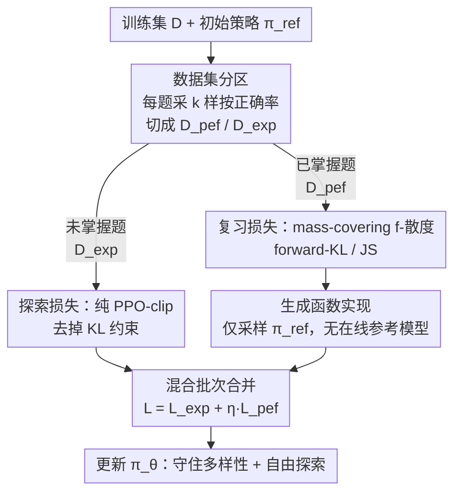

# The Choice of Divergence: A Neglected Key to Mitigating Diversity Collapse in Reinforcement Learning with Verifiable Reward

**会议**: ICLR 2026  
**OpenReview**: [https://openreview.net/forum?id=xPEsxcO7F7](https://openreview.net/forum?id=xPEsxcO7F7)  
**代码**: https://github.com/seamoke/DPH-RL (有)  
**领域**: LLM推理 / 强化学习 / RLVR  
**关键词**: RLVR, 多样性坍缩, f-散度, Pass@k, 灾难性遗忘

## 一句话总结
本文指出 RLVR 普遍采用的 reverse-KL（寻峰）正则是 Pass@k 多样性坍缩与灾难性遗忘的元凶，提出用 mass-covering 的 f-散度（forward-KL / JS）作为"复习机制"，配合数据集分区与生成函数实现，在数学与 SQL 任务上同时提升 Pass@1 和 Pass@k 并保住跨域能力。

## 研究背景与动机

**领域现状**：用可验证奖励做强化学习（RLVR，如 GRPO、DAPO）是当前提升 LLM 数学/代码推理能力的主流路线，奖励来自答案是否正确，再加一个 KL 散度项约束策略不要偏离参考模型太远。

**现有痛点**：存在一个反常现象——RLVR 微调后单次尝试正确率（Pass@1）上去了，但多次尝试正确率（Pass@k）却停滞甚至低于基座模型，同时伴随灾难性遗忘：模型在训练域外（OOD）任务上只能答对原来会做题目的约 85%。这说明 RLVR 不是在学新推理，而是把模型过拟合到已知的少数解法上，牺牲了解的多样性。

**核心矛盾**：社区几乎清一色用标准的 reverse-KL $D_{\mathrm{KL}}(\pi_\theta\|\pi_{\mathrm{ref}})=\mathbb{E}_{\pi_\theta}\log\frac{\pi_\theta}{\pi_{\mathrm{ref}}}$。它的 **mode-seeking（寻峰）** 本性会主动把策略收窄到单一高概率解，从而加速多样性衰减；而完全不加 KL 项（GRPO w/o KL、DAPO）又等于撤掉了任何防止模型漂离原始知识库的护栏。两种主流做法都缺少一个"保留已有知识"的机制。

**本文目标**：在线 RLVR 框架内，既要继续提升 Pass@1，又要守住 Pass@k 和跨域泛化、避免灾难性遗忘。

**切入角度**：作者把目光从被反复研究的"熵控制 / Pass@k 奖励 / 训练配方"这三条路，转向被严重忽视的第四个轴——**散度项本身的选择**。f-散度大家族里除了 reverse-KL 还有 forward-KL、JS、α-散度等"mass-covering（覆盖质量）"成员，它们会惩罚策略漏掉参考分布的任何一个峰，理论上正好对症多样性坍缩，但此前只在离线 RL / 偏好对齐（f-DPO、f-PO）里被用过。

**核心 idea**：把散度项从"单纯的策略约束"重新定义为"主动的多样性保持机制"——用 mass-covering 的 forward-KL / JS 散度持续参照初始策略，逼模型反复"复习"自己原有的广覆盖知识库，从根上阻止坍缩与遗忘。

## 方法详解

### 整体框架

DPH-RL（Diversity-Preserving Hybrid RL）求解的优化目标是带 f-散度正则的策略优化：

$$\max_{\pi_\theta}\ \mathbb{E}_{q\sim D}\Big[\mathbb{E}_{a\sim\pi_\theta(\cdot|q)}[r(a|q)]-\eta\, D_f\big(\pi_\theta(\cdot|q)\,\|\,\pi_{\mathrm{ref}}(\cdot|q)\big)\Big]$$

但作者发现"对所有 query 一视同仁地加正则"是次优的：对 $\pi_{\mathrm{ref}}$ 已经做得很好的简单题，激进地最大化奖励反而会破坏已有能力；对 $\pi_{\mathrm{ref}}$ 还做不好的难题，散度项又会过度束缚 $\pi_\theta$、限制探索。于是 DPH-RL 把数据集 $D$ 按掌握程度切成两半，分别施策：**预采样阶段**先做分区，**在线训练阶段**对两个子集用两套损失，并用基于生成函数（generator）的实现避免在线参考模型。整条管线如下：

### 关键设计

**1. 用 mass-covering f-散度当"复习机制"：把约束项变成保多样性的发动机**

这是全文立论的核心。f-散度统一定义为 $D_f(p\|q)=\int q(x)\,f\!\big(\frac{p(x)}{q(x)}\big)\,dx$，其中 $f$ 是满足 $f(1)=0$ 的凸函数，选不同的 $f$ 就得到不同散度。reverse-KL 是寻峰的，会让 $\pi_\theta$ 收缩到 $\pi_{\mathrm{ref}}$ 的单个主峰；而本文把"forward-KL"定义为 $D_{\text{forward-KL}}(\pi_\theta\|\pi_{\mathrm{ref}})\triangleq D_{\mathrm{KL}}(\pi_{\mathrm{ref}}\|\pi_\theta)=\mathbb{E}_{a\sim\pi_{\mathrm{ref}}}[\log\pi_{\mathrm{ref}}(a|q)-\log\pi_\theta(a|q)]$。它的 **mass-covering** 性质会重罚"$\pi_{\mathrm{ref}}$ 给某动作高概率、而 $\pi_\theta$ 给近零概率"的情况，从而强迫新策略覆盖参考策略的所有模式，保住原有多样性。JS 散度（生成函数 $u\log\frac{u}{2}-\frac{u+1}{2}\log\frac{u+1}{2}$，其中 $u=\pi_\theta/\pi_{\mathrm{ref}}$）是对称、更稳定的替代，在保高相似度的同时防止策略坍缩；α-散度则介于 forward 与 reverse 之间，可调地避免走极端。直观上，forward-KL 等于给模型造了一个"锚定数据集"，逼它不断复习初始知识库——这正是 reverse-KL 缺失、而人类学习具备的机制。

**2. 预采样数据集分区：按掌握度把题分成"复习区"和"探索区"**

为了让正则"该约束时约束、该放手时放手"，训练前先做一次预采样分区。对每个 query $Q$ 生成并评测 $k$ 个独立样本，按正确率阈值把它判为"near-perfect（近乎掌握）"或"exploration（待探索）"，分别进入 $D_{\mathrm{pef}}$ 与 $D_{\mathrm{exp}}$（实验中 Llama 用 8 次里对 6 次、Qwen 提到对 7 次为阈值）。为消除采样偏差，对 $D_{\mathrm{pef}}$ 里的题再补采一个样本，只有这个样本也正确才保留在 $D_{\mathrm{pef}}$，否则丢弃或挪进 $D_{\mathrm{exp}}$。这样 forward-KL 复习只作用在模型确实已掌握、值得保住的题上，避免对难题过度束缚。

**3. 双损失混合在线训练：探索区纯优化、复习区上散度**

在线阶段对两个子集同时训、用两套损失。对 $D_{\mathrm{exp}}$ 的难题彻底去掉 KL 惩罚，给模型最大探索自由，用标准 PPO-clip 目标 $L_{\text{DPH-exp}}(\theta)=-\mathbb{E}\big[\frac{1}{G}\sum_i\frac{1}{|o_i|}\sum_t\min(\rho_{i,t}\hat A_{i,t},\ \mathrm{clip}(\rho_{i,t},1-\varepsilon,1+\varepsilon)\hat A_{i,t})\big]$。对 $D_{\mathrm{pef}}$ 的已掌握题则上 f-散度损失 $L_{\mathrm{pef}}(\theta)=\mathbb{E}_{q\sim D_{\mathrm{pef}}}[D_f(\pi_\theta\|\pi_{\mathrm{ref}})]$，让模型保住能力。总损失按数据来源拼起来：$L_{\text{DPH-RL}}(\theta)=L_{\mathrm{exp}}(\theta)+\eta\,L_{\mathrm{pef}}(\theta)$，$\eta$ 控制复习强度。作者还从理论上给出**增强的单调改进保证**（Theorem 1）：在温和假设下，相比原始 TRPO 的下界多出一个正的 $\epsilon_f$ 项——在 $D_{\mathrm{pef}}$ 上利用专家行为加速收敛，在 $D_{\mathrm{exp}}$ 上退化回标准 TRPO 保证。

**4. 基于生成函数的实现：丢掉在线参考模型，训练更省**

朴素地按散度定义算 $D_f$ 需要在线推理 $\pi_{\mathrm{ref}}(a|q)$、还要从 $\pi_\theta$ 重采样，开销大。本文改用生成函数形式：依赖预采样阶段从 $\pi_{\mathrm{ref}}$ 抽好的静态样本来估计散度，在线训练循环里完全不用跑参考模型。例如 DPH-F 的复习损失写成 $\mathbb{E}_{q\sim D_{\mathrm{pef}}}\big[\sum_a \pi_{\mathrm{ref}}(a|q)\log\frac{\pi_{\mathrm{ref}}(a|q)}{\pi_\theta(a|q)}\big]$，其中 $a$ 是从 $\pi_{\mathrm{ref}}$ 单次采样的回复。消融显示 generator 形式与 divergence-definition 形式性能相当，但后者要重采样并额外维护参考模型、明显更慢，所以 generator 形式更省时省显存。

### 损失函数 / 训练策略
总目标即 $L_{\text{DPH-RL}}=L_{\mathrm{exp}}+\eta L_{\mathrm{pef}}$：$D_{\mathrm{exp}}$ 走无 KL 的 PPO-clip，$D_{\mathrm{pef}}$ 走 forward-KL 或 JS 复习损失。基线对齐 GRPO/DAPO/RKL，模型覆盖 Llama-3.1-8B、Qwen2.5-Math-7B 直到 OmniSQL-32B；$\eta$ 是关键超参（SQL 上 $\eta$ 增大 Pass@16 稳步上升，RKL 上 $\eta>0.02$ 反而打不过 DAPO）。

## 实验关键数据

### 主实验

SQL 任务（Llama-3.1-8B-Instruct），Bird 为域内、Spider 为跨域：

| 数据集 | 指标 | Base | GRPO | DAPO | RKL | DPH-F | DPH-JS |
|--------|------|------|------|------|------|-------|--------|
| Bird | Greedy | 42.4 | 58.5 | 60.0 | 60.0 | 60.4 | **62.8** |
| Bird | Pass@8 | 68.8 | 66.2 | 67.2 | 69.8 | 70.1 | **70.5** |
| Bird | Pass@16 | 75.0 | 67.7 | 69.0 | 71.8 | 71.6 | **72.4** |
| Spider | Pass@16 | 93.2 | 80.6 | 76.7 | 80.6 | **85.7** | 84.1 |

关键现象：GRPO/DAPO 的 Pass@8 都掉到基座以下，DPH-F/JS 则反超基座；DPH-JS 的 Bird Pass@8 比 GRPO/DAPO 高 4.3% / 3.3%；跨域 Spider 上 DPH-F 的 Pass@16 比 DAPO 高 9.0%。

跨域泛化（SQL 训练的模型评测数学，Pass@k 平均）：

| Model | Avg (OOD 数学) |
|-------|------|
| Base | 60.35 |
| GRPO | 52.37 |
| DAPO | 52.63 |
| RKL | 48.45 |
| DPH-F | **60.98** |
| DPH-JS | 60.23 |

DPH-F/JS 几乎不掉点、平均反超 DAPO 8.35% / 7.6%；RKL 在 OOD 上反而最惨（48.45），印证 reverse-KL 过度聚焦训练分布、彻底牺牲泛化。

### 消融实验

| 配置 | 关键指标 | 说明 |
|------|---------|------|
| $\eta\to 0$ | ≈ DAPO(仅 $D_{\mathrm{pef}}$) | 复习项失效，退化为基线 |
| $\eta$ 增大 | Pass@16 稳步↑ | f-散度复习确有效 |
| Generator 形式 | 与定义式性能相当但更快 | 无需在线参考模型/重采样 |
| Divergence-Def 形式 | 性能相当但慢 | 要重采样 + 额外参考模型 |
| α=0.2→0.8 | Pass@k 随 α↑ 趋近 forward-KL | α-散度居中防极端 |

### 关键发现
- **散度选择是被忽视的关键轴**：把 reverse-KL 换成 mass-covering 的 forward-KL/JS，就能同时改善 Pass@1 与 Pass@k——这与熵控制、奖励塑形是正交的改进方向。
- **DPH-JS 综合最强**：对称稳定，在 Pass@1 和 Pass@k 上都领先；大采样实验（图 2a）里 GRPO/DAPO 早早在 ~75% 饱和，DPH 系列持续高出。
- **能力分解（图 3）**：DPH 在"保住基座已会的题（keep）"和"新发现解（additional exploration）"上都更均衡，说明高 Pass@k 来自既守又攻。
- **模型强度差异**：Llama 上 RL 提升有限（GRPO 的 mean@k 只 +0.93、Pass@k 反 −3.26），Qwen2.5-Math-7B 则能大幅提升；两种规模下 DPH-JS 都拿最佳。

## 亮点与洞察
- **重新定义 KL 项的角色**：从"防止策略乱跑的约束"翻转成"主动复习、保住广覆盖知识库的发动机"，是很漂亮的视角转换——同一个项，换个 $f$ 就从加速坍缩变成阻止坍缩。
- **"锚定数据集"直觉**：forward-KL 等价于让模型不断复习初始策略采出的样本，类比人类"温故而知新"，把抽象的 mass-covering 性质讲成了可操作的复习机制。
- **工程上真省**：用生成函数 + 预采样把在线参考模型彻底去掉，性能不掉还更快，这个 trick 可迁移到任何需要 KL/f-散度正则的 RLVR pipeline。
- **分区思想可复用**：按"已掌握/待探索"切数据、分别上"保留损失/探索损失"，是缓解"巩固 vs 探索"冲突的通用范式。

## 局限与展望
- 分区阈值（6/8、7/8）是按模型手调的经验值，缺少自适应或理论指导，换模型/任务可能要重新标定。
- 主要在数学与 SQL 两类可验证任务上验证，对开放式生成、无明确正确性判定的任务是否仍能保多样性未知。
- forward-KL 复习强依赖 $\pi_{\mathrm{ref}}$ 的质量与覆盖度：若初始策略本身多样性差、或含错误模式，"复习"可能把次优行为也锚住。
- Qwen 在最难的 AIME 上 Pass@k 仍略降，说明"既巩固又探索"在高难度边界上还没完全解决，$\eta$ 与探索强度的权衡仍是开放问题。

## 相关工作与启发
- **vs reverse-KL / GRPO / DAPO**：它们要么寻峰收窄分布、要么干脆不加约束失去护栏，都会导致 Pass@k 坍缩与遗忘；本文用 mass-covering f-散度同时解决这两端。
- **vs f-PO / f-DPO（Wang et al., Han et al.）**：同样用广义 f-散度替换 reverse-KL，但它们做的是**离线**偏好对齐；本文是**在线** RLVR + 可验证奖励，目标是治 Pass@k 多样性坍缩而非人类偏好对齐。
- **vs 熵控制 / Pass@k 直接优化 / 训练配方类方法**：这些是社区已充分探索的前三条路；本文证明"散度选择"这第四条路与它们正交，可叠加使用。

## 评分
- 新颖性: ⭐⭐⭐⭐⭐ 把被忽视的散度选择提为核心轴，视角转换干净有力
- 实验充分度: ⭐⭐⭐⭐ 覆盖数学+SQL、Llama+Qwen 7B-32B、域内/跨域/OOD，但开放式任务未验证
- 写作质量: ⭐⭐⭐⭐ 立论清晰、理论与直觉结合好，部分表格信息密度偏高
- 价值: ⭐⭐⭐⭐⭐ 即插即用、去在线参考模型、与现有方法正交，落地价值高

<!-- RELATED:START -->

## 相关论文

- [\[ICLR 2026\] Towards High Data Efficiency in Reinforcement Learning with Verifiable Reward](towards_high_data_efficiency_in_reinforcement_learning_with_verifiable_reward.md)
- [\[ICLR 2026\] From Verifiable Dot to Reward Chain: Harnessing Verifiable Reference-based Rewards for RL of Open-ended Generation](from_verifiable_dot_to_reward_chain_harnessing_verifiable_reference-based_reward.md)
- [\[ICLR 2026\] Reinforcement Learning with Verifiable Rewards Implicitly Incentivizes Correct Reasoning in Base LLMs](reinforcement_learning_with_verifiable_rewards_implicitly_incentivizes_correct_r.md)
- [\[ICLR 2026\] Rubrics as Rewards: Reinforcement Learning Beyond Verifiable Domains](rubrics_as_rewards_reinforcement_learning_beyond_verifiable_domains.md)
- [\[ICLR 2026\] Routing, Cascades, and User Choice for LLMs](routing_cascades_and_user_choice_for_llms.md)

<!-- RELATED:END -->
