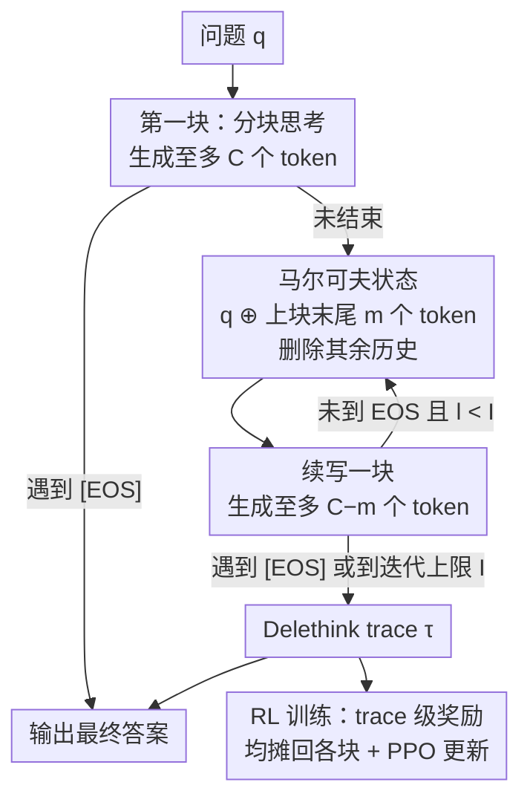

# The Markovian Thinker: Architecture-Agnostic Linear Scaling of Reasoning

**会议**: ICLR 2026  
**OpenReview**: [https://openreview.net/forum?id=3As6AQ9ELI](https://openreview.net/forum?id=3As6AQ9ELI)  
**代码**: 无（论文称基于 verl + sglang 实现，未明确放出仓库）  
**领域**: LLM推理 / 强化学习 / LLM效率  
**关键词**: 马尔可夫思考, 长链推理, RLVR, 线性计算, KV cache

## 一句话总结
本文提出 **Delethink**：让推理大模型把一条超长思维链拆成若干固定长度的"块"，每一块只携带上一块末尾的少量 token 作为"马尔可夫状态"、删掉其余历史，从而在**不改动任何模型结构**的前提下，把推理的计算从二次降到线性、显存保持常数，并能直接用 RL 训练，效果追平甚至超过标准长链思考（LongCoT）。

## 研究背景与动机

**领域现状**：当前推理大模型（o1、DeepSeek-R1、Qwen3-Thinking 等）靠在给出答案前生成一长串"思考 token"（LongCoT）来提升能力，思考越长性能越好，已成为 RLVR（带可验证奖励的强化学习）和 test-time scaling 的主流范式。

**现有痛点**：思考 token 线性增长，但自注意力是二次复杂度，导致训练和推理成本二次爆炸。一次 1M-token 上下文的前向比 32K 贵 1000 倍以上；吞吐与上下文长度成反比，1M 上下文相比 32K 掉速 30 倍以上。这让"想得更久"在工程上变得不可承受。

**核心矛盾**：思考长度被**上下文长度**死死绑定——想多思考就必须把全部历史塞进上下文，而上下文一长，注意力的二次代价就躲不掉。

**本文目标**：在不近似注意力、不替换架构、不蒸馏更短轨迹的前提下，让模型"用线性计算思考更多"，而不是"用更少思考省成本"。

**切入角度**：作者提出一个反直觉的假设——模型续写下一步推理，真的需要看到**全部**思考历史吗？还是只要保留**最近的一小段**就足够推进？如果后者成立，就能把上下文长度与思考长度解耦。

**核心 idea**：把推理过程改造成**马尔可夫**的——下一步只依赖原始问题 + 上一块思考的末尾片段（一个充分的"马尔可夫状态"），其余历史直接删除。这样思考可以无限延长，而每块上下文始终是常数，计算线性、显存恒定。

## 方法详解

### 整体框架

Delethink 把"一条长思维链"重写成"一串短块（chunk）的序列"，称为 **Delethink trace**。给定问题 $q$，第一块照常生成至多 $C$ 个思考 token；如果没遇到 `[EOS]`，就丢掉这块的大部分内容，只把它末尾的 $m$ 个 token 接到原始问题后面，构成下一块的输入，再生成 $C-m$ 个新 token。如此循环，直到模型输出 `[EOS]` 或达到迭代上限 $I$。整条轨迹模型最多能思考 $C+(I-1)(C-m)$ 个 token，而每一块的上下文始终被 $|q|+C$ 这个常数封顶——思考长度因此与上下文长度彻底解耦。

这套机制有两种用法：**Delethink Inference**（零样本，直接套在现成模型上）和 **Delethink Training**（用 RL 把模型训成"原生马尔可夫思考者"）。训练时同样按上面的方式采样整条 chunk 序列，对整条轨迹算一个奖励，再把奖励均摊回每一块、用类 GRPO/PPO 的目标更新模型。

### 关键设计

**1. Delethink trace：把长链拆成定长块，用固定上下文换线性计算**

针对"思考长度被上下文绑死"这个根本痛点，Delethink 不再生成一条单体长轨迹，而是生成一串短块。每块的思考上下文被固定为 $C$（如 8K）。形式化地，第一块 $y_1\sim\pi(\cdot|x_1=q)$；若未结束，第 $l$ 块的输入为 $x_l = q \oplus y_{(l-1)}[-m:]$（$l\ge 2$），即原始问题拼上一块末尾 $m$ 个 token，然后生成至多 $C-m$ 个新 token。由于问题 $q$ 固定且实践中 $|q|\ll C$，每块的最大上下文是 $O(C)=O(1)$，与总思考 token 数无关。这正是"delete + think"名字的由来——构造下一块输入时，前面的推理 token 被**删掉**。它和"砍思考长度求省成本"的工作正交：不是为了同样性能用更少 token，而是为了更好性能用**更长**轨迹。

**2. 马尔可夫状态：只保留末尾 m 个 token 作为"续写所需的充分状态"**

这是整个范式成立的关键赌注：作者假设续写推理只需要最近一小段思考，而非全部历史。于是每次跨块只携带上一块末尾的 $m$ 个 token（论文固定 $m=C/2$），把它当作一个"马尔可夫状态"——下一步推理只依赖这个状态，不依赖完整思考史。一个工程细节是，初始块开头的约 100 个 token（通常含规划性内容）会被折叠进 $q$ 一并保留。令人意外的是，这种激进的删除在零样本下就有效：现成推理模型即便从未为此训练，也表现出"潜在的马尔可夫行为"——只带最近几千 token 续写，性能就能追平甚至超过 LongCoT。直觉上，$m$ 太小会让模型"丢失推理线索"，所以需要 $C$ 足够大（R1-Distill 需 $C\ge 8$K、Qwen3-30B 需 $C\ge 16$K）才能稳定进入马尔可夫状态。

**3. Delethink Training：在 chunk 序列上做 RL，把零样本能力固化成原生能力**

零样本 Delethink Inference 有个隐患：模型不知道迭代上限 $I$，可能过早 `[EOS]`（欠思考）或迟迟不停（过思考）。Delethink Training 用 RL 解决这点。目标是最大化期望奖励 $J(\theta)=\mathbb{E}_{q,\tau}[R(\tau)]-\beta\,\mathrm{KL}[\pi_\theta\|\pi_{\mathrm{ref}}]$，其中 $\tau$ 是按 Delethink 采样的整条 chunk 序列，$R(\tau)$ 是 trace 级奖励（如最后一块是否答对）。损失把每条轨迹按其总思考 token 数 $\ell(\tau)=\sum_l |y_l|$ 归一化，再对每一块套用 PPO 的截断重要性采样目标：

$$U(x,y,\theta)=\sum_{t=1}^{|y|}\min\Big(\tfrac{\pi_\theta(y_t)}{\pi_{\theta_{\mathrm{old}}}(y_t)}\hat A_t,\ \mathrm{clip}\big(\tfrac{\pi_\theta(y_t)}{\pi_{\theta_{\mathrm{old}}}(y_t)},1-\epsilon,1+\epsilon\big)\hat A_t\Big)-\beta\,\mathrm{KL}[\pi\|\pi_{\mathrm{ref}}]$$

优势 $\hat A_t$ 直接用 GRPO 形式：组内对 $G$ 条轨迹的奖励做标准化 $A_{\tau_g}=(R(\tau_g)-\mu)/\sigma$，同一条轨迹的所有块共享同一优势——直觉就是"答对了，就提高这条轨迹里每一块的概率"。整个目标几乎和标准 LLM RL 一致，因此能无缝接入现有 GRPO/PPO 框架。训练还顺带让模型学会"预算意识"：超过 $I$ 的轨迹被惩罚、守规矩的被奖励，于是正确轨迹随训练变长（充分利用预算）、过思考轨迹变短。

### 损失函数 / 训练策略
- 模型：R1-Distill-Qwen-1.5B；数据：DeepScaleR（40k 道可验证数学题），更长预算实验用更难的 OpenMath。
- 主设置：迭代上限 $I=5$、块上下文 $C=8$K、$m=C/2=4$K，总思考预算 24K（与 LongCoT-24k 对齐）。
- 优化：1000 个 RL step，学习率 $1\text{e-}6$，每 step 采 128 题、每题 8 条响应；8×H100，无序列并行；verl + sglang 实现。
- 长预算实验：固定 $C=8$K、把 $I$ 从 5 提到 23 得到 96K 预算，从 24K checkpoint 续训 150 步。

## 实验关键数据

### 主实验（计算复杂度对比）

| 指标 | Base ($n$ token) | LongCoT (放大 $S$ 倍) | Delethink (放大 $S$ 倍) |
|------|------|------|------|
| 思考 token | $n$ | $nS$ | $nS$ |
| FLOP | $O(n^2)$ | $O(n^2S^2)$ | $O(n^2S)$ |
| 峰值显存 | $O(n)$ | $O(nS)$ | $O(n)$ |
| 反向/生成时间 | $T$ | $O(TS^2)$ | $O(TS)$ |

核心结论：LongCoT 各项随思考长度二次增长，Delethink 全部线性、显存恒定。在 1M token 处 Delethink 实测可省约 **17× FLOP**。

| 场景 | Delethink | LongCoT-24k | 备注 |
|------|-----------|-------------|------|
| 24K 训练后基准性能 | 追平/略超 | 基准 | 同等 RL step 下 Delethink 反超 |
| 每个 RL step 用时 | 215s | 248.5s | Delethink 更快 |
| 生成吞吐（token/s/H100） | 8,500 | 6,000 | — |
| KV cache 显存 | −70% | 基准 | — |
| 训练 96K 平均长度模型估算 | 7 H100-月 | 27 H100-月 | LongCoT 二次代价 |

### 消融实验

| 配置 | 关键现象 | 说明 |
|------|---------|------|
| 块上下文 $C$=8K/4K/2K（预算固定 24K） | 8K≈4K，2K 落后但仍随训练提升 | $C$ 太小则马尔可夫状态 $m$ 不足、丢失推理线索 |
| LongCoT-8k vs Delethink-24k | LongCoT-8k 落后 5.5% | 证明多出的 16k 思考预算确有必要，且 Delethink 学会用它 |
| 零样本 R1-Distill@128K | AIME'24 涨 9%，持续提升到 128K | LongCoT 约 40K token 就饱和 |
| Qwen3-30B 需 $C\ge16$K | 8K 仍 scale 但 profile 不同 | 不同模型进入马尔可夫态所需上下文不同 |

### 关键发现
- **现成模型天生就有"潜在马尔可夫性"**：无需训练、无需 prompt，只带最近几千 token 续写就能追平 LongCoT，说明长历史里的大部分对续写是冗余的。
- **Delethink 才是真正的 test-time scaling**：LongCoT 一旦超过训练时预算就迅速饱和，而 Delethink 训练在 24K、推理却能涨到 100K+ token，有些 AIME'25 题要到 140K token 才解出。
- **零样本的边界在"状态压不进 $m$"时暴露**：CrossWordBench 这类需要维护实时网格/已填词的任务，删历史等于丢已找到的词，14×14 难题上 Delethink 明显落后——提示这类任务需要**原生**马尔可夫训练。
- **32K 是 Delethink 提速的拐点**：32K 以下因非注意力模块占主导，Delethink 反而可能略慢；超过后注意力二次项主导，Delethink 越来越快。

## 亮点与洞察
- **架构无关**：不近似注意力、不换 Mamba、不加可学习的 eviction gate，模型权重和结构完全不动，纯靠改造"推理过程的组织方式"就拿到线性计算——和线性注意力/KV 压缩等路线正交，可叠加。
- **把"删除"当特性而非缺陷**：传统思路是"如何保留更多上下文"，本文反过来证明"主动删历史 + 只留充分状态"反而解锁了更长的有效思考，这个视角转换很巧妙。
- **trace 级奖励均摊回 chunk** 的设计让多块轨迹能无缝接入标准 GRPO/PPO——"答对就抬高整条轨迹每一块的概率"，工程上几乎零改造成本，可直接迁移到任何带可验证奖励的长推理 RL 任务。
- **解耦思考长度与上下文长度**，原则上为"百万 token 线性计算、常数显存"的下一代推理模型开了门。

## 局限与展望
- **任务状态必须能压进 $m$**：当推理需要维护无法压缩的全局状态（如填字游戏的实时网格、长程符号约束），删历史会直接丢信息，零样本 Delethink 在 14×14 CrossWordBench 上落后；作者承认这类场景需要原生训练，但未给出训练后能否补齐的证据。
- **$C$、$m$、$I$ 需按模型/任务调**：不同模型进入马尔可夫态所需的最小上下文不同（R1-Distill 8K vs Qwen3 16K），$m=C/2$ 是固定经验值，缺乏自适应机制。
- **训练规模有限**：RL 训练只在 1.5B 模型 + 数学题上验证，更大模型的原生训练、以及代码/PhD 推理上的原生训练效果仍是开放问题（这些只做了零样本推理）。
- **改进思路**：让马尔可夫状态从"末尾 $m$ 个 token"升级为可学习的压缩状态（类似一个学出来的 summary/记忆槽），或许能在保持线性的同时解决状态压缩瓶颈。

## 相关工作与启发
- **vs 推理压缩类（摘要/剪枝/早退，如 InftyThink、Lin et al.）**: 它们都在"砍思考长度"上做文章，但仍受二次代价束缚且常被固定模式锁死（蒸馏自人工数据集）；Delethink 反其道追求"更长轨迹换更好性能"，且通过 RL 学习而非固定模板。
- **vs 线性架构（Mamba / 线性注意力 / 稀疏注意力）**: 它们靠近似或替换注意力来去二次项，需要改模型结构；Delethink 不动模型、不做近似，正交且可叠加。
- **vs KV eviction / 压缩（H2O、StreamingLLM、量化）**: 这些在推理时对一条长链的 KV 做选择或压缩；Delethink 则**重构并学习**推理过程本身，让一开始就只需要短上下文，从源头消除长 KV。

## 评分
- 新颖性: ⭐⭐⭐⭐⭐ "马尔可夫思考"范式视角新颖，把删历史变成特性，且架构无关
- 实验充分度: ⭐⭐⭐⭐ 零样本覆盖 1.5B–30B 多模型多任务，但 RL 训练只在 1.5B 数学上验证
- 写作质量: ⭐⭐⭐⭐⭐ 动机清晰、公式与复杂度分析完整、失败案例诚实
- 价值: ⭐⭐⭐⭐⭐ 为线性计算、常数显存的超长推理打开通路，工程落地成本低

<!-- RELATED:START -->

## 相关论文

- [\[ICLR 2026\] Structured In-context Environment Scaling for Large Language Model Reasoning](structured_in-context_environment_scaling_for_large_language_model_reasoning.md)
- [\[ICLR 2026\] Chessformer: A Unified Architecture for Chess Modeling](chessformer_a_unified_architecture_for_chess_modeling.md)
- [\[ICLR 2026\] RESCHED: Rethinking Flexible Job Shop Scheduling from a Transformer-based Architecture with Simplified States](resched_rethinking_flexible_job_shop_scheduling_from_a_transformer-based_archite.md)
- [\[ICLR 2026\] The Art of Scaling Reinforcement Learning Compute for LLMs](the_art_of_scaling_reinforcement_learning_compute_for_llms.md)
- [\[ICLR 2026\] Replicable Reinforcement Learning with Linear Function Approximation](replicable_reinforcement_learning_with_linear_function_approximation.md)

<!-- RELATED:END -->
