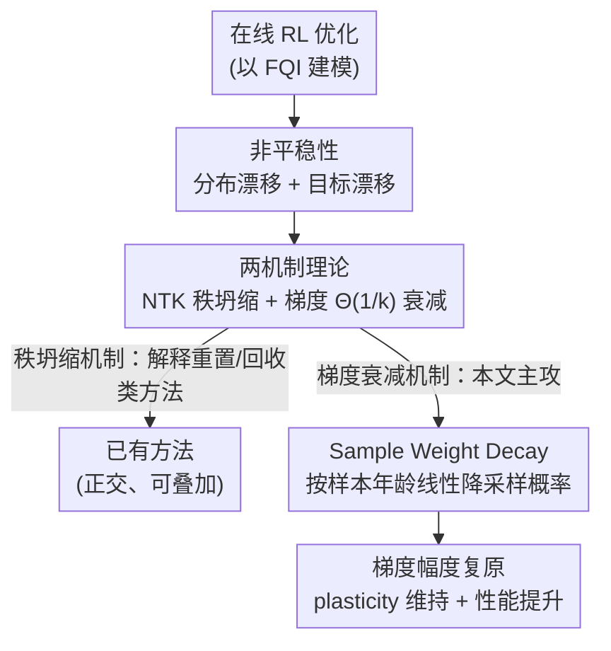

# The Rank and Gradient Lost in Non-stationarity: Sample Weight Decay for Mitigating Plasticity Loss in Reinforcement Learning

**会议**: ICLR 2026  
**OpenReview**: [https://openreview.net/forum?id=5DpzzTPnJZ](https://openreview.net/forum?id=5DpzzTPnJZ)  
**代码**: https://github.com/wzhhasadream/CleanRL-JAX  
**领域**: 强化学习  
**关键词**: 可塑性损失、神经正切核、梯度衰减、经验回放、样本加权

## 一句话总结
本文从网络优化的理论角度把深度强化学习的「可塑性损失」拆解为两个机制——NTK Gram 矩阵的秩坍缩与梯度幅度的 $\Theta(1/k)$ 衰减，并针对后者提出极轻量的 Sample Weight Decay（SWD）：让回放采样概率随样本「年龄」线性下降，从而补偿梯度衰减、维持学习能力，在 MuJoCo / ALE / DMC 上稳定提升 TD3、Double DQN、SAC 性能。

## 研究背景与动机
**领域现状**：深度强化学习（RL）把神经网络的强表达力和 RL 的训练范式结合，但随着训练推进，网络的学习能力会逐渐衰退——这就是「可塑性损失」（plasticity loss）。社区为此提出了一堆补救手段：网络重置（Network Reset）、休眠神经元回收（ReDo）、可塑性注入（Plasticity Injection）、基于梯度幅度的重置（ReGraMa）等。

**现有痛点**：这些方法几乎全是**经验直觉驱动**的——它们观察到某种现象（神经元休眠、激活稀疏），然后设计一个对症的干预，却说不清「可塑性损失为什么会发生」「不同底层机制各自贡献了多少」。理论侧基本是空白，导致补救手段彼此孤立、缺乏统一解释。

**核心矛盾**：RL 的优化过程本质是**非平稳**的——每一轮迭代损失函数都在变，相当于不断开启新的优化「任务」，而且每个新任务的初始点恰好是上一轮优化的终点（不像监督学习从随机初始化开始）。这个「序贯初始化」机制究竟如何损害优化，是没人从理论上讲清的关键。

**本文目标**：(1) 建立一个统一理论，解释可塑性损失的来源；(2) 据此设计一个有理论支撑、即插即用的补救方法。

**切入角度**：作者把 RL 优化抽象为 Fitted Q-Iteration（FQI），把「损失函数随迭代演化」归结为**初始化点性质**问题，再分析两个直接决定优化好坏的量——NTK 矩阵（决定网络拟合能力）和初始梯度幅度（决定逃离鞍点的速度）。

**核心 idea**：理论证明非平稳性会导致 NTK 秩坍缩 + 梯度按 $\Theta(1/k)$ 衰减；已有方法大多只触碰第一个机制，而本文专攻第二个机制——用一个随样本年龄线性衰减的采样权重，正面抵消那个 $1/k$ 因子，把梯度幅度「拉回来」。

## 方法详解

### 整体框架
本文是「一套理论 + 一个轻量算法」的组合。理论部分先把在线 RL 的非平稳性形式化为两个来源——**数据分布非平稳**（回放缓冲区的经验分布 $\mu_h^k$ 随训练漂移）和**目标非平稳**（bootstrapping 让 TD 目标 $T_h \hat f_{h+1}^k$ 不断变化）；再证明它们分别引发两个恶果：NTK Gram 矩阵的**秩坍缩**和初始梯度幅度的 **$\Theta(1/k)$ 衰减**。第一个机制从理论上印证了「重置/回收」类方法为何有效，第二个机制此前没被探讨——这正是 SWD 的发力点。算法部分则是一个只动采样概率、不碰网络结构的回放重加权策略：越新的样本采样概率越高，恰好把那个有害的 $1/k$ 因子抵消掉。

### 关键设计

**1. 双机制可塑性损失理论：把秩与梯度的「丢失」追溯到非平稳性**

这一步要回答「可塑性损失为什么发生」。作者从 FQI 的损失出发：第 $k$ 轮在步 $h$ 的损失为 $L_h^k(f,\hat f_{h+1}^k) = \frac{1}{|D_h^k|}\sum (f(s_h,a_h) - [r + \max_{a'}\hat f_{h+1}^k(s_{h+1},a')])^2$，并证明回放缓冲区的经验分布满足递推 $\mu_h^{k+1} = \frac{k}{k+1}\mu_h^k + \frac{1}{k+1}\hat d_h^{\pi_{k+1}}$（Proposition 1）——这说明**新策略采集的数据在分布里的权重只占 $1/(k+1)$**，越往后越被淹没。把这点代入初始梯度的分解（Theorem 3），得到关键结论：

$$\nabla \mathbb{E}_{\mu_h^k}\big[(f - T_h\hat f_{h+1}^k)^2\big]\Big|_{\hat f_h^{k-1}} = \underbrace{\tfrac{1}{k}\nabla \mathbb{E}_{\hat d_h^{\pi_k}}[\,\cdot\,]}_{\text{分布漂移}} + \underbrace{\mathbb{E}_{\mu_h^k}[\nabla f^2 \cdot (T_h\hat f_{h+1}^{k-1} - T_h\hat f_{h+1}^k)]}_{\text{目标漂移}}$$

其中分布漂移项带着一个 $1/k$ 系数——随着迭代数 $k$ 增大，初始梯度幅度趋近于零，优化器因而被困在鞍点附近（逃离鞍点的时间取决于初始梯度在负曲率方向上的投影幅度）。另一条线（4.1 节）则指出：随机初始化能以概率 1 保证过参数网络的 NTK 矩阵满秩、良条件，而 RL 从上一轮的 argmin 出发，破坏了这个前提，NTK 的秩与条件数不再有保障，从而拟合最优值函数的能力下降。两机制一个管「拟合能力（秩）」、一个管「拟合速度（梯度）」，共同构成可塑性损失，也统一解释了重置、回收、噪声注入等经验方法本质是在修复 NTK 的秩。

**2. Sample Weight Decay：用线性衰减的采样权重正面抵消 $1/k$ 梯度衰减**

既然分布漂移项的 $1/k$ 系数是梯度退化的根源，SWD 就直接在**数据分布层面**做手脚，而不改网络。它给回放缓冲区里每个样本按「年龄」赋一个线性衰减权重：$age_i = t - t_i$（$t$ 为当前训练步、$t_i$ 为采集步），$w_i = \max(w_{\min},\, 1 - \frac{age_i}{T})$，再归一化为采样概率 $p_i = w_i / \sum_j w_j$，最后按 Categorical 分布抽一个 batch。直觉上，越新的样本权重越高、被采到的概率越大，恰好「抬高」当前策略分布 $\hat d^{\pi_k}$ 在梯度里的贡献，中和掉那个把它压成 $1/k$ 的衰减系数，于是梯度幅度被维持在合适尺度、学习动态保持稳定。它的两个核心超参就是线性衰减步数 $T$ 和最小权重下限 $w_{\min}$。

SWD 最大的特点是**正交性**：已有方法（重置/回收/可塑性注入）改的是网络结构或参数，对应第一个机制；SWD 改的是采样分布，对应第二个机制。二者作用在不同环节，因此可以叠加协同——这点在实验里用 SWD+S&P 取得最好成绩得到验证。同时它极其轻量，只是把均匀采样换成带权采样，几乎不增加计算（作者还给了基于分桶的近似进一步降开销）。

**3. 反向验证 SWA：用「反着加权」证明「偏好新样本」才是关键**

为了证明 SWD 的方向是对的而非随手调出来的，作者刻意设计了一个对照方法 Sample Weight Augmentation（SWA）——把权重规则反过来，给**越老的样本**越高权重。理论预测这会加剧梯度衰减、加重可塑性损失。实验（Humanoid-Run）三个证据齐全：SWA 性能持续低于 SWD 甚至低于均匀采样；SWA 的梯度 L1 范数在训练中更低（学习信号被削弱）；GraMa 指标显示 SWA 造成更稀疏的梯度、更严重的可塑性损失。这组「反向实验」直接为「偏好近期经验对非平稳 RL 至关重要」这一理论假设提供了因果证据。这里 GraMa 是衡量可塑性的指标（来自 ReGraMa），值越大代表网络学习能力越弱。

## 实验关键数据

实验围绕五个问题展开：SWD 是否普遍提升主流 RL（Q1）、时间加权是否真的缓解可塑性损失（Q2）、能否适配高 UTD（Q3）、与其他可塑性方法的比较与组合（Q4）、超参敏感性与衰减策略（Q5）。基座覆盖 TD3（MuJoCo, MLP）、Double DQN（ALE, CNN-MLP）、SimBa-SAC（DMC），并以 Prioritized Experience Replay（PER）作直接对照。

### 主实验

| 基座 / 基准 | 任务 | 结论 |
|------|------|------|
| TD3 / MuJoCo | Ant, HalfCheetah, Humanoid, Walker2d, Hopper | +SWD 普遍提升样本效率与最终策略，Ant / Humanoid 上尤为显著 |
| Double DQN / ALE | Phoenix, DemonAttack, Breakout | +SWD 一致提升回报与学习速度 |
| SimBa-SAC / DMC | Humanoid-Run/Walk, Dog-Run/Walk | +SWD 取得 DMC Humanoid 难任务上的 SOTA |
| SAC / DMC | 对照 PER | PER 需要数倍训练时间、提升却极有限，SWD 更高效 |

### 消融与分析实验

| 配置 | 关键指标 | 说明 |
|------|---------|------|
| SAC + SWD | 性能 / 梯度 L1 / GraMa 最优 | 完整方法 |
| SAC + SWA（反向加权） | 三项均最差 | 偏好老样本→梯度更小、GraMa 更大，反证 SWD 方向正确 |
| SAC（均匀采样） | 居中 | SWA < 均匀 < SWD |
| UTD=1/2/5（Humanoid-Run） | IQM +25.4% / +17.3% / +30.1% | UTD 越高（梯度更新越频繁）增益越大 |
| vs ReGraMa / S&P / Plasticity Injection | SWD 领先 | 在 SimBa 网络上优于 NTK 类方法 |
| SWD + S&P | 最佳 | 验证与 NTK 类方法正交、可协同 |

### 关键发现
- **机制对症性**：GraMa 分析显示 SWD 主要在训练**中后期**发力——早期梯度衰减本就不严重——与「$\Theta(1/k)$ 在 $k$ 大时才主导」的理论预测吻合。
- **UTD 越高越受益**：UTD=5 时增益最大（+30.1%），说明更新越频繁、$1/k$ 衰减越狠，SWD 的补偿价值越大，且无需针对 UTD 单独调参。
- **超参不敏感 + 线性最佳**：对 $T$ 和 $w_{\min}$ 做网格搜索表现稳定；线性衰减优于指数衰减和多项式衰减，呼应理论里衰减项正是线性的 $1/k$。
- **正交可叠加**：SWD 与重置/扰动类方法机制不同，SWD+S&P 取得最佳，印证「两机制分头治理」的设计哲学。

## 亮点与洞察
- **把经验现象翻译成理论根因**：用一个 $\mu_h^{k+1} = \frac{k}{k+1}\mu_h^k + \frac{1}{k+1}\hat d^{\pi_{k+1}}$ 的简洁递推，就把「新数据被淹没→梯度按 $1/k$ 衰减」讲清楚，顺带统一解释了重置/回收类方法在修 NTK 秩，这种「理论照进经验」很漂亮。
- **解法和病因严丝合缝**：病因是 $1/k$，药方就是线性权重 $1-age/T$，方向和量级都对得上，而不是泛泛地「优先近期样本」——这种「公式级对症」让方法可信度大增。
- **正交性是可迁移的设计思想**：把可塑性损失拆成「秩」和「梯度」两条独立战线，意味着数据层的重加权和模型层的重置可以并行使用。这种「先分解机制、再分头解决、最后叠加」的范式可迁移到其他「多因素退化」问题。
- **反向实验 SWA 的说服力**：与其只证明自己有效，不如构造一个理论上必败的对照，三个指标（性能/梯度范数/GraMa）同向坍塌，几乎等于做了一次因果实验。

## 局限与展望
- **理论建立在 FQI 等简化设定上**：核心定理针对最简 FQI 推导（虽称可扩展到更广值方法、熵正则 MDP），与实际深度 RL（连续控制、actor-critic、函数逼近误差）之间仍有距离，理论保证更多是「定性指引」而非严格覆盖实验设置。
- **只正面治第二个机制**：SWD 专攻梯度衰减，对 NTK 秩坍缩仍依赖外部重置类方法叠加；单独使用时秩坍缩问题并未被 SWD 解决。
- **线性年龄权重较朴素**：权重只看「样本年龄」，未结合 TD-error / 不确定性等信息，可能丢掉 PER 那类「重要性优先」的好处；如何把「近期偏好」与「重要性偏好」融合是自然延伸。
- **GraMa 单一可塑性度量**：可塑性评估主要靠 GraMa，若换用休眠神经元比例、有效秩等其他指标，结论的鲁棒性还需更多交叉验证。

## 相关工作与启发
- **vs ReDo / Plasticity Injection / 网络重置**：它们在**模型层**改结构或回收神经元，对应本文理论里的 NTK 秩坍缩机制；SWD 在**数据层**改采样分布，对应梯度衰减机制。区别在战线不同，因此可叠加而非互斥。
- **vs ReGraMa（GraMa 重置）**：ReGraMa 用梯度幅度指标来触发神经元重置（仍是模型层干预）；本文借用其 GraMa 作为可塑性度量，但解法换成数据层重加权，实验中 SWD 在 SimBa 上优于 ReGraMa，二者机制正交。
- **vs Prioritized Experience Replay（PER）**：PER 按 TD-error 优先采样以加速学习，关注「哪个样本信息量大」；SWD 按样本年龄线性加权，关注「补偿 $1/k$ 梯度衰减」。实验中 PER 训练成本高、提升有限，SWD 更轻更稳——两者出发点不同，原则上也可结合。

## 评分
- 新颖性: ⭐⭐⭐⭐⭐ 首次把可塑性损失从理论上拆成 NTK 秩坍缩 + $\Theta(1/k)$ 梯度衰减两机制，并给出对症的数据层解法。
- 实验充分度: ⭐⭐⭐⭐ 覆盖三大基准三种基座 + 反向验证 + UTD/正交性/超参分析，但多以聚合曲线呈现、缺逐任务数值表。
- 写作质量: ⭐⭐⭐⭐ 理论与方法逻辑链清晰、Takeaway 提炼到位；理论符号偏密，对非理论读者门槛较高。
- 价值: ⭐⭐⭐⭐⭐ 即插即用、几乎零开销、与已有方法正交可叠加，并在 DMC Humanoid 难任务取得 SOTA，落地价值高。

<!-- RELATED:START -->

## 相关论文

- [\[ICML 2026\] SPHERE: Mitigating the Loss of Spectral Plasticity in Mixture-of-Experts for Deep Reinforcement Learning](../../ICML2026/reinforcement_learning/sphere_mitigating_the_loss_of_spectral_plasticity_in_mixture-of-experts_for_deep.md)
- [\[ICML 2025\] Mitigating Plasticity Loss in Continual Reinforcement Learning by Reducing Churn](../../ICML2025/reinforcement_learning/mitigating_plasticity_loss_in_continual_reinforcement_learning_by_reducing_churn.md)
- [\[ICLR 2026\] Reinforcement Learning via Value Gradient Flow](reinforcement_learning_via_value_gradient_flow.md)
- [\[ICLR 2026\] QeRL: Quantization-enhanced Low-rank Reinforcement Learning for LLMs](qerl_beyond_efficiency_-_quantization-enhanced_reinforcement_learning_for_llms.md)
- [\[ICLR 2026\] Wavelet Predictive Representations for Non-Stationary Reinforcement Learning](wavelet_predictive_representations_for_non-stationary_reinforcement_learning.md)

<!-- RELATED:END -->
