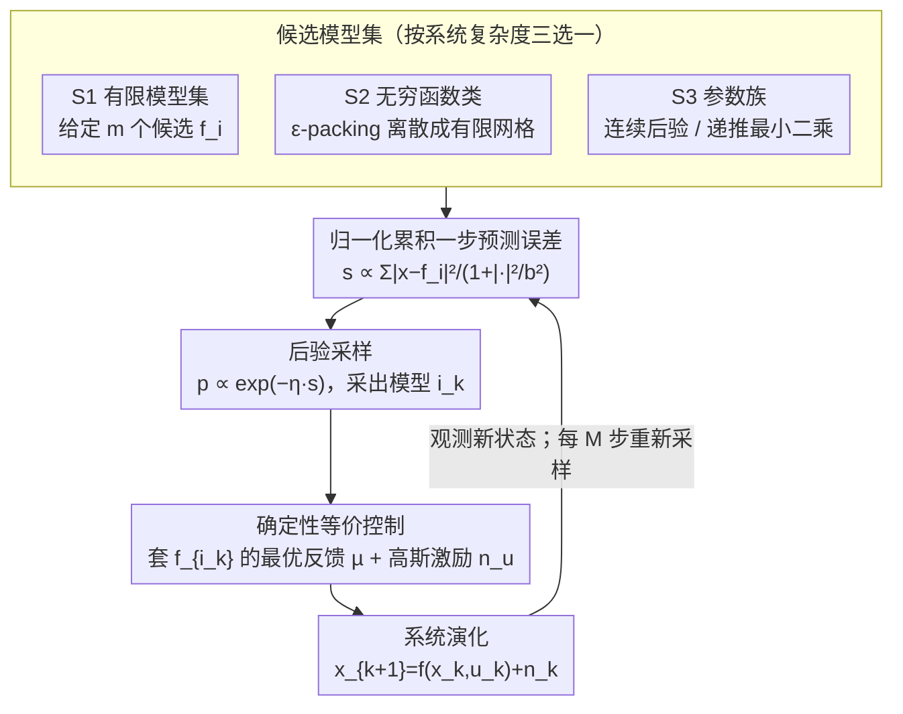

# The Sample Complexity of Online Reinforcement Learning: A Multi-Model Perspective

**会议**: ICLR 2026  
**arXiv**: [2501.15910](https://arxiv.org/abs/2501.15910)  
**代码**: 无  
**领域**: 强化学习 / 在线控制  
**关键词**: 样本复杂度, 在线强化学习, 多模型自适应控制, 策略遗憾, 非线性动力系统

## 一句话总结

本文为连续状态-动作空间下的非线性动力系统提出了一套在线强化学习算法，通过多模型后验采样和确定性等价策略实现对未知系统的在线学习，并给出了从有限模型集到参数化模型族的非渐近策略遗憾保证。

## 研究背景与动机

在线强化学习面临一个核心两难：决策者需要在**探索**（获取系统动态信息）和**利用**（优化性能）之间做出权衡。传统工作主要集中在线性动力系统（如LQR）上，利用两步策略（先辨识后控制）来分析样本复杂度。然而，现实中许多系统具有非线性动态（如机器人、交通系统等），且连续状态-动作空间下的在线控制分析远比离散情况复杂。

现有方法存在以下局限性：

**机器学习社区**（如Dean et al., 2018; Simchowitz & Foster, 2020）主要关注线性动力系统，依赖两步学习策略（交替进行最小二乘估计和最优控制设计），无法推广到非线性系统。

**自适应控制社区**（如Anderson et al., 2000; Hespanha et al., 2001）关注渐近稳定性和有界性，但缺乏非渐近性能刻画。

**近期在线切换控制工作**（如Li et al., 2023; Kim & Lavaei, 2024）虽然处理非线性动态，但遗憾上界在非稳定控制器数量上呈指数增长。

本文的动机是建立一个统一的分析框架，覆盖从有限模型集到无穷基数函数类再到参数化模型族的多层次系统复杂度，同时给出简洁、实用的在线学习算法。

## 方法详解

### 整体框架

本文考虑一个标准的随机非线性动力系统：

$$x_{k+1} = f(x_k, u_k) + n_k$$

其中 $f$ 是未知动态，$n_k \sim \mathcal{N}(0, \sigma^2 I)$ 是过程噪声，决策者要最小化累积损失 $\sum_{k=1}^N l(x_k, u_k)$。难点在于 $f$ 未知，必须边控制边把它辨识出来。

算法把这件事拆成一个"后验采样 + 确定性等价 + 持续激励"的闭环：每一步先根据迄今为止的轨迹给每个候选模型算一个一步预测误差，误差越小的模型越可能是真模型；据此从候选模型中按 softmax 分布随机采一个出来，把它当成真模型、直接套用它对应的最优反馈策略；同时在控制输入里掺一点高斯激励噪声，保证系统被持续激励、模型能被辨识出来。整篇论文的贡献是把这同一套机制贯穿三种由简到繁的模型复杂度——有限候选集（S1）、无穷函数类（S2）、连续参数族（S3）——并分别给出非渐近的策略遗憾界。下图把这个共享闭环画出来：三种设定只在"候选模型集怎么来"上不同，进入闭环后走的是同一套预测误差→后验采样→确定性等价控制→激励的流程。

### 关键设计

**1. 设定 S1：有限模型集——后验采样换来对数遗憾**

最基础的情形是给定 $m$ 个候选非线性模型 $\{f_1, \dots, f_m\}$，要在线挑出真正描述系统的那一个。算法为每个模型维护一份归一化的累积一步预测误差：

$$s_k^i = \sum_{j=1}^{k-1} \frac{|x_{j+1} - f_i(x_j, u_j)|^2}{1 + |(x_j, u_j)|^2 / b^2}$$

分母里的归一化因子 $1 + |(x_j, u_j)|^2 / b^2$ 是关键——它保证即使状态和输入变得很大，单步误差贡献仍然有界，从而 $s_k^i$ 不会被个别大幅度激励主导。然后以概率 $p_k^i \propto \exp(-\eta s_k^i)$ 采样模型索引 $i_k$。之所以用这个指数形式，是因为在高斯噪声假设下 $\exp(-s_k^i)$ 恰好正比于给定过去轨迹时模型 $f_i$ 的后验概率，所以这一步就是不折不扣的 Thompson Sampling；而 $\eta$ 则充当 softmax 温度，调节采样的"果断程度"。正是这种"一次观测同时更新所有候选模型证据"的特性，让策略遗憾只对模型数量取对数——定理 2.1 给出 $\mathcal{O}(\ln N + \ln m)$ 的界，时间水平与模型数量都只进对数。

**2. 设定 S2：无穷基数函数类——用 ε-packing 把无穷离散成有限**

当候选集 $F$ 不再是有限的、而是某个赋范向量空间里的有界集（如有界 Lipschitz 函数空间）时，没法直接对每个模型算误差。算法的做法是先用贪心覆盖构造一个 $\epsilon$-packing $F_\epsilon$，把无穷集近似成一个有限网格，再原样套用 S1 的后验采样框架。代价是引入了离散化误差，遗憾界因此变成两项的权衡（定理 2.2）：$\mathcal{O}(N\epsilon^2 + \ln(m(\epsilon))/\epsilon^2)$，前一项来自 $\epsilon$ 的逼近偏差、后一项来自 packing number $m(\epsilon)$ 带来的估计代价。对有界 $L$-Lipschitz 函数取最优 $\epsilon$ 后，遗憾增长率约为 $T^{(d_x+d_u)/(d_x+d_u+2)} = o(T)$，仍是无遗憾学习——只是随着状态-输入维度升高而逼近线性，体现了非参数情形固有的维度诅咒。

**3. 设定 S3：参数化模型族——连续后验直接采样**

当模型族写成参数形式 $F = \{f_\theta \mid \theta \in \Omega \subset \mathbb{R}^p\}$（如神经网络参数化）时，不必再离散化，算法直接从连续的后验分布里采样参数 $\theta_k$。这一情形最实用的特例是线性特征映射 $f_\theta(x,u) = \phi(x,u)^\top \theta$：此时后验是高斯分布，其均值与协方差可用递推最小二乘在线更新，每步只花 $\mathcal{O}(p^2)$ 计算，无需重新拟合整段轨迹。定理 2.3 给出 $\mathcal{O}(\sqrt{Np})$ 的遗憾，与线性系统在线学习的已知最优结果吻合，说明这套多模型视角把经典线性结论收纳成了一个特例。

### 损失函数 / 训练策略

算法无需显式训练，而是在线运行。关键技术要素包括：

1. **激励信号设计**：$\sigma_{u_k}^2 \propto 2/k + \ln(m)/k^2$，确保前期充分探索，后期逐渐减小
2. **模型切换间隔**：每 $M$ 步切换一次模型索引，保证持续激励条件被满足
3. **分析核心**：使用代价函数 $V$ 作为 Lyapunov 函数，通过条件分解 $\Pr(i_k = i^*)$ 和 $\Pr(i_k \neq i^*)$ 两种情况，结合模型收敛速率 $\Pr(i_k \neq i^*) \leq M^2/(k-M)^2$ 和可加性噪声的鞅结构建立遗憾界

## 实验关键数据

### 主实验

在20维状态、5维输入的线性时不变系统上验证，系统由4个5维泄漏积分器串联构成，输入到状态有5步延迟。

| 设定 | 算法 | 达到近最优性能所需步数 | 参数空间维度 |
|------|------|----------------------|-------------|
| S1 (有限模型) | 算法1 (100个候选) | ~10步 | 100个模型 |
| S3 (参数化) | 算法3 | ~60步 | $d_x^2 + d_x d_u = 500$ |

### 消融实验

| 配置 | 关键发现 | 说明 |
|------|---------|------|
| S1 vs S3 | S1收敛快6倍 | 有限模型集更高效但需要先验知识 |
| $\eta$ 参数 | 按理论选取即可 | $\eta \leq \min\{1/(4M\sigma^2), 1/(2ML^2b^2)\}$ |
| $\sigma_{u_k}$ 衰减 | 确保有界性和收敛 | 分两段：先保证识别再保证性能 |

### 关键发现

1. **模型基 vs 模型无关方法**：模型基方法中，单次迭代能提供所有候选模型精度的信息，故遗憾对模型数量的依赖为 $\mathcal{O}(\ln m)$；而模型无关方法中只能获得当前策略的信息，遗憾至少为 $\mathcal{O}(m)$。
2. **分离原则**：算法自然实现了非线性系统的分离原则——模型辨识和最优控制分离进行。
3. **状态有界性**：在 $l(x,u) \geq \bar{L}_l |x|^2/2$ 条件下，可保证 $\mathbb{E}[|x_k|^2]$ 一致有界，且仅需有限步的持续激励。
4. **有限时间收敛**：模型索引序列 $\{i_k\}$ 几乎必然在有限时间收敛到真实模型。

## 亮点与洞察

1. **统一框架**：三个设定（有限/无穷/参数化）在同一分析框架下处理，后两者自然退化为第一种情况的推广，分析路线清晰统一。
2. **实用性强**：特别是S1和S3的特殊情况（线性特征映射），算法只需高斯采样和递推最小二乘，实现简洁。
3. **恢复经典结果**：线性动力系统的遗憾界 $\mathcal{O}(\sqrt{T} \cdot (d_x^2 + d_x d_u))$ 与已有文献一致，验证了框架的正确性。
4. **理论贡献深刻**：揭示了模型基RL中对数依赖 $\ln(m)$ 与模型无关RL中多项式依赖 $m$ 的本质差异。

## 局限与展望

1. **持续激励假设**：Assumption 3.2 要求在任何初始状态和激励方差下都满足，对于某些退化系统可能难以验证。
2. **计算可行性**：S2中的 argmin 和 greedyCover 在一般情况下计算不可行，S2主要是理论兴趣。
3. **仅考虑状态完全可观**：未涉及输出反馈（部分可观）的情况。
4. **代价函数光滑性**：Assumption 3.1 要求代价函数的精确二次上下界，对于非标准代价可能过强。
5. **未涉及 $\mathcal{H}_\infty$ 设定**：仅考虑期望性能（$\mathcal{H}_2$），未讨论鲁棒（最坏情况）性能。

## 相关工作与启发

- **与 Thompson Sampling 的关系**：算法本质上是 Thompson Sampling 的非线性版本——从模型后验中采样并应用确定性等价策略。
- **与在线学习理论的连接**：有限模型集的 $\mathcal{O}(\ln m)$ 遗憾与在线学习/多臂赌机中的经典结果一致。
- **实际应用潜力**：由于算法简单且能自然融入先验知识，适用于智能交通系统、自动化供应链等工程场景。

## 评分

- 新颖性: ⭐⭐⭐⭐ （统一框架创新但核心技巧较标准）
- 实验充分度: ⭐⭐⭐ （仅线性系统验证，缺乏真正非线性的实验）
- 写作质量: ⭐⭐⭐⭐⭐ （结构清晰，证明思路展示出色）
- 价值: ⭐⭐⭐⭐ （理论贡献扎实，为非线性在线控制奠定基础）

<!-- RELATED:START -->

## 相关论文

- [\[ICML 2025\] The Sample Complexity of Online Strategic Decision Making with Information Asymmetry and Knowledge Transportability](../../ICML2025/reinforcement_learning/the_sample_complexity_of_online_strategic_decision_making_with_information_asymm.md)
- [\[ICLR 2026\] On the Generalization of SFT: A Reinforcement Learning Perspective with Reward Rectification](on_the_generalization_of_sft_a_reinforcement_learning_perspective_with_reward_re.md)
- [\[ICLR 2026\] Stackelberg Coupling of Online Representation Learning and Reinforcement Learning](stackelberg_coupling_of_online_representation_learning_and_reinforcement_learnin.md)
- [\[ICLR 2026\] Near-Optimal Second-Order Guarantees for Model-Based Adversarial Imitation Learning](near-optimal_second-order_guarantees_for_model-based_adversarial_imitation_learn.md)
- [\[ICLR 2026\] Exploratory Diffusion Model for Unsupervised Reinforcement Learning](exploratory_diffusion_model_for_unsupervised_reinforcement_learning.md)

<!-- RELATED:END -->
