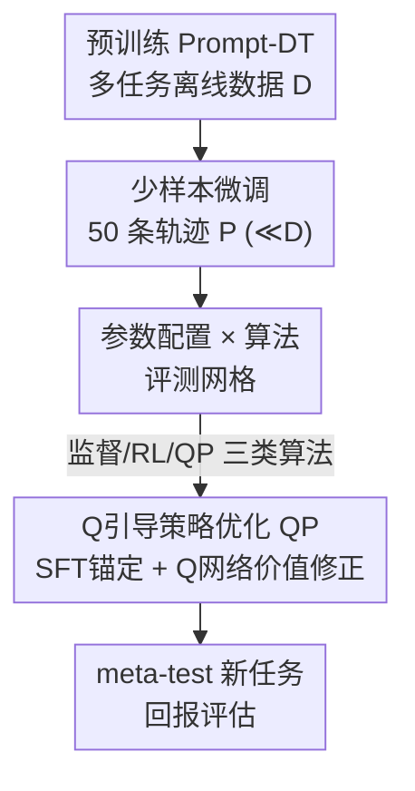

# The State of Reinforcement Finetuning for Transformer-based Agents

**会议**: ICLR 2026  
**OpenReview**: [https://openreview.net/forum?id=Cbg9MR6dR7](https://openreview.net/forum?id=Cbg9MR6dR7)  
**代码**: 无  
**领域**: 强化学习 / 决策Transformer / meta-RL / 强化微调  
**关键词**: 强化微调(RFT), Transformer Agent, meta-RL, Prompt-DT, Q引导策略优化

## 一句话总结
这篇论文系统性地把强化微调(RFT)搬到 Transformer-based Agent(TA)的少样本 meta-RL 适配上，沿「微调参数配置 × 微调算法」两条轴做了大规模实证对比，发现没有任何单一算法全场最优，并据此提出一个轻量增强 QP（Q-guided Policy Optimization），把 SFT 的稳定性和 RL 的策略改进能力拼到一起，在所有设置下稳定优于强 SFT/RFT baseline。

## 研究背景与动机
**领域现状**：以 OpenAI o1、DeepSeek-R1 为代表的大推理模型(LRM)已经把强化微调(RFT)做成了标配——用少量标注数据、靠迭代精炼就能提升推理、事实性和对齐。另一边，Transformer-based Agent（TA，如 Decision Transformer、Prompt-DT、Gato）把决策问题建模成序列建模，靠自回归解码器实现多模态、多任务、可扩展的通用决策，并能通过 zero-shot / few-shot 轨迹条件泛化到新任务。两者在「大规模预训练 + 少样本适配」这件事上高度同构。

**现有痛点**：尽管 TA 和 LRM 性质相近，但 TA 适配新任务时几乎清一色还在用监督微调(SFT)。SFT 只会模仿给定轨迹，被限制在数据分布内的动作上，泛化到新任务的能力有限；而 RFT 在语言、数学、代码等非 RL 领域已经证明了优势，却几乎没人系统验证它能不能帮到 meta-RL 里的 TA。

**核心矛盾**：纯监督方法稳定但只能停留在行为分布内（in-distribution），容易次优；纯 RL 方法（PPO、CQL）能突破分布外、但在严格离线、少样本(few-shot)的设定下，Q 网络因分布漂移估计不可靠、梯度方差大，训练容易震荡甚至发散。稳定性与策略改进能力之间存在直接冲突。

**本文目标**：拆成两件事——(1) 系统回答「在少样本 meta-RL 里，RFT 到底能不能、在什么条件下打过 SFT」；(2) 给出一个既稳又能改进策略的轻量方法。

**切入角度**：作者认为不能只比算法，要把「更新哪些参数」和「用什么损失」当成两条正交的轴一起扫，再叠加数据质量、轨迹数量、奖励稀疏性、预训练模型规模四个变量做消融，才能得到可迁移的结论。

**核心 idea**：用「监督锚定 + Q 网络价值修正」代替「纯模仿」或「纯 RL」，让策略在贴住行为分布的同时，向高回报动作小步外推。

## 方法详解

### 整体框架
论文做的事可以拆成两层：外层是一个**评测框架**——固定同一个预训练 TA（Prompt-DT），在每个新任务上用同样的 50 条少样本轨迹（仅占预训练数据 0.1%–1.1%）做微调，然后在「4 种微调参数配置 × 7 种微调算法」的网格里逐格对比；内层是据此提出的一个**新算法 QP**，作为对现有 RFT 的轻量增强。整个流程是：预训练 Prompt-DT → 选定一种参数配置 + 一种算法做少样本微调 → 在 meta-test 任务上评估回报，其中 QP 在监督损失之上挂了一个 Q 网络做价值引导。

### 关键设计

**1. 「参数配置 × 算法」二维评测网格：把适配拆成两条正交轴系统扫描**

作者认为以往只比「换什么损失」是不够的，「更新哪些参数」同样关键，于是把两者当成正交两轴。参数轴有 4 档，按可调参数量从小到大：Prompt Tuning（只更新轨迹提示参数，0.76KB）、Adaptor Tuning（在 MLP 层插 LoRA 模块，0.19MB）、Decorator Tuning（在冻结基策略上叠一个残差策略 $\pi_{\text{base}}(s)+\pi_{\text{res}}(s)$，0.54MB）、Fullmodel Tuning（全参微调，2.52MB）。算法轴有 3 类共 7 种：监督类（SFT、DPO）、在线 RL（GRPO、PPO）、离线 RL（CQL），再加上本文的 QP-SFT / QP-DPO。所有格子用同一预训练权重、同一批 50 条轨迹、同样迭代次数、各自网格搜超参取最优 checkpoint，保证公平。这套设计直接产出了论文最重要的结论：**没有单一算法全场最优**——监督方法偏好全参微调（信号能在全网络传播、收敛更强），而 RL 方法在参数高效配置（Adaptor/Decorator）下反而更稳，因为奖励信号噪声大、长视野下误差累积，全参更新会出现震荡。

**2. QP（Q-guided Policy Optimization）：给监督损失挂一个 Q 网络价值修正项**

这是本文针对「监督太保守、RL 太不稳」核心矛盾给出的方法。QP 不另起炉灶，而是在标准监督目标（SFT 或 DPO）上**加一个由 Q 网络引导的策略改进项**。以 QP-SFT 为例：

$$\mathcal{L}_{\text{QP-SFT}}(\theta) = \mathbb{E}_{(s,a)\sim P}\Big[\,|a-\pi_\theta(a|s)|^2 - \alpha\cdot Q_\phi(s,\pi_\theta(s))\,\Big]$$

第一项是标准模仿损失，把更新后的策略**锚定在行为分布**上；第二项是价值修正，鼓励策略选 $Q_\phi$ 预测回报更高的动作，$\alpha$ 控制修正强度。QP-DPO 同理，只是第一项换成 DPO 的偏好对数似然。其中 $Q_\phi$ 用双 Q 学习的 TD 损失训练，目标值取两个目标网络的较小者 $\hat Q_m = r + \gamma\min_{i=1,2}Q_{\phi'_i}(s',\hat a)$ 来抑制高估，$\hat a$ 由目标策略 $\pi_{\theta'}$ 给出。这样设计的好处是：模仿项保证不会偏离数据分布太远（治 RL 的发散），价值项又允许策略向分布外的高回报区域小步外推（治 SFT 的次优），把两者优点缝在一起。

**3. 四因子稳健性消融：刻画 RFT 在不同条件下的适用边界**

光有「平均更好」不够，作者进一步沿四个变量做消融，给出可操作的选型经验：(1) **数据质量**（Medium vs Expert）——RL 方法在 Expert 数据上增益明显（能利用最优轨迹做信用分配），监督方法反而更吃 Medium 数据（次优轨迹多、提供稳定的模仿下界）；(2) **轨迹数量**——加数据通常涨点，但 QP 在低数据下仍稳，纯监督在轨迹稀缺时掉得更快；(3) **奖励稀疏性**——稀疏奖励会放大算法差距，GRPO 显著退化，QP 最稳；有趣的是稀疏有时比稠密还好，因为低数据离线下稠密 TD 会把中间状态的价值近似误差反复回传造成偏差，而稀疏把回报集中到终止步、更接近 Monte-Carlo、对价值近似误差不敏感；(4) **预训练规模**——多数策略随模型增大而涨，但 Fullmodel 在大模型 + 少数据时会因可调参数暴涨而过拟合、出现平台甚至退化。

### 损失函数 / 训练策略
核心训练目标见上方 QP 公式（式 13/14），Q 网络用双 Q 的 TD 损失训练（式 15/16）。骨干是基于 minGPT 实现的 Prompt-DT，预训练用连续动作的 MSE 模仿损失 $\mathcal{L}_{DT}=\mathbb{E}[\frac{1}{K}\sum(a_{i,m}-\pi(\tau^*_i,\tau_{i,m}))^2]$。数据由 SAC 为每个训练任务单独训出的单任务策略采集，分 Medium / Expert 两档质量。

## 实验关键数据

### 主实验
环境：MuJoCo 运动套件（AntDir、HalfCheetahDir、HalfCheetahVel）+ MetaWorld（45 任务预训练，5 任务 meta-test）。每方法 50 条微调轨迹、3 个随机种子。下表为 Expert 数据下各参数配置的平均分（越高越好，HalfCheetahVel 为负值越接近 0 越好）。

| 参数配置 | Zero-shot | SFT | DPO | GRPO | PPO | CQL | QP-DPO | QP-SFT |
|--------|------|------|------|------|------|------|------|------|
| Prompt | 284.08 | 315.05 | 313.73 | 315.47 | 312.55 | 313.49 | **318.39** | 317.07 |
| Adaptor | 284.08 | 331.69 | 333.38 | 333.24 | 327.70 | 321.63 | **339.46** | 335.87 |
| Decorator | 284.08 | 321.73 | 314.66 | 313.04 | 323.03 | 322.83 | 330.08 | **334.16** |
| Fullmodel | 284.08 | 336.07 | 326.83 | 325.23 | 329.62 | 312.53 | 362.13 | **372.09** |

QP-SFT / QP-DPO 在每个参数配置下都拿到最高或接近最高的平均分；Fullmodel 配置下 QP-SFT 平均分 372.09，比 SFT(336.07)高约 36 分，比纯 RL 的 CQL(312.53)高约 60 分。在 MetaWorld（Fullmodel）单项上，QP-SFT 拿到 553.36，远超 SFT 的 441.05。

### 消融实验

| 因子 | 关键现象 | 说明 |
|------|---------|------|
| 参数配置 × 算法 | 监督方法偏好 Fullmodel，RL 方法偏好 Adaptor/Decorator | 信号传播 vs 噪声更新的差异 |
| 数据质量 | RL 吃 Expert，监督相对吃 Medium | RL 靠最优轨迹做信用分配 |
| 奖励稀疏 | GRPO 大幅退化，QP 最稳 | 稀疏下 TD 误差不再逐步回传 |
| 预训练规模 | Fullmodel 大模型 + 少数据出现退化 | 可调参数暴涨导致过拟合 |

### 关键发现
- **算法选择的影响常常≥参数规模的影响**：MetaWorld + Adaptor 下，把参数配置从 Adaptor 换到 Decorator 只涨约 3%，但把算法换成 QP-DPO 涨约 10%。
- **没有万能配置**：同一算法在不同环境/参数下表现差异大，需要自适应的微调策略，而非一招通吃。
- **QP 的优势在稀疏奖励下更突出**：QP 相对其他方法的领先幅度在稀疏设置比稠密设置更大，说明「模仿锚定 + 价值修正」在弱反馈下更稳。

## 亮点与洞察
- **把适配拆成正交两轴**：很多工作只比损失函数，本文坚持「参数配置 × 算法」一起扫，才暴露出「监督爱全参、RL 爱参数高效」这种与学习范式绑定的偏好，这个结论本身就很可迁移。
- **QP 是极简但对路的增强**：不改架构、不加新阶段，只在监督损失后挂一个 $-\alpha Q_\phi(s,\pi_\theta(s))$ 项，就把 SFT 的稳定性和 RL 的外推能力缝起来，工程上几乎零成本就能套到现有 SFT/DPO pipeline 上。
- **稀疏反而更好的反直觉解释**：作者没有含糊带过，而是点明这是低数据离线下的特定失败模式——稠密 TD 把中间价值近似误差反复回传，稀疏把回报集中到终止步、更像 Monte-Carlo，这个分析对设计离线 RFT 的奖励结构很有启发。

## 局限与展望
- **TA 限定在连续控制域**：本文的 TA 消费结构化状态、产出连续动作，结论是否迁移到语言动作的 LLM-agent 没有验证。
- **算法子集有限**：受算力限制只选了代表性算法（如未含更多离线 RL / 最新 RFT 变体），「无单一最优」的结论是在这个子集内成立。
- **Q 网络仍是离线估计**：QP 依赖 $Q_\phi$，在更极端的分布外或更稀疏覆盖下，Q 估计偏差可能反过来误导价值项，$\alpha$ 的选取仍需调。
- **缺少在线交互对照**：全程严格离线，PPO 这类 on-policy 方法天然吃亏，对它们的评价需要带上这个 caveat。

## 相关工作与启发
- **vs 纯 SFT 适配 TA**：现有 TA 适配几乎都用 SFT，只会模仿、停在分布内；本文证明在合适配置下 RFT/QP 能稳定超过 SFT，且 QP 保留了 SFT 的稳定性。
- **vs 纯 RL（PPO/CQL/GRPO）**：纯 RL 缺模仿带来的强先验，少样本离线下方差大、易震荡；QP 用模仿项锚定后再做价值引导，稳定性和平均表现都更好。
- **vs LRM 的 RFT（o1/R1）**：LRM 在语言域用 RFT 已成熟，本文把这套思路系统迁移到 meta-RL 的 TA，并指出连续控制 + 少样本离线这一新场景下的特有现象（如稀疏优于稠密）。

## 评分
- 新颖性: ⭐⭐⭐⭐ 系统性补上「RFT 用于 TA」的空白，QP 虽简单但角度正；偏经验研究 + 轻量方法
- 实验充分度: ⭐⭐⭐⭐⭐ 4 参数 × 7 算法 × 多环境 + 数据质量/数量/稀疏/规模四因子消融，覆盖很全
- 写作质量: ⭐⭐⭐⭐ 结论清晰、takeaway 明确，反直觉现象有机制解释
- 价值: ⭐⭐⭐⭐ 给 TA 适配提供了可操作的选型经验和一个即插即用的增强

<!-- RELATED:START -->

## 相关论文

- [\[ICLR 2026\] Vintix II: Decision Pre-Trained Transformer is a Scalable In-Context Reinforcement Learner](vintix_ii_decision_pre-trained_transformer_is_a_scalable_in-context_reinforcemen.md)
- [\[ICLR 2026\] Recurrent Action Transformer with Memory](recurrent_action_transformer_with_memory.md)
- [\[ICLR 2026\] Reinforcement Learning for Machine Learning Engineering Agents](reinforcement_learning_for_machine_learning_engineering_agents.md)
- [\[ICLR 2026\] Chunking the Critic: A Transformer-based Soft Actor-Critic with N-Step Returns](chunking_the_critic_a_transformer-based_soft_actor-critic_with_n-step_returns.md)
- [\[ICLR 2026\] Peak-Return Greedy Slicing: Subtrajectory Selection for Transformer-based Offline RL](peak-return_greedy_slicing_subtrajectory_selection_for_transformer-based_offline.md)

<!-- RELATED:END -->
