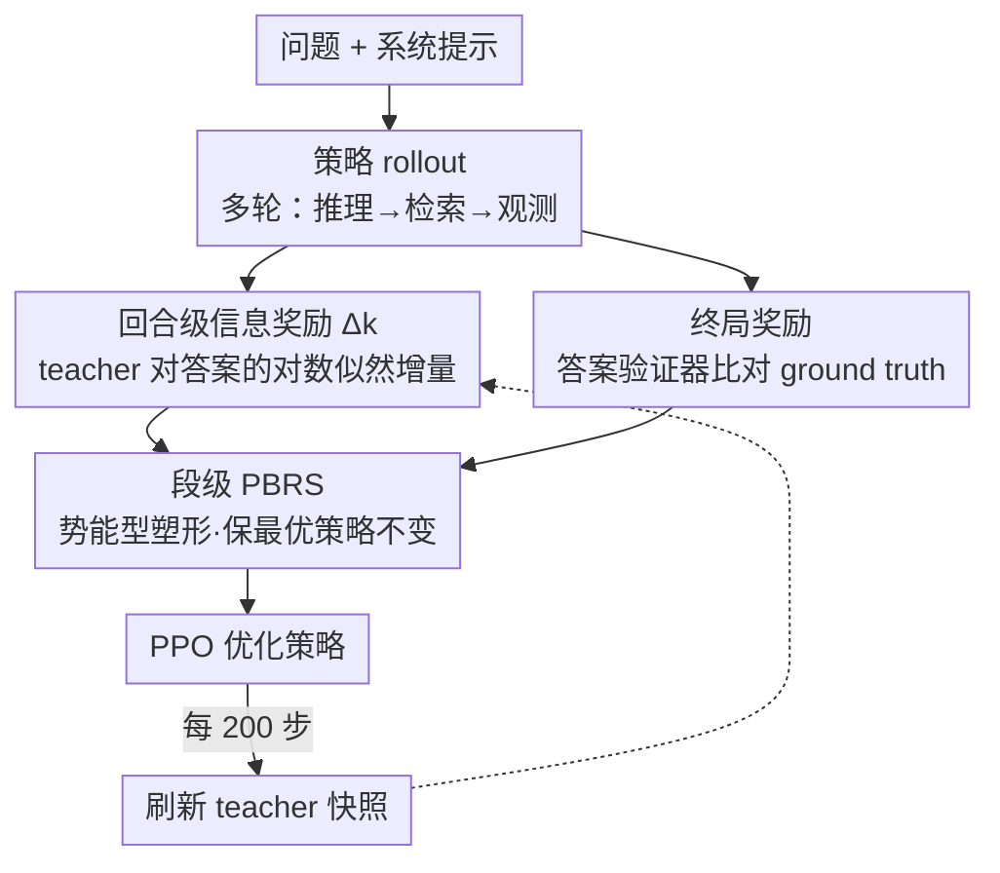

# TIPS: Turn-Level Information-Potential Reward Shaping for Search-Augmented LLMs

**会议**: ICLR 2026  
**OpenReview**: [https://openreview.net/forum?id=eBMOr6a84z](https://openreview.net/forum?id=eBMOr6a84z)  
**代码**: https://github.com/ucsd-wang-lab-lm/tips  
**领域**: 对齐RLHF / Agent / LLM推理  
**关键词**: 强化学习, 奖励塑形, 搜索增强LLM, 信用分配, 工具使用

## 一句话总结
TIPS 用「策略自己的滞后副本」当 teacher，给每个「推理+检索」回合打一个基于答案对数似然增量的稠密奖励，把它构造成势能型奖励塑形（PBRS）注入 PPO，从而在不训练额外奖励模型的前提下解决多轮工具使用 RL 的稀疏奖励与信用分配难题——在 7B 模型上平均 EM 比 PPO 高 11.8%、F1 高 13.6%，并显著缓解训练崩溃。

## 研究背景与动机

**领域现状**：搜索增强 LLM（边推理边检索的 QA agent）现在主流用可验证奖励的 RL 来训练——在一整轮多步交互结束时，比较最终答案和参考答案是否匹配，给一个终局奖励，然后用 PPO/GRPO 优化。这个范式很吸引人，因为它只需要在交互末尾定义「对/错」，中间允许模型自由地把推理、检索、工具调用交织起来。

**现有痛点**：但「只有终局奖励」对训练工具使用 LLM 非常脆弱。一条轨迹要走很多步推理和工具调用，模型却只在最后拿到一个标量信号，于是面临严重的**信用分配**问题：它无法判断中间哪一步检索真正有用、哪一步是冗余甚至误导。多轮工具使用比纯思维链更难，因为每次工具调用都是一次会改变信息状态的「离散干预」，而且很多条不同的中间轨迹会导向同一个终局结果（欠定）——对的答案可能是绕了冗余检索才得到的，错的答案可能源于早期一个无法挽回的错误。结果就是高方差更新、训练后期策略漂移或直接崩溃。

**核心矛盾**：想稠密化监督有两条老路，都不理想。一条是过程奖励模型（PRM）/过程监督，能给 token 级或 step 级奖励，但要么需要高质量中间标注，要么要离线训练一个独立奖励模型，而且它的监督粒度（token/step）和工具使用的语义单元（一个「推理+工具动作+观测」的回合）对不上。另一条是从环境反馈给回合级奖励（如 MT-GRPO），但它是为单次工具调用设计的，扩展到多次调用时信号变得不再有区分度，还会继承稀疏奖励基线的不稳定性。

**本文目标**：找到一种回合级反馈，同时满足三点——(i) 有区分度，能分辨有用和无用的工具交互；(ii) 轻量，不需要 token 级标注也不需要训练额外奖励模型；(iii) 兼容标准 RL 微调流程。

**切入角度**：作者的关键观察是——一个「好回合」的本质，就是它让正确答案在累积上下文下变得更可预测；一个「分心回合」则几乎不改变这种可预测性。既然如此，可以直接用模型自身对「正确答案」的对数似然变化来量化每个回合的信息贡献，完全不需要外部裁判。

**核心 idea**：用「策略的滞后冻结副本」作为 teacher，把回合 $k$ 的奖励定义为「附加这个回合后，teacher 对正确答案的对数似然增量」$\Delta_k$，并证明它正好是一个势能型奖励塑形项，因此在稠密化信号的同时不改变原任务的最优策略。

## 方法详解

### 整体框架

TIPS 的输入是一个搜索增强 QA 的多轮交互轨迹：系统提示 + 用户问题，之后 agent 反复进行「推理 → 发出检索 query → 接收检索结果」的回合，直到产出夹在 `<answer>` 标签里的最终答案。输出则是两路稠密奖励之和驱动的 PPO 更新。整条管线可以这样转：策略模型 rollout 出完整轨迹后，一路由答案验证器比对 ground truth 得到**终局奖励**；另一路由 teacher 模型逐回合度量「这一回合把正确答案的似然抬高了多少」得到**信息奖励** $\Delta_k$，注入到回合边界上；两路奖励合并后用 PPO 优化。关键在于 teacher 不是外部模型，而是被训练策略自己的一个定期刷新的冻结快照，所以整套方法只需要模型自身的 checkpoint，无需独立奖励模型 / 验证器 / 人工过程标注。

### 关键设计

**1. 回合级信息奖励：用 teacher 对正确答案的对数似然增量给每个回合打分**

针对的痛点是「终局奖励无法告诉你中间哪个检索有用」。TIPS 把交互拆成一连串「推理块 + 工具调用 + 返回证据」的回合，并为每个上下文 $S$ 定义一个**答案势能**——teacher 生成「任意一个正确答案」的对数概率：

$$\Phi(S) := L(S; A) = \log \sum_{m=1}^{M} p_{\text{teach}}(A^{(m)} \mid S),$$

其中 $A=\{A^{(1)},\dots,A^{(M)}\}$ 是该题的有效答案集合。回合 $k$ 的奖励就是这个势能的前后差：

$$\Delta_k = \alpha\,\big(\Phi(S_k) - \Phi(S_{k-1})\big),$$

$S_k$ 是截至并包含回合 $k$ 的上下文，$\alpha>0$ 是缩放系数。直觉上，检索到高相关段落的回合会让 teacher 对某个正确答案明显更自信（$\Delta_k>0$），而冗余或跑题的 query 几乎不改变信念、甚至把概率质量推向错误答案（$\Delta_k\le0$）。作者进一步指出 $\Delta_k$ 可解读为「该回合证据」与「答案正确」之间的一个缩放点互信息量——它度量新观测对「答案落在 $A$ 内」这一事件贡献了多少信息，这对 QA 特别自然，因为每次工具调用本就是为正确答案增量供证。

**2. 段级势能型奖励塑形（PBRS）：稠密化信号但保证最优策略不变**

最怕的是「加了中间奖励反而把模型带歪、改变了原任务目标」。TIPS 把每个回合当作 token 之间的一个「段」，并把整个回合视为段级 MDP 里的单个动作（动作涵盖推理、工具调用和观测）。以答案势能 $\Phi(S)$ 作为势能函数时，$\Delta_k=\alpha(\Phi(S_k)-\Phi(S_{k-1}))$ 正好匹配 Ng et al. (1999) 的势能型奖励塑形标准形式。在 episodic return（$\gamma=1$）且塑形只发生在段边界的条件下，回合 $k$ 内任意 token $t$ 的塑形后蒙特卡洛回报满足

$$G^{(R+I)}_t = G^{(R)}_t + \sum_{j=k}^{K}\Delta_j = G^{(R)}_t - \alpha\,\Phi(S_{k-1}),$$

（约定 $\Phi(S_K)=0$）。也就是说，塑形后的回报与原回报只差一个**只依赖段边界状态 $S_{k-1}$、与回合内动作序列无关**的常数。因此在原终局奖励下相对更优的动作，塑形后依然相对更优——这给了 TIPS 一个干净的解释：它是一种「保策略不变」地降方差、稳长程优化的手段。由于回合内每个 token 拿到的偏移都由回合前状态 $S_{k-1}$ 决定，TIPS 本质上是在校准优势基线（advantage baseline），既稠密化了学习信号、降低了「哪些回合有用」的歧义，又不动终局奖励下的最优策略。

**3. teacher 用「策略的滞后自副本」并定期刷新：无需外部裁判、信念不漂移**

如果 teacher 选一个和策略无关的强模型，会出现「teacher 觉得有用的，策略未必学得动」的错配。TIPS 让 teacher 就是当前策略的一个滞后冻结副本：两者的预测分布被刻意保持接近，所以能抬高 teacher 置信度的回合，往往也对策略本身有利。同时它定期（实验中每 200 步）刷新 teacher 快照，防止 teacher 的信念变得陈旧、与最新策略脱节。从 PBRS 视角看，刷新 teacher 只是更换了后续 rollout 用的势能函数，相当于换了一个（依赖状态的）基线，真实优势函数仍不变（实践中因 critic 是近似的，刷新后原始回报会有小幅抖动再重新稳定）。这个机制不需要任何外部判官，且因为可以在 teacher 前向时复用 KV cache，每步只增加约 12% FLOPs。

### 损失函数 / 训练策略

塑形后的回合奖励直接整合进标准 PPO（带 GAE，$\lambda=1$、$\gamma=1$，KL 惩罚 $\beta=0.001$，clip $\varepsilon=0.2$）。$\alpha$ 的选法是先跑一个短 pilot 估计 $|\Delta_k|$ 的典型量级，再固定 $\alpha$ 使 $\mathbb{E}[|\alpha\Delta_k|]\approx 0.2$——保证平均每回合信息奖励明显小于终局奖励，落在中段区间 $\alpha\in[0.05,0.3]$。检索用 E5 在 2018 Wikipedia 上每回合取 3 段，最多 4 个检索回合，在 NQ + HotpotQA 合并训练集上训 500 步（或直到崩溃到 0）。

## 实验关键数据

### 主实验

7 个 in-domain / out-of-domain QA benchmark 上的 Exact Match（EM），最后一列为 7 任务平均：

| 模型 | 方法 | NQ | HotpotQA | 2Wiki | MuSiQue | Bamboogle | Avg EM |
|------|------|------|------|------|------|------|------|
| Qwen2.5-7B | PPO | 41.95 | 34.46 | 32.94 | 8.94 | 35.40 | 37.28 |
| Qwen2.5-7B | GRPO | 37.15 | 26.54 | 19.41 | 7.20 | 16.00 | 28.54 |
| Qwen2.5-7B | MT-GRPO* | 37.17 | 29.28 | 22.62 | 7.99 | 19.20 | 30.42 |
| Qwen2.5-7B | **TIPS** | **43.38** | **42.95** | **42.96** | **17.05** | **36.80** | **41.71** |
| Qwen2.5-3B | PPO | 43.80 | 27.12 | 23.10 | 6.37 | 9.60 | 30.15 |
| Qwen2.5-3B | **TIPS** | 43.46 | **31.40** | **29.25** | **8.73** | **20.80** | **33.60** |

7B 上 TIPS 平均 EM 41.71 vs PPO 37.28（绝对 +4.43，相对约 +11.9%），F1 平均 51.24 vs 45.07（+13.7%）。最大涨幅集中在多跳 OOD 任务（2Wiki、MuSiQue、Bamboogle）这些 outcome-only 方法最吃力的地方；3B 上提升更温和、PPO 偶尔有竞争力。

跨模型族泛化（EM / F1，括号为相对 PPO 提升，FLOPs 仅 +~11.7%）：

| 模型 | EM | F1 | FLOPs 开销 |
|------|------|------|------|
| Qwen2.5-3B | 33.6 (+11.4%) | 41.1 (+10.2%) | 11.76% |
| Qwen3-4B | 48.4 (+7.3%) | 57.1 (+6.1%) | 11.85% |
| Qwen2.5-7B | 41.7 (+11.9%) | 51.2 (+13.7%) | 11.81% |
| Qwen2.5-14B | 45.4 (+12.7%) | 53.1 (+10.6%) | 11.81% |
| Llama3.1-8B | 40.3 (+34.0%) | 49.0 (+29.3%) | 11.66% |

Llama3.1-8B 起点检索能力弱，从更好的信用分配里获益最大（+34%）。

### 消融实验

稠密奖励来源对比（7 任务平均）：

| 方法 | EM | F1 | 说明 |
|------|------|------|------|
| PPO outcome-only | 37.28 | 45.07 | 仅终局奖励 |
| MT-PPO（规则回合级） | 29.49 | 36.57 | 规则信号反而掉点 |
| **回合级信息增益（TIPS）** | **40.93** | **49.49** | 本文 |
| History-max 信息增益 | 35.20 | 43.09 | 改用历史最大势能反而更差 |
| GRPO outcome-only | 28.54 | 35.49 | |
| Rubric（LLM-judge 回合级） | 28.23 | 35.54 | LLM 裁判信号太噪，几乎无增益 |

teacher 选择消融（固定策略骨干，换 teacher）：

| 策略 | 冻结自副本 | Qwen3-4B-TIPS | Llama3.1-8B |
|------|------|------|------|
| Qwen2.5-7B | **41.7 (+11.9%)** | 30.0 (−19.5%) | 29.0 (−22.2%) |
| Qwen3-4B | **48.4 (+7.3%)** | 45.88 (+1.7%) | 43.0 (−4.7%) |

### 关键发现
- **teacher 必须是策略的自副本**：换成一个异构的强模型当 teacher，性能不升反崩（7B 上 −19.5% ~ −22.2%）——印证了「teacher 与策略分布要保持接近」才是机制有效的关键，而非「teacher 越强越好」。
- **塑形系数 $\alpha$ 有清晰的甜区**：中段 [0.05, 0.3] 稳定且一致正收益；太小等于关掉塑形（退化成 PPO），太大让塑形项和终局奖励打架、增大梯度方差甚至崩溃（7B 上 small 区间直接 crash）。
- **不是所有稠密信号都管用**：规则回合级（MT-PPO/MT-GRPO）和 LLM-judge rubric 信号要么噪声大要么不稳，反而拖累；只有「信息增益」这种与答案似然直接挂钩的信号才稳定提升——说明稠密化的关键是信号质量而非有无。
- **稳定性来自优势分布**：TIPS 在最终 checkpoint 上呈干净的双峰、正质量集中；PPO 则重尾且大量质量堆在 0 附近，对应它后期的漂移/崩溃——这给「TIPS 为何更稳」提供了机制性解释。
- **teacher 刷新间隔**：N=200 附近是宽广最优，N=500 太稀疏会退化，但 N∈[100,500] 全都优于 PPO。

## 亮点与洞察
- **把「信息增益」严格落成 PBRS**：作者没有止步于「用似然增量当奖励」的直觉，而是证明它是势能差形式，因此理论上保最优策略不变——这让稠密塑形不再是「调参玄学」，而是有策略不变性保证的降方差手段。
- **teacher = 策略自副本，是又省又对的设计**：既绕开了「训练独立奖励模型 / 找人标过程」的成本，又天然保证 teacher 与策略分布对齐；KV cache 复用把开销压到 ~12% FLOPs，对 frontier 模型有可扩展性。
- **可迁移的洞察**：任何「终局奖励稀疏、中间有可验证目标分布」的多轮 agent 任务（代码执行、数据库查询、多工具规划），都可以套用「自副本 teacher + 答案势能差」这套塑形，把 outcome-only 信号稠密化而不改目标。

## 局限与展望
- **依赖「答案集合 $A$ 可枚举且 teacher 能对其打似然」**：在开放式生成、答案无法用小集合表示的任务上，$\Phi(S)$ 的定义会失效，TIPS 不直接适用（论文明确说这不是开放式生成任务）。
- **teacher 刷新带来的回报抖动**：近似 critic 下刷新 teacher 会让原始回报小幅漂移再重稳，长训练里刷新策略本身可能需要调。
- **$\alpha$ 仍需 pilot 估计**：虽然有中段甜区，但跨任务的最优 $\alpha$/刷新间隔仍要短跑标定，没有完全免调。
- **评测局限在搜索增强 QA**：跨工具类型（非检索）、跨更长 horizon（>4 回合）的有效性尚未验证。

## 相关工作与启发
- **vs PPO / GRPO（outcome-only）**：它们只在末尾给一个标量，信用分配靠模型自己猜；TIPS 在每个回合边界注入信息增益奖励，直接稠密化信号，7B 上平均 EM +11.9%，且避免了 GRPO 在 320–350 步的崩溃和 PPO 400 步后的停滞。
- **vs 过程奖励模型 / 过程监督（PRM）**：PRM 给 token/step 级奖励但需高质量中间标注或离线训奖励模型，粒度还和工具回合对不上；TIPS 不训额外模型、粒度天然是「回合」，更轻量也更贴合工具使用语义。
- **vs MT-GRPO / MT-PPO（规则回合级）**：它们从环境反馈给回合奖励，但为单次工具调用设计，多次调用时信号失去区分度、还继承稀疏基线的不稳定；TIPS 的信息增益信号在多跳任务上区分度更强、更稳。

## 评分
- 新颖性: ⭐⭐⭐⭐⭐ 把「自副本 teacher 的答案似然增量」严格构造成 PBRS，理论与实用兼得，角度新颖
- 实验充分度: ⭐⭐⭐⭐⭐ 7 benchmark + 5 个模型族/规模 + α/teacher/刷新间隔/稠密信号全套消融，证据扎实
- 写作质量: ⭐⭐⭐⭐ 动机—理论—实验链条清晰，PBRS 推导干净；部分附录细节需翻原文
- 价值: ⭐⭐⭐⭐⭐ 轻量、backbone-agnostic、可扩展到 frontier 模型，对多轮工具 agent RL 稳定化有普适价值

<!-- RELATED:START -->

## 相关论文

- [\[ICLR 2026\] Erase to Improve: Erasable Reinforcement Learning for Search-Augmented LLMs](erase_to_improve_erasable_reinforcement_learning_for_search-augmented_llms.md)
- [\[ICLR 2026\] Information Gain-based Policy Optimization: A Simple and Effective Approach for Multi-Turn Search Agents](information_gain-based_policy_optimization_a_simple_and_effective_approach_for_m.md)
- [\[ICLR 2026\] Occupancy Reward Shaping: Improving Credit Assignment for Offline Goal-Conditioned Reinforcement Learning](occupancy_reward_shaping_improving_credit_assignment_for_offline_goal-conditione.md)
- [\[ICLR 2026\] Learn to Reason Efficiently with Adaptive Length-based Reward Shaping](learn_to_reason_efficiently_with_adaptive_length-based_reward_shaping.md)
- [\[ICLR 2026\] Causally Robust Reward Learning from Reason-Augmented Preference Feedback](causally_robust_reward_learning_from_reason-augmented_preference_feedback.md)

<!-- RELATED:END -->
