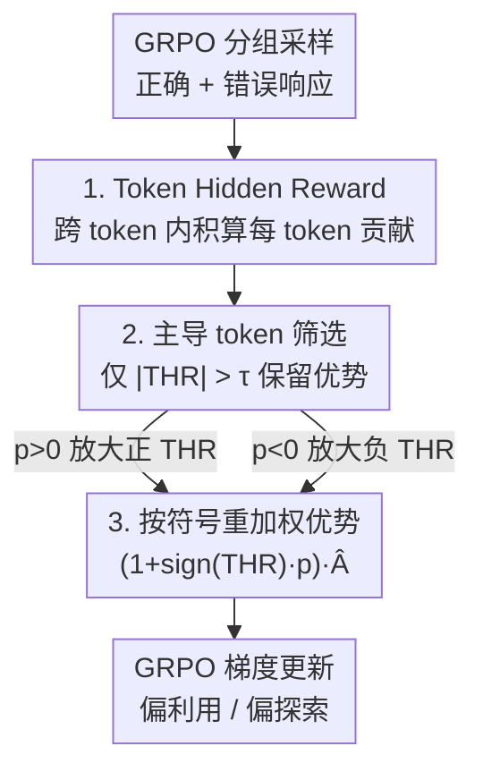

# Token Hidden Reward: Steering Exploration-Exploitation in Group Relative Deep Reinforcement Learning

**会议**: ICLR 2026  
**OpenReview**: [https://openreview.net/forum?id=htQDmHvva6](https://openreview.net/forum?id=htQDmHvva6)  
**代码**: 无  
**领域**: 强化学习 / LLM 推理  
**关键词**: GRPO, 探索-利用, token 级重加权, 学习动力学, RLVR

## 一句话总结
本文提出 Token Hidden Reward (THR)——一个量化每个 token 对"正确响应似然变化"贡献的 token 级指标，发现训练动力学被极少数高 |THR| token 主导，且 THR 的**符号**恰好对应探索/利用；据此设计了一个按符号重加权 GRPO 优势的算法，用一个超参 $p$ 就能把训练显式地推向利用（贪心解码精度↑）或探索（Pass@K↑）。

## 研究背景与动机

**领域现状**：带可验证奖励的强化学习（RLVR）已成为提升大模型推理能力的主力，其中 GRPO 及其变体（如 GSPO）因为去掉了价值网络、用组内相对奖励算优势而被 DeepSeek-R1、DeepSeek-Math 等广泛采用。

**现有痛点**：RL 训练绕不开探索-利用权衡——探索（采样不确定动作以获取新信息）对创造性任务和测试时 scaling 至关重要，利用（基于当前知识做最优决策）则适合医疗诊断这类要求高置信、低方差的场景。但**如何显式地把训练目标在探索和利用之间切换**，一直是个没解决好的问题。

**核心矛盾**：已有尝试都停在"粗粒度"层面。Best-of-n 训练要依赖外部 verifier；Pass@K 训练只按问题难度（hardness）重加权，是**问题级**的、对一道题内所有 token 一视同仁；基于熵的方法（如 COV-KL）只建模一个 token 对**自身**的影响。它们都忽略了：真正驱动训练的其实是 token 级的、而且是**跨 token 之间相互作用**的信号。

**切入角度**：作者顺着 Deng et al. (2025) 的学习动力学分析——该工作用无约束特征框架证明了"正确响应似然的变化率"由正确/错误响应中各 token 隐藏表示的内积项决定（Theorem 3.1）。作者由此意识到：可以把这个似然变化拆解到**单个 token** 上，得到每个 token 对模型"是否更相信正确答案"的精确贡献。

**核心 idea**：定义 token 级的 THR 来度量每个 token 对正确响应似然的贡献，并发现"放大正 THR token → 利用、放大负 THR token → 探索"，从而用一个统一的符号重加权机制精准操控探索-利用。

## 方法详解

### 整体框架

THR 不改动 GRPO 的采样与奖励流程，而是在**计算优势之后、回传梯度之前**插入一层 token 级的优势重塑。整条管线是：先在 GRPO 的一组 rollout（含若干正确响应 $\{y_i^+\}$ 与错误响应 $\{y_i^-\}$）上，为每个 token 算出它的 THR 分数（来自跨 token 隐藏表示的内积，正负都有）；接着只保留 $|\text{THR}|>\tau$ 的"主导 token"，把其余 token 的优势清零；最后对保留下来的 token 按 THR 的**符号**乘上一个 $(1+\text{sign}(\text{THR})\cdot p)$ 的因子——$p>0$ 推向利用，$p<0$ 推向探索——再喂回 GRPO 的目标函数训练。

### 关键设计

**1. Token Hidden Reward：把"似然变化"拆解到单个 token 上**

Deng et al. (2025) 证明，正确响应 $y_i^+$ 的对数似然变化率 $\frac{d}{dt}\ln\pi_{\theta(t)}(y_i^+\mid x)$ 随一个量增大而下降，该量由两部分内积构成——错误响应 token 与正确响应 token 的隐藏表示内积（负 THR 项）减去正确响应内部 token 之间的内积（正 THR 项）。本文把这个全局量精确归因到**单个 token** 上：对响应 $y_j$ 中第 $k'$ 个 token，定义

$$\text{THR}(y_i^+, y_j, k') = (2r_j-1)\cdot\sum_{k=1}^{|y_i^+|}\alpha_{k,k'}\cdot\langle h_{x,y_{i,<k}^+},\, h_{x,y_{j,<k'}}\rangle,$$

其中 $r_j\in\{0,1\}$ 是该响应的奖励（错误响应前缀因子 $2r_j-1=-1$，反映 GRPO 对它的惩罚），$\alpha_{k,k'}$ 衡量两 token 预测误差 $e_z-\pi_\theta(\cdot)$ 的相似度，内积项 $\langle h,h\rangle$ 则刻画隐藏表示的几何接近程度。由于 GRPO 一组里可能有多条正确响应，再对所有正确响应做长度归一化求和得到组级 $\text{THR}_{j,k'}=\sum_i \frac{1}{|y_i^+|}\text{THR}(y_i^+,y_j,k')$。它的**幅值**说明该 token 对训练的影响有多强，**符号**说明它是把正确响应的似然往上推还是往下拉。和只看 token 自身（如熵）的方法相比，THR 的关键区别在于它显式捕捉了**跨 token 的交互**。

**2. 主导 token 训练：极少数高 |THR| token 决定一切**

作者画出 THR 分数的密度分布发现：无论正确还是错误响应，绝大多数 token 的 THR 都挤在 0 附近，只有一小撮 token 有显著大的 |THR|——也就是说，训练动力学被极少数"主导 token"垄断。基于这个观察，设计了一个只保留主导 token 的训练目标：定义阈值 $\tau$（沿用 Deng et al. (2025) 的定义，取"某条正确响应 token 对其他正确响应似然的平均影响"），把低于阈值的 token 优势清零：

$$\hat{A}^{\text{THR}}_{i,k} = \mathbf{1}[|\text{THR}_{i,k}|>\tau]\cdot\hat{A}_{i,k}.$$

这叫 THR-only 训练。它的意义是验证性的：实验显示**只用主导 token 训练就能逼平用全部 token 的原版 GRPO**（无论贪心精度还是 Pass@K），从而坐实"少数高影响 token 决定性能"的论断，也为后面只对这批 token 动手脚提供了正当性——干预集中在真正起作用的地方，噪声 token 不掺和。

**3. 按 THR 符号重加权优势：一个超参 $p$ 切换探索与利用**

这是把"符号 ↔ 探索/利用"的洞察落成算法的一步。作者对探索/利用给出了基于似然的定义：**利用**等价于让观察到的正确响应似然增加得更多（强化对已知正确答案的置信）；**探索**等价于让它增加得更少，从而给其他候选输出保留概率质量。由于正 THR token 推高正确似然、负 THR token 压低它，只要按符号缩放优势即可调节这一权衡：

$$\hat{A}^{\text{THR}(p)}_{i,k} = \mathbf{1}[|\text{THR}_{i,k}|>\tau]\cdot\big(1+\text{sign}(\text{THR}_{i,k})\cdot p\big)\cdot\hat{A}_{i,k}.$$

当 $p>0$，正 THR token 被放大、负 THR token 被抑制，训练偏向**利用**，贪心解码精度上升；当 $p<0$ 则反过来，负 THR token 被抬高，给替代输出留出概率质量，训练偏向**探索**，Pass@K 提升。和 Pass@K 训练这类对一道题所有 token 统一缩放（式 (6)，按 $\sqrt{\binom{N^-}{K}/\binom{G}{K}}$ 等因子）的**问题级**重加权相比，THR 是**token 级**的、在同一道题内部对不同 token 区别对待，因而控制更细、更有针对性。

### 损失函数 / 训练策略
重加权后的 token 优势 $\hat{A}^{\text{THR}(p)}_{i,k}$ 直接替换原 GRPO 目标（式 (2)）中的 $\hat{A}_{i,k}$，其余（似然比裁剪 $\varepsilon=0.2$、KL 系数 $10^{-4}$）保持不变。训练在 MATH（level 3–5）上进行，4×A100、prompt batch 256、每 prompt 8 rollout、采样温度 1.0、学习率 $10^{-6}$，配合动态采样（丢弃零优势样本并重采样）跑 40 步约 2 个有效 epoch。该重加权可即插即用到其他组相对目标（如 GSPO-token）。

## 实验关键数据

### 主实验

**利用（greedy 解码精度，Table 1，总平均 %）**：$p>0$ 是最强的利用配置。

| Base Model | GRPO | THR ($p{=}0$) | THR ($p{=}{-}0.1$) | THR ($p{=}0.1$) |
|------------|------|------|------|------|
| Qwen2.5-Math-1.5B | 34.8 | 34.8 | 36.4 | 36.3 |
| Qwen2.5-Math-7B | 42.7 | 43.3 | 30.6→43.3* | **46.8** |
| Qwen2.5-0.5B-Ins | 10.0 | 10.9 | 12.1 | 11.8 |

\*7B 行 $p{=}{-}0.1$ 总平均为 44.0。论文口径：$p{=}0.1$ 相比 vanilla THR 在 1.5B/7B 上分别 +1.9%/+3.5%，相比 GRPO +1.1%/+4.0%。

**探索（Pass@K，Table 2，AIME24/25 + AMC23 平均 %）**：$p<0$ 在各模型尺寸上一致拿到更强的 Pass@K。

| 方法（Qwen2.5-Math-1.5B） | Pass@1 | Pass@128 | Pass@256 |
|------|------|------|------|
| GRPO | 21.3 | 67.3 | 72.5 |
| THR ($p{=}0$) | 20.3 | 67.5 | 72.5 |
| THR ($p{<}0$) | **21.9** | **69.7** | **76.7** |

论文口径：1.5B 上 $p{<}0$ 相比最佳 baseline 在 Pass@128 +2.4%、Pass@256 +5.0%；7B 上各 K 稳定约 +1%。在 AIME/AMC 这类难题上，1.5B 的 $p<0$ 甚至超过 $p>0$，说明难题更吃探索。

### 消融实验

| 对比维度 | 结论 |
|------|------|
| THR-only（仅主导 token）vs GRPO | 持平 → 少数主导 token 决定性能 |
| THR ($p{<}0$) token 级 vs Pass@K-mixed 问题级 | THR 各 K 一致领先 >1.1% |
| 直接叠加 THR($p{<}0$)+Pass@K-mixed | **反而变差**（Pass@K 给易题权重过低，削弱 THR 的 token 级探索） |
| THR($p{<}0$) vs COV-KL（熵正则） | THR 全 K 领先 → 跨 token 交互比单 token 自影响更有用 |
| THR ↔ 高熵 token 重叠率 | 峰值约 **90%**，THR 与熵强相关但更细 |

### 关键发现
- **符号才是关键**：THR 的正负直接对应利用/探索，且只用一个超参 $p$ 就能连续调节方向与强度，无需换损失或加 verifier。
- **干预要集中在主导 token**：因为高 |THR| token 本就垄断训练，对它们重加权才有杠杆；这也解释了为何只训练 top 高熵 token（~90% 重叠）就能逼平 GRPO。
- **细粒度胜过粗粒度**：token 级（THR）一致优于问题级（Pass@K）与单 token 熵（COV-KL）；但二者并非互斥——若用静态 $\chi\cdot$Pass@K$+(1{-}\chi)\cdot$GRPO（$\chi{=}0.2$ 保住易题权重），可在 7B 上小幅超过纯 THR($p{<}0$)。
- **泛化性**：接到 GSPO-token 上，$p{<}0$ 相比 THR($p{=}0$)/GSPO 各 +0.9%/+1.4%；换到 Llama3.2-3B-Instruct（数学更弱）仍能把 Pass@K 相比 GRPO 拉高最多 7%。

## 亮点与洞察
- **把一条全局动力学定理"反归因"到单个 token**：从似然变化率的内积公式里精确切出每个 token 的贡献，是这篇能成立的根。这种"先有 learning dynamics 理论、再倒推算法"的思路本身就很可复用。
- **符号即旋钮**：发现"正/负 THR ↔ 利用/探索"后，重加权因子 $(1+\text{sign}\cdot p)$ 简洁到几乎零成本接入任意组相对目标，工程友好度极高。
- **统一了三条看似无关的线**：把 Pass@K 训练（问题级）、熵正则（单 token 自影响）、动力学分析（跨 token 交互）放在同一框架下比较，说明它们是同一动力学的不同切面——这种"统一视角"对理解 RLVR 很有价值。
- **可迁移**：THR 这种"跨 token 隐藏表示内积 → token 贡献 → 按符号重加权"的范式，原则上能搬到代码生成、科学推理等其他 RLVR 域，甚至按训练进度/题目难度自适应调 $p$。

## 局限与展望
- **只在数学推理上验证**：训练/评测都在 MATH 与 AIME/AMC，没覆盖代码、开放域等其他 RLVR 任务，THR 的符号-探索对应是否普适未知。
- **$p$ 是固定超参**：实验用的是常数 $p$（0.1/−0.1 等），作者自己也把"按训练进度或题目难度自适应调 $p$"列为未来工作——固定 $p$ 在不同难度题目上不是最优。
- **依赖隐藏表示与误差向量的计算**：THR 需要算跨 token 的 $\langle h,h\rangle$ 和 $\alpha_{k,k'}$，相对 vanilla GRPO 有额外开销（虽与熵约 90% 重叠，可近似），论文未给出系统的计算成本分析。
- **理论基于无约束特征框架**：Theorem 3.1 的成立依赖该理想化假设，真实大模型训练中近似程度未充分讨论。

## 相关工作与启发
- **vs Deng et al. (2025)（负梯度分析）**：本文的直接来源。该工作只分析负梯度、只服务于利用（降低对正确响应有贡献的 token 的惩罚）；THR 把分析推广到正负两侧，同时覆盖探索与利用。
- **vs Pass@K 训练（Chen et al. 2025 等）**：他们按题目 hardness 做**问题级**重加权鼓励探索；THR 在同题内部按 token 区分，是更细的**token 级**控制，实测一致更优，且直接叠加二者反而互相削弱。
- **vs COV-KL（Cui et al. 2025，熵正则）**：用熵调节探索，但只建模 token 对自身的影响；THR 建模跨 token 交互，Pass@K 全面领先，且发现高 THR 与高熵 token 重叠约 90%，两者是同一现象的不同度量。
- **vs Best-of-n 训练（Chow et al. 2024）**：依赖外部 verifier 选最佳候选，扩展性差；THR 无需 verifier，纯靠内部学习动力学信号。

## 评分
- 新颖性: ⭐⭐⭐⭐⭐ 把学习动力学定理反归因到 token 级、并用符号统一操控探索-利用，视角新且落地干净
- 实验充分度: ⭐⭐⭐⭐ 三种模型尺寸 + GSPO + Llama + 对熵/Pass@K 的对照齐全，但仅限数学推理域
- 写作质量: ⭐⭐⭐⭐ 理论→洞察→算法→实验链条清晰，符号略密集需对照公式读
- 价值: ⭐⭐⭐⭐⭐ 给 RLVR 提供了一个即插即用、可解释的探索-利用旋钮，工程价值高

<!-- RELATED:START -->

## 相关论文

- [\[ICLR 2026\] Exploration vs Exploitation: Rethinking RLVR through Clipping, Entropy, and Spurious Reward](exploration_vs_exploitation_rethinking_rlvr_through_clipping_entropy_and_spuriou.md)
- [\[ICLR 2026\] LaSeR: Reinforcement Learning with Last-Token Self-Rewarding](laser_reinforcement_learning_with_last-token_self-rewarding.md)
- [\[ICLR 2026\] Spotlight on Token Perception for Multimodal Reinforcement Learning](spotlight_on_token_perception_for_multimodal_reinforcement_learning.md)
- [\[ACL 2026\] Semantic-Space Exploration and Exploitation in RLVR for LLM Reasoning](../../ACL2026/reinforcement_learning/semantic-space_exploration_and_exploitation_in_rlvr_for_llm_reasoning.md)
- [\[ICLR 2026\] Revisiting Group Relative Policy Optimization: Insights into On-Policy and Off-Policy Training](revisiting_group_relative_policy_optimization_insights_into_on-policy_and_off-po.md)

<!-- RELATED:END -->
